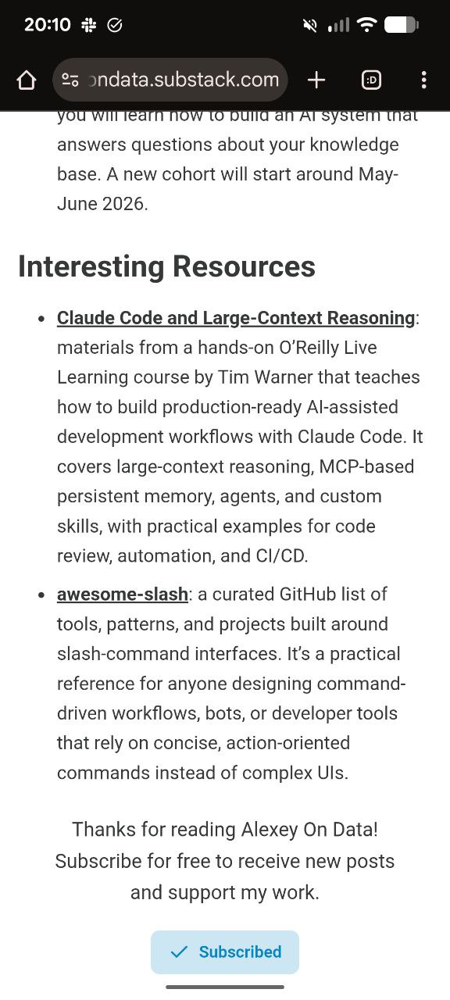

# Interesting Resources

A collection of interesting resources curated for the "Alexey On Data" newsletter and beyond.

<figure>
  
  <figcaption>The Interesting Resources section as it appears in the Alexey On Data newsletter on Substack</figcaption>
  <!-- This shows the format and presentation of resources in the newsletter -->
</figure>

## Resource Format

Each resource entry follows this simple format:
- Title: the resource name (what it is)
- First sentence: must include a link to the resource
- One paragraph description: what it does and why it's useful
- Keep it concise, 2-4 sentences max
- No bulleted lists, no code examples, no extra sections

## Tools

### Claude Memory Compiler

[Claude Memory Compiler](https://github.com/coleam00/claude-memory-compiler) is an implementation of Karpathy's LLM Knowledge Base architecture that automatically compiles your Claude Code conversations into a searchable, structured knowledge base. It uses Claude Code hooks to capture session transcripts, extracts key decisions and lessons via the Claude Agent SDK, and organizes everything into cross-referenced markdown articles. Retrieval uses a simple index file instead of RAG, following Karpathy's insight that at personal scale (under ~2,000 articles) an LLM reading a structured index outperforms vector similarity search[^42].

### Fabula

[Fabula](https://www.linkedin.com/posts/googleresearch_chi2026-activity-7450071174446850048-Uo2F) is an interactive AI writing tool from Google Research that helps authors structure and refine stories through hierarchical narrative plans grounded in narratological theory. Co-designed with 42 expert writers, it lets theatre makers and screenwriters iteratively develop scenes and beats within a structured planning framework. Presented at CHI 2026, it demonstrates a human-centered approach where AI supports the creative process rather than replacing the author[^46].

### DeepTutor

[DeepTutor](https://github.com/HKUDS/DeepTutor) is an open-source AI tutoring assistant that turns your documents into an interactive learning environment. It combines RAG-powered knowledge bases with multiple learning modes - chat, guided learning journeys, quiz generation, deep research, and an AI co-writer - all sharing the same conversation context. It also supports persistent "TutorBots" that remember your learning history and evolve over time[^45].

## Resources

### LennysData.com Hackathon Winners

[LennysData.com hackathon winners](https://www.linkedin.com/posts/lennyrachitsky_announcing-the-winners-of-the-lennysdatacom-share-7450274416166608896-ayJf) is Lenny Rachitsky's announcement of 10 winning projects from a community hackathon built on his podcast transcripts and newsletter content. Out of 80+ entries, winners include Lenny's Greatest Hits, Lenny's Comics, Lenny's Books for Kids, Lenny Unwrapped (trading cards based on guests), and Lenny's Dots of Wisdom - an inspiring example of what happens when a creator opens up their content as structured data for readers to build on. A great reference for how community-driven product building works with newsletter and podcast content[^47].

### Wikipedia: Signs of AI Writing

[Wikipedia: Signs of AI Writing](https://en.wikipedia.org/wiki/Wikipedia:Signs_of_AI_writing) is a community-maintained guide cataloging telltale patterns that indicate text was generated by an LLM. It covers content issues (undue emphasis on significance, superficial analyses, promotional language), language patterns (overuse of words like "delve" and "crucial," avoidance of simple "is/are" phrasing, excessive em dashes), and technical artifacts (Markdown leaking into wikitext, broken citation markup like "oaicite" and "turn0search0"). The page is a practical checklist for anyone who wants to spot or avoid AI-generated writing habits[^41].

## Project ideas

Add project ideas here.

### Awesome AI Apps

[Awesome AI Apps](https://github.com/Arindam200/awesome-ai-apps) is a collection of 70+ practical examples for building LLM-powered applications, covering everything from simple chatbots to advanced multi-agent systems. The projects span starter agents, RAG applications, MCP integrations, memory-enhanced agents, and production-ready workflows using frameworks like Agno, CrewAI, LangChain, PydanticAI, and AWS Strands. It is a great source of inspiration for AI project ideas with working code you can study and extend[^35].

### Career-Ops

[Career-Ops](https://github.com/santifer/career-ops) is an open-source, AI-powered job search system built on Claude Code that turns your terminal into a full job search command center. It evaluates job offers with a structured scoring system, generates ATS-optimized tailored CVs as PDFs, scans 45+ company career portals automatically, and tracks everything in a single pipeline. The author used it to evaluate 740+ job listings, generate 100+ personalized CVs, and land a Head of Applied AI role[^43].

### Code Review Graph

[Code Review Graph](https://github.com/tirth8205/code-review-graph) is an MCP-based tool that builds a local knowledge graph of your codebase so AI coding assistants read only what matters during code reviews. It uses Tree-sitter to parse your code into a structural map of functions, classes, imports, and their relationships, then performs blast-radius analysis on changes to identify the minimal set of affected files. The tool supports 19 languages, updates incrementally in under 2 seconds, and benchmarks show an average 8.2x token reduction compared to naive full-file reads[^44].

### Automated GTM Pipeline

[Matthew Berman's GTM automation system](https://x.com/TheMattBerman/status/2024678503598235963) describes replacing a $200K/year Go-To-Market hire with an automated outbound sales pipeline costing roughly $130/month in APIs. The pipeline uses OpenClaw for orchestration, RapidAPI for LinkedIn scraping, Hunter/Apollo for lead enrichment, Claude for personalized outreach, and Perplexity-style deep research for pre-call briefings - all stitched together into a 6-step workflow from mining LinkedIn engagement to booking meetings. Interesting for future automation[^28].

## Sources

[^1]: [20260131_191039_AlexeyDTC_msg741_photo.md](../inbox/used/20260131_191039_AlexeyDTC_msg741_photo.md)
[^2]: [https://gist.github.com/antirez/2e07727fb37e7301247e568b6634beff](https://gist.github.com/antirez/2e07727fb37e7301247e568b6634beff)
[^3]: [20260131_191025_AlexeyDTC_msg739_transcript.txt](../inbox/used/20260131_191025_AlexeyDTC_msg739_transcript.txt)
[^4]: [20260131_191153_AlexeyDTC_msg745_transcript.txt](../inbox/used/20260131_191153_AlexeyDTC_msg745_transcript.txt)
[^5]: [20260131_194824_AlexeyDTC_msg751_transcript.txt](../inbox/used/20260131_194824_AlexeyDTC_msg751_transcript.txt)
[^6]: [20260202_122612_AlexeyDTC_msg848.md](../inbox/used/20260202_122612_AlexeyDTC_msg848.md)
[^7]: [20260202_171315_AlexeyDTC_msg854.md](../inbox/used/20260202_171315_AlexeyDTC_msg854.md)
[^8]: [20260203_134255_AlexeyDTC_msg884_transcript.txt](../inbox/used/20260203_134255_AlexeyDTC_msg884_transcript.txt)
[^9]: [20260205_152323_AlexeyDTC_msg949.md](../inbox/used/20260205_152323_AlexeyDTC_msg949.md)
[^10]: [20260205_162426_AlexeyDTC_msg950.md](../inbox/used/20260205_162426_AlexeyDTC_msg950.md)
[^11]: [20260206_074649_valeriia_kuka_msg971.md](../inbox/used/20260206_074649_valeriia_kuka_msg971.md)
[^12]: [20260207_215252_AlexeyDTC_msg1182.md](../inbox/used/20260207_215252_AlexeyDTC_msg1182.md)
[^13]: [20260209_170808_AlexeyDTC_msg1244.md](../inbox/used/20260209_170808_AlexeyDTC_msg1244.md)
[^14]: [20260209_170914_AlexeyDTC_msg1246_transcript.txt](../inbox/used/20260209_170914_AlexeyDTC_msg1246_transcript.txt)
[^15]: [20260209_171006_AlexeyDTC_msg1248.md](../inbox/used/20260209_171006_AlexeyDTC_msg1248.md)
[^16]: [20260210_084748_AlexeyDTC_msg1267.md](../inbox/used/20260210_084748_AlexeyDTC_msg1267.md)
[^17]: [20260210_150732_AlexeyDTC_msg1291.md](../inbox/used/20260210_150732_AlexeyDTC_msg1291.md)
[^18]: [20260211_131904_valeriia_kuka_msg1441.md](../inbox/used/20260211_131904_valeriia_kuka_msg1441.md)
[^19]: [20260211_130747_valeriia_kuka_msg1433.md](../inbox/used/20260211_130747_valeriia_kuka_msg1433.md)
[^20]: [20260214_060731_AlexeyDTC_msg1653.md](../inbox/used/20260214_060731_AlexeyDTC_msg1653.md)
[^21]: [20260214_063326_AlexeyDTC_msg1656.md](../inbox/used/20260214_063326_AlexeyDTC_msg1656.md)
[^22]: [20260214_103313_AlexeyDTC_msg1673.md](../inbox/used/20260214_103313_AlexeyDTC_msg1673.md)
[^23]: [20260214_103407_AlexeyDTC_msg1675_transcript.txt](../inbox/used/20260214_103407_AlexeyDTC_msg1675_transcript.txt)
[^24]: [20260215_214321_AlexeyDTC_msg1701.md](../inbox/used/20260215_214321_AlexeyDTC_msg1701.md)
[^25]: [20260218_141744_AlexeyDTC_msg1945.md](../inbox/used/20260218_141744_AlexeyDTC_msg1945.md)
[^26]: [20260218_145313_valeriia_kuka_msg1949.md](../inbox/used/20260218_145313_valeriia_kuka_msg1949.md)
[^27]: [20260220_143643_AlexeyDTC_msg2158.md](../inbox/used/20260220_143643_AlexeyDTC_msg2158.md)
[^28]: [20260220_143801_AlexeyDTC_msg2160.md](../inbox/used/20260220_143801_AlexeyDTC_msg2160.md)
[^29]: [20260220_174948_AlexeyDTC_msg2180.md](../inbox/used/20260220_174948_AlexeyDTC_msg2180.md)
[^30]: [20260222_093919_AlexeyDTC_msg2204.md](../inbox/used/20260222_093919_AlexeyDTC_msg2204.md)
[^31]: [20260228_160854_AlexeyDTC_msg2604.md](../inbox/used/20260228_160854_AlexeyDTC_msg2604.md)
[^32]: [20260228_151304_AlexeyDTC_msg2602.md](../inbox/used/20260228_151304_AlexeyDTC_msg2602.md)
[^33]: [20260301_112008_AlexeyDTC_msg2650.md](../inbox/used/20260301_112008_AlexeyDTC_msg2650.md)
[^34]: [20260302_025428_AlexeyDTC_msg2656.md](../inbox/used/20260302_025428_AlexeyDTC_msg2656.md)
[^35]: [20260303_185917_AlexeyDTC_msg2714.md](../inbox/used/20260303_185917_AlexeyDTC_msg2714.md)
[^36]: [20260309_133601_valeriia_kuka_msg2786.md](../inbox/used/20260309_133601_valeriia_kuka_msg2786.md)
[^37]: [https://github.com/lightpanda-io/browser](https://github.com/lightpanda-io/browser) via [20260312_135733_AlexeyDTC_msg2874.md](../inbox/used/20260312_135733_AlexeyDTC_msg2874.md)
[^38]: [https://github.com/tobi/qmd](https://github.com/tobi/qmd) via [20260312_191423_AlexeyDTC_msg2886.md](../inbox/used/20260312_191423_AlexeyDTC_msg2886.md)
[^39]: [https://github.com/garrytan/gstack](https://github.com/garrytan/gstack) via [20260314_051307_AlexeyDTC_msg2904.md](../inbox/used/20260314_051307_AlexeyDTC_msg2904.md)
[^40]: [https://github.com/Vaibhavs10/insanely-fast-whisper](https://github.com/Vaibhavs10/insanely-fast-whisper) via [20260325_094127_AlexeyDTC_msg3074.md](../inbox/used/20260325_094127_AlexeyDTC_msg3074.md)
[^41]: [https://en.wikipedia.org/wiki/Wikipedia:Signs_of_AI_writing](https://en.wikipedia.org/wiki/Wikipedia:Signs_of_AI_writing) via [20260408_140252_AlexeyDTC_msg3303.md](../inbox/used/20260408_140252_AlexeyDTC_msg3303.md)
[^42]: [https://github.com/coleam00/claude-memory-compiler](https://github.com/coleam00/claude-memory-compiler) via [20260408_195017_AlexeyDTC_msg3309.md](../inbox/used/20260408_195017_AlexeyDTC_msg3309.md)
[^43]: [https://github.com/santifer/career-ops](https://github.com/santifer/career-ops) via [20260409_064531_AlexeyDTC_msg3313.md](../inbox/used/20260409_064531_AlexeyDTC_msg3313.md)
[^44]: [https://github.com/tirth8205/code-review-graph](https://github.com/tirth8205/code-review-graph) via [20260409_064713_AlexeyDTC_msg3315.md](../inbox/used/20260409_064713_AlexeyDTC_msg3315.md)
[^45]: [https://github.com/HKUDS/DeepTutor](https://github.com/HKUDS/DeepTutor) via [20260409_064410_AlexeyDTC_msg3311.md](../inbox/used/20260409_064410_AlexeyDTC_msg3311.md)
[^46]: [https://www.linkedin.com/posts/googleresearch_chi2026-activity-7450071174446850048-Uo2F](https://www.linkedin.com/posts/googleresearch_chi2026-activity-7450071174446850048-Uo2F) via [20260415_120442_valeriia_kuka_msg3403.md](../inbox/used/20260415_120442_valeriia_kuka_msg3403.md)
[^47]: [https://www.linkedin.com/posts/lennyrachitsky_announcing-the-winners-of-the-lennysdatacom-share-7450274416166608896-ayJf](https://www.linkedin.com/posts/lennyrachitsky_announcing-the-winners-of-the-lennysdatacom-share-7450274416166608896-ayJf) via [20260415_210715_valeriia_kuka_msg3411.md](../inbox/used/20260415_210715_valeriia_kuka_msg3411.md)
