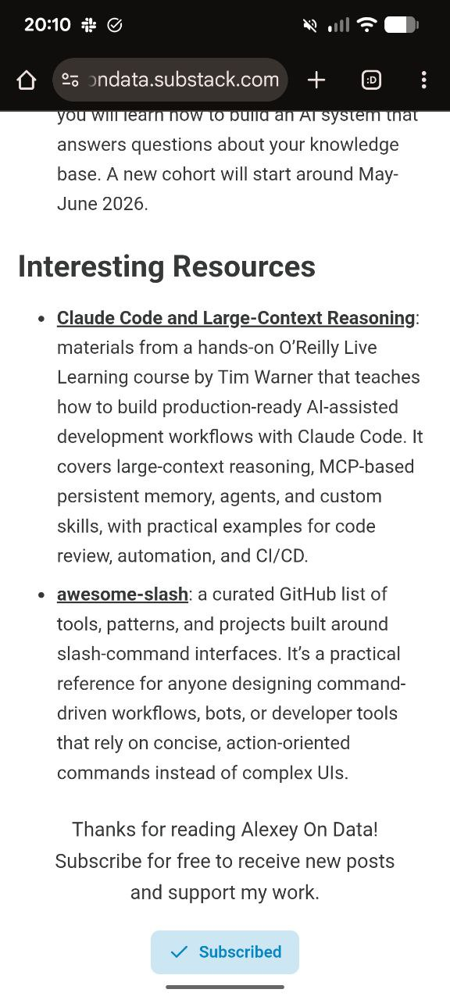

# Interesting Resources

A collection of interesting resources curated for the "Alexey On Data" newsletter and beyond.

<figure>
  
  <figcaption>The Interesting Resources section as it appears in the "Alexey On Data" newsletter on Substack</figcaption>
  <!-- This shows the format and presentation of resources in the newsletter -->
</figure>

## Resource Format

Each resource entry follows this simple format:
- Title: the resource name (what it is)
- First sentence: must include a link to the resource
- One paragraph description: what it does and why it's useful
- Keep it concise, 2-4 sentences max
- No bulleted lists, no code examples, no extra sections

## Tools

### Omnigent

[Omnigent](https://github.com/omnigent-ai/omnigent) is an open-source meta-harness from Databricks that sits above the coding agents you already use - Claude Code, Codex, Pi, the OpenAI Agents SDK, or your own YAML-defined agents - and makes them interoperable parts of one system. You compose multiple agents in a single session (for example, having one vendor's agent review another's code), enforce stateful policies like spend caps and approval gates at the harness layer instead of through prompts, and run tools inside an OS sandbox with an egress proxy that injects secrets the agent never sees. Sessions follow you across the terminal, web, mobile, and a macOS app, and you can share a live session by URL so teammates watch or co-drive in real time. Released under Apache 2.0[^57].

### Ponytail

[Ponytail](https://github.com/DietrichGebert/ponytail) is an AI agent skill that makes coding agents write the least code that actually does the job - "the laziest senior dev in the room" who replaces fifty lines with one. Before writing anything, the agent walks a ladder (does this need to exist, does the stdlib or a native platform feature already do it, can it be one line) and only builds the minimum that works, while never cutting validation, error handling, security, or accessibility. It installs as a plugin for Claude Code, Codex, and a dozen other agents, and on real agentic benchmarks it cut code by around 54% while staying cheaper and faster than the unassisted baseline[^56].

## Resources

## Project ideas

Add project ideas here.

## Automated GTM Pipeline

[Matthew Berman's GTM automation system](https://x.com/TheMattBerman/status/2024678503598235963) replaces a $200K/year Go-To-Market hire. The replacement is an automated outbound sales pipeline costing roughly $130/month in APIs.

The pipeline stitches together a 6-step workflow from mining LinkedIn engagement to booking meetings:

- OpenClaw for orchestration
- RapidAPI for LinkedIn scraping
- Hunter/Apollo for lead enrichment
- Claude for personalized outreach
- Perplexity-style deep research for pre-call briefings

Interesting for future automation[^28].

## LiteParse

[LiteParse](https://github.com/run-llama/liteparse) is a fast, open-source document parser from the LlamaIndex team that runs entirely on your machine with no cloud dependencies or proprietary LLM features. It does spatial text parsing with bounding boxes via PDFium, handles PDF, DOCX, XLSX, PPTX, and images, and offers selective OCR through bundled Tesseract or any HTTP OCR server. The Rust core ships with bindings for Python, Node.js/TypeScript, the browser (WASM), and a CLI, so you can plug it into a local document pipeline from whatever stack you use[^55].

## Sources

[^1]: [20260131_191039_AlexeyDTC_msg741_photo.md](../inbox/used/20260131_191039_AlexeyDTC_msg741_photo.md)
[^2]: [https://gist.github.com/antirez/2e07727fb37e7301247e568b6634beff](https://gist.github.com/antirez/2e07727fb37e7301247e568b6634beff)
[^3]: [20260131_191025_AlexeyDTC_msg739_transcript.txt](../inbox/used/20260131_191025_AlexeyDTC_msg739_transcript.txt)
[^4]: [20260131_191153_AlexeyDTC_msg745_transcript.txt](../inbox/used/20260131_191153_AlexeyDTC_msg745_transcript.txt)
[^5]: [20260131_194824_AlexeyDTC_msg751_transcript.txt](../inbox/used/20260131_194824_AlexeyDTC_msg751_transcript.txt)
[^6]: [20260202_122612_AlexeyDTC_msg848.md](../inbox/used/20260202_122612_AlexeyDTC_msg848.md)
[^7]: [20260202_171315_AlexeyDTC_msg854.md](../inbox/used/20260202_171315_AlexeyDTC_msg854.md)
[^8]: [20260203_134255_AlexeyDTC_msg884_transcript.txt](../inbox/used/20260203_134255_AlexeyDTC_msg884_transcript.txt)
[^9]: [20260205_152323_AlexeyDTC_msg949.md](../inbox/used/20260205_152323_AlexeyDTC_msg949.md)
[^10]: [20260205_162426_AlexeyDTC_msg950.md](../inbox/used/20260205_162426_AlexeyDTC_msg950.md)
[^11]: [20260206_074649_valeriia_kuka_msg971.md](../inbox/used/20260206_074649_valeriia_kuka_msg971.md)
[^12]: [20260207_215252_AlexeyDTC_msg1182.md](../inbox/used/20260207_215252_AlexeyDTC_msg1182.md)
[^13]: [20260209_170808_AlexeyDTC_msg1244.md](../inbox/used/20260209_170808_AlexeyDTC_msg1244.md)
[^14]: [20260209_170914_AlexeyDTC_msg1246_transcript.txt](../inbox/used/20260209_170914_AlexeyDTC_msg1246_transcript.txt)
[^15]: [20260209_171006_AlexeyDTC_msg1248.md](../inbox/used/20260209_171006_AlexeyDTC_msg1248.md)
[^16]: [20260210_084748_AlexeyDTC_msg1267.md](../inbox/used/20260210_084748_AlexeyDTC_msg1267.md)
[^17]: [20260210_150732_AlexeyDTC_msg1291.md](../inbox/used/20260210_150732_AlexeyDTC_msg1291.md)
[^18]: [20260211_131904_valeriia_kuka_msg1441.md](../inbox/used/20260211_131904_valeriia_kuka_msg1441.md)
[^19]: [20260211_130747_valeriia_kuka_msg1433.md](../inbox/used/20260211_130747_valeriia_kuka_msg1433.md)
[^20]: [20260214_060731_AlexeyDTC_msg1653.md](../inbox/used/20260214_060731_AlexeyDTC_msg1653.md)
[^21]: [20260214_063326_AlexeyDTC_msg1656.md](../inbox/used/20260214_063326_AlexeyDTC_msg1656.md)
[^22]: [20260214_103313_AlexeyDTC_msg1673.md](../inbox/used/20260214_103313_AlexeyDTC_msg1673.md)
[^23]: [20260214_103407_AlexeyDTC_msg1675_transcript.txt](../inbox/used/20260214_103407_AlexeyDTC_msg1675_transcript.txt)
[^24]: [20260215_214321_AlexeyDTC_msg1701.md](../inbox/used/20260215_214321_AlexeyDTC_msg1701.md)
[^25]: [20260218_141744_AlexeyDTC_msg1945.md](../inbox/used/20260218_141744_AlexeyDTC_msg1945.md)
[^26]: [20260218_145313_valeriia_kuka_msg1949.md](../inbox/used/20260218_145313_valeriia_kuka_msg1949.md)
[^27]: [20260220_143643_AlexeyDTC_msg2158.md](../inbox/used/20260220_143643_AlexeyDTC_msg2158.md)
[^28]: [20260220_143801_AlexeyDTC_msg2160.md](../inbox/used/20260220_143801_AlexeyDTC_msg2160.md)
[^29]: [20260220_174948_AlexeyDTC_msg2180.md](../inbox/used/20260220_174948_AlexeyDTC_msg2180.md)
[^30]: [20260222_093919_AlexeyDTC_msg2204.md](../inbox/used/20260222_093919_AlexeyDTC_msg2204.md)
[^31]: [20260228_160854_AlexeyDTC_msg2604.md](../inbox/used/20260228_160854_AlexeyDTC_msg2604.md)
[^32]: [20260228_151304_AlexeyDTC_msg2602.md](../inbox/used/20260228_151304_AlexeyDTC_msg2602.md)
[^33]: [20260301_112008_AlexeyDTC_msg2650.md](../inbox/used/20260301_112008_AlexeyDTC_msg2650.md)
[^34]: [20260302_025428_AlexeyDTC_msg2656.md](../inbox/used/20260302_025428_AlexeyDTC_msg2656.md)
[^35]: [20260303_185917_AlexeyDTC_msg2714.md](../inbox/used/20260303_185917_AlexeyDTC_msg2714.md)
[^36]: [20260309_133601_valeriia_kuka_msg2786.md](../inbox/used/20260309_133601_valeriia_kuka_msg2786.md)
[^37]: [https://github.com/lightpanda-io/browser](https://github.com/lightpanda-io/browser) via [20260312_135733_AlexeyDTC_msg2874.md](../inbox/used/20260312_135733_AlexeyDTC_msg2874.md)
[^38]: [https://github.com/tobi/qmd](https://github.com/tobi/qmd) via [20260312_191423_AlexeyDTC_msg2886.md](../inbox/used/20260312_191423_AlexeyDTC_msg2886.md)
[^39]: [https://github.com/garrytan/gstack](https://github.com/garrytan/gstack) via [20260314_051307_AlexeyDTC_msg2904.md](../inbox/used/20260314_051307_AlexeyDTC_msg2904.md)
[^40]: [https://github.com/Vaibhavs10/insanely-fast-whisper](https://github.com/Vaibhavs10/insanely-fast-whisper) via [20260325_094127_AlexeyDTC_msg3074.md](../inbox/used/20260325_094127_AlexeyDTC_msg3074.md)
[^41]: [https://en.wikipedia.org/wiki/Wikipedia:Signs_of_AI_writing](https://en.wikipedia.org/wiki/Wikipedia:Signs_of_AI_writing) via [20260408_140252_AlexeyDTC_msg3303.md](../inbox/used/20260408_140252_AlexeyDTC_msg3303.md)
[^42]: [https://github.com/coleam00/claude-memory-compiler](https://github.com/coleam00/claude-memory-compiler) via [20260408_195017_AlexeyDTC_msg3309.md](../inbox/used/20260408_195017_AlexeyDTC_msg3309.md)
[^43]: [https://github.com/santifer/career-ops](https://github.com/santifer/career-ops) via [20260409_064531_AlexeyDTC_msg3313.md](../inbox/used/20260409_064531_AlexeyDTC_msg3313.md)
[^44]: [https://github.com/tirth8205/code-review-graph](https://github.com/tirth8205/code-review-graph) via [20260409_064713_AlexeyDTC_msg3315.md](../inbox/used/20260409_064713_AlexeyDTC_msg3315.md)
[^45]: [https://github.com/HKUDS/DeepTutor](https://github.com/HKUDS/DeepTutor) via [20260409_064410_AlexeyDTC_msg3311.md](../inbox/used/20260409_064410_AlexeyDTC_msg3311.md)
[^46]: [https://www.linkedin.com/posts/googleresearch_chi2026-activity-7450071174446850048-Uo2F](https://www.linkedin.com/posts/googleresearch_chi2026-activity-7450071174446850048-Uo2F) via [20260415_120442_valeriia_kuka_msg3403.md](../inbox/used/20260415_120442_valeriia_kuka_msg3403.md)
[^47]: [https://www.linkedin.com/posts/lennyrachitsky_announcing-the-winners-of-the-lennysdatacom-share-7450274416166608896-ayJf](https://www.linkedin.com/posts/lennyrachitsky_announcing-the-winners-of-the-lennysdatacom-share-7450274416166608896-ayJf) via [20260415_210715_valeriia_kuka_msg3411.md](../inbox/used/20260415_210715_valeriia_kuka_msg3411.md)
[^48]: [20260418_173643_AlexeyDTC_msg3435.md](../inbox/used/20260418_173643_AlexeyDTC_msg3435.md)
[^49]: [20260418_142745_AlexeyDTC_msg3431.md](../inbox/used/20260418_142745_AlexeyDTC_msg3431.md)
[^50]: [https://codingchallenges.substack.com/](https://codingchallenges.substack.com/) via [20260425_113814_AlexeyDTC_msg3665.md](../inbox/used/20260425_113814_AlexeyDTC_msg3665.md)
[^51]: [https://github.com/ksimback/tech-debt-skill](https://github.com/ksimback/tech-debt-skill) via [20260426_121424_AlexeyDTC_msg3667.md](../inbox/used/20260426_121424_AlexeyDTC_msg3667.md)
[^52]: [https://github.com/VoltAgent/awesome-design-md](https://github.com/VoltAgent/awesome-design-md) via [20260519_141047_valeriia_kuka_msg4206.md](../inbox/used/20260519_141047_valeriia_kuka_msg4206.md)
[^53]: [https://stitch.withgoogle.com/docs/design-md/overview](https://stitch.withgoogle.com/docs/design-md/overview) via [20260519_141047_valeriia_kuka_msg4206.md](../inbox/used/20260519_141047_valeriia_kuka_msg4206.md)
[^54]: [https://github.com/microsoft/webwright](https://github.com/microsoft/webwright) via [20260526_205821_AlexeyDTC_msg4283.md](../inbox/used/20260526_205821_AlexeyDTC_msg4283.md)
[^55]: [https://github.com/run-llama/liteparse](https://github.com/run-llama/liteparse) via [20260611_091213_AlexeyDTC_msg4579.md](../inbox/used/20260611_091213_AlexeyDTC_msg4579.md)
[^56]: [https://github.com/DietrichGebert/ponytail](https://github.com/DietrichGebert/ponytail) via [20260614_135154_AlexeyDTC_msg4597.md](../inbox/used/20260614_135154_AlexeyDTC_msg4597.md)
[^57]: [https://github.com/omnigent-ai/omnigent](https://github.com/omnigent-ai/omnigent) via [20260614_135242_AlexeyDTC_msg4599.md](../inbox/used/20260614_135242_AlexeyDTC_msg4599.md)
