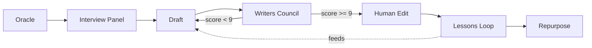
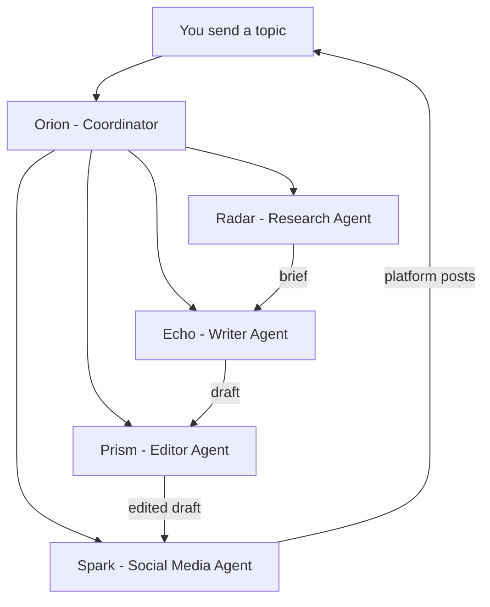

# AI Content Machines: How Creators Build Anti-Slop Writing Systems

https://youtu.be/1_jlukb7gm4

A new category of tool is emerging: the AI content machine. Not a chatbot you paste prompts into, but a multi-step pipeline where each stage has its own rules, its own persona, and its own quality gate. The goal is always the same - produce content that reads like you wrote it, at a pace you couldn't sustain alone.

This article covers three systems that take different approaches to the same problem. The first section walks through Alex Lieberman's Content Machine in detail, including the full pipeline he demonstrated live on the How I AI podcast. The second section covers OpenClaw's multi-agent content team, which uses a coordinator-plus-specialists model. The third section looks at Dan Koe's validation-first workflow, which starts on Twitter and works outward. After the three systems, a comparison section pulls out the patterns they share and the places where they diverge. Prompt files for each system live in `articles/interviews/prompts/`.

## Lieberman's Content Machine

Alex Lieberman co-founded Morning Brew and now runs 10X (tenex.co), an applied AI company focused on enterprise transformation. He has been creating content on the internet for roughly a decade. His constraint: about 25% of his day can go to content. Everything else is client work.

His second constraint is organizational. He wants every employee at 10X to publish their expertise, not just a dedicated marketing team. The Content Machine serves both problems - it gives him a faster pipeline for his own posts, and it gives his team a shared toolkit that lowers the barrier to creating anything at all.[^1]

The system runs as a plugin inside Claude Code. It connects to 10X's internal tools - Slack, Notion, meeting notes, Linear, Git, Gmail - and pulls ideas from actual work conversations. The pipeline has six stages: Oracle, Interview, Draft, Writers Council, Lessons Loop, and Repurpose.



The diagram shows the full pipeline. The Writers Council sends drafts back for revision if they score below 9 out of 10. The Lessons Loop feeds corrections back into future drafts. Each stage is a separate "skill" - a markdown file with its own instructions, persona definitions, and quality gates.

### The Oracle: scanning the week for content spikes

The Oracle scans the last seven days of activity across all connected systems and returns a ranked list of 10 to 15 "content spikes" - moments from your week that can carry a piece of content.

It scores each candidate on five dimensions, 0 to 2 points each, for a maximum of 10:

- Story or anecdote: does it have a specific lived moment with people and stakes?
- Strong point of view: is there a falsifiable claim someone could disagree with?
- Specific examples: are there named tools, numbers, dates, or quotes?
- Novelty: is this a take you haven't seen elsewhere?
- Timeliness: does it connect to a conversation happening this week?

A spike needs a score of 6 or higher to make the daily list. Everything scored goes to the Spike Vault regardless - a Notion database that accumulates ideas as inventory for later use.

Half the spikes come from internal systems (Slack threads, meeting notes, customer calls). The other half come from what Lieberman calls the "internet reader" - a curated list of accounts on X and LinkedIn plus websites he follows. Internet-reader spikes always name their response mode: quote-post, reply, or standalone take.

Here is what a good spike looks like in the Oracle's output format:[^3]

```
[9] SLACK #client-calls - Banker rebuilt McKinsey's 6-month proposal
    in one week with Claude Code; consulting is repricing in real time.
    why it scores: lived story + numbers + live debate
```

And a bad one that gets rejected:

```
[2] - AI is changing how companies think about content marketing.
    No story (0), no POV (0), no examples (0), zero novelty (0).
```

Lieberman considers this step the single most valuable part of the whole system. Even if you never let AI draft anything, going from blank page to a ranked list of concrete ideas lowers the friction enough to build a daily habit.

### The Interview Panel: extracting raw material

Once you pick a spike, the Interview Panel takes over. Six AI personas modeled on real interviewers ask questions one at a time:

- Tim Ferriss (the deconstructor) - asks for the repeatable process, the exact step where it worked or broke
- Joe Rogan (the curious generalist) - asks the obvious question the expert forgot is interesting
- Michael Barbaro (the narrative builder) - builds the timeline, wants scenes and dialogue
- Barbara Walters (the emotional prober) - goes after stakes and feelings
- Howard Stern (the disarmer) - provocative, blunt, gets the unguarded quotable answer
- Larry King (the simplifier) - short direct questions that force you to compress your thesis

The panel follows strict rules. One question at a time. Every abstract answer gets a follow-up demanding the concrete version. Follow-ups build on the previous answer. Roughly five questions total across the panel, rotating personas. And the rule that matters most: interviewers never suggest answers. An interviewer who feeds the subject phrases contaminates the transcript.[^3]

You answer using voice-to-text (Lieberman uses Whisper Flow). Speed produces unguarded phrasing, and unguarded phrasing is where voice lives. The Q&A goes into a transcript file verbatim - no cleanup.

This is the anti-slop mechanism. The transcript becomes the only source material for drafting. If the draft sounds generic, the problem traces back here - you gave generic answers. Lieberman's framing: "AI slop is hilariously people just pointing the finger at themselves."[^1]

If the spike involves a public debate or external claims you haven't fully tracked, an optional research assistant can prepare a brief first - what the principals actually said, the strongest version of each side, and potential contrarian angles nobody has taken.

### Drafting with a codified voice

The drafting step combines the interview transcript with three personal files:

- `profile.md` - who you are, your role, recurring topics, owned assets (newsletters, podcasts), social handles you follow
- `voice-guide.md` - an analysis of your top-performing posts, capturing hook formulas, content structures, language patterns, your core writing rule, and what you never do
- `content-lessons.md` - a running log of categorized corrections from previous edits

The voice guide is detailed. It contains your top 10 posts with annotations on why each worked, your hook formulas abstracted from those posts, your sentence rhythm (average length, fragment frequency), phrases you use, and phrases you ban. The drafting step reads all three files, then shapes the transcript into a post.

The core gate: every substantive sentence must be traceable to the interview transcript. The AI may reorder, trim, splice, and fix grammar. It may not add claims, examples, framings, or vocabulary you didn't produce. The hook and closing line are the only places where invention is allowed.

### The Writers Council: automated quality gate

Before you see the draft, six reviewer personas score it independently, each on their own dimension:

- David Perell (structure and durability) - does the piece have one spine? Would it be worth reading in a year?
- Shaan Puri (hook and momentum) - would a stranger stop scrolling? Does every line buy the next line?
- Morgan Housel (story-to-insight ratio) - is the abstract claim carried by a concrete story?
- The AI Slop Allergist (pattern contamination) - scans for negative parallelism, tricolons, hype vocabulary, uniform sentence rhythm, hedge clusters
- Paul Graham (clarity and compression) - could a smart teenager follow every sentence?
- Ann Handley (audience fit and usefulness) - does the intended reader leave with something they can use?

Each scores 1 to 10. The aggregate mean must hit 9.0 to pass. Below that, the system fixes only the two lowest-scoring dimensions (shotgun rewrites destroy voice), re-runs all six reviewers, and repeats. Hard stop at three revision loops - if it still can't clear 9.0, it shows the best draft with the failing scores attached.[^3]

The council may not add words to the piece. It critiques; the reviser fixes using the interview transcript as the only material source.

### The Slop Allergist's checklist

The Allergist scans for specific patterns documented in a `slop-tells.md` reference file. These are the statistical fingerprints of LLM output:[^3]

Structural tells:

- Negative parallelism ("It's not about X. It's about Y.") - the single most recognizable LLM cadence of this era
- Tricolon addiction ("Faster, cheaper, and more scalable") - rule-of-three deployed every third sentence
- Punchline appositive ("They're both right - and that's exactly the problem.")
- Symmetric paragraphs where every paragraph has the same 3-4 sentence shape
- Throat-clear openings ("In today's rapidly evolving landscape...")
- Summarizing closes ("Ultimately, the key takeaway is...")
- Hedge stacking ("could potentially help to somewhat improve")

Vocabulary tells: words like "delve", "tapestry", "landscape", "leverage", "robust", "seamless", "unlock", "elevate", "empower", "navigate", "game-changer", "deep dive", "testament to".

Rhythm tells: uniform sentence length (human writing has high variance), no fragments (people write fragments constantly), and every sentence politely complete with no interruptions or trailing asides.

The judgment layer catches what regex can't: no position taken, no names or numbers (nothing falsifiable), one point diluted into five weaker ones, and "experts agree" with no actual witnesses cited.

### The Lessons Loop: how the machine improves

After you take your final editing pass and publish, the Lessons Loop runs a diff between the machine's draft and your published version. It categorizes each meaningful change:

- Tone - register errors ("too breathless", "false modesty")
- Structure and flow - ordering, pacing, where the piece sagged
- Language - specific words or constructions you remove on sight
- Format - platform-specific habits (fold behavior, line breaks)

Each change becomes a candidate lesson. The abstraction test: would this rule have prevented the edit and apply to future pieces? One-off factual fixes don't count. "Changed 'six months' to '6 months'" is not a lesson. "Never use the setup-punchline construction 'They're both right - and that's exactly the problem' - user flags this cadence as AI-cringe" is a lesson.[^3]

You approve, reject, or edit each proposed lesson. Only approved lessons get written to `content-lessons.md`. The file feeds every future draft, so polluting it with wrong rules degrades the whole system.

### Repurposing and the employee program

The final step takes an approved anchor piece and adapts it for other channels. You tell the system what you want (three short tweets, two LinkedIn posts) and it uses your voice guide to write each format natively, not just trim the original.

Lieberman extends the whole system to his team through what he calls the 10X Creator Cup - a month-long program where employees post on LinkedIn or X and earn points. Posting earns 10 points, engaging with a teammate's post earns 3, and the editor's pick of the week earns 50. The prize pool is $5,000, split into weekly and monthly categories so the program doesn't only reward people who already have large audiences.

The business case: if the program helps 10X recruit a single strong engineer, the prize money is already justified compared to a typical agency fee. 10X is bootstrapped - no venture visibility, no TechCrunch mentions. Employees showing their work publicly is how the company builds its reputation.[^1]

## OpenClaw Multi-Agent Content Team

OpenClaw takes a different approach to the same problem. Where Lieberman's Content Machine is a single-agent pipeline with persona-switching (one Claude session running different "skills"), OpenClaw uses multiple independent agents, each with its own configuration file, running in parallel or in sequence.

The framework is configuration-first. You define agents by writing markdown files, not code. Each agent has a `SOUL.md` file that sets its personality, communication style, rules, and tool access. A team coordinator defined in `AGENTS.md` handles delegation between agents.[^5]



The coordinator (Orion) receives a topic, delegates research to Radar, sends the brief to Echo for writing, routes the draft to Prism for editing, and hands the finished piece to Spark for repurposing. One message triggers the full pipeline.

### Agent definitions via SOUL.md

Each agent's personality and constraints live in a `SOUL.md` file. Here is what the writer agent looks like:

```
## Personality
You are Echo, a content writer who produces clear, actionable
technical content. You write like a practitioner, not a marketer.

## Rules
- Start every article with a concrete example or result, never
  a generic definition
- Use short paragraphs (2-3 sentences max)
- Write in second person ("you") for tutorials
- Never use: "In today's world", "It's worth noting",
  "At the end of the day", "game-changer", "leverage"
- Every H2 section must include at least one actionable takeaway
```

The editor agent (Prism) has entirely different instructions: check code blocks for syntax errors, verify keyword placement, flag unsourced claims, and ensure logical flow from problem to solution. It outputs an edited draft plus a list of changes and an SEO score. Its core constraint: never change the author's voice, only fix errors and improve clarity.[^5]

The social media agent (Spark) carries platform-specific rules. X posts use the hook formula "[Surprising stat] + [What I did] + [Result]" and stay under 280 characters. LinkedIn posts start with a bold statement, stay under 1300 characters, and end with a question. TikTok scripts run 60 seconds with a hook in the first 3 seconds and "[VISUAL CUE]" markers for b-roll.

### Automation via heartbeat

OpenClaw runs continuously on a server. A `HEARTBEAT.md` file tells the system what to do on a schedule. You can set the coordinator to trigger the full content pipeline every Monday morning, scan your email every 30 minutes, or compile a weekly newsletter digest every Friday.[^6]

This is the structural difference from Lieberman's system. The Content Machine is interactive - you run it, pick a spike, answer interview questions, review the draft. OpenClaw can run unsupervised on a schedule, producing drafts that wait for your review. The trade-off: you lose the interview step's anti-slop guarantee. OpenClaw agents generate content from research briefs and style rules, not from your verbatim transcript.

### Where OpenClaw adds voice control

OpenClaw's approach to voice is the banned-phrases list in each agent's SOUL.md plus example posts fed as reference material. The recommendation is to include 3 to 5 of your top-performing posts in the agent's workspace and reference them in the configuration. The agent learns your style from those examples rather than from an explicit voice analysis.[^5]

This is less thorough than Lieberman's voice guide, which reverse-engineers hook formulas, sentence rhythm, and language patterns from your top 10 posts. But it's faster to set up - you copy-paste a few posts instead of commissioning a full voice analysis.

## Dan Koe's Validation-First Workflow

Dan Koe takes yet another approach. He doesn't start with an AI pipeline. He starts with Twitter.[^4]

His weekly process:

1. Write 2 to 3 short posts per day on Twitter, testing ideas against real audiences
2. Identify which posts get traction (the validation step)
3. Expand validated ideas into a weekly newsletter
4. Turn the newsletter into a YouTube video script
5. Repurpose the newsletter back into more social posts, reels, TikTok scripts

The AI enters at the research and expansion stages, not at the ideation stage. Ideas come from his own thinking, validated by audience response. AI helps him research those ideas faster and expand them into longer formats.

### The research step

Koe finds YouTube videos on his topic and uses Gemini to summarize hours of content into digestible notes. Then he has AI compare those summaries with his previous content to find connections and fresh angles. From those insights, he creates an outline. What would take 6 or more hours of manual research compresses into about 1000 focused words.[^4]

### Pattern analysis for hooks

Koe uses AI to break down his own high-performing posts into psychological patterns, then makes prompts that replicate those patterns for new topics. The analysis identifies what made specific hooks work (curiosity gaps, counterintuitive claims, specific numbers) and generates frameworks for producing similar structures on demand.

The difference from Lieberman's approach: Koe validates ideas with real audience data before investing in longer content. Lieberman's Oracle scans internal systems and external feeds but relies on scoring rubrics rather than actual engagement data. Koe's validation is slower (you need to post and wait for results) but grounded in measured response.

## Kieran Flanagan's Decomposed Prompts

Kieran Flanagan, SVP of Marketing at HubSpot, takes yet another angle. Rather than building a monolithic pipeline, he decomposes content tasks into separate, narrow prompts - one for the subject line, one for the intro, one for the body, one for the close. Each prompt pulls from structured and unstructured data: sales transcripts, chat logs, behavioral signals.[^7]

The system then runs the output through a style generator that learns what converts the specific reader, not their segment. This approach produced a 30% increase in sales meetings from AI-personalized email workflows.

Flanagan maintains 12 custom GPTs, each trained on a different prompt framework. When he finds a combination that works, he creates a new custom GPT to turn conversations into that prompt type. He also built a "Chief of Staff" agent that clusters Slack messages, meeting notes, and email into weekly action plans, and a tool that extracts viral talking points from video transcripts mapped to the YouTube algorithm.[^7]

## Comparing the Systems

All four systems share common ground. None of them ask AI to "write me a post" from a blank prompt. Each one structures the work into stages with different rules at each stage. All of them treat voice capture as a separate, explicit step rather than hoping the AI will figure it out.


The differences show where each system makes its trade-offs.

Where ideas come from: Lieberman's Oracle scans internal systems and curated feeds, scoring ideas with a rubric. OpenClaw uses scheduled research agents or manual topic input. Koe tests ideas on Twitter and lets engagement data pick the winners. Flanagan pulls from sales transcripts and behavioral data.

How voice is captured: Lieberman builds a detailed voice guide from your top 10 posts (hook formulas, sentence rhythm, language patterns) plus a running lessons file. OpenClaw uses banned-phrases lists and 3 to 5 example posts in each agent's workspace. Koe uses pattern analysis on his own high-performing content to build reusable frameworks. Flanagan trains custom GPTs on specific prompt frameworks.

The anti-slop mechanism: Lieberman's system has the strictest constraint - drafts can only use words from the interview transcript, plus a six-persona review council with a documented slop-tells checklist. OpenClaw relies on per-agent rules and a separate editor agent with fresh instructions. Koe's guard is the validation step - you only expand ideas that already proved they resonate. Flanagan decomposes into narrow single-purpose prompts that each do less, reducing the surface area for generic output.

Automation level: OpenClaw can run unattended on a schedule via heartbeats. Lieberman's system is interactive - you answer interview questions and approve lessons. Koe's is manual at the ideation stage (you post and check results). Flanagan's is the most decomposed but requires manual orchestration of the 12 custom GPTs.

Human involvement: Lieberman answers interview questions, reviews drafts, and approves lessons. OpenClaw needs you for topic selection and final approval. Koe writes the initial tweets himself. Flanagan reviews the output of each narrow prompt before passing it to the next.

### What they agree on

One pattern holds across all four systems: separate ideation from drafting from editing. None of them run a single prompt that does everything. Each treats ideation, research, drafting, and quality control as distinct stages with distinct rules.

A second shared pattern: the voice problem is a data problem. You solve it by feeding the system your own past writing, not by describing your voice in the abstract. Lieberman feeds his top 10 posts. OpenClaw feeds reference posts. Koe feeds his high-performing tweets. Flanagan feeds sales transcripts. Concrete examples beat abstract descriptions.

A third pattern: quality gates are explicit, not implicit. Lieberman has a 9/10 council threshold. OpenClaw has a separate editor agent. Koe has real audience engagement data. Each system makes "good enough" a measurable bar rather than a judgment call at the end.

## Sources

[^1]: https://youtu.be/1_jlukb7gm4
[^2]: [20261009_071335_AlexeyDTC_msg5016.md](../../inbox/used/20261009_071335_AlexeyDTC_msg5016.md)
[^3]: https://github.com/derekcedarbaum2/content-machine - open-source reconstruction of the Content Machine architecture
[^4]: https://audioscrape.com/podcast/the-startup-ideas-podcast/episode/inside-dan-koes-ai-content-engine-65200
[^5]: https://crewclaw.com/blog/openclaw-content-creation-guide
[^6]: https://gist.github.com/velvet-shark/b4c6724c391f612c4de4e9a07b0a74b6
[^7]: https://www.chatprd.ai/how-i-ai/alex-liebermans-6-step-workflow-to-beat-ai-slop
