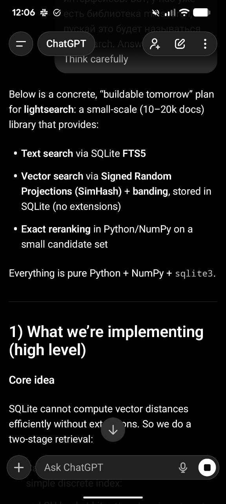

# LightSearch: Persistent Search Library

A lightweight search library with persistence using SQLite, designed for small-scale projects that don't need the overhead of Elasticsearch or other heavy databases.

## Note: Renamed to SQLiteSearch

The library was originally named "LightSearch" but was renamed to "SQLiteSearch" before publication, as "litesearch" was already taken on PyPI. The project is now available at https://github.com/alexeygrigorev/sqlitesearch[^1].

## Motivation

The idea for LightSearch came from needing to show students how to do vector search with persistence, without using heavy infrastructure. Minsearch works well for in-memory search but lacks persistence. Deploying to services like Render with Elasticsearch costs $200-300 per month, which is too much for student projects or small side projects[^2].

I wanted a solution that is:
- Lightweight and easy to deploy
- Uses SQLite, which is free on many services and built into Python
- Provides both text search and vector search
- Has a familiar API similar to Minsearch

## Research Phase

I researched existing libraries for Locality-Sensitive Hashing (LSH) with these requirements:
- Pure Python
- Uses SQLite for persistence
- Supports embeddings

<figure>
  
  <figcaption>ChatGPT research results showing existing LSH libraries and their limitations</figcaption>
  <!-- This illustrates the research phase where I explored existing options -->
</figure>

The research found:
- Lshashing: Pure Python LSH library but keeps hash tables in memory, not SQLite
- SparseLSH: Supports multiple storage backends (Redis, LevelDB, BerkeleyDB) but not SQLite
- narrow-down: Supports SQLite backend but uses a native Rust extension, not pure Python[^2]

None of the existing solutions met all requirements, so I decided to create a new library.

## Design Approach

I used ChatGPT to brainstorm and iterate on the design. The process involved:
1. Asking about existing solutions
2. Iterating on the approach based on what I already knew about LSH
3. Asking for a summary of the agreed approach
4. Having ChatGPT create a plan document
5. Using Claude Code to read the plan and implement it[^3]

The key was to separate the ideation phase (with ChatGPT) from the implementation phase (with Claude Code). I also asked ChatGPT to make the API as similar as possible to Minsearch, so students wouldn't need to learn a new interface[^4].

## Technical Approach

<figure>
  
  <figcaption>The technical plan for LightSearch showing the two-stage retrieval approach using SimHash and banding</figcaption>
  <!-- This shows the concrete technical specification for the library design -->
</figure>

LightSearch uses a two-stage retrieval approach:

1. Candidate selection with LSH (Locality-Sensitive Hashing) using SimHash
2. Exact reranking in Python/NumPy on the small candidate set

This works around SQLite's limitation of not efficiently computing vector distances without extensions. The library uses:
- SQLite FTS5 for text search
- Signed Random Projections (SimHash) with banding for vector search
- Pure Python + NumPy + sqlite3 only

The target scale is 10-20k documents, which is suitable for student projects and small applications.

## Implementation

The implementation was done by Claude Code based on a detailed plan. I created a GitHub repository, added the plan document (renamed from summary.md to plan.md), and instructed Claude to read the plan and start implementing. I reminded Claude to include tests, which are important for library quality[^5].

<figure>
  
  <figcaption>ChatGPT prepared a summary document that would become the basis for implementation</figcaption>
  <!-- This illustrates how the ideation phase with ChatGPT produced a concrete specification -->
</figure>

<figure>
  
  <figcaption>Claude Code reading the plan.md file and beginning implementation with questions about approach</figcaption>
  <!-- This shows how the implementation phase kicked off after planning was complete -->
</figure>

## API Design

The API closely matches Minsearch's design to minimize learning curve. Users familiar with Minsearch can easily transition to LightSearch while gaining persistence benefits[^6].

## Relationship to Minsearch

LightSearch complements Minsearch by addressing its main limitation: lack of persistence. While Minsearch is ideal for in-memory search scenarios, LightSearch extends the same familiar interface to use SQLite as the backend[^8].

## Publication to PyPI

### Release Workflow

I have a standardized workflow for publishing Python packages to PyPI. I use a makefile that I copy from project to project as a template. When releasing a new library, I ask Claude Code to look at how I did it before (for example, with the gitsource library), copy the pyproject.toml file and makefile, and then run `make publish`[^3].

Before publishing, I try to cover everything with tests to avoid releasing broken code. However, if something does slip through, updating the version is straightforward, so I can quickly fix any issues[^4].

### Version 0.0.1

The first version of SQLiteSearch (0.0.1) was published to PyPI at https://pypi.org/project/sqlitesearch/0.0.1/[^2].

## Sources

- [20260202_194517_AlexeyDTC_msg872.md](../inbox/raw/20260202_194517_AlexeyDTC_msg872.md)
- [20260203_082333_AlexeyDTC_msg874.md](../inbox/raw/20260203_082333_AlexeyDTC_msg874.md)
- [20260203_082445_AlexeyDTC_msg876_transcript.txt](../inbox/raw/20260203_082445_AlexeyDTC_msg876_transcript.txt)
- [20260203_082508_AlexeyDTC_msg878_transcript.txt](../inbox/raw/20260203_082508_AlexeyDTC_msg878_transcript.txt)
- [20260202_105933_AlexeyDTC_msg830_transcript.txt](../inbox/raw/20260202_105933_AlexeyDTC_msg830_transcript.txt)
- [20260202_105524_AlexeyDTC_msg828_photo.md](../inbox/raw/20260202_105524_AlexeyDTC_msg828_photo.md)
- [20260202_110836_AlexeyDTC_msg834_transcript.txt](../inbox/raw/20260202_110836_AlexeyDTC_msg834_transcript.txt)
- [20260202_112311_AlexeyDTC_msg838_transcript.txt](../inbox/raw/20260202_112311_AlexeyDTC_msg838_transcript.txt)
- [20260202_115555_AlexeyDTC_msg842_transcript.txt](../inbox/raw/20260202_115555_AlexeyDTC_msg842_transcript.txt)
- [20260202_115757_AlexeyDTC_msg846_transcript.txt](../inbox/raw/20260202_115757_AlexeyDTC_msg846_transcript.txt)

[^1]: [20260202_194517_AlexeyDTC_msg872.md](../inbox/raw/20260202_194517_AlexeyDTC_msg872.md)
[^2]: [20260203_082333_AlexeyDTC_msg874.md](../inbox/raw/20260203_082333_AlexeyDTC_msg874.md)
[^3]: [20260203_082445_AlexeyDTC_msg876_transcript.txt](../inbox/raw/20260203_082445_AlexeyDTC_msg876_transcript.txt)
[^4]: [20260203_082508_AlexeyDTC_msg878_transcript.txt](../inbox/raw/20260203_082508_AlexeyDTC_msg878_transcript.txt)
[^5]: [20260202_105933_AlexeyDTC_msg830_transcript.txt](../inbox/raw/20260202_105933_AlexeyDTC_msg830_transcript.txt)
[^6]: [20260202_105524_AlexeyDTC_msg828_photo.md](../inbox/raw/20260202_105524_AlexeyDTC_msg828_photo.md)
[^7]: [20260202_110836_AlexeyDTC_msg834_transcript.txt](../inbox/raw/20260202_110836_AlexeyDTC_msg834_transcript.txt)
[^8]: [20260202_105933_AlexeyDTC_msg830_transcript.txt](../inbox/raw/20260202_105933_AlexeyDTC_msg830_transcript.txt)
