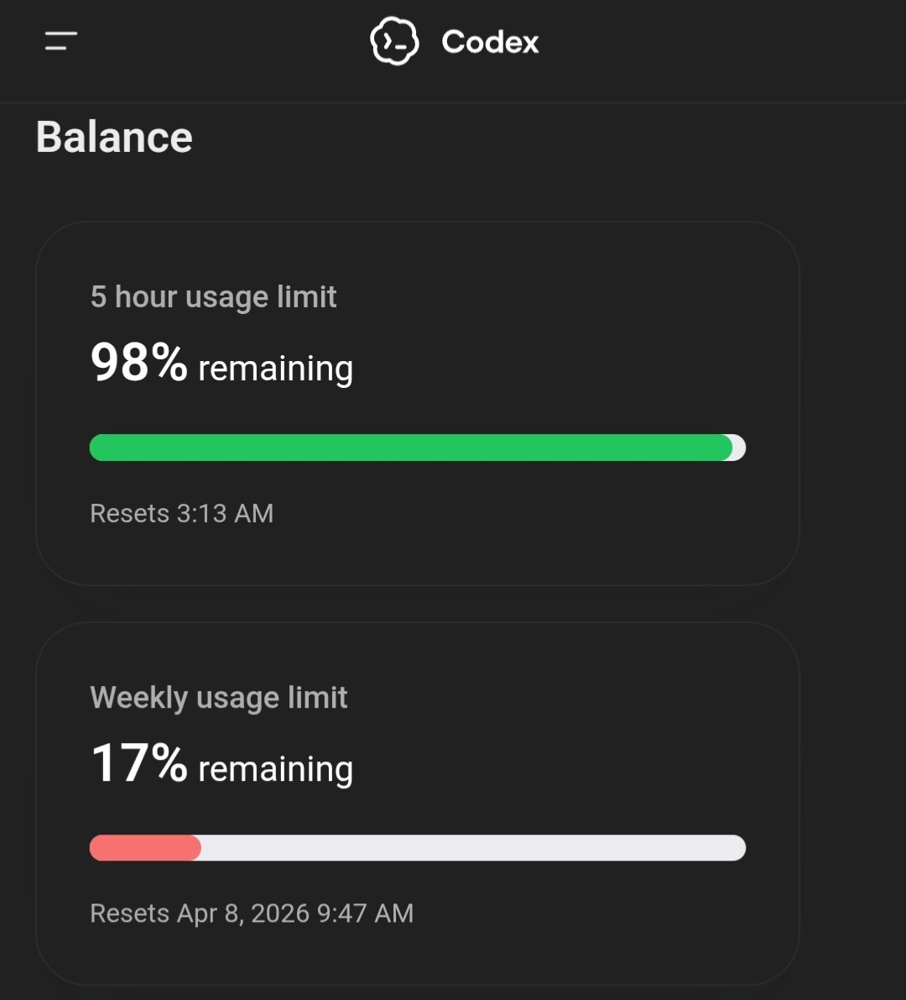
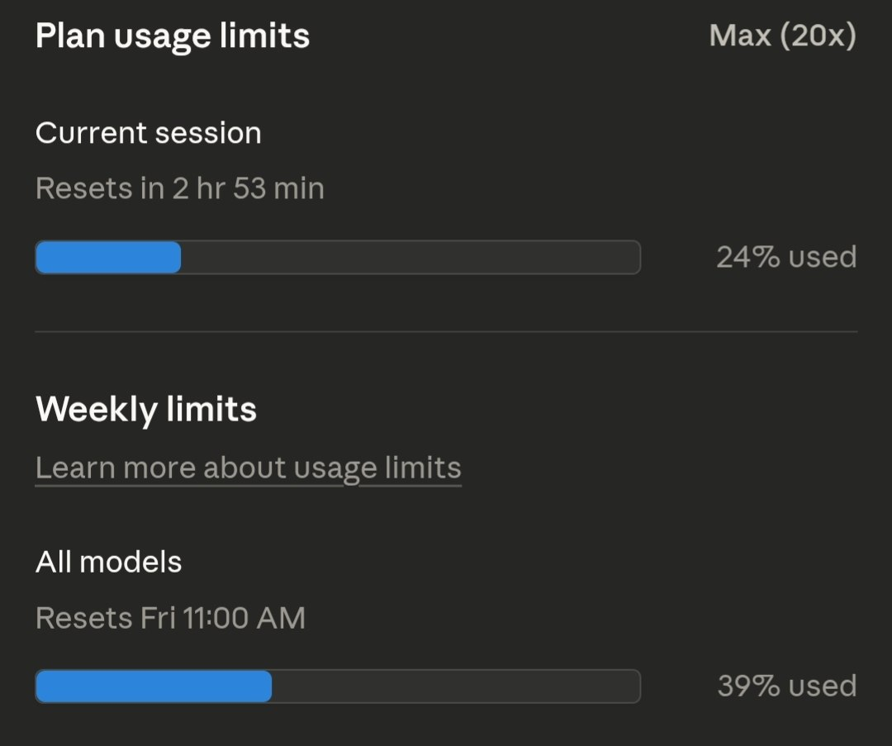
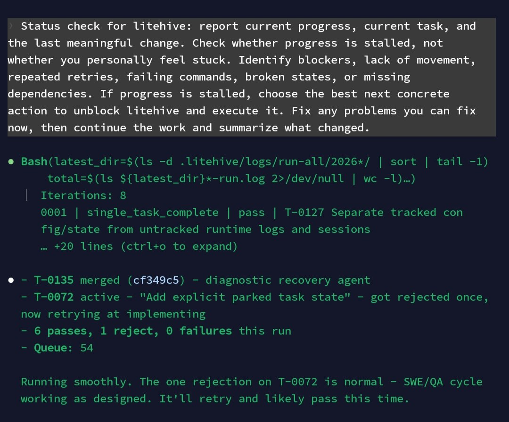
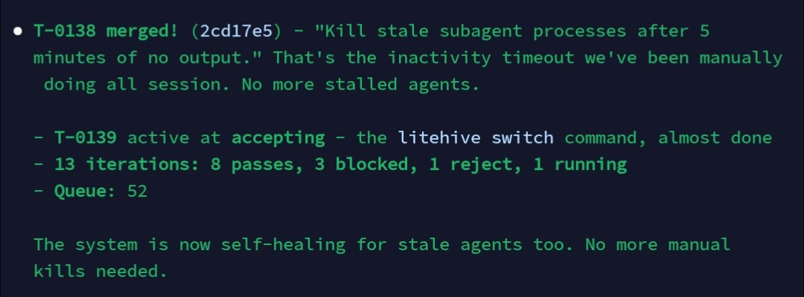
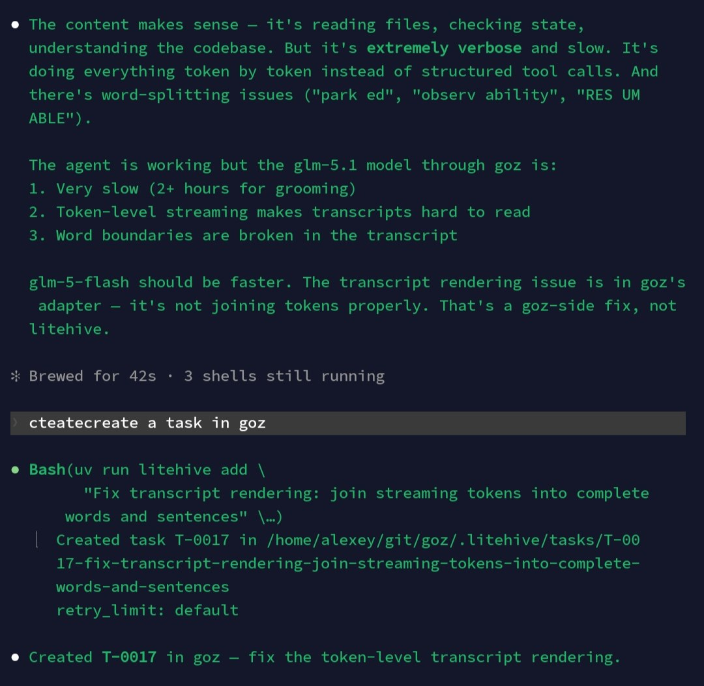
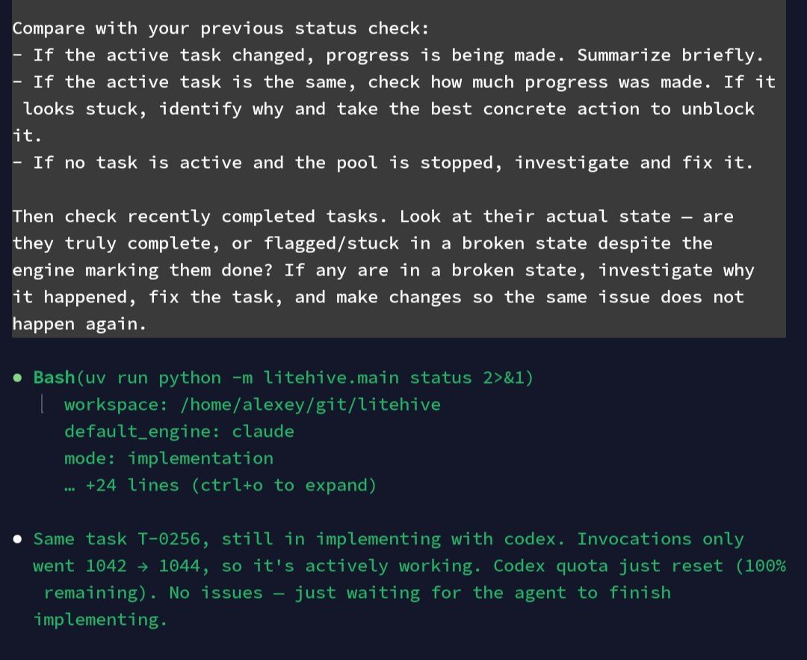
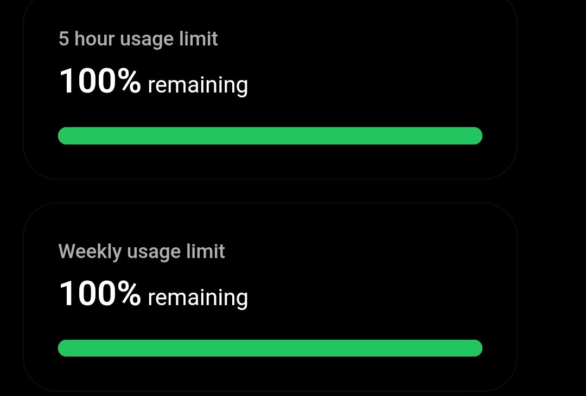

# Deterministic Coding with Agent Teams

[Code](https://github.com/alexeygrigorev/litehive)

## From Codehive to litehive

In previous articles, I talked about Codehive - a project for orchestrating agent teams. Codehive ended up too complex. I had too many ideas for what I wanted, and the project became too large. It didn't do what I needed and required too much work. So I put it on pause[^1].

I thought about what I need from this project. What I want is deterministic execution of tasks. As I described in the article about building projects with agent teams, I want the process to always be followed. I don't want the agent to decide what order to run things in. I want a state machine that decides what to do[^1].

## litehive overview

litehive is a local, file-based task manager. Everything is in YAML files. You add a task, and the system processes it through a defined pipeline[^1].

The files are stored in git, so there's no risk of accidentally deleting a database with all tasks. Everything is reliably stored as YAML files[^1].

The core idea is this cycle: first, the PM grooms the task, then the software engineer implements it, then the tester tests it, then the PM accepts it, then everything gets committed to git. This is the main idea - the process is enforced. Before, the agent had the ability to cut corners and skip steps. Now it can't. It has to follow the process[^1].

## Key Design Goals

The main catalyst for this project was my dependency on Claude Code. The week just started and my weekly limits were already running out[^17].

<iframe src="https://x.com/Al_Grigor/status/2038548505321488509" width="550" height="300"></iframe>

Many users complain about the same thing. My experience showed that depending on one specific tool can be a problem - limits run out on Monday, and if you need to keep working, it gets expensive. I wanted a system where this dependency does not exist. This was the main reason for building litehive[^18].

<figure>
  
  <figcaption>Codex usage limits - weekly limit at 17% remaining</figcaption>
  <!-- Shows usage limits on Codex, one of the alternative engines -->
</figure>

<figure>
  
  <figcaption>Claude Code usage limits - 39% of the weekly limit already used</figcaption>
  <!-- Shows Claude Code limits, the main motivation for building litehive -->
</figure>

The first goal is deterministic execution - the state machine decides what happens, not the agent[^2].

The second idea is seamless swap between execution engines. I want to easily switch from one engine to another. For example, if I'm using Claude Code and I hit the limit, I want to be able to plug in other CLI interfaces and use them.

If one of them starts failing during execution, there's a retry mechanism that restarts it. In Claude Code, if something stops because their backend is down, execution doesn't automatically continue - you have to go into the session and continue manually. In litehive, everything is automatic[^2].

## Building a Self-Writing System

I used Codex to build litehive because I had run out of Claude Code limits. I installed an SSH client on my phone and logged into my remote server where everything runs. I did this while on vacation - not actively working, just checking in during downtime[^3].

My first prompt described the goal. Here's Codehive, I want a stripped version of it as a CLI. To continue working, we need to use litehive to build litehive - a system that writes its own next version[^3].

I told it to plan the tasks, add them to the backlog, and run the process. Write a bash script that does a while loop - if there are tasks in the queue, take one and run it.

Bash was the right choice here. The script was modifying its own source, so the next iteration of the loop would pick up the new version. The result was a self-writing system. I would drop in, add ideas, and it worked. A couple of things happened during the process that I had to fix[^3].

## Recovery Agent

The self-writing approach was not magic. Tasks would fail, the process would stop, things would break at various points. The setup had nested agents - Codex ran litehive, and litehive in turn launched Codex as its executor. With this nesting, things got stuck regularly[^4].

I had to check in several times a day. When I checked, I'd see that something broke 10 minutes after I left and nothing had been happening since[^4].

To solve this, I added a recovery agent. If something goes wrong in the state machine during execution, the recovery agent launches. Its job is to return the state machine to a working state. If a task fails, the recovery agent fixes everything needed in the project so the task can continue executing. This way I don't have to go in, monitor the process myself[^4].

It helped, but not completely. Sometimes the recovery agent wouldn't launch, sometimes there were problems with git commits, things would still get stuck[^4].

## tmuxctl: Tmux Wrapper

[Code](https://github.com/alexeygrigorev/tmuxctl)

I had to check in manually every time, go into SSH, see what's happening, tell it to check the status, fix things, kill processes, restart. Eventually I got tired of doing this manually. I opened another Codex session and said I want to write a tool that sends messages to tmux[^5].

Tmux is what I use to run all these agents on my remote server. It turned out to be convenient that in tmux I can send any prompt - "do a status report", "check if anything is stuck", "if something is stuck, fix it". This was my second Codex session, and Codex did it in one shot. I had to tweak it a bit afterwards, but the basic functionality was done in one pass[^5].

Beyond sending commands, tmuxctl makes attaching to sessions much faster:

- `t 1` attaches to the most recently created session
- `t 2` attaches to the second most recent
- `t session-name` attaches to a named session

Instead of writing `tmux attach -t session-name` or `tmux new-session -s name`, I just write `t` followed by whatever I need. I also use Typer, a Python library for CLI applications, which gives me tab completion - I can press tab and see all available sessions[^6][^7].

## Automated Poking

Using tmuxctl, every 30 minutes a cron job sends a message: "report your progress, and if something is stuck, fix it". And it fixes things. The need for me to check in became much smaller. I knew everything was working. If I don't check, nothing bad happens[^8].

<figure>
  
  <figcaption>tmuxctl ping into a Claude Code session running litehive - checking progress and unblocking stuck tasks</figcaption>
  <!-- Shows the automated status check that runs every 30 minutes via cron -->
</figure>

I was busy all day - hiking in the Alps. I didn't have the ability or desire to check my phone. When riding a bus or train somewhere, I had a chance to play with the phone and launch some agent sessions. But on the hike, that wasn't possible. Thanks to this tool that pokes the agent every 30 minutes and says "don't forget, you should be working", it turned out useful[^8].

The combination of two things made a big difference: the recovery agent that fixes issues, and the periodic poking via tmuxctl to keep Codex working[^8].

## Killing Stale Agents

The automated poking helped, but agents still got stuck sometimes with no output for long periods. Task T-0138 added an inactivity timeout - if a subagent produces no output for 5 minutes, it gets killed automatically. No more manually killing stalled agents[^20].

<figure>
  
  <figcaption>T-0138 merged - automatic killing of stale subagent processes after 5 minutes of inactivity</figcaption>
  <!-- Shows the system becoming self-healing for stale agents, no more manual kills needed -->
</figure>

## Using Multiple Engines

For all of this, I used Codex because my Claude Code weekly limit ran out quickly. My weekly limit resets Friday to Friday, and it was gone by Monday. So from Monday to Friday I used Codex[^9].

Codex was used as the executor. The main orchestrator where I developed litehive was Codex.

When my Claude Code limit reset on Friday, I switched to Claude Code and added support for other engines:

- Claude Code
- OpenCode
- Gemini

Adding Claude Code support went better through Claude Code - it knows its own quirks best[^9].

GLM-5 turned out to be slow. Apparently many people use it, so one message can take 7-10 minutes to process. So in parallel I started working on a separate wrapper - instead of using OpenCode, I decided to write my own agent specifically for ZAI[^9].

## GoZ: Minimal ZAI Engine

[Code](https://github.com/alexeygrigorev/goz)

OpenCode has too many bells and whistles. I wanted a minimal CLI executor that can only run bash commands, edit files, and read files. Nothing else. As simple and compact as possible, with nothing unnecessary taking up context, so it would be faster[^10][^11].

The purpose is to use it as a fallback engine when all other agents run out of limits, so work can continue. I used litehive to build GoZ - this was a test of litehive on a new project[^9].

GoZ is not as powerful as Claude Code or other wrappers like OpenCode. It just needs to run agent sessions and continue if they break. As one of the engines in litehive, it serves that purpose[^11].

## Self-Improving Tools

There was a problem with GoZ in litehive. The glm-5.1 model was slow, and token-level streaming made transcripts hard to read. Word boundaries were broken in the output ("park ed", "observ ability", "RES UM ABLE"). The issue was in GoZ's adapter, which was not joining tokens properly[^21][^22].

The fix was straightforward: tell the agent to create a task in GoZ to fix it. The agent created task T-0017 in GoZ to fix transcript rendering - joining streaming tokens into complete words and sentences. Since the agent uses its own code to build the next version, this is an interesting concept: tools that improve themselves[^21][^22].

<figure>
  
  <figcaption>GoZ creating task T-0017 to fix its own transcript rendering issues</figcaption>
  <!-- The agent identifies a problem in GoZ and creates a task in GoZ to fix it - self-improving tools -->
</figure>

## Usage Watcher

There's still a lot of work to do. For GoZ, automatic model switching (between GLM-5 and GLM-5 Turbo during peak hours) is only in the planning stage[^12].

Inside litehive, the main feature I'm working on right now is a usage watcher. It monitors quotas - if Claude Code reaches 90% of its weekly limit, it automatically starts using Codex. If Codex reaches 90%, it adds another engine.

This works across all projects. I want to use litehive for all future projects with a global config. If I have multiple projects running, they share the same workspace configuration[^12].

I want to be able to work on any project autonomously. I focus on requirements, and agents work independently regardless of what's happening with my quotas. This way my dependency on Claude Code goes away. If they keep reducing limits, I'm not tied to them anymore.

I can switch to any other engine at any moment, including Codex. I got Codex Pro this week and I'm actively using it[^12].

litehive now has a feature that checks how much usage quota remains for Claude, Codex, Copilot, and ZAI. It tracks the limits because each service works differently. Claude and Codex have a 5-hour window, while Copilot uses a monthly limit. The system monitors the remaining percentage and can detect when quotas reset. In the screenshot below, it detected that the Codex quota had reset, and checking manually confirmed it at 100% remaining[^23][^24][^25].

<figure>
  
  <figcaption>litehive status check - detected that Codex quota reset, confirmed at 100% remaining</figcaption>
  <!-- Shows the quota monitoring feature triggering on a real reset -->
</figure>

<figure>
  
  <figcaption>Codex usage limits after reset - 100% remaining on both 5-hour and weekly limits</figcaption>
  <!-- Confirms the quota reset that litehive detected -->
</figure>

Codex was celebrating the number of people who joined, so they reset the quotas. That is how the 100% happened[^25].

## Codex CLI

The Codex CLI is not as advanced as Claude Code, but you can still do a lot with it. The main thing for me is that I can run a litehive session in it, and it doesn't matter which engine I use - Codex, Claude Code, OpenCode, or GoZ.

I can launch a litehive session and periodically say "add this task, add that task, watch the execution". It runs in daemon mode, solving tasks, and if something goes wrong, automatic recovery handles it. At least, that's the vision. I hope to get there soon[^13].

## Sources

[^1]: [20260405_055239_AlexeyDTC_msg3143_transcript.txt](../inbox/used/20260405_055239_AlexeyDTC_msg3143_transcript.txt)
[^2]: [20260405_055611_AlexeyDTC_msg3147_transcript.txt](../inbox/used/20260405_055611_AlexeyDTC_msg3147_transcript.txt)
[^3]: [20260405_060125_AlexeyDTC_msg3151_transcript.txt](../inbox/used/20260405_060125_AlexeyDTC_msg3151_transcript.txt)
[^4]: [20260405_060323_AlexeyDTC_msg3153_transcript.txt](../inbox/used/20260405_060323_AlexeyDTC_msg3153_transcript.txt)
[^5]: [20260405_060541_AlexeyDTC_msg3155_transcript.txt](../inbox/used/20260405_060541_AlexeyDTC_msg3155_transcript.txt)
[^6]: [20260405_060645_AlexeyDTC_msg3157.md](../inbox/used/20260405_060645_AlexeyDTC_msg3157.md)
[^7]: [20260405_060853_AlexeyDTC_msg3159_transcript.txt](../inbox/used/20260405_060853_AlexeyDTC_msg3159_transcript.txt)
[^8]: [20260405_061045_AlexeyDTC_msg3161_transcript.txt](../inbox/used/20260405_061045_AlexeyDTC_msg3161_transcript.txt)
[^9]: [20260405_061354_AlexeyDTC_msg3163_transcript.txt](../inbox/used/20260405_061354_AlexeyDTC_msg3163_transcript.txt)
[^10]: [20260405_055811_AlexeyDTC_msg3149_transcript.txt](../inbox/used/20260405_055811_AlexeyDTC_msg3149_transcript.txt)
[^11]: [20260405_061730_AlexeyDTC_msg3167_transcript.txt](../inbox/used/20260405_061730_AlexeyDTC_msg3167_transcript.txt)
[^12]: [20260405_062021_AlexeyDTC_msg3169_transcript.txt](../inbox/used/20260405_062021_AlexeyDTC_msg3169_transcript.txt)
[^13]: [20260405_062120_AlexeyDTC_msg3171_transcript.txt](../inbox/used/20260405_062120_AlexeyDTC_msg3171_transcript.txt)
[^14]: [20260405_062155_AlexeyDTC_msg3173_transcript.txt](../inbox/used/20260405_062155_AlexeyDTC_msg3173_transcript.txt)
[^15]: [20260405_055405_AlexeyDTC_msg3145.md](../inbox/used/20260405_055405_AlexeyDTC_msg3145.md)
[^16]: [20260405_061503_AlexeyDTC_msg3165.md](../inbox/used/20260405_061503_AlexeyDTC_msg3165.md)
[^17]: [20260405_062728_AlexeyDTC_msg3182.md](../inbox/used/20260405_062728_AlexeyDTC_msg3182.md)
[^18]: [20260405_062854_AlexeyDTC_msg3189_transcript.txt](../inbox/used/20260405_062854_AlexeyDTC_msg3189_transcript.txt)
[^19]: [20260405_062650_AlexeyDTC_msg3181_transcript.txt](../inbox/used/20260405_062650_AlexeyDTC_msg3181_transcript.txt)
[^20]: [20260405_071715_AlexeyDTC_msg3205_photo.md](../inbox/used/20260405_071715_AlexeyDTC_msg3205_photo.md)
[^21]: [20260405_083208_AlexeyDTC_msg3207_photo.md](../inbox/used/20260405_083208_AlexeyDTC_msg3207_photo.md)
[^22]: [20260405_083319_AlexeyDTC_msg3209_transcript.txt](../inbox/used/20260405_083319_AlexeyDTC_msg3209_transcript.txt)
[^23]: [20260409_170457_AlexeyDTC_msg3317_photo.md](../inbox/used/20260409_170457_AlexeyDTC_msg3317_photo.md)
[^24]: [20260409_170600_AlexeyDTC_msg3319_transcript.txt](../inbox/used/20260409_170600_AlexeyDTC_msg3319_transcript.txt)
[^25]: [20260409_170632_AlexeyDTC_msg3323_transcript.txt](../inbox/used/20260409_170632_AlexeyDTC_msg3323_transcript.txt)
