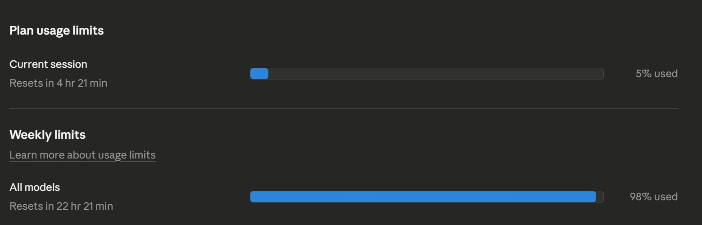
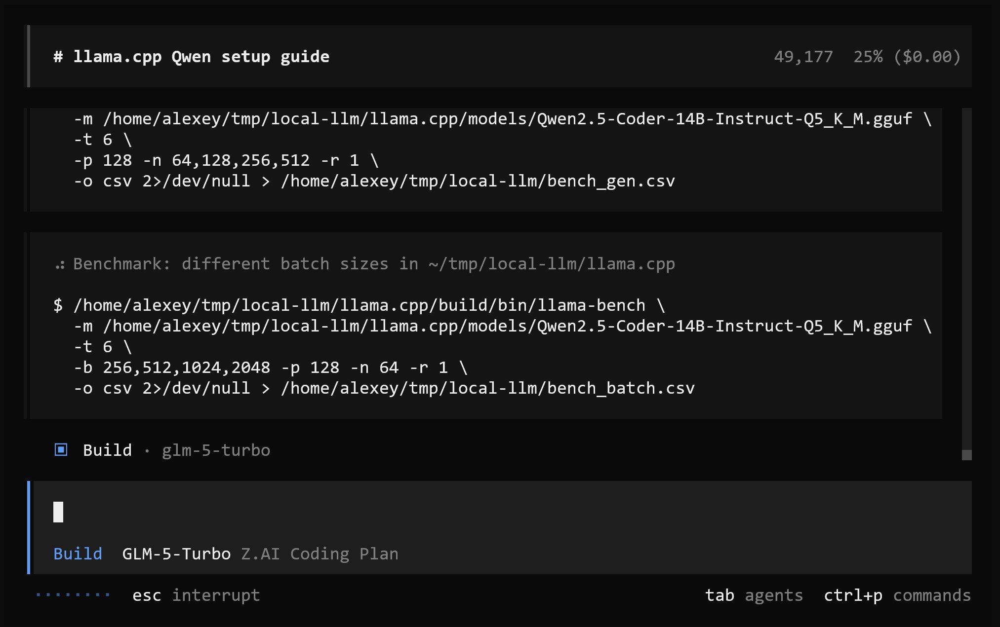

# Running Local LLMs for Coding on a Hetzner Server

After several months of using Claude Code, I hit the weekly token limit for the first time. The cause is unclear. Anthropic may have been gradually reducing limits, or I was especially active this week.

In the past, when preparing interview questions, I was processing a lot of content and tokens were flying. This week did not feel particularly heavy, but the weekly limit ran out fast[^1].

<figure>
  
  <figcaption>Claude Code weekly usage at 98% - first time hitting the limit after months of use</figcaption>
  <!-- Screenshot of the plan usage limits dashboard showing current session at 5% used but weekly limits at 98% used with 22 hours until reset -->
</figure>

## Trying Local Models on Hetzner

Since the weekly limit was running out, I decided to experiment with running a local LLM. I have a Hetzner dedicated server with 64 GB of RAM. I thought this would be a good time to finally try quantized models. I have heard they work reasonably well now[^1].

I wanted to compare multiple approaches:

- Local quantized models via llama.cpp
- CLI tools for Gemini
- CLI tools for GitHub Copilot

The main question was how independent I can be from paid services and how much worse the quality is[^1].

Objectively measuring quality is hard. By benchmarks, quantized models lose significantly to closed models. But I wanted to evaluate subjectively.

For example, I did not notice the difference between Opus 4.5 and 4.6. People say the difference is fantastic. If those feel the same to me, the gap to an open-source model may also feel small. For simple tasks I might be able to get by with a self-hosted model[^1].

## Benchmarking Quantized Models

I ran benchmarks using llama-bench with the Qwen2.5-Coder-14B-Instruct model (Q5_K_M quantization) on CPU with 6 threads. Tested different generation lengths and batch sizes[^2].

<figure>
  
  <figcaption>Running llama-bench with Qwen2.5-Coder-14B-Instruct-Q5_K_M - testing generation and batch size parameters</figcaption>
  <!-- Screenshot showing benchmark commands testing generation with p=128 n=64,128,256,512 and batch sizes of 256,512,1024,2048 on CPU with 6 threads -->
</figure>

## Results: Not Fast Enough on CPU

I experimented with quantized Qwen2.5 and DeepSeek models. The first one (Qwen) is slow. The second (DeepSeek) is a bit faster but still feels slow. We are probably not there yet to run good coding models on CPU fast enough for a productive workflow[^3].

<figure>
  
Video: Screen recording of local LLM experiments with quantized models (0m 46s, 2018x1216) - <a href="https://t.me/c/3688590333/3014">View on Telegram</a>

  <figcaption>Experimenting with quantized Qwen2.5 and DeepSeek - both too slow on CPU for practical coding use</figcaption>
  <!-- Screen recording showing the actual speed of inference with quantized models, demonstrating why CPU-only local LLMs are not yet practical for coding -->
</figure>

## Sources

[^1]: [20260319_104603_AlexeyDTC_msg3008_transcript.txt](../inbox/used/20260319_104603_AlexeyDTC_msg3008_transcript.txt)
[^2]: [20260319_110334_AlexeyDTC_msg3012_photo.md](../inbox/used/20260319_110334_AlexeyDTC_msg3012_photo.md)
[^3]: [20260319_124202_AlexeyDTC_msg3014_video.md](../inbox/used/20260319_124202_AlexeyDTC_msg3014_video.md)
