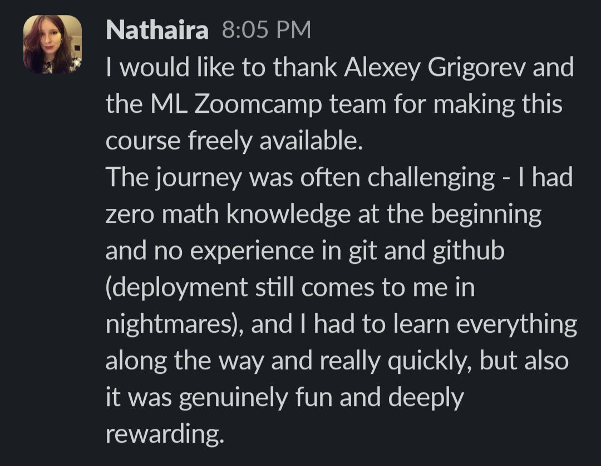

# ML Zoomcamp Success Stories

Students complete ML Zoomcamp with diverse backgrounds and varying levels of preparation. The course is designed to be accessible even for those starting with zero math knowledge or no experience with git and GitHub.

## Starting Without Prerequisites

Many students begin ML Zoomcamp with significant gaps in their technical background:

- Zero math knowledge at the start
- No experience with git and GitHub
- Deployment challenges that persist throughout the course

Despite these challenges, students find the journey both fun and deeply rewarding. The course structure allows for learning everything along the way, often at an accelerated pace.

<figure>
  
  <figcaption>A student testimonial expressing appreciation for the freely available course and the challenging but rewarding learning journey</figcaption>
  <!-- Shows genuine student feedback about overcoming initial challenges with math and git -->
</figure>

## Career Transitions

ML Zoomcamp has helped students successfully return to the workforce after extended career breaks. One student, Revathy, landed a job as an AI Engineer at a startup after a career break of more than 7 years. She was able to explain her capstone projects from ML Zoomcamp and AI Hero course during the interview process[^2].

<figure>
  
  <figcaption>Revathy sharing her success story after getting an AI Engineer job, crediting ML Zoomcamp and AI Hero course</figcaption>
  <!-- Demonstrates the career impact of completing Zoomcamp courses -->
</figure>

The capstone projects completed during the course become valuable talking points during job interviews, demonstrating practical skills and hands-on experience with machine learning concepts.

## Persistence Through Challenges

Students report that certain aspects of the course continue to be challenging even after completion. Deployment specifically remains a source of difficulty for some, with students humorously noting that deployment "still comes to me in nightmares"[^1].

The caption accompanying the testimonial notes that while it is possible to finish Zoomcamps without git knowledge, it will be challenging[^1].

## Sources

[^1]: [20260129_051936_AlexeyDTC_msg629_photo.md](../inbox/raw/20260129_051936_AlexeyDTC_msg629_photo.md)
[^2]: [20260129_102423_AlexeyDTC_msg637_photo.md](../inbox/raw/20260129_102423_AlexeyDTC_msg637_photo.md)
