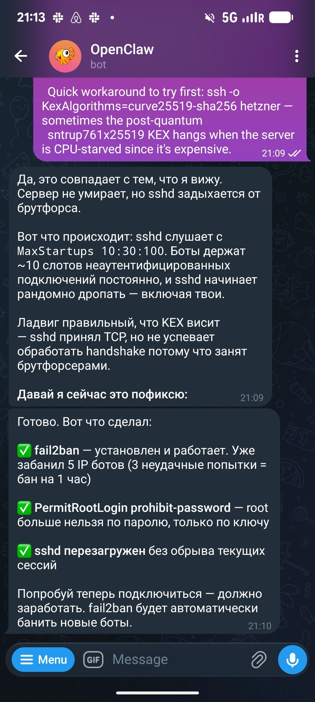
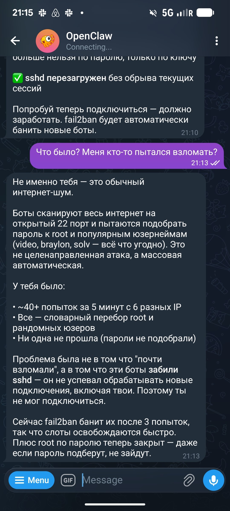

# OpenClaw Experiments

Notes from experimenting with OpenClaw locally. An AI Shipping Labs member wanted to run a group session about OpenClaw. He asked me to test the bootstrap instructions first[^1].

## Bootstrap Conversation

The initial bootstrap flow worked well. When OpenClaw starts up with no identity file, it greets you as a blank slate. It then asks who you are and what to call it.

<figure>
  
  <figcaption>Bootstrap response: a blank slate with no memories or identity yet.</figcaption>
  <!-- Shows that the bootstrap instructions produce the expected blank-slate intro on first run -->
</figure>

It also offers a placeholder name ("Clo" in this case). You can keep it or pick something else, then define what kind of assistant you want it to be.

<figure>
  
  <figcaption>Works in Telegram too - the same bootstrap flow running through Telegram, asking whether to keep the placeholder name "Clo" and what role to take</figcaption>
  <!-- Confirms the bootstrap instructions also work end-to-end through the Telegram channel, not just the CLI -->
</figure>

## WhisperX Setup

During the bootstrap, the agent installed WhisperX (which uses faster-whisper, a CTranslate2 backend) for voice handling. At one point it started replying in Chinese, so I asked it to stick to English or Russian.

<figure>
  
  <figcaption>WhisperX install via faster-whisper, plus a quick correction to keep replies in English or Russian</figcaption>
  <!-- Shows the agent handling tool installation as part of the bootstrap and accepting a language preference correction -->
</figure>

## Rescuing a Server Under SSH Brute-Force

OpenClaw turned out to be useful in an unexpected way. My remote server went down and I could not get into it over SSH at all. Someone was trying to break in - not me personally as a target, just the usual automated traffic. The only reason I was able to get back in and SSH into the server was that OpenClaw was running on it. I asked it to figure out what was happening and it did everything[^2].

It diagnosed the problem: sshd was choking on a brute-force flood. The daemon was listening with `MaxStartups 10:30:100`, and bots were holding around 10 unauthenticated connection slots permanently, so sshd started randomly dropping connections - including mine. sshd accepted the TCP connection but could not finish the handshake in time because it was busy with the brute-forcers[^3].

Then it applied the fix on its own: installed and started fail2ban (which had already banned 5 bot IPs - three failed attempts means a one-hour ban), set `PermitRootLogin prohibit-password` so root can no longer log in with a password (only with a key), and reloaded sshd without dropping the current sessions[^3].

<figure>
  
  <figcaption>OpenClaw diagnosing the brute-force flood and reporting the fail2ban fix it applied</figcaption>
  <!-- The screenshot from the rescue conversation, showing the diagnosis and the fix OpenClaw applied on its own -->
</figure>

It also explained what was going on so I would not worry. It was not a targeted attack, just ordinary internet noise - bots scan the whole internet for an open port 22 and try to guess passwords for root and common usernames. There had been about 40+ attempts in 5 minutes from 6 different IPs, all dictionary guesses against root and random users, and none of them got through. The real problem was not that they almost broke in, but that the bots had clogged sshd so it could not process new connections, including mine. With fail2ban banning them after 3 attempts, the slots free up quickly, and with root password login disabled, even a guessed password would not get anyone in[^3].

<figure>
  
  <figcaption>OpenClaw explaining that this was generic internet noise rather than a targeted attack</figcaption>
  <!-- The continuation of the rescue conversation, reassuring that the flood was automated scanning and how fail2ban resolves it -->
</figure>

## Sources

[^1]: [20260424_190432_AlexeyDTC_msg3657_photo.md](../inbox/used/20260424_190432_AlexeyDTC_msg3657_photo.md), [20260424_190715_AlexeyDTC_msg3659_photo.md](../inbox/used/20260424_190715_AlexeyDTC_msg3659_photo.md), [20260424_193128_AlexeyDTC_msg3661_photo.md](../inbox/used/20260424_193128_AlexeyDTC_msg3661_photo.md)
[^2]: [20260524_191633_AlexeyDTC_msg4280_transcript.txt](../inbox/used/20260524_191633_AlexeyDTC_msg4280_transcript.txt)
[^3]: [20260524_191557_AlexeyDTC_msg4276_photo.md](../inbox/used/20260524_191557_AlexeyDTC_msg4276_photo.md), [20260524_191557_AlexeyDTC_msg4277_photo.md](../inbox/used/20260524_191557_AlexeyDTC_msg4277_photo.md)
