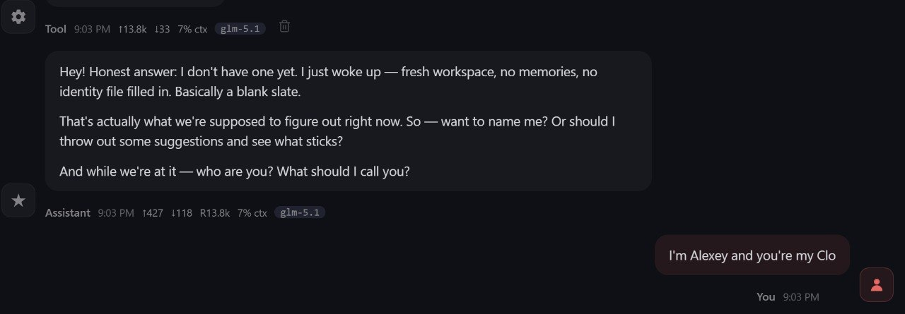
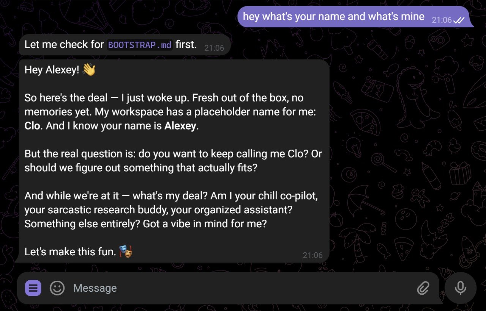
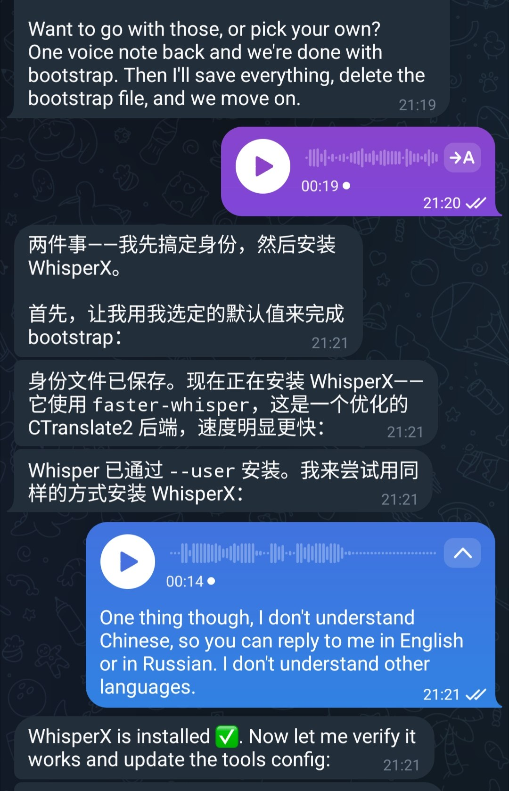

# OpenClaw Experiments

Notes from experimenting with OpenClaw locally. An AI Shipping Labs member wanted to run a group session about OpenClaw. He asked me to test the bootstrap instructions first[^1].

## Bootstrap Conversation

The initial bootstrap flow worked well. When OpenClaw starts up with no identity file, it greets you as a blank slate. It then asks who you are and what to call it.

<figure>
  
  <figcaption>Bootstrap response: a blank slate with no memories or identity yet.</figcaption>
  <!-- Shows that the bootstrap instructions produce the expected blank-slate intro on first run -->
</figure>

It also offers a placeholder name ("Clo" in this case). You can keep it or pick something else, then define what kind of assistant you want it to be.

<figure>
  
  <figcaption>Works in Telegram too - the same bootstrap flow running through Telegram, asking whether to keep the placeholder name "Clo" and what role to take</figcaption>
  <!-- Confirms the bootstrap instructions also work end-to-end through the Telegram channel, not just the CLI -->
</figure>

## WhisperX Setup

During the bootstrap, the agent installed WhisperX (which uses faster-whisper, a CTranslate2 backend) for voice handling. At one point it started replying in Chinese, so I asked it to stick to English or Russian.

<figure>
  
  <figcaption>WhisperX install via faster-whisper, plus a quick correction to keep replies in English or Russian</figcaption>
  <!-- Shows the agent handling tool installation as part of the bootstrap and accepting a language preference correction -->
</figure>

## Sources

[^1]: [20260424_190432_AlexeyDTC_msg3657_photo.md](../inbox/used/20260424_190432_AlexeyDTC_msg3657_photo.md), [20260424_190715_AlexeyDTC_msg3659_photo.md](../inbox/used/20260424_190715_AlexeyDTC_msg3659_photo.md), [20260424_193128_AlexeyDTC_msg3661_photo.md](../inbox/used/20260424_193128_AlexeyDTC_msg3661_photo.md)
