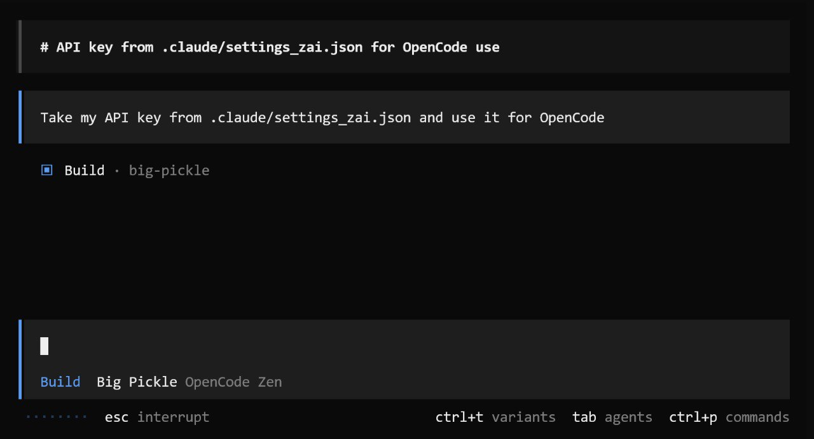

# OpenCode Experiments with GLM-5

Experimenting with OpenCode - an open-source AI coding assistant - using the new GLM-5 model from Z.AI. Two projects: a microphone booster app and an RPG game, both built with vibe coding.

## Getting Started with OpenCode

When I installed OpenCode, it just started working. I am not sure how or which API key it used. I asked it to use my Z.AI key - they recently released a new model (GLM-5) and I wanted to try it with OpenCode. I also heard good things about OpenCode - it has more features, so I wanted to try it[^2].

<figure>
  
  <figcaption>Setting up OpenCode to use the Z.AI API key for GLM-5</figcaption>
  <!-- Screenshot of the initial terminal setup where the user configures OpenCode with the Z.AI key -->
</figure>

## Desktop App vs Terminal

I tried OpenCode first in terminal mode. I am not a fan of the terminal mode, neither in Claude Code nor in OpenCode. The desktop version is more convenient[^6].

The desktop mode in OpenCode is built on Visual Studio Code - it looks like a VS Code fork, adapted for AI coding. It is very convenient - I can open multiple projects and sessions at the same time[^7].

<figure>
  
  <figcaption>OpenCode desktop app - prefer this over terminal mode</figcaption>
  <!-- Shows the desktop interface with project directory, branch info, and GLM-5 model selector -->
</figure>

<figure>
  
  <figcaption>OpenCode analyzing the project - exploring codebase structure through key files</figcaption>
  <!-- Shows the thinking/planning mode where OpenCode explores the codebase before acting -->
</figure>

OpenCode has the usual two modes like other AI assistants - a planning mode and a build mode. I spent about an hour getting familiar with it. I noticed I needed a subagent feature but have not explored that yet[^7].

I was doing all this in the background while my main task was recording course videos. When Claude Code was doing something for the course - for example, updating document descriptions from transcripts for the Maven site - I would switch over and check what OpenCode was doing[^7].

I can also run OpenCode as a web service. My plan is to try this - with Claude Code it would require more effort to set up, but with OpenCode it works without problems[^7].

## Project 1: Microphone Booster App

### The problem

At home I use regular headphones for recording and the sound is okay, though some people have complained about it in YouTube videos. The built-in Windows microphone booster works with headphones plugged into the audio jack port, but it does not boost as much as I would like. And it does not work at all with USB-C devices. I wanted a more universal solution[^4].

When recording away from home, I use Apple earbuds with a USB-C connector. They have a good microphone - much better than my laptop's built-in microphone - but the audio comes out too quiet[^4].

Today was exactly this situation - I needed to record a video, was not at home, and only had my Apple earbuds. I decided to try writing a booster app to see what happens[^4].

### Building with GLM-5

I asked OpenCode with GLM-5 to implement it. I said I do not care about the technology, so it chose Rust with Tauri 2.0 and Svelte for the UI[^5].

<figure>
  
  <figcaption>GLM-5 chose Rust with Tauri 2.0 and Svelte for the microphone booster</figcaption>
  <!-- Shows the architecture plan with src-tauri for Rust backend and Svelte frontend -->
</figure>

### Three attempts to get it right

The microphone booster works well, but it took three attempts to get there[^1].

First attempt: GLM-5 built a complex application with some kind of browser engine inside. It used Svelte for the interface - which I did not notice at first, it is right there in the plan screenshot. The UI looked mediocre and the app was heavy. Worse, it completely forgot about the booster requirement and just made a sound recording app. And even that did not work - when I pressed record, it would record something, but the resulting file played back 100 times slower than the actual recording. It did not account for any of my requirements - just made something with a record button[^1].

I told it to rewrite everything. It said that making a microphone booster is too complex and it cannot figure out how to do it[^1].

On the third attempt, it rewrote everything from scratch and it worked well. The booster worked, the recording worked. There were a couple of small issues I asked it to fix, but overall I was satisfied[^1].

I had to intervene - I was hoping it would work on the first try. Despite GLM-5 being the new model that is supposed to be impressive, things were not as rosy as expected[^1].

### The good outcome

The app ended up working well. It uses native Windows APIs. The best part is that I now know this technology stack - Tauri + Rust - and can use it to build GUI applications for Windows. These apps are self-contained - no libraries, no .NET, nothing else needed. They just work out of the box[^1].

### FFmpeg wrapper use case

This is relevant because I had a case where I needed to make a tool for a DataTalks Club team member who is a community manager, not a developer. She needs to run FFmpeg commands, which is not easy even for me - FFmpeg is complex and it is easy to make mistakes with parameters. A GUI is much better for this[^2a].

I previously tried building an FFmpeg wrapper in Python GUI and with .NET, but neither was straightforward - guessing the right .NET version and other issues. Now with Rust, I have hope that I can build self-contained GUI apps quickly. I plan to make an FFmpeg wrapper for her so she can just paste a video link and cut/trim videos more easily[^2a][^3].

Right now she has to write FFmpeg commands herself and run them. Even I would not want to do that - I would write some wrapper in Python, because FFmpeg is complex and it is easy to make a mistake with a parameter or copy the wrong thing. A GUI is much better for this kind of work[^3].

## Project 2: AI Engineer RPG Game

### How the idea came about

One of my friends and fellow speakers, who I know personally, is very into vibe coding - he has been doing it for a long time and is a real pro at it. I constantly discuss ideas with him. He is going to give a talk at our DataTalks Club soon[^5a].

When the new Sonnet came out, he tried making an RPG game with it. He sent screenshots and videos saying "look how well this works." I got interested. He said he wrote it in Rust. I have never done game development - I made text games in the terminal and simple HTML browser games when I was about 12 years old, and that was it[^5a].

I was interested to try because I have this understanding that to code something new, you need to understand at least a little bit about it, so you can look at the code and steer it in the right direction[^5a].

My long-standing idea is to make an interactive interview preparation trainer as an RPG. When I first started experimenting with agents, I wanted to make an RPG where the NPCs are actual LLM-powered agents. I could walk up to them, talk to them, and learn things from them - with an LLM controlling everything inside. That project stalled, but I want to come back to it[^5a].

Today I just pointed OpenCode at my old project and said "look at what is here and let's implement this idea as an RPG in Rust"[^5a].

### The implementation plan

GLM-5 built a plan and said it would take about 4 hours to implement[^8].

<figure>
  
  <figcaption>The implementation plan - 7 phases, estimated 4 hours total</figcaption>
  <!-- Shows the phased plan: Macroquad setup, tile map, NPCs, study system, job board, interview quiz, and polish -->
</figure>

I was excited seeing the detailed plan. But 20 minutes later it said "done, check it out." I said "you planned 4 hours but finished in 20 minutes?" It admitted it cut corners. I asked it to show what shortcuts it took, and it listed everything it skipped - about 80% of what was planned was not implemented[^8].

### Testing the game

I tried running it and nothing worked. The graphics were off - the image was flipped, mirrored, and running off screen. One limitation is that I cannot tell the agent to launch the game, look at it, and fix things by itself. I do not know how to set up this feedback loop. With browser-based apps I can imagine launching through a browser and somehow controlling it, but with desktop applications I have no idea how to do this[^8].

I sent a screenshot showing what was wrong. After two more iterations, it got significantly better. By the third iteration, it actually looked like what I wanted. The graphics are very simple - basic shapes - but for a start it is fine[^8].

<figure>
  
Video: First version of the AI engineering game (0m 31s, 1080p) - <a href="https://t.me/c/3688590333/1627">View on Telegram</a>

  <figcaption>First version of the AI engineering game</figcaption>
  <!-- Screen recording showing the RPG game running with basic graphics and character movement -->
</figure>

I want to emphasize that my main attention was focused on other things - course recording and video production. I was doing this in the background. OpenCode sends push notifications when work is ready. I would get a notification, switch over to check, and if something did not work, I would send a screenshot and let it keep fixing while I went back to my main work[^8].

### Future plans for the game

I want to attach LLMs to all the NPC characters. I will use some LLM - maybe OpenAI, maybe Anthropic, I have not decided yet. They do not need to be full agents - just conversational, like a conversational chatbot with some prompts. The NPCs should be characters I can walk up to and have actual conversations with[^9].

For agents, the maximum would be a database with interview questions. Both the player and the agents could have some memory. I have not figured out all the details yet[^9].

The NPCs could have different roles - for example, recruiter agents. The gameplay mechanic would be leveling up your character by passing interviews[^5a].

I plan to work on this after I finish the current course. I think this would be a great thing for the new community - something for people to play with[^9].

## Overall Impressions of OpenCode

All these experiments - both the booster and the RPG game - I did in OpenCode[^6].

My impression of OpenCode is positive. The desktop mode is great. As for GLM-5, it is decent but I do not really see a big difference from the previous GLM-4. All these agents cut corners and you need to watch them and set up proper processes. Right now I just used plain OpenCode with no custom processes set up. I think I need to set up proper workflows and then the results will be better[^8].

The testing challenge remains unsolved - I have no idea how to test desktop applications in any agent, not just OpenCode. I can extract core functionality into separate testable modules, but testing the UI is something I do not know how to do[^8].

## Sources

[^1]: [20260213_143306_AlexeyDTC_msg1601_transcript.txt](../inbox/used/20260213_143306_AlexeyDTC_msg1601_transcript.txt)
[^2]: [20260213_090850_AlexeyDTC_msg1591.md](../inbox/used/20260213_090850_AlexeyDTC_msg1591.md)
[^2a]: [20260213_143624_AlexeyDTC_msg1602_transcript.txt](../inbox/used/20260213_143624_AlexeyDTC_msg1602_transcript.txt)
[^3]: [20260213_143701_AlexeyDTC_msg1603_transcript.txt](../inbox/used/20260213_143701_AlexeyDTC_msg1603_transcript.txt)
[^4]: [20260213_143859_AlexeyDTC_msg1604_transcript.txt](../inbox/used/20260213_143859_AlexeyDTC_msg1604_transcript.txt)
[^5]: [20260213_100439_AlexeyDTC_msg1599_photo.md](../inbox/used/20260213_100439_AlexeyDTC_msg1599_photo.md)
[^5a]: [20260213_144259_AlexeyDTC_msg1605_transcript.txt](../inbox/used/20260213_144259_AlexeyDTC_msg1605_transcript.txt)
[^6]: [20260213_144434_AlexeyDTC_msg1606_transcript.txt](../inbox/used/20260213_144434_AlexeyDTC_msg1606_transcript.txt)
[^7]: [20260213_145200_AlexeyDTC_msg1607_transcript.txt](../inbox/used/20260213_145200_AlexeyDTC_msg1607_transcript.txt)
[^8]: [20260213_145555_AlexeyDTC_msg1608_transcript.txt](../inbox/used/20260213_145555_AlexeyDTC_msg1608_transcript.txt)
[^9]: [20260213_145721_AlexeyDTC_msg1609_transcript.txt](../inbox/used/20260213_145721_AlexeyDTC_msg1609_transcript.txt)
