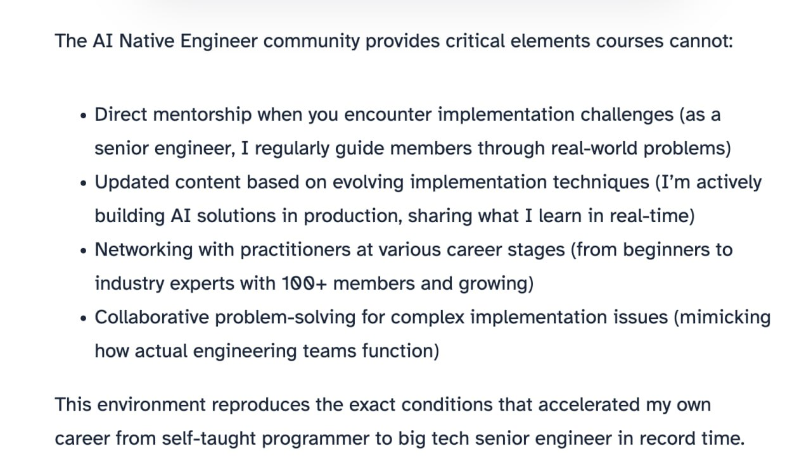

# Paid AI Engineers Community Planning

Planning a paid community for AI Engineers, including target audience, tier structure, pricing, and activities.

## The Goal

Create a paid community for AI Engineers that:
- Provides real value beyond free content
- Attracts active, motivated learners and builders
- Scales without requiring excessive personal time
- Has a clear identity separate from any individual

The challenge is designing something that feels like a true community, not just a following.

## Target Audience

The ideal community member is:

**Enthusiastic and action-oriented**
- They enjoy learning new things
- They have time and enthusiasm to build
- They are active people who want to apply their efforts to building something
- They love learning by doing, not just watching lectures

**Needs structure and direction**
- They have the desire to build but lack:
  - Clear ideas
  - Understanding of next steps
  - Project structure
  - Focus to avoid distractions
- They need frameworks that help them stay on track toward their goals

**Examples from existing community**
- Fred - created the FAQ assistant
- A student from the Hackathon who contributed to "Professor"
- Eteri Valti - completed ML Bootcamp, AI DevTools, AI Hero course; actively asks how to help with community; recently found a job
- Rakis (from Greece) - built multiple projects for DataTalks Club: a Streamlit app showcasing all Zoomcamp projects, a project evaluator agent
- A student from a recent workshop who was one of the first in Data Engineering; after finding a job, donated part of her learning budget back

These are the kinds of active contributors the community should attract more of.

## Problems to Solve

The key question is: what problems do these people have that they would pay to solve?

Potential pain points:
- Want to transition to AI Engineering
- Already work as Data Scientists/ML Engineers but want to do more interesting work
- Want career advancement guidance
- Need structure and accountability for their learning
- Want to work on projects but don't know what to build

Research is needed to validate which problems are most pressing and what solutions people would pay for.

## Community Identity

**Current naming challenge**
Existing names like "AI Builders" and "AI Engineering" are already taken. The ideal name should:
- Be connected to building (hands-on creation)
- Relate to AI
- Connect with existing brand (newsletter, course, AI Engineering Buildcamp)
- Be distinctive

## Tier Structure

Following standard pricing psychology, a three-tier structure makes sense:

**Tier 1: Basic**
- Lower price point
- Community access
- Basic content

**Tier 2: Main offering**
- The target price point (around $35-50/month being considered)
- Most members should land here
- Maximum perceived value
- Project work, content sharing, learning together

**Tier 3: Premium**
- Higher price point
- Makes Tier 2 look more reasonable by comparison
- Could include courses or exclusive content
- Limited time commitment from founder

The third tier serves an important psychological purpose: when presented with three options, people tend to choose the middle one. This is a standard pricing tactic recommended in business books.

## Tier 2: Core Offering Ideas

This should be the main value proposition:

**Community activities**
- Project implementation sessions
- Paper implementation projects
- Hackathon-style community projects
- Resume review sessions (visible to all as community learning)
- Career advancement discussions
- Workplace effectiveness and productivity

Course requests and influence
Since the current course catalog is limited, community members can request and influence which courses get developed. The courses offered can be shaped based on what people in the community want to learn[^33].

**Key principle**: The value should come from the community, not just from the founder. Activities should work even without direct involvement.

## Tier 3: Premium Ideas

The challenge is creating value that doesn't require excessive time commitment:

**Courses**
- Exclusive mini-courses on specialized topics
- Examples: Claude Code course, testing course, AI agents workshop material
- Content is already being created - just packaged for members
- Andreas Kretz model: subscription gives access to all courses, new courses added regularly to reduce churn

**Occasional one-on-one**
- Not a recurring commitment
- Opportunity to occasionally connect directly
- Could be formatted as group sessions rather than individual
- Problem: feels like it depends too much on founder

**Better approach**: Design Tier 3 so the founder's involvement feels like a bonus, not the main value.

## Learning from Andreas Kretz

Andreas Kretz (LinkedIn influencer with a Data Engineering school) used this approach:
1. Started with 1:1 mentoring
2. While mentoring, observed common problems across students
3. Created courses to solve these common problems
4. Scaled from 5 students to hundreds
5. Subscription model provides access to all courses
6. Continuously creates new courses to reduce churn

**Key insight**: Start with direct interaction to understand problems, then productize the solutions.

## Proposed Approach

**Phase 1: Start with students**
- Begin with AI Buildcamp students (they get free access as course alumni)
- Conduct interviews to understand their needs
- Offer some 1:1 sessions initially to learn what problems they have
- Use these sessions for research, not as long-term commitment

**Phase 2: Interview approach**
- Ask people joining: what brought you here, what do you want, what problems do you want to solve?
- This is how DataTalks Club started - personal messages to every new member
- Use the feedback to shape content and offerings

**Phase 3: Iterate based on reality**
- The theoretical ideal audience may not match who actually joins
- Plans should evolve based on real members
- Don't over-plan before seeing who is interested

## Reducing Founder Dependency

A key concern: the community should feel like a community, not "pay to talk to the founder."

**Ways to address this**:
- Design activities that members run themselves
- Have someone else (e.g., a community manager) lead regular check-ins
- Create peer-to-peer activities
- Make the founder's presence a bonus, not the main attraction
- Ensure value for people who discover the community through search (who don't know the founder)

This is important both for sustainability and for how the community appears to outsiders.

## Next Steps

1. Start with AI Buildcamp students (free access for course alumni)
2. Conduct interviews to understand what they want
3. Use these conversations to identify common problems
4. Design tier 2 to provide maximum value for these problems
5. Design tier 3 primarily to make tier 2 look attractive
6. Iterate based on who actually joins

The key is to learn from real members rather than assuming what they want.

## Marketing and Finding the Right Audience

A key challenge is marketing and finding people who can pay for the community. DataTalks Club may not be the ideal place to find paying members because:
- The courses are free
- Many members are from countries with lower purchasing power (India, Nigeria, etc.)
- They may not have the ability to pay for a paid community

Alternative channels to explore:
- Social media platforms where the target audience spends time
- Other communities where AI engineers gather
- AI optimization and SEO strategies
- CEO-level networking and partnerships

The goal is to find people who have both the interest and the financial capacity to pay for a premium community.

## Community Activity Ideas

Based on research of other communities like "AI Native Engineer", potential activities include:

<figure>
  
  <figcaption>Example from AI Native Engineer showing the key elements that communities can provide beyond courses</figcaption>
  <!-- This illustrates direct mentorship, updated content, networking, and collaborative problem-solving -->
</figure>

**Regular content reviews**
- Weekly or bi-weekly reviews of new research papers
- Hot articles and tools worth exploring
- Members can be assigned to research specific topics and share findings
- This creates engagement and distributes content creation workload

**Mentorship and guidance**
- Direct mentorship for implementation challenges
- Updated content based on evolving techniques
- Networking with practitioners at various career stages
- Collaborative problem-solving for complex issues

The environment should reproduce the conditions that accelerate career growth, similar to how the founder went from self-taught to big tech senior engineer.

## Learning in Public and Personal Branding

A key benefit for the paid community could be helping members with career advancement through learning in public and personal branding. This would include guidance on:

- How to properly do learning in public
- How to create content effectively
- How to promote on X (Twitter) and LinkedIn
- How to generate ideas for content
- How to maintain consistency in posting

Personal branding was instrumental in career advancement - the founder was hired for a previous job because they were already known and wanted by the employer[^31]. This is particularly valuable for students who want career advancement or are looking for new jobs.

The idea is to create resources about promotion on X, LinkedIn, and creating personal websites. This could include round table sessions for personal brand reviews, where community members can give each other feedback and help each other with social media algorithms[^28].

The community aspect is important here - when more people are involved in a founders-type community, there is less pressure for content to come only from one person. Community members also participate and create things, making it feel more like a collective effort rather than a one-person show[^27].

Examples of content that could be shared include behind-the-scenes work for community projects, such as building visualization tools or websites. The community manager role encompasses moderating, creating content, formatting, and promoting both content and the community itself[^30].

## Conference Speaking Support

Another potential community benefit: maintain a regularly updated list of conferences and help community members participate as speakers by connecting them with organizers. This provides tangible career value and public speaking experience[^29].

## Sources

[^1]: [20260210_214500_AlexeyDTC_msg1295_transcript.txt](../inbox/raw/20260210_214500_AlexeyDTC_msg1295_transcript.txt)
[^2]: [20260210_214612_AlexeyDTC_msg1297_transcript.txt](../inbox/raw/20260210_214612_AlexeyDTC_msg1297_transcript.txt)
[^3]: [20260210_214758_AlexeyDTC_msg1299_transcript.txt](../inbox/raw/20260210_214758_AlexeyDTC_msg1299_transcript.txt)
[^4]: [20260210_214833_AlexeyDTC_msg1301_transcript.txt](../inbox/raw/20260210_214833_AlexeyDTC_msg1301_transcript.txt)
[^5]: [20260210_215004_AlexeyDTC_msg1303_transcript.txt](../inbox/raw/20260210_215004_AlexeyDTC_msg1303_transcript.txt)
[^6]: [20260210_215100_AlexeyDTC_msg1305_transcript.txt](../inbox/raw/20260210_215100_AlexeyDTC_msg1305_transcript.txt)
[^7]: [20260210_215330_AlexeyDTC_msg1307_transcript.txt](../inbox/raw/20260210_215330_AlexeyDTC_msg1307_transcript.txt)
[^8]: [20260210_215621_AlexeyDTC_msg1309_transcript.txt](../inbox/raw/20260210_215621_AlexeyDTC_msg1309_transcript.txt)
[^9]: [20260210_215700_AlexeyDTC_msg1311_transcript.txt](../inbox/raw/20260210_215700_AlexeyDTC_msg1311_transcript.txt)
[^10]: [20260210_215719_AlexeyDTC_msg1313_transcript.txt](../inbox/raw/20260210_215719_AlexeyDTC_msg1313_transcript.txt)
[^11]: [20260210_215846_AlexeyDTC_msg1315_transcript.txt](../inbox/raw/20260210_215846_AlexeyDTC_msg1315_transcript.txt)
[^12]: [20260210_220122_AlexeyDTC_msg1317_transcript.txt](../inbox/raw/20260210_220122_AlexeyDTC_msg1317_transcript.txt)
[^13]: [20260210_220126_AlexeyDTC_msg1318_transcript.txt](../inbox/raw/20260210_220126_AlexeyDTC_msg1318_transcript.txt)
[^14]: [20260210_220136_AlexeyDTC_msg1321.md](../inbox/raw/20260210_220136_AlexeyDTC_msg1321.md)
[^15]: [20260210_220150_AlexeyDTC_msg1323_transcript.txt](../inbox/raw/20260210_220150_AlexeyDTC_msg1323_transcript.txt)
[^16]: [20260210_220150_AlexeyDTC_msg1324_transcript.txt](../inbox/raw/20260210_220150_AlexeyDTC_msg1324_transcript.txt)
[^17]: [20260210_220150_AlexeyDTC_msg1325_transcript.txt](../inbox/raw/20260210_220150_AlexeyDTC_msg1325_transcript.txt)
[^18]: [20260210_220150_AlexeyDTC_msg1326_transcript.txt](../inbox/raw/20260210_220150_AlexeyDTC_msg1326_transcript.txt)
[^19]: [20260210_220325_AlexeyDTC_msg1331_transcript.txt](../inbox/raw/20260210_220325_AlexeyDTC_msg1331_transcript.txt)
[^20]: [20260210_220440_AlexeyDTC_msg1333_transcript.txt](../inbox/raw/20260210_220440_AlexeyDTC_msg1333_transcript.txt)
[^21]: [20260210_220614_AlexeyDTC_msg1335_transcript.txt](../inbox/raw/20260210_220614_AlexeyDTC_msg1335_transcript.txt)
[^22]: [20260210_220723_AlexeyDTC_msg1337_transcript.txt](../inbox/raw/20260210_220723_AlexeyDTC_msg1337_transcript.txt)
[^23]: [20260210_220854_AlexeyDTC_msg1339_transcript.txt](../inbox/raw/20260210_220854_AlexeyDTC_msg1339_transcript.txt)
[^24]: [20260210_221143_AlexeyDTC_msg1344_transcript.txt](../inbox/raw/20260210_221143_AlexeyDTC_msg1344_transcript.txt)
[^25]: [20260211_045229_AlexeyDTC_msg1368.md](../inbox/raw/20260211_045229_AlexeyDTC_msg1368.md)
[^26]: [20260211_075557_AlexeyDTC_msg1374_photo.md](../inbox/raw/20260211_075557_AlexeyDTC_msg1374_photo.md)
[^27]: [20260211_102558_AlexeyDTC_msg1417.md](../inbox/raw/20260211_102558_AlexeyDTC_msg1417.md)
[^28]: [20260211_102558_AlexeyDTC_msg1418.md](../inbox/raw/20260211_102558_AlexeyDTC_msg1418.md)
[^29]: [20260211_125822_valeriia_kuka_msg1429.md](../inbox/raw/20260211_125822_valeriia_kuka_msg1429.md)
[^30]: [20260211_102558_AlexeyDTC_msg1419.md](../inbox/raw/20260211_102558_AlexeyDTC_msg1419.md)
[^31]: [20260211_102558_AlexeyDTC_msg1420.md](../inbox/raw/20260211_102558_AlexeyDTC_msg1420.md)
[^32]: [20260211_102633_AlexeyDTC_msg1421_transcript.txt](../inbox/raw/20260211_102633_AlexeyDTC_msg1421_transcript.txt)
[^33]: [20260211_154156_AlexeyDTC_msg1453_transcript.txt](../inbox/raw/20260211_154156_AlexeyDTC_msg1453_transcript.txt)
