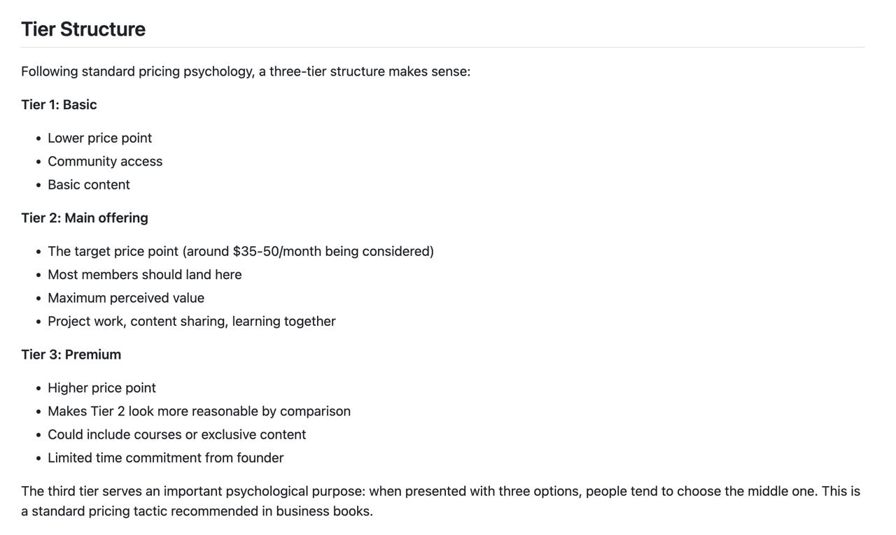
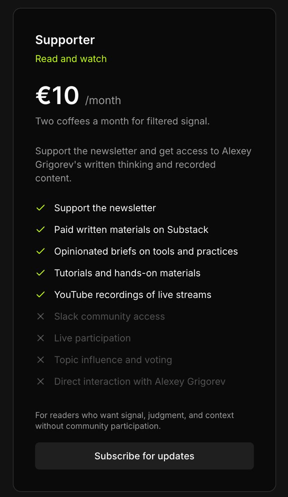
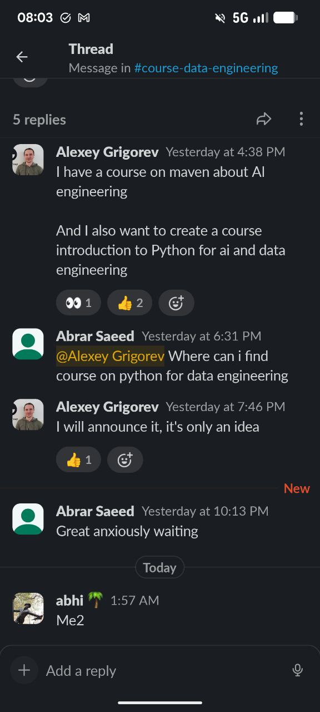
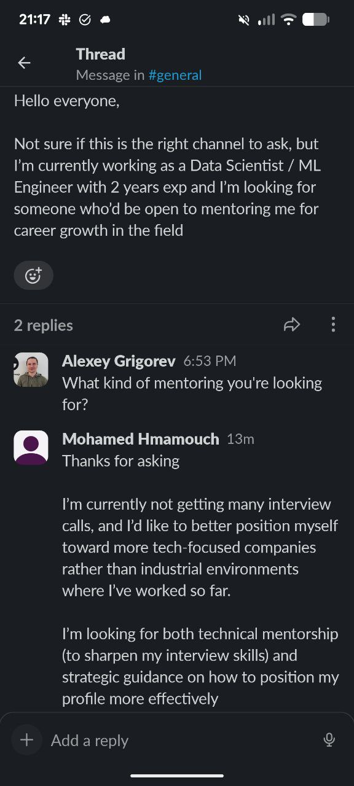

# Paid AI Engineers Community Planning

Planning a paid community for AI Engineers, including target audience, tier structure, pricing, and activities.

## The Goal

Create a paid community for AI Engineers that:
- Provides real value beyond free content
- Attracts active, motivated learners and builders
- Scales without requiring excessive personal time
- Has a clear identity separate from any individual

The challenge is designing something that feels like a true community, not just a following.

## Origin Story

The community idea evolved organically from several different threads:

### Initial desire for a personal newsletter

The idea started with wanting to create a separate newsletter from DataTalks Club - a place to share things learned and tried every day. The DataTalks Club newsletter is about communities, but there was a desire for a space to share learning in public and build in public, continuing what gets shared on social media[^34].

### Course on Maven

The AI Engineering course on Maven about agents became part of this vision. The people taking the course, those interested in subscription, and the desire to do something together all converged[^34].

### Monetization research

Valeria and I researched Substack monetization methods and found that some people create communities. The community idea was appealing - doing things together, helping people, sharing knowledge beyond what gets shared in DataTalks Club[^34].

### Desire for closer interaction

There is a desire for more intimate contact with people who are interested in these topics - live sessions where we solve things together, exchange experiences, learn from others who are also learning and want to share with everyone and get feedback[^34].

### New content formats

The vision includes launching new content and new courses - not all as large as AI Engineering Buildcamp, but smaller, more modest courses that could be offered more frequently within the community[^34].

So the idea evolved step by step: wanting a new newsletter, then a course, then everything connected organically into this community concept[^34].

## Why a New Community

Several reasons for creating something separate rather than building within DataTalks Club:

### Desire for a personal brand

Wanted something personal - a separate newsletter for sharing things learned daily. DataTalks Club's newsletter serves a different purpose[^67].

### Paid course on Maven

The AI Engineering course on Maven is paid, while everything in DataTalks Club is free. The new community is also paid[^33].

### Desire to earn from the work

As an entrepreneur with no employer, I want to earn money from what I create. I have already given much to DataTalks Club for free, but now want to also get paid for the work done[^33].

### DataTalks Club mission remains unchanged

The principle of DataTalks Club - free education for everyone regardless of income or location - stays the same. The club will not become closed. I plan to continue developing DataTalks Club through 2025 and 2026[^33].

### LLM Zoomcamp example

LLM Zoomcamp launching in summer directly competes with the paid Maven course. This does not mean neglecting LLM Zoomcamp - quite the opposite. New material gets added there, including content not in the Maven course (like rag evaluation which is covered in more detail in Zoomcamp than in Buildcamp)[^33].

### Desire for closer community interaction

Want to try something new with closer member interaction. A more tight-knit community feel where we do things together, not necessarily related to data, but focused on AI and AI tools for development[^33].

### New courses don't fit Zoomcamp calendar

The Zoomcamp calendar runs for a full year with ML Zoomcamp, Data Engineering Zoomcamp, AI DevTools Zoomcamp, and LLM Zoomcamp. There is no room to add additional courses in parallel[^33].

### Focus: AI Shipping Labs

The new project (aishippinglabs.com) makes more sense as a separate entity focused on AI DevTools[^33].

## Community Focus and Positioning

### The DataTalks Club model

DataTalks Club has no specific focus, which is why everyone joins. Whether this approach is good or bad is unclear. There is a desire for something narrower this time[^55].

### Desired focus

Focus on AI engineering and AI tools. While this would also be interesting for MLOps and data engineers, the preference is for a more niche area rather than broad appeal[^56].

In discussion with Valeria, the community should be more focused. The two main areas:

### AI Engineering

Everything related to building AI products[^36].

### AI Assistants for Development

Tools and workflows that make developers more productive[^36].

This is what is most interesting right now, and there is a desire for a more niche community compared to DataTalks Club's "all things data" approach. While the broad topics in DataTalks Club are interesting, the goal is more focus here - not spread across data science, ML lapses, data engineering, and everything else depending on time of year[^36].

### AI is currently the draw

AI is interesting to many people right now, which can be leveraged to attract members. Positioning can always be changed later if needed. The MLOps community example is instructive: they started as MLOps but now focus almost exclusively on AI[^58].

### Long-term trend

AI will reach all engineers eventually, including those working with data. It is inevitable[^59].

### Domain and brand

The domain aishippinglabs.com has been registered[^35].

<figure>
  
  <figcaption>Domain registration confirmation for aishippinglabs.com</figcaption>
  <!-- This shows the domain name for the new community -->
</figure>

## Target Audience

The ideal community member is:

### Enthusiastic and action-oriented

- They enjoy learning new things
- They have time and enthusiasm to build
- They are active people who want to apply their efforts to building something
- They love learning by doing, not just watching lectures

### Needs structure and direction

- They have the desire to build but lack:
  - Clear ideas
  - Understanding of next steps
  - Project structure
  - Focus to avoid distractions
- They need frameworks that help them stay on track toward their goals

More specifically, this person:
- Has a desire to build but needs a push
- Already has ideas and desire, but lacks something to sit down and do it
- Is often busy with many interests but passionate about some project they work on in the background
- Has a main job but also a side project they cannot always find time for
- Is passionate about this project but needs a gentle push to start making progress

These are people who already have the drive and the project ideas, but need external structure and accountability to take action[^66].

### Target audience for this focused community

People interested in AI engineering and AI tools who want to be more productive in what they do. The end goal is creating AI products using AI. This includes:
- People who can currently work as ML engineers
- Data engineers
- Beginners just starting to learn Python with the goal of becoming data and AI engineers

The aim is to attract everyone interested in these topics to one place, rather than having the spread-out focus like in DataTalks Club. This is a new attempt at something maximally focused[^36].

### Examples from existing community

- Fred - created the FAQ assistant
- A student from the Hackathon who contributed to "Professor"
- Eteri Valti - completed ML Bootcamp, AI DevTools, AI Hero course; actively asks how to help with community; recently found a job
- Rakis (from Greece) - built multiple projects for DataTalks Club: a Streamlit app showcasing all Zoomcamp projects, a project evaluator agent
- A student from a recent workshop who was one of the first in Data Engineering; after finding a job, donated part of her learning budget back

These are the kinds of active contributors the community should attract more of.

## Problems to Solve

The key question is: what problems do these people have that they would pay to solve?

Potential pain points:
- Want to transition to AI Engineering
- Already work as Data Scientists/ML Engineers but want to do more interesting work
- Want career advancement guidance
- Need structure and accountability for their learning
- Want to work on projects but don't know what to build

Research is needed to validate which problems are most pressing and what solutions people would pay for.

## Community Identity

Current naming challenge: existing names like "AI Builders" and "AI Engineering" are already taken. The ideal name should:
- Be connected to building (hands-on creation)
- Relate to AI
- Connect with existing brand (newsletter, course, AI Engineering Buildcamp)
- Be distinctive

## Tier Structure Overview

Following standard pricing psychology, a three-tier structure makes sense. The pricing tiers are set at $20, $50, and $100 per month[^50].

### Tier 1: Basic ($20/month)

- Content access only
- No community access
- Summaries and written materials

### Tier 2: Main Offering ($50/month)

- Most members should land here
- Maximum perceived value
- Community access, project work, content sharing, learning together

### Tier 3: Premium ($100/month)

- Makes Tier 2 look more reasonable by comparison
- Courses, exclusive content, guaranteed benefits
- Limited time commitment from founder

The third tier serves an important psychological purpose: when presented with three options, people tend to choose the middle one. This is a standard pricing tactic recommended in business books.

<figure>
  
  <figcaption>Three-tier pricing structure following standard pricing psychology principles</figcaption>
  <!-- This illustrates how tiers are positioned to make the middle option most attractive -->
</figure>

Each tier should motivate users to upgrade:

- Tier 1: Sees materials created, gets preview of what community produces
- Tier 2: Joins community, accesses people and activities, participates live
- Tier 3: Gets exclusive access and guaranteed benefits (like guaranteed resume review)

For example, tier 2 members see other people's resumes being reviewed publicly in the community. This creates motivation to upgrade to tier 3 to get their own resume reviewed. The pattern is: each tier shows value of the next tier above it[^53].

## Tier 1: Content Access

Tier 1 is a content-only tier at $20 per month with no community access. People at tier 1 get content but not access to the community[^49].

This makes sense because community requires significant work to maintain and should be a core value proposition that people pay for. If someone paying $20 got the same community access as someone paying $50, it would feel unfair[^48].

### Content included

Tier 1 members receive access to results and summaries of projects and materials created, but not to people or activities:

- Weekly or monthly summaries of all social media posts[^46]
- AI-generated summaries from workshops and exclusive events
- Articles derived from workshop content
- Workflow documentation based on projects
- Research and article summaries - currently, the audience only sees finished content, not the research that leads to it. When preparing materials for courses, many articles are read and summarized. These summaries can be shared with tier 1 members[^47]

This content is published in the paid newsletter, giving tier 1 members visibility into what is being created. They see results and get a preview of what they could access by joining the community[^51].

The goal is that tier 1 members see the value and get motivated to upgrade to tier 2 for community access and live activities[^51].

### Design inspiration

One model considered is Alexey Grigorev's Substack "Supporter" tier at 10 euros per month. This provides access to written materials and recorded content but no community access or live participation[^1].

<figure>
  
  <figcaption>Example of a content-only tier: Alexey Grigorev's Supporter tier provides materials without community access</figcaption>
  <!-- This shows an alternative approach where the first tier focuses on content rather than community -->
</figure>

## Tier 2: Community and Activities

This is the main value proposition at $50 per month. Members get full community access plus structured activities.

### Community activities

- Project implementation sessions
- Paper implementation projects
- Hackathon-style community projects
- Resume review sessions (visible to all as community learning)
- Career advancement discussions
- Workplace effectiveness and productivity
- Group course study - when a new course comes out (e.g. from Andrej Karpathy), we go through it together as a group, creating structure for people to learn together[^72]
- Seminars - like university seminars where each person gets assigned a topic (an article, a technology, a new tool) to research, and then presents their findings on a call. Everyone learns from each other's research[^72]
- Book Reading Club - reading and discussing books together[^72]

These are three ideas that came up at once. Which tier they belong to still needs to be figured out. We can ask people what interests them and what resonates, and then build from there[^72].

These activities also help cut through the noise. There is a lot of noise on social media right now. People open social media and see others talking about many things, which creates FOMO. The community can help people focus on what is actually important instead of chasing everything[^72].

Course requests and influence: since the current course catalog is limited, community members can request and influence which courses get developed. The courses offered can be shaped based on what people in the community want to learn[^33].

Key principle: the value should come from the community, not just from the founder. Activities should work even without direct involvement. The community should feel valuable even without direct founder involvement. This means designing activities that run themselves or are led by community members[^52].

### Private community benefits

One advantage of a private community is the ability to share insights and discuss topics that would not be appropriate in public channels.

Members can share insights from interviews and discuss interview preparation questions that they might not want to discuss publicly. For example, someone might say they are interviewing somewhere and share what questions are being asked, asking for help preparing. In a public community like DataTalks Club, their current employer might see this[^5].

Some members might want to go to interviews not because they are actively looking for a job, but to understand what the market is asking for and what skills are in demand. They might not want to discuss this publicly because:
- Their current employer might see it and think they are leaving
- Some people might consider it unethical to interview without serious intent to change jobs
- Public visibility could create awkward professional situations

In a private community, these kinds of discussions can happen more freely. The private community enables sharing of insights and experiences from interviews, salary negotiations, and other career-related topics that people prefer not to discuss in public forums where their current employer or colleagues might see them[^5].

### Research and content reviews

Based on research of other communities like "AI Native Engineer", potential activities include:

<figure>
  
  <figcaption>Example from AI Native Engineer showing the key elements that communities can provide beyond courses</figcaption>
  <!-- This illustrates direct mentorship, updated content, networking, and collaborative problem-solving -->
</figure>

- Weekly or bi-weekly reviews of new research papers
- Hot articles and tools worth exploring
- Members can be assigned to research specific topics and share findings
- This creates engagement and distributes content creation workload

### Mentorship and guidance

- Direct mentorship for implementation challenges
- Updated content based on evolving techniques
- Networking with practitioners at various career stages
- Collaborative problem-solving for complex issues

The environment should reproduce the conditions that accelerate career growth, similar to how the founder went from self-taught to big tech senior engineer.

### Learning in public and personal branding

A key benefit for the paid community: helping members with career advancement through learning in public and personal branding. This would include guidance on:

- How to properly do learning in public
- How to create content effectively
- How to promote on X (Twitter) and LinkedIn
- How to generate ideas for content
- How to maintain consistency in posting

Personal branding was instrumental in career advancement - the founder was hired for a previous job because they were already known and wanted by the employer[^31]. This is particularly valuable for students who want career advancement or are looking for new jobs.

The idea is to create resources about promotion on X, LinkedIn, and creating personal websites. This could include round table sessions for personal brand reviews, where community members can give each other feedback and help each other with social media algorithms[^28].

The community aspect is important here - when more people are involved in a founders-type community, there is less pressure for content to come only from one person. Community members also participate and create things, making it feel more like a collective effort rather than a one-person show[^27].

Examples of content that could be shared include behind-the-scenes work for community projects, such as building visualization tools or websites. The community manager role encompasses moderating, creating content, formatting, and promoting both content and the community itself[^30].

### Conference speaking support

Another potential community benefit: maintain a regularly updated list of conferences and help community members participate as speakers by connecting them with organizers. This provides tangible career value and public speaking experience[^29].

### Resume review sessions

When doing resume review sessions that are visible to the community as learning, there is a question of how to select participants:

- Random selection from those interested
- Premium tier members guaranteed to get reviewed
- Waitlist system where premium members get priority

One challenge: people usually need resume reviews immediately when job searching, not on a monthly schedule. A possible approach is when you join the premium tier, you get added to a waitlist, and we do a certain number per month[^53].

## Tier 3: Premium Access

The challenge with the third tier at $100/month is creating value that doesn't require excessive time commitment and keeps members engaged beyond course periods.

### Courses

- Exclusive mini-courses on specialized topics
- Examples: Claude Code course, testing course, AI agents workshop material
- Content is already being created - just packaged for members
- Andreas Kretz model: subscription gives access to all courses, new courses added regularly to reduce churn

A concern: if people only join because of courses, they will leave when courses end. We cannot produce courses indefinitely - perhaps 2-3 per year maximum. Something ongoing that is not courses is needed to keep them engaged[^37].

### One-on-one sessions

For tier 3, can offer "occasional 1:1 on request" - willing to do this but not regularly. Initially, want to communicate with buyers to understand what brought them and what they need. This research helps determine what content to create.

Not promoting this as the main benefit, but can mention that if valuable for some people, it is available. When writing about it, need to position it carefully - not as "with me" specifically but with "someone from the team" or similar. People who know will understand, others will see it as a valuable community feature[^65].

### Design principle

Tier 3 should be designed so the founder's involvement feels like a bonus, not the main value. The tier needs something ongoing beyond courses, such as guaranteed benefits (priority resume reviews, priority access to new content) that justify the premium.

## Reducing Founder Dependency

A key concern: the community should feel like a community, not "pay to talk to the founder."

Ways to address this:
- Design activities that members run themselves
- Have someone else (e.g., a community manager) lead regular check-ins
- Create peer-to-peer activities
- Make the founder's presence a bonus, not the main attraction
- Ensure value for people who discover the community through search (who don't know the founder)

This is important both for sustainability and for how the community appears to outsiders.

## Learning from Andreas Kretz

Andreas Kretz (LinkedIn influencer with a Data Engineering school) used this approach:
1. Started with 1:1 mentoring
2. While mentoring, observed common problems across students
3. Created courses to solve these common problems
4. Scaled from 5 students to hundreds
5. Subscription model provides access to all courses
6. Continuously creates new courses to reduce churn

Key insight: start with direct interaction to understand problems, then productize the solutions.

## Course Planning

### Python for AI and Data Engineering

The Python course idea is to take all existing Zoomcamps and the Buildcamp, analyze what Python is needed there, and create a course based on that. Target audience: both AI and data engineers[^60].

### AI Data Engineering course

Want to create a course on data engineering for AI - how all these AI tools can be used to build pipelines. This area is underserved - little content exists on how data actually gets into agents in reality. Everyone talks about having a clean dataset and building an agent, but not how the data gets there. Several modules on the new Maven course should be dedicated to this topic[^61].

### Market demand

There seems to be less demand and less content about data engineering for AI compared to generic AI engineering. This might actually be an advantage - an underserved niche where we can create something and see how it works. The community should cover these topics to attract people interested in both areas[^62].

### Student interest

Students are already asking about paid courses. This is a positive signal for the Python course idea[^63].

<figure>
  
  <figcaption>Students already inquiring about upcoming AI engineering and Python courses in the community</figcaption>
  <!-- This shows existing demand for courses being planned -->
</figure>

### Maven course continuation

Want to continue the AI Engineering course on Maven with focus on creating AI products. This attracts AI engineers who will be interested and potentially buy the course[^57].

### CloudCode and AI Assistant Development

Want to create a course about CloudCode and AI Assistant Development as a supplement to the existing AI DevTools content. This would focus on:
- How to configure and customize these tools
- Specific tricks and workflows discovered from using these tools for two years
- Less structured but very practical content
- Sharing experience and knowledge with community members[^64]

### Testing workshop

There is not much content available on testing, so want to create a mini-course on testing with focus on Python. Topics would include:
- Simple unit tests
- Integration tests
- How to test agents (though this might already be covered in AI Buildcamp)
- A course spanning several weeks[^64]

### DevOps and infrastructure

Topics where there is not much content available:
- Environment setup and management
- DevOps practices
- Terraform
- GitHub actions[^64]

### Course format strategy

The plan is to have at least one big course on Maven (if time permits), while the rest would be mini-courses available in the community at tier 3. Will actively ask people what they're interested in and monitor what content they engage with most[^64].

## Marketing

A key challenge is marketing and finding people who can pay for the community. DataTalks Club may not be the ideal place to find paying members because:
- The courses are free
- Many members are from countries with lower purchasing power (India, Nigeria, etc.)
- They may not have the ability to pay for a paid community

Alternative channels to explore:
- Social media platforms where the target audience spends time
- Other communities where AI engineers gather
- AI optimization and SEO strategies
- CEO-level networking and partnerships

The goal is to find people who have both the interest and the financial capacity to pay for a premium community.

People who ask for mentoring in the existing community are a potential audience for the paid community. For example, a Data Scientist / ML Engineer with 2 years of experience posted in the community asking for career mentoring - both technical (interview skills) and strategic (profile positioning). These are exactly the people who could benefit from the paid community and might be interested in joining[^54].

<figure>
  
  <figcaption>Community member asking for mentoring - a potential audience for the paid community</figcaption>
  <!-- This shows the type of person who could be converted from free community mentoring requests into paid community members -->
</figure>

## Proposed Approach

### Phase 1: Start with students

- Begin with AI Buildcamp students (they get free access as course alumni)
- Conduct interviews to understand their needs
- Offer some 1:1 sessions initially to learn what problems they have
- Use these sessions for research, not as long-term commitment

### Phase 2: Interview approach

- Ask people joining: what brought you here, what do you want, what problems do you want to solve?
- This is how DataTalks Club started - personal messages to every new member
- Use the feedback to shape content and offerings

### Phase 3: Iterate based on reality

- The theoretical ideal audience may not match who actually joins
- Plans should evolve based on real members
- Don't over-plan before seeing who is interested

## Accountability Circles and Mentoring

### The mentoring demand

People often ask me if I can mentor them. I usually say no, but suggest they use the community as a mentor - ask questions in the right channels at DataTalks Club and we can help with plans and implementation. Usually people do not do this. They want something more personal - someone to guide them by hand and watch what they are doing[^68].

### Accountability circles idea

I thought about how to address this within the new paid community. The idea came while riding a tram: create accountability groups or accountability circles. These are groups where people have their own tasks and plans - everyone has different goals - but they meet together regularly[^68].

This is similar to mastermind groups where people are roughly at the same level but have slightly different problems. Together they are better than each person individually - they complement each other and the collective level ends up one or two notches higher than any individual[^68].

These groups can be organized by focus area:
- Career-focused groups (meeting once a month)
- Project-focused groups (meeting once a week)

What happens in these groups: people share progress, talk about blockers, and get help from each other. It works like a regular standup at a company - you say what you did, what your plans are, and what blockers you have. Team members help resolve blockers and suggest solutions[^68].

### Why this works

The same mechanism that makes mentoring effective applies here. A person knows a session is coming in two days, realizes they have done nothing, and sits down to make progress. With group calls, the same effect kicks in - they know the meeting is coming, so they sit down and do the work to have something to show, a demo or progress to discuss[^68].

Scrum masters are usually not technical people. The real help comes from everyone in the team - "you could do this, you could try that." This is essentially group mentoring. The right term is mastermind groups - people at roughly the same level but with slightly different problems who complement each other[^68].

### Redirecting mentoring requests

I want to send all people who ask me for mentoring to this community. I will say: "Look, here is what we do. We create these groups. I will not mentor you personally, but I will give you a structure to follow." We can discuss their plan together. This does not have to be synchronous - we do not have to schedule calls[^69].

A framework can be designed where people describe their problem and I provide a solution. They could record a voice message or video describing their problem. I run it through an LLM, and based on ready-made plans, select the most suitable one and send it to them. Their task is to follow that plan[^69].

This starts as one-on-one but can be automated over time. Initially it takes a lot of my involvement, but as more ready-made plans accumulate, the task becomes just selecting a similar plan and adjusting it for the person[^69].

### Validating the idea

I will write to everyone who has recently asked me for mentoring and ask how interested they would be in this. A woman recently reached out wanting help with AI skills - she seems like an ideal candidate for this. Once we formulate this better and launch the community, I will reach out, offer a call, and tell her about this idea[^70].

My hypothesis is that people who ask for mentoring actually need an accountability partner or accountability structure - someone to report progress to. This is a hypothesis that can be tested[^68].

### Sprint-based format

Instead of running these groups continuously (like "every Tuesday"), a more organized approach would be to run them in sprints or cohorts[^71].

Benefits of sprints:
- Promotion opportunity - "our 10th sprint is starting, here are results from sprint 9" to attract new members
- Easier to plan vacations and breaks
- Clear understanding of participation numbers - if 10 people sign up, expect 7 to start and 3 to finish
- Ongoing social media promotion - "new cohort starting" creates regular marketing moments[^71]

Continuous activities lose interest over time, like "Book of the Week" or "Project of the Week" where interest fades. Running in sprints with periodic pauses helps avoid this. Sprints can have different focus areas. Taking breaks to rethink and adjust is valuable[^71].

## Next Steps

1. Start with AI Buildcamp students (free access for course alumni)
2. Conduct interviews to understand what they want
3. Use these conversations to identify common problems
4. Design tier 2 to provide maximum value for these problems
5. Design tier 3 primarily to make tier 2 look attractive
6. Iterate based on who actually joins

The key is to learn from real members rather than assuming what they want.

## Sources

[^1]: [20260210_214500_AlexeyDTC_msg1295_transcript.txt](../inbox/used/20260210_214500_AlexeyDTC_msg1295_transcript.txt)
[^2]: [20260210_214612_AlexeyDTC_msg1297_transcript.txt](../inbox/used/20260210_214612_AlexeyDTC_msg1297_transcript.txt)
[^3]: [20260210_214758_AlexeyDTC_msg1299_transcript.txt](../inbox/used/20260210_214758_AlexeyDTC_msg1299_transcript.txt)
[^4]: [20260210_214833_AlexeyDTC_msg1301_transcript.txt](../inbox/used/20260210_214833_AlexeyDTC_msg1301_transcript.txt)
[^5]: [20260210_215004_AlexeyDTC_msg1303_transcript.txt](../inbox/used/20260210_215004_AlexeyDTC_msg1303_transcript.txt)
[^6]: [20260210_215100_AlexeyDTC_msg1305_transcript.txt](../inbox/used/20260210_215100_AlexeyDTC_msg1305_transcript.txt)
[^7]: [20260210_215330_AlexeyDTC_msg1307_transcript.txt](../inbox/used/20260210_215330_AlexeyDTC_msg1307_transcript.txt)
[^8]: [20260210_215621_AlexeyDTC_msg1309_transcript.txt](../inbox/used/20260210_215621_AlexeyDTC_msg1309_transcript.txt)
[^9]: [20260210_215700_AlexeyDTC_msg1311_transcript.txt](../inbox/used/20260210_215700_AlexeyDTC_msg1311_transcript.txt)
[^10]: [20260210_215719_AlexeyDTC_msg1313_transcript.txt](../inbox/used/20260210_215719_AlexeyDTC_msg1313_transcript.txt)
[^11]: [20260210_215846_AlexeyDTC_msg1315_transcript.txt](../inbox/used/20260210_215846_AlexeyDTC_msg1315_transcript.txt)
[^12]: [20260210_220122_AlexeyDTC_msg1317_transcript.txt](../inbox/used/20260210_220122_AlexeyDTC_msg1317_transcript.txt)
[^13]: [20260210_220126_AlexeyDTC_msg1318_transcript.txt](../inbox/used/20260210_220126_AlexeyDTC_msg1318_transcript.txt)
[^14]: [20260210_220136_AlexeyDTC_msg1321.md](../inbox/used/20260210_220136_AlexeyDTC_msg1321.md)
[^15]: [20260210_220150_AlexeyDTC_msg1323_transcript.txt](../inbox/used/20260210_220150_AlexeyDTC_msg1323_transcript.txt)
[^16]: [20260210_220150_AlexeyDTC_msg1324_transcript.txt](../inbox/used/20260210_220150_AlexeyDTC_msg1324_transcript.txt)
[^17]: [20260210_220150_AlexeyDTC_msg1325_transcript.txt](../inbox/used/20260210_220150_AlexeyDTC_msg1325_transcript.txt)
[^18]: [20260210_220150_AlexeyDTC_msg1326_transcript.txt](../inbox/used/20260210_220150_AlexeyDTC_msg1326_transcript.txt)
[^19]: [20260210_220325_AlexeyDTC_msg1331_transcript.txt](../inbox/used/20260210_220325_AlexeyDTC_msg1331_transcript.txt)
[^20]: [20260210_220440_AlexeyDTC_msg1333_transcript.txt](../inbox/used/20260210_220440_AlexeyDTC_msg1333_transcript.txt)
[^21]: [20260210_220614_AlexeyDTC_msg1335_transcript.txt](../inbox/used/20260210_220614_AlexeyDTC_msg1335_transcript.txt)
[^22]: [20260210_220723_AlexeyDTC_msg1337_transcript.txt](../inbox/used/20260210_220723_AlexeyDTC_msg1337_transcript.txt)
[^23]: [20260210_220854_AlexeyDTC_msg1339_transcript.txt](../inbox/used/20260210_220854_AlexeyDTC_msg1339_transcript.txt)
[^24]: [20260210_221143_AlexeyDTC_msg1344_transcript.txt](../inbox/used/20260210_221143_AlexeyDTC_msg1344_transcript.txt)
[^25]: [20260211_045229_AlexeyDTC_msg1368.md](../inbox/used/20260211_045229_AlexeyDTC_msg1368.md)
[^26]: [20260211_075557_AlexeyDTC_msg1374_photo.md](../inbox/used/20260211_075557_AlexeyDTC_msg1374_photo.md)
[^27]: [20260211_102558_AlexeyDTC_msg1417.md](../inbox/used/20260211_102558_AlexeyDTC_msg1417.md)
[^28]: [20260211_102558_AlexeyDTC_msg1418.md](../inbox/used/20260211_102558_AlexeyDTC_msg1418.md)
[^29]: [20260211_125822_valeriia_kuka_msg1429.md](../inbox/used/20260211_125822_valeriia_kuka_msg1429.md)
[^30]: [20260211_102558_AlexeyDTC_msg1419.md](../inbox/used/20260211_102558_AlexeyDTC_msg1419.md)
[^31]: [20260211_102558_AlexeyDTC_msg1420.md](../inbox/used/20260211_102558_AlexeyDTC_msg1420.md)
[^32]: [20260211_102633_AlexeyDTC_msg1421_transcript.txt](../inbox/used/20260211_102633_AlexeyDTC_msg1421_transcript.txt)
[^33]: [20260211_154156_AlexeyDTC_msg1453_transcript.txt](../inbox/used/20260211_154156_AlexeyDTC_msg1453_transcript.txt)
[^34]: [20260212_092525_AlexeyDTC_msg1483_transcript.txt](../inbox/used/20260212_092525_AlexeyDTC_msg1483_transcript.txt)
[^35]: [20260212_072521_AlexeyDTC_msg1478_photo.md](../inbox/used/20260212_072521_AlexeyDTC_msg1478_photo.md)
[^36]: [20260212_095704_AlexeyDTC_msg1489_transcript.txt](../inbox/used/20260212_095704_AlexeyDTC_msg1489_transcript.txt)
[^37]: [20260212_073720_AlexeyDTC_msg1479_transcript.txt](../inbox/used/20260212_073720_AlexeyDTC_msg1479_transcript.txt)
[^38]: [20260212_105847_AlexeyDTC_msg1519_transcript.txt](../inbox/used/20260212_105847_AlexeyDTC_msg1519_transcript.txt)
[^39]: [20260212_115141_AlexeyDTC_msg1527_photo.md](../inbox/used/20260212_115141_AlexeyDTC_msg1527_photo.md)
[^40]: [20260212_115141_AlexeyDTC_msg1528_photo.md](../inbox/used/20260212_115141_AlexeyDTC_msg1528_photo.md)
[^41]: [20260212_115141_AlexeyDTC_msg1529_transcript.txt](../inbox/used/20260212_115141_AlexeyDTC_msg1529_transcript.txt)
[^42]: [20260212_115141_AlexeyDTC_msg1530_transcript.txt](../inbox/used/20260212_115141_AlexeyDTC_msg1530_transcript.txt)
[^43]: [20260212_115141_AlexeyDTC_msg1531_transcript.txt](../inbox/used/20260212_115141_AlexeyDTC_msg1531_transcript.txt)
[^44]: [20260212_115141_AlexeyDTC_msg1532_transcript.txt](../inbox/used/20260212_115141_AlexeyDTC_msg1532_transcript.txt)
[^45]: [20260212_115203_AlexeyDTC_msg1539_transcript.txt](../inbox/used/20260212_115203_AlexeyDTC_msg1539_transcript.txt)
[^46]: [20260212_115823_AlexeyDTC_msg1545_transcript.txt](../inbox/used/20260212_115823_AlexeyDTC_msg1545_transcript.txt)
[^47]: [20260212_115823_AlexeyDTC_msg1546.md](../inbox/used/20260212_115823_AlexeyDTC_msg1546.md)
[^48]: [20260212_120008_AlexeyDTC_msg1549_transcript.txt](../inbox/used/20260212_120008_AlexeyDTC_msg1549_transcript.txt)
[^49]: [20260212_120008_AlexeyDTC_msg1550.md](../inbox/used/20260212_120008_AlexeyDTC_msg1550.md)
[^50]: [20260212_120008_AlexeyDTC_msg1551.md](../inbox/used/20260212_120008_AlexeyDTC_msg1551.md)
[^51]: [20260212_120318_AlexeyDTC_msg1555_transcript.txt](../inbox/used/20260212_120318_AlexeyDTC_msg1555_transcript.txt)
[^52]: [20260212_120318_AlexeyDTC_msg1556.md](../inbox/used/20260212_120318_AlexeyDTC_msg1556.md)
[^53]: [20260212_122718_AlexeyDTC_msg1559_transcript.txt](../inbox/used/20260212_122718_AlexeyDTC_msg1559_transcript.txt)
[^54]: [20260212_201835_AlexeyDTC_msg1567_photo.md](../inbox/used/20260212_201835_AlexeyDTC_msg1567_photo.md)
[^55]: [20260212_070950_AlexeyDTC_msg1464_transcript.txt](../inbox/used/20260212_070950_AlexeyDTC_msg1464_transcript.txt)
[^56]: [20260212_070950_AlexeyDTC_msg1466_transcript.txt](../inbox/used/20260212_070950_AlexeyDTC_msg1466_transcript.txt)
[^57]: [20260212_071140_AlexeyDTC_msg1471_transcript.txt](../inbox/used/20260212_071140_AlexeyDTC_msg1471_transcript.txt)
[^58]: [20260212_071140_AlexeyDTC_msg1472_transcript.txt](../inbox/used/20260212_071140_AlexeyDTC_msg1472_transcript.txt)
[^59]: [20260212_071140_AlexeyDTC_msg1473.md](../inbox/used/20260212_071140_AlexeyDTC_msg1473.md)
[^60]: [20260212_071345_AlexeyDTC_msg1474_transcript.txt](../inbox/used/20260212_071345_AlexeyDTC_msg1474_transcript.txt)
[^61]: [20260212_071345_AlexeyDTC_msg1475_transcript.txt](../inbox/used/20260212_071345_AlexeyDTC_msg1475_transcript.txt)
[^62]: [20260212_071639_AlexeyDTC_msg1477_transcript.txt](../inbox/used/20260212_071639_AlexeyDTC_msg1477_transcript.txt)
[^63]: [20260212_070350_AlexeyDTC_msg1463_photo.md](../inbox/used/20260212_070350_AlexeyDTC_msg1463_photo.md)
[^64]: [20260212_095052_AlexeyDTC_msg1487_transcript.txt](../inbox/used/20260212_095052_AlexeyDTC_msg1487_transcript.txt)
[^65]: [20260211_045229_AlexeyDTC_msg1368.md](../inbox/used/20260211_045229_AlexeyDTC_msg1368.md)
[^66]: [20260212_091239_AlexeyDTC_msg1482_transcript.txt](../inbox/used/20260212_091239_AlexeyDTC_msg1482_transcript.txt)
[^67]: [20260212_070950_AlexeyDTC_msg1465.md](../inbox/used/20260212_070950_AlexeyDTC_msg1465.md)
[^68]: [20260213_152027_AlexeyDTC_msg1610_transcript.txt](../inbox/used/20260213_152027_AlexeyDTC_msg1610_transcript.txt)
[^69]: [20260213_152227_AlexeyDTC_msg1611_transcript.txt](../inbox/used/20260213_152227_AlexeyDTC_msg1611_transcript.txt)
[^70]: [20260213_152303_AlexeyDTC_msg1612_transcript.txt](../inbox/used/20260213_152303_AlexeyDTC_msg1612_transcript.txt)
[^71]: [20260213_153009_AlexeyDTC_msg1623_transcript.txt](../inbox/used/20260213_153009_AlexeyDTC_msg1623_transcript.txt)
[^72]: [20260214_092313_AlexeyDTC_msg1669_transcript.txt](../inbox/used/20260214_092313_AlexeyDTC_msg1669_transcript.txt)
