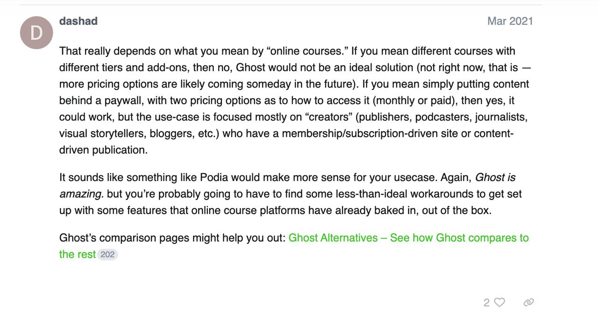
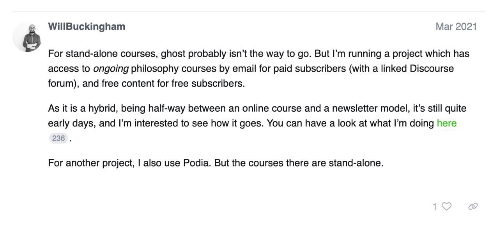

# Paid Community Platform Requirements

Technical requirements and platform evaluation for hosting the AI Shipping Labs paid community at aishippinglabs.com. This covers the current plans, what features are needed, and what platforms were considered.

## Current Plans

The community site is live at [aishippinglabs.com](https://aishippinglabs.com). It is currently invite-only and positions itself as a "technical community for action-oriented builders interested in AI engineering and AI tools." The tagline is "Turn AI ideas into real projects"[^9].

### Philosophy

"Learn by building, together" - designed for motivated learners who prefer learning by doing:

- Learning by doing: no passive consumption, every activity is designed around building, shipping, and getting feedback on real work
- Production-ready: focus on what actually works in production, move from prototypes to reliable systems with battle-tested patterns
- Build together: work alongside other practitioners through hackathons, projects, and group problem-solving instead of isolated learning
- Calibrate your judgment: develop better instincts through peer feedback, expert guidance, and exposure to real-world decision-making patterns

### Membership Tiers

#### Basic (200 EUR/year) - Content Only

Educational content without community access. For self-directed builders who learn at their own pace.

- Full access to exclusive Substack content
- Hands-on tutorials with code examples you can implement
- Curated breakdowns of new AI tools and workflows
- Behind-the-scenes access to ongoing research and experiments
- Curated collection of valuable social posts you might have missed

#### Main (500 EUR/year) - Live Learning + Community

Everything in Basic, plus the structure, accountability, and peer support to ship AI projects consistently. Marked as "Most Popular."

- Everything in Basic
- Closed community access to connect and interact with practitioners
- Collaborative problem-solving and mentorship for implementation challenges
- Interactive group coding sessions led by a host
- Guided project-based learning with curated resources
- Community hackathons
- Career advancement discussions and feedback
- Personal brand development guidance and content
- Developer productivity tips and workflows
- Propose and vote on future topics

#### Premium (1000 EUR/year) - Courses + Personalized Feedback

Everything in Main, plus structured learning paths through mini-courses and personalized career guidance.

- Everything in Main
- Access to all mini-courses on specialized topics
- Collection regularly updated with new courses
- Upcoming: Python for Data and AI Engineering
- Propose and vote on mini-course topics
- Resume, LinkedIn, and GitHub teardowns

## Platform Requirements

### Payments

- Accept payments for membership tiers via Stripe (or alternative)
- Support annual and potentially monthly billing
- Handle upgrades and downgrades between tiers
- Must handle VAT and act as merchant of record

### Access Control

- Flexible tier-based access control, should support arbitrary number of tiers (currently three: Basic, Main, Premium)[^4]
- Per-item gating on all content types - each piece of content can be:
  - Open to everyone (for SEO and lead generation)
  - Open to registered free users
  - Open to specific paid tiers

### Content Types

The platform needs to host:

- Articles and blog posts - per-article access control, not a blanket paywall. Nice to have: community members can contribute articles (with a moderation process before publishing)
- Courses (see dedicated section below)
- Event recordings - browsable library of past recordings, gated by tier. Each recording has video embed, timestamps, description, and materials/resources used[^4]
- Project ideas - community members share projects and portfolios with descriptions, difficulty levels, tags, and links to source code
- Curated links - browsable collection of GitHub repos, model hubs, tools, and learning resources displayed as a grid or list with external links[^5b]
- Downloadable resources and lead magnets - PDFs, templates, slides, code bundles gated behind email signup or paid membership. Reusable signup/download CTAs embeddable across multiple articles[^5b]

### Courses

- Catalog and course details visible to everyone (for SEO and discoverability)
- Signup requires appropriate plan - non-subscribers get a "Join" button that leads to signup
- Some courses can be free (lead magnet, e.g. AI Hero)
- Inside a course: modules and units, each with video, text content, and homework
- Courses are on-demand by default
- Possibility to run cohorts with clear start and end dates, for both free and paid courses (cohorts increase engagement)
- Course discussions: for paid courses - integrated with the community. For free courses outside the community - link to external platforms (GitHub, Slack, etc.)
- Nice to have: email-based drip courses (access opens gradually)
- Nice to have: some course parts shared openly as a preview[^4][^13]

### Events

- Can be live (Zoom sessions, workshops, hackathons) or async (community challenges, project sprints)
- Tier-differentiated: some for everyone (lead magnet), some for specific tiers
- For live events: Zoom (or alternative) meeting set up automatically on event creation
- After a live event: recording automatically uploaded and published with video embed, timestamps, description, and materials[^4]

### Event Calendar

- Activity calendar visible to everyone (upcoming and past events, event details)
- Calendar and event pages serve as discovery
- To sign up for an event, the user needs to be on the appropriate plan[^4]

### Video

- Video can be YouTube, Loom, or self-uploaded
- Embed with clickable timestamps and descriptions[^3b][^5]

### Community

- Main and Premium tiers include closed community access
- Either host discussions or integrate with an external community tool (currently Slack)
- Members need a way to interact, ask questions, and collaborate
- Member lifecycle automation:
  - On purchase: platform sends a community invite
  - On cancellation: profile deactivated when payment cycle ends
  - On re-subscribe: profile re-activated

### Voting and Polls

- Members can vote on future topics and mini-course topics
- Voting or polling mechanism for members to influence content direction

### Email

- Mailing list with tier-granular sending: can target all members, or specific tiers and above (e.g. sending to "Main" includes Main and Premium)
- When sending to the broadest tier, everyone including free subscribers receives it
- Every email must include an unsubscribe link
- Newsletter: visitors can subscribe without joining a paid tier, converting them into free subscribers who can later be upgraded
- Lead magnet flow: user enters email, becomes free member, gets access to downloads or content[^4][^5b][^13]

### Notifications

- Announcements in Slack
- Potentially a Telegram channel
- On-platform notifications (new content, events, course updates)[^4]

### Content Organization and SEO

- Tag-based content organization using internal tags (#resource, #workshop, #recording, #article)[^5b]
- Tag-based conditional components (e.g., "if article is tagged ai-engineer, show roadmap signup form")[^5b]
- Custom structured data (JSON-LD, schema markup, OpenGraph) for discoverability[^5b]

## Feature Comparison

Requirements checklist across platforms. Legend: + supported, - not supported, ? unclear or needs verification.

### Payments

| Requirement | Ghost | Ghost+LMS | Maven | Custom |
|---|---|---|---|---|
| Stripe payment integration | + | + | + (own) | + |
| Annual and monthly billing | + | + | ? | + |
| Tier upgrades and downgrades | + | + | - | + |
| VAT handling / merchant of record | + | + | ? | ? |

### Access Control

| Requirement | Ghost | Ghost+LMS | Maven | Custom |
|---|---|---|---|---|
| Flexible multi-tier membership (arbitrary tiers) | + | + | - | + |
| Per-item content gating by tier | + | + | ? | + |
| Mixed access (open / registered / paid per item) | + | + | - | + |

### Content Types

| Requirement | Ghost | Ghost+LMS | Maven | Custom |
|---|---|---|---|---|
| Articles and blog posts | + | + | - | + |
| Event recordings library | + | ? | + | + |
| Project showcase (member portfolios) | ? | ? | - | + |
| Curated resource directory (links, tools, repos) | ? | - | - | + |
| Downloadable resources and lead magnets | ? | ? | ? | + |
| Reusable signup/download CTAs across articles | ? | ? | - | + |

### Courses

| Requirement | Ghost | Ghost+LMS | Maven | Custom |
|---|---|---|---|---|
| Course catalog visible to everyone | ? | + | + | + |
| Gated signup (join button for non-subscribers) | + | + | ? | + |
| Modules and units structure | - | + | + | + |
| Video + text + homework per unit | - | - | + | + |
| Free courses (lead magnet) | ? | ? | + | + |
| On-demand courses | ? | ? | + | + |
| Cohorts with start/end dates (free and paid) | - | - | + | + |
| Course discussions integration | - | - | + | + |
| Email-based drip courses (nice to have) | ? | ? | - | + |
| Progress tracking / completion status | - | - | + | + |

### Events

| Requirement | Ghost | Ghost+LMS | Maven | Custom |
|---|---|---|---|---|
| Live and async events | - | - | + | + |
| Tier-differentiated events | - | - | + | + |
| Zoom (or alternative) integration | - | - | ? | + |
| Auto-upload and publish recording after event | - | - | + | + |

### Event Calendar

| Requirement | Ghost | Ghost+LMS | Maven | Custom |
|---|---|---|---|---|
| Activity calendar visible to everyone | ? | ? | - | + |
| Gated event signup | ? | ? | + | + |

### Video

| Requirement | Ghost | Ghost+LMS | Maven | Custom |
|---|---|---|---|---|
| Embed YouTube / Loom / self-uploaded | ? | - | + | + |
| Clickable timestamps and descriptions | ? | - | + | + |

### Community

| Requirement | Ghost | Ghost+LMS | Maven | Custom |
|---|---|---|---|---|
| Closed community access by tier | - | - | + | + |
| Integration with external community (Slack) | - | - | - | + |
| Member lifecycle (invite / deactivate / reactivate) | - | - | - | + |

### Voting and Polls

| Requirement | Ghost | Ghost+LMS | Maven | Custom |
|---|---|---|---|---|
| Topic voting for members | - | - | ? | + |
| Mini-course topic voting | - | - | ? | + |

### Email

| Requirement | Ghost | Ghost+LMS | Maven | Custom |
|---|---|---|---|---|
| Tier-granular mailing (send to tier and above) | + | + | ? | + |
| Unsubscribe link in every email | + | + | ? | + |
| Newsletter signup (free subscribers) | + | + | - | + |
| Lead magnet flow (email -> free member -> download) | + | + | - | + |

### Notifications

| Requirement | Ghost | Ghost+LMS | Maven | Custom |
|---|---|---|---|---|
| Slack announcements | - | - | - | + |
| Telegram channel | - | - | - | + |
| On-platform notifications | - | - | + | + |

### Content Organization and SEO

| Requirement | Ghost | Ghost+LMS | Maven | Custom |
|---|---|---|---|---|
| Tag-based content organization | + | + | - | + |
| Tag-based conditional components | ? | ? | - | + |
| Custom structured data (JSON-LD, OpenGraph) | + | + | - | + |

## Platform Evaluations

### Ghost

Ghost has login functionality and closed content sections accessible only to members on specific plans. The question is whether Ghost is sufficient out of the box or if custom development is needed[^3].

<figure>
  
  <figcaption>Ghost community discussion on using Ghost for course hosting - recommends Podia as alternative</figcaption>
  <!-- Screenshot from Ghost forum showing user feedback on Ghost's suitability for course hosting -->
</figure>

<figure>
  
  <figcaption>Another Ghost community member describing their hybrid model using Ghost for subscriptions and Podia for standalone courses</figcaption>
  <!-- Screenshot from Ghost forum showing a user who uses both Ghost and Podia for different purposes -->
</figure>

According to Ghost community feedback (from 2021, but the platform has not changed drastically)[^5]:

- For standalone courses with different prices per course - Ghost is not ideal
- For putting content behind a paywall with subscription pricing (monthly or paid) - Ghost works, but its focus is on "creators" (publishers, podcasters, journalists, bloggers) with membership/subscription-driven sites
- Podia was recommended as a better fit for standalone course hosting
- For a hybrid model (half-way between online course and newsletter) with paid subscribers and free content for free subscribers - Ghost can work

In our case, since the goal is to use a subscription model with mini-courses for community members (not standalone course purchases), Ghost could work. The main limitation is video hosting in our tier[^5].

Valeria's evaluation of Ghost[^5b]: Ghost acts as CMS, membership system, payment integration (via Stripe), email capture engine, newsletter sender, and content gating layer. Ghost themes (Handlebars templates) provide layout and SEO control, developed in an IDE like normal code. Slack remains the community platform. Local development is possible (ghost install local), similar to standard web development workflow.

Acknowledged limitations of Ghost:

- No true custom content types or database fields (simulated through tags and structured content blocks)
- Not a React app runtime (server-rendered Handlebars templates with optional JS)
- Not suitable for app-like dashboards, learning progress tracking, or heavy automation pipelines
- Roughly 80% flexibility compared to a fully custom system, but with much faster launch

### Ghost LMS Theme

There is a Ghost theme specifically designed for learning management: [Ghost Learning Management System theme](https://explore.ghost.org/p/ghost-learning-management-system). This could potentially be integrated as part of the site alongside other content[^7].

The theme is made by Themeix and turns a standard Ghost site into a course platform. It provides course catalog pages, course detail pages with structured lesson sidebars, and individual lesson pages with breadcrumb navigation. Courses are organized using Ghost's tag system, and access is gated through Ghost's native membership tiers.

What it does well:

- Course catalog with category browsing
- Structured lesson navigation within courses
- Membership gating using Ghost's built-in tiers
- Blog section alongside courses
- Responsive design, three homepage variants

What it lacks:

- No quizzes, assessments, or grading
- No progress tracking or completion status
- No certificates
- No video hosting (text-based lessons only, though videos can be embedded manually)
- No per-course pricing - access is all-or-nothing based on Ghost tier
- Course structure is manually maintained through Ghost tags
- Third-party theme, so long-term maintenance depends on developer

### Maven

Maven is convenient as a course platform with a lot of built-in functionality. The issue is student registration automation. There does not seem to be an API for adding students programmatically. Payment would go through our platform, then a webhook should fire, and we would add the student to the Maven course. There appears to be only a manual way to add students, not an API for it[^8].

Can check in the Maven community or search further, but it seems Maven is not the right fit. On the other hand, all the needed functionality could be coded with Claude Code in about 2 hours[^8].

### Building Custom

After listing all the requirements, the conclusion is that finding everything in one platform is unrealistic. Would need Luma, Maven, Ghost, and everything to work together. It might be simpler to build and host everything ourselves[^6].

Estimated hosting cost: about 50 EUR. The issue is with emails, but Amazon SES can handle that. An admin interface would be needed for managing these things. Building an admin interface, connecting email sending, setting up course hosting - with Claude Code and with Valeria's help, this is doable in about a week[^6].

This is not rocket science to implement. If dedicated time is allocated (one week), everything can be built. With Claude Code help, it is realistic[^6].

## Current State

Static site at aishippinglabs.com with Stripe payment links. No integrations - if a purchase happens on Stripe, there is no automated notification or onboarding. Members are manually added to Slack. Course participants from previous courses can be added to the community[^13].

## Next Steps

1. Document all the features needed (this article)
2. Evaluate what Ghost can and cannot do out of the box
3. Decide whether to use Ghost + custom code, or build everything from scratch
4. If custom: estimate the development effort for an MVP
5. Prioritize features - which are most important, which can wait
6. Start with lean setup (current site + Slack + manual onboarding) and gradually add features

Idea: document the entire decision-making process and platform selection journey as a blog post[^13].

## Sources

[^3]: [20260218_155901_AlexeyDTC_msg1951_transcript.txt](../inbox/used/20260218_155901_AlexeyDTC_msg1951_transcript.txt)
[^3b]: [20260218_155901_AlexeyDTC_msg1952_transcript.txt](../inbox/used/20260218_155901_AlexeyDTC_msg1952_transcript.txt)
[^3c]: [20260218_155901_AlexeyDTC_msg1953_transcript.txt](../inbox/used/20260218_155901_AlexeyDTC_msg1953_transcript.txt)
[^4]: [20260218_160548_AlexeyDTC_msg1963_transcript.txt](../inbox/used/20260218_160548_AlexeyDTC_msg1963_transcript.txt)
[^5]: [20260218_160224_valeriia_kuka_msg1961_transcript.txt](../inbox/used/20260218_160224_valeriia_kuka_msg1961_transcript.txt)
[^5b]: [20260218_160718_valeriia_kuka_msg1965.md](../inbox/used/20260218_160718_valeriia_kuka_msg1965.md)
[^6]: [20260218_161001_AlexeyDTC_msg1970_transcript.txt](../inbox/used/20260218_161001_AlexeyDTC_msg1970_transcript.txt)
[^7]: [20260218_161001_AlexeyDTC_msg1969.md](../inbox/used/20260218_161001_AlexeyDTC_msg1969.md)
[^8]: [20260218_160725_AlexeyDTC_msg1967_transcript.txt](../inbox/used/20260218_160725_AlexeyDTC_msg1967_transcript.txt)
[^9]: [20260218_161244_AlexeyDTC_msg1975.md](../inbox/used/20260218_161244_AlexeyDTC_msg1975.md), [aishippinglabs.com](https://aishippinglabs.com)
[^10]: [20260218_161109_AlexeyDTC_msg1973_transcript.txt](../inbox/used/20260218_161109_AlexeyDTC_msg1973_transcript.txt)
[^11]: [20260218_160017_valeriia_kuka_msg1957_photo.md](../inbox/used/20260218_160017_valeriia_kuka_msg1957_photo.md)
[^13]: [20260218_173034_AlexeyDTC_msg1984_transcript.txt](../inbox/used/20260218_173034_AlexeyDTC_msg1984_transcript.txt), [20260218_173034_AlexeyDTC_msg1985_transcript.txt](../inbox/used/20260218_173034_AlexeyDTC_msg1985_transcript.txt), [20260218_173034_AlexeyDTC_msg1986_transcript.txt](../inbox/used/20260218_173034_AlexeyDTC_msg1986_transcript.txt), [20260218_173034_AlexeyDTC_msg1987_transcript.txt](../inbox/used/20260218_173034_AlexeyDTC_msg1987_transcript.txt)
[^12]: [20260218_160017_valeriia_kuka_msg1958_photo.md](../inbox/used/20260218_160017_valeriia_kuka_msg1958_photo.md)
