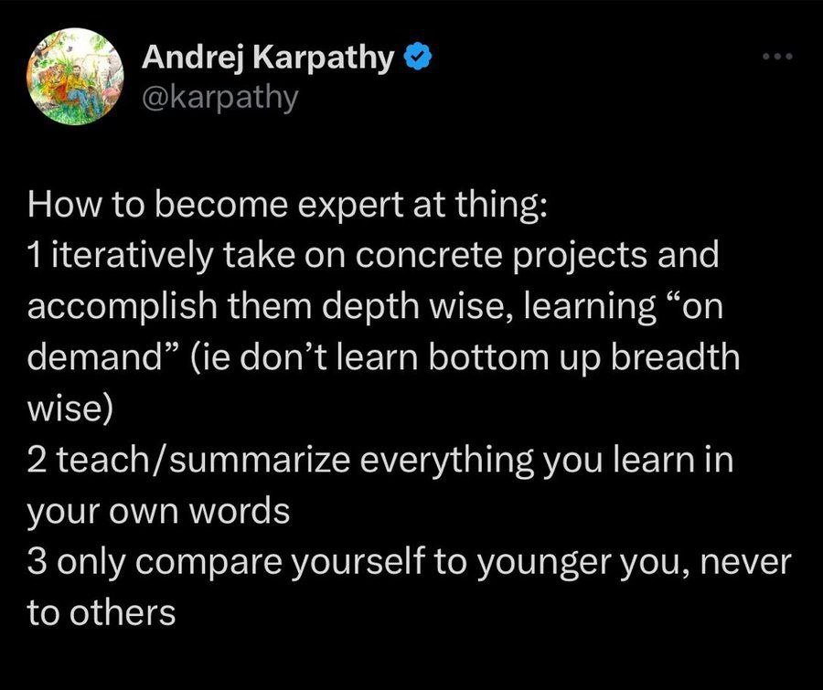

# Pet Projects

Andrej Karpathy shared advice on how to become an expert at something[^1]:

1. Iteratively take on concrete projects and accomplish them depth-wise, learning "on demand" (do not learn bottom-up breadth-wise)
2. Teach and summarize everything you learn in your own words
3. Only compare yourself to your younger self, never to others

<figure>
  
  <figcaption>Andrej Karpathy on becoming an expert - learn by doing projects, teach what you learn, compare only to yourself</figcaption>
  <!-- Karpathy's three rules: depth-first projects, teach/summarize in own words, self-comparison only -->
</figure>

## Sources

[^1]: [20260228_170401_AlexeyDTC_msg2610_photo.md](../inbox/used/20260228_170401_AlexeyDTC_msg2610_photo.md)
