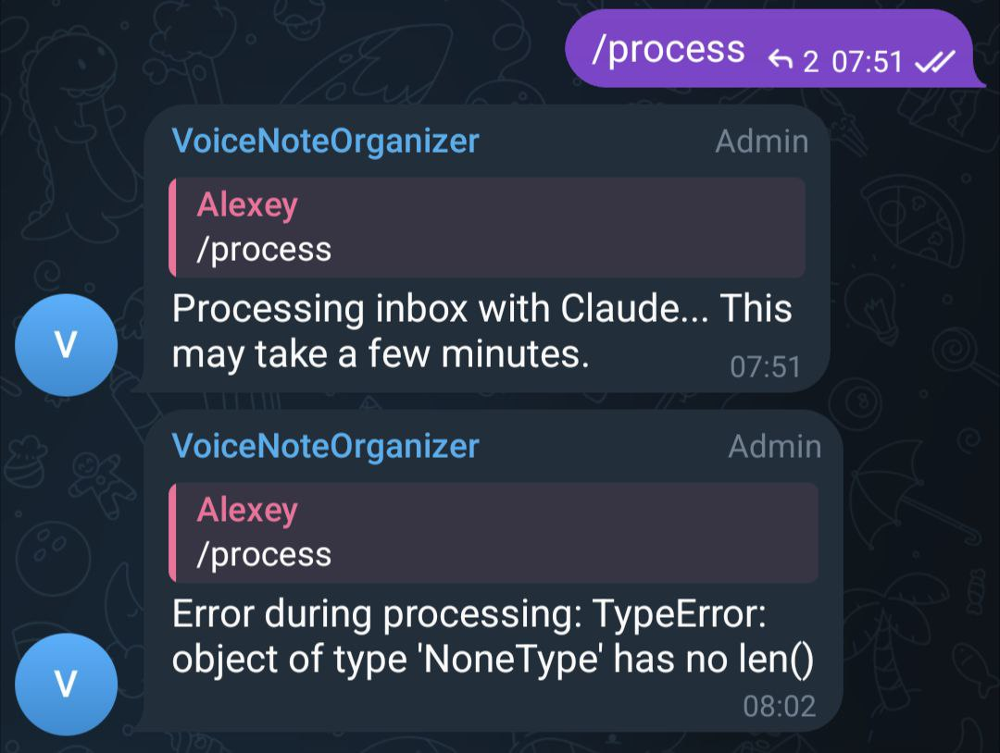

# Processing Pipeline

The automation workflow for organizing materials from Telegram into articles using the /process command.

## How It Works

I want to write this agent using voice messages. I give instructions via voice, then on the computer, on the laptop, I ask Claude to read these instructions and enter all these instructions into a slash command. Based on this slash command, the command will be called every time I do slash-process in Telegram.

The idea of the slash-process command is that I do a brain dump of everything I have. Usually, one way or another, it relates to one article. I run process, it looks at everything that is not committed in git, looks at what is there, and processes it.

## Development Process

The bot was created using Godfather, a Telegram bot that makes it very easy to create new bots. I quickly created a bot through Godfather, received a token, put it in the environment variables, created a group with the bot, and also saved that in the environment. I also added the Grok key.

Then I gave Claude the specification with the keys and description, said "this is the most important thing, let's go," and Claude analyzed and implemented everything. We iterated on it. It took about an hour and a half yesterday evening to get to the current state.

I was recording voice messages during development and testing the flow immediately. As I recorded a message, it appeared in our folder, then I would ask Claude to analyze it based on the requirements and update the code. I started testing the flow from the very beginning to ensure it would work. This saved time and confirmed that the entire flow was working.

There are no tests yet, but the full flow is functional. I liked how quickly I could iterate. This relates to what we described in the article about documentation - I don't need to write a custom agent. I just describe a document with what should be in it, and that's it. Very convenient. I don't need to write a lot of code.

I basically didn't look at the code at all. This is complete vibe-coding - I just gave specifications and watched what happened. Based on the output, I made small adjustments.

## Processing Steps

<figure>
  
  <figcaption>Terminal output showing the processing requirements derived from voice notes</figcaption>
  <!-- This illustrates the actual requirements being implemented in the code -->
</figure>

1. Check inbox/raw/ for uncommitted materials
2. Read all files in the raw folder
3. For each text/transcript material:
   - Translate to English if needed
   - Decide: existing article OR new article
   - Check each existing article's title and content
   - If no match, create a new article
   - Incorporate content into the right section

4. For each photo in inbox/raw/:
   - Read its markdown description file (this is the ONLY source for image content)
   - Look at messages before/after by timestamp for context
   - Find the most relevant section and add the image
   - Move image from inbox/raw/ to assets/images/{article_name}/
   - Move markdown description file to inbox/used/

5. After processing:
   - Move all processed files from inbox/raw/ to inbox/used/
   - Only transcripts remain (no .ogg files)

## Git Workflow

Claude does git add and git commit with a normal description. The push is done from the Python script. The script takes the hash and sends a GitHub link to the chat. It should be clickable so I can click and view the commit link on GitHub.

<figure>
  
  <figcaption>Terminal showing a summary of changes during development</figcaption>
  <!-- This shows development progress on the processing pipeline -->
</figure>

## Error Handling

When some exception occurs during bot processing, write the exception to the chat. That way we can debug immediately.

<figure>
  
  <figcaption>A TypeError that occurred during processing - no visibility into what went wrong</figcaption>
  <!-- This illustrates why real-time progress tracking is important -->
</figure>

## Image Processing Guidelines

Images are processed using ONLY the markdown description file, NOT vision/analyze_image tools. The markdown file contains Type, Content, Text, and Context. To understand where an image best fits, look at the context by checking messages before and after by timestamp - what text information is around.

## Styling Guidelines

Articles should follow these formatting rules:
- Language: English only
- No bold formatting (no **text**)
- No --- section separators
- Use short, clear sentences - break up long sentences
- We are a curator, not a writer - organize findings, don't rewrite
- Preserve original meaning and all details from voice notes

Each article section must list sources at the end.

## Real-Time Progress Streaming

When processing takes a long time, visibility into what's happening is crucial. I noticed that the agent could run for 10 minutes with no feedback until it either completes or errors out.

The solution is to stream Claude's JSON events in real-time. The agent outputs JSON describing what tools it's using. We can:
1. Parse these JSON events as they arrive
2. Show what tool is being used (Read, Write, Edit, Bash, etc.)
3. Send progress updates to Telegram with rate limiting (max 1 message per 2 seconds)
4. Also print all progress to console
5. Keep saving raw logs to claude_runs/

<figure>
  
  <figcaption>Example of real-time progress updates in Telegram showing what Claude is doing</figcaption>
  <!-- This shows the feature in action - visible progress instead of a 10-minute black box -->
</figure>

This approach gives immediate visibility into the agent's work. Instead of waiting 10 minutes wondering if something is happening, you see updates like:
- Reading: process.md
- Read: process.md (156 lines)
- Progress: 2/8 tasks active
- Running: git add -A
- Found: 6 files

## Testing Strategy

As the codebase grows, the risk of breaking something increases. We need tests.

We should have:
1. Unit tests where we mock external dependencies like Grok
2. Integration tests that verify the full flow

For integration tests, we can give the agent a simple task like "read the files in that folder and output the result." Since we can customize the prompt, we can test that the integration actually works.

Things we can test:
- Mock Grok to return specific transcriptions
- Verify files are created in the right places
- Test the full flow with a temporary test directory
- Verify that specific inputs produce expected outputs

Currently there are no tests, which is concerning. One wrong change could break the entire flow.

## Telegram Rate Limiting and Message Buffering

During development, I discovered a bug where Claude would process messages but nothing was being sent to the Telegram channel. This was frustrating because there was no visibility into what was happening during processing.

After debugging with verbose mode, I found that when running in verbose mode, the code outputs JSON to standard output. The Python subprocess was supposed to parse this JSON and show what was happening, but instead of showing the JSON properly, it was displaying some garbled text.

There were several errors in how the output was being handled.

The original idea was to reflect all messages in Telegram. However, Telegram has rate limiting - if you send too many messages, it starts doing rate limiting.

The solution is message buffering:
- Collect all messages in a buffer
- Check the queue every 3 seconds
- If there are messages in the buffer, send them to Telegram
- This avoids hitting Telegram's rate limits while still providing real-time feedback

This voice message was recorded specifically to test that the buffering system works correctly.

## Message Queue Debugging

During testing, I noticed that while I could see in Telegram that the bot was doing something, messages weren't being sent. After processing completed and the report was sent, only then did messages start arriving. Something was blocking the message queue from launching.

I asked Claude to debug this issue. The problem appeared to be that while processing was happening, the individual progress messages weren't being sent to Telegram. They were being queued or blocked somehow, then all arrived at once after the main process finished.

## Integration Testing

To ensure reliability, we need an integration test. The plan is to create a test that:
- Uses a fake Telegram implementation to verify messages are actually being sent
- Tests that all components work together properly
- Then validates against the real Telegram API
- Becomes part of our permanent test suite

This integration test will verify the full flow works correctly without depending on external services. We'll mock the Telegram client, verify that messages are being sent to the queue properly, and ensure the buffering mechanism works as expected.

## Debugging Session Results

After implementing the integration test and running the debugging session, the message queue issue was resolved. The test was designed to verify that messages are actually being sent properly.

The integration test validates the full flow works correctly without depending on external services. We mock the Telegram client, verify that messages are being sent to the queue properly, and ensure the buffering mechanism works as expected.

This was a quick debugging session. The test is now part of our permanent test suite, ensuring reliability going forward.

## Sources
- [20260117_085944_AlexeyDTC_transcript.txt](../inbox/raw/20260117_085944_AlexeyDTC_transcript.txt)
- [20260117_090215_AlexeyDTC_transcript.txt](../inbox/raw/20260117_090215_AlexeyDTC_transcript.txt)
- [20260117_091121_AlexeyDTC_transcript.txt](../inbox/raw/20260117_091121_AlexeyDTC_transcript.txt)
- [20260117_085415_AlexeyDTC_transcript.txt](../inbox/raw/20260117_085415_AlexeyDTC_transcript.txt)
- [20260116_211210_AlexeyDTC_transcript.txt](../inbox/raw/20260116_211210_AlexeyDTC_transcript.txt)
- [20260116_211314_AlexeyDTC_transcript.txt](../inbox/raw/20260116_211314_AlexeyDTC_transcript.txt)
- [20260116_211932_AlexeyDTC_transcript.txt](../inbox/raw/20260116_211932_AlexeyDTC_transcript.txt)
- [20260116_212036_AlexeyDTC_transcript.txt](../inbox/raw/20260116_212036_AlexeyDTC_transcript.txt)
- [20260116_212800_AlexeyDTC_transcript.txt](../inbox/raw/20260116_212800_AlexeyDTC_transcript.txt)
- [20260116_213156_AlexeyDTC_transcript.txt](../inbox/raw/20260116_213156_AlexeyDTC_transcript.txt)
- [20260116_213629_AlexeyDTC_transcript.txt](../inbox/raw/20260116_213629_AlexeyDTC_transcript.txt)
- [20260116_220451_AlexeyDTC_transcript.txt](../inbox/raw/20260116_220451_AlexeyDTC_transcript.txt)
- [20260117_064900_AlexeyDTC_transcript.txt](../inbox/raw/20260117_064900_AlexeyDTC_transcript.txt)
- [20260117_065102_AlexeyDTC_transcript.txt](../inbox/raw/20260117_065102_AlexeyDTC_transcript.txt)
- [20260117_070806_AlexeyDTC_transcript.txt](../inbox/raw/20260117_070806_AlexeyDTC_transcript.txt)
- [20260117_073321_AlexeyDTC_transcript.txt](../inbox/raw/20260117_073321_AlexeyDTC_transcript.txt)
- [20260116_211757_AlexeyDTC_photo.md](../inbox/used/20260116_211757_AlexeyDTC_photo.md)
- [20260116_213322_AlexeyDTC_photo.md](../inbox/used/20260116_213322_AlexeyDTC_photo.md)
- [20260117_070247_AlexeyDTC_photo.md](../inbox/used/20260117_070247_AlexeyDTC_photo.md)
- [20260117_074604_AlexeyDTC_photo.md](../inbox/used/20260117_074604_AlexeyDTC_photo.md)
