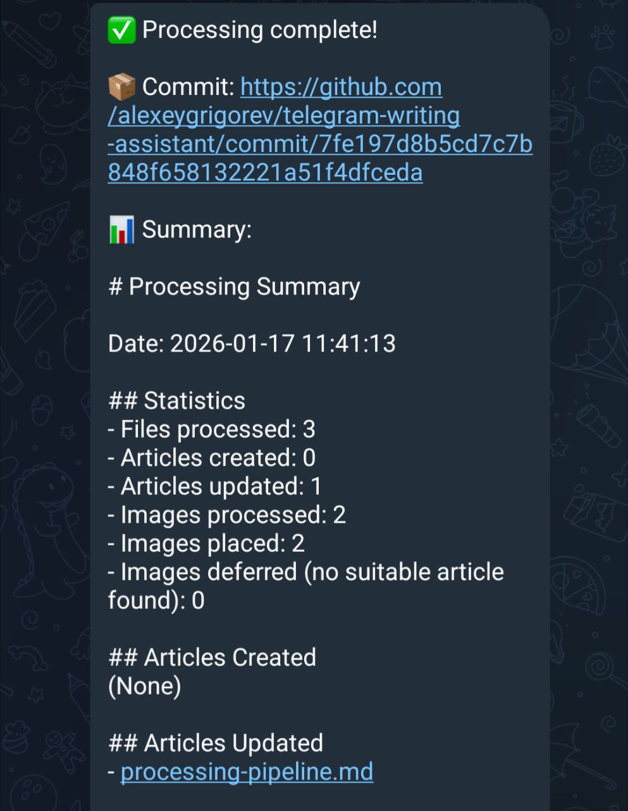
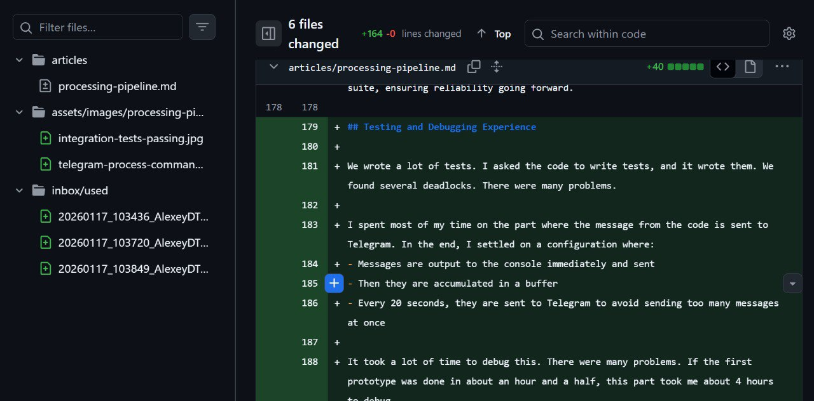
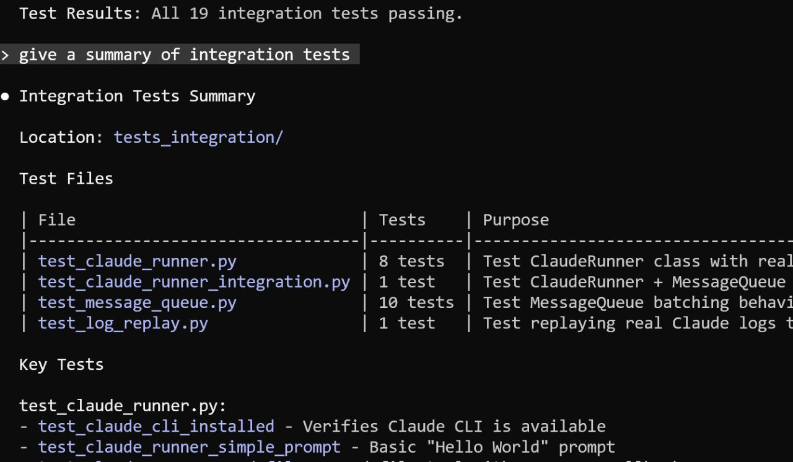
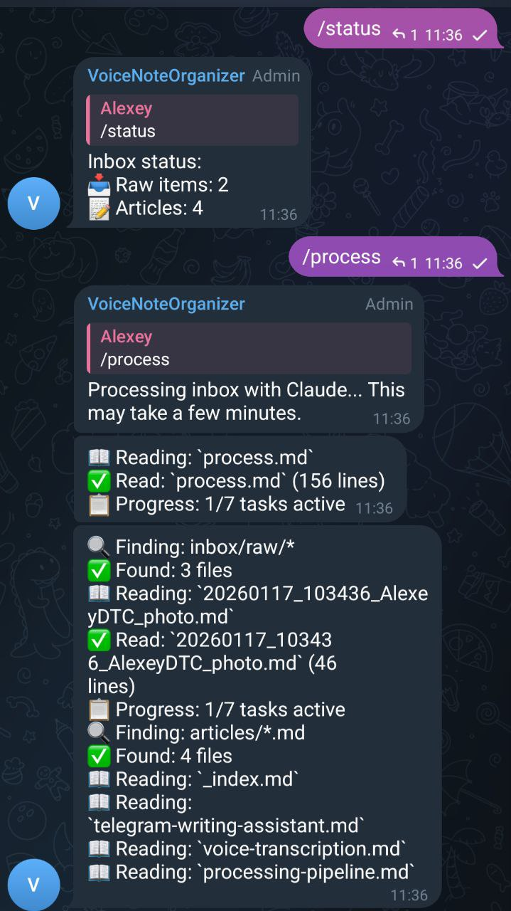

# Processing Pipeline

The automation workflow for organizing materials from Telegram into articles using the /process command.

## User Workflow

The complete workflow from the user's perspective:

1. Write messages and send pictures via Telegram
2. Check /status to see how many raw items are waiting and how many articles exist
3. Run /process to start the processing
4. Watch progress messages arrive in batches
5. Receive a summary and a GitHub commit link showing exactly what was added

This creates a seamless flow - dump thoughts via voice or text, then run a single command to organize everything into articles with full traceability.

<figure>
  
  <figcaption>After processing completes, a summary is sent with a clickable GitHub commit link to view exactly what was added</figcaption>
  <!-- This shows the final output of the /process command - traceability is built in -->
</figure>

## How It Works

I want to write this agent using voice messages. I give instructions via voice, then on the computer, on the laptop, I ask Claude to read these instructions and enter all these instructions into a slash command. Based on this slash command, the command will be called every time I do slash-process in Telegram.

The idea of the slash-process command is that I do a brain dump of everything I have. Usually, one way or another, it relates to one article. I run process, it looks at everything that is not committed in git, looks at what is there, and processes it.

## Development Process

The bot was created using Godfather, a Telegram bot that makes it very easy to create new bots. I quickly created a bot through Godfather, received a token, put it in the environment variables, created a group with the bot, and also saved that in the environment. I also added the Grok key.

Then I gave Claude the specification with the keys and description, said "this is the most important thing, let's go," and Claude analyzed and implemented everything. We iterated on it. It took about an hour and a half yesterday evening to get to the current state.

I was recording voice messages during development and testing the flow immediately. As I recorded a message, it appeared in our folder, then I would ask Claude to analyze it based on the requirements and update the code. I started testing the flow from the very beginning to ensure it would work. This saved time and confirmed that the entire flow was working.

There are no tests yet, but the full flow is functional. I liked how quickly I could iterate. This relates to what we described in the article about documentation - I don't need to write a custom agent. I just describe a document with what should be in it, and that's it. Very convenient. I don't need to write a lot of code.

I basically didn't look at the code at all. This is complete vibe-coding - I just gave specifications and watched what happened. Based on the output, I made small adjustments.

## Processing Steps

<figure>
  
  <figcaption>Terminal output showing the processing requirements derived from voice notes</figcaption>
  <!-- This illustrates the actual requirements being implemented in the code -->
</figure>

1. Check inbox/raw/ for uncommitted materials
2. Read all files in the raw folder
3. For each text/transcript material:
   - Translate to English if needed
   - Decide: existing article OR new article
   - Check each existing article's title and content
   - If no match, create a new article
   - Incorporate content into the right section

4. For each photo in inbox/raw/:
   - Read its markdown description file (this is the ONLY source for image content)
   - Look at messages before/after by timestamp for context
   - Find the most relevant section and add the image
   - Move image from inbox/raw/ to assets/images/{article_name}/
   - Move markdown description file to inbox/used/

5. After processing:
   - Move all processed files from inbox/raw/ to inbox/used/
   - Only transcripts remain (no .ogg files)

## Git Workflow

Claude does git add and git commit with a normal description. The push is done from the Python script. The script takes the hash and sends a GitHub link to the chat. It should be clickable so I can click and view the commit link on GitHub.

<figure>
  
  <figcaption>Terminal showing a summary of changes during development</figcaption>
  <!-- This shows development progress on the processing pipeline -->
</figure>

## Error Handling

When some exception occurs during bot processing, write the exception to the chat. That way we can debug immediately.

<figure>
  
  <figcaption>A TypeError that occurred during processing - no visibility into what went wrong</figcaption>
  <!-- This illustrates why real-time progress tracking is important -->
</figure>

## Image Processing Guidelines

Images are processed using ONLY the markdown description file, NOT vision/analyze_image tools. The markdown file contains Type, Content, Text, and Context. To understand where an image best fits, look at the context by checking messages before and after by timestamp - what text information is around.

## Styling Guidelines

Articles should follow these formatting rules:
- Language: English only
- No bold formatting (no **text**)
- No --- section separators
- Use short, clear sentences - break up long sentences
- We are a curator, not a writer - organize findings, don't rewrite
- Preserve original meaning and all details from voice notes

Each article section must list sources at the end.

## Real-Time Progress Streaming

When processing takes a long time, visibility into what's happening is crucial. I noticed that the agent could run for 10 minutes with no feedback until it either completes or errors out.

The solution is to stream Claude's JSON events in real-time. The agent outputs JSON describing what tools it's using. We can:
1. Parse these JSON events as they arrive
2. Show what tool is being used (Read, Write, Edit, Bash, etc.)
3. Send progress updates to Telegram with rate limiting (max 1 message per 2 seconds)
4. Also print all progress to console
5. Keep saving raw logs to claude_runs/

<figure>
  
  <figcaption>Example of real-time progress updates in Telegram showing what Claude is doing</figcaption>
  <!-- This shows the feature in action - visible progress instead of a 10-minute black box -->
</figure>

This approach gives immediate visibility into the agent's work. Instead of waiting 10 minutes wondering if something is happening, you see updates like:
- Reading: process.md
- Read: process.md (156 lines)
- Progress: 2/8 tasks active
- Running: git add -A
- Found: 6 files

## Testing Strategy

As the codebase grows, the risk of breaking something increases. We need tests.

We should have:
1. Unit tests where we mock external dependencies like Grok
2. Integration tests that verify the full flow

For integration tests, we can give the agent a simple task like "read the files in that folder and output the result." Since we can customize the prompt, we can test that the integration actually works.

Things we can test:
- Mock Grok to return specific transcriptions
- Verify files are created in the right places
- Test the full flow with a temporary test directory
- Verify that specific inputs produce expected outputs

Currently there are no tests, which is concerning. One wrong change could break the entire flow.

## Telegram Rate Limiting and Message Buffering

During development, I discovered a bug where Claude would process messages but nothing was being sent to the Telegram channel. This was frustrating because there was no visibility into what was happening during processing.

After debugging with verbose mode, I found that when running in verbose mode, the code outputs JSON to standard output. The Python subprocess was supposed to parse this JSON and show what was happening, but instead of showing the JSON properly, it was displaying some garbled text.

There were several errors in how the output was being handled.

The original idea was to reflect all messages in Telegram. However, Telegram has rate limiting - if you send too many messages, it starts doing rate limiting.

The solution is message buffering:
- Collect all messages in a buffer
- Check the queue every 3 seconds
- If there are messages in the buffer, send them to Telegram
- This avoids hitting Telegram's rate limits while still providing real-time feedback

This voice message was recorded specifically to test that the buffering system works correctly.

## Message Queue Debugging

During testing, I noticed that while I could see in Telegram that the bot was doing something, messages weren't being sent. After processing completed and the report was sent, only then did messages start arriving. Something was blocking the message queue from launching.

I asked Claude to debug this issue. The problem appeared to be that while processing was happening, the individual progress messages weren't being sent to Telegram. They were being queued or blocked somehow, then all arrived at once after the main process finished.

## Integration Testing

To ensure reliability, we need an integration test. The plan is to create a test that:
- Uses a fake Telegram implementation to verify messages are actually being sent
- Tests that all components work together properly
- Then validates against the real Telegram API
- Becomes part of our permanent test suite

This integration test will verify the full flow works correctly without depending on external services. We'll mock the Telegram client, verify that messages are being sent to the queue properly, and ensure the buffering mechanism works as expected.

## Debugging Session Results

After implementing the integration test and running the debugging session, the message queue issue was resolved. The test was designed to verify that messages are actually being sent properly.

The integration test validates the full flow works correctly without depending on external services. We mock the Telegram client, verify that messages are being sent to the queue properly, and ensure the buffering mechanism works as expected.

This was a quick debugging session. The test is now part of our permanent test suite, ensuring reliability going forward.

## Testing and Debugging Experience

We wrote a lot of tests. I asked the code to write tests, and it wrote them. We found several deadlocks. There were many problems.

I spent most of my time on the part where the message from the code is sent to Telegram. In the end, I settled on a configuration where:
- Messages are output to the console immediately and sent
- Then they are accumulated in a buffer
- Every 20 seconds, they are sent to Telegram to avoid sending too many messages at once

It took a lot of time to debug this. There were many problems. If the first prototype was done in about an hour and a half, this part took me about 4 hours to debug.

The thing is, this feature isn't even critical for the system to work. It's not that important for the MVP. But a lot of time went into it.

Now everything seems to work. I'll take a few screenshots and see how it goes from here.

<figure>
  
  <figcaption>IDE diff showing the content being added about the testing and debugging experience</figcaption>
  <!-- This illustrates how the article was updated with the debugging insights -->
</figure>

<figure>
  
  <figcaption>Terminal output showing all 19 integration tests passing after debugging</figcaption>
  <!-- This illustrates the successful outcome of the debugging session -->
</figure>

## Telegram Bot Interface

The /process command is initiated through Telegram. Before running /process, you can check /status to see how many raw items are waiting and how many articles exist.

<figure>
  
  <figcaption>Telegram conversation showing the status check and process initiation</figcaption>
  <!-- This shows the actual user interface for the processing pipeline -->
</figure>

When /process is run, the bot shows real-time progress:
- Reading the process.md instructions
- Finding files in inbox/raw/
- Reading articles
- Progress updates showing active tasks

This visibility makes it clear what's happening during processing instead of a mysterious long wait.

## Future Improvements

### Reducing Output Noise

Looking at the Telegram output during processing, there is too much noise. Progress messages like "one of seven tasks completed" are not particularly useful. The repetitive status updates are also noise. The most useful outputs are:
- When reading is complete (what was read)
- Editing operations
- mkdir and move commands

The goal is to keep only genuinely useful information and reduce the noise level.

### Interactive Progress Messaging

During a 14-minute processing run, the bot posts too many individual messages. While this provides useful feedback during processing, it creates too much clutter. The idea is to make this more interactive[^1]:

Create a single message that updates as processing progresses, rather than posting many separate messages. The message should:
- Be collapsible so it can be expanded and collapsed
- Show "working" status at the start, then "done" when complete
- Update in place instead of creating new posts

This would reduce the number of messages significantly while maintaining visibility into what's happening.

### Consolidating File Read Messages

When the agent reads multiple files, each individual read is shown. For example, when reading 20 input files, each file appears as a separate "read" message. This could be consolidated into a single counter that updates:
- "Read 10 input files" then "Read 12 input files" then "Read 13 input files"
- Update every 10 seconds instead of 20
- Remove duplicate reads of the same file
- Fix emoji collision where Read and Found look the same

### Collapsible Content for Long Responses

When the agent responds with transcripts or other long content, it takes up too much space. Telegram's `messageEntityBlockquote` can be used to create collapsible quotes[^2]. This would allow long content like transcripts to be collapsed by default and expanded when needed.

### Processing Time Tracking

The processing takes significant time. The code spends a lot of time analyzing. This is acceptable - speed is not the priority. The system works and saves time overall compared to manual organization.

However, it would be good to add timing information - start a timer at the beginning and report how many minutes and seconds the processing took at the end. This would help set expectations and provide transparency about the process duration.

### Clickable Source Links

Currently, all sources are listed at the bottom of each article. It would be more convenient to have clickable inline links within the article itself. When editing and seeing something strange, it should be easy to jump directly to the original voice message to review the context.

The challenge is that the .ogg files are removed after transcription. We would need a way to link back to the original Telegram message, perhaps through some identifier or timestamp that can be used to locate the message in Telegram.

### Multi-Section Content Distribution

A single voice note or transcript might contain content relevant to multiple articles or multiple sections within one article. When processing, content from one source should be distributed appropriately across different sections, with proper citations for each location.

### URL-Only Message Handling

When a message contains only a URL, we should use Jina Reader to fetch and analyze the content:
- Use curl: `curl "https://r.jina.ai/{original_url}"`
- This returns clean markdown content from the page
- Then incorporate that content into the appropriate article

### Context-Aware Message Grouping

Short messages or unclear content should be processed in context. Look at nearby messages by timestamp (within 1-2 minutes) to understand the full picture. Check the date field in frontmatter to find messages sent around the same time. Read related voice notes, text, and photos together to get the complete picture.

### Content-First Grouping Principle

Messages sent at the same time should not automatically be grouped together. Grouping should consider both timing AND thematic relationship. If messages sent together are about different topics, they should create separate articles[^3].

For example, a message about the processing pipeline and another about the AI Bootcamp course were sent together but don't relate to each other - they should become separate articles. The processor must look at both time and content when grouping[^4].

### Article Organization Principles

Each article should follow a logical structure with internally consistent content. When a voice note or message discusses the Telegram Writing Assistant's origin story, the article should contain only content related to that assistant - workflow, origin story, architecture. Content about article structure or vision agents that doesn't directly relate to the assistant description should be in separate articles[^5].

Materials shared for articles (experience, events, notes) can be used for Substack newsletters or social media posts. Instructions and requests to the bot should be handled separately[^6].

### Social Media Posts Folder

As an idea, create a separate folder on GitHub for social media posts. This would contain ideas and drafts for posts based on shared ideas and existing articles. The folder would organize content specifically for social media distribution[^7].

### Forwarded Message Handling

When forwarding messages to the Telegram bot, all forwarded messages have the same timestamp. This causes files to overwrite each other. We need to add a unique identifier - perhaps the message ID - to ensure each forwarded message gets its own file.

For images in forwarded messages, there is an error "Bad request cannot parse entities." We need to investigate how to properly extract images from forwarded messages.

### Progress Output Formatting

The current progress output has formatting issues that need to be addressed. When displaying file paths, markdown files with underscores are being rendered as links instead of plain text. The backslashes before underscores in filenames like `20260118_094002_AlexeyDTC_msg291.md` should not cause links to appear.

Progress messages need more descriptive text. Instead of just showing icons like "Read 14 files" or "Edited 3 files", the output should explain what's happening. For example: "Read 14 files from inbox/raw/" or "Found 4 matching items".

### Hidden Messages Display

When many messages are hidden during processing, the output should clearly indicate that messages are hidden. Currently it shows something like "(14 earlier commands hidden)" but this isn't immediately obvious.

The display should be limited to the last 10 messages instead of 15-20, to reduce clutter while still providing context about what just happened.

### Repeated Operation Filtering

When the same operation appears multiple times in quick succession (like "processing-pipeline.md" appearing three times in a row), these should be consolidated. The progress tracker should detect consecutive identical operations and display them once with a count instead of repeating.

## Sources
- [20260117_103849_AlexeyDTC_transcript.txt](../inbox/raw/20260117_103849_AlexeyDTC_transcript.txt)
- [20260117_085944_AlexeyDTC_transcript.txt](../inbox/raw/20260117_085944_AlexeyDTC_transcript.txt)
- [20260117_090215_AlexeyDTC_transcript.txt](../inbox/raw/20260117_090215_AlexeyDTC_transcript.txt)
- [20260117_091121_AlexeyDTC_transcript.txt](../inbox/raw/20260117_091121_AlexeyDTC_transcript.txt)
- [20260117_085415_AlexeyDTC_transcript.txt](../inbox/raw/20260117_085415_AlexeyDTC_transcript.txt)
- [20260116_211210_AlexeyDTC_transcript.txt](../inbox/raw/20260116_211210_AlexeyDTC_transcript.txt)
- [20260116_211314_AlexeyDTC_transcript.txt](../inbox/raw/20260116_211314_AlexeyDTC_transcript.txt)
- [20260116_211932_AlexeyDTC_transcript.txt](../inbox/raw/20260116_211932_AlexeyDTC_transcript.txt)
- [20260116_212036_AlexeyDTC_transcript.txt](../inbox/raw/20260116_212036_AlexeyDTC_transcript.txt)
- [20260116_212800_AlexeyDTC_transcript.txt](../inbox/raw/20260116_212800_AlexeyDTC_transcript.txt)
- [20260116_213156_AlexeyDTC_transcript.txt](../inbox/raw/20260116_213156_AlexeyDTC_transcript.txt)
- [20260116_213629_AlexeyDTC_transcript.txt](../inbox/raw/20260116_213629_AlexeyDTC_transcript.txt)
- [20260116_220451_AlexeyDTC_transcript.txt](../inbox/raw/20260116_220451_AlexeyDTC_transcript.txt)
- [20260117_064900_AlexeyDTC_transcript.txt](../inbox/raw/20260117_064900_AlexeyDTC_transcript.txt)
- [20260117_065102_AlexeyDTC_transcript.txt](../inbox/raw/20260117_065102_AlexeyDTC_transcript.txt)
- [20260117_070806_AlexeyDTC_transcript.txt](../inbox/raw/20260117_070806_AlexeyDTC_transcript.txt)
- [20260117_073321_AlexeyDTC_transcript.txt](../inbox/raw/20260117_073321_AlexeyDTC_transcript.txt)
- [20260117_105133_AlexeyDTC_transcript.txt](../inbox/raw/20260117_105133_AlexeyDTC_transcript.txt)
- [20260117_105343_AlexeyDTC_transcript.txt](../inbox/raw/20260117_105343_AlexeyDTC_transcript.txt)
- [20260117_105436_AlexeyDTC_transcript.txt](../inbox/raw/20260117_105436_AlexeyDTC_transcript.txt)
- [20260117_110618_AlexeyDTC_transcript.txt](../inbox/raw/20260117_110618_AlexeyDTC_transcript.txt)
- [20260117_113606_AlexeyDTC_transcript.txt](../inbox/raw/20260117_113606_AlexeyDTC_transcript.txt)
- [20260117_113705_AlexeyDTC_transcript.txt](../inbox/raw/20260117_113705_AlexeyDTC_transcript.txt)
- [20260117_113736_AlexeyDTC_transcript.txt](../inbox/raw/20260117_113736_AlexeyDTC_transcript.txt)
- [20260117_113943_AlexeyDTC_transcript.txt](../inbox/raw/20260117_113943_AlexeyDTC_transcript.txt)
- [20260116_211757_AlexeyDTC_photo.md](../inbox/used/20260116_211757_AlexeyDTC_photo.md)
- [20260116_213322_AlexeyDTC_photo.md](../inbox/used/20260116_213322_AlexeyDTC_photo.md)
- [20260117_070247_AlexeyDTC_photo.md](../inbox/used/20260117_070247_AlexeyDTC_photo.md)
- [20260117_074604_AlexeyDTC_photo.md](../inbox/used/20260117_074604_AlexeyDTC_photo.md)
- [20260117_104434_AlexeyDTC_transcript.txt](../inbox/used/20260117_104434_AlexeyDTC_transcript.txt)
- [20260117_104326_AlexeyDTC.jpg](../assets/images/processing-pipeline/processing-complete-summary.jpg)
- [20260117_104344_AlexeyDTC.jpg](../assets/images/processing-pipeline/testing-debugging-diff.jpg)
- [20260118_094158_AlexeyDTC_msg293_transcript.txt](../inbox/raw/20260118_094158_AlexeyDTC_msg293_transcript.txt)
- [20260118_094459_AlexeyDTC_msg295_transcript.txt](../inbox/raw/20260118_094459_AlexeyDTC_msg295_transcript.txt)
- [20260118_094509_AlexeyDTC_msg297_transcript.txt](../inbox/raw/20260118_094509_AlexeyDTC_msg297_transcript.txt)
- [20260118_094548_AlexeyDTC_msg299.md](../inbox/raw/20260118_094548_AlexeyDTC_msg299.md)
- [20260118_094647_AlexeyDTC_msg301_transcript.txt](../inbox/raw/20260118_094647_AlexeyDTC_msg301_transcript.txt)
- [20260118_175651_AlexeyDTC_msg303.md](../inbox/raw/20260118_175651_AlexeyDTC_msg303.md)
- [20260118_181053_AlexeyDTC_msg305.md](../inbox/raw/20260118_181053_AlexeyDTC_msg305.md)
- [20260119_170448_AlexeyDTC_msg324.md](../inbox/raw/20260119_170448_AlexeyDTC_msg324.md)
- [20260119_170601_AlexeyDTC_msg325.md](../inbox/raw/20260119_170601_AlexeyDTC_msg325.md)
- [20260119_170720_AlexeyDTC_msg326_transcript.txt](../inbox/raw/20260119_170720_AlexeyDTC_msg326_transcript.txt)
- [20260119_170739_AlexeyDTC_msg327_transcript.txt](../inbox/raw/20260119_170739_AlexeyDTC_msg327_transcript.txt)
- [20260122_140250_AlexeyDTC_msg377_transcript.txt](../inbox/raw/20260122_140250_AlexeyDTC_msg377_transcript.txt)
- [20260122_141520_valeriia_kuka_msg380_transcript.txt](../inbox/raw/20260122_141520_valeriia_kuka_msg380_transcript.txt)
- [20260122_141704_valeriia_kuka_msg381_transcript.txt](../inbox/raw/20260122_141704_valeriia_kuka_msg381_transcript.txt)
- [20260122_141807_valeriia_kuka_msg382_transcript.txt](../inbox/raw/20260122_141807_valeriia_kuka_msg382_transcript.txt)
- [20260122_141958_valeriia_kuka_msg384_transcript.txt](../inbox/raw/20260122_141958_valeriia_kuka_msg384_transcript.txt)
- [20260122_142146_valeriia_kuka_msg385_transcript.txt](../inbox/raw/20260122_142146_valeriia_kuka_msg385_transcript.txt)

[^1]: [20260118_094158_AlexeyDTC_msg293_transcript.txt](../inbox/raw/20260118_094158_AlexeyDTC_msg293_transcript.txt)
[^2]: [StackOverflow: How to send a message with collapsed long quote with Telegram API](https://stackoverflow.com/questions/79427631/how-to-send-a-message-with-collapsed-long-quote-with-telegram-api)
[^3]: [20260122_140250_AlexeyDTC_msg377_transcript.txt](../inbox/raw/20260122_140250_AlexeyDTC_msg377_transcript.txt)
[^4]: [20260122_141958_valeriia_kuka_msg384_transcript.txt](../inbox/raw/20260122_141958_valeriia_kuka_msg384_transcript.txt)
[^5]: [20260122_141520_valeriia_kuka_msg380_transcript.txt](../inbox/raw/20260122_141520_valeriia_kuka_msg380_transcript.txt)
[^6]: [20260122_141704_valeriia_kuka_msg381_transcript.txt](../inbox/raw/20260122_141704_valeriia_kuka_msg381_transcript.txt)
[^7]: [20260122_142146_valeriia_kuka_msg385_transcript.txt](../inbox/raw/20260122_142146_valeriia_kuka_msg385_transcript.txt)
