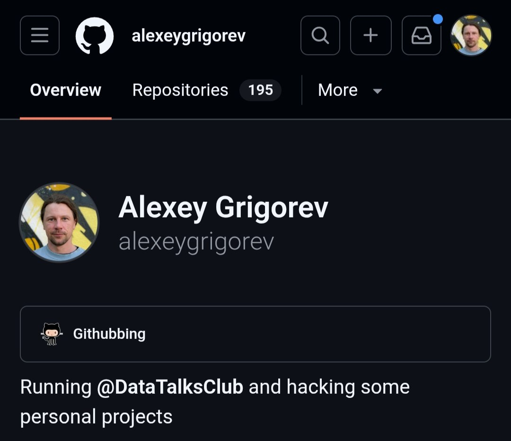
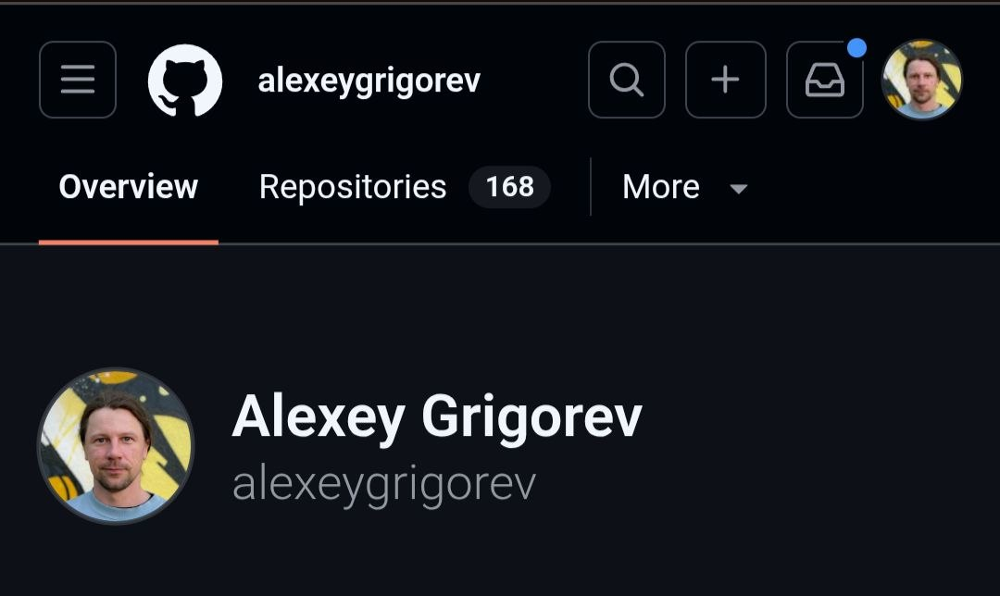

# Projects That Didn't Make It

I have a lot of projects that I started with some grand idea, spent time on, and then never really did anything with. Some of them work, some of them work but it turned out I didn't have an acute need for them, some of them don't work, and some turned out that I just couldn't realize my vision the way I wanted - or they were much more complex than I thought. In the end they got abandoned, at different stages of readiness[^1].

If you look at how many repositories I have on GitHub right now, there are a lot of them. And that's only counting my own repositories, plus there are the DataTalksClub repositories and the AI Shipping Labs ones on top of that[^3]. Naturally, not all of these projects survive in the end[^1].

<figure>
  
  <figcaption>My GitHub profile - 195 repositories, and not all of them survive.</figcaption>
  <!-- illustrates the scale of started projects mentioned in the intro -->
</figure>

I write a lot of code. There are projects I created where the idea was great but it didn't work out. I think it's worth writing about this.

## The fitness tracker

When I first got a Claude Code subscription, the first application I started building was my fitness tracker. I feel like every person sooner or later writes this app[^6].

This wasn't my first assistant - the first assistant I built was fully in the terminal. But this fitness tracker basically let me understand how to use Claude Code. It had a backend and a frontend. The backend was on Django initially. I gave the agent the task and said I don't really care what you do. In the end I didn't like it, so I asked it to rewrite the backend on Django and the frontend on something else, I don't even remember what anymore. There was a lot of custom logic[^6].

Why did I take on this project in the first place? I have my own specific process. I tried several different fitness apps and fitness trackers, and none of them fit my process. So I figured I could write my own. And right when I started trying out Claude Code, I thought this is something I can do. Plus, as I wrote recently, for me this was the kind of project I could actually wrap my head around with agents - something where I could understand what I'm able to build[^6].

In the end I abandoned this project. I might come back to it, but more likely I'll redo it from scratch, because now, half a year later, I basically understand how to do it better[^6].

Project: [github.com/alexeygrigorev/fitness-tracker](https://github.com/alexeygrigorev/fitness-tracker) [^12] - a full-stack fitness tracker with workout logging, nutrition tracking, and sleep tracking, with a Django REST backend and a React frontend.

## CodeHive

I already wrote about CodeHive [^1]. It didn't stick. Why not?

CodeHive turned out to be too ambitious. I needed to descope it somehow, because I came up with too many features. I wanted to do too much - a web app and a mobile app, with a built-in task tracker. The whole idea of CodeHive was that I wanted to take the approach I describe with a team of agents and make it deterministic[^3]. I described that approach in [I Built an AI Agent Team for Software Development and Tested on 5 Real Projects](https://alexeyondata.substack.com/p/i-built-an-ai-agent-team-for-software).

I wanted it to work from the phone, to be launchable from the computer and from the web, with a task tracker built right in. In short, I dreamed up a lot of things - the vision was grand[^3].

Here are the features I had planned for it[^3]:

- Multi-platform access: a rich web/desktop client, a mobile app acting as a control tower, a Telegram bot as a lightweight client, a terminal client/TUI for use over SSH, and a CLI for scripting and CI/CD
- All clients sharing the same state, so one session is accessible from web, mobile, terminal, and Telegram simultaneously
- Self-hosted on your own server or laptop, accessed via SSH tunnel, so you own all the data
- Persistent agent sessions that live inside projects - an operating system for agent sessions, not a chat
- A session task queue where the agent automatically picks the next task when the current one completes
- Sub-agent orchestration, where sub-agents are full sessions with their own chat, todo, diff, and logs, arranged in a tree
- A pending-questions queue so the agent defers non-blocking questions and keeps working while I'm away
- Agent modes like Brainstorm, Interview, Planning, Execution, and Review
- A library of agent roles (Developer, Tester, Product Manager, Bug Fixer, Refactor Engineer) with per-project overrides
- A live line-level diff viewer, a change timeline, approval gates for destructive actions, and session replay
- Voice input, GitHub integration, an issue tracker, and swappable LLM engines

The main reason I wanted to build this project was that I wanted to be able to do more from my phone. In the end, when I discovered Termius, I realized I don't need such a complex system. It turned out that just opening Termius and doing what I need was enough[^3].

This project wasn't a complete waste, though. It was one of the projects where I worked out the approach to building things with a team of agents. So it wasn't useless - for me it was simply the experience of building this kind of project. But to polish it to the point where I could actually use it would take a very long time. I abandoned this project as too complex, because there was genuinely a lot of work involved - even if I launched all my agents on it at once, I don't think it would have been enough. It required too much effort, and I found an alternative that required less: I just opened Termius and did what I needed[^3].

Project: [github.com/alexeygrigorev/codehive](https://github.com/alexeygrigorev/codehive) [^1]

## Litehive

The next project came out of CodeHive. I realized that I only needed the core functionality of CodeHive - the part I actually wanted. I wanted that deterministic execution, a state machine for tasks, where the process is deterministic[^4].

The problem CodeHive was solving is this: if I use an agent as an orchestrator, it sometimes skips steps, and each session can interpret the requirements its own way. I wanted the process to be followed strictly - first the issue, then it gets groomed, and so on, exactly the way it's described in the agent-team article. That led me to pull this part out of CodeHive into a separate project, with no interface and no web. I called it Litehive. There I implemented the state machine[^4].

There was another idea in Litehive. At that time OpenCode already existed and I was also using it, so I decided to make the project independent of any specific engine - not tied to a particular harness. I wanted to be able to run whatever engine I liked. The core idea was that the project would be self-healing[^4].

I also wanted it so that if, say, I was approaching a limit, it would easily switch - from Claude to Codex, from Codex to something else - so that it would be as independent as possible. I didn't like the dependency on a specific engine. That was the problem I was trying to solve here: first, I wanted determinism in execution, and second, I didn't like being tied to a particular engine. The workflow was such that it didn't matter which agent I had - all the skills were written so that any agent could read them[^4].

I spent more than a month on this project, maybe up to a month and a half, and I burned a huge pile of tokens on it. It never reached a stable version. In the end I rewrote it several times, almost from scratch, telling it each time that I want it to work this way. There's a lot of code in there that I don't like. I tried to read all of this code and understand it, and there was a lot of over-engineering[^4].

My mistake was that I didn't think through the architecture properly from the start. The agents came up with things themselves, it got complicated, and I started rewriting. But in that complex architecture there were already a lot of checks and ifs that were handling edge cases, and when I tried to rewrite it, those edge cases somehow got lost. In the end there was no stability. The code was awful. It worked, but not exactly beautifully[^4].

I learned a lot working on this project. For example, I understood that some things need to be thought through from scratch. I liked the state machine we ended up with - I monitored and supervised all of it myself. But in the end I don't think I'll ever come back to it. It's not that I buried it, but I won't return, because now it's much simpler for me to just start an agent, and they more or less follow the process anyway. I managed to tune the process for both Codex and Claude Code so that they don't really mess things up[^4].

On top of that, when my orchestrator is a non-deterministic orchestrator, like before, I can launch a lot of sessions at once and the orchestrator merges them. When you go deterministic, that's much harder to do. So in the end I think I won't return to this project. Good experience, but that's where it ends[^4].

Project: [github.com/alexeygrigorev/litehive](https://github.com/alexeygrigorev/litehive) [^4]

## The Mermaid diagram tool

Another project I already talked about in the agent-team article is the one for Mermaid diagrams. I actually polished it to a good state. I didn't spend all that much of my own time on it, though it probably ate a lot of tokens, and I used it to work out the process[^5].

It works. I just don't have an acute need to use it right now. I needed to generate these kinds of diagrams, and in the end I do generate Mermaid diagrams now - but I just make the regular ones in the browser and paste them in. It turned out that the generation itself wasn't all that important. Maybe I'll still need it later, when I have a dedicated tool for it, but at the moment it turned out I don't need it. So the project isn't exactly abandoned, but I don't use it as actively as I originally proposed[^5].

Project: [github.com/alexeygrigorev/merm](https://github.com/alexeygrigorev/merm) [^5]

## The metabolism simulator

The next project I tried to build came from reading about the Ralph loop. I wrote about that - about running an experiment through code - in [My Experiments with Claude Code](https://alexeyondata.substack.com/p/my-experiments-with-claude-code). I figured I have a subscription and tokens, I'm not using them all that heavily, and people write that they have these long-running sessions. I thought that if I launch an agent, give it a task, and come back in a few days, I could see what's happening[^7].

Since I do sports, I'm genuinely interested in how metabolism works - what happens when I go for a run without breakfast, or what happens when I eat and then go to the gym, or how I should eat after the gym, whether I want to cut or, on the contrary, gain mass, and how exactly to eat for that and how it would affect me. So I wanted an app about metabolism tailored specifically to me. I wanted to integrate my fitness tracker into it, so that based on my approach, my diet, and what I eat, I could understand how all of this works and build this metabolism model specifically for my body - a kind of personal nutrition coach that knows everything about me. That was the idea. So I said I want to build a model of human metabolism[^7].

To understand how to build this into my fitness tracker, I wanted to understand how metabolism works in general. Not only for the fitness tracker - I'm just personally interested in it[^8].

So I gave the agent this task. There was a computer game in the 90s called Komputerschik - "the Computer Guy" - the kind where you have a computer, you can buy it more RAM, you can do other things. I don't know if it was in English, I only knew it in Russian. I didn't have a computer back then; my friend had one, and he had this game, a computer simulator. I wanted something like that, only with a human: the person eats, and I see what happened to their body, with the app showing some metrics like glucose level. I wanted to understand the cause-and-effect: I go to the gym, what happens in my body; after the gym I eat, what happens in my body. First, to learn it better, and second, I figured that if I see it in code, it would be easier for me to understand[^8].

The problem with an app like this is that you can't one-shot it. So my prompt was `continue, make sure there are no bugs, find bugs and fix them as features`. I let it work for several days. In the end most things didn't work - not that nothing worked, but a lot of things didn't[^8].

I gave up on this project, because it required focus and attention, and I have a lot of projects running in parallel that demand my attention. I poked at it, saw that something sort of works, but the code is very unclear, it works in some places but not others, and I couldn't figure out how to use it. I don't think I'll come back to this specific project. If I do anything, it'll most likely be from scratch and more deliberately, thinking about exactly what to drive[^8].

Back then I wanted to test how independently, without me, without my involvement, agents could build something useful. It turned out they basically can't. You need to build a process, you need to give clear requirements, and those requirements need to be groomed. In the end this project led me to understanding how I want to build things with agents: there should be not one agent but several, there should be a tester that accepts the work, there should be a full development process - not just I want this app, make it good. In that sense it served its purpose[^8].

Project: [github.com/alexeygrigorev/metabolism-simulator](https://github.com/alexeygrigorev/metabolism-simulator) [^12] - a web-based educational simulator modeling human metabolism, hormones, exercise effects, and food timing.

## What spun off from Litehive

Litehive itself cost me a lot of time, but I did extract some useful things from it and use them separately now. Two projects split off from it[^9].

### Heru

The first one is called Heru. Heru is from Elvish or some other language. The idea behind Heru is that I can take any agent engine and run it, and it gives me the output. It's meant for running an agent in headless mode - you give it a prompt, it launches a session and does something until the session finishes. That's exactly what I needed for Litehive. I wanted a kind of unified CLI that works with Claude Code, with Codex, with OpenCode, with GitHub Copilot, with Gemini - basically with whatever you want, easy to plug and play, and that knows about the limits[^9].

This project isn't fully abandoned. I still have plans for it. I want to use it for things like running the Telegram writing assistant headless - that's actually how the Telegram writing assistant works. So I think I'll have to move it to Codex, and then with Codex it's also unclear what will happen - maybe one day they'll decide to do the same thing. I want to have this engine-agnostic way to launch these kinds of long-running tasks: just start a session, wait for it to finish[^9].

When Copilot was cheap, I actually used it a lot in this mode through Heru, and it worked perfectly fine. But now, as we know, Copilot isn't cheap - it got much more expensive - so Copilot isn't an option either. Still, I think all sorts of new providers will keep appearing; I'm already seeing these Chinese providers show up. So I think something like this will be useful in the future[^9].

The reason I named it Heru in the first place is that I wanted something like one ring to rule them all, so I wanted a name connected to Lord of the Rings. It's some Elvish word, or some other language, I don't remember exactly. So this project isn't completely abandoned right now - it branched off from Litehive, and it could potentially get used[^9].

Project: [github.com/alexeygrigorev/heru](https://github.com/alexeygrigorev/heru) [^10] - an engine adapter layer for CLI-based coding agents (Codex, Claude, Copilot, Gemini, OpenCode, goz), extracted from Litehive.

### Quse

The other project that branched off from Litehive, and the one I actively use now, is Quse. Quse - I don't remember exactly, Quota Use - is for tracking my Claude Code usage. I use it to keep an eye on usage, so that from the command line I can know how much I have left on each provider, how many tokens are left, what percentage[^11].

This is probably the project I use the most right now. I integrated it into the pocket app I wrote about not long ago, and now from my phone I can see my limits - how much I have left on each provider - and I also get a push notification on my phone when the limits are running low, so I can do something about them. This is probably the single most useful project that came out of Litehive[^11].

Project: [github.com/alexeygrigorev/quse](https://github.com/alexeygrigorev/quse) [^10] - quota and usage checks for coding-agent CLIs, reporting normalized usage across Codex, Claude Code, Copilot, and Z.AI/goz.

## Code Explainer

Here's another project worth citing. Sometimes you build a project that seems useful, but then another, more suitable solution comes along that solves the problem better[^15].

Code Explainer is an example of that. It was an agent I wrote so I could understand some project - what code is in it, what it does, how it works in general. Say it's never clear how, for example, a particular function works, what's inside it, what it does. The agent would do this kind of reconnaissance over the code and then tell me how things are structured in there[^15].

In the end I built it, and then I started using Claude Code and realized I don't need this tool at all. I can easily just ask Claude Code or other agents to tell me how something works. They clone the necessary repositories themselves, look through them themselves. It turned out to be much simpler to use a general-purpose coding assistant than to try to build something like this[^15].

Project: [github.com/alexeygrigorev/code-explainer](https://github.com/alexeygrigorev/code-explainer) [^14] - an AI agent that explores a GitHub codebase using file-reading, grep, and directory-listing tools to answer questions and explain how the code works, with a Streamlit chat interface, OpenAI-powered analysis, and API cost tracking.

## It's okay to have dead weight in your repos

I just looked through my repositories and realized that there are actually a lot more projects like this - ones I started at some point and now don't use. There are many more than the ones here, and I don't think there's a point in covering all of them[^13].

I just wanted to say that this is normal. It's fine to experiment, and when you start using coding agents, not everything you build has to be useful. Often these projects just sit there as dead weight in your repositories, and that's part of the process, and it's okay. When you make something, you learn something new - that's the most important thing, you gain experience. If a project ends up unused, that happens, and there's nothing wrong with it. And you can still take something away from each of these projects[^13].

After preparing all of this, I decided to look at which projects I have and which ones are unnecessary, and I did some cleanup - I deleted a number of projects that I basically don't need anymore. So now there are slightly fewer repositories. There are of course still a lot of repositories left that I don't really need either and that will probably never come in handy, but I'll most likely delete those not now, but after some time[^17] [^16].

<figure>
  
  <figcaption>After a cleanup pass - down to 168 repositories, with more dead weight still to clear out later.</figcaption>
  <!-- illustrates the repo cleanup described just above, after deleting projects that are no longer needed -->
</figure>

## Sources

[^1]: [20260611_071731_AlexeyDTC_msg4535_transcript.txt](../inbox/used/20260611_071731_AlexeyDTC_msg4535_transcript.txt)
[^2]: [20260611_071758_AlexeyDTC_msg4537_photo.md](../inbox/used/20260611_071758_AlexeyDTC_msg4537_photo.md)
[^3]: [20260611_072150_AlexeyDTC_msg4539_transcript.txt](../inbox/used/20260611_072150_AlexeyDTC_msg4539_transcript.txt)
[^4]: [20260611_073007_AlexeyDTC_msg4541_transcript.txt](../inbox/used/20260611_073007_AlexeyDTC_msg4541_transcript.txt)
[^5]: [20260611_073134_AlexeyDTC_msg4543_transcript.txt](../inbox/used/20260611_073134_AlexeyDTC_msg4543_transcript.txt)
[^6]: [20260611_073434_AlexeyDTC_msg4545_transcript.txt](../inbox/used/20260611_073434_AlexeyDTC_msg4545_transcript.txt)
[^7]: [20260611_073642_AlexeyDTC_msg4547_transcript.txt](../inbox/used/20260611_073642_AlexeyDTC_msg4547_transcript.txt)
[^8]: [20260611_074116_AlexeyDTC_msg4549_transcript.txt](../inbox/used/20260611_074116_AlexeyDTC_msg4549_transcript.txt)
[^9]: [20260611_074513_AlexeyDTC_msg4551_transcript.txt](../inbox/used/20260611_074513_AlexeyDTC_msg4551_transcript.txt)
[^10]: [20260611_074542_AlexeyDTC_msg4553.md](../inbox/used/20260611_074542_AlexeyDTC_msg4553.md)
[^11]: [20260611_074737_AlexeyDTC_msg4555_transcript.txt](../inbox/used/20260611_074737_AlexeyDTC_msg4555_transcript.txt)
[^12]: [20260611_075009_AlexeyDTC_msg4557.md](../inbox/used/20260611_075009_AlexeyDTC_msg4557.md)
[^13]: [20260611_075123_AlexeyDTC_msg4559_transcript.txt](../inbox/used/20260611_075123_AlexeyDTC_msg4559_transcript.txt)
[^14]: [20260611_075157_AlexeyDTC_msg4564.md](../inbox/used/20260611_075157_AlexeyDTC_msg4564.md)
[^15]: [20260611_075318_AlexeyDTC_msg4565_transcript.txt](../inbox/used/20260611_075318_AlexeyDTC_msg4565_transcript.txt)
[^16]: [20260611_080901_AlexeyDTC_msg4569_photo.md](../inbox/used/20260611_080901_AlexeyDTC_msg4569_photo.md)
[^17]: [20260611_081018_AlexeyDTC_msg4571_transcript.txt](../inbox/used/20260611_081018_AlexeyDTC_msg4571_transcript.txt)
