# 13 Real-Life AI Projects from AI Engineering Buildcamp Cohort 3

The third cohort of my AI Engineering course wrapped this summer, and in this post I want to share what we built. The projects are real-life and include an exam generator, a chess coach, a RAG pipeline, job tools, and research assistants.

Some of us presented the projects live on [Demo Day](https://youtu.be/kKUDZwdyuP4), so we'll start with them. Then I'll go through the rest of the [submitted projects](https://courses.datatalks.club/ai-buildcamp-3/projects).

I wrote about the first two cohorts in [5 ideas for AI agents](https://aishippingblog.com/p/5-ideas-for-ai-agents-and-openais) and [9 Real-Life AI Projects from AI Engineering Buildcamp Graduates](https://aishippingblog.com/p/9-real-life-ai-projects-from-ai-engineering).

### 1) Exam Generator by Salma

<!-- illustration: Salma's exam review screen with judge feedback on a generated question -->

Salma is a data analyst who took the course to get better at building an AI app. She's leaving her job to work as a founder. Her project helps university professors generate exams from their own slide decks.

You upload a course PDF and pick how many questions you want. You also choose a mix of case studies, theory, and applied-concept questions. A professor can approve, edit, or reject each question, then export the exam. In the live demo she asked the model to tailor an HR-management exam to a business student in Berlin.

The first version was a complicated vibe-coded app because she thought she needed RAG. She didn't, and the model just reads the PDF and writes questions from it. Quality jumped after about two hours of good few-shot exam examples. An early attempt to learn from professor feedback made things worse, because wrong edits turned into few-shot examples.

The frontend is Next.js, and Supabase stores user actions plus API cost, PDF size, and regeneration prompts. She started on Anthropic and moved to GPT because it was cheaper. An LLM judge checks that a question is grounded in the course and not answerable without it. The first judge was too lenient, so she ran evals that included tests where another model tries to answer without seeing the slides.

### 2) ATS Gap Analyser by Amar Agrawal

<figure>
  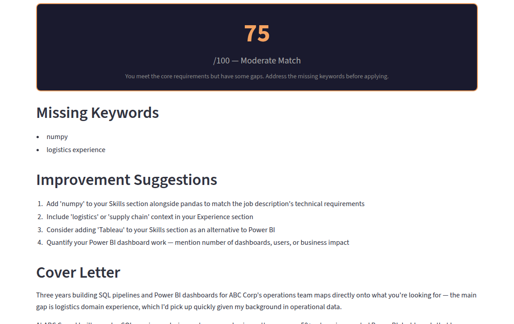
  <figcaption>ATS Gap Analyser's example result with a 75/100 match, missing keywords, and improvement suggestions</figcaption>
</figure>

Amar's [ATS Gap Analyser](https://github.com/Amar-Ag/ats-gap-analyser) is for people who apply to jobs and never find out what went wrong. You paste a job URL and a CV. The app returns a match score out of 100, missing keywords, improvement suggestions, and a three-paragraph cover letter as a .docx file.

The live app is on [Streamlit](https://ats-gap-analyser.streamlit.app/). It doesn't store the CV or the job description, not even in the logs. Cover letters work in seven languages. There's a limit of three analyses per visitor so the free-tier token budget holds.

The agent has four tools.

- Extract job requirements
- Score the CV
- Suggest improvements
- Generate the cover letter

Scoring and suggestions use Groq with `llama-3.3-70b-versatile`. If Groq hits the daily limit, the same model and parameters fall back to Hugging Face. Suggestions retrieve from 50 ATS best-practice documents with minsearch. A regex pass trims the CV before the model sees it, so each call stays under about 3,000 tokens.

He set cover-letter temperature to 1, and the other tools run at 0.

Eval used 50 manually written cases. Version 1 had 60% recall and 30% accuracy, and version 6 reached 88% recall. Amar kept accuracy lower on purpose: he would rather flag a missing skill than miss it. GitHub Actions checks tool order, an LLM judge, and out-of-scope questions such as weather, so the agent doesn't spend credits on those.

[Amar's LinkedIn](https://www.linkedin.com/in/amar-agrawal-/)

### 3) Chess Coach Agent by Leo Cabibihan

<figure>
  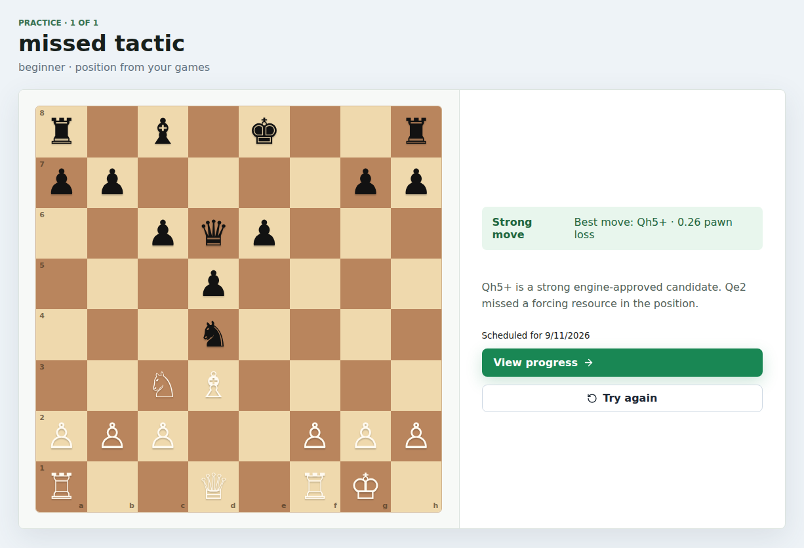
  <figcaption>Chess Coach practice screen with a Stockfish-backed move recommendation and a scheduled retry</figcaption>
</figure>

Leo's first version was a chess-coach chat, and he found it useless. [Chess Coach Agent](https://github.com/leo-cabibihan/chess-coach-agent) starts from your real games instead. You import Lichess, Chess.com, or a PGN file. The app finds weak moments, explains them, and drills those positions.

Stockfish is the canonical engine for chess claims, and the LLM writes practice copy. It doesn't invent engine scores. Leo imported about 2,700 of his own Lichess games for the demo. He tried to reverse-engineer Lichess-style annotations so the notes feel like the site players already know.

The stack includes FastAPI, React, Postgres with pgvector, and PydanticAI. It also uses Stockfish, BM25 lessons, Logfire, and a [Render deploy](https://chess-coach-agent.onrender.com/). Practice uses spaced repetition at 1, 3, and 7 days, doubling up to 30. If there's no API key, deterministic templates still run. CI uses a TestModel so tests stay offline.

[Leo's LinkedIn](https://www.linkedin.com/in/leo-cabibihan/)

### 4) Document Preparation Agent by Paulien Out

<figure>
  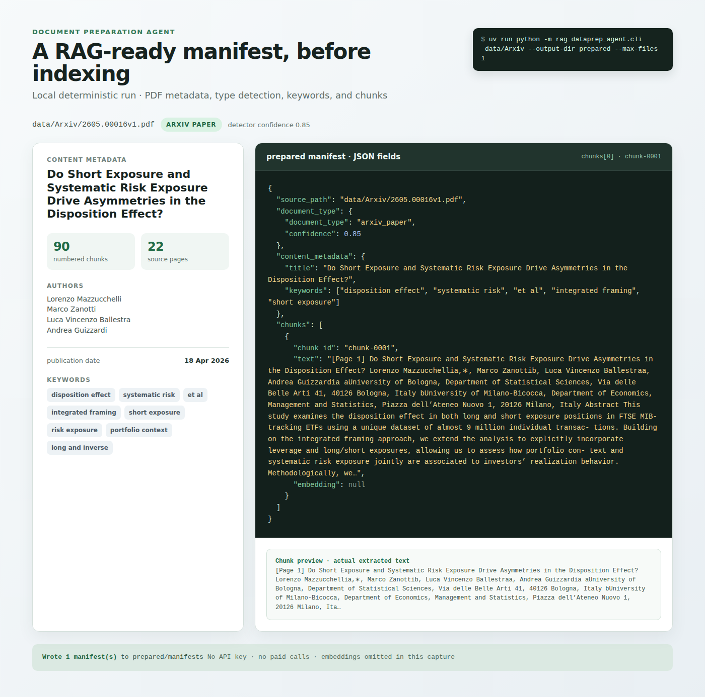
  <figcaption>Document Preparation Agent manifest with extracted authors, keywords, document type, and numbered chunks</figcaption>
</figure>

Paulien (with Elena, who couldn't join the call) builds on-premise AI systems. Customers say RAG is fine, but they want filters such as "only the latest document" or "only files written by person X". [Document Preparation Agent](https://github.com/PaulienOut/rag-dataprep-agent) writes that metadata before anything is indexed.

They couldn't share customer files, so they used public arXiv papers, manuals, and EU documents. v1 is PDFs only, and there's no UI. You run a CLI and get JSON manifests. Each manifest has author and document type, plus a summary, keywords, and numbered chunks.

Some fields never need a model, because a last-edited date is always required, so the pipeline calls tools in a fixed order. Keyword extraction is better with an LLM, so that call is optional. On a 14-document eval set, `gpt-4o-mini` lifted keyword F1 from 0.097 (local heuristics) to 0.582. Gold JSON was written by people, not generated by a model.

The demo is English, and their company is mostly Japanese, with the European side mostly German. Paulien isn't a German speaker, so English was easier for the demo. Multilingual support is the next real requirement. PII removal is still on the list.

[Paulien's LinkedIn](https://www.linkedin.com/in/paulien-out-023a708/)

### 5) Research Radar by Hana Ben Ali

<figure>
  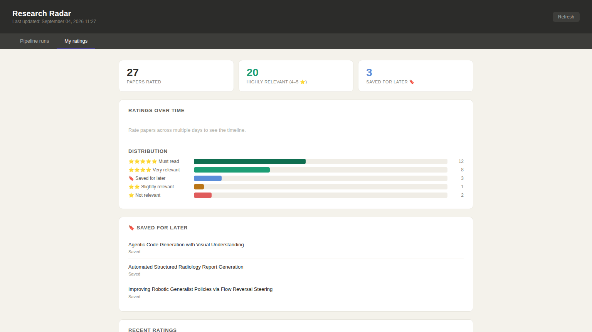
  <figcaption>Research Radar dashboard showing star-rating distribution and papers saved for later</figcaption>
</figure>

Hana is a structural engineer and a PhD student. [Research Radar](https://github.com/55382/Research_Radar_agent_phd_assistant) fetches about 100 new arXiv papers every morning and emails the ones that match her research.

The interest profile comes from papers she has already rated. Stage 1 does semantic search with cosine similarity and an author boost, then keeps the top 15. Stage 2 is an LLM ranker. The top 5 go out by email through Resend. Stars from the email write back to `ground_truth_papers.csv`, which is both the knowledge base and the eval set.

She started from 26 papers she had rated herself. After tuning a 0.6 semantic / 0.4 LLM blend, NDCG@5 (a ranking metric that rewards putting the right papers first) went from 0.871 to 0.923. A Streamlit dashboard shows timestamps, average score, and ratings over time. The hard part, she said, was making the ranker get better each morning.

[Hana's LinkedIn](https://www.linkedin.com/in/hana-ben-ali-357b1a18b)

The other submissions weren't presented live, and they're in the same [project list](https://courses.datatalks.club/ai-buildcamp-3/projects). Lars was on the call, but he had already left when I asked if he wanted to demo.

### 6) AI Diet Coach by Thet Su Win

<figure>
  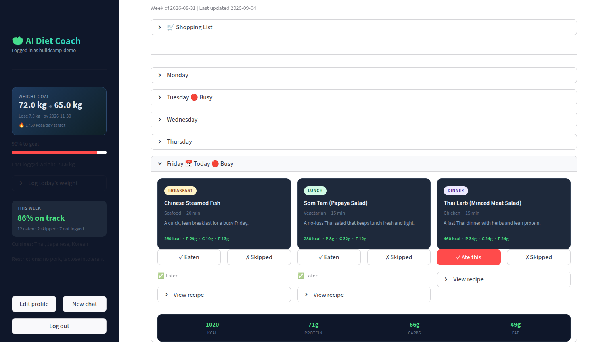
  <figcaption>AI Diet Coach weekly plan with Southeast Asian meals, tracking state, and nutrition totals</figcaption>
</figure>

[AI Diet Coach](https://github.com/thetsuwin66/ai-diet-coach-agent) is a meal planner for Southeast Asian users, a group most Western diet apps ignore. You set goals, restrictions, cuisines, and location. The agent builds a 7-day plan from 256 recipes, 201 from TheMealDB and 55 Asian dishes added by Thet Su Win. It tracks meals and weight, swaps meals, and builds a shopping list.

It also looks up USDA nutrition data and suggests nearby restaurants through Google Maps, and the live app is on [Streamlit](https://ai-diet-coach-agent-htbjcoo2pylrfhdyv2cjbm.streamlit.app/).

Recipe search stayed on TF-IDF instead of embeddings. Hit@3 was 67% vs 80% for embeddings, but TF-IDF was 42 times faster (4.8ms vs 200ms). It costs nothing and still works if OpenAI is down.

A judge went through four versions on 88 labeled answers, and accuracy moved from 46.6% to 73.9%. Traces export back into eval with `make traces-to-eval`.

[Thet Su Win's LinkedIn](https://sg.linkedin.com/in/thet-su-win-169221172)

### 7) AI Learning OS by Wesley Tan

<figure>
  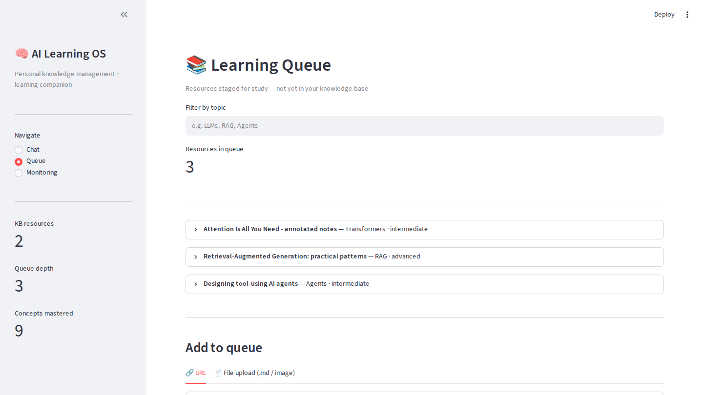
  <figcaption>AI Learning OS queue of staged resources, with knowledge-base and progress counts in the sidebar</figcaption>
</figure>

Wesley's [AI Learning OS](https://github.com/wesleytanjiale/ai-learning-os) is a copilot for the watch-later graveyard. You queue YouTube videos, articles, markdown, and images. After a learning walkthrough, the system writes only what you actually studied into a knowledge base. Chat search cites that base and reports progress.

The agent has six tools.

- Add to queue
- Browse queue
- Load for learning
- Consolidate to the knowledge base
- Search
- Get progress

Retrieval is hybrid BM25 plus dense vectors with reciprocal rank fusion. A 400-word chunk size with 5 results scored 15/15 on the tuning set. 600-word chunks with 7 results scored 12/15. An empty-knowledge-base test checks that the agent doesn't invent content.

[Wesley's LinkedIn](https://sg.linkedin.com/in/wesley-tan-jia-le-b31871219)

### 8) Applied ML Teaching Copilot by Marco Teran

<figure>
  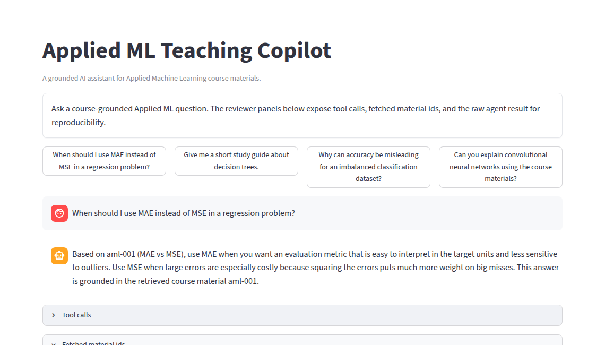
  <figcaption>Applied ML Teaching Copilot answer grounded in course material aml-001, with the tool-call panel below</figcaption>
</figure>

Marco's [Applied ML Teaching Copilot](https://github.com/marcoteran/applied-ml-teaching-copilot) answers from Applied ML course materials and refuses when the materials aren't enough. You can search, fetch a record by id such as `aml-001`, and get citations. A CNN question is the intended out-of-scope case.

The stack is Streamlit and OpenAI, plus minsearch, Pydantic, and Logfire. There's a [Streamlit demo](https://applied-ml-teaching-copilot.streamlit.app/).

The first judge scored 0.727 accuracy. An "improved" judge dropped to 0.576 because it punished correct "I don't know" answers on CNNs. The calibrated judge reached 1.0 on 33 labeled cases. The knowledge base is still small, and Marco notes that retrieval methods weren't compared.

[Marco's LinkedIn](https://www.linkedin.com/in/marcoteran)

### 9) Datawarehouse Agent by Lars van Asseldonk

<figure>
  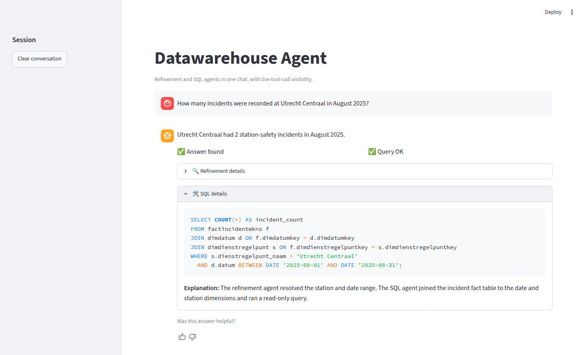
  <figcaption>Datawarehouse Agent answer with success flags and the read-only SQL used for the incident count</figcaption>
</figure>

Lars's [Datawarehouse Agent](https://github.com/larsvasseldonk/datawarehouse_agent) is a natural-language-to-SQL assistant over Dutch Railways (NS) station-safety incidents. Non-technical staff ask a question and get a plain-language answer plus the SQL. Incidents live in a DuckDB star schema seeded locally.

A refinement agent catches ambiguity, out-of-scope requests, and adversarial prompts such as "drop all tables". A SQL agent then reads metadata and runs a read-only query. Answers come back with trust flags. There are separate LLM judges for refinement and SQL, plus a human labeling script.

Lars used PydanticAI, OpenAI, DuckDB, and Streamlit. He also used Logfire, minsearch, and Plotly, and he recorded a [demo video](https://github.com/user-attachments/assets/9534b98f-0aab-442b-97e7-491813ba3e81).

### 10) WorkerChronicle by Miki Foster

<figure>
  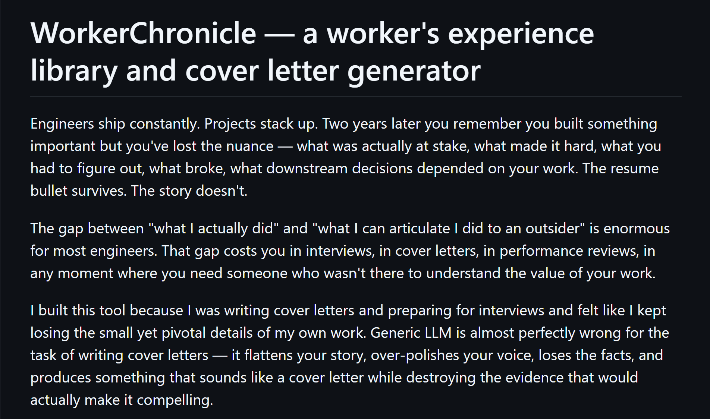
  <figcaption>WorkerChronicle's experience library and cover-letter generator</figcaption>
</figure>

Miki's [WorkerChronicle](https://github.com/MikiYamFos/work-chronicle) builds a personal work-experience library in your own words, then writes cover letters, blurbs, and interview briefs from that library. Generic LLM polish flattens the story, and that's what this pipeline is built to stop.

Markdown goes into SQLite, and the pipeline extracts claim-evidence pairs and judges them. It calibrates against gold examples: at least 5 approved and 5 rejected, with target recall of 89% and accuracy of 80%. You edit an outline before generation.

Checks include banned phrases, a 20% source-word overlap rule, and no em-dashes. Mistral is an option for GDPR and EU use.

[Miki's LinkedIn](https://www.linkedin.com/in/mikifoster)

### 11) Multi-Agent Software Development Platform by Nitesh Mishra

<figure>
  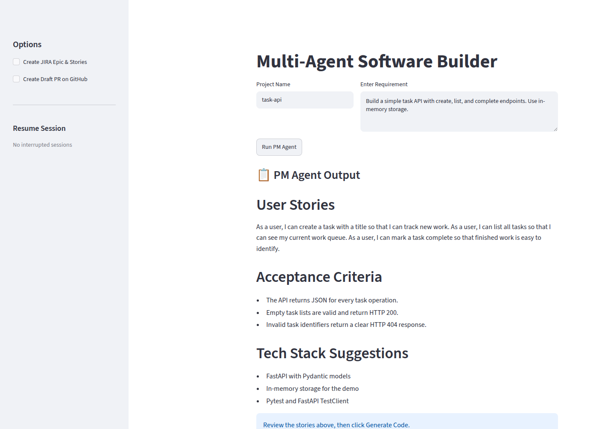
  <figcaption>Multi-Agent Software Builder after the PM stage, with user stories and acceptance criteria awaiting review</figcaption>
</figure>

Nitesh's [Multi-Agent Software Development Platform](https://github.com/mishranitesh/AI_Engineering_Buildcamp_From_RAG_to_Agents/tree/main/capstone/multi-agent-dev-platform) turns a plain-English requirement into user stories, architecture, and backend code. It also writes tests, runs review, and can AutoFix. It can open a GitHub PR and create JIRA epics.

The agents run in this order.

- PM agent
- Human confirm
- Architect
- Developer with RAG
- QA
- Review with RAG
- Artifacts

A person confirms the plan before code generation. Semantic search in ChromaDB beat keyword retrieval on paraphrase queries (Precision@3 100% vs 40%). Eval found the Developer agent was the weakest, and `n_results=3` with `gpt-4.1` scored better than `n_results=1` or `gpt-4o-mini`.

[Nitesh's LinkedIn](https://www.linkedin.com/in/mishra-nitesh)

### 12) LearnMate AI by Dianne Bronola

<figure>
  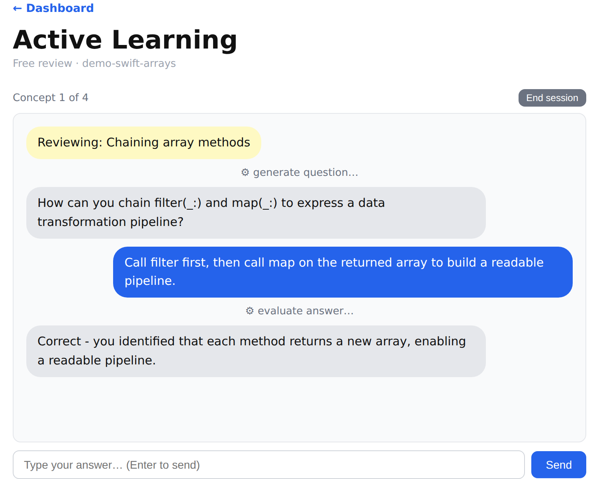
  <figcaption>LearnMate active review session with a generated question, student answer, and evaluated feedback</figcaption>
</figure>

Dianne's [LearnMate AI](https://github.com/dinobronx/learnmate-ai) turns a YouTube lesson into spaced-repetition review. Ingest builds a concept map, and a review agent quizzes you. Separate judges grade answers and code, and mastery decays so fading concepts come back.

Dianne put the due-concept logic, question order, mastery math, and session caps in code. The agent handles the review conversation. She designed it for `gpt-4o-mini`. A cosine match threshold of 0.65 scored 8/8 on an 8-query sweep. Judge calibration on 35-row CSVs came out at 85.7% for answers, 85.7% for code, and 74.3% for session conduct.

### 13) GapFinder by Katja Weber

<figure>
  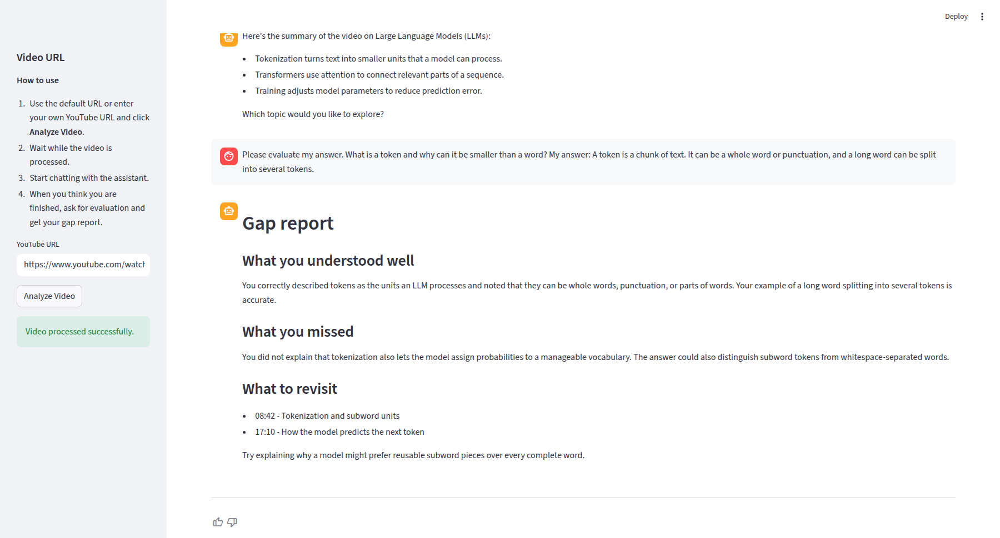
  <figcaption>GapFinder report separating understood concepts from missed concepts and listing timestamps to revisit</figcaption>
</figure>

Katja's [GapFinder](https://github.com/katjaweb/gapfinder) is a study tool for long YouTube tutorials. It fetches the transcript, chunks it, and asks diagnostic questions. Then it grades your answers against the video and reports what you understood vs what you missed, plus the sections to rewatch.

The agent tools are `get_video_id`, `get_summary`, `search_video_transcript`, and `evaluate_user_answer`. The stack is PydanticAI and OpenAI, plus Streamlit, Logfire, and minsearch.

Eval scenarios in `evals/scenarios.csv` were generated with an LLM. Then they were labeled in a human UI and compared with an LLM judge.

[Katja's LinkedIn](https://www.linkedin.com/in/katjaweber/)

I'm happy to see these projects.

The next cohort of the [AI Engineering Bootcamp](https://maven.com/alexey-grigorev/from-rag-to-agents) starts at the end of September. If you want to build a system like these, join there.
