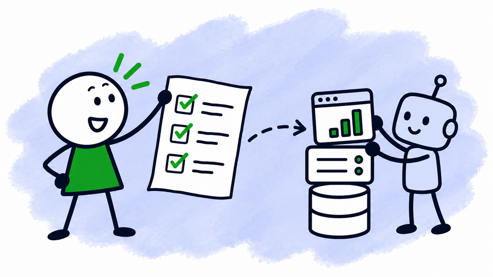
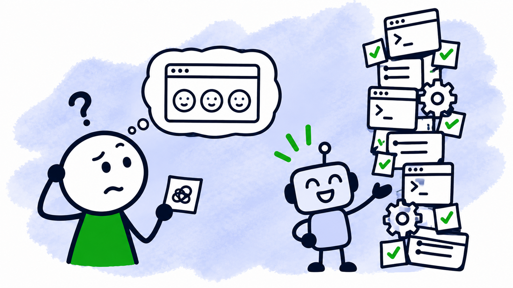
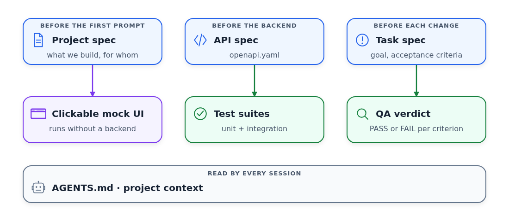
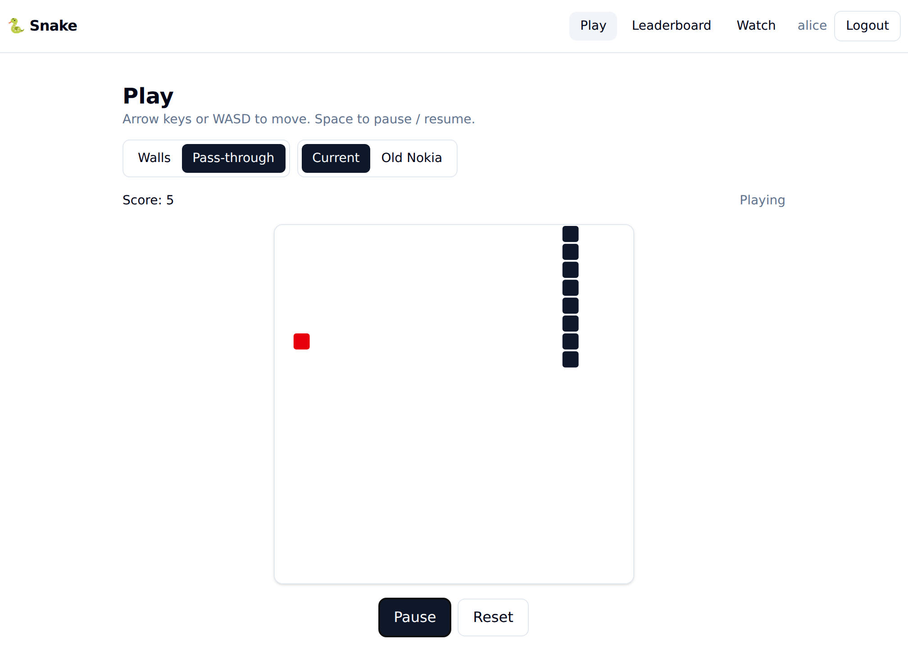
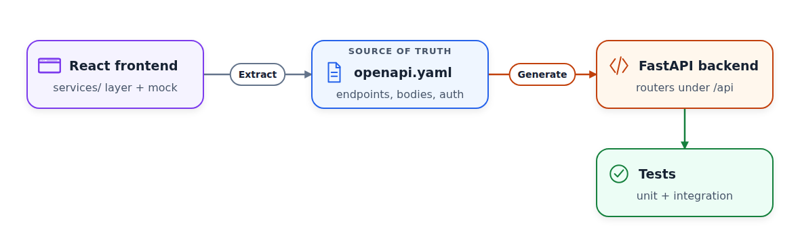
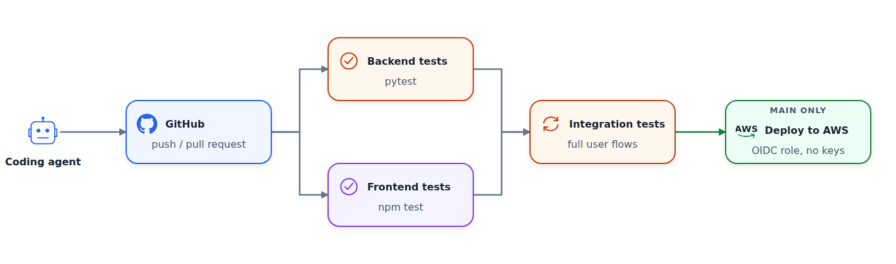

# Specs First: Building a Full-Stack App with AI Coding Agents

<!-- Guest article for devmio (Stephane Fernandes, Software & Support Media). Target: 15,000-20,000 characters. Due before the end of October 2026, ahead of the November session in Berlin. -->

<figure>
  
</figure>

Coding agents now write code faster than anyone can read it. So we spend less time typing code and more time saying precisely what we want and checking what came back.

When our request is vague, a strong agent doesn't fail. It misunderstands the task, creates eight files, wires them together, and adds tests that pass.

I once gave Claude Code a single line: "a tool for weekly feedback for projects". It built a command-line tool with documentation and 62 passing tests. What I wanted was a web tool for team retrospectives. Everything I didn't say, the agent filled in with its own assumptions.

<figure>
  
  <figcaption>Whatever a one-line request leaves out, the agent fills in with its own assumptions.</figcaption>
</figure>

We can solve this the old-fashioned way: write the specification first and let the code follow from it.

## Three Levels of Specification

"Spec-driven development" can sound like long requirement documents. In practice, it's a small set of written agreements.

Each agreement works at a different level:

- A project specification describes what we build and for whom. It exists before the first prompt.
- An API specification describes how the parts talk to each other. In a web app, that's an OpenAPI file.
- A task specification describes one change: its goal, the acceptance criteria that decide when it's done, what's out of scope, and the constraints.

Each specification also needs something that checks the code against it. Without that check, we only hope the code matches the spec.

<figure>
  
  <figcaption>Each specification has its own check. AGENTS.md gives every agent session the same project context.</figcaption>
</figure>

## The Example Application

I teach this approach in a one-day [full-stack workshop](https://aishippinglabs.com/workshops/full-stack-vibe-coding) at AI Shipping Labs, which is also a module of the free [AI Dev Tools Zoomcamp](https://datatalks.club/blog/ai-dev-tools-zoomcamp.html).

In the workshop, we build and deploy a multi-user Snake game, and a coding assistant writes almost all of the code.

The game has two modes. In walls mode you die when you hit a wall. In pass-through mode the snake wraps around the edges. There's a leaderboard per mode, a page to watch other players' active games, and login and signup.

<figure>
  
  <figcaption>The play page of the finished game.</figcaption>
</figure>

We use an ordinary stack. We generate the React frontend with Lovable, write the backend in FastAPI, and use SQLAlchemy with SQLite or Postgres. For deployment, we use Docker, AWS, and GitHub Actions. The finished code is in the [snake-royale repository](https://github.com/alexeygrigorev/snake-royale). I use Codex in the workshop, but the prompts are plain English and work the same way in Claude Code, Copilot, or Cursor.

## The Project Spec and a Frontend You Can Click

When I only have a rough idea, I don't start in the coding assistant. I talk it through with a chat assistant. I ask it to question me one point at a time about the users and what they need. At the end, it saves the decisions into `_docs/plan.md` in the repository.

For the Snake game, the requirements were already clear, so they went straight into the prompt for the frontend. We start with the frontend so we can click through the game before any backend exists. This is how we check the project spec: if a screen is missing or wrong, we see it in minutes.

In the workshop we use [Lovable](https://lovable.dev/), which generates a complete React app from one prompt. On a free account you don't get many chances to correct the result.

That's why the prompt has to be specific:

```text
Create an interactive Snake game with two modes:

- walls (you die hitting a wall)
- pass-through (you wrap around the edges)

Make it multi-user.

Add

- a leaderboard showing top scores per mode
- a page to watch other players' active games
- login and signup screens

Centralize every backend call in one services layer, and create a mock
implementation of it so the whole app runs without a real backend.

Add tests.
```

In the second half of the prompt, we ask Lovable to put every backend call in one services layer and to add a mock backend. With the mock, we can run the app locally before any backend code exists.

## Project Context in AGENTS.md

Each new agent session starts with no memory of the project, so the agent guesses at our tools. For example, it may use pip instead of `uv`.

We fix this with an `AGENTS.md` at the repository root, because Codex and most other assistants read it at startup.

We start with a few lines about `uv` and committing often:

```text
for backend, use uv for dependency management. a few useful commands:

uv sync
uv add <PACKAGE-NAME>
uv run python <PYTHON-FILE>

regularly commit code to git
```

Every time the assistant repeats a mistake, we add a line to this file.

## The API as a Specification

Before building the backend, we write down the API specification. The services layer already lists every call the UI makes, so we treat those calls as requirements.

We point the assistant at the client code:

```text
Read the frontend's API client in frontend/

Create openapi.yaml at the repo root that specifies the backend this frontend
expects: every endpoint, method, path, request body, response body, and which
endpoints need authentication
```

In my run, the endpoints looked like this:

```text
POST /auth/signup     create an account, return a token       (201)
POST /auth/login      log in, return a token
GET  /auth/me         the current user                        (auth)
POST /auth/logout     log out                                 (auth)
GET  /leaderboard     top scores, filterable by mode + limit
POST /leaderboard     submit a score                          (auth, 201)
GET  /games/active    active games to spectate
```

<figure>
  
  <figcaption>We extract openapi.yaml from the frontend, then generate the backend from it.</figcaption>
</figure>

## Generating the Backend from the Spec

With the spec in place, we can keep the backend prompt short:

```text
Build a FastAPI backend in backend/ that implements the openapi.yaml spec

Use an in-memory store for now (no database yet) and seed it
with a few fake users, scores, and active games so the frontend has something
to show

Add authentication with hashed passwords and bearer tokens for the
endpoints that need it

Write tests
```

We start with an in-memory store on purpose. First we want a working connection between the frontend and the backend, without a database in the way.

## Connecting the Frontend to the Backend

Next, we switch the frontend from the mock to the real backend:

```text
Switch the frontend to use the real backend client
```

Because every call goes through the services layer, the assistant only needs to change one file.

## Adding a Database

The app now works end to end, so it's time we connect a real database.

We ask the assistant to do it:

```text
Replace the in-memory store with a database. Use SQLite and SQLAlchemy

Use an environment variable to configure which DB the server should connect to make it database-agnostic - later we will add support for other databases (e.g. postgres)
```

Now we have a database and can test that it works by turning off the application and turning it on again.

## Tests as Acceptance Criteria That Run

Integration tests check the application as a whole. They start the backend with a real database and send HTTP requests the way the frontend does. Then they check that the data from one request is still there in the next one.

Now we add them:

```text
Add integration tests in a tests_integration/ folder that run against a
temporary SQLite database

They should exercise full flows over HTTP:

- sign up a new user
- log in and get a bearer token
- submit a score of 42 in walls mode with POST /leaderboard and the token
- GET /leaderboard?mode=walls and check that the score of 42 is there
- submit a score without a token and check that it fails with 401
```

Each flow describes something a user must be able to do. If there's a change that breaks it, we'll find out quickly.


## Deployment

The application is tested and works end-to-end. Now it's time to deploy it.

There are many ways of doing it, but we'll use AWS. 

```text
Create a CloudFormation template that deploys this app to AWS
```


## CI/CD

While we set up the infrastructure, the assistant had access to our AWS account. Now we need to make sure it no longer has access to production.

If your agent has access to the production environment, unexpected things can happen. I once accidentally let an agent run `terraform destroy` which removed the database behind the DataTalks.Club course platform. I tell the full story in [How I Dropped Our Production Database](https://aishippingblog.com/p/how-i-dropped-our-production-database). If the agent didn't have access to production, this would never have happened. 

So, instead of letting the agent deploy using our AWS credentials, we deploy through CI/CD:

```text
Create a GitHub Actions workflow.

- first run frontend and backend tests in parallel
- then backend integration tests
- then deploy

For deployment, authenticate with OIDC - don't create a user.
```

The integration tests wait for both test jobs, and the deploy runs only after them, only on `main`. With OIDC, there's no long-lived AWS key in the repository. Once the pipeline works, we delete the access key the assistant used during setup.

<figure>
  
  <figcaption>The coding agent has no AWS credentials. Its only way to production goes through GitHub and the tests.</figcaption>
</figure>

The app runs on AWS now, and we can safely redeploy it on every change. The agent pushes code to GitHub, and only the pipeline can deploy it, after all the tests pass.

## Next steps

We built the first version with one assistant and one prompt at a time. As the codebase grows, this stops working. The assistant forgets earlier decisions, skips tests, and calls work done too early.

From here, we specify every change before anyone builds it. We break the project specification into a backlog of small tasks.

Before implementation, we describe each task with:

- a goal
- acceptance criteria that decide when it's done
- what's out of scope
- constraints

We call this step grooming, and it catches a misunderstanding while fixing it still takes one sentence. Then one agent implements the task, and a separate agent checks every acceptance criterion against the running code.

I describe this workflow in [AI-Native Development: Specifications, Loop and Graph Engineering](https://aishippingblog.com/p/ai-native-development-specifications). There I turn a vague idea into a specification and give agents the right context. Then a product manager agent, an engineer agent, and a QA agent work through the backlog together.

The deployment also needs more work before real users depend on it. We need separate development and production environments, so that we promote the exact version we tested in development. We also need metrics, traces, and logs, plus an alert when users see a failure. I cover this in [DevOps and Observability for an AI-Built App](https://aishippingblog.com/p/devops-and-observability-for-an-ai), where an AI agent also acts as the first responder when an alert fires.

## Learning More

You can find the complete workshop with every prompt in the [AI Shipping Labs workshop library](https://aishippinglabs.com/workshops). There you'll also find the Docker, deployment, and CI/CD parts in full detail.

The same material is part of [AI Dev Tools Zoomcamp](https://datatalks.club/blog/ai-dev-tools-zoomcamp.html), a free course from [DataTalks.Club](https://datatalks.club/). In the course, we cover AI coding tools from specifications to deployment and observability.
