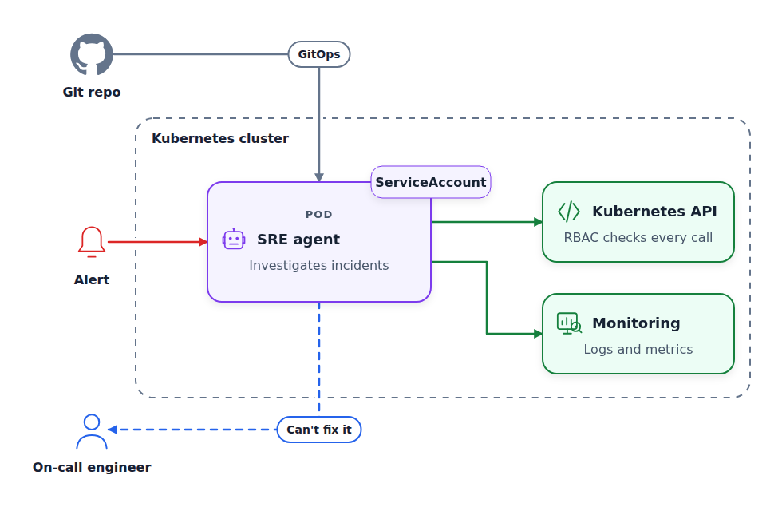
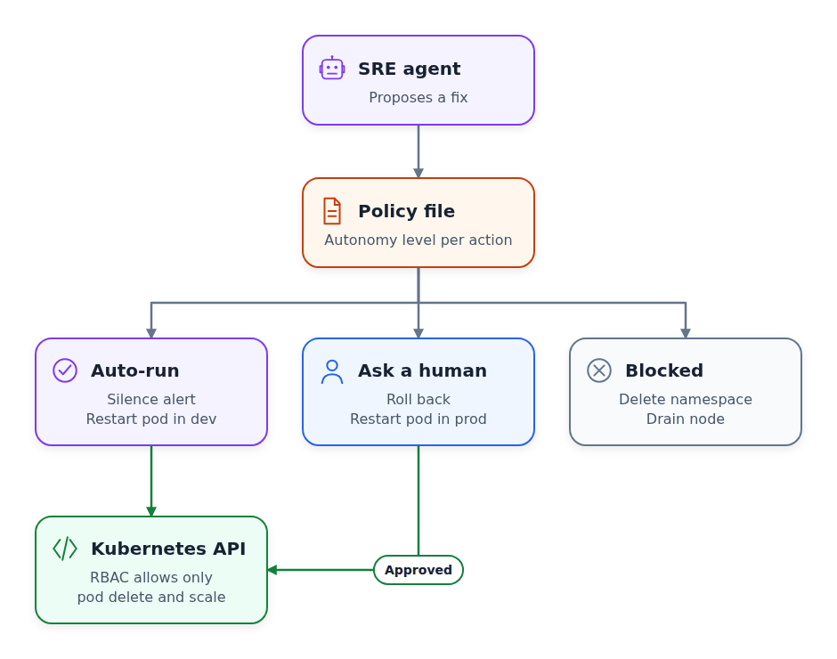
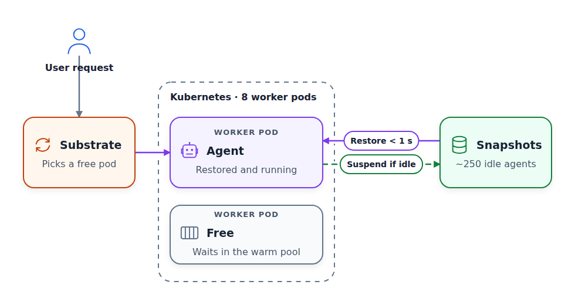
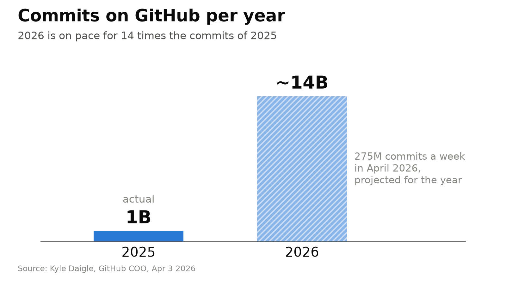

# AI Agents Can Do Everything Now. Do We Still Need Kubernetes?

AI agents write code, trigger deployments, watch dashboards, and handle on-call problems. Should we still care about Kubernetes? Yes, we should.

The agents need a place to run. They need:

- Compute
- GPUs
- Networking
- Access to data
- A way to scale

And when something fails, they need to recover.

Kubernetes is the layer that coordinates all of that.

https://youtu.be/uBpXLrpc3IY

Next Thursday, October 15, is Kubernetes Automation Day Berlin. Several of its talks answer exactly this question.

In this article, I go through the talks I find most interesting. They show why Kubernetes is still relevant and why we should care about it.

## An Agent on a Laptop Isn't Production

Giant Swarm, a company that builds and runs Kubernetes platforms for enterprises, built an SRE agent that helps them handle real incidents. At first, it ran on the laptop of the engineer who built it.

When an alert fired at 3 AM, a human still had to wake up just to watch the agent work.

They moved this agent to Kubernetes, so now it runs in the background, reacts to alerts on its own, and wakes an engineer only when it can't fix the incident.

In his talk, Dominik Schmidle from Giant Swarm will describe how they did it.

<figure>
  
  <figcaption>Once the agent runs in the cluster, it gets an identity, a reviewed deploy path from Git, and monitoring</figcaption>
</figure>

## The Night Ops

Mehul Patel from BuildingMinds tackles the same problem. He'll talk about an autonomous SRE agent that he built with Google's ADK. It has two components: an agent for triage and an agent for investigation.

But you don't want to let the agent have unlimited access to the production environment. [Bad things can happen](https://aishippingblog.com/p/how-i-dropped-our-production-database) when you do that. Instead, you need guardrails that stop the agent when it tries to do something wrong.

In the talk, Mehul will present his open-source project [TheNightOps](https://github.com/nomadicmehul/TheNightOps) and show what these guardrails can look like. In this case, it's a policy file that describes which actions the agent may take on its own.

<figure>
  
  <figcaption>The policy file decides who acts, and the API server enforces RBAC whatever the prompt says</figcaption>
</figure>

## Agents Aren't Microservices

Abdel Sghiouar from Google Cloud will talk about deploying agents.

For anyone who knows a bit of Kubernetes, the first idea is to give each agent its own pod. That's what we usually do with microservices.

> If you don't know what a pod is and want to learn more about Kubernetes, I teach it in [Machine Learning Zoomcamp Module 10](https://github.com/DataTalksClub/machine-learning-zoomcamp/tree/main/10-kubernetes).

But agents aren't microservices. An agent runs in a pod for a task, and it can spawn multiple subagents along the way. Then it can sit idle for a while, waiting for the subagents to finish.

Agents can spend up to 90% of their time idle, so giving each agent a dedicated pod may waste resources. It also hits scale limits.

In the talk, Abdel describes [Agent Substrate](https://github.com/agent-substrate/substrate) - an open-source system that separates the agent session from the pod it runs on. With it, you can host many agents on very few pods.

<figure>
  
  <figcaption>Idle agents wait as snapshots, so about 250 agents share eight worker pods</figcaption>
</figure>

## Agents Ship More Code to Production

We all know that agents produce a lot of code.

GitHub's COO Kyle Daigle [shared the numbers](https://x.com/kdaigle/status/2040164759836778878) in April. There were 1 billion commits on GitHub in 2025. For 2026, they're on pace for 14 billion.

<figure>
  
  <figcaption>2026 is on pace for 14 times the commits of 2025, and all of that code needs somewhere to run</figcaption>
</figure>

We're drowning in code. I also contribute to it by teaching agentic engineering in [AI Dev Tools Zoomcamp](https://github.com/DataTalksClub/ai-dev-tools-zoomcamp).

Adi Shacham-Shavit, who leads the platform team at Enpal, will open the event with a keynote about it: someone has to run, secure, and scale the flood of "vibe-coded" software.

From her abstract:

> We used to teach engineers how the infrastructure worked. Now platform teams design for people and agents who have no idea what production looks like.

The barrier to entry is much lower in 2026, but we still need to follow good engineering practices. Platforms can help with that.

## KubeAuto Day Berlin

If you're in Berlin, come to [Kubernetes Automation Day Berlin](https://kubeauto.day/berlin?utm_source=substack&utm_medium=newsletter&utm_campaign=kubeauto_day_berlin_2026&utm_content=article) on Thursday, October 15. There will be these and many other talks:

- building Kubernetes operators
- attacking misconfigured clusters
- optimizing workloads
- a panel on DevOps and platform engineering in the AI world

It's a free community event at Alte Turnhalle in Friedrichshain, from 3:30 PM to 10 PM, with 200+ attendees.

Tickets are limited, so [register here](https://kubeauto.day/berlin?utm_source=substack&utm_medium=newsletter&utm_campaign=kubeauto_day_berlin_2026&utm_content=article).

If you're not in Berlin, there are KubeAuto Days in Paris, Salt Lake City, and Las Vegas. Tel Aviv and São Paulo come next year. The full list is on [kubeauto.day](https://kubeauto.day/).

This post is made in collaboration with KubeAuto Day Berlin. Thank you for supporting our community!