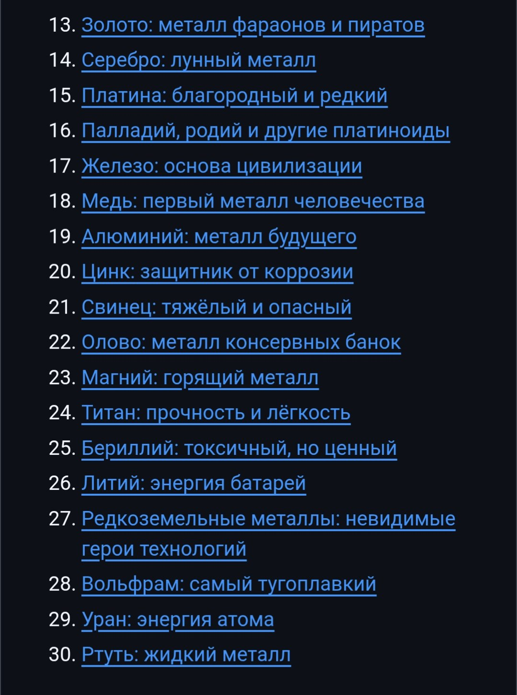
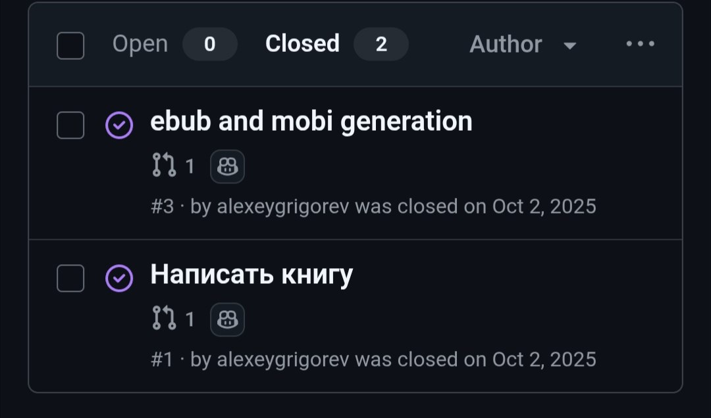
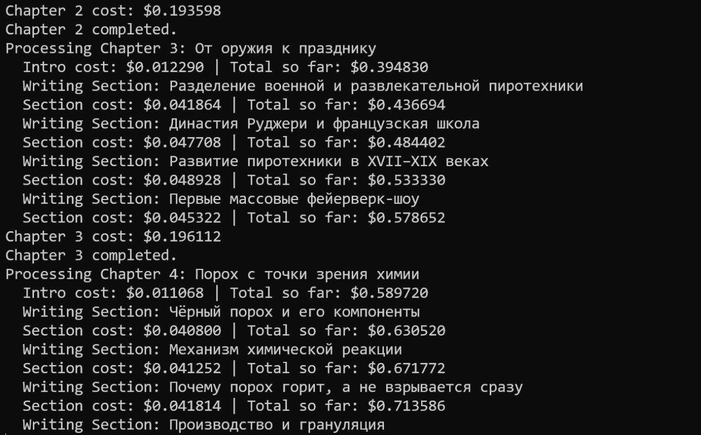
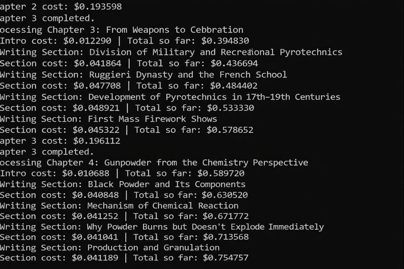
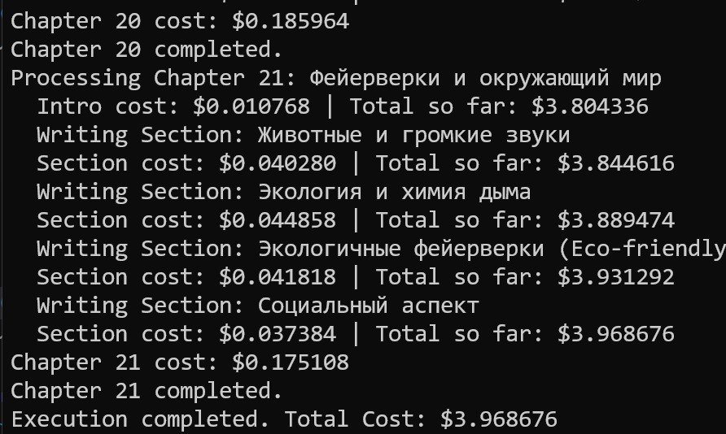

# Generating Books with AI

Using AI to generate complete books with text, covers, audio, and multiple output formats (EPUB, PDF). Source code: [github.com/alexeygrigorev/ai-book-generator](https://github.com/alexeygrigorev/ai-book-generator)

## Backstory: How This Started

My child has very specific interests and very specific information requests. He wants books about narrow topics that simply don't exist - especially not as children's books, because the audience for them is essentially one person[^1][^7].

### The first request: a book about metals

The first request was a book about metals - what metals are, what they do, but only the specific ones he cared about. His list was palladium, tin, magnesium, titanium, beryllium, lithium, tungsten. He told me what properties he wanted described and how they're used. We couldn't find a book like that, and he said this is what he wanted to listen to at bedtime[^7][^8].

I tried doing it through ChatGPT directly. We talked, agreed on a plan, and tried to generate the book. ChatGPT produced a table of contents, we iterated on it, and then I asked it to write the first chapter. The result was very bad. ChatGPT alone didn't work for this[^1].

Then I thought about coding agents. They're good at planning - they make a plan and then execute against it. What if I use ChatGPT only as a table-of-contents generator, then hand that outline to a coding agent to actually write the book? That's my normal approach to building applications: iterate with ChatGPT to figure out what I want, then delegate the implementation to a coding agent. Same thing should work for a book[^2].

### Iterating with coding agents on the metals book

My son and I sat together with ChatGPT and built up the outline for the metals book - one chapter per metal, with the properties and uses he wanted covered. I read it back to him, we adjusted, and once he approved I handed it to the coding agent[^2].

The first version was rough. Instead of writing prose, the agent wrote bullet points. My guess is that coding agents are tuned more for documentation than for narrative writing. So I tightened the prompt: clearer instructions, explicitly asking for normal prose. I worked through this the same way I described in my piece about coding from the tram stop - create a GitHub issue, let the agent work on it, review the result, create the next issue[^2].

The other problem was that the agent didn't finish what I asked for. If I said "this isn't the style I want, please rewrite the whole book in proper prose," it would rewrite the first five chapters and then say "okay, I'm tired, I'll stop here." I had to fight with that to get it to finish the whole book[^2].

In parallel I asked the agent to set up automation. I wanted to publish the book as a website I could read from in the browser, and on top of that I wanted EPUB output. The website came first; EPUB was added later just because it was interesting[^22]. That part worked well. The metals book ended up needing a fair bit of hand-holding to land in the format I wanted, but my child liked it[^3].

<figure>
  
  <figcaption>Part of the table of contents of the metals book - one chapter per metal, with descriptive subtitles like "gold: metal of pharaohs and pirates" or "tungsten: the highest melting point"</figcaption>
  <!-- The book covers both the metals my son specifically asked for and others ChatGPT suggested adding for completeness -->
</figure>

The published book lives at [alexeygrigorev.com/little-book-of-metals-ru](https://alexeygrigorev.com/little-book-of-metals-ru/) [^23]. Source code: [github.com/alexeygrigorev/little-book-of-metals-ru](https://github.com/alexeygrigorev/little-book-of-metals-ru) [^4].

### Second book: gallium and potassium alloys

Halfway through the metals book, my son said he was actually only interested in two of them. He wanted to read about potassium and gallium and specifically about their alloy, because the alloy has unusual properties. So we made a separate book about that[^3].

By that point I roughly understood how this had to work, and I put what I wanted directly into the first prompt. The book came out well from the first attempt - the experience from the metals book paid off immediately[^3].

The whole project lives in just two GitHub issues: [one to write the book](https://github.com/alexeygrigorev/gallium-kalium-book-ru/issues/1), one to add EPUB and MOBI publishing[^5][^6].

<figure>
  
  <figcaption>The two closed issues in the gallium-kalium book repository - "Написать книгу" (write the book) and "ebub and mobi generation"</figcaption>
  <!-- The whole second book was scoped as two GitHub issues handed to a coding agent -->
</figure>

Source code: [github.com/alexeygrigorev/gallium-kalium-book-ru](https://github.com/alexeygrigorev/gallium-kalium-book-ru) [^9]

### Third book: conifers

Then one day my son came home from school. They had been studying conifers in natural science class and he wanted to learn more. We read a lot about it through ChatGPT, and then he asked for a book. By that point the workflow was on rails: discuss with ChatGPT, build a plan, [create an issue in GitHub](https://github.com/alexeygrigorev/conifers-book-ru/issues/1), let Copilot work on it, get a book[^10][^11].

Source code: [github.com/alexeygrigorev/conifers-book-ru](https://github.com/alexeygrigorev/conifers-book-ru) [^12].

### Building a specialized book agent

After the third book I started thinking Copilot wasn't the right tool for this. Around the same time a new Gemini model came out, and I wanted to compare GPT, Anthropic, and Gemini on book writing[^11].

I had two reasons to build a dedicated program instead of using a coding agent:

1. A use case for participants in my course - showing how to build a specialized agent system rather than reaching for a general-purpose coding agent.
2. A suspicion that coding agents are tuned for code, not for books, and that a specialized agent would produce better text.

I built it and experimented. My evaluation method was deliberately informal: I read the text and picked the version I liked best. No formal eval framework - I'm the one reading these books with my child, so vibes-based eval was good enough. After the experiments, Gemini came out on top[^11].

The hypothesis - that a specialized book agent would beat a general coding agent - turned out to be right, at least anecdotally. The text from the specialized agent was better than what the coding agents produced[^11].

The workflow settled into the same plan-then-execute pattern I use for code, and that I teach in my course:

1. You iterate in a chat interface to define what the book should be about, until the table of contents is right. Always plan before you write, same as code.
2. The chat output is converted into a structured plan - a large YAML document with chapters, sections, and bullet points for each.
3. A simple `for chapter in plan: generate_chapter(...)` loop runs over the plan. Each chapter call gets context about what came before, but in a compressed form rather than the full prior text.

I show the same pattern in the course for coding agents: build a plan first, then loop `for step in plan: perform(step)`. It works well in practice on both sides[^11].

### Many books since

With the new approach we've generated quite a few books. I started by re-doing the metals book on the new system - I didn't actually need it, I just wanted to put the pipeline through its paces[^13].

Then more requests came in:

1. A book about sirens - the things that make warning sounds. He wanted very specific types of sirens, a topic where there's almost nothing online aimed at children[^13].
2. A book about fireworks - around New Year, when he got curious about how fireworks actually work[^13].
3. A book about trains, planes, ships, and other mechanisms. He liked the cable-driven ones and asked for a follow-up book just about cable mechanisms - funiculars, cable cars, that kind of thing. Another very narrow request[^13].

The system handled all of them.

## How the Book Generator Works

The repository at [github.com/alexeygrigorev/ai-book-generator](https://github.com/alexeygrigorev/ai-book-generator) follows the plan-then-execute pattern described above. Here's what each stage does.

### Plan generation

The entry point is a Streamlit UI launched via `make ui`. You fill in a topic and a size (Small / Medium / Large) and start a chat with Gemini 3 Pro Preview that streams a draft plan into the panel. You iterate on the plan in chat - each refinement call feeds the current plan plus the new feedback back into Gemini.

When you click "Ready - Create Structured Plan," the freeform chat plan goes through Gemini one more time with `response_mime_type="application/json"` and a JSON schema generated from the Pydantic `BookPlan` model. The structured output is dumped to `books/<slug>/plan.yaml`. A slice looks like:

```yaml
name: My Book
slug: my-book
book_language: ru
parts:
  - name: Part One
    introduction: ...
    chapters:
      - name: Chapter Name
        bullet_points:
          - point one
          - point two
```

For headless runs there is also a CLI: `uv run python -m chapter_based.plan -p books/mybook/input.txt` to build the plan, then `uv run python -m chapter_based.execute mybook` to write the chapters.

### Chapter-by-chapter loop

`chapter_based/execute.py` loads the YAML, flattens the parts into a list of chapter specs, and iterates. For each chapter it builds a "book progress" string with the full chapter list - completed chapters marked `[x]`, the current one marked with a "you're currently here" arrow, the rest marked `[ ]`. That outline plus the current chapter's bullet points is what Gemini sees when writing the chapter. Cohesion across chapters comes from the upfront plan, not from passing the actual prior text.

Output is written to `books/<slug>/part_01/01_chapter.md`, with a `chapter_exists` check so reruns skip what's already there. A `_ready` sentinel file in the book folder marks "don't touch this anymore." Per-part introductions and back-cover text come from fields already in the plan, so they cost no extra LLM calls.

There are two parallel implementations in the repo:

- `book_generator/` - section-based, more LLM calls per chapter, longer books
- `chapter_based/` - one call per whole chapter, 3000-5000 words

The chapter-based path is the cleaner illustration.

### Publishing pipeline

Three publishing scripts read the same `plan.yaml` and walk the `part_XX/*.md` tree:

1. `scripts/convert_to_ebook.py` aggregates the markdown (shifting headers down so chapter `#` becomes `##`), then shells out to Pandoc with title/author/language metadata and the cover image, producing the EPUB.
2. `scripts/create_kdp_interior.py` does the same aggregation but renders through XeLaTeX inside a Docker image (`kdp-generator`) for reproducibility - 6x9 inch trim, mirror margins with gutter, DejaVu fonts for Cyrillic, generated TOC. Output: `kdp_interior.pdf`.
3. `scripts/create_kdp_cover.py` builds the wraparound cover with ReportLab. It auto-calculates spine width from the page count (`pages * 0.0025 inch` for white paper), and lays out back cover (description from `plan.yaml`) + spine + front cover image, with bleed.

### Audio generation

My son sometimes wants to listen to the books rather than read them, so I added text-to-speech. I tried Gemini's voice generation and it was clearly better than what I'd been using elsewhere - including the voice in my AI bedtime stories project. So Gemini is what the book generator uses too.

`book_generator/tts.py` calls `models/gemini-2.5-flash-preview-tts` (default voice `Charon`), wraps the returned PCM into WAV, and uploads straight to S3. Generation runs in parallel via `ThreadPoolExecutor`, with a cost lock and a skip-if-already-generated check. A separate `scripts/convert_wav_to_mp3.py` round-trips through ffmpeg for distribution[^15].

### Cost tracking and conventions

Cost is first-class: `calculate_gemini_3_cost` knows the November 2025 pricing tiers (standard vs over 200k context) and bills "thoughts" tokens as output. A `CostTracker` accumulates per-chapter cost and the running total shows live in the Streamlit UI.

File organization is convention-driven. Every book lives under `books/<slug>/` with `plan.yaml`, `back_cover.md`, `cover.jpg`, `part_XX/` directories, and the generated `.epub`, `kdp_interior.pdf`, `kdp_cover.pdf`. The `_ready` flag and the per-step `*_exists` checks make every step idempotent and resumable.

Everything is wired together with a Makefile: `make ui` -> chat -> `make generate-book` -> `make tts BOOK=...` -> `make ebook BOOK=...` -> `make kdp-interior BOOK=...` -> `make kdp-cover BOOK=...`.

## What a Run Looks Like

The output shows real-time progress and costs as each chapter and section is generated:

<figure>
  
  <figcaption>Terminal output shows the cost for each chapter and section as it's generated</figcaption>
  <!-- Real-time cost tracking helps monitor expenses during generation -->
</figure>

<figure>
  
  <figcaption>The generator processes sections within each chapter, tracking costs incrementally</figcaption>
  <!-- Each section shows individual cost plus running total -->
</figure>

<figure>
  
  <figcaption>Final output shows completion of all 21 chapters with total cost of approximately $4</figcaption>
  <!-- The entire book was generated in about 45 minutes -->
</figure>

The fireworks book - one of the books generated with this system - came out at 21 chapters, about 45 minutes of wall-clock time, and roughly $4 total cost using Gemini 3 Pro[^14]. Gemini Flash has not been tested yet[^16].

## Cost and Quality

I use the top Gemini model. A book costs less than $5 to generate - I don't remember the exact number off the top of my head. Compared to cheaper models that's a lot, but it's worth it, especially given how long we then read the book together[^13].

The thing I noticed from the very first book six months ago - the metals book and the sirens book - is that the quality from Gemini is genuinely good. That observation is what eventually pushed me to think about doing something with these books beyond reading them at home[^13].

## Trying to Sell on Amazon

The quality made me think it would be a shame for these books to just sit on my disk - it would be nice to actually sell them. So for the metals book I made an English version specifically to test the publishing flow end to end. Not just generate the book for ourselves, but try to sell it[^17].

That's why the pipeline does more than just generate text. EPUB came naturally as part of the publishing setup. On top of that I added PDF interior, cover generation, and formatting that fits Amazon's KDP self-publishing format. If the books are this good, maybe I can generate them and put them on Amazon[^17].

The book has been on Amazon for about five months. So far it's been bought zero times[^17].

So just generating a book and uploading it isn't enough. You have to do active marketing, find niches, do search engine optimization. I don't have time for that, so the project isn't abandoned, but it's back to being a tool for generating books for me and my son[^17].

There's still potential here. If you do the research - find what people are searching for but can't find - there's a real opportunity to help those people and make money doing it[^17].

## Image Translation

One useful side feature is translating images with Russian text into English. I used ChatGPT's new model to replace Russian text with English while preserving the image layout. The results were quite good - I only noticed one typo. This is remarkable compared to how image generation models struggled with text in the past[^18][^19].

## Cover Generation

For the cover I used a simple prompt: "make a cover for the book" plus the book description from the inside flap. The result was an effective cover[^20][^21].

<figure>
  
  <figcaption>AI-generated cover for the fireworks book with Russian text translated to English</figcaption>
  <!-- The cover uses the book description as the prompt -->
</figure>

## Sources

- [20260123_121736_valeriia_kuka_msg464.md](../../inbox/used/20260123_121736_valeriia_kuka_msg464.md)
- [20260123_121736_valeriia_kuka_msg465_photo.md](../../inbox/used/20260123_121736_valeriia_kuka_msg465_photo.md)
- [20260123_121736_valeriia_kuka_msg466.md](../../inbox/used/20260123_121736_valeriia_kuka_msg466.md)
- [20260123_121736_valeriia_kuka_msg467_transcript.txt](../../inbox/used/20260123_121736_valeriia_kuka_msg467_transcript.txt)
- [20260123_121736_valeriia_kuka_msg468_photo.md](../../inbox/used/20260123_121736_valeriia_kuka_msg468_photo.md)
- [20260123_121736_valeriia_kuka_msg469_transcript.txt](../../inbox/used/20260123_121736_valeriia_kuka_msg469_transcript.txt)
- [20260123_121736_valeriia_kuka_msg470_transcript.txt](../../inbox/used/20260123_121736_valeriia_kuka_msg470_transcript.txt)
- [20260123_121736_valeriia_kuka_msg471_transcript.txt](../../inbox/used/20260123_121736_valeriia_kuka_msg471_transcript.txt)
- [20260123_121736_valeriia_kuka_msg472.md](../../inbox/used/20260123_121736_valeriia_kuka_msg472.md)
- [20260123_121736_valeriia_kuka_msg473.md](../../inbox/used/20260123_121736_valeriia_kuka_msg473.md)
- [20260123_121736_valeriia_kuka_msg474.md](../../inbox/used/20260123_121736_valeriia_kuka_msg474.md)
- [20260123_121736_valeriia_kuka_msg475.md](../../inbox/used/20260123_121736_valeriia_kuka_msg475.md)
- [20260123_121736_valeriia_kuka_msg476.md](../../inbox/used/20260123_121736_valeriia_kuka_msg476.md)
- [20260123_121736_valeriia_kuka_msg477.md](../../inbox/used/20260123_121736_valeriia_kuka_msg477.md)
- [20260123_121736_valeriia_kuka_msg478_photo.md](../../inbox/used/20260123_121736_valeriia_kuka_msg478_photo.md)
- [20260123_121736_valeriia_kuka_msg479.md](../../inbox/used/20260123_121736_valeriia_kuka_msg479.md)
- [20260123_121736_valeriia_kuka_msg480.md](../../inbox/used/20260123_121736_valeriia_kuka_msg480.md)
- [20260123_121736_valeriia_kuka_msg481.md](../../inbox/used/20260123_121736_valeriia_kuka_msg481.md)
- [20260123_121736_valeriia_kuka_msg482.md](../../inbox/used/20260123_121736_valeriia_kuka_msg482.md)
- [20260123_121736_valeriia_kuka_msg483.md](../../inbox/used/20260123_121736_valeriia_kuka_msg483.md)
- [20260123_121736_valeriia_kuka_msg484_file.md](../../inbox/used/20260123_121736_valeriia_kuka_msg484_file.md)
- [20260123_121736_valeriia_kuka_msg485_file.md](../../inbox/used/20260123_121736_valeriia_kuka_msg485_file.md)
- [20260123_121736_valeriia_kuka_msg486_file.md](../../inbox/used/20260123_121736_valeriia_kuka_msg486_file.md)
- [20260123_121736_valeriia_kuka_msg487.md](../../inbox/used/20260123_121736_valeriia_kuka_msg487.md)
- [20260123_121736_valeriia_kuka_msg488_file.md](../../inbox/used/20260123_121736_valeriia_kuka_msg488_file.md)
- [20260123_121736_valeriia_kuka_msg489.md](../../inbox/used/20260123_121736_valeriia_kuka_msg489.md)
- [20260123_121736_valeriia_kuka_msg490_photo.md](../../inbox/used/20260123_121736_valeriia_kuka_msg490_photo.md)
- [20260123_121736_valeriia_kuka_msg465.jpg](../../inbox/used/20260123_121736_valeriia_kuka_msg465.jpg)
- [20260123_121736_valeriia_kuka_msg468.jpg](../../inbox/used/20260123_121736_valeriia_kuka_msg468.jpg)
- [20260123_121736_valeriia_kuka_msg478.jpg](../../inbox/used/20260123_121736_valeriia_kuka_msg478.jpg)
- [20260123_121736_valeriia_kuka_msg490.jpg](../../inbox/used/20260123_121736_valeriia_kuka_msg490.jpg)
- [20260507_082812_AlexeyDTC_msg3892_transcript.txt](../../inbox/used/20260507_082812_AlexeyDTC_msg3892_transcript.txt)
- [20260507_082825_AlexeyDTC_msg3894.md](../../inbox/used/20260507_082825_AlexeyDTC_msg3894.md)
- [20260507_083205_AlexeyDTC_msg3896_transcript.txt](../../inbox/used/20260507_083205_AlexeyDTC_msg3896_transcript.txt)
- [20260507_083232_AlexeyDTC_msg3898.md](../../inbox/used/20260507_083232_AlexeyDTC_msg3898.md)
- [20260507_083454_AlexeyDTC_msg3900_transcript.txt](../../inbox/used/20260507_083454_AlexeyDTC_msg3900_transcript.txt)
- [20260507_083517_AlexeyDTC_msg3902.md](../../inbox/used/20260507_083517_AlexeyDTC_msg3902.md)
- [20260507_083543_AlexeyDTC_msg3904_transcript.txt](../../inbox/used/20260507_083543_AlexeyDTC_msg3904_transcript.txt)
- [20260507_083600_AlexeyDTC_msg3906_photo.md](../../inbox/used/20260507_083600_AlexeyDTC_msg3906_photo.md)
- [20260507_083707_AlexeyDTC_msg3908_transcript.txt](../../inbox/used/20260507_083707_AlexeyDTC_msg3908_transcript.txt)
- [20260507_083800_AlexeyDTC_msg3910_photo.md](../../inbox/used/20260507_083800_AlexeyDTC_msg3910_photo.md)
- [20260507_083857_AlexeyDTC_msg3912_transcript.txt](../../inbox/used/20260507_083857_AlexeyDTC_msg3912_transcript.txt)
- [20260507_083933_AlexeyDTC_msg3914.md](../../inbox/used/20260507_083933_AlexeyDTC_msg3914.md)
- [20260507_084558_AlexeyDTC_msg3916_transcript.txt](../../inbox/used/20260507_084558_AlexeyDTC_msg3916_transcript.txt)
- [20260507_085035_AlexeyDTC_msg3918_transcript.txt](../../inbox/used/20260507_085035_AlexeyDTC_msg3918_transcript.txt)
- [20260507_085304_AlexeyDTC_msg3920_transcript.txt](../../inbox/used/20260507_085304_AlexeyDTC_msg3920_transcript.txt)
- [20260507_085428_AlexeyDTC_msg3922_transcript.txt](../../inbox/used/20260507_085428_AlexeyDTC_msg3922_transcript.txt)
- [20260507_091034_AlexeyDTC_msg3930.md](../../inbox/used/20260507_091034_AlexeyDTC_msg3930.md)
- [20260507_091108_AlexeyDTC_msg3932_transcript.txt](../../inbox/used/20260507_091108_AlexeyDTC_msg3932_transcript.txt)

[^1]: [20260507_082812_AlexeyDTC_msg3892_transcript.txt](../../inbox/used/20260507_082812_AlexeyDTC_msg3892_transcript.txt)
[^2]: [20260507_083205_AlexeyDTC_msg3896_transcript.txt](../../inbox/used/20260507_083205_AlexeyDTC_msg3896_transcript.txt)
[^3]: [20260507_083454_AlexeyDTC_msg3900_transcript.txt](../../inbox/used/20260507_083454_AlexeyDTC_msg3900_transcript.txt)
[^4]: [20260507_083232_AlexeyDTC_msg3898.md](../../inbox/used/20260507_083232_AlexeyDTC_msg3898.md)
[^5]: [20260507_083543_AlexeyDTC_msg3904_transcript.txt](../../inbox/used/20260507_083543_AlexeyDTC_msg3904_transcript.txt)
[^6]: [20260507_083600_AlexeyDTC_msg3906_photo.md](../../inbox/used/20260507_083600_AlexeyDTC_msg3906_photo.md)
[^7]: [20260507_083707_AlexeyDTC_msg3908_transcript.txt](../../inbox/used/20260507_083707_AlexeyDTC_msg3908_transcript.txt)
[^8]: [20260507_083857_AlexeyDTC_msg3912_transcript.txt](../../inbox/used/20260507_083857_AlexeyDTC_msg3912_transcript.txt)
[^9]: [20260507_083517_AlexeyDTC_msg3902.md](../../inbox/used/20260507_083517_AlexeyDTC_msg3902.md)
[^10]: [20260507_084558_AlexeyDTC_msg3916_transcript.txt](../../inbox/used/20260507_084558_AlexeyDTC_msg3916_transcript.txt)
[^11]: [20260507_084558_AlexeyDTC_msg3916_transcript.txt](../../inbox/used/20260507_084558_AlexeyDTC_msg3916_transcript.txt)
[^12]: [20260507_083933_AlexeyDTC_msg3914.md](../../inbox/used/20260507_083933_AlexeyDTC_msg3914.md)
[^13]: [20260507_085035_AlexeyDTC_msg3918_transcript.txt](../../inbox/used/20260507_085035_AlexeyDTC_msg3918_transcript.txt)
[^14]: [20260123_121736_valeriia_kuka_msg479.md](../../inbox/used/20260123_121736_valeriia_kuka_msg479.md)
[^15]: [20260507_085428_AlexeyDTC_msg3922_transcript.txt](../../inbox/used/20260507_085428_AlexeyDTC_msg3922_transcript.txt)
[^16]: [20260123_121736_valeriia_kuka_msg483.md](../../inbox/used/20260123_121736_valeriia_kuka_msg483.md)
[^17]: [20260507_085304_AlexeyDTC_msg3920_transcript.txt](../../inbox/used/20260507_085304_AlexeyDTC_msg3920_transcript.txt)
[^18]: [20260123_121736_valeriia_kuka_msg469_transcript.txt](../../inbox/used/20260123_121736_valeriia_kuka_msg469_transcript.txt)
[^19]: [20260123_121736_valeriia_kuka_msg470_transcript.txt](../../inbox/used/20260123_121736_valeriia_kuka_msg470_transcript.txt)
[^20]: [20260123_121736_valeriia_kuka_msg489.md](../../inbox/used/20260123_121736_valeriia_kuka_msg489.md)
[^21]: [20260123_121736_valeriia_kuka_msg488_file.md](../../inbox/used/20260123_121736_valeriia_kuka_msg488_file.md)
[^22]: [20260507_091108_AlexeyDTC_msg3932_transcript.txt](../../inbox/used/20260507_091108_AlexeyDTC_msg3932_transcript.txt)
[^23]: [20260507_091034_AlexeyDTC_msg3930.md](../../inbox/used/20260507_091034_AlexeyDTC_msg3930.md)
