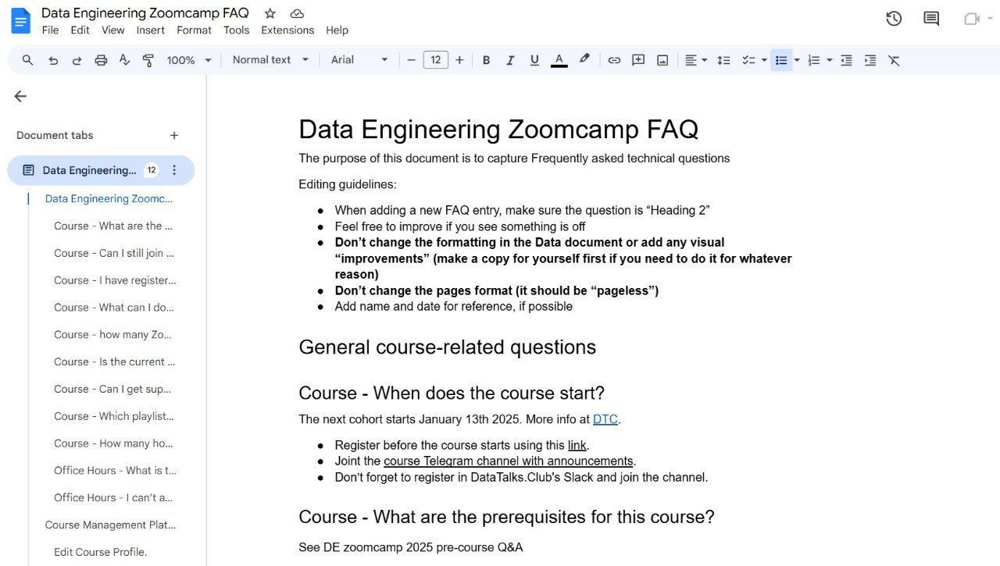
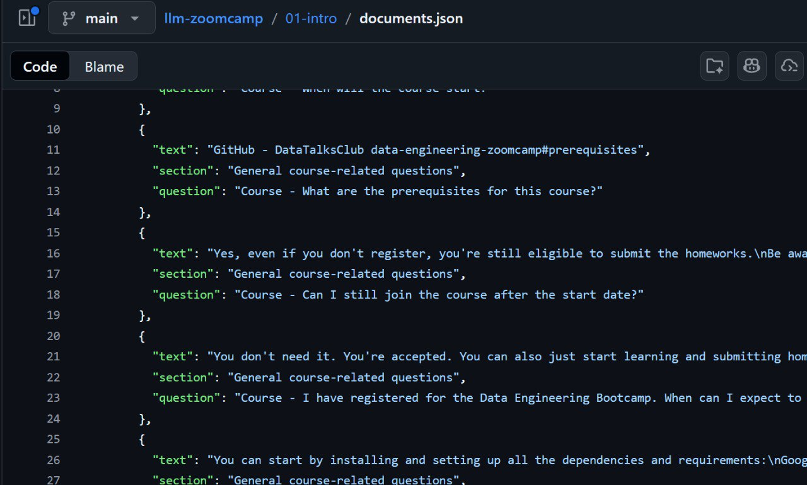
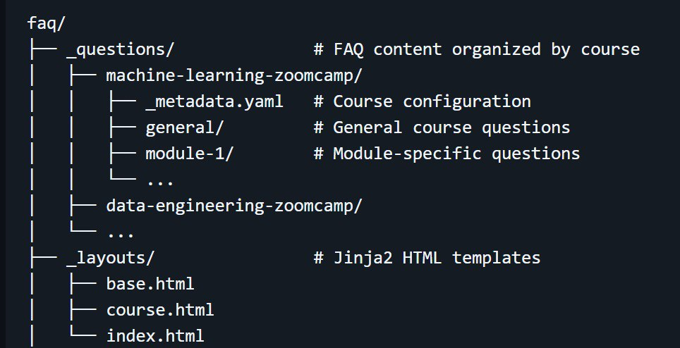
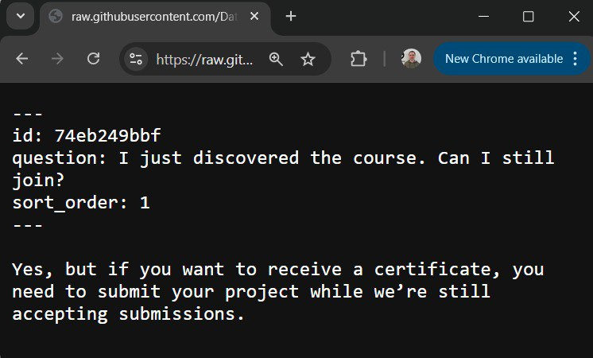
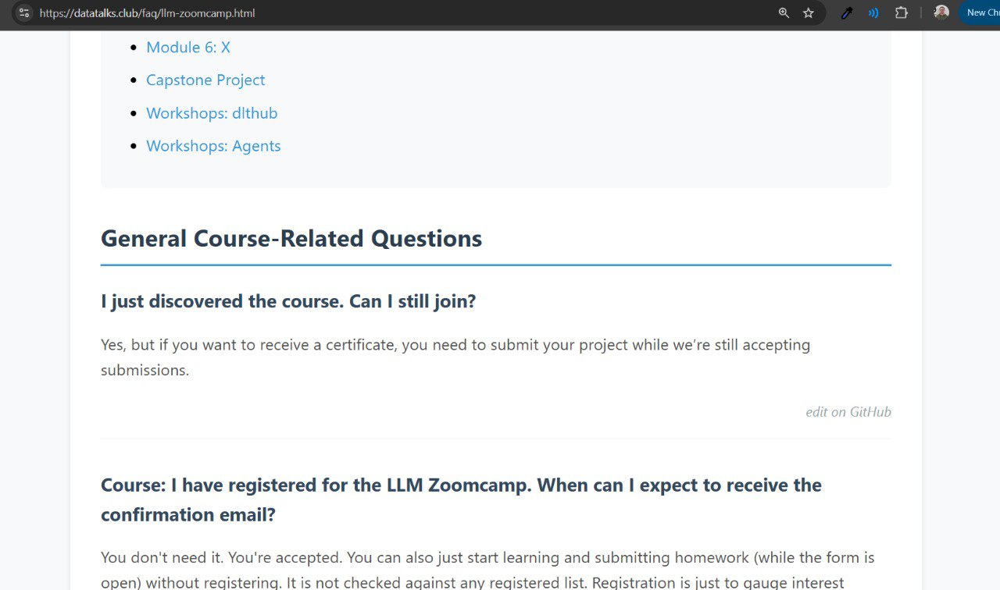
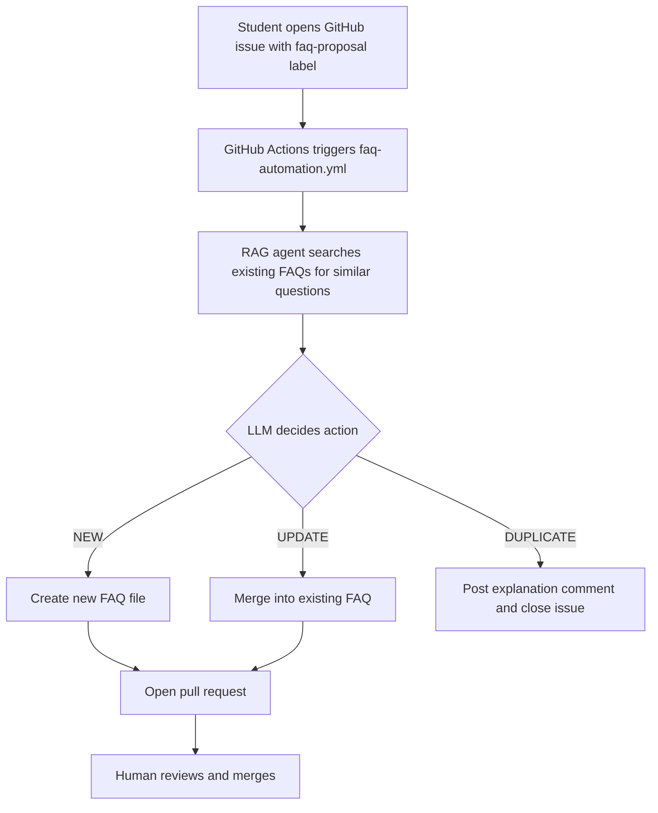
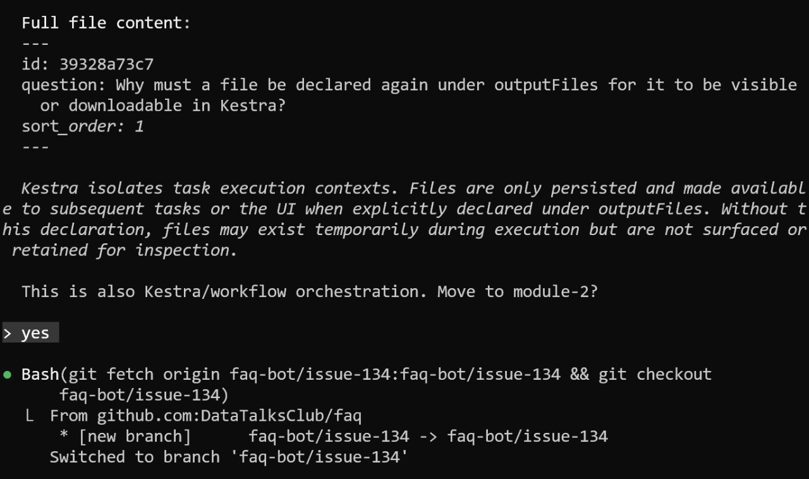

# FAQ System for Course Management

The DataTalks.Club FAQ is a community-driven knowledge base for our free courses. It started as a shared Google Doc and grew into a website with its own automation pipeline: students propose new entries through GitHub issues, and a RAG agent triages them into new entries, updates, or duplicates[^1].

The FAQ website is at https://datatalks.club/faq/ and the source repository is at https://github.com/DataTalksClub/faq.

This article covers why the FAQ exists, how we moved from Google Docs to a proper website, how the automation works, and how I use Claude Code to review the pull requests the bot creates.

## Why This System Exists

We run several free courses at DataTalks.Club: ML Zoomcamp, Data Engineering Zoomcamp, MLOps Zoomcamp, LLM Zoomcamp, and now AI Engineering Buildcamp. Each course runs every year, and students keep asking the same questions: "I just discovered the course, can I still join?", "How do I run Docker on Windows?", and so on[^13].

They usually ask on Slack, and answering the same question over and over isn't fun. So we created a central FAQ for each course - a regular Google Doc with a defined structure. Nothing fancy - just a document students can fill in themselves so the FAQ grows over time[^13].

To motivate contributions, we added a gamification element. Our courses already have a points system - you get points for homework, projects, and other activities, and the scores show up on a leaderboard. We gave one extra point per homework if a student added something to the FAQ. Many students contributed without the points, but the extra incentive helped keep the FAQ fresh[^13].

The FAQ is substantial today: over 1200 entries across all zoomcamps, with the Data Engineering Zoomcamp FAQ alone running 400-500 pages[^14]. Expecting students to read all of that before asking on Slack isn't realistic, which is why we also built tools that search the FAQ automatically.

## The Google Docs Era

The original FAQ was one Google Doc per course, open for anyone to edit. That made contributions frictionless, but it also caused problems:

- No moderation - anyone could delete content
- Vandalism happened more than once, and we had to restore documents
- Formatting quirks broke the downstream bot that parsed the docs[^13]

To make the FAQ searchable from Slack, community member Alex Litvinov built a Slack bot that parses the Google Docs and uses RAG to answer student questions. The bot reindexes the documents every day, so when something broke - vandalism, odd formatting - the daily update pulled in the broken version and the bot's answers got worse until someone fixed the doc[^13].

<figure>
  
  <figcaption>The old FAQ format in Google Docs - editable by anyone, which led to both contributions and vandalism</figcaption>
  <!-- This shows what the FAQ looked like before the website was created -->
</figure>

## Alex Litvinov's Slack Bot

The Slack bot is still running today. It ingests data from several sources, not just the FAQ:

- FAQ documents - question-answer pairs from each course's FAQ
- Slack history - past questions and answers in course channels
- GitHub repos - course notebooks and code
- YouTube subtitles - video transcripts from lectures

Each source is chunked by structure. FAQ entries are split by question-answer pairs, Slack threads are treated as one document (starting question plus the discussion), and GitHub code is organized by file. That produces semantically complete chunks instead of arbitrary character slices[^15].

The tech stack:

- LlamaIndex as the RAG framework
- Milvus locally, Zilliz Cloud in production, as the vector database
- BAAI/bge-base-en-v1.5 from HuggingFace for embeddings
- Cohere Rerank for reranking
- GPT-4o-mini for answer generation
- Slack Bolt with Socket Mode for Slack integration
- Upstash Redis to cache embeddings (roughly a 5x speedup on ingestion)
- LangSmith for observability
- Fly.io for hosting

The bot maintains four query engines, one per course, and routes each question by channel ID. It retrieves 20 documents, applies time-weighting to prefer recent Slack answers (which matters for deadlines and cohort-specific details), and reranks to the top four before asking the LLM. The ingestion pipeline runs on a schedule via GitHub Actions in Docker[^15].

You can see the full code at https://github.com/aaalexlit/faq-slack-bot.

## Moving to Markdown

Google Docs worked for a while, but we wanted proper moderation and a better reading experience. That meant a real website with the FAQ source in a Git repository.

### Parsing the Google Docs

We already had code that parses Google Docs into JSON. I originally wrote it for the LLM Zoomcamp course, where RAG is one of the main topics and the FAQ made a convenient dataset. The pipeline:

1. Download the Google Doc as DOCX
2. Use Python's `docx` module to extract content
3. Use headers to identify where questions end and answers begin
4. Output clean JSON with `text`, `section`, and `question` fields

The notebook is in the LLM Zoomcamp repo at https://github.com/DataTalksClub/llm-zoomcamp/blob/main/cohorts/2024/05-orchestration/parse-faq-llm.ipynb. It was written once and not meant to run again, so the code is rough, but it did the job.

<figure>
  
  <figcaption>The JSON format used for parsing - each entry has text, section, and question fields for RAG indexing</figcaption>
  <!-- This was the intermediate format for processing FAQ content -->
</figure>

### Content Cleanup with GPT-4o-mini

Extracting the content was only half the job. The result still needed editing: inconsistent formatting, grammar issues, screenshots of code instead of real code blocks. Doing this by hand wasn't feasible, so I wrote a small script that sent the content to GPT-4o-mini with instructions to standardize formatting, fix grammar, and convert code screenshots into real code blocks. A few evenings of work and I had a clean dataset ready for the website[^13].

### Structuring the Content

The new structure is organized by course, then module, then individual questions. Each question is a separate markdown file with frontmatter metadata.

<figure>
  
  <figcaption>The repository structure - questions organized by course and module, with Jinja templates for site generation</figcaption>
  <!-- Shows how the FAQ content is organized in the repository -->
</figure>

<figure>
  
  <figcaption>Each FAQ entry is a markdown file with ID, question, sort order, and answer content</figcaption>
  <!-- This shows the format that contributors' content becomes -->
</figure>

## Building the Website

### Jekyll Almost Worked

The obvious choice for a GitHub-hosted site is Jekyll, so I tried that first. It broke almost immediately.

The Data Engineering Zoomcamp includes an [Analytics Engineering module](https://github.com/DataTalksClub/data-engineering-zoomcamp/tree/main/04-analytics-engineering) that uses dbt, and dbt templates are written in Jinja. When you paste a Jinja snippet like this into Jekyll:

```jinja
select *
from {{ ref('stg_trips') }}
where date >= '{{ var("start_date") }}'
```

Jekyll's own template engine (Liquid) tries to parse `{{ ref('stg_trips') }}` and fails. I spent an evening trying different escaping tricks and couldn't get Jekyll to process it properly[^4][^13].

### Writing a Custom Generator with Copilot

Writing my own static site generator wasn't as scary as it sounds. Coding agents already existed by then, so I asked GitHub Copilot to write one. The idea was straightforward: parse the markdown with frontmatter, use Jinja2 for the HTML templates, and produce static HTML pages[^13].

The generator is specific to this site, which is the downside - you can't drop it into another project without modification. I also have to maintain it and write tests for it, but the scope is narrow so that's manageable.

GitHub Pages doesn't require Jekyll anymore. Any generator that runs in GitHub Actions and outputs HTML files in the right place will work, so a custom one is a reasonable choice today. That wasn't true a few years ago, when GitHub Pages was Jekyll-only[^13].

### JSON Export

The generator also exports the FAQ as JSON. There's an index at https://datatalks.club/faq/json/courses.json listing all courses, and each course has its own JSON file. Each entry has `id`, `course`, `section`, `question`, and `answer`.

I use this JSON in the AI Engineering Buildcamp when teaching RAG. Students fetch it directly into minsearch and build a FAQ assistant in a few lines:

```python
import requests
from minsearch import Index

base_faq_url = 'https://datatalks.club/faq'
courses_index_url = f'{base_faq_url}/json/courses.json'
courses_index = requests.get(courses_index_url).json()

documents = []
for course in courses_index:
    course_url = f"{base_faq_url}/{course['path']}"
    documents.extend(requests.get(course_url).json())

index = Index(
    text_fields=['section', 'question', 'answer'],
    keyword_fields=['course']
)
index.fit(documents)
```

That's over 1200 FAQ entries across all zoomcamps, ready to search. The course then extends a reusable RAG class to add FAQ-specific behavior: boost the `question` field, filter by course, and track references so each answer links back to its source FAQ entry:

```python
class LLMZoomcampFAQRAG(rag.RAG):
    def search(self, query):
        return self.index.search(
            query,
            filter_dict={'course': 'llm-zoomcamp'},
            boost_dict={'question': 3, 'section': 0.5},
            num_results=5,
        )
```

References are turned into clickable links using a URL template like `https://datatalks.club/faq/llm-zoomcamp.html#74eb249bbf`, so readers can verify the answer by jumping straight to the original FAQ entry[^5].

<figure>
  
  <figcaption>The final result - the FAQ website at datatalks.club/faq/llm-zoomcamp.html with navigation by module</figcaption>
  <!-- This is what users see and what contributors help build -->
</figure>

The generator code is at https://github.com/DataTalksClub/faq/blob/main/generate_website.py.

## The FAQ Automation Bot

Moving to a website solved the moderation problem, but it broke the contribution flow. With Google Docs, anyone could open the file and start typing. With a GitHub repo, you'd need to fork, edit markdown, open a pull request - too much friction for a student who just wants to add a tip[^13].

I wanted to keep the Google-Doc-level ease of contribution while still using the repository as the source of truth. That's how the FAQ Automation Bot came to be.

### The Workflow

You open a GitHub issue with the `faq-proposal` label, write the course, question, and answer, and the bot does the rest:



### The Decision Model

The RAG agent in `faq_automation/rag_agent.py` uses a structured output model with these fields:

- `action` - NEW, UPDATE, or DUPLICATE
- `rationale` - 1-2 sentences explaining the decision
- `document_id` - Which FAQ entry to act on
- `section_id` - Which section this belongs to
- `section_rationale` - Why this section was chosen
- `order` - Where in the section this FAQ should appear
- `question` - The final question text
- `proposed_content` - The merged answer (for NEW and UPDATE)
- `filename_slug` - File-system friendly slug (for NEW)

The full agent is at https://github.com/DataTalksClub/faq/blob/main/faq_automation/rag_agent.py.

### Why This Matters

This is RAG applied beyond simple question-answering:

- Content triage - automatically deciding where new content belongs
- Deduplication - identifying when a proposal is already covered
- Content merging - combining new information with existing answers
- Maintaining structure - ensuring FAQs go in the right section and order

The human still reviews the pull request, but the RAG agent does the repetitive work of searching, comparing, and organizing.

## How the Bot Got Built

I wrote the first version as a notebook - enough to prove the decision logic worked, but not something you'd run on every GitHub issue. During Hacktoberfest, [Fred Pearce](https://github.com/frederick-douglas-pearce) picked it up and built the GitHub Actions orchestration that turns issue events into pull requests automatically[^7][^13]. That's what made the bot usable for the community.

Students contribute by filling out the FAQ proposal form with course, question, and answer. The bot handles everything else.

The contribution guide is at https://github.com/DataTalksClub/faq/blob/main/CONTRIBUTING.md.

## Reviewing Pull Requests with Claude Code

The bot makes mistakes. Classic examples: a question about Kestra (workflow orchestration) goes into the general section instead of module-2, or it merges into the wrong FAQ because the embeddings landed on a superficially similar question[^8].

<figure>
  
  <figcaption>The FAQ bot sometimes misclassifies entries - here it correctly suggests moving from general to module-2 (workflow orchestration)</figcaption>
  <!-- Shows the bot can recognize when it made a mistake and suggest fixes -->
</figure>

Fixing these manually was painful. You have to check out the PR branch, correct the markdown, push the fix, and repeat for every PR. That's a lot of steps for a small edit, and I never had time to improve the bot itself so it wouldn't make the mistakes in the first place. I made some corrections here and there, but it wasn't sustainable[^13].

### Batching Reviews with Claude Code

What I do now: let the PRs pile up for a bit, then start a Claude Code session and go through them one by one[^13]:

1. List open pull requests with `gh pr list`
2. For the next PR, show Claude what changed
3. Tell Claude what's wrong - "change the category to module-2", "this should be merged into the existing entry about X"
4. Claude checks out the branch, makes the edit, and pushes
5. Merge the corrected PR, delete the branch, and move on

Showing one PR at a time lets me stay focused instead of trying to hold the whole queue in my head[^13]. Once I've corrected a few PRs in the same session, Claude starts recognizing the pattern and suggests the same fix on later PRs without being asked[^9].

### Why This Beats Full Automation

I could build the same corrections into the bot itself, but that would mean more complex GitHub Actions and a more elaborate agent. Reviewing with Claude Code is simpler:

- Nothing gets merged without a human in the loop
- Faster than designing automated feedback inside the bot
- I can clean up other issues at the same time (duplicates, stale entries)
- The bot stays cheap to run - it uses a smaller LLM, and I use a stronger model only during review[^10]

### Feeding Mistakes Back

The next step is to take the corrections from each review session and feed them back into the FAQ agent's prompt. Each session's mistakes become examples that make the next run better. That's the feedback loop I want: review catches what the bot missed, and the bot gets slightly better each time[^11].

## RAG Beyond Question-Answering

The FAQ system is a reminder that RAG isn't just for chatbots. Anywhere you have a large collection of documents and need to make intelligent decisions about them, RAG fits:

- Customer support - routing tickets to the right team, suggesting responses
- Recommendation systems - finding similar products, articles, or documents
- Research assistance - literature review, finding related papers
- Fact-checking - verifying claims against a knowledge base
- Code assistance - searching codebases for relevant examples
- Education - creating study materials or quizzes from content
- Writing assistance - suggesting related content to include
- Content management - the FAQ system itself

The pattern is always the same: search for relevant context, then use an LLM to process that context for a specific task[^12].

## Sources

[^1]: [20260207_171105_AlexeyDTC_msg1128.md](../../inbox/used/20260207_171105_AlexeyDTC_msg1128.md) - RAG for Content Management course material
[^2]: [20260207_170725_AlexeyDTC_msg1126_transcript.txt](../../inbox/used/20260207_170725_AlexeyDTC_msg1126_transcript.txt) - Voice message explaining the FAQ bot workflow
[^3]: [20260207_172620_AlexeyDTC_msg1139_transcript.txt](../../inbox/used/20260207_172620_AlexeyDTC_msg1139_transcript.txt) - Using FAQ data for RAG examples in LLM Zoomcamp
[^4]: [20260207_173142_AlexeyDTC_msg1156_transcript.txt](../../inbox/used/20260207_173142_AlexeyDTC_msg1156_transcript.txt) - Jekyll vs Jinja template conflicts
[^5]: [20260207_173456_AlexeyDTC_msg1162_transcript.txt](../../inbox/used/20260207_173456_AlexeyDTC_msg1162_transcript.txt) - JSON export for AI Engineering Buildcamp
[^6]: [20260207_171105_AlexeyDTC_msg1128.md](../../inbox/used/20260207_171105_AlexeyDTC_msg1128.md) - FAQ automation workflow documentation
[^7]: [20260207_171156_AlexeyDTC_msg1129_transcript.txt](../../inbox/used/20260207_171156_AlexeyDTC_msg1129_transcript.txt) - Hacktoberfest contribution story
[^8]: [20260207_170725_AlexeyDTC_msg1126_transcript.txt](../../inbox/used/20260207_170725_AlexeyDTC_msg1126_transcript.txt) - FAQ bot makes mistakes with categorization
[^9]: [20260207_171552_AlexeyDTC_msg1132_transcript.txt](../../inbox/used/20260207_171552_AlexeyDTC_msg1132_transcript.txt) - Using Claude Code to review and fix PRs interactively
[^10]: [20260207_171552_AlexeyDTC_msg1132_transcript.txt](../../inbox/used/20260207_171552_AlexeyDTC_msg1132_transcript.txt) - Bot uses simpler model, Claude uses better model during review
[^11]: [20260207_170725_AlexeyDTC_msg1126_transcript.txt](../../inbox/used/20260207_170725_AlexeyDTC_msg1126_transcript.txt) - Learning from mistakes to improve the agent
[^12]: [20260207_171105_AlexeyDTC_msg1128.md](../../inbox/used/20260207_171105_AlexeyDTC_msg1128.md) - Other RAG applications beyond QA
[^13]: [20260423_095230_AlexeyDTC_msg3521_transcript.txt](../../inbox/used/20260423_095230_AlexeyDTC_msg3521_transcript.txt) - Voice message with background on why the FAQ exists, the Google Docs era, migration details, the Copilot-built generator, and the Claude Code review workflow
[^14]: [AI Engineering Buildcamp - FAQ Assistant Overview](https://github.com/alexeygrigorev/ai-engineering-buildcamp/blob/main/v2/02-rag-usecases-tech/02-faq-assistant/01-section-overview.md) - FAQ scale (over 1200 entries, DE Zoomcamp FAQ is 400-500 pages)
[^15]: [AI Engineering Buildcamp - DTC FAQ Chatbot Use Case](https://github.com/alexeygrigorev/ai-engineering-buildcamp/blob/main/v2/02-rag-usecases-tech/02-faq-assistant/04-dtc-faq-chatbot.md) - Slack bot data sources, tech stack, and architecture details
