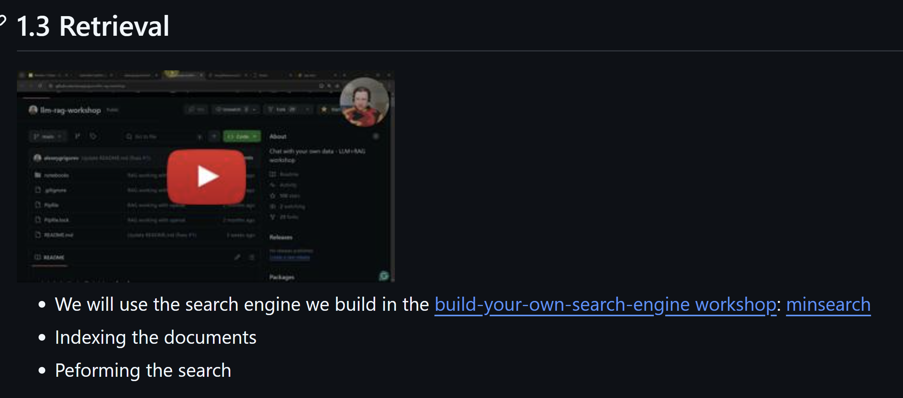

# Minsearch: Simple Search for Small Datasets

Minsearch is a lightweight search library for small to medium datasets, for when you don't need the complexity of Elasticsearch. The source is at [github.com/alexeygrigorev/minsearch](https://github.com/alexeygrigorev/minsearch).

## The Right Fit

Minsearch is designed for situations where:

- You have a small to medium-sized dataset
- You need search functionality
- Everything lives within a single process
- You don't need heavy infrastructure like Elasticsearch[^usecases]

The best fit is indexing small sites or datasets up to a few thousand documents. The sweet spot is the 5,000 to 10,000 range. Indexing a few thousand docs is fast. When you have enough plain text to search over, minsearch is the most convenient option[^scale].

## Real Uses

Many of my workshops use minsearch. You can find them all at [aishippinglabs.com/workshops](https://aishippinglabs.com/workshops)[^workshops].

It also runs across all of my courses[^workshops]:

- [LLM Zoomcamp](https://github.com/DataTalksClub/llm-zoomcamp)
- [AI Hero](https://aishippinglabs.com/courses/aihero)
- [AI Engineering Buildcamp](https://maven.com/alexey-grigorev/from-rag-to-agents)

Beyond teaching, I use it in personal and DataTalks.Club projects. One of them is the FAQ assistant for DataTalks.Club at [github.com/DataTalksClub/faq](https://github.com/DataTalksClub/faq)[^workshops]. Its automation module reads GitHub issues and creates FAQ entries. Minsearch checks whether a question already exists before adding a new one. I wrote about that system on Substack: [From Google Docs to an Automated FAQ System for DataTalks.Club Courses](https://alexeyondata.substack.com/p/from-google-docs-to-an-automated)[^workshops].

Minsearch is convenient here because you don't have to drag along anything heavy. You can index the data quickly, with no complex processing. Everything needs to live in a single process[^applied].

## Origins

The library came out before the first run of LLM Zoomcamp. When I was planning the course, I wanted it to focus mostly on RAG. Search, or retrieval, is one of the most important parts of RAG. So I needed a simple search library. I could use it both for the course and for the workshops I was running alongside it to promote it[^origin1].

<figure>
  
  <figcaption>The retrieval module from the first run of LLM Zoomcamp, built around minsearch.</figcaption>
</figure>

I knew Elasticsearch well, so I started with that. But I was also running workshops on Google Colab, where I needed open source LLMs running on a GPU. You can't run Docker on Colab. Without it, Elasticsearch is too hard to run[^origin2].

So I needed a maximally lightweight search that would run right in Python, with no Docker. I went looking for something existing with similar functionality, but found nothing. I'd been doing text processing and search for a long time. Building a small in-process search library myself wasn't hard. Even back then, when coding agents weren't as good as they are now, I could do it[^origin1].

## Building the First Version

I already had the picture in my head, and the implementation is simple.

It's a bag of words with TF-IDF[^origin2]:

1. Fit a TF-IDF vectorizer on all your documents
2. Apply the same vectorizer to the query
3. Multiply the matrices
4. Sort the results

I described what I wanted to a chat assistant, got code back, and asked for a few fixes. That became the first version of the library. At first it was a single Python file[^origin2].

Since the implementation is simple and there were no libraries like it, I thought it would make an interesting workshop. It worked both as preparation for the course and as content people would enjoy. That is how the first version of the workshop appeared: [Build Your Own Search Engine](https://aishippinglabs.com/workshops/2026-05-14-build-your-own-search-engine) [^build].

The first version came out two years ago and was originally a talk at DataTalks.Club. I updated it with newer versions of the libraries, but it's essentially the same workshop as before. It's now split into units. If you want to understand how minsearch works in more detail, that is the place to look[^build].

## From a Single File to a PyPI Package

At first people downloaded the single file. Over time I realized I needed to ship changes to the library. Then everyone taking the course could pick them up easily. Before this they had to wget the file, which was awkward. Now they can install it with pip[^evolution1].

So I looked into how to package and publish a library on PyPI. I already had some experience releasing Python libraries, so I refreshed my memory. I set it up and published the first version, 0.0.1. That worked well, and I gradually started adding new functionality[^evolution1].

## The Appendable Index

The appendable index came about a year later, when I started working on the second run of the course. We added agents, and I needed more than just search. I wanted to show that agents can also add data back to the index, not just read from it. So I built an index you can add to later[^evolution2].

## Vector Search

Vector search came to minsearch even later. It was part of the original Build Your Own Search Engine workshop, but not of the library at first. Over time I needed it more and more in the workshops, so eventually I included it. That made sense, since minsearch had come out of that workshop[^evolution2].

## Benchmarking and Optimization

I used the appendable index more and more. Over time I noticed it was considerably slower than the simple one. At first I was fine with that, but at times it was just too slow. So I decided to benchmark it.

It recomputed tokens and scores during every search, while the simple index relied on scikit-learn's optimized batch operations. The first benchmark showed it was about 14 times slower to index and 27 times slower to search[^benchmark].

This was one of the first times I used an AI assistant to benchmark and optimize something.

I gave Claude a clear workflow[^benchmark]:

1. Benchmark against Simple Wikipedia and save a baseline
2. Make changes to the code
3. Check that results still match the baseline
4. Compare the speed

I checked in about once an hour while I worked on course materials. After a few rounds, search ran 20 to 76 times faster than scikit-learn. The gap grew on larger datasets. Indexing stayed about 1.3 times slower, a fair price for being able to append documents[^benchmark]. The full benchmark writeup is at [github.com/alexeygrigorev/minsearch/blob/main/benchmark/BENCHMARK_WRITEUP.md](https://github.com/alexeygrigorev/minsearch/blob/main/benchmark/BENCHMARK_WRITEUP.md).

## Release Timeline

Here is roughly how minsearch developed over time, based on its commit history[^commits]:

- 2024-05 (0.0.1): Initial release. A single-file library implementing minimalistic TF-IDF and cosine-similarity text search, with keyword filtering and field boosting.
- 2024-09 (0.0.2): Made pip-installable with proper packaging.
- 2025-05/06 (0.0.3): Added the appendable index, an incrementally updatable index where documents can be added after creation.
- 2025-07 (0.0.4): Added vector search, plus CI and a move to uv.
- 2025-09 (0.0.5): Made keyword fields optional across all index classes, because filtering by keyword was not always needed.
- 2025-10 (0.0.6 / 0.0.7): Bug fixes.
- 2025-11: Added append support to vector search for incremental vector indexing. Also fixed TF-IDF normalization in the appendable index to match scikit-learn.
- 2026-02 (0.0.8): Added numeric and date range filters, and refactored filtering into its own module.
- 2026-02 (0.0.9): Major appendable-index performance optimizations, a highlighter for search results, and a tokenizer module with stemming support.
- 2026-02 (0.0.10): Added save and load methods to all index classes for persistence.
- 2026-05 (0.0.11): Fixed appendable-index scoring.
- 2026-05 (0.1.0): Switched to CI-based publishing on tag push. This is the current version.

## Alternatives

Beyond around 10,000 documents, minsearch stops being the right tool. If you still want something lightweight for a larger local dataset, use SQLiteSearch. I built it for exactly that[^scale]. I wrote about the process on Substack: [How I Built SQLiteSearch](https://alexeyondata.substack.com/p/how-i-built-sqlitesearch-a-lightweight). The source is at [github.com/alexeygrigorev/sqlitesearch](https://github.com/alexeygrigorev/sqlitesearch).

## Sources

[^build]: [20260528_122208_AlexeyDTC_msg4329_transcript.txt](../../inbox/used/20260528_122208_AlexeyDTC_msg4329_transcript.txt), [20260528_122122_AlexeyDTC_msg4325.md](../../inbox/used/20260528_122122_AlexeyDTC_msg4325.md), [20260528_122137_AlexeyDTC_msg4327.md](../../inbox/used/20260528_122137_AlexeyDTC_msg4327.md), [20260528_122049_AlexeyDTC_msg4323_transcript.txt](../../inbox/used/20260528_122049_AlexeyDTC_msg4323_transcript.txt)
[^origin1]: [20260528_105720_AlexeyDTC_msg4308_transcript.txt](../../inbox/used/20260528_105720_AlexeyDTC_msg4308_transcript.txt), [20260528_150726_AlexeyDTC_msg4335_transcript.txt](../../inbox/used/20260528_150726_AlexeyDTC_msg4335_transcript.txt)
[^origin2]: [20260528_110401_AlexeyDTC_msg4309_transcript.txt](../../inbox/used/20260528_110401_AlexeyDTC_msg4309_transcript.txt), [20260528_150726_AlexeyDTC_msg4335_transcript.txt](../../inbox/used/20260528_150726_AlexeyDTC_msg4335_transcript.txt)
[^evolution1]: [20260528_110619_AlexeyDTC_msg4311_transcript.txt](../../inbox/used/20260528_110619_AlexeyDTC_msg4311_transcript.txt)
[^evolution2]: [20260528_150726_AlexeyDTC_msg4335_transcript.txt](../../inbox/used/20260528_150726_AlexeyDTC_msg4335_transcript.txt), [20260528_110401_AlexeyDTC_msg4309_transcript.txt](../../inbox/used/20260528_110401_AlexeyDTC_msg4309_transcript.txt)
[^commits]: [20260528_110612_AlexeyDTC_msg4310.md](../../inbox/used/20260528_110612_AlexeyDTC_msg4310.md), [20260528_110626_AlexeyDTC_msg4312_transcript.txt](../../inbox/used/20260528_110626_AlexeyDTC_msg4312_transcript.txt), [github.com/alexeygrigorev/minsearch](https://github.com/alexeygrigorev/minsearch/commits/main/)
[^usecases]: [20260123_121456_valeriia_kuka_msg458_transcript.txt](../../inbox/used/20260123_121456_valeriia_kuka_msg458_transcript.txt)
[^scale]: [20260528_110735_AlexeyDTC_msg4313_transcript.txt](../../inbox/used/20260528_110735_AlexeyDTC_msg4313_transcript.txt)
[^workshops]: [20260528_122004_AlexeyDTC_msg4321_transcript.txt](../../inbox/used/20260528_122004_AlexeyDTC_msg4321_transcript.txt)
[^applied]: [20260528_122004_AlexeyDTC_msg4321_transcript.txt](../../inbox/used/20260528_122004_AlexeyDTC_msg4321_transcript.txt)
[^benchmark]: [20260209_143545_AlexeyDTC_msg1234_transcript.txt](../../inbox/used/20260209_143545_AlexeyDTC_msg1234_transcript.txt), [github.com/alexeygrigorev/minsearch/blob/main/benchmark/BENCHMARK_WRITEUP.md](https://github.com/alexeygrigorev/minsearch/blob/main/benchmark/BENCHMARK_WRITEUP.md)
