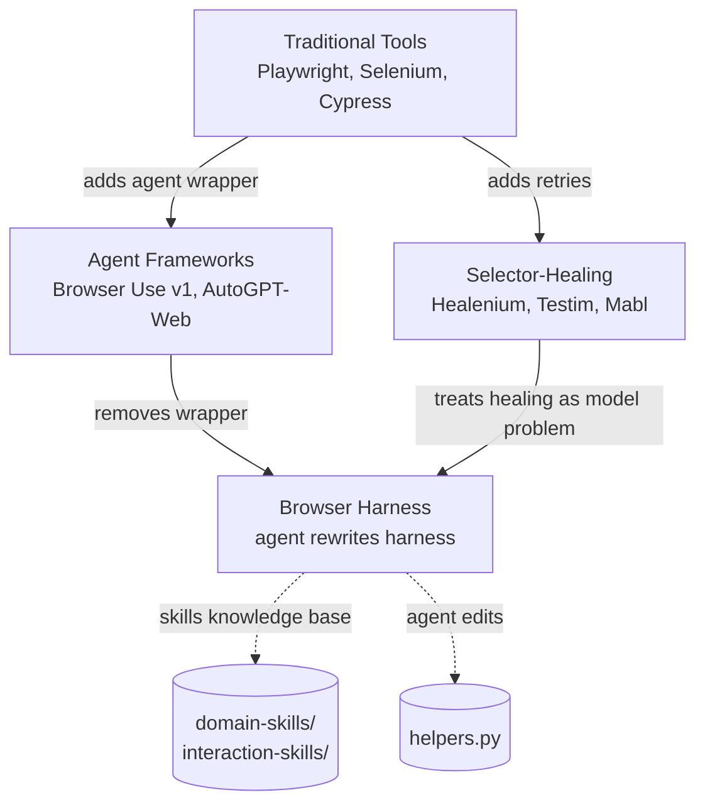

# Browser Harness: Self-Healing Browser Automation via Agent-Editable Code

[Repository](https://github.com/browser-use/browser-harness)

Browser Harness is an intentionally minimal browser automation harness from the Browser Use team, built on Chrome DevTools Protocol (CDP). At roughly 592 lines of Python total, its defining idea is that the agent (Claude Code, Codex, or similar) edits the harness source itself mid-task when a primitive is missing. There is no retry framework, no selector healing library, no planning module - the "self-healing" is the for-loop of an LLM rewriting `helpers.py` while the browser stays open.

This article looks at how that works in the repo, what counts as "self-healing" here, and how the design differs from classic self-healing automation (Playwright-style auto-waiting, Selenium healing selectors, etc.).

## What It Is

The pitch in the README captures the model[^1]:

```text
  agent: wants to upload a file
  helpers.py -> upload_file() missing
  agent edits the harness and writes it   helpers.py  192 -> 199 lines
                                                     + upload_file()
  file uploaded
```

The agent runs normal Python with a handful of pre-imported helpers. When a helper is missing or a site does something weird, the agent edits `helpers.py` directly, then continues. The code is the tool definition, so changes take effect on the next invocation - `uv tool install -e .` makes the CLI point at the editable checkout, so every `browser-harness` shell call sees the latest code[^2].

File layout (the whole repo):

 - `run.py` (~36 lines) - reads Python from stdin, pre-imports helpers, auto-starts the daemon, and `exec()`s the snippet
 - `helpers.py` (~195 lines) - browser primitives: `click`, `type_text`, `goto`, `screenshot`, `js`, `upload_file`, `cdp`
 - `daemon.py` (~224 lines) - long-lived asyncio process holding the CDP WebSocket to Chrome, listening on a Unix socket
 - `admin.py` (~361 lines combined with daemon plumbing) - daemon lifecycle, remote cloud browser provisioning, profile sync
 - `SKILL.md` - instructions the agent loads into its own context
 - `interaction-skills/` - reusable UI mechanics (dialogs, iframes, uploads, scrolling)
 - `domain-skills/` - site-specific recipes contributed by agents for 68+ sites (LinkedIn, Amazon, GitHub, TikTok, Spotify, etc.)

There is no retry decorator anywhere in the codebase. The design explicitly rejects one. The `SKILL.md` design constraints spell it out[^3]:

> Don't add a manager layer. No retries framework, session manager, daemon supervisor, config system, or logging framework.

## Architecture

The harness runs as three processes arranged in a pipeline. Each `browser-harness <<'PY' ... PY` invocation is a short-lived Python process. It talks over a Unix socket to a persistent daemon, which holds one CDP WebSocket to the user's actual Chrome.

```mermaid
graph LR
    Agent[Coding Agent<br/>Claude Code / Codex]
    Stdin[browser-harness<br/>stdin Python]
    Run[run.py<br/>short-lived process]
    Sock[/tmp/bu-NAME.sock<br/>Unix socket]
    Daemon[daemon.py<br/>long-lived asyncio]
    CDP[CDP WebSocket<br/>ws://127.0.0.1:PORT]
    Chrome[User's Chrome<br/>or BU cloud browser]

    Agent -->|heredoc| Stdin
    Stdin --> Run
    Run -->|ensure_daemon| Daemon
    Run -->|JSON line| Sock
    Sock --> Daemon
    Daemon --> CDP
    CDP --> Chrome

    Agent -.->|edits helpers.py| Run
```

The wire protocol is one JSON line each way. A request is `{method, params, session_id}` for raw CDP or `{meta: ...}` for daemon control. Responses are `{result}`, `{error}`, `{events}`, or `{session_id}`[^3].

Environment variables namespace everything:

 - `BU_NAME` - socket, pid, log file names (parallel sub-agents get distinct names)
 - `BU_CDP_WS` - override local Chrome discovery to connect to a remote browser
 - `BU_BROWSER_ID` + `BROWSER_USE_API_KEY` - let the daemon PATCH a Browser Use cloud browser to `stop` on shutdown

The design keeps `run.py` minimal on purpose. From the SKILL.md constraints: "`run.py` stays tiny. No argparse, subcommands, or extra control layer"[^3]. Anything the agent needs goes in `helpers.py`, which the agent is allowed to edit.

## How "Self-Healing" Is Defined Here

The term "self-healing" shows up once in the README and frames the whole project: "The simplest, thinnest, self-healing harness that gives LLM complete freedom to complete any browser task"[^1].

In most browser automation tools, self-healing means one of these:

 - Auto-retrying flaky selectors (Selenium Healenium, Testim)
 - Auto-waiting for element stability (Playwright's built-in waits)
 - AI fallback selectors when the primary breaks (e.g., find by visible text if CSS fails)
 - Replanning a multi-step flow when a step fails (autonomous agents)

Browser Harness does none of these mechanically. Its self-healing is structural and operates at four layers.

## Layer 1: Agent-Edited Primitives (the headline feature)

The helpers file is a working document, not an API. If the agent tries to call `upload_file()` and it doesn't exist, the agent writes it. The CDP layer is always reachable via the `cdp()` helper, so no matter what primitive is missing, the model can fall back to raw `Input.dispatchMouseEvent`, `DOM.setFileInputFiles`, or whatever CDP method does the job.

The actual `upload_file` in `helpers.py` is eight lines[^4]:

```python
def upload_file(selector, path):
    """Set files on a file input via CDP DOM.setFileInputFiles."""
    doc = cdp("DOM.getDocument", depth=-1)
    nid = cdp("DOM.querySelector", nodeId=doc["root"]["nodeId"], selector=selector)["nodeId"]
    if not nid: raise RuntimeError(f"no element for {selector}")
    cdp("DOM.setFileInputFiles", files=[path] if isinstance(path, str) else list(path), nodeId=nid)
```

The README story is exactly this: the agent realized it needed this function, wrote it using raw `cdp()` calls, and saved the result. That becomes a permanent part of the toolset for all future tasks.

The "bitter lesson" post by Gregor Zunic articulates the thesis: "As long as in principle everything is possible, LLMs are extremely good at fixing themselves on the fly"[^5]. The harness exposes the whole action space via `cdp()` and then trusts the model.

## Layer 2: Stale Session Recovery in the Daemon

The one place the source code does proactive recovery is CDP session staleness. Chrome can invalidate a session ID mid-task (page navigation, target closed, tab switched). The daemon catches this specifically and re-attaches on the fly.

From `daemon.py`[^6]:

```python
try:
    return {"result": await self.cdp.send_raw(method, params, session_id=sid)}
except Exception as e:
    msg = str(e)
    if "Session with given id not found" in msg and sid == self.session and sid:
        log(f"stale session {sid}, re-attaching")
        if await self.attach_first_page():
            return {"result": await self.cdp.send_raw(method, params, session_id=self.session)}
    return {"error": msg}
```

This is the only try/except-and-recover pattern in the whole codebase. It exists because CDP session invalidation is not a user error - it's a routine fact of how Chrome tabs work. Everything else is allowed to propagate.

The `attach_first_page` method itself has a matching bit of resilience: if no real pages exist, it creates an `about:blank` instead of attaching to the omnibox popup[^6]:

```python
pages = [t for t in targets if is_real_page(t)]
if not pages:
    tid = (await self.cdp.send_raw("Target.createTarget", {"url": "about:blank"}))["targetId"]
    log(f"no real pages found, created about:blank ({tid})")
    pages = [{"targetId": tid, "url": "about:blank", "type": "page"}]
```

Browser-level `Target.*` calls explicitly skip the session:

```python
sid = None if method.startswith("Target.") else (req.get("session_id") or self.session)
```

Target operations go to the browser context, not a tab session, so a stale tab session cannot poison browser-wide operations like listing tabs or creating new ones.

## Layer 3: User-Facing Recovery Helpers

The harness provides `ensure_real_tab()` for the model to call when it suspects it is attached to the wrong target (omnibox popup, `chrome://`, closed tab)[^4]:

```python
def ensure_real_tab():
    """Switch to a real user tab if current is chrome:// / internal / stale."""
    tabs = list_tabs(include_chrome=False)
    if not tabs:
        return None
    try:
        cur = current_tab()
        if cur["url"] and not cur["url"].startswith(INTERNAL):
            return cur
    except Exception:
        pass
    switch_tab(tabs[0]["targetId"])
    return tabs[0]
```

The agent is taught via `SKILL.md` when to call this: "Wrong/stale tab: `ensure_real_tab()`. Use it when the current tab is stale or internal. The daemon also auto-recovers from stale sessions on the next call"[^3].

Similarly, `restart_daemon()` in `admin.py` is a last-resort reset the agent can invoke when the WebSocket is hung ("no close frame received or sent"). It sends `{"meta":"shutdown"}`, then SIGTERMs the PID, then unlinks socket and pid files[^7]. A follow-up `browser-harness` call auto-spawns a fresh daemon via `ensure_daemon()`. The function's misnomer is intentional, per the docstring: "restart_daemon is misnamed - it only stops the daemon ... The 'run-it-again-to-restart' workflow is why it was named that way".

## Layer 4: The Skills Knowledge Base

The durable recovery mechanism is `domain-skills/` and `interaction-skills/`. When an agent figures out something non-obvious about a site, `SKILL.md` instructs it to commit a markdown file describing what it learned[^3]:

> If you learned anything non-obvious about how a site works, open a PR to `domain-skills/<site>/` before you finish. Default to contributing.

The tiktok upload skill is a concrete example.

It captures[^8]:

 - The required URL pattern (`?lang=en` matters)
 - That TikTok pre-fills the caption with the filename and you must clear it
 - That the time picker is a scroll-wheel list where `scroll(dy=32)` steps +1 unit
 - Stale draft banners and how to dismiss them
 - AI-content disclosure toggle location

Future agents read this before starting, skipping exploration. The SKILL.md tells them what to record and what not to: never pixel coordinates ("they break on viewport, zoom, and layout changes"), never secrets, never run narration. Only the "durable shape of the site".

The Browser Use team's separate blog post on this describes a cloud-side version of the same idea, where a second agent reviews completed trajectories and extracts skills automatically, then other agents vote on them with written reasons[^9]. The harness repo is the human-curated, PR-reviewed counterpart of that system.

## The Full Data Flow

Here is what happens end-to-end when an agent runs a browser task:

```mermaid
sequenceDiagram
    participant A as Agent
    participant BH as browser-harness CLI
    participant D as daemon.py
    participant C as Chrome

    A->>A: Read SKILL.md, helpers.py
    A->>A: Search domain-skills/<site>/
    Note over A: Missing skill? Start exploration.
    A->>BH: heredoc: new_tab(url); click(x,y); ...
    BH->>BH: ensure_daemon()
    alt Daemon not alive
        BH->>D: spawn via subprocess
        D->>C: CDP WebSocket handshake
        D->>D: attach_first_page()
        D->>D: Register event tap
    end
    BH->>D: JSON line over Unix socket
    D->>C: CDP method call
    C-->>D: result / events
    alt Stale session error
        D->>D: re-attach_first_page()
        D->>C: retry with new session_id
    end
    D-->>BH: {result} or {error}
    BH-->>A: stdout/exception
    Note over A: If action failed or helper missing:
    A->>A: Edit helpers.py (add new primitive)
    A->>BH: Retry with new helper
    Note over A: On success + novel insight:
    A->>A: Write domain-skills/<site>/<task>.md
    A->>A: Open PR
```

The daemon's event tap is worth noting. `daemon.py` wraps the CDP event registry's `handle_event` to buffer events in a `deque(maxlen=500)` so the agent can call `drain_events()` and see recent Network/Page/Runtime events[^6].

It also watches specifically for dialogs:

```python
async def tap(method, params, session_id=None):
    self.events.append({"method": method, "params": params, "session_id": session_id})
    if method == "Page.javascriptDialogOpening":
        self.dialog = params
    elif method == "Page.javascriptDialogClosed":
        self.dialog = None
    elif method in ("Page.loadEventFired", "Page.domContentEventFired"):
        try: await asyncio.wait_for(self.cdp.send_raw("Runtime.evaluate",
            {"expression": mark_js}, session_id=self.session), timeout=2)
        except Exception: pass
    return await orig(method, params, session_id)
```

The dialog tracking is another form of self-healing. Native alert/confirm/prompt dialogs freeze the page's JS thread, which would hang any `js()` call forever. `page_info()` first checks `_send({"meta": "pending_dialog"})` and returns the dialog contents instead of trying to read the page - the agent sees the dialog and can dismiss it via raw CDP `Page.handleJavaScriptDialog`[^10].

The green circle (🟢) title-marking is yet another recovery aid: every time the daemon gets a load event, it prepends 🟢 to the tab title, so the human user can see at a glance which tab the agent is controlling. If the agent switches tabs, it unmarks the old one first. This is not a technical recovery but a shared-state-with-human affordance.

## What the Agent Actually Sees

The agent's loop is shaped by SKILL.md. The file is 200+ lines of field-tested advice, essentially a prompt file loaded into the agent's context before any tool call. It includes design constraints, gotchas, and a "what works" section.

A few representative rules[^3]:

 - "Screenshots first: use `screenshot()` to understand the current page quickly, find visible targets, and decide whether you need a click, a selector, or more navigation."
 - "Clicking: `screenshot()` -> look -> `click(x, y)` -> `screenshot()` again to verify the result. Coordinate clicks pass through iframes/shadow/cross-origin at the compositor level."
 - "After every meaningful action, re-screenshot before assuming it worked."
 - "Auth wall: redirected to login -> stop and ask the user. Don't type credentials from screenshots."

The verify-with-screenshot discipline functions as self-healing by evaluation. If the agent clicks and the page didn't change, the next screenshot reveals this and the agent re-plans. There is no automated assertion layer - the model sees the screenshot and decides.

The `SKILL.md` gotchas section lists 15+ specific environmental hazards the harness has hit in production, each with the exact symptom and recovery. Example: "`no close frame received or sent` usually means a stale daemon / websocket. Restart the daemon once with [snippet] before assuming setup is wrong."[^3]. This is institutional memory hard-coded into the prompt.

## Comparison to Other Approaches

To place Browser Harness in the landscape of self-healing browser automation:



Traditional Playwright and Selenium provide stable primitives with limited built-in recovery. Auto-waiting helps with timing flakes but nothing else. When a selector breaks, the test breaks.

Selector-healing tools (Healenium is the open-source example) record element signatures at test time and at runtime try candidate selectors when the primary fails. They handle one specific failure class (selector drift) and require a persistent record/replay substrate.

Agent frameworks like the earlier Browser Use implementation wrap a model in a message manager, planner, executor, and output parser. Gregor's argument in the "bitter lesson" post is that these abstractions become liabilities - "every abstraction is a liability. every 'helper' is a failure point"[^5]. They freeze assumptions about how intelligence should work and fight the model.

Browser Harness inverts both sides: it gives the model raw CDP access (maximum action space), provides a minimal helpers file the model can rewrite, keeps no planner/retry/supervisor layer, and captures durable site knowledge in markdown files committed back to the repo.

## Relevance to Self-Healing Research

For a system experimenting with self-healing (like litehive), three specific design choices from Browser Harness transfer:

1. The editable primitive layer. The agent should have a shallow wrapper over a universal action surface (here: CDP), and should be allowed to extend that wrapper. Self-healing-by-code-edit is much cheaper than self-healing-by-metaheuristic.

2. The skills knowledge base as institutional memory. Recovery state belongs in a human-readable, PR-reviewed markdown corpus, not in a vector database or RL policy. Other agents read it before starting. Bad skills get downvoted or edited. Good ones compound. A PII gate keeps shared skills safe[^9].

3. Minimal proactive recovery, aimed at the specific failures the substrate creates. The daemon only handles one error class automatically (stale CDP sessions) because that is the one class the substrate generates unavoidably. Everything else is left to the model, because the model is better at reading arbitrary failure context than any rule-based retry can be.

The anti-patterns the Browser Harness README and SKILL.md explicitly reject are also instructive: no retry framework, no session manager, no daemon supervisor, no config system, no logging framework. Each of these is a place where a naive self-healing layer would accumulate complexity without healing anything.

## What Makes This Interesting

A few non-obvious observations:

The daemon process is the only state. Every `browser-harness` invocation is a fresh Python process that loads `helpers.py` from disk. This means an agent can edit `helpers.py`, and the edit is picked up on the next call with zero reload logic. The daemon only holds the CDP session, not the helpers themselves.

The Unix socket is the API boundary, not the helper file. An agent could in principle write a helper file in any language that talks to `/tmp/bu-default.sock` with JSON lines. The helpers file is a convention, not a contract.

Coordinate clicks are the default even though selectors are available. The rationale in SKILL.md is compositor-level recovery: "`Input.dispatchMouseEvent` goes through iframes/shadow/cross-origin at the compositor level"[^3]. By preferring the lower-level input mechanism, the harness sidesteps the entire DOM traversal class of failures.

There is no CLI flag parsing. `run.py` is 36 lines because argparse was deliberately left out. The whole control surface is Python code through stdin.

The remote browser feature is a single `start_remote_daemon()` call. It provisions a Browser Use cloud browser, resolves the HTTPS cdpUrl to a WebSocket via `/json/version`, spawns a daemon with `BU_CDP_WS` and `BU_BROWSER_ID` in its env, and opens the liveUrl locally if there's a GUI[^7]. The cloud browser is torn down by PATCHing `/browsers/{id}` with `{"action": "stop"}` on daemon shutdown. This entire remote-browsing capability adds no abstraction to the harness itself - it's just different values of `BU_CDP_WS`.

The skills system is structurally similar to the web-agents-that-actually-learn cloud pipeline described in the Browser Use blog[^9], but the harness variant uses human PR review as the quality filter instead of score-based voting. Both point at the same observation: web agents' cost is exploration, and exploration is reusable.

## Technologies

 - Python 3.11+, asyncio
 - `cdp-use==1.4.5` (Browser Use's own CDP client, used only for `CDPClient.send_raw`)
 - `websockets==16.0`
 - Unix domain sockets for IPC
 - Chrome DevTools Protocol as the universal action space
 - `uv` for environment management and `uv tool install -e .` for editable installation

## Sources

[^1]: [browser-use/browser-harness README](https://github.com/browser-use/browser-harness/blob/main/README.md)
[^2]: [install.md](https://github.com/browser-use/browser-harness/blob/main/install.md)
[^3]: [SKILL.md](https://github.com/browser-use/browser-harness/blob/main/SKILL.md)
[^4]: [helpers.py](https://github.com/browser-use/browser-harness/blob/main/helpers.py)
[^5]: [The Bitter Lesson of Agent Frameworks](https://browser-use.com/posts/bitter-lesson-agent-frameworks)
[^6]: [daemon.py](https://github.com/browser-use/browser-harness/blob/main/daemon.py)
[^7]: [admin.py](https://github.com/browser-use/browser-harness/blob/main/admin.py)
[^8]: [domain-skills/tiktok/upload.md](https://github.com/browser-use/browser-harness/blob/main/domain-skills/tiktok/upload.md)
[^9]: [Web Agents That Actually Learn](https://browser-use.com/posts/web-agents-that-actually-learn)
[^10]: [interaction-skills/dialogs.md](https://github.com/browser-use/browser-harness/blob/main/interaction-skills/dialogs.md)
[^11]: [20260419_083559_AlexeyDTC_msg3437.md](../../inbox/used/20260419_083559_AlexeyDTC_msg3437.md)
