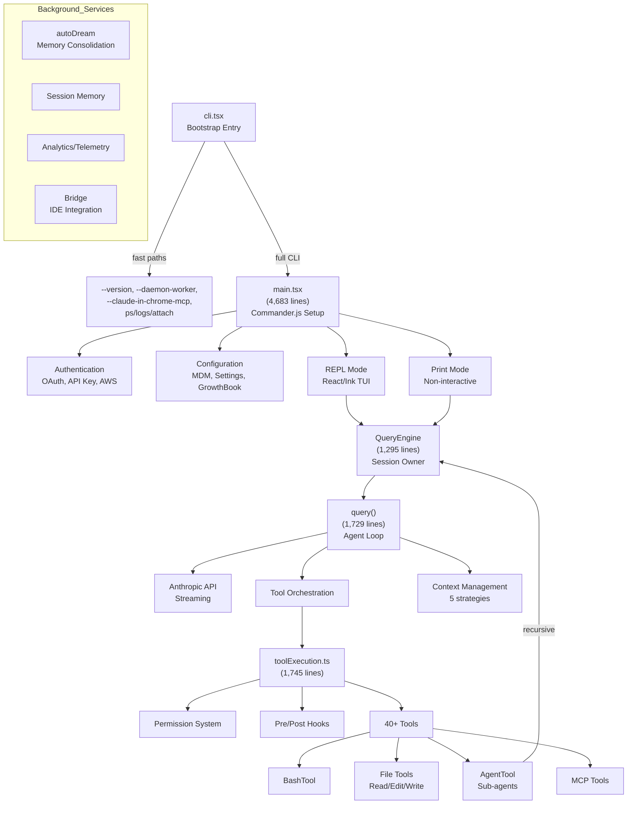
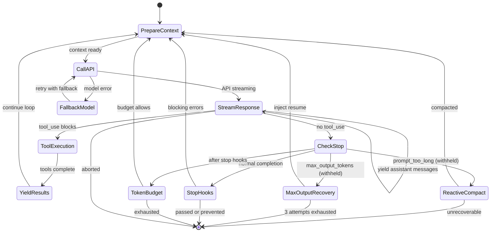
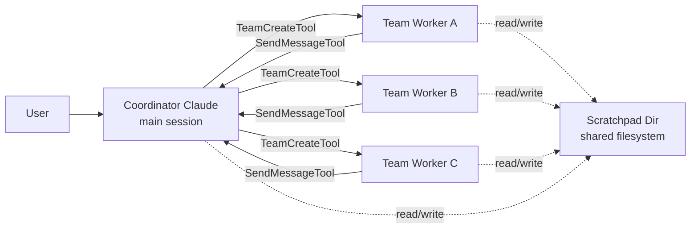

# Claude Code Architecture: Inside Anthropic's Agentic CLI

Source: local analysis of the leaked Claude Code source at `~/tmp/claude-code/` (sourcemap leak, March 2026)

Claude Code is Anthropic's terminal-based agentic coding assistant. Its source became public when a sourcemap file was accidentally shipped with the npm package. The codebase is roughly 1,884 TypeScript files and around 512,000 lines of code, built with Bun and using React/Ink for the terminal UI. It is not a thin wrapper around the Claude API - it is a full agent runtime with 40+ tools, streaming tool execution, a layered permission system, five kinds of context compaction, multi-agent coordination, session persistence, and MCP integration.

## What It Is

Claude Code runs as a long-lived CLI. A user types a message, the model responds, it can call tools (read files, run bash commands, edit files, spawn sub-agents), and the loop continues until the task is done.

The project layers several non-obvious systems on top of that basic agent loop:

 - Streaming tool execution that begins running tools while the API response is still streaming
 - Five context management strategies applied in sequence to keep the conversation fitting in the context window
 - A permission system that parses bash commands through an AST and evaluates rules from seven precedence sources
 - Background services for memory consolidation ("dreaming"), telemetry, and cross-session memory
 - A multi-agent coordinator that can spawn worker swarms
 - Hidden internal features gated by build-time feature flags

The directory layout under `src/` reflects this: `QueryEngine.ts`, `query.ts`, `Tool.ts`, and `tools.ts` at the root; `tools/` with 40+ tool subdirectories; `services/` for compaction, MCP, autoDream, analytics, LSP, OAuth; `coordinator/` for multi-agent mode; `bridge/` for IDE integration; `buddy/` for a hidden Tamagotchi companion.

## Architecture

The system is organized in layers. The CLI entry point is aggressively optimized for startup latency - it handles fast-path commands like `--version` before loading anything heavy. Only the full CLI path loads `main.tsx`, which wires up authentication, configuration, and the REPL.



The layering goes:

 - Entry: `entrypoints/cli.tsx` routes fast paths before module loading
 - Setup: `main.tsx` handles auth, config, feature flags, mode selection
 - Engine: `QueryEngine` owns conversation state; `query()` runs the agent loop
 - Tools: tools are discovered, permission-checked, and executed with concurrency control
 - UI: React/Ink components render the terminal
 - Services: compaction, memory, MCP, analytics, bridge, plugins

## Entry Point and Startup

The file `entrypoints/cli.tsx` is the bootstrap. Its design goal is clear from the code - avoid loading heavy modules for simple commands.

A `--version` call never touches `main.tsx`:

```typescript
if (args.length === 1 && (args[0] === '--version' || args[0] === '-v')) {
  console.log(`${MACRO.VERSION} (Claude Code)`);
  return;
}
```

`MACRO.VERSION` is a build-time inlined constant. After the fast-path checks, the profiler is loaded (`profileCheckpoint('cli_entry')`) and each subsequent branch checkpoints where time is spent. Branches exist for `--dump-system-prompt` (eval harness), `--claude-in-chrome-mcp` (Chrome MCP server), `--chrome-native-host`, `--computer-use-mcp`, and `--daemon-worker` (supervisor-spawned worker processes). Dynamic `import()` means each branch pays only for what it needs.

The file also sets `COREPACK_ENABLE_AUTO_PIN=0` as a top-level side effect (working around a corepack bug that pins yarn), and bumps `NODE_OPTIONS` to `--max-old-space-size=8192` when `CLAUDE_CODE_REMOTE=true` to match the 16GB container environment for Claude Code Remote (CCR) sessions.

## The Agent Loop: query.ts

`query.ts` is 1,729 lines and implements the heart of the system: a `queryLoop` async generator that orchestrates one conversation turn. It is implemented as an explicit state machine rather than recursion, using a `State` object threaded through a `while(true)` loop with labeled `continue` transitions.

Each iteration does the following:

 - Applies context management (snip, microcompact, context collapse, autocompact)
 - Calls the Anthropic API with streaming
 - Processes streamed assistant messages and `tool_use` blocks
 - Executes tools (possibly during streaming)
 - Decides whether to continue or terminate



The `State` type carries mutable data between iterations:

```typescript
type State = {
  messages: Message[]
  toolUseContext: ToolUseContext
  autoCompactTracking: AutoCompactTrackingState | undefined
  maxOutputTokensRecoveryCount: number
  hasAttemptedReactiveCompact: boolean
  maxOutputTokensOverride: number | undefined
  pendingToolUseSummary: Promise<ToolUseSummaryMessage | null> | undefined
  stopHookActive: boolean | undefined
  turnCount: number
  transition: Continue | undefined
}
```

Each `continue` site tags the new state with a `transition` explaining why.

The transitions capture the full state space of a turn:

 - `tool_results` - normal continuation after tools ran
 - `reactive_compact_retry` - retry after emergency compaction
 - `collapse_drain_retry` - retry after draining staged context collapses
 - `max_output_tokens_recovery` - retry with an injected "resume" message (up to 3 times)
 - `max_output_tokens_escalate` - retry raising the output cap from 8k to 64k
 - `stop_hook_blocking` - retry after stop hook found issues
 - `token_budget_continuation` - continue because the turn budget has room
 - `model_fallback` - retry after a model-level failure

## Tool System

Tools implement a common interface defined in `Tool.ts`:

 - `name` - identifier used by the model
 - `description` - for the system prompt
 - `inputSchema` - a Zod schema for input validation
 - `call(input, context)` - execution, returns a `ToolResult`
 - `isConcurrencySafe(input)` - whether this tool, with this input, can run in parallel with other tools
 - `needsPermissions(input)` - whether to check permissions
 - `isEnabled()` - whether the tool is currently available

The tool registry in `tools.ts` (389 lines) assembles the active tool pool. It uses conditional imports gated by `feature()` calls so the Bun bundler can dead-code-eliminate entire tool modules for external builds.

## Tool Execution Flow

Tool execution is layered. `runTools()` in `services/tools/toolOrchestration.ts` (188 lines) partitions a list of `tool_use` blocks into batches, then dispatches each batch either serially or concurrently. `StreamingToolExecutor` (530 lines) adds the streaming optimization on top.

```mermaid
flowchart TD
    A["tool_use Block<br/>from API response"] --> B{Streaming<br/>execution?}

    B -->|yes| C["StreamingToolExecutor<br/>addTool()"]
    B -->|no| D["Batched after streaming"]

    C --> E{isConcurrencySafe<br/>(input)?}
    D --> F["runTools()"]

    F --> G["partitionToolCalls()"]
    G --> H{Batch type?}

    H -->|safe| I["runToolsConcurrently<br/>up to 10 parallel"]
    H -->|unsafe| J["runToolsSerially"]

    E -->|yes| K["execute immediately<br/>parallel with stream"]
    E -->|no| L["queue for<br/>exclusive slot"]

    I --> M["runToolUse()"]
    J --> M
    K --> M
    L --> M

    M --> N["Zod input validation"]
    N --> O["canUseTool()<br/>permission check"]

    O --> P{Allowed?}
    P -->|yes| Q["pre-tool-use hooks"]
    P -->|no| R["rejection message"]

    Q --> S["tool.call(input, ctx)"]
    S --> T["post-tool-use hooks"]
    T --> U["toolResultBudget<br/>storage"]
    U --> V["yield tool result"]
```

The `partitionToolCalls()` function groups consecutive concurrency-safe tools into a single batch, breaking whenever an unsafe tool appears. Read-only tools (Glob, Grep, FileRead) return `true` from `isConcurrencySafe`. Mutating tools (FileEdit, FileWrite, most BashTool calls) return `false`. Consecutive safe tools run in parallel up to `CLAUDE_CODE_MAX_TOOL_USE_CONCURRENCY` (default 10), with serial tools forming singleton batches.

The streaming optimization is in `StreamingToolExecutor`. When the API sends a `tool_use` block mid-stream, the executor calls `addTool()` and can begin running the tool immediately, before the full API response completes. Each tracked tool has a status (`queued`, `executing`, `completed`, `yielded`), and results are emitted in the order tools were received, not the order they finished. A child `AbortController` is set up so that when a Bash tool errors, siblings can be aborted without ending the parent turn.

## Context Management

Keeping the conversation within the model's context window is handled by five cooperating strategies in `services/compact/`.

They are applied in order of severity:

 - Snip compaction (`snipCompact.ts`) - drops messages beyond a boundary, keeping recent ones
 - Tool result budget (`toolResultStorage.ts`) - replaces large tool results with truncated versions
 - Microcompact (`microCompact.ts`, 530 lines) - compresses individual messages. The `apiMicrocompact.ts` variant uses API-level cache editing to avoid resending unchanged bytes
 - Context collapse (`contextCollapse/`) - replaces groups of messages with summaries in a reversible way, committed from a staging queue
 - Autocompact (`autoCompact.ts`, 351 lines) - full conversation summarization via a forked Claude call

The reactive compact path (`reactiveCompact.ts`) deserves attention. When the API returns a `prompt_too_long` error mid-stream, the query loop withholds that error from the user, triggers emergency compaction, and retries the request transparently. If recovery succeeds, the user never sees the failure. The flag `hasAttemptedReactiveCompact` in `State` ensures this is a single attempt per turn.

The `compact.ts` file itself is 1,705 lines - one of the largest files in the codebase - because compaction has to handle many edge cases: boundary messages, tool-use/tool-result pairs that must stay together, memory blocks from autoDream, and user-visible message selection.

## Permission System

The permission system is one of the most complex components.

Modes include:

 - `default` - ask before dangerous operations
 - `auto` - automatically approve (with classifier safety checks)
 - `plan` - read-only mode. Ask before any write
 - `bypassPermissions` - approve everything (dangerous mode)

Permission rules come from seven sources with strict precedence: CLI args, policy settings (MDM), enterprise settings, project settings, user settings, session grants, and remote managed settings. The `services/remoteManagedSettings/` directory handles the last category.

Bash commands receive special treatment. The `utils/bash/` directory contains a dedicated AST parser (`parseForSecurity`) that analyzes command structure. It can distinguish file-modifying commands from read-only ones, detect directory changes (`cd`), parse pipe chains, and match wildcard patterns in permission rules. A Bash command like `find . -name '*.ts' | xargs grep foo` is analyzed as a pipeline, and the classifier reports whether it reads or mutates the filesystem.

## Multi-agent Coordination

AgentTool (`tools/AgentTool/`) spawns sub-agents. A sub-agent is a recursive call into `QueryEngine` with a restricted tool set and a new conversation. The agent has its own memory snapshot (`agentMemorySnapshot.ts`), its own color for display (`agentColorManager.ts`), and can be forked (`forkSubagent.ts`) or resumed (`resumeAgent.ts`) later.

Coordinator mode, gated by `feature('COORDINATOR_MODE')`, transforms Claude Code into an orchestrator. `TeamCreateTool` and `SendMessageTool` spawn and message worker agents. Workers have restricted tool sets defined by `ASYNC_AGENT_ALLOWED_TOOLS`. A scratchpad directory serves as a shared filesystem for inter-agent communication. The swarm system (`utils/swarm/`) supports multiple backends for different topologies and includes reconnection logic.



## Background Services

Several long-running services operate alongside the agent loop. They live in `src/services/`.

## autoDream: Memory Consolidation

The autoDream service (`services/autoDream/`) runs a forked subagent after enough sessions have accumulated (default threshold: 5 sessions in 24 hours).

The dream follows a 4-phase prompt defined in `consolidationPrompt.ts`:

 - Orient - read `MEMORY.md` and existing topic files
 - Gather - find new signals from daily logs and transcript JSONL files
 - Consolidate - write/update memory files, merging rather than duplicating
 - Prune - keep the `MEMORY.md` index under 200 lines / 25KB

A file-based lock (`consolidationLock.ts`) prevents concurrent runs.

## MagicDocs, Tips, Session Memory

Other services: `MagicDocs/` generates documentation for files Claude is editing; `tips/` surfaces contextual tips; `SessionMemory/` persists knowledge across sessions; `extractMemories/` auto-extracts memory entries from conversation. `plugins/` manages user-installed plugins.

## Interesting Implementation Details

## Build-time Dead Code Elimination

Bun's `feature()` macro is used throughout to let the bundler strip entire code paths.

Rather than `import`, the code often uses `require()` inside `feature()` conditionals:

```typescript
const snipModule = feature('HISTORY_SNIP')
  ? require('./services/compact/snipCompact.js') as typeof import('./services/compact/snipCompact.js')
  : null
```

In external builds, `feature('HISTORY_SNIP')` collapses to a constant, and the `require()` and its target module are removed. Internal-only features like KAIROS, voice mode, the REPL tool, coordinator mode, and ablation baselines are all gated this way.

## Build-time String Obfuscation

The buddy system uses `String.fromCharCode()` sequences for species names to avoid tripping an internal "excluded strings" build check that scans for model codenames. Species names like "Capybara" (which coincides with an Anthropic model codename) are assembled character by character so that the check cannot find a literal match.

## Undercover Mode

`utils/undercover.ts` activates when `USER_TYPE === 'ant'` (build-time define for Anthropic employee builds) and the repo is not on the internal allowlist.

When active, it injects a system instruction telling Claude to avoid:

 - Internal model codenames (Capybara, Tengu, etc.)
 - Unreleased model version numbers (opus-4-7, sonnet-4-8)
 - Internal repo or project names
 - Internal tooling, Slack channels, or shortlinks
 - Any phrase like "Claude Code" or "Generated with Claude"
 - Co-Authored-By lines

The default for external users is a no-op - every function returns trivially. The file itself confirms that "Tengu" is the internal codename for Claude Code.

## ULTRAPLAN: Remote Deep Planning

ULTRAPLAN (`utils/ultraplan/`) offloads complex planning to a remote Claude Code Remote session running Opus 4.6. The local CLI teleports a session to the browser (via `utils/teleport/`), sets it in plan mode, and polls for up to 30 minutes waiting for the remote model to produce and the user to approve an `ExitPlanMode` tool call. An `ExitPlanModeScanner` state machine classifies events as pending, approved, rejected, teleported, or terminated.

## KAIROS: Always-On Agent

KAIROS is a feature flag that turns Claude Code into a proactive agent that watches logs and acts without waiting for user input. It brings in tools like `SleepTool` (to pause between checks), push notification support, and GitHub webhook subscriptions. A "blocking budget" of 15 seconds limits the main agent before tasks are auto-backgrounded.

## The Buddy System

`src/buddy/` contains a full Tamagotchi companion. Each user gets a deterministic pet seeded by a hash of their `userId` through a Mulberry32 PRNG. The companion has a species (18 options), rarity (common 60%, uncommon 25%, rare 10%, epic 4%, legendary 1%), eyes, hat, stats (DEBUGGING, PATIENCE, CHAOS, WISDOM, SNARK), and a "soul" (name and personality) generated by Claude on first hatch.

## Streaming Tool Execution

The `StreamingToolExecutor` is a careful piece of engineering.

The constructor creates a child `AbortController` specifically for siblings:

```typescript
this.siblingAbortController = createChildAbortController(
  toolUseContext.abortController,
)
```

When a Bash tool errors, aborting `siblingAbortController` kills peer subprocesses without canceling the parent query. When streaming fallback occurs (model failure mid-stream), `discard()` sets a flag. Queued tools never start, and in-progress tools get synthetic error results. Progress messages are stored separately from results so they can be yielded immediately without waiting for tool completion.

## System Prompt Architecture

System prompts are composed from cacheable sections via `systemPromptSection()` and `DANGEROUS_uncachedSystemPromptSection()`. Each section is individually cacheable by the Anthropic API. The "uncached" variant exists for dynamic content (dates, model names) that changes between requests. User context (cwd, env) and system context (OS, tools) are prepended and appended separately. User context is formatted as XML-tagged key-value pairs.

## Model Fallback

Model errors during streaming trigger `FallbackTriggeredError`, which switches to a configured fallback model. Partial assistant messages from the failed attempt are "tombstoned" (removed from UI and transcript). The streaming tool executor is discarded and recreated. Thinking signature blocks (model-specific) are stripped before retry to avoid API errors.

## Memory Architecture

The memory system has three layers:

 - `CLAUDE.md` files - project-scoped instructions loaded hierarchically (similar to `.gitignore` walk)
 - `MEMORY.md` / memdir - auto-managed memory directory with frontmatter-typed entries. Capped at 200 lines / 25KB and used as an index to topic files
 - Session memory - within-session knowledge persistence managed by `SessionMemory/`

The autoDream service consolidates across sessions. The memdir system includes `findRelevantMemories.ts` (relevance scoring), `memoryAge.ts` (aging), and `memoryScan.ts` (scanning for merges).

## Technologies

 - TypeScript for source
 - Bun for build and runtime (also supports Node.js 18+)
 - React + Ink for terminal UI
 - Commander.js for argument parsing
 - Zod v4 for tool input schemas
 - Anthropic SDK for API calls
 - Model Context Protocol SDK for MCP integration
 - lodash-es for utilities
 - strip-ansi for output processing
 - GrowthBook for feature flags

## Sources

[^1]: Local source analysis at `~/tmp/claude-code/` following user instruction: "analyze code in ~/tmp/claude-code and describe the flow and architecture"
[^2]: Prior research notes at `/home/alexey/git/telegram-writing-assistant/research/claude-code-analysis.md`
[^3]: Original leak announcement: https://x.com/Fried_rice/status/2038894956459290963
[^4]: Leak mirror README: `~/tmp/claude-code/README.md`
