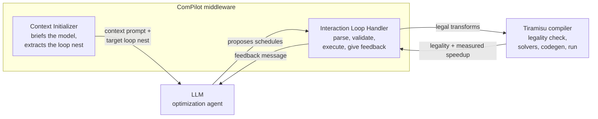
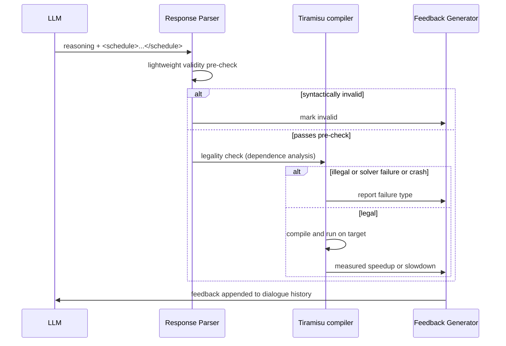

# ComPilot: LLM-Guided Loop Optimization Through a Compiler Feedback Loop

Source: https://arxiv.org/abs/2511.00592

ComPilot is an experimental framework that puts an off-the-shelf large language model (LLM) inside a closed loop with a compiler and asks it to optimize the performance of loop-heavy code. The model never rewrites the code itself. It proposes a sequence of loop transformations, the compiler checks whether the transformation is legal and measures the resulting speedup, and that concrete feedback goes back to the model so it can adjust its next proposal. Across the PolyBench benchmark suite the approach reaches a geometric mean speedup of 2.66x on a single run and 3.54x when you keep the best of five runs, with no task-specific fine-tuning of the model.

The paper, "Agentic Auto-Scheduling: An Experimental Study of LLM-Guided Loop Optimization" by Massinissa Merouani, Islem Kara Bernou, and Riyadh Baghdadi, was accepted at PACT 2025. This article walks through the problem it targets, the architecture of the loop, how a single optimization dialogue unfolds, what the experiments found, and where the approach fits alongside Alexey's own writing on building systems as loops rather than prompts.

## The Problem: Auto-Scheduling Is a Search Problem

To follow the rest of the article, you need three terms.

A loop nest is a set of nested loops - the kind you find at the core of matrix multiplication, stencils, and other numerical kernels. These nests are where scientific and machine-learning code spends most of its time, so they are the natural target for optimization.

A schedule is a sequence of loop transformations applied to a nest - operations like tiling (splitting a loop into blocks to fit cache), fusion (merging loops), interchange (swapping loop order), and parallelization. The same computation can be expressed by many schedules, and they can differ in speed by orders of magnitude on the same hardware.

Auto-scheduling is the task of finding a good schedule automatically. The search space is enormous, and picking a schedule that is both legal (it preserves the program's meaning) and fast is hard. Traditional tools attack this in two ways. Compiler heuristics, as in GCC and LLVM, apply fixed rules. Polyhedral optimizers such as Pluto model dependencies mathematically and derive transformations analytically. Both are strong, but neither uses direct measurement from the target machine while deciding, and both struggle to stay optimal across diverse code and hardware.

The paper's central question is whether a general-purpose LLM, grounded by real feedback from a compiler, can guide this search well enough to compete. The interesting constraint is "off-the-shelf": no fine-tuning, no gradient updates, only what the model already knows plus what it learns inside a single conversation.

## Architecture: LLM, Middleware Modules, and Compiler

ComPilot sits between three actors: the LLM that proposes transformations, a set of middleware modules that translate and validate those proposals, and the Tiramisu compiler that applies transformations, checks legality with polyhedral dependence analysis, and runs the code to measure speed. The middleware is the part the authors built. It is where proposals get parsed, filtered, executed, and turned back into feedback.

The high-level structure looks like this.

The division of labor is the core design decision. The LLM does high-level strategy - which transformations to try and in what order. The compiler owns correctness and measurement. The model never touches the actual code, so an illegal or nonsensical idea can never produce a wrong result. It can only produce a rejected proposal. That separation is what lets the authors use an untrained model safely on a task where a subtle mistake would otherwise corrupt output.

The middleware has two parts that map to two phases of every session: the Context Initializer runs once at the start, and the Interaction Loop Handler runs the repeated back-and-forth. The next two sections take them in that order.

## The Context Initialization Phase

Before any optimization happens, the Context Initializer sets the stage through three messages to the model.

The first message is a fixed context prompt, sent as system instructions and identical for every program. It defines the model's role as a compiler optimization assistant and specifies the process flow, the required input and output formats, the repertoire of transformations it may use, the hardware target, and how to react to errors and crashes. The transformation repertoire in this work is nine primitives: Loop Fusion, Shifting, Interchange, Parallelization, 2D Tiling, 3D Tiling, Unrolling, Skewing, and Reversal. That set is deliberately small - large enough to be expressive, small enough to keep the model's choices manageable. For the fiddly numeric parameters, such as skewing and shifting factors, ComPilot defers to Tiramisu's built-in solvers so the model does not have to compute them.

The second message presents the specific loop nest to optimize, formatted in a standardized C/C++ style. Two preprocessing steps matter here. Each computation block gets a unique identifier through an annotation comment, for example a comp_ID marker, so the model can point a transformation at a precise target. Then the iterator and buffer names are anonymized, replaced with neutral identifiers like a, b, c, buf0, buf1. Anonymization prevents the model from being swayed by variable names that hint at a purpose but carry no real information about the best schedule. The message also includes the nest's baseline execution time, giving the model a reference point for the hardware.

The third message asks the model to analyze the nest before proposing anything - to describe its structure, infer what it computes, and sketch candidate strategies. This analysis is a chain-of-thought step, meaning the model reasons out loud before acting, and the paper shows experimentally that keeping it improves results. Only after this analysis does the Context Initializer hand control to the loop handler.

## The Iterative Optimization Phase

This is where the loop runs. Each iteration is one action-observation cycle: the model proposes, the middleware executes, the compiler reports, and the report becomes the model's next observation. The conversation thread itself is doing double duty - it is both the interface the agent acts through and its episodic memory, the running record of what it has already tried and how each attempt turned out.

The sequence below shows one iteration end to end.

The model's reply has a required structure. It must contain a reasoning section that explains why it is proposing this transformation sequence given past feedback, and then the actual sequence wrapped in schedule tags. The Response Parser extracts the schedule from those tags. Enforcing the structure is what makes automated extraction reliable.

Extraction feeds a two-stage correctness check. The first stage is a lightweight, compiler-independent filter that rejects malformed syntax, unknown identifiers, and violated preconditions - for example, loop interchange requires a perfectly nested loop. This cheap check saves the cost of invoking the compiler on obviously broken proposals. Anything that survives goes to the second stage: Tiramisu's formal legality check, which uses polyhedral dependence analysis to guarantee the transformation preserves the program's semantics. This is the correctness guarantee that lets the whole system trust an untrained model.

For a legal schedule, the parser emits the matching Tiramisu API calls, invokes the internal solvers where parameters are needed, compiles the result, and runs it on the target machine to measure the actual speedup or slowdown.

The Feedback Generator then tells the model what happened. It distinguishes five outcomes.

- Invalid schedule: the proposal failed the lightweight syntax and precondition check, and the feedback explains the specific reason.
- Illegal schedule: the compiler's legality checker found the schedule violates data dependencies.
- Solver failure: Tiramisu could not find valid parameters for skewing or shifting.
- Compiler crash: the compiler crashed, usually on an invalid transformation the rule set did not catch, and any error message is passed along.
- Successful execution: the code ran, and the feedback carries the measured speedup or slowdown as the ratio of original to transformed execution time.

This message is appended to the dialogue history. On the next turn the model reads the whole updated context and uses in-context learning - its ability to adapt from examples inside the prompt, without any weight updates - to interpret the feedback and refine its strategy. That is the entire learning mechanism. There is no training loop, only a conversation that accumulates evidence.

The loop stops when the model issues a no_further_transformations command and the handler chooses not to push it further, or when an iteration limit is reached. The authors note a practical wrinkle: models tend to stop too early, either right after a big speedup jump out of caution, or after a run of failures where they get stuck in a local optimum. To counter early stopping, the handler can prompt the model to keep exploring. To counter local optima, ComPilot restarts the whole dialogue from scratch several times and keeps the best result - the multi-run strategy behind the best-of-five numbers.

## What the Experiments Found

The evaluation ran on PolyBench, a standard suite of 30 numerical kernels, across five dataset sizes each, for 150 benchmark instances. The primary model was gemini-2.0-flash, chosen for its balance of cost and quality. Because LLM output is stochastic, the authors ran 40 independent runs per instance and reported the median per instance and the geometric mean across instances, with bootstrapped 95% confidence intervals.

The headline results are consistent across the paper.

- Single run after 30 iterations reached a geometric mean speedup of 2.66x over the original code, with a 95% confidence interval of [2.60, 2.77].
- Best-of-five runs reached 3.54x over the original code, and 2.94x over Pluto, the state-of-the-art polyhedral optimizer.
- Against Pluto directly, best-of-five outperformed it on 119 of 150 instances.
- On some large instances the gains were dramatic: correlation_XLARGE hit a median 339x by parallelizing outer loops and adding tiling and unrolling, and trmm_XLARGE reached 183x through interchange that enabled outer-loop parallelization.

The behavior is adaptive to input size. For large inputs the model favors thread-level parallelism to use all 48 threads on the test machine. For small inputs it leans toward locality-preserving transformations like tiling and skewing. A handful of benchmarks with complex loop-carried dependencies - cholesky, durbin, ludcmp - barely moved, because few legal transformations exist within the nine-primitive set.

Cost is not trivial. A 30-iteration run averaged about 8.9 minutes per instance, ranging from roughly 16 minutes for the largest inputs down to 5 to 6 minutes for smaller ones. The striking part is where the time goes: only 1 to 3 minutes is LLM communication, while about 78.5% of wall-clock time is the compiler checking legality, compiling, and running code to measure it. Token usage grows non-linearly because each turn resends the full history and unproductive turns still consume tokens.

The model's aim is far from perfect. Averaged over runs at 30 iterations, only 36.1% of proposed schedules were runnable, while 31.4% were invalid and 32.5% were illegal. Roughly two-thirds of proposals are wasted attempts. There is a learning signal in the trend, though: illegal proposals start near 60% at the first iteration and fall as the dialogue progresses, which suggests the model is absorbing the negative feedback.

Model choice matters. The authors tested eight LLMs. Top general-purpose models clustered together - gemini-2.0-flash at 2.66x, gpt-4o at 2.63x, gpt-o3-mini strong as well - while coding-specialized models lagged, with codestral at 1.75x. The table below shows single-run geometric mean speedups at increasing iteration counts.

| LLM | T=5 | T=10 | T=20 | T=30 |
|-----|-----|------|------|------|
| gemini-2.0-flash | 1.83 | 2.06 | 2.49 | 2.66 |
| gpt-4o | 1.98 | 2.26 | 2.51 | 2.63 |
| llama3.3 (70B) | 1.86 | 2.11 | 2.33 | 2.47 |
| qwq (32B) | 2.02 | 2.21 | 2.35 | 2.36 |
| qwen2.5-coder (32B) | 1.84 | 1.99 | 2.11 | 2.14 |
| codestral-2501 (22B) | 1.44 | 1.55 | 1.69 | 1.75 |

Two findings stand out from that comparison. Reasoning models did not reliably beat strong non-reasoning ones, which hints that the feedback loop itself supplies much of the guidance that reasoning would otherwise provide. And general code-generation skill did not translate into strong scheduling, since the coding-tuned models trailed. Older models that could not follow the structured output format had to be dropped entirely, so a baseline of instruction-following is a hard requirement.

## Two Ablations That Justify the Design

The paper runs two ablations that are worth calling out, because each isolates a design choice that also shows up in production LLM systems generally.

The first tests whether feedback matters. The authors compared standard ComPilot against a version where the model proposes schedules but never learns their outcome - an open-loop search. With feedback, results were consistently better, and the gap widened with more iterations: about 23% higher speedup at 30 iterations with gemini-2.0-flash, and about 40% with gpt-4o. The paper frames the feedback as playing a role analogous to retrieval-augmented generation (RAG), where external factual context grounds the model's next output. The difference is that the context here is not a static document store but is generated dynamically from the compiler and the machine. Without it the model runs blind.

The second tests whether delegating code generation to the compiler is better than having the model write the optimized code directly. The direct-generation variant asked the model to rewrite the C kernel and verified correctness by comparing output against the original. It underperformed on three fronts. Speed was 14 to 16% lower. Correctness was unreliable: of transformations that passed the output-comparison check and looked faster, 17.6% produced wrong output when re-tested with random inputs, exposing the false positives that output comparison misses but formal dependence analysis catches. And cost was much higher, roughly 5.3x more tokens, because emitting full C code takes far more tokens than emitting a short transformation command. This ablation is the strongest argument for the whole architecture: let the model decide strategy, let the compiler own correctness and code generation.

## What Makes This Interesting

A few observations sit above the individual numbers.

The correctness guarantee comes from the environment, not the model. Because Tiramisu formally verifies every transformation, an untrained, stochastic model can be used on a task where a wrong answer is unacceptable. The system is safe by construction, so the model is free to be creative and even wrong most of the time.

Failure is cheap and informative. Two-thirds of proposals fail, but each failure is a labeled example the model reads on its next turn. The loop converts a noisy generator into a competent optimizer without any weight updates, purely through in-context learning over accumulated feedback.

The bottleneck is the environment, not the model. With most of the wall-clock time spent compiling and measuring rather than talking to the LLM, the practical limit on this class of system is how fast you can evaluate a proposal, not how fast the model can generate one. That reframes where optimization effort should go.

The limits are honest. The authors are clear that inefficient exploration, the need for multiple runs, and complex-dependency kernels that barely improve are real costs. Their proposed directions - richer feedback such as the exact dependency that was violated or hardware performance counters, hybridizing with systematic search to escape local optima, and summarizing the dialogue to control context growth - all point at the same lever: give the agent a better signal from its environment.

## How This Connects to Alexey's Writing

The paper is a concrete, measured instance of a theme Alexey has written about directly. His article argues that the important shift in AI engineering is moving from crafting prompts to building loops - systems that generate, check against grounded feedback, gate what passes, and iterate without a human watching each step. ComPilot is almost a textbook version of that pattern applied to compiler optimization, which makes his writing a useful companion read. The links below are the ones from his articles page that map most directly onto the paper's ideas.

- Loops Over Prompts: How AI Engineers Build Systems That Don't Need Hand-Holding - https://alexeygrigorev.com/articles/ - the direct parallel: ComPilot replaces prompt-tuning with a generate-evaluate-gate loop, exactly the shift this article describes, and its compiler feedback is the grounding that makes the loop work.
- The 3Gs coding workflow (guides, gates, guards) by Luca Rossi - https://refactoring.fm/p/my-ai-coding-workflow-b09 - ComPilot's legality check is a hard gate: a deterministic check that blocks incorrect transformations before they can ship, the same role gates play in Alexey's loop framework.
- CRISP-DM for AI - https://aishippinglabs.com/blog/crisp-dm-for-ai - defining a measurable success metric before building; ComPilot's success metric is measured speedup on the target machine, set up front just as this piece recommends.
- What is an AI engineer, based on 1,000+ job descriptions - https://aishippinglabs.com/blog/what-is-an-ai-engineer-based-on-job-descriptions - the paper explicitly compares its feedback loop to RAG and frames the model as an agent, the two skills this analysis tracks as central to the role.
- Context architecture, via the Nielsen Norman Group - https://www.nngroup.com/articles/context-architecture/ - ComPilot's dialogue history is deliberately engineered context serving as the agent's episodic memory, an instance of the context-assembly discipline described here.

The through-line is that the paper validates, with hard benchmark numbers, the claim Alexey makes about workflow: the win comes from the loop and the grounded feedback around the model, not from a cleverer single prompt. The feedback ablation - a 23 to 40% gain purely from closing the loop - is the quantitative version of that argument.

## Technologies

- LLMs: gemini-2.0-flash (primary), gpt-4o, gpt-o3-mini, llama3.3, gemma3, qwq, qwen2.5-coder, codestral, accessed via cloud APIs or run locally, all without fine-tuning
- Compiler backend: Tiramisu, used for polyhedral legality checks, internal solvers for transformation parameters, and code generation
- Transformation primitives: Loop Fusion, Shifting, Interchange, Parallelization, 2D Tiling, 3D Tiling, Unrolling, Skewing, Reversal
- Benchmarks: PolyBench/C 4.2.1, 30 kernels across 5 sizes, 150 instances
- Baseline: Pluto polyhedral optimizer
- Hardware: dual-socket Intel Xeon E5-2695 v2, 48 threads, 128GB RAM

## Sources

[^1]: https://arxiv.org/abs/2511.00592
[^2]: https://arxiv.org/html/2511.00592v2
[^3]: https://alexeygrigorev.com/articles/
[^4]: [20260630_144823_AlexeyDTC_msg4647.md](../../inbox/used/20260630_144823_AlexeyDTC_msg4647.md)
