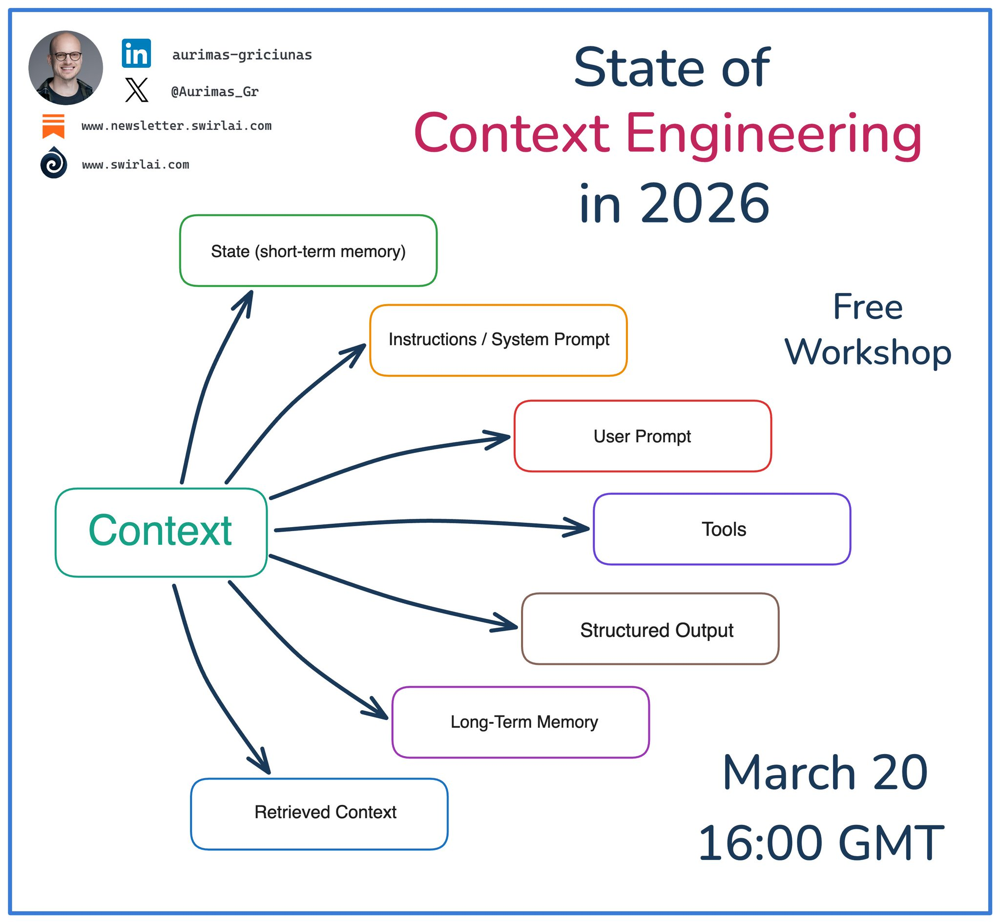

# Context Engineering and the 12 Factors of AI Agents

Research into context engineering as the core discipline for building reliable AI agents. The 12 Factors of AI Agents framework applies software engineering principles to agent development, arguing that agents are just software and should be built accordingly.

## What I Want to Understand

How context engineering principles and the 12-factor agent framework can improve agent reliability. The core claim is that everything in making agents good comes down to context engineering - getting the right tokens into the model so it gives good answers.[^1]

## Resources

## 12 Factors of AI Agents (Talk)

[Source](https://youtu.be/8kMaTybvDUw)

Overview: A talk by the creator of Human Layer who interviewed 100+ founders, builders, and engineers building production agents. The key finding: most production agents are not that agentic at all - they are mostly deterministic software with small LLM-powered loops. The talk presents the 12 Factors of AI Agents, a framework inspired by the original 12-Factor App methodology from Heroku. The associated GitHub repo reached 4,000 stars in a month with 14 active contributors.

Key Ideas:
- The journey many builders experience: get an agent to 70-80% quality (enough to excite the CEO), then realize that getting past that bar means going seven layers deep into a call stack trying to reverse engineer how prompts get built and tools get passed in
- Not every problem needs an agent. Example: building a DevOps agent that runs make commands ended up requiring such detailed step-by-step instructions that a bash script would have taken 90 seconds
- Most production agents are mostly just software with small agentic loops. The patterns that make LLM-based apps good are small modular concepts applied to existing code, not greenfield rewrites
- This is not an anti-framework talk. Think of it as a wish list - feature requests for how frameworks can serve builders who need high reliability while still moving fast

Factor 1 - Structured Output:
- The most magical thing LLMs can do has nothing to do with loops, tools, or code. It is turning a natural language sentence into structured JSON
- It does not matter what you do with that JSON - the other factors handle that

Factor 4 - Tool Use Considered Harmful:
- "Tool use" as a concept is harmful - not giving agents access to the world (that is obviously useful), but the idea that tool use is some magical thing where an ethereal alien entity interacts with its environment
- What happens: the LLM outputs JSON, deterministic code does something with it, and maybe the result gets fed back
- Tools are just JSON and code. If you can get the LLM to output structured data, you can pass it into a loop or a switch statement. There is nothing special about tools

Factor 8 - Own Your Control Flow:
- Code is a graph. If you have written an if statement, you have written a directed graph
- The agent promise was: you do not have to write the DAG, just tell the LLM the goal and it will find its way there. This is modeled as a simple loop where the LLM determines the next step
- In practice, the naive loop does not work for longer workflows. Long context windows degrade quality. Even with 2 million tokens in Gemini, tighter and smaller context windows produce better results
- An agent is just: a prompt (instructions for selecting the next step), a switch statement (routes model output), a context window (accumulates state), and a loop (determines exit conditions)
- Owning the control flow enables: break, switch, summarize, LLM-as-judge, and other patterns

Factor 2 - Own Your Prompts:
- Some abstractions generate great prompts that would take months of "prompt school" to build by hand
- But eventually, to get past a quality bar, you end up writing every single token by hand
- LLMs are pure functions. The only thing that determines agent reliability is how good the output tokens are, and the only thing that determines output tokens is the input tokens

Context Engineering:
- LLMs are pure functions - tokens in, tokens out
- Everything in making agents good is context engineering: prompt, memory, RAG, history - it is all about getting the right tokens into the model
- Own how you build your context window. You can model event state and thread history however you want and stringify it however you want
- If you are not looking at every single token and optimizing the density and clarity of information passed to the LLM, you might be missing quality upside
- Do not just blindly put things on the context window. If you have errors followed by a valid tool call, clear the pending errors out. Summarize. Figure out what to tell the model to get better results

Small Focused Agents (Micro Agents):
- What works in practice: a mostly deterministic DAG with small agent loops of 3-10 steps
- Human Layer example: their deploy pipeline is mostly deterministic CI/CD code. When a GitHub PR is merged and tests pass, it sends to a model that says "get this thing deployed." A human can redirect ("do backend first"). The agent deploys, then goes back to deterministic end-to-end tests
- 100 tools and 20 steps are manageable with this approach because context stays clean and responsibilities are clear
- The evolution: start with a mostly deterministic workflow, sprinkle LLMs into your code. Over time, LLMs handle bigger tasks until the whole pipeline is run by an agent

Contacting Humans:
- Many builders avoid the important choice at the beginning of output: deciding between a tool call and a message to the human
- Push that emphasis to a natural language token. The model can output "I'm done" or "I need clarification" or "I need to talk to a manager"
- This enables outer-loop agents that collaborate with humans through various channels (email, Slack, Discord, SMS)

Key Insights:
- Agents should be stateless. You should own the state and manage it however you want
- Pause and resume: put your agent behind a REST API or MCP server, serialize the context window to a database when a long-running tool is called, load it back when the callback arrives
- The agent does not even know things happened in the background
- Find the bleeding edge: something right at the boundary of what the model can do reliably, then engineer reliability into the system to make it work anyway. That creates something better than what everyone else is building
- The right tools should take away the hard non-AI parts so builders can focus on the hard AI parts: getting prompts right, getting flow right, getting tokens right

Quotes:
- "Most production agents weren't that agentic at all. They were mostly just software."
- "Everything in making agents good is context engineering."
- "LLMs are pure functions. Token in, tokens out."
- "Not every problem needs an agent."
- "Find something right at the boundary of what the model can do reliably, and if you can figure out how to get it right reliably because you've engineered reliability into your system, then you will have created something magical."[^1]

## State of Context Engineering in 2026 (Workshop)

[Source](https://x.com/Aurimas_Gr/status/2034035800548192258)

Aurimas Griciuinas posted about context engineering becoming a must-have skill for AI Engineers in 2026. He hosted a free live workshop on March 20th covering the core patterns defining context engineering, key trade-offs between context management strategies, and how to apply these patterns to build more effective agentic systems[^3].

The post includes a diagram that breaks context engineering into seven components:

1. State (short-term memory)
2. Instructions / System Prompt
3. User Prompt
4. Tools
5. Structured Output
6. Long-Term Memory
7. Retrieved Context

<figure>
  
  <figcaption>State of Context Engineering in 2026 - context is not just the prompt, it encompasses seven distinct input/output channels</figcaption>
  <!-- Promotional graphic for a free workshop showing a central "Context" node with arrows to seven components that together define context engineering as a discipline -->
</figure>

This taxonomy extends the idea of context engineering beyond just "prompt engineering" - it covers state management, tool definitions, output structure constraints, memory (both short and long term), and retrieval. It aligns with the 12 Factors framework above where owning the context window means managing all these channels, not just the prompt text[^3].

## Webinar Plans

I want to prepare material about context engineering, probably as a couple of webinars to promote the course[^3].

## Notes

The 12 Factors framework connects directly to spec-driven development research. Both highlight owning the process rather than delegating everything to the LLM. The spec-driven approach controls what goes into the model (specifications, requirements, design docs), while the 12 Factors framework controls how the agent operates (control flow, context window, state management).

The micro agents pattern (3-10 steps in a mostly deterministic pipeline) aligns with how the Telegram writing assistant works: mostly deterministic processing steps with small LLM-powered loops for categorization and content extraction.

## Sources

[^1]: [Context Engineering and 12 Factors of AI Agents - YouTube](https://youtu.be/8kMaTybvDUw) via [20260312_074814_AlexeyDTC_msg2847.md](../../inbox/used/20260312_074814_AlexeyDTC_msg2847.md)
[^2]: [20260312_074901_AlexeyDTC_msg2850_transcript.txt](../../inbox/used/20260312_074901_AlexeyDTC_msg2850_transcript.txt)
[^3]: [20260318_121307_AlexeyDTC_msg2998.md](../../inbox/used/20260318_121307_AlexeyDTC_msg2998.md)
