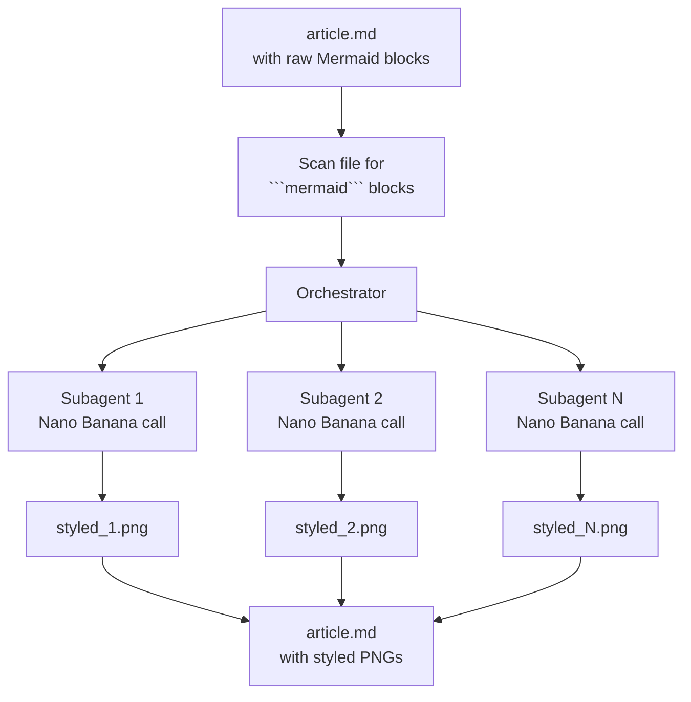
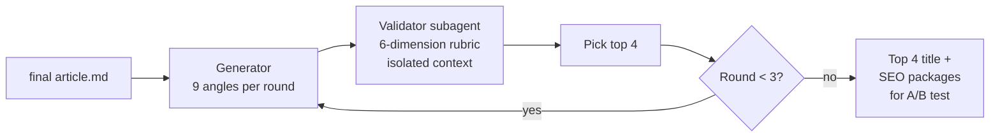
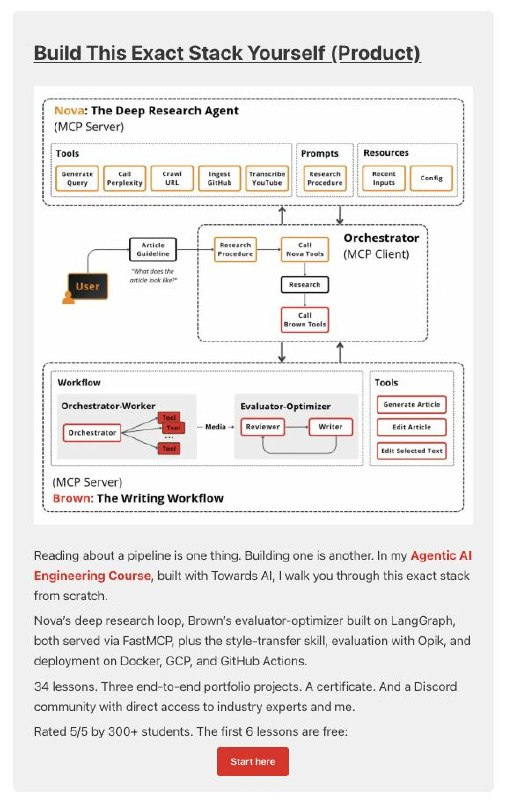

# Decoding AI Content Pipeline: Paul Iusztin's Agentic Writing Workflow and Branded Mermaid Images

[Primary source](https://www.decodingai.com/i/194297155/generating-branded-images)

Paul Iusztin (founder of Decoding AI, co-author of the LLM Engineer's Handbook) publishes one in-depth technical article per week. He built an agentic pipeline that automates around 90% of the writing work so he can keep building instead of writing full time. One of the more interesting pieces of that pipeline is the step that turns plain Mermaid diagrams into branded, styled PNGs using Gemini's Nano Banana model. This article pulls out what his system does, how the branded-image step works, and what you could copy for the telegram-writing-assistant agent.

Valeriia has been studying Paul's content - his newsletter and his social media. He recently shared an agent that writes his social media posts, with workshop code included, and then a separate newsletter issue about an agent that writes his Substack articles. She assumes Paul uses all of this to promote his own AI engineering course[^2]. Paul has not released the code for the full Substack-writing agent, which she reads as a deliberate choice because it is his personal development and he teaches this on the course[^2].

She flagged Paul's article[^9] as something that could improve the telegram-writing-assistant agent. Both the pipeline itself and the social-posts side are interesting. She wanted to sit down and understand how it works end-to-end (how it works from an engineering perspective) so she could apply it in her own work or for improving the agent. She is not yet at the level of someone who understands the engineering fully, but gets some of it. The missing piece is just the time to dig in, which she did not have[^10]. Alexey then asked to research both the article and how Paul generates his branded diagrams, including online research on the Mermaid styling techniques[^11].

## What You Get From This Article

The article covers three groups of things:

1. Paul's full pipeline at a high level - five components plus a memory layer, who does what, how they hand off work.
2. The Mermaid-to-branded-image step in detail - the orchestrator-worker pattern, parallel subagents, the Gemini Nano Banana prompt, and the specific few-shot trick Paul says made it work.
3. Applying the same idea elsewhere - how Nano Banana works, how Mermaid theming compares as a cheaper alternative, and how this maps onto the telegram-writing-assistant project that already produces Mermaid diagrams.

The first group is the architecture tour. The second is the part you care about if you want to copy one specific technique. The third ties it back to something you can use.

## The Overall Pipeline

Paul describes the system as five components plus a memory layer, connected through files on disk. Each component reads artifacts written by the previous one and writes its own. The filesystem is the contract. Per-component state lives in databases (PostgreSQL for Nova, SQLite checkpointer for Brown)[^1].

The five components are:

1. Nova - a deep research agent. Takes a topic plus "golden source" URLs, returns a structured research file.
2. Brown - a writing workflow. Takes the article guideline and the research file, returns a styled article using an evaluator-optimizer loop.
3. Media style transfer - a skill that finds Mermaid diagrams in the article and turns them into branded images.
4. Title and SEO generator - an expand-and-narrow loop that produces candidate titles, subtitles, SEO titles, and descriptions.
5. HTML exporter - a skill that converts the final markdown into platform-ready HTML for Substack, Medium, X, or LinkedIn.

Two of these (Nova and Brown) are MCP servers. The other three are skills. A harness like Claude Code or Cursor is the client that calls them.

```mermaid
flowchart LR
    Human[Human seed:<br/>topic, golden sources,<br/>brain dump, outline]
    Nova[Nova MCP server<br/>Deep Research agent]
    Brown[Brown MCP server<br/>Writing Workflow]
    Media[Media style transfer<br/>skill]
    SEO[Title and SEO<br/>skill]
    HTML[HTML exporter<br/>skill]
    Published[Published article<br/>Substack, Medium,<br/>X, LinkedIn]

    Human --> Nova
    Nova -->|research.md| Brown
    Brown -->|article.md<br/>+ raw Mermaid| Media
    Media -->|styled PNGs| SEO
    SEO -->|final article<br/>+ titles| HTML
    HTML --> Published
```



Paul is explicit that the human stays at the top. He does the research direction and a brain dump that reflects his experience. Nova expands the seed, Brown translates it into prose, and the three skills polish and ship the output. If you skip the seed step, the pipeline "produces generic AI mush"[^1].

The pieces below walk through the pipeline in roughly that order: first the research agent Nova, then the writing workflow Brown, then the branded-image step (which is the main interest for this article), then the title and HTML steps at the end.

## Nova: The Research Agent

Nova is an MCP server that exposes ten tools. The harness (Claude Code or Cursor) drives it through a skill that glues those tools into a deep-research algorithm. Nova takes an outline file as input and writes a research.md file as output[^1].

The loop has three stages:

1. Query generation - Nova compares the outline against the provided golden sources using Gemini Pro, finds the gaps, and generates the next round of queries. Three rounds hit the sweet spot between cost and coverage.
2. Concurrent retrieval - each round fans out parallel Perplexity calls. The calls return only metadata and a short summary per source.
3. Two-stage filtering - Nova full-scrapes only the top five sources scored on a four-dimensional rubric (trustworthiness, authority, relevance, quality). For the rest, only the summary is kept, which is enough to cite examples inline.

Nova ships one tool per source family: Firecrawl for web URLs, gitingest for GitHub repos, Gemini Pro directly on the URL for YouTube. State lives in PostgreSQL so a run can resume after a crash. The final output is a collapsible HTML research file that Brown reads next.

## Brown: The Writing Workflow

Brown is a LangGraph workflow, not an agent. Paul picked a workflow over an agent on purpose. Prose generation rewards predictability over exploration, so a fixed graph is a better fit than a free-running agent loop.

Brown does three things in order:

1. Generate all Mermaid diagrams the article needs, using an orchestrator-worker pattern. The orchestrator scans the article guideline for markers like "generate diagram", "create a diagram", or the explicit tag `[GENERATE_DIAGRAM]`. For each marker, it spins up a specialized Mermaid-diagram worker. The diagrams get passed into the prose generation step that follows.
2. Compose the system prompt from six "profile" classes.
3. Run an evaluator-optimizer loop over the draft.

The six profiles define the voice.

Four are generic and static:

- Structure - how prose is laid out on the page (sentences, paragraphs, lists, subheadings).
- Mechanics - grammatical rules like active voice, point of view, punctuation.
- Terminology - allowed vocabulary, banned filler.
- Tonality - formality level, voice, emotional register.

Two are customizable per user:

- Character - who is writing. Paul puts his biography here.
- Article - format-specific rules for structure, referencing, and citations. This is the slot you swap when you move from a Substack article to a LinkedIn post or an X thread.

Paul calls out two more things on top of the profiles. First, the LLM must respect the article guideline and research over anything else, which keeps it from hallucinating. Second, few-shot examples beat every other trick, because "showing works better than telling"[^1].

The first draft is generated at temperature 0.7 for variety.

Then the evaluator-optimizer loop kicks in:

- A Reviewer node at temperature 0.0 checks the draft against the guideline, research, and profiles. It returns structured review objects via Pydantic.
- If the Reviewer finds issues, an Editor node at temperature 0.1 applies the fixes.
- The loop runs for a fixed number of iterations, not until a quality score clears a threshold. Paul explains that for creative work a single quality score is noisy, so fixed iterations give better control over cost and latency.

Brown also exposes editing tools through its MCP interface, so the human can trigger another review-edit iteration on demand after reading the draft.

## Branded Images from Mermaid

This is the part Valeriia flagged as interesting for the telegram-writing-assistant agent[^2][^3]. Brown produces raw Mermaid source for every diagram in the article. Mermaid is fast and predictable to generate with an LLM, but the default output is visually generic. Paul's word for it is "ugly"[^1]. The style-transfer step takes the Mermaid structure and applies a branded styling layer on top.

The skill works like this:

1. Take the article file as input.
2. Scan it to detect every Mermaid block.
3. For each block, spawn a parallel subagent.
4. Each subagent sends the raw Mermaid text to a Gemini script that calls Nano Banana.
5. The script returns a styled PNG per diagram.

The subagents run in parallel because each diagram is independent. That matters for cost and latency when an article has nine or ten diagrams.



The prompt that each subagent sends to Nano Banana has three pieces:

- A written style reference. A file with color codes, fonts, and general guidelines, plus one representative branded image.
- Two positive few-shot examples. Each example is a pair: the raw Mermaid input and the branded PNG output it should produce.
- Two negative few-shot examples. Same pairing, but showing what the model should not produce.

Paul says the positive-plus-negative example pairs were "the special sauce". Style guidelines and one reference image alone were not enough. Seeing both the raw Mermaid and the desired output side by side gave Nano Banana enough signal to learn the mapping. He also warns that image few-shot examples burn through tokens quickly, so he keeps the set small (two positive and two negative) on purpose[^1].

Costs land around $0.30 to $1 per image, mostly Gemini credits. A nine-image article costs roughly $6. A single-diagram piece sits near $1.

## Title, SEO, and HTML Export

Title and SEO run as an expand-and-narrow loop. A generator produces nine candidate title/subtitle/SEO-title/SEO-description packages per round, each from a different angle (personal transformation, curiosity, bold claim, proof of work, etc.). A validator scores every candidate on six rubric dimensions using hybrid scoring (LLM judge for qualitative, heuristic penalties for hard limits like character count). The top four seed the next round. The loop runs three times, and the final top four get scheduled for A/B testing on Substack.

The validator runs as a subagent that does not share a context window with the generator. Paul applies the same principle in Brown (Reviewer vs Editor) and in Nova (filter step): fresh eyes prevent self-confirmation bias.



The HTML exporter is boring and necessary. It wraps Tivadar Danka's nb2wb CLI tool, which converts markdown (originally Jupyter notebooks) to formats for Substack, Medium, X, and LinkedIn. Paul exposes it as a skill so the harness can call it at the end of the pipeline.

## How This Ties to the Agentic AI Engineering Course

Paul says directly that this is the stack he teaches in the Agentic AI Engineering Course he built with Towards AI[^4]. The article embeds the course ad as an inline diagram that shows Nova and Brown as the two main building blocks of the stack:

<figure>
  
  <figcaption>Paul's inline ad for the Agentic AI Engineering Course, showing Nova and Brown as the two MCP servers with the orchestrator MCP client wiring them together[^9]</figcaption>
  <!-- This is the visual Valeriia referenced when she talked about Paul using the newsletter to promote the course, and it makes the Nova-plus-Brown architecture concrete at a glance -->
</figure>

The course walks through:

- Nova's deep research loop with FastMCP.
- Brown's evaluator-optimizer workflow with LangGraph.
- The style-transfer skill.
- Evaluation with Opik.
- Deployment on Docker, GCP, and GitHub Actions.

The course page mentions 34 lessons, three end-to-end portfolio projects, a certificate, and a Discord community. The first six lessons are free. Our existing research article covers the course in more detail - see [Agentic AI Engineering Course (Towards AI)](agentic-ai-engineering-course.md) for the full breakdown.

The article on decodingai.com is effectively a product page for that course, wrapped around a genuinely useful technical walkthrough. The technical details are the real content. The CTAs are the distribution mechanism. Worth being aware of when reading it.

## How Gemini Nano Banana Image Generation Works

Nano Banana is the nickname for Google's `gemini-2.5-flash-image` model. It is a natively multimodal model trained from the ground up to process text and images in one step[^5].

The capabilities that matter for the style-transfer use case are:

- Text-to-image. Generate an image from a text prompt.
- Image + text to image. Pass an image plus a prompt to edit the image (change style, colors, add or remove elements).
- Multi-image composition and style transfer. Pass multiple images and have the model combine elements or transfer style from one to another.
- Iterative refinement. Refine the output over several turns.

The model supports up to 14 reference images (up to five characters and ten objects). Each generated image is about 1290 output tokens, which prices out at roughly $0.039 per image at the base rate of $30 per million output tokens[^5]. Paul's $0.30 to $1 per image number is higher than that base rate, which suggests he is paying for multiple passes or larger reference bundles in each call.

A minimal Python call with the `google-genai` SDK looks like this:

```python
from google import genai
from PIL import Image

client = genai.Client(api_key="YOUR_API_KEY")

mermaid_source = open("diagram.mmd").read()
style_reference = Image.open("brand_reference.png")
positive_example_input = Image.open("pos_example_mermaid.png")
positive_example_output = Image.open("pos_example_styled.png")

prompt = f"""
Render the following Mermaid diagram as a branded PNG
matching the style reference. Keep the structure and
labels exactly. Apply the brand color palette and fonts.

Mermaid source:
{mermaid_source}
"""

response = client.models.generate_content(
    model="gemini-2.5-flash-image",
    contents=[prompt, style_reference,
              positive_example_input, positive_example_output],
)

for part in response.candidates[0].content.parts:
    if part.inline_data is not None:
        with open("styled.png", "wb") as f:
            f.write(part.inline_data.data)
```

Google's prompting guide for Nano Banana repeats the same advice Paul follows: describe the scene, don't just list keywords. Show, don't tell. And keep reference-image bundles small because they inflate tokens fast[^6].

## Mermaid Theming as a Cheaper Alternative

Before reaching for image generation, check whether native Mermaid theming gets you close enough. It is cheaper (free, deterministic, no API calls) and the output stays editable SVG instead of a fixed PNG.

Mermaid supports a `themeVariables` block in frontmatter config that lets you set brand colors, fonts, borders, and more[^7]:

```
---
config:
  theme: base
  themeVariables:
    primaryColor: "#d0d0d0"
    primaryTextColor: "#fff"
    primaryBorderColor: "#000"
    fontFamily: "Helvetica, Arial"
---
```

You must use the `base` theme because it is the only one you can modify. Colors must be hex, not named. You can also define custom classes with the `:::` syntax and apply styles per node.

The catch: Mermaid renders inside a shadow DOM, so external CSS does not reach the diagram. All styling must go through `themeVariables` or the `classDef` mechanism. That limits how far you can push the look.

A practical comparison:

| Approach | Pros | Cons |
|----------|------|------|
| Mermaid themeVariables | Free, deterministic, editable SVG, versioned with the source | Limited visual range, no custom icons, no real layout control |
| Nano Banana style transfer | Unlimited visual style, matches a brand reference | Around $0.30 to $1 per image, non-deterministic, output is a fixed PNG |
| Hybrid (theme first, image second) | Cheap baseline. Generate branded image only when you need the polished version | More code to maintain, two rendering paths |

For a weekly flagship article, the Nano Banana pass is worth the $6. For a daily newsletter with quick turnarounds, themed Mermaid probably wins.

## Prompt Patterns That Produce Consistent Branded Styling

Pulling together Paul's description and Google's prompting guide[^6], a few patterns show up repeatedly:

1. Narrative descriptions beat keyword lists. "A clean technical diagram with soft shadows, navy-blue node fills, white sans-serif text, and rounded corners" works better than "clean, navy, white, rounded".
2. Show the target, don't just describe it. A paired example (raw input, styled output) teaches the mapping. One reference image alone does not carry enough information.
3. Negative examples close the loop. Positive examples alone leave too much room for the model to pick the wrong variation. A "don't do this" example pins it down.
4. Keep the image bundle small. Two positive and two negative examples is the ceiling before tokens get expensive.
5. Separate style from content. Tell the model to preserve structure, node count, and labels. Tell it to change only colors, fonts, borders, and layout polish.
6. Isolate the styling subagent. Each diagram gets its own fresh context. That avoids bleed between diagrams and lets you run them in parallel.

## Other Tools and Approaches for Diagram Styling

A few adjacent tools show up in the space:

- Mermaid Chart and Mermaid AI - commercial editors on top of Mermaid with AI chat assistance and export to PNG or SVG[^8]. Good for authoring, limited for branding.
- Eraser.io AI Mermaid Editor - another AI-assisted editor[^8].
- Excalidraw and Excalidraw plus Mermaid - hand-drawn visual style, still free SVG, but not as structured as pure Mermaid.
- Diagrams-as-code with D2 or Graphviz - more layout control than Mermaid, still deterministic, but still generic-looking without theming work.
- Midjourney or Stable Diffusion with ControlNet - image-generation alternatives to Nano Banana. They support style transfer but do not natively understand diagram structure, so they tend to mangle labels.

Nano Banana is interesting for this use case because it natively handles text-plus-image inputs in one model call. You do not need a separate text-to-image stage. You pass the Mermaid source and a style reference together and get a rendered image back.

## What Makes Paul's Approach Interesting

A few details stand out as non-obvious:

- Files as the contract. Every component reads and writes plain files. That makes the pipeline debuggable, resumable, and human-in-the-loop friendly. You can open any intermediate artifact, edit it, and rerun downstream. Databases are for per-component state, not cross-component communication.
- Fixed-iteration evaluator-optimizer. Running the review-edit loop for a fixed number of iterations instead of until a quality score clears a threshold. The reasoning is that creative work has no clean score, so a quality gate makes latency and cost unpredictable.
- Isolated subagent contexts. Reviewer, validator, and filter all run with a fresh context window so they can't rubber-stamp the generator's work.
- Workflow over agent for writing. Brown is a LangGraph workflow, not an open-ended agent. Paul is explicit that for prose, predictability beats exploration.
- Negative few-shot examples. Paul specifically calls out that positive examples alone were not enough for the style-transfer step. The negatives closed the gap.
- Orchestrator-worker for media. The Mermaid-to-image step uses the same pattern as the Mermaid generation step inside Brown. Scan for markers, spawn one worker per marker, run in parallel. This generalizes to other media types (video, audio) without rethinking the architecture.

## Relevance to the Telegram Writing Assistant

The telegram-writing-assistant project already produces Mermaid diagrams inside research articles (see any of the articles under `articles/research/` with a ```mermaid block, for example `hermes-agent.md`, `openclaw.md`, and `claude-code-architecture.md`). Today those diagrams render with the default Mermaid theme. The branded-image step Paul describes is the piece you could bolt on top.

What would a telegram-writing-assistant version look like in practice:

1. A new skill that runs after article polish. Input: a markdown file with ```mermaid blocks. Output: the same file with each block replaced by (or complemented by) a styled PNG reference.
2. Per-diagram parallel calls to Nano Banana with a brand pack (color palette, fonts, one reference image, two positive examples, two negative examples) plus the raw Mermaid source.
3. Output written to `assets/images/{article_slug}/diagram_N.png` following the existing asset layout convention.

A cheaper interim step is to add Mermaid `themeVariables` frontmatter to match the Alexey/DataTalks.Club color palette before reaching for Nano Banana. That costs nothing per diagram and gets you a consistent baseline look. The Nano Banana pass is worth adding later for newsletter-flagship articles where the polish matters.

Two things to watch when adopting this:

- Cost. Paul's numbers ($0.30 to $1 per image) are per diagram. A research article with five diagrams is roughly $2.50. For daily output that adds up.
- Determinism. PNG outputs are fixed. When a diagram needs an edit, you either regenerate (more tokens, possibly different style) or touch up the PNG by hand. Keep the Mermaid source in the article as the source of truth and treat the PNG as a build artifact.

The existing research article on [Paul's paid course](agentic-ai-engineering-course.md) covers the broader course context. This article zooms in on the specific technique you could reuse.

## Sources

[^1]: Paul Iusztin, "How I Automated 91% of My Business with AI Agents" - primary source, https://www.decodingai.com/i/194297155/generating-branded-images
[^2]: [20260424_124837_AlexeyDTC_msg3605_transcript.txt](../../inbox/used/20260424_124837_AlexeyDTC_msg3605_transcript.txt) - Valeriia's voice note introducing Paul's content
[^3]: [20260424_124837_AlexeyDTC_msg3606_transcript.txt](../../inbox/used/20260424_124837_AlexeyDTC_msg3606_transcript.txt) - Valeriia's voice note on the Mermaid-to-Nano-Banana technique
[^4]: Paul Iusztin, "I Spent 9 Months Building an Agentic AI Engineering Course", https://www.decodingai.com/p/agentic-ai-engineering-course
[^5]: Google AI for Developers, "Nano Banana image generation", https://ai.google.dev/gemini-api/docs/image-generation
[^6]: Google Developers Blog, "How to prompt Gemini 2.5 Flash Image Generation for the best results", https://developers.googleblog.com/en/how-to-prompt-gemini-2-5-flash-image-generation-for-the-best-results/
[^7]: Mermaid docs, "Theme Configuration", https://mermaid.ai/open-source/config/theming.html
[^8]: Mermaid Chart blog, "Mermaid AI Is Here to Change the Game For Diagram Creation", https://docs.mermaidchart.com/blog/posts/mermaid-ai-is-here-to-change-the-game-for-diagram-creation
[^9]: [20260424_124837_AlexeyDTC_msg3607.md](../../inbox/used/20260424_124837_AlexeyDTC_msg3607.md) - Link to the Decoding AI article Valeriia shared
[^10]: [20260424_124837_AlexeyDTC_msg3608_transcript.txt](../../inbox/used/20260424_124837_AlexeyDTC_msg3608_transcript.txt) - Valeriia's follow-up on the article and the desire to understand how it works
[^11]: [20260424_124912_AlexeyDTC_msg3617_transcript.txt](../../inbox/used/20260424_124912_AlexeyDTC_msg3617_transcript.txt) - Alexey's instruction to research this article and look into Mermaid diagram styling
