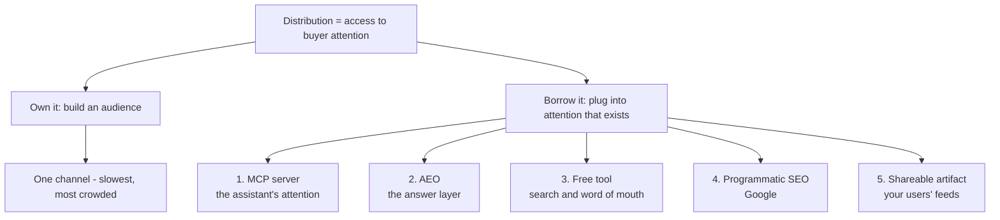
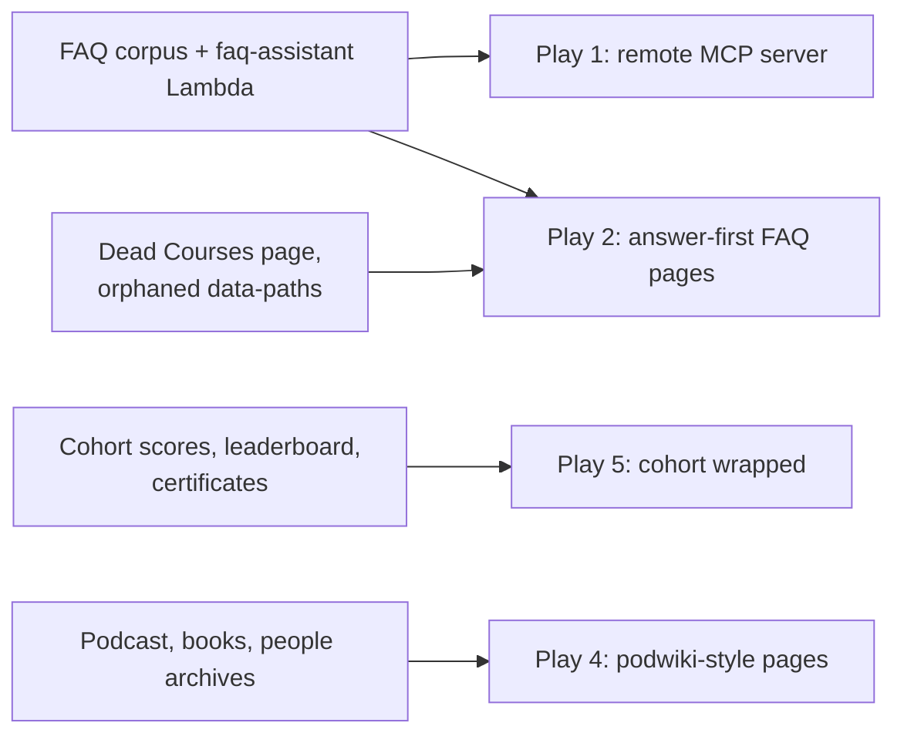
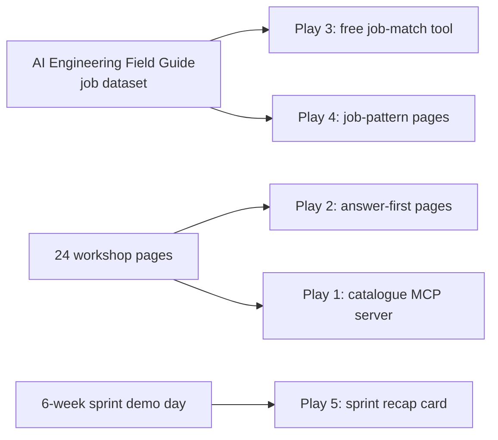

# Distribution Channels for Education Communities

[Do Not Waste the Next 12 Months Building an Audience](https://open.substack.com/pub/capitalofone/p/do-not-waste-the-next-12-months-building)

Melvin Luu writes Capital of One, a newsletter for solo founders. In July 2026 he published an essay arguing that "build an audience and post daily for two years" is only one distribution channel, and the slowest one. The essay lists seven plays that need no followers [^2]. This article covers the first five and what each one implies for DataTalks.Club and AI Shipping Labs [^1].

Who this is for: anyone deciding where the next few months of content and platform work at either organisation should go. The essay is written for a solo founder selling software, so most of the work here is translating it to a free open community and a small paid one.

## The argument

Luu defines distribution as access to your buyers' attention. His point is that an audience is one way to get that access, not the only way. You can also plug into attention that already exists somewhere else.

The essay opens with Jagalchi fish market in Busan. Downstairs, fish sellers have the customers and the trust. Upstairs, restaurants cook the fish you just bought. The restaurants need no sign and no menu, because the sellers hand the customer over. The restaurants don't own the attention - they sit inside it.

Every play in the essay is a version of the restaurant. Here is how the five plays covered here hang off that frame.

The rule Luu sets for himself is that every play comes with named companies and verifiable numbers. That holds up - the case studies are specific and linked. The closing advice is to pick two plays, one compounding and one fast, and that picking two slow plays is the common mistake.

The next five sections cover one play each: what the essay claims and what evidence it gives. After that comes the part that matters for us - what each play means for DataTalks.Club and for AI Shipping Labs, and where the essay doesn't transfer.

## Play 1: an MCP server as a sales channel

The claim: MCP (Model Context Protocol, the standard that lets AI assistants call outside tools) gives your product a second shelf. Instead of only living on your website, one useful function of your product also lives inside Claude, ChatGPT, and Cursor.

The evidence Luu gives:

- Anthropic counted more than 10,000 active public MCP servers at the end of 2025, against millions of software products that could have one. He compares the timing to building a mobile app in 2010.
- Context7 from Upstash fixes one problem - coding assistants hallucinating outdated library docs. He reports 53,000+ GitHub stars and 240,000+ weekly downloads with no traditional marketing.
- Firecrawl runs an open-source MCP server that gives Claude and Cursor users web scraping, with the paid API behind it.

The design rule he draws from both: successful servers are small. Pick one thing your product does that a person would rather ask for than click through, expose that function, host it remotely so nobody has to install anything, and publish it to the official MCP registry, Smithery, mcp.so, and PulseMCP.

## Play 2: answer engine optimization

The claim: assistants are becoming the first place buyers research, so the job is to be the source the assistant cites. Luu calls AEO in 2026 what SEO was in 2010.

The evidence:

- He cites SparkToro data that 60% of Google searches end without a click, rising to 80-90% when an AI Overview appears.
- ChatGPT accounts for around 92% of AI referral traffic, and that traffic converts at 7.1% - second only to paid search.
- AI referrals are still below 1% of total web traffic, which is what makes the window open.
- Design studio Broworks ran a 90-day sprint restructuring content into direct answers with schema markup. They report 10% of organic traffic coming from LLMs and 27% of that traffic converting into sales-qualified leads.
- One SaaS brand in HubSpot's compiled case studies grew AI-referred trials from 575 to 3,500+.
- From his own client work: 25 buyer questions identified, 12 pages rewritten as direct answers, placement in two comparison articles. Six weeks later the company appeared in 7 of 20 target prompts. Perplexity moved in two weeks, ChatGPT took over a month, Google's AI Overviews didn't move at all.

The part that's easy to miss: AEO doesn't only happen on your own site. Models pull from comparison articles, review sites, Reddit threads, directories, and roundups. So the work is twofold - write the cleanest answer on your domain, and get mentioned in the places the model already trusts.

The method is concrete. Ask ChatGPT and Perplexity the 20 questions your buyers would ask, log who gets cited, then target that list and re-check monthly.

## Play 3: a free tool that sells for you

The claim: give away a small tool that solves one painful problem, and your paid product becomes the obvious next step. The tool has to sit one step before the purchase.

The evidence:

- HubSpot's Website Grader, launched in 2007, graded over 4 million websites.
- Shopify's Business Name Generator, wrapped in 200+ landing pages targeting nearly 20,000 keywords. Foundation Inc. valued the traffic at $6M per month in equivalent ad spend.
- Ahrefs' free backlink checker, which ranks for the exact query its best customers type and caps the value at $129/month for the real product.
- Tweet Hunter, where two indie makers shipped one small free tool per month and reached a $10M exit in about 18 months with no ads and no audience.
- Photopea as the counter-example where the free tool is the whole business - one person, roughly $3M a year from ads.

Luu's three reasons this works: the person using the tool is already problem-aware, tools spread on their own, and until recently a tool cost months of engineering, so almost nobody has noticed the cost collapsed.

He also answers the obvious objection. A tool survives an assistant that can do the same thing in chat if it either does the job faster than a conversation or runs on data the model doesn't have.

The build sequence is instant value first, email capture second. Give the result immediately, gate the full report. Reverse that and nobody uses it.

### Free tools for DataTalks.Club

The cheapest tools are deterministic checks over inputs the learner already has. They can run in the browser, in GitHub Actions, or as a local CLI, so there is no per-use LLM bill. A score can link directly to the relevant lesson and double as a shareable artifact.

Two candidates fit almost every current module:

| Course and module | Tool ideas without paid LLM calls |
|---|---|
| ML Zoomcamp 1: Introduction | NumPy/Pandas readiness check; train/validation-split mistake detector |
| ML Zoomcamp 2: Regression | RMSE baseline calculator; feature leakage checklist |
| ML Zoomcamp 3: Classification | class-balance and threshold explorer; categorical-feature encoding checker |
| ML Zoomcamp 4: Evaluation | confusion-matrix playground; ROC/precision-recall threshold explorer |
| ML Zoomcamp 5: Deployment | Flask/FastAPI endpoint smoke tester; Dockerfile readiness checker |
| ML Zoomcamp 6: Trees and ensembles | tree-depth overfitting visualizer; XGBoost parameter sanity checker |
| ML Zoomcamp 8: Deep learning | image-shape and label validator; parameter-count and memory estimator |
| ML Zoomcamp 9: Serverless deep learning | Lambda package-size estimator; cold-start benchmark template |
| ML Zoomcamp 10: Kubernetes | manifest linter with course defaults; TensorFlow Serving request tester |
| Data Engineering Zoomcamp 1: Docker and Terraform | Docker/Terraform environment checker; cloud-cost configuration estimator |
| Data Engineering Zoomcamp 2: Orchestration | DAG dependency visualizer; idempotency and retry checklist |
| Data Engineering Zoomcamp 3: Warehousing | partition-and-cluster recommender from table statistics; SQL scan-cost estimator |
| Data Engineering Zoomcamp 4: Analytics engineering | dbt project structure checker; model-lineage visualizer |
| Data Engineering Zoomcamp 5: Data platforms | workload-to-platform comparison wizard; ingestion configuration validator |
| Data Engineering Zoomcamp 6: Batch | Spark partition-size calculator; local job-log bottleneck parser |
| Data Engineering Zoomcamp 7: Streaming | Kafka partition-throughput calculator; event-schema compatibility checker |
| LLM Zoomcamp 1: Agentic RAG | retrieval-pipeline readiness checklist; tool-call trace visualizer |
| LLM Zoomcamp 2: Vector search | embedding and index memory calculator; retrieval metric playground on an uploaded CSV |
| LLM Zoomcamp 3: Orchestration | workflow graph validator; failure-path checklist |
| LLM Zoomcamp 4: Evaluation | evaluation-set format validator; offline metric dashboard from uploaded results |
| LLM Zoomcamp 5: Monitoring | trace completeness checker; latency and token-cost calculator from exported logs |
| LLM Zoomcamp 6: Best practices | repository production-readiness scanner; prompt/config secret scanner |
| LLM Zoomcamp 7: Project | project rubric scorer from checked criteria; public demo smoke tester |
| MLOps Zoomcamp 1: Introduction | environment and dependency checker; baseline experiment template generator |
| MLOps Zoomcamp 2: Experiment tracking | MLflow run-completeness checker; experiment comparison dashboard from exported runs |
| MLOps Zoomcamp 3: Pipelines | pipeline DAG visualizer; data-contract validator |
| MLOps Zoomcamp 4: Deployment | serving benchmark harness; deployment configuration checklist |
| MLOps Zoomcamp 5: Monitoring | drift metric playground; monitoring-window calculator |
| MLOps Zoomcamp 6: Best practices | CI workflow checker; reproducibility scorecard |
| AI Dev Tools Zoomcamp 1: AI-native workflow | specification completeness checker; agent-session retrospective template |
| AI Dev Tools Zoomcamp 2: Full-stack app | OpenAPI contract validator; frontend/backend endpoint compatibility checker |
| AI Dev Tools Zoomcamp 3: Test and deploy | test-pyramid report; container and deployment smoke-test generator |
| AI Dev Tools Zoomcamp 4: DevOps | telemetry coverage checker; alert-rule and runbook linter |
| AI Dev Tools Zoomcamp 5: Agent capabilities | MCP manifest checker; skill and agent permission inventory |
| Stock Markets Analytics 1: Data sources | ticker/date coverage checker; missing-trading-day detector |
| Stock Markets Analytics 2: Pandas | dataframe quality profiler; return-calculation validator |
| Stock Markets Analytics 3: Modeling | walk-forward split generator; feature leakage checker |
| Stock Markets Analytics 4: Strategy simulation | transaction-cost sensitivity calculator; backtest bias checklist |
| Stock Markets Analytics 5: Deployment | scheduled-job readiness checker; stale-data alert generator |

The cross-course candidates are stronger than many module-specific tools because they lead naturally to a course choice:

- A course readiness router scores Python, SQL, Git, Docker, cloud, statistics, and linear algebra, then recommends a starting course and modules to review.
- A CV evidence checker looks for concrete shipped systems, scale, evaluation, deployment, and impact. A deterministic version can inspect headings, dates, links, and measurable claims without judging prose.
- A portfolio scanner checks that repositories are public, runnable, tested, documented, deployed, and linked to a demo. GitHub metadata and repository files supply most of the signal without an LLM.
- A project rubric preview lets students self-score against the published certificate rubric before peer review.

Start with one cross-course tool and one module-specific tool where the input and expected answer are unambiguous. The readiness router and portfolio scanner have the clearest path from result to registration.

### Free tools for AI Shipping Labs

AI Shipping Labs can use the same no-LLM-first rule. The free result should be useful on its own, while interpretation and implementation support belong in the paid community.

- An AI-engineering job-match report can compare explicitly selected skills with the Field Guide's structured job data. Start with filters and weighted counts; offer personalized discussion inside the community.
- A portfolio evidence scanner can check repository metadata, README sections, tests, deployment links, release activity, and demo assets. The paid course helps fix the gaps.
- An eval-set readiness checker can validate schema, label balance, coverage tags, duplicates, and train/eval contamination. It does not need to generate cases.
- A six-week project scope calculator can convert available hours, dependencies, and deployment needs into a risk score and recommended milestone count.
- A workshop router can map a checked list of problems to the existing catalogue. This is a static decision tree over curated metadata.

LLM features can be optional and user-funded: let people paste their own model output, provide a prompt they can run in their existing assistant, or accept an API key stored only in the browser. The default product should remain useful without any model call.

## Play 4: programmatic SEO

The claim: find a keyword pattern that repeats across thousands of variations, build one useful template, fill it with real data, and publish at scale.

The evidence:

- Nomad List and Remote OK, which Luu uses to argue that Pieter Levels is the right example for the wrong reason - the audience is one pipe, and programmatic SEO built years ago is another.
- Failory's own write-up of getting 97,450 users a month this way.

The structural requirement is a repeatable template plus specific inputs - prices, locations, examples, reviews, ratings, whatever the searcher came for. The template gives structure, the inputs give usefulness.

Two constraints Luu is firm about. Validate the pattern before building: you want hundreds of low-competition variations, not one giant keyword. And publish 100 pages first, then watch indexation in Search Console - if Google indexes 80% or more, scale; if it ignores half, the pages are too thin.

The line separating this from mass-produced junk is the human review step. His words: the gap between people who do this well and people who publish 10,000 pages of slop is that review.

### Programmatic pages worth testing

For DataTalks.Club, the strongest templates render existing canonical data instead of inventing new text:

- Course × module pages that combine the lesson, FAQ entries, homework, prerequisites, and related community resources.
- Technology × course pages such as "Docker in Data Engineering Zoomcamp" or "evaluation in LLM Zoomcamp", generated from a shared concept index.
- Podcast topic and guest pages that build on podwiki's existing structured archive.
- Book × topic and speaker × topic pages where the archive already has enough real references to be useful.

For AI Shipping Labs, the defensible input is member and job-market data:

- AI role × skill, role × city, and skill × city pages generated from the Field Guide dataset.
- Workshop × problem and workshop × prerequisite pages generated from the curated workshop catalogue.
- Public, opt-in project pages organized by stack, use case, and maturity stage.
- Course comparison pages based on actual outcomes, prerequisites, and artifacts rather than generic prose.

Every page should render from one source of truth, expose the underlying data or examples, and be reviewed before publication. The first experiment is 100 pages, with an indexation and usefulness check before scaling.

## Play 5: something your users want to show off

The claim: give people a result that says something flattering about them, make it easy to share, and they will post it with your product attached.

The evidence:

- Spotify Wrapped reached 200 million engaged users in 24 hours in 2025 and was shared over 500 million times.
- GitHub's contribution graph, Duolingo streaks, and Strava's Year in Sport as the same mechanic for identity rather than a feature.
- Wordle as the solo proof. Josh Wardle noticed players manually typing emoji grids to share results, so he built the grid into the game. It went from 90 players to 300,000 in two months, then 2 million a week later.

The design pattern across all of them: the artifact is about the user's identity, not your feature. "You're in the top 8%" beats "Powered by our product". It's clean enough to post without embarrassment. And it's time-bound, so everyone shares at once and it becomes a wave rather than a trickle.

His starting move is diagnostic rather than creative. Look at your support inbox and social mentions to find what people already screenshot. They may already be sharing something ugly.

That covers the five plays. The rest of this article is about what they imply for two organisations that already exist, with the assets they already have.

### Better shareable artifacts

Certificates already prove completion, but they say little about what the learner did. Keep the certificate as the credential and give it a public evidence page:

- DataTalks.Club: completed modules, homework streak, peer reviews contributed, project title, demo and repository links, optional cohort percentile, and a compact share card.
- AI Shipping Labs: the six-week goal, milestones completed, shipped artifact, demo link, before-and-after scope, and an optional testimonial or peer note.

The public page should be the stable destination and the generated image should be the thing people post. Both need privacy controls: students choose whether scores, rank, repository, and project details are public. A cohort-wide launch day creates the wave Luu describes; an individual card generated at arbitrary times does not.

## What this means for DataTalks.Club

DataTalks.Club is the open side: free Zoomcamps, a Slack community, a podcast archive, events, and a public site. The plays land unevenly here, because the assets are unusual. There's a lot of structured content and a lot of students, and almost no product to sell.

### The FAQ is already an MCP server waiting to happen

The FAQ assistant is a single AWS Lambda that answers course questions in Slack using zerosearch over the FAQ content. That's one function, doing one job, already deployed. Exposing it as a remote MCP server is a small addition to infrastructure that exists, not a new project.

It also fits Luu's test for a tool that survives a chat window: it runs on data the model doesn't have. Cohort deadlines, homework rules, and the accumulated per-module answers aren't in any model's weights.

The registry step matters as much as the build. A local server nobody can find is a demo. Publishing to the official registry and relevant catalogues is what makes it distribution.

### AEO argues for finishing the Courses page

The unified platform document records that the Courses navigation item on datatalks.club doesn't point to a course listing - it links to a single blog post, and the courses collection holds one stale 2021 file with a "Nothing here, come back later" message [^8].

Read through the essay's lens, that's not only a navigation problem. When someone asks an assistant "what's the best free data engineering course", there needs to be a page for the model to cite, and right now there isn't one. Same for the six role learning paths in data-paths, project-of-the-week, and the reading clubs - all reachable only through Slack or direct GitHub links.

The FAQ is closer to AEO-ready than anything else in the org. It's already question-shaped, per course and per module. What it lacks is the answer-first structure, schema markup, and a domain position that models will cite.

The 20-question exercise is cheap to run this month. Ask ChatGPT and Perplexity things like "best free MLOps course", "how do I learn LLM engineering", "free machine learning course with certificate", and log who gets named. There's already an article in this repo on AI search visibility and AI Overview tracking; the essay supplies the concrete method that article was missing.

### Cohort wrapped is the highest-value play here

Of the five, this is the one where DataTalks.Club already owns every ingredient and uses none of them for distribution.

The course management platform holds registrations, homework submissions, peer reviews, scores, and leaderboards. zoomcamp-scoring already generates certificates from final scores. Thousands of students go through a cohort, and they all finish at the same time.

That last part is what Luu says turns a trickle into a wave. Spotify Wrapped works because it lands on one day. A cohort end date is the same kind of calendar moment, and it already exists.

The artifact would be a per-student recap: modules completed, homework submitted, peer reviews given to others, weeks without a missed deadline, rank if the student wants it shown. Identity first, in the essay's terms - "you finished 7 of 7 modules and reviewed 9 other projects" rather than "certificate of completion".

The diagnostic step confirms the demand before anything gets built. Students already post their certificates on LinkedIn. That's Luu's signal that people are sharing something ugly and would share something better.

A homework streak is the GitHub-contribution-graph version of the same thing, running during the cohort rather than at the end.

### Programmatic SEO is the one to be careful with

The raw material is there: about 206 podcast episodes, 438 people pages, 99 books, and FAQ entries per course per module. podwiki is already a generated layer over the podcast archive, with topic hubs, roadmaps, comparisons, and a graph view. It deliberately links back to the canonical pages instead of re-publishing them. That's the right model for anything else generated this way.

The vocabulary idea from the platform notes is a programmatic template in disguise. Every tool and concept, from RAG to MCP, gets one entry page, and every page mentioning it links there. That's one template, real inputs, and internal linking, which is what play 4 asks for.

The tension is real, though. The whole unified-platform effort is about removing duplicated surfaces, and programmatic SEO adds pages. The only version that doesn't make the fragmentation worse is one where the generated pages render from a single canonical dataset, the way podwiki does.

### The five plays are a module in Product Shipping Zoomcamp

The proposed Product Shipping Zoomcamp already has a Module 6 on launch, distribution, and build-in-public, and the working principle in it is to launch where your users already spend time rather than everywhere [^10].

That module currently lists channels - Reddit, Discord, Product Hunt, Hacker News, Indie Hackers, LinkedIn. Every one of those is a place you post. The essay's five plays are a different category: things you build once that keep working. A student who ships an MVP in Module 2 could add a small MCP server or a shareable result card in Module 5 or 6 instead of only writing launch copy.

The framing also fixes an imbalance in Module 1. Community mapping teaches students to find where their users are, which is the borrowed-attention idea, but the course then hands them only posting as the way to use it.

## What this means for AI Shipping Labs

AI Shipping Labs is the paid side: workshops, six-week accountability sprints, personalised member plans, and member projects. There is an actual product to sell here, so the essay transfers more directly - but the constraints are different, and one of them is severe.

### The job dataset is the strongest asset for three plays at once

The AI Engineering Field Guide already scrapes job listings, deduplicates them, and enriches them with an LLM. The FDE research article analysed 113 postings from that dataset. The platform notes describe an agent on top of this data that clusters jobs, matches a profile, and points at gaps - listed as a member feature [^6].

The essay's argument is that a limited version of that belongs outside the paywall, as top of funnel. It passes Luu's survival test cleanly: it runs on data the model doesn't have. And it sits one step before the purchase, because the person checking whether their profile matches AI engineer postings is exactly the person the "Land the AI Engineering Job" course is for.

The same dataset supports play 4. Patterns like "AI engineer jobs requiring [skill]", "[role] jobs in [city]", and "what [tool] experience employers ask for" produce hundreds of low-competition variations from data that's already collected and enriched. Publish 100, check indexation, then decide.

The platform notes already say the value is in the data rather than the agent built on top. The essay agrees and adds two more ways to spend that data.

### The overview-article strategy needs the answer-first rewrite

The marketing notes already describe the shape. A public overview article covers the general topic, while the specifics live inside the community: repository templates, prompts, workflows. The article links out to the community as the reason to join [^5].

That's the right structure. What it's missing is the AEO layer. Answer in the first two sentences, support with comparisons and FAQs, add schema, then get cited in the places models already trust.

The plan also includes concept explainer articles on what RAG is, what GraphRAG is, and what agentic RAG is. Those are AEO assets if they're written answer-first, and ordinary blog posts if they aren't. Same for the listicles and cheat sheets, which the notes already say bring traffic.

The off-site half of play 2 is the part not currently covered anywhere. Getting into comparison articles, roundups, and Reddit threads about AI engineering courses is work nobody is doing today, and the essay's client case study says it moved the needle faster than on-site changes.

### Workshops are a small programmatic surface and an MCP candidate

There are 24 sessions catalogued, already published at aishippinglabs.com/workshops. That's a real template with real inputs, just at small scale. The six-course repackaging in the content plan gives the pages a second axis - a session belongs to a course, and courses can be listed by the problem they solve.

A workshop-catalogue MCP server is the small, one-job version of play 1: someone asks their assistant what to learn next about tracing or evals, and the server returns the matching sessions. It's a modest server, which is exactly what Luu recommends.

### Sprint recap cards fit the format that already exists

The sprint format already ends in a demo week where people show what they built. The activities notes already list sprint-based promotion as a benefit - "our 10th sprint is starting, here are results from sprint 9" [^4].

A per-member recap card at the end of the sprint turns that promotion plan into something members post themselves: what they shipped, how many weekly calls they made, the demo link, what they set out to do in week 1 versus where they landed. The framing is identity first rather than a logo: "I shipped a deployed agent in six weeks".

The B2B objection Luu anticipates doesn't apply here at all. Members are individuals building careers and portfolios, and the whole personal-branding thread in the activities notes says they want to be seen doing it.

### The free tool cadence fits the lead magnet plan

The marketing plan already lists lead magnets as a funnel step, with learning paths as the example. Play 3 is a sharper version of the same idea: ship one small tool a month, give the result instantly, gate the full report behind an email.

Candidates that sit one step before joining:

- A README or portfolio grader, feeding the "Land the AI Engineering Job" course. The member-plan synthesis already lists "a README a hiring committee can read" as a named blocker for six people, so the demand is documented rather than assumed [^9].
- An eval-set starter that turns a description of your app into 20 candidate test cases, feeding the Agent Reliability course.
- The public slice of the job-match tool described above.

Each one maps to a course that already exists in the six-course packaging, which is the alignment test Luu insists on: kill every idea where the tool's output doesn't lead naturally to the paid offer.

## Where the essay doesn't transfer

The essay is honest about its own scope, and most of the gaps come from that scope rather than from errors.

The reader Luu is writing for has zero audience. That's not the situation here. There's an existing newsletter, a Slack community, a podcast archive of about 206 episodes, and courses with thousands of students per cohort. For someone starting from nothing, all seven plays are equally available. For an organisation with these assets, the plays split sharply into two groups: the ones that reuse what already exists (cohort wrapped, the FAQ MCP server, the job dataset) and the ones that start from zero (programmatic SEO from scratch). The first group is much cheaper, and the essay's ranking doesn't reflect that difference.

The arithmetic assumes a SaaS product. Luu's programmatic SEO example doesn't map to either organisation: 10,000 pages, 30 visits each, 2% converting at $10. DataTalks.Club's conversion is a free registration, and its revenue comes from sponsors and reach. AI Shipping Labs charges, but not at a price where traffic volume is the binding constraint.

The binding constraint at AI Shipping Labs is moderation capacity, not attention. The activities notes are explicit: two people run the sprints, one timezone group already lands on a weekend, and the open question is how to reach five or more groups without both of them being in every call. More top-of-funnel traffic without more capacity to run sprints makes the member experience worse. That's the opposite of a distribution problem, and the essay has nothing to say about it.

Programmatic SEO pulls against the unified platform work. That effort exists to stop maintaining the same student-facing information in four places. Generating thousands of pages creates new duplication unless every page renders from one canonical source. podwiki already demonstrates the disciplined version, and it's the only version worth copying.

Free tools have a maintenance cost the essay understates. "Ship one small tool a month" works if tools are disposable. A tool attached to an education brand that returns a wrong answer about what someone should learn costs trust that's hard to get back. The unified platform analysis also records a pattern of accumulating parallel apps. Adding a monthly tool without deciding who owns it repeats a problem that's already documented.

The AEO numbers cut both ways. Luu reports AI referrals at below 1% of total web traffic and simultaneously calls this the 2010-SEO moment. Both can be true, but for a community whose reach comes mostly from Slack, YouTube, and the newsletter, sub-1% of web traffic is a small pool today. That argues for the cheap version: run the 20-question audit, fix the Courses page, and structure the FAQ answer-first.

The MCP timing claim is an analogy, not evidence. "10,000 servers today, so this is mobile apps in 2010" assumes the shape of adoption rather than showing it. The two case studies are developer-tools companies whose users already live inside coding assistants, which is a favourable case. Discovery inside MCP registries is itself an unsolved distribution problem.

Finally, the closing advice to pick two plays, one compounding and one fast, assumes one product. There are two organisations here with different constraints, and they should pick different pairs. The cheap version for DataTalks.Club is cohort wrapped as the fast play and the FAQ answer-first rewrite as the compounding one. For AI Shipping Labs it's the free job-match tool as the fast play and the answer-first overview articles as the compounding one.

## Sources

[^1]: [20260804_040940_AlexeyDTC_msg4839.md](../../inbox/used/20260804_040940_AlexeyDTC_msg4839.md)
[^2]: Melvin Luu, "Do Not Waste the Next 12 Months Building an Audience" (subtitle: "7 Distribution Channels That Don't Need a Single Follower"), Capital of One, 12 July 2026: https://open.substack.com/pub/capitalofone/p/do-not-waste-the-next-12-months-building
[^3]: [AI Shipping Labs Content Plan](../ai-shipping-labs/ai-shipping-labs-content-plan.md)
[^4]: [AI Shipping Labs Community Activities](../ai-shipping-labs/activities.md)
[^5]: [AI Shipping Labs Marketing and Content Strategy](../ai-shipping-labs/marketing-and-content.md)
[^6]: [Community Platform Feature Ideas](../ai-shipping-labs/platform-ideas.md)
[^7]: [Community Observations](../ai-shipping-labs/community-observations.md)
[^8]: [DataTalks.Club Unified Platform](../datatalksclub/datatalks-club-unified-platform.md)
[^9]: [Workshop and Course Ideas from Member Plans](../ai-shipping-labs/workshop-and-course-ideas-from-member-plans.md)
[^10]: [Product Shipping Zoomcamp](../datatalksclub/product-shipping-zoomcamp.md)
