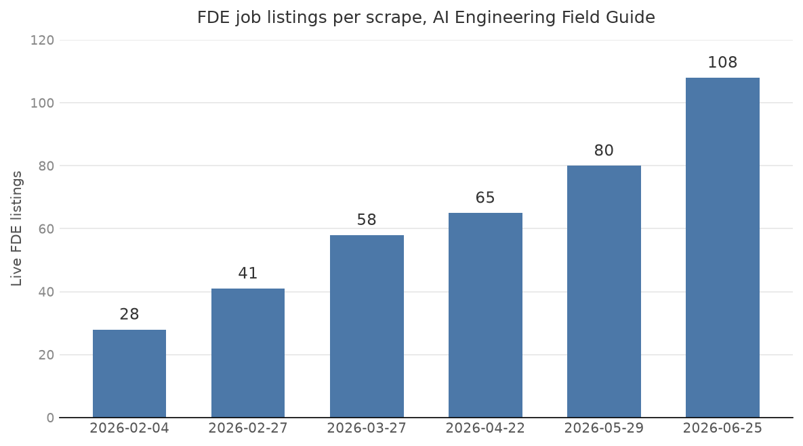
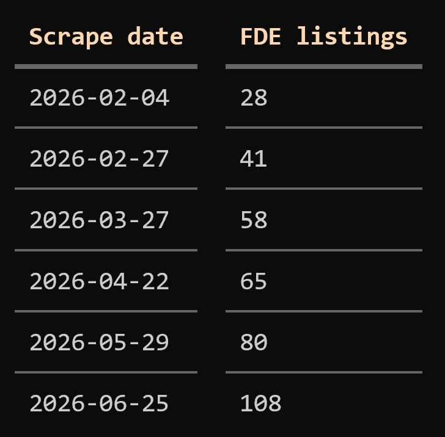
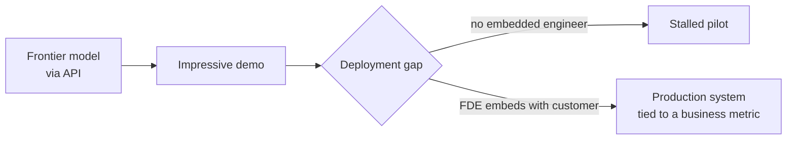
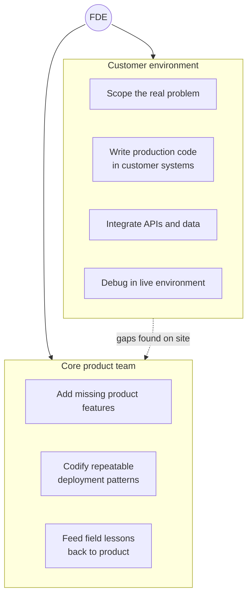

# FDE Jobs in AI: The Rise of the Forward Deployed Engineer

The Forward Deployed Engineer (FDE) is a software engineer who embeds inside a customer's company and builds an AI system end to end, from scoping to production. The title started at Palantir, but in 2025 and 2026 it spread across AI startups and frontier labs, and it now shows up as one of the fastest-growing job categories in AI. This article looks at what the role is, where it came from, why AI companies are hiring for it right now, and what it pays.

Here is the tour. First I show the FDE trend in our own scraped job data, which is what started this research, and then go deeper into those postings: who is hiring, what the jobs ask for, and how FDE postings differ from the rest of the AI market. This dataset is our own, so the analysis on top of it is something other resources don't have. After that I explain what an FDE is and where the role came from at Palantir, why AI companies are pouring money into the role in 2026, what an FDE actually does day to day, and how the role differs from a solutions engineer, an applied AI engineer, and a consultant. The last sections cover the skills companies ask for and a short note on pay.

## What our own scrape data shows

This research started from a pattern in the [AI Engineering Field Guide](https://github.com/alexeygrigorev/ai-engineering-field-guide), our job-scraping pipeline that collects AI Engineer listings.[^2] Counting listings with "fde" or "forward deploy" in the title, the number of live postings roughly 4x-ed over five months.[^1]

| Scrape date | FDE listings |
|-------------|--------------|
| 2026-02-04 | 28 |
| 2026-02-27 | 41 |
| 2026-03-27 | 58 |
| 2026-04-22 | 65 |
| 2026-05-29 | 80 |
| 2026-06-25 | 108 |

The same numbers as a bar chart:

<figure>
  
  <figcaption>Live FDE listings per scrape - roughly 4x growth in five months</figcaption>
</figure>

The role is also growing faster than the market it sits in. The full scrape went from 1,416 live AI engineering listings in February to 3,024 in June, so the whole dataset grew about 2.1x while FDE listings grew 3.9x. As a share of everything we collect, FDE went from 2.0% to 3.6%.[^3]

These are raw per-scrape counts, so the same job can appear in more than one scrape. The consolidated, deduplicated file holds 113 unique FDE positions, matched on "fde" or "forward deploy" in the title. That 113 is the union of unique job IDs across all six scrapes. The gap between 113 and the latest 108 reflects postings that showed up in an earlier scrape but had closed by 2026-06-25.[^1]

Some employers posted FDE roles again and again across the scrapes:[^1]

- Databricks
- Anthropic
- Mistral AI
- Scale AI
- Outreach
- NewRocket
- JetBrains
- IFS
- Stord
- ServiceNow

<figure>
  
  <figcaption>The original analysis of the Field Guide scrape data - FDE listings roughly 4x-ing between February and late June 2026</figcaption>
  <!-- The screenshot Alexey sent that seeded this research; it shows the per-scrape counts, the 113 dedup figure, and the repeat employers discussed in this section -->
</figure>

A single pipeline is a narrow window, so the next step was to check the trend against public data and reporting. It holds up. An analysis of 1,000 FDE postings found the number of jobs with the title "forward deployed engineer" grew 1,165% year over year from January through October 2025 versus the same months in 2024, and October 2025 set a record for FDE postings. Source: https://bloomberry.com/blog/i-analyzed-1000-forward-deployed-engineer-jobs-what-i-learned/

## Inside our 113 FDE postings

The trend chart says the role is growing. The postings themselves say what the role is. The Field Guide parses every listing into structured data: company info, responsibilities, use cases, and skills. I went through all 113 unique FDE positions in that structured data for this section.[^3] One scope note: the pipeline collects AI engineering listings, so everything here is about AI FDE roles specifically.

### Who is hiring

The 113 postings come from 78 different companies, and no single employer dominates. Mistral AI, Databricks, and Thomson Reuters lead with 4 unique postings each, followed by Anthropic, Invisible Technologies, Stord, and NewRocket with 3. Another 18 companies posted 2 roles, and 53 companies posted exactly one.

About a third of the postings (36 of 113) come from public companies. The rest spread across startups from seed stage to late stage, with the thickest band at Series B.

The industry spread is the part that surprised me. FDE hiring is not limited to frontier labs and developer tooling:

- Frontier labs and model companies: Anthropic, Mistral AI, Scale AI, ReflectionAI
- Data and AI platforms: Databricks, Baseten, Elastic, H2O.ai, Arize AI
- Healthcare and life sciences: Aledade, Omada Health, Medable, Charta Health, Komodo Health, Natera, GE Healthcare
- Voice AI and customer communications: PolyAI, Five9, RingCentral, Regal, NICE
- Supply chain and logistics: Blue Yonder, Resilinc, Stord, Pallet
- Enterprise software: ServiceNow, IFS, JetBrains, OneStream Software, Atlassian
- Fintech and financial services: Ramp, Sardine, Juniper Square, DataSite
- Consulting and delivery firms: Tiger Analytics, NewRocket, phData, Invisible Technologies, Turing
- Defense: Defense Unicorns

Even McCain Foods, a food company, posted an FDE role. When a frozen-fries producer hires forward deployed engineers, the role has left the AI bubble.

### What the postings ask FDEs to do

Across the 783 responsibility bullets in the 113 postings, the recurring themes look like this:

- 90% of postings mention working directly with customers or clients
- 87% mention building or deploying production systems
- 62% mention integrating systems, APIs, or data
- 51% mention scoping, requirements, or discovery work
- 41% mention evaluation, testing, or monitoring
- 39% mention feeding field learnings back into the product or roadmap
- 25% mention prototypes, proofs of concept, or demos
- 10% mention travel or onsite work

The ordering matches the 1,000-posting analysis quoted later in this article: customer work first, production systems second, integration third.

Customer-facing work is what separates FDE postings from the rest of our dataset. 92% of FDE postings are customer-facing, against 21% for other ai-first roles - a 4x difference. Only 13 of the 113 postings are management positions; this is an individual-contributor role. Source: https://github.com/alexeygrigorev/ai-engineering-field-guide/blob/main/job-market/trends.md

### The skill profile in our data

The skills sections of the 113 postings draw a consistent picture:

- Python appears in 89% of postings (101 of 113). TypeScript is second at 29%, SQL third at 23%.
- Prompt engineering (56%) and RAG (50%) top the GenAI skills, followed by LangChain (32%), AI agents (30%), and agentic workflows (19%). MCP already shows up in 8 postings.
- The three big clouds appear at nearly equal rates: AWS 40%, GCP 36%, Azure 32%. An FDE deploys into whatever cloud the customer already runs.
- Delivery tooling is standard: Docker 35%, Kubernetes 31%, CI/CD 27%.
- Vector databases appear in 23% of postings, with PostgreSQL the most named specific database.
- React shows up in 14% - customer-facing systems need frontends too.

PyTorch appears in only 15% of FDE postings, against roughly 25% across the rest of the dataset. Combined with the RAG-and-agents profile above, the message is clear: this is a delivery role built on top of existing models, not a research or model-training role. Source: https://github.com/alexeygrigorev/ai-engineering-field-guide/blob/main/job-market/trends.md

### Seniority

Most titles carry no seniority marker: 81 of 113 are plain "Forward Deployed Engineer" variants. Of the rest, 14 are senior, 7 principal, 5 staff, 5 lead, and 1 founding. Junior FDE postings do not exist in our data, which matches the wider pattern in the dataset - entry-level AI engineering postings hover around 1% of the market. Source: https://github.com/alexeygrigorev/ai-engineering-field-guide/blob/main/job-market/trends.md

## What a Forward Deployed Engineer is

An FDE is a software engineer who works embedded inside a customer's environment and writes code that runs in the customer's production systems. The role sits between three jobs at once: software engineer, solutions architect, and customer success, with full accountability for whether the deployed system works. Source: https://www.paraform.com/blog/forward-deployed-ai-engineer

The clearest short definition comes from Palantir, which uses "one capability, many customers" for a normal software engineer and "one customer, many capabilities" for an FDE. Source: https://blog.palantir.com/dev-versus-delta-demystifying-engineering-roles-at-palantir-ad44c2a6e87

A normal product engineer builds one feature that ships to everyone. An FDE goes deep on a single customer and does whatever that customer needs to get a working system: integration, custom code, data plumbing, and debugging in the live environment. The Pragmatic Engineer newsletter describes the job as a mix of software, sales, and platform engineering, where the engineer alternates between sitting with customer teams and working on the company's core product. Source: https://newsletter.pragmaticengineer.com/p/forward-deployed-engineers

## Where the role came from: Palantir

Palantir created the Forward Deployed Software Engineer role in the early 2010s and named it "Delta". Palantir was founded in 2003, after the September 11 attacks, and its early customers were intelligence and defense agencies like the CIA, NSA, and US Army units. Source: https://newsletter.pragmaticengineer.com/p/forward-deployed-engineers

Those customers could not always say what they needed, and the data was sensitive and fragmented across systems. So instead of asking customers for a spec and writing a report, Palantir put engineers directly inside the customer's environment to observe, experiment, and build in real time. Source: https://fde.academy/blog/how-palantir-invented-the-forward-deployed-engineer-model

The scale of the bet is the part people miss. Until around 2016, Palantir had more FDEs than it had normal software engineers. That year Palantir launched Foundry, an integrated data platform, and many FDEs moved back into core engineering, bringing what they had learned in the field into the product. Even now, no company employs more FDEs than Palantir, and none has shaped the role more. Source: https://newsletter.pragmaticengineer.com/p/forward-deployed-engineers

Palantir's own framing separates two engineering tracks. A "Dev" builds one capability that many customers use. A "Delta" achieves a technical outcome for one specific customer, using Palantir products plus any languages and open-source tooling needed, and measures success by impact on that customer's goal, like reducing defective products coming off an assembly line. Source: https://blog.palantir.com/dev-versus-delta-demystifying-engineering-roles-at-palantir-ad44c2a6e87

## Why AI companies are hiring FDEs now

The reason the role jumped from one secretive company to the whole AI industry is a deployment gap. Enterprise AI pilots fail most of the time, and the failures come from deployment, not from weak models. Getting a model out of a demo and into a production system that changes a customer's revenue or cost line is hard, and it needs someone embedded with the customer to do it. Source: https://thenewstack.io/forward-deployed-engineers-ai/

The flow below shows where the FDE fits into that gap.

You cannot hand this work to a sales engineer who runs a nice demo and moves on. Someone has to embed with the customer, write production code, and keep the AI working when it hits real-world complexity. That is the FDE. Source: https://bloomberry.com/blog/i-analyzed-1000-forward-deployed-engineer-jobs-what-i-learned/

In 2025, the venture firm a16z called FDE "the hottest job in tech". Source: https://newsletter.pragmaticengineer.com/p/forward-deployed-engineers

The frontier labs then turned the role into a business line. Within weeks in May 2026, both Anthropic and OpenAI launched multibillion-dollar deployment ventures built around embedded engineers, aiming to take enterprise work away from consulting firms like Accenture and Deloitte:

- Anthropic formed a roughly $1.5 billion joint venture on May 4, 2026, backed by Blackstone, Hellman & Friedman, and Goldman Sachs, focused on mid-sized companies that lack in-house resources to run frontier deployments. Source: https://aibusiness.com/generative-ai/openai-launches-ai-consulting-company-anthropic
- OpenAI announced its Deployment Company on May 11, 2026, with more than $4 billion in initial investment anchored by TPG, and folded in 150 engineers from its acquisition of Tomoro. Source: https://aibusiness.com/generative-ai/openai-launches-ai-consulting-company-anthropic
- Amazon launched a roughly $1 billion FDE org at the end of June 2026, following OpenAI and Anthropic. Source: https://techcrunch.com/2026/06/30/amazon-launches-new-1-billion-fde-org-following-openai-and-anthropic/
- Microsoft committed $2.5 billion and 6,000 employees to a new AI implementation unit in early July 2026. Source: https://www.cnbc.com/2026/07/02/microsoft-commits-2point5-billion-6000-employees-ai-implementation-unit.html

These moves copy Palantir's playbook directly, using embedded engineers instead of traditional consultants to close the gap between a model and a working deployment. Source: https://getperspective.ai/blog/palantir-forward-deployed-engineering-playbook-anthropic-openai-copying

## What FDEs do day to day

The title covers more than one job. The analysis of 1,000 postings found companies use "Forward Deployed Engineer" for three different roles: Source: https://bloomberry.com/blog/i-analyzed-1000-forward-deployed-engineer-jobs-what-i-learned/

- Builder FDE, about 60% of jobs. A software engineer who embeds with customers to build and maintain production systems. Roughly 70-90% coding, 30-50% travel, high equity.
- Sales Engineer+, about 30% of jobs. A solutions or sales engineer rebranded as FDE, more time in customer meetings and demos, hands off to implementation teams. Often quota-carrying.
- Internal Tools Builder, about 10% of jobs. A go-to-market or RevOps engineer whose "customers" are internal teams, not external clients.

Most of this article is about the Builder FDE, since that is the majority and the version AI companies mean. For that type, the top responsibilities across postings are working directly with customers (55%), building and deploying AI/ML systems (37%), and integrating systems and APIs (32%). Zero postings listed hitting a quota or closing deals as a core duty. Source: https://bloomberry.com/blog/i-analyzed-1000-forward-deployed-engineer-jobs-what-i-learned/

The diagram below shows the two sides an FDE moves between: the customer environment and the core product team.

The work often means being physically on site. Palantir expects around 25% of an FDE's time onsite with customers, and healthcare AI company Commure estimates up to 50%. Former Palantir FDEs describe working on the final assembly line at Airbus and in airgapped environments. Industrial AI startups expect FDEs to scope solutions on the factory floor. Source: https://newsletter.pragmaticengineer.com/p/forward-deployed-engineers

Concrete examples from recent AI postings show what "build a production AI system" means in practice. Reducto asks FDEs to build production applications with Claude models and deliver artifacts like MCP servers, sub-agents, and agent skills for production workflows. Databricks asks FDEs to embed with strategic customers and deploy AI/ML solutions across backend, frontend, and integrations. Source: https://bloomberry.com/blog/i-analyzed-1000-forward-deployed-engineer-jobs-what-i-learned/

## How the role differs from other titles

FDE overlaps with several existing roles, and the differences are what companies argue about most. Here is how the role lines up against the three titles it gets confused with.

| Role | Who they work for | Code in customer production? | Owns the outcome? | Paid like |
|------|-------------------|------------------------------|-------------------|-----------|
| Forward Deployed Engineer | Embedded with one customer, also contributes to core product | Yes | Yes, until it runs in production | Engineer, equity-heavy |
| Solutions / sales engineer | The vendor, across many deals | Rarely, usually POCs on offline data | No, hands off to implementation | Salesperson, commission and quota |
| Applied AI engineer | Same as FDE in most cases | Yes | Yes | Engineer |
| Consultant | The client, per engagement | No, makes recommendations | No, one-off advice | Billable hours |

A consultant makes one-off recommendations and leaves. An FDE stays and works with the customer long-term, and can do the "dev" work of adding features to the company's own product when a customer needs a capability that does not exist yet. That link back to the product is the line between an FDE and a plain consultant. Source: https://newsletter.pragmaticengineer.com/p/forward-deployed-engineers

A solutions or sales engineer sells and demos the vendor's product and usually builds proofs of concept with anonymized or offline data, then hands the real build to someone else. Forward deployed work rewards depth on one customer at a time, while solutions engineering rewards breadth across a sales pipeline. Source: https://www.blockchain-council.org/ai/forward-deployed-engineer-vs-solutions-engineer-vs-sales-engineer/

The Applied AI Engineer title is the closest match. FDE and Applied AI Engineer are largely the same role under different names. Both embed with customers and ship production AI end to end. FDE titles emphasize integration and deployment depth, common at Palantir and OpenAI, while Applied AI Engineer titles emphasize AI quality and evaluation, common at Anthropic and many AI startups. Source: https://fde.academy/blog/forward-deployed-engineer-vs-applied-ai-engineer

One more distinction matters for anyone deciding whether to take the job: pay structure. If this were a rebranded sales role, postings would show commissions, on-target earnings, and quotas. They do not. Across the 1,000 postings, 70% mention equity, only 8% mention on-target earnings, and exactly 0% are quota-carrying. FDEs are paid like engineers, not salespeople. Source: https://bloomberry.com/blog/i-analyzed-1000-forward-deployed-engineer-jobs-what-i-learned/

## Skills companies ask for

The base requirement is strong software engineering. Almost every posting wants a solid engineering background and real experience shipping projects end to end. Ramp prefers 5+ years for senior FDE roles but hires some new grads, while Palantir hires people with as little as a year of post-college experience. Source: https://newsletter.pragmaticengineer.com/p/forward-deployed-engineers

On top of that, the AI versions of the role expect hands-on LLM experience: building and integrating models, wiring up APIs, and increasingly building agent systems with tools like MCP servers and agent skills. Both FDE and Applied AI Engineer roles ask for strong production engineering plus hands-on LLM work. Source: https://fde.academy/blog/forward-deployed-engineer-vs-applied-ai-engineer

The role also needs soft skills that pure engineering jobs do not. You work directly with a customer's domain experts, often in an undefined or shifting problem space, so comfort with ambiguity and customer-facing communication matter. Palantir compares FDE responsibilities to those of a startup CTO: small teams, end-to-end ownership of high-stakes projects. Source: https://newsletter.pragmaticengineer.com/p/forward-deployed-engineers

## Compensation

I'm not going deep on compensation because it depends heavily on geography, and most postings don't disclose it anyway - in our dataset, only 10 of the 113 FDE postings list a salary range.[^3]

The short version: FDEs are paid well, and they are paid like engineers. The pay is comparable to software engineering pay or above it. Across the 1,000-posting analysis, the median disclosed salary is $173,816 and 70% of jobs include equity. Source: https://bloomberry.com/blog/i-analyzed-1000-forward-deployed-engineer-jobs-what-i-learned/

At the frontier labs, total compensation runs much higher, driven by large equity grants - reported bands go from $350K at mid-level up to $1.2M for principal roles at OpenAI and Anthropic. Source: https://getperspective.ai/blog/2026-forward-deployed-engineering-compensation-report-1200-fdes

## What this means

The FDE trend in our scrape data is real and it matches the broader market. The count of live FDE postings roughly 4x-ed in five months, public data shows a 10x-plus year-over-year jump, and the largest AI companies have each put a billion dollars or more behind the role in 2026. The 113 postings in our data also show the role spreading well beyond AI companies - healthcare platforms, logistics companies, enterprise software vendors, and even a food producer are hiring FDEs. The reason is consistent across every source: models are good enough, but getting them into production inside a real company is the bottleneck, and an embedded engineer who writes production code is the way through.

For anyone writing content or planning courses around AI careers, this is a concrete, fast-growing role with a clear skill profile: solid software engineering, hands-on LLM and agent work, API and systems integration, and the ability to work directly with customers in messy environments. It is a different career path from both the pure research track and the traditional solutions-engineering track, and it pays like engineering, not sales.

## Sources

[^1]: [20260708_211112_AlexeyDTC_msg4716_photo.md](../../inbox/used/20260708_211112_AlexeyDTC_msg4716_photo.md) - scrape counts, the 113 dedup count, notable repeat employers, and the request to research FDE jobs in AI.
[^2]: [20260708_211144_AlexeyDTC_msg4718.md](../../inbox/used/20260708_211144_AlexeyDTC_msg4718.md) - the data comes from the AI Engineering Field Guide scrapes.
[^3]: [20260713_162411_AlexeyDTC_msg4765_transcript.txt](../../inbox/used/20260713_162411_AlexeyDTC_msg4765_transcript.txt) - the request to analyze the Field Guide FDE vacancies in depth, add a bar chart, and shorten the compensation section. The 113-posting analysis was done on the structured data in the Field Guide repository.

Web sources:

- AI Engineering Field Guide, the job-scraping pipeline and trends analysis behind our data. https://github.com/alexeygrigorev/ai-engineering-field-guide/blob/main/job-market/trends.md
- Pragmatic Engineer, What are Forward Deployed Engineers, and why are they so in demand? https://newsletter.pragmaticengineer.com/p/forward-deployed-engineers
- Bloomberry, What I learned analyzing 1K forward deployed engineer jobs. https://bloomberry.com/blog/i-analyzed-1000-forward-deployed-engineer-jobs-what-i-learned/
- Palantir blog, Dev versus Delta: Demystifying Engineering Roles at Palantir. https://blog.palantir.com/dev-versus-delta-demystifying-engineering-roles-at-palantir-ad44c2a6e87
- FDE Academy, How Palantir Invented the Forward Deployed Engineer Model. https://fde.academy/blog/how-palantir-invented-the-forward-deployed-engineer-model
- FDE Academy, Forward Deployed Engineer vs Applied AI Engineer. https://fde.academy/blog/forward-deployed-engineer-vs-applied-ai-engineer
- The New Stack, Why OpenAI and Anthropic are hiring forward deployed engineer teams. https://thenewstack.io/forward-deployed-engineers-ai/
- Paraform, What Is a Forward Deployed AI Engineer? https://www.paraform.com/blog/forward-deployed-ai-engineer
- Blockchain Council, FDE vs Solutions Engineer vs Sales Engineer. https://www.blockchain-council.org/ai/forward-deployed-engineer-vs-solutions-engineer-vs-sales-engineer/
- Perspective AI, The 2026 Forward Deployed Engineering Compensation Report. https://getperspective.ai/blog/2026-forward-deployed-engineering-compensation-report-1200-fdes
- Perspective AI, Palantir's Forward-Deployed Engineering Playbook. https://getperspective.ai/blog/palantir-forward-deployed-engineering-playbook-anthropic-openai-copying
- AI Business, OpenAI Launches AI Consulting Company, Following Anthropic. https://aibusiness.com/generative-ai/openai-launches-ai-consulting-company-anthropic
- TechCrunch, Amazon launches new $1 billion FDE org, following OpenAI and Anthropic. https://techcrunch.com/2026/06/30/amazon-launches-new-1-billion-fde-org-following-openai-and-anthropic/
- CNBC, Microsoft commits $2.5 billion and 6,000 employees to new AI implementation unit. https://www.cnbc.com/2026/07/02/microsoft-commits-2point5-billion-6000-employees-ai-implementation-unit.html
- MarkTechPost, What is a Forward Deployed Engineer. https://www.marktechpost.com/2026/05/20/what-is-a-forward-deployed-engineer-the-ai-role-openai-anthropic-and-google-are-hiring-in-2026/
