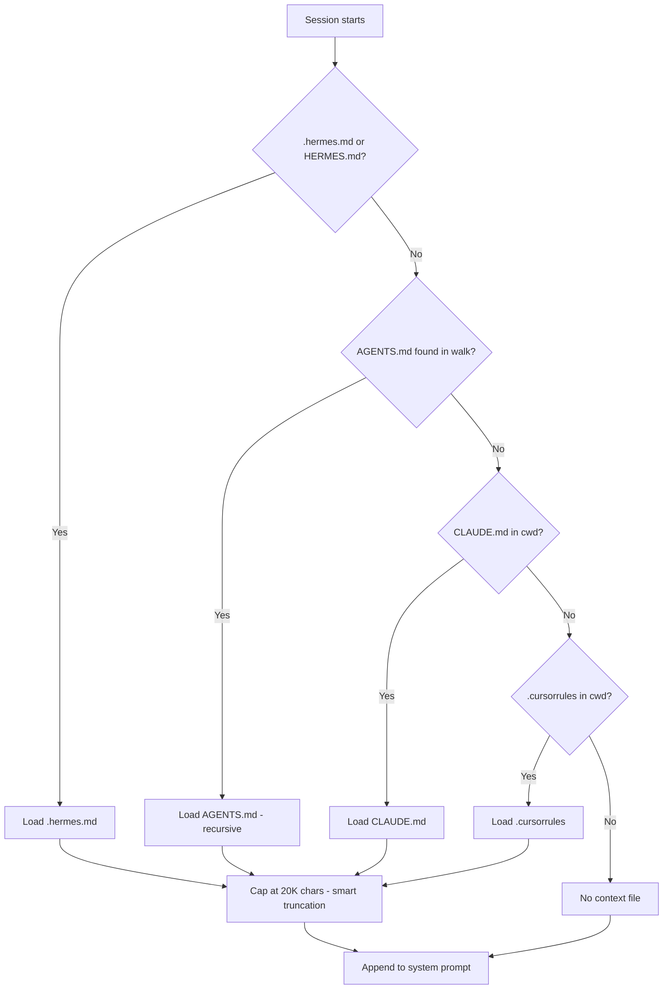
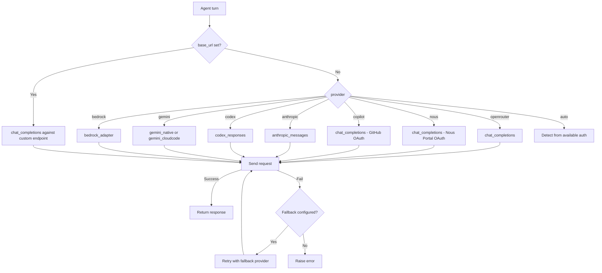
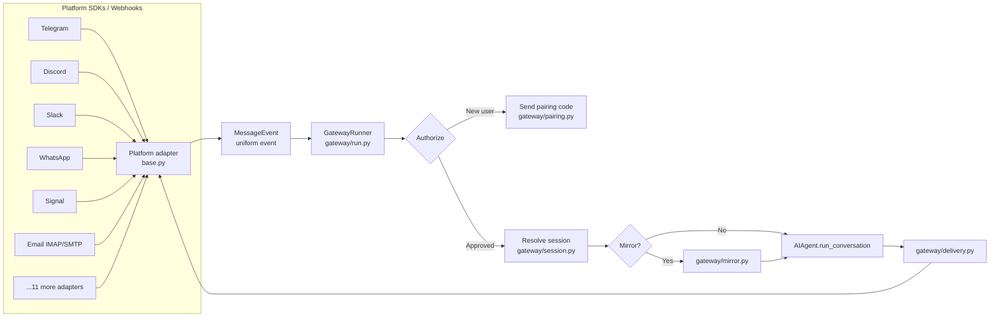

```mermaid
graph TB
    subgraph Entry["Entry Points"]
        CLI[hermes chat TUI]
        GW[Gateway: 16 platforms]
        ACP[ACP editor adapter]
        BATCH[Batch runner]
        API[API server]
        CRON[Cron scheduler]
    end

    subgraph Core["Agent Core (run_agent.py)"]
        LOOP[AIAgent.run_conversation]
        PB[prompt_builder.py]
        RP[runtime provider]
        MT[model_tools.py]
        CC[context_compressor.py]
        CRED[credential_pool.py]
    end

    subgraph Identity["Identity and Memory"]
        SOUL[SOUL.md]
        MEM[MEMORY.md]
        USR[USER.md]
        CTX[.hermes.md / AGENTS.md / CLAUDE.md]
        SKILLS[Skills manifest - Level 0]
    end

    subgraph Providers["LLM Providers"]
        NOUS[Nous Portal]
        OR[OpenRouter 200+ models]
        ANTH[Anthropic Messages]
        OAI[OpenAI / Codex Responses]
        GEM[Gemini native / CloudCode]
        BED[Bedrock]
        GH[GitHub Copilot OAuth]
        LOCAL[Local: Ollama/vLLM/SGLang]
        CUSTOM[Custom base_url]
    end

    subgraph Tools["47 Tools / 20 Toolsets"]
        TERM[Terminal: local/docker/ssh/modal/daytona/singularity]
        BROWSE[Browser: Camofox + CDP]
        CODE[Code execution]
        FILE[File ops + patch parser]
        SKILL[skills_tool + skills_hub + skills_guard]
        MEM_T[memory_tool + session_search]
        ORCH[delegate + todo + clarify + mixture_of_agents]
        MSG[send_message + discord + homeassistant + feishu]
        MEDIA[vision + image_gen + tts + neutts + transcription]
        MCP[MCP + OAuth]
        CRON_T[cronjob_tools]
        RL[rl_training_tool]
        SEC[tirith_security + approval + url_safety + osv_check]
    end

    subgraph Aux["Auxiliary Models"]
        VIS[Vision]
        WEB[Web extract]
        COMP[Compression]
        SSRCH[Session search]
    end

    subgraph Store["Persistence"]
        SQL[(SQLite + FTS5)]
        CFG[~/.hermes/config.yaml]
        ENV[~/.hermes/.env]
        AUTH[~/.hermes/auth.json]
        SKDIR[~/.hermes/skills/]
        MDIR[~/.hermes/memories/]
    end

    CLI --> LOOP
    GW --> LOOP
    ACP --> LOOP
    BATCH --> LOOP
    API --> LOOP
    CRON --> LOOP

    LOOP --> PB
    PB --> SOUL
    PB --> MEM
    PB --> USR
    PB --> CTX
    PB --> SKILLS

    LOOP --> RP
    LOOP --> MT
    LOOP --> CC
    LOOP --> CRED

    RP --> NOUS
    RP --> OR
    RP --> ANTH
    RP --> OAI
    RP --> GEM
    RP --> BED
    RP --> GH
    RP --> LOCAL
    RP --> CUSTOM

    MT --> TERM
    MT --> BROWSE
    MT --> CODE
    MT --> FILE
    MT --> SKILL
    MT --> MEM_T
    MT --> ORCH
    MT --> MSG
    MT --> MEDIA
    MT --> MCP
    MT --> CRON_T
    MT --> RL
    MT --> SEC

    LOOP --> VIS
    LOOP --> WEB
    LOOP --> COMP
    LOOP --> SSRCH

    LOOP --> SQL
    LOOP --> CFG
    LOOP --> ENV
    LOOP --> AUTH
    SKILL --> SKDIR
    MEM_T --> MDIR
```

# Hermes Agent: Nous Research's Self-Improving Personal Agent

[Repository](https://github.com/NousResearch/hermes-agent)

Hermes Agent is an open-source, Python-based AI agent runtime built by Nous Research. Launched in February 2026 as the successor to OpenClaw, it ships as a self-improving personal assistant with a closed learning loop, a platform-agnostic agent core, 47 tools spread across 20 toolsets, a 16-platform messaging gateway, and six terminal backends ranging from a local shell to serverless Modal/Daytona VMs.

This article is a source-code-informed synthesis built on prior research into the repository structure at `NousResearch/hermes-agent` (103K stars, MIT, Python 3.11+).

## How to read this article

Hermes has a lot of moving parts, so here is the map before we walk through them:

- What It Is and Repository Topography - orient you to the project, the folders that matter, and what each part lets you do.
- Architecture and Conversation Flow - show how the pieces fit together and what happens when you send a message.
- SOUL, Memory, and Skills - cover the identity and memory files that make Hermes feel personal across sessions.
- Context Files, Providers, and Tools - explain how Hermes picks a project context file, swaps LLM providers, and runs tools.
- Messaging Gateway, Auxiliary Models, Context Compression, and Cron - everything around the core loop: how messages get in, how side tasks stay cheap, how long conversations survive, and how scheduled work runs.
- Training Integration and OpenClaw Migration - the self-improvement data loop and the upgrade path for existing OpenClaw users.
- What Makes This Interesting and the Comparison Table - observations about the design choices and how Hermes stacks up against Claude Code and OpenClaw.

Here is how those groups relate. At the center sits one conversation loop. Around it sit four groups of parts that feed into or hang off that loop: inputs (the gateway and CLI that carry your messages in), outputs (the delivered replies), side models (cheaper LLMs that handle subtasks so the main model stays focused), and the on-disk memory the loop reads at the start of a session and writes back to at the end. If you only want to decide whether Hermes fits your own project, jump straight to the comparison table and the closing takeaways.

## What It Is

Hermes is a single agent runtime with many front-ends. Every entry point (the TUI, the messaging gateway, ACP editor integration, batch runner, and the API server) calls the same conversation loop: `AIAgent.run_conversation()` in `run_agent.py`. Everything else is an input or output for that loop. In practice, this means the agent you talk to from Telegram is the same agent you talk to from the terminal, with the same memory, the same skills, and the same tool set. Switching platforms doesn't reset the conversation or lose context.

The product is a personal assistant, not a professional coding tool. Hermes is built to live beyond your laptop. You can talk to it from Telegram while it works on a cloud VM, it remembers past conversations, it writes its own skills from experience, and it builds a model of you across sessions. This is a different category from Claude Code, which is an IDE-embedded coding copilot, and from OpenClaw, which was a single-use Telegram-first assistant.

Three design commitments define the project:

- Model-agnostic runtime. You get 200+ models via OpenRouter, plus Nous Portal, OpenAI/Codex, Anthropic, Gemini, Bedrock, GitHub Copilot, local endpoints (Ollama/vLLM/SGLang/llama.cpp), and custom base URLs. In practice, you can point Hermes at a local GPU one day and at a paid API the next without touching any other part of the config - if a new model comes out, you try it by changing one line.
- Platform-agnostic front-end. You can reach the same agent from the CLI, Telegram, Discord, Slack, WhatsApp, Signal, SMS, Email, Matrix, Mattermost, DingTalk, Feishu/Lark, WeCom, WeChat, BlueBubbles (iMessage), Home Assistant, or a generic webhook. The same conversation thread follows you across devices, so you can start on your laptop and continue on your phone.
- Self-improvement. After a task that used 5+ tool calls, Hermes can write a new skill that captures how it solved the task. It can also patch an existing skill mid-use, run periodic memory curation passes, search past sessions by full text with LLM summaries, and optionally keep a live model of you through the Honcho plugin. The practical result: the agent gets more useful for you over time without a model upgrade, because it is accumulating what it learned from working with you.

## Repository Topography

Before looking at architecture, it helps to know what lives where, because the rest of the article keeps pointing back to these files. The repo is Python-heavy, and unusually for a modern project, a small set of large files does most of the work.

Here is what each of the big files does and why you would open it - so when a later section mentions `run_agent.py` or `auxiliary_client.py`, you already know what kind of code is in there and what it controls:

- `run_agent.py` - 633 KB. The conversation loop. Every turn you take with Hermes runs through a function in this file. It is kept as a single file on purpose, so a full read shows you the entire flow without chasing imports. If you want to understand what Hermes does when you send a message, you read this one file.
- `cli.py` - 472 KB. The interactive TUI you see when you run `hermes chat` in the terminal. This is what renders your messages, streams the model's reply, and shows approval prompts.
- `hermes_cli/main.py` - 310 KB. The top-level `hermes` command that dispatches to subcommands like chat, gateway, migrate, and cron. This is the file to look at if you want to add or understand a CLI command.
- `hermes_cli/config.py` - 150 KB. Reads and writes `~/.hermes/config.yaml`. It handles provider selection, auxiliary model setup, and platform credentials - everything you configure when you set up Hermes for the first time.
- `hermes_cli/gateway.py` - 156 KB. Wires up the `hermes gateway` command that starts the messaging server.
- `gateway/run.py` - 507 KB. The long-running gateway process that listens on all your messaging platforms and routes events into the conversation loop. You start this when you want Hermes to reach you on Telegram or Discord instead of only in the terminal.
- `batch_runner.py` - 55 KB. Runs the agent across many prompts in parallel and saves the resulting conversations. You reach for this if you want to generate training data or stress-test a new skill against a set of scenarios.
- `trajectory_compressor.py` - 64 KB. Converts those saved conversations into a format a training script can consume.

Everything else is organized into a handful of directories.

Each one maps to one slice of the system, and each one solves a specific problem for you as a user:

- `agent/` - the brain of a turn. It holds the pieces that decide what prompt to send to the LLM and what to do with the response. `prompt_builder.py` assembles the system prompt from your identity and memory files. `context_compressor.py` summarizes old turns when the conversation gets too long so you don't run out of context window. `credential_pool.py` rotates API keys when you have several, which matters if you hit rate limits on a single key. `auxiliary_client.py` at 124 KB dispatches side tasks like vision and compression to cheaper models, so the main model can stay focused on your actual question. The Anthropic, Bedrock, and Gemini adapters also live here. Each one translates Hermes' internal message format into the shape that provider's API expects. When a section later talks about prompt caching, memory loading, redaction, or API mode selection, this is the directory it is talking about.
- `tools/` - the hands of the agent. 47 Python files, each one exposing one tool or tool family the LLM can call. These are the concrete actions Hermes can take on your behalf. The notable ones, and what they let you do: `mcp_tool.py` (101 KB) connects Hermes to any MCP server you configure, so you can plug in third-party integrations without writing new tools. `skills_hub.py` (112 KB) fetches and shares skills with other Hermes users, so you can install capabilities other people wrote. `browser_tool.py` (99 KB) gives the agent a full stealth-mode browser it can drive, which is how it reads pages that block simple HTTP fetches. `terminal_tool.py` (85 KB) is shell access across six different execution backends, so the agent can run commands locally, in Docker, on SSH, or in a serverless cloud VM depending on how much isolation you want. `send_message_tool.py` (63 KB) lets the agent proactively message you on any configured platform, which is what powers "ping me when the job finishes" workflows. `code_execution_tool.py` (61 KB) runs Python in a sandbox. `rl_training_tool.py` (57 KB) lets the agent trigger its own fine-tuning job. `skills_tool.py` (51 KB) is how the agent reads, writes, and amends its skill library - the mechanism behind self-improvement. `delegate_tool.py` (50 KB) spawns a subagent for a scoped task, so the main agent can hand off work and keep its own context clean. `tts_tool.py` (50 KB) generates speech.
- `gateway/platforms/` - the ears and mouths. One adapter per messaging platform. You enable the platforms you use (probably Telegram), and each adapter converts platform-native events into the same internal event format, so the agent core doesn't need to know whether the message came from Slack or from an iMessage thread. The full list: bluebubbles, dingtalk, discord, email, feishu, homeassistant, matrix, mattermost, qqbot, signal, slack, sms, telegram, webhook, wecom, weixin, whatsapp, and an api_server.
- `plugins/memory/` - optional long-term memory backends. Eight providers - byterover, hindsight, holographic, honcho, mem0, openviking, retaindb, supermemory - any of which you can plug in for semantic search, knowledge graphs, or fact extraction. If you do not configure one, Hermes still has working memory via markdown files and SQLite. These are upgrades for when the built-in memory isn't enough.
- `skills/` - a pre-built library of capabilities organized by category: apple, autonomous-ai-agents, creative, data-science, devops, diagramming, email, feeds, gaming, github, mcp, media, mlops, note-taking, productivity, research, red-teaming, smart-home, social-media, software-development, and more. You inherit these on install, so out of the box Hermes already knows how to work with GitHub, run a research pipeline, or update your smart home. The agent writes new ones into `~/.hermes/skills/` over time.

The takeaway is this. Hermes is a single loop (`run_agent.py`) surrounded by three pluggable stacks (providers in `agent/`, capabilities in `tools/`, inputs in `gateway/platforms/`) and two data stores (`~/.hermes/` on disk, and a SQLite database). For you that means there are only three places where you will typically customize Hermes: you swap providers to change which model is thinking, you enable or disable tools to change what the agent can do, and you turn platforms on in the gateway to change where the agent can reach you. Nothing else needs to move. The next section shows how those pieces connect at runtime.

## Architecture

Hermes uses a hub-and-spoke design. There is a single agent core at the center, and three groups of pluggable parts around it. The core is the conversation loop. The spokes are LLM providers (which model you talk to), tools (what the agent can do), and platform adapters (how messages reach the agent). Hub-and-spoke here means each spoke only talks to the hub, never directly to another spoke. For you that is the reason you can swap OpenRouter for a local vLLM endpoint, switch from Telegram to Discord, or turn off the browser tool without any of those changes rippling into another part of the system.



The three stacks (providers, tools, adapters) connect only at the agent core, never to each other. That isolation is what lets you run the same Hermes config on a $5 VPS and on a GPU cluster, or point the same agent at a cheap local model for draft work and a flagship API model for harder tasks.

With the layout clear, the next question is what happens during one turn of conversation.

## How It Works: Conversation Flow

Each turn in Hermes builds a system prompt, then runs a tool loop that works with any provider. The sequence below follows one Telegram message all the way from your phone to the agent's reply, so you can see which part of the code runs at each step.


The loop deliberately avoids changing the prompt mid-session. The system prompt is assembled once, frozen for the whole session, and reused verbatim on every turn. This matters because of the prefix cache. The prefix cache is a feature most LLM providers use where identical prompt prefixes reuse previous computation and get billed at a discount - so if turn 2 starts with the exact same text as turn 1, the provider charges you less and responds faster. By not mutating the prompt, Hermes keeps that cache warm across a long conversation, which means it can afford to pack fairly large identity and memory content into the prompt without paying the full price for it on every turn. The trade-off you should know about: if you ask Hermes to remember something new mid-conversation, the edit is written to disk right away but won't be visible in the prompt until the next session starts.

The prompt isn't just a shell around your message. It carries identity, long-term memory, and a skill index - the files covered next.

## SOUL, Memory, and Skills

Hermes treats identity and memory as first-class artifacts stored on disk in plain markdown, so you can read and edit them yourself.

## SOUL.md - Identity

`SOUL.md` is the first thing in the system prompt and replaces the default built-in identity. You put the tone, voice, communication style, and personality you want into it, and the agent behaves accordingly. Because the file lives in `~/.hermes/` rather than in a project directory, the same identity follows the agent across projects - you don't have to re-tell it who it is every time you change folders. The default stub in `hermes_cli/default_soul.py` is only 654 bytes. You grow it yourself over time, and the agent can also edit it when you ask.

## Memory - Four Layers

Hermes keeps memory in four places. Two of them get copied into the system prompt on every turn (so the agent always sees them), and two stay on disk and are only fetched when needed:

| Layer | Location | Size cap | Purpose |
|-------|----------|---------|---------|
| Agent memory | `~/.hermes/memories/MEMORY.md` | ~2,200 chars (~800 tokens) | Environment facts, conventions, lessons learned |
| User profile | `~/.hermes/memories/USER.md` | ~1,375 chars (~500 tokens) | Your preferences, communication style, expectations |
| Session search | SQLite + FTS5 | Unbounded on disk | Full-text searchable history with LLM summarization |
| External memory | `plugins/memory/` (8 providers) | Varies | Knowledge graphs, semantic search, fact extraction |

A quick vocabulary note on two terms in that table. FTS5 is SQLite's built-in full-text search extension. In plain terms, it is a small piece of SQLite that lets you search text by keyword the way you'd search a Google Doc, and because it is built into SQLite itself, you get it for free without running a separate search server. For you, that means every past conversation is queryable by keyword with no extra infrastructure. The session_search tool issues FTS5 queries and then passes the hits through an LLM that summarizes what the conversation was about, so you get a short answer instead of a wall of raw transcripts.

The 8 memory plugins sit in a separate layer for when the in-prompt files aren't enough: byterover, hindsight, holographic, honcho, mem0, openviking, retaindb, supermemory. Honcho is worth calling out because it does dialectic user modeling. Dialectic user modeling means the plugin keeps a running inferred profile of you from what you say in conversation, not only from facts you explicitly save. For you, that means the agent can pick up on patterns you never wrote down - like that you prefer terse replies in the morning or that you always want code examples in Python.

The in-prompt memory uses what the code calls a frozen-snapshot pattern. In plain terms: when a session starts, MEMORY.md and USER.md are read once and baked into the system prompt, and the prompt is never edited for the rest of the session. If the agent edits those files during the session, the changes go to disk immediately but don't show up in the prompt until you start the next session. This is the trade for keeping the prefix cache intact - worth knowing so you don't expect the agent to notice its own memory edit mid-conversation.

## Skills - Procedural Memory

Skills follow the `agentskills.io` open standard. Each skill is a markdown file with structured frontmatter, optionally bundled with reference files. Skills use progressive disclosure. Progressive disclosure is a pattern where the agent sees only a short index of available skills up front, and loads the full text of one skill only when it decides it needs that skill.

In Hermes there are three levels of detail, numbered 0, 1, and 2:

```text
Level 0: skills_list()          -> names + descriptions   (~3K tokens)
Level 1: skill_view(name)       -> full content + metadata
Level 2: skill_view(name, path) -> specific reference file
```

At session start the agent sees only Level 0 - just names and one-line descriptions of every skill, which is cheap enough to keep in the prompt. When the agent decides a skill is relevant, it calls `skill_view` to fetch the full content (Level 1). If that content points to a bundled reference file, the agent fetches it (Level 2). The practical effect for you: Hermes can ship with hundreds of skills without bloating the prompt, so you don't pay for skills the agent doesn't use on this turn. This is the same pattern Anthropic ships for Claude Code skills.

Skills improve over time. After a task that used 5+ tool calls, or when you correct the agent's approach, Hermes writes a new skill on its own. While working, it can also patch existing skills with what it just learned. The compounding effect is that the agent becomes more capable for you over weeks and months, even if you stay on the same base model - every time you work on something new, a bit of that work is saved for next time.

The repository ships a pre-built skill library under `skills/` covering devops, data science, github, mcp, media, mlops, note-taking, productivity, red-teaming, research, smart-home, social-media, and software-development, plus a dedicated `autonomous-ai-agents/` category with subdirectories for claude-code, codex, hermes-agent, and opencode - skills that coordinate with other coding agents.

SOUL and memory cover who the agent is and what it remembers across sessions. Context files cover something narrower: where the agent is working right now, in the specific folder you launched it from.

## Context Files - First Match Wins

On top of SOUL and memory, Hermes loads one project-level context file that tells the agent about the codebase or workspace it is operating in.

Only one file is used per project, and Hermes picks it by walking a priority list:



This is a compatibility feature with other coding agents. If you already have an `AGENTS.md` or `CLAUDE.md` in your project from using another agent, Hermes picks it up with no changes. You only need to create `.hermes.md` if you want to keep a separate file that only Hermes reads.

With context in place, the next question is which LLM handles the turn. That decision is made by the provider resolver.

## Provider Resolution and API Modes

Modern LLM vendors expose three noticeably different API shapes: OpenAI-compatible chat completions, Anthropic's Messages API, and OpenAI's Codex Responses API. Each one sends messages in a slightly different JSON format, so switching providers isn't just a base URL change. Hermes has a dedicated adapter in `agent/` for each of them, plus a resolver that picks the right one based on which provider you configured - so for you, choosing a provider is a config change, not a code change.



The `credential_pool.py` module (53 KB) rotates across multiple API keys for the same provider. You get four strategies: `fill_first` (default), `round_robin`, `least_used`, `random`. If you use OpenRouter or Anthropic heavily enough to hit per-key rate limits, this is the knob that spreads the load across your keys without you having to rewrite your config - you list additional keys, pick a strategy, and Hermes handles the rotation.

Figuring out how many tokens fit in a given model is its own problem, because every provider reports it differently. Hermes falls back through nine sources in order: explicit config, custom provider settings, a persistent local cache, the endpoint's `/models` API, Anthropic's registry, OpenRouter's API, Nous Portal, models.dev (3,800+ models), and a 128K default. The practical result: you rarely have to hand-configure the context window even for obscure or newly-released models. A new model shows up, Hermes figures out its window size on its own.

The provider decides which model does the thinking. The tool system decides what the agent can do in the world.

## Tool System

Hermes exposes 47 tools organized into toolsets. A toolset is a named bundle of related tools that you can enable or disable as a group. In practice, that means you can, for example, turn off the browser and all related navigation tools in one setting instead of disabling each tool individually. The registry lives in `toolsets.py` and `toolset_distributions.py`.

The terminal tool alone supports six backends, each a separate execution environment:

| Backend | Isolation | Typical use |
|---------|-----------|-------------|
| local | None | Development on trusted machine |
| docker | Full namespaces, cap-drop ALL | Safe sandboxing |
| ssh | Network boundary | Remote dev box |
| modal | Cloud VM, serverless | Ephemeral compute |
| daytona | Cloud container, serverless | Managed dev environments |
| singularity | Namespaces | HPC clusters |

One detail in the terminal tool worth knowing: a long-lived bash process is kept alive across `execute()` calls, so state like environment variables, working directory, and an active Python venv survives between commands. That means if the agent activates a venv on turn one, it is still activated on turn five. This is enabled by default for ssh, opt-in for local. Docker sandboxes get a fresh shell per invocation, since isolation is the point there.

The browser tool ships Camofox (a stealth-mode Firefox fork that resists bot detection) as the default, with a Chrome DevTools Protocol alternative for Chromium. `browser_tool.py` is the largest non-MCP tool at 99 KB, which reflects how much code a production-grade browser tool needs - selectors, screenshots, PDF export, cookies, downloads.

Security runs as a horizontal concern across all tools.

Three files do the work:

- `approval.py` (41 KB) - interactive approval prompts. When a command looks risky, the agent pauses and asks you before running it.
- `tirith_security.py` (26 KB) - policy-as-code command scanning. Policy-as-code here means the rules about what shell commands are allowed live in a config file and are enforced by the Tirith binary, not hand-coded into the agent. For you, that means you can edit a text file to change what Hermes is allowed to run, instead of patching Python source.
- `url_safety.py`, `osv_check.py`, `path_security.py` - URL reputation checks, package vulnerability checks against the OSV database, and path traversal checks for file operations.

The approval flow is worth a closer look because it is the piece you touch most often. Rather than prompting you for every shell command (too noisy) or allowing everything (too unsafe), an auxiliary LLM (that is, a separate smaller model running as a safety reviewer) assesses each command, auto-approves the obviously safe ones, and only escalates genuinely risky ones to you. In practice you get far fewer prompts than a strict allowlist would produce, without giving up the security review.

That covers the core loop. The next four sections cover what happens around it: how messages reach the loop, how side tasks stay cheap, how long conversations survive, and how scheduled work runs without you being at the keyboard.

## Messaging Gateway

The gateway is a separate long-running process that routes messages from 16 platforms into the same agent loop. Each platform has an adapter in `gateway/platforms/` that converts platform-native events into a uniform `MessageEvent`. A `MessageEvent` is Hermes' internal format for "somebody sent a message". By the time the event reaches the agent core, the code no longer needs to know whether it came from Telegram, Discord, or email. For you, that means adding a new platform doesn't touch the agent - it only means writing one more adapter. The full adapter list: bluebubbles, dingtalk, discord, email, feishu, feishu_comment, homeassistant, matrix, mattermost, qqbot, signal, slack, sms, telegram, webhook, wecom, weixin, whatsapp, plus an api_server.



The pairing protocol in `gateway/pairing.py` handles how new people join your agent without you editing a config file. The bot prints a pairing code on the host machine, you (or someone you approve) send it from Telegram or Discord, and the gateway binds that platform ID to the host session. If you have ever hard-coded a Telegram user ID in a bot config, this is the pattern that replaces it.

The mirror module supports cross-platform continuity. You can start a conversation on Telegram and continue it on Discord, and the agent sees both sides as one thread, so you don't have to repeat yourself when you switch devices. The session key resolution that makes this work lives in `gateway/session.py` (48 KB).

Messages get the agent started. The next piece is about what the agent does while it is thinking. Some of that work (reading a screenshot, summarizing old turns, searching past sessions) doesn't need the main model, and that is what auxiliary models are for.

## Auxiliary Models and Smart Routing

Not every turn should hit the main model. An auxiliary model, in Hermes, is a separate (usually smaller and cheaper) LLM that handles a side task like reading a screenshot, compressing old turns, or searching past sessions. Using a cheap model for the side task keeps your costs down and your latency low without changing what the main model sees.

You configure one per role:

```yaml
auxiliary:
  vision:         { provider: auto, model: google/gemini-2.5-flash }
  web_extract:    { provider: auto, timeout: 360 }
  compression:    { provider: auto, timeout: 120 }
  session_search: { provider: auto, timeout: 30 }
```

The `agent/auxiliary_client.py` module is 124 KB (by far the largest in `agent/`) because it contains the per-provider quirks for using cheaper models as specialists. Vision analysis of a screenshot, LLM-assisted web page extraction, compression of an overflowing context, and LLM-summarized session search all run on smaller models chosen for the task. In practice, this means a screenshot analysis that would cost you real money on a flagship model runs for cents on a cheap vision model, while the main model stays focused on whatever you asked.

## Context Compression

`agent/context_compressor.py` (56 KB) handles automatic compression. When the conversation exceeds a threshold (default 50% of the model's context window), it calls an auxiliary model to summarize older turns, replacing them with the summary while preserving recent turns verbatim. For you, that means long conversations don't hit a wall - Hermes squeezes them down behind the scenes so you can keep going.

Budget pressure is communicated to the agent inline. At 70% of the iteration budget, a caution message is injected into the next tool result. At 90%, a stronger warning. The effect is that the agent naturally starts wrapping up work instead of being cut off abruptly by a hard stop, so you get a clean answer rather than a truncated one.

## Cron and Autonomous Runs

`cron/scheduler.py` (46 KB) and `cron/jobs.py` (27 KB) implement scheduled tasks with natural-language specs. A cron job here is a one-line instruction the agent has written to itself, or one that you asked for. On schedule, a fresh `AIAgent` session runs with the instruction as your turn, and the result is delivered through any configured platform - so the daily report lands in the Telegram chat you already use, not in a log file you have to go find.

This makes "send me a daily report to Telegram at 8am", "scan my GitHub issues every night and summarize to Slack", or "back up my workspace weekly" all plausible as natural-language commands. The cron surface is deliberately thin - the agent's tool set is what does the work. The scheduler just decides when to run.

Inputs, side models, compression, and scheduling are the support system around the loop. The next section is a different angle on the project - Hermes as a data pipeline for training the next model.

## Training Integration

Hermes doubles as a data pipeline for training tool-calling models.

A handful of files make that possible:

- `batch_runner.py` (55 KB) - runs the agent across many prompts in parallel, saves trajectories. A trajectory is the full record of one conversation: every message, every tool call, every result.
- `trajectory_compressor.py` (64 KB) - converts conversation histories into training-friendly formats.
- `tinker-atropos/` - submodule for the Atropos RL environment.
- `rl_training_tool.py` (57 KB) - an in-agent tool the agent itself can call to trigger training runs.
- `rl_cli.py` (16 KB) - CLI entry for RL workflows.

The existence of `rl_training_tool.py` as an in-agent tool is unusual: the agent can literally launch a training job against its own trajectories. This is part of the "self-improving" framing - the agent creates experiences, those experiences are stored as trajectories, and the model behind the agent can be fine-tuned on them. For you that means, if you opt in, your use of Hermes directly feeds into the next generation of the model.

vLLM also ships a native `hermes` tool-call parser (`--tool-call-parser hermes`), which originated with the Hermes-2-Pro models and is now standard infrastructure in the open-source serving stack.

## OpenClaw Migration

The `hermes claw migrate` command transfers state from OpenClaw installations. This is a useful lens on what "state" means for a personal agent - if you have been using OpenClaw, this is the list of things you keep when you move over.

Items migrated include:

- `SOUL.md` persona file.
- `MEMORY.md` and `USER.md` entries.
- User-created skills (to `~/.hermes/skills/openclaw-imports/`).
- Command allowlist / approval patterns.
- Messaging platform configs and allowed users.
- Workspace working directory.
- Allowlisted API keys (Telegram, OpenRouter, OpenAI, Anthropic, ElevenLabs).
- TTS assets.
- Workspace instructions (`AGENTS.md`).

The wizard detects `~/.openclaw` and offers migration automatically during first-time setup, with a `--dry-run` preview and `--preset user-data` (no secrets) mode. There is also an `openclaw-migration` skill that walks you through an agent-guided migration with risk explanations, so you can see what will move before anything moves.

## What Makes This Interesting

A few design decisions stand out after reading the repo structure.

The in-repository `run_agent.py` is 633 KB. Most production agents split that into 30 modules. Hermes keeps the core loop in one large file on purpose - it is the single point of convergence for every entry point, every provider, every tool. The cost is cognitive load for contributors. The benefit is that a full read of the loop shows everything that happens in a turn, with no hidden indirection. If you want to audit what Hermes does, you read one file.

The frozen-snapshot memory pattern is a conscious trade. Most agent frameworks re-render the system prompt each turn, so memory edits take effect immediately. Hermes freezes at session start so the LLM prefix cache stays hot. For long conversations this is a noticeable cost and latency saver, but if you expect real-time memory updates it is a surprise until you know how it works.

The auxiliary-model architecture is the most practical answer to "one model does everything". `auxiliary_client.py` at 124 KB is larger than most agent repos in total. Vision, web extraction, compression, and session search all get their own cheap models. Main-model turns stay focused on reasoning, and you pay flagship-model prices only for work that needs flagship-model quality.

The gateway's 16-platform surface is larger than what any single developer would build. It exists because this is an agent for personal use, and people live on different platforms. The uniformity of the `MessageEvent` abstraction is what makes 16 adapters tractable. Adding a 17th is mostly writing a connector, not touching the agent.

Smart approvals via an auxiliary LLM are a concrete answer to the friction problem with every-command approval. Rather than prompting for every shell command or flipping permissions to allow-all, an auxiliary LLM classifies each command and only escalates non-trivial risks. Combined with Tirith policy-as-code scanning and a six-backend terminal tool, the security surface is layered without being obstructive.

The self-improving skill loop is the feature most different from Claude Code and OpenClaw. Skills get written by the agent after complex tasks, get amended during use, and persist across sessions. Over weeks this produces a personal agent that knows how you work in a way a stateless agent cannot.

The repository's `rl_training_tool.py` and `batch_runner.py` reveal that this is also a data-collection pipeline for Nous Research's model training. Every Hermes user who opts in is contributing trajectories for the next generation of tool-calling models. That is a different business model than Claude Code: Anthropic sells the model via the agent. Nous ships the agent to improve the model.

## Comparison: Hermes vs Claude Code vs OpenClaw

| Aspect | Claude Code | Hermes Agent | OpenClaw |
|--------|------------|--------------|----------|
| Creator | Anthropic | Nous Research | Nader Dabit (tutorial author), community |
| Language | TypeScript (Bun) | Python 3.11+ | Python |
| Model support | Anthropic only | 200+ models, 9 provider types | Anthropic only |
| Primary entry | IDE / CLI | CLI + 16-platform gateway | Telegram bot |
| License | Proprietary | MIT | MIT |
| Memory | 4-layer CLAUDE.md + session | SOUL + MEMORY + USER + FTS5 + 8 plugins | JSONL sessions, SOUL.md, MEMORY.md |
| Skills | Bundled + user skills (agentskills.io) | agentskills.io, auto-created | None |
| Self-improvement | Auto-memories on session end | Autonomous skill creation + amendment | None |
| Messaging | None | 16 platforms | Telegram only (extensible) |
| Terminal backends | Local + subagents | local / docker / ssh / modal / daytona / singularity | Local |
| Security | Permission system | Tirith + smart-approvals + 4 safety tools | Base-command allowlist |
| Compression | Auto-compact + snip + auto-dream | Auxiliary-model compression, 70/90% budget | Manual compaction |
| Scheduled tasks | Via background tasks | Native cron with platform delivery | Manual heartbeats |
| Training integration | None public | Atropos RL + batch trajectories + rl_cli | None |
| Deployment target | Local / IDE | $5 VPS to GPU cluster + serverless | Local / server |
| Setup time | ~2 minutes | ~15 minutes | Variable (tutorial) |

Claude Code is the highest-polish coding agent, tightly coupled to Anthropic's models and optimized for IDE/terminal workflows. Hermes is the most platform-portable personal agent, model-agnostic, with a self-improvement loop built in. OpenClaw was the first-principles Telegram-first predecessor that seeded many of Hermes' patterns (SOUL.md, JSONL sessions, agent loop structure).

For our Telegram writing assistant project, the relevant takeaways are:

- The frozen-snapshot memory pattern is worth copying if we care about prefix-cache reuse.
- The pairing-code authentication pattern in `gateway/pairing.py` is a cleaner way to bind new users than hardcoded IDs.
- The skill progressive-disclosure model (Level 0/1/2) is a concrete way to give an agent a large skill library without blowing up the system prompt.
- The cron + multi-platform delivery architecture is exactly the "schedule a report and deliver to Telegram" pattern we have been building ad-hoc.
- The auxiliary-model pattern for vision, web extraction, and compression keeps costs down without sacrificing quality.

## Technologies

- Python 3.11+
- SQLite + FTS5 for session search
- uv for package management
- Docker for sandboxed execution
- Modal and Daytona for serverless compute
- Singularity for HPC
- Camofox (stealth Firefox) and Chrome DevTools Protocol for browser automation
- Tirith policy-as-code for command security
- Honcho, Mem0, and 6 other memory plugins
- Atropos RL environments via the tinker-atropos submodule
- OpenRouter, Nous Portal, Anthropic, OpenAI/Codex, Gemini, Bedrock, GitHub Copilot, Ollama, vLLM, SGLang, llama.cpp

## Sources

[^1]: User instruction: "research Hermes - analyze source code and architecture"
[^2]: Prior research: [/home/alexey/git/telegram-writing-assistant/research/hermes-research.md](../../research/hermes-research.md)
[^3]: Hermes Agent GitHub repository: https://github.com/NousResearch/hermes-agent
[^4]: Hermes Agent official documentation: https://hermes-agent.nousresearch.com/docs/
[^5]: agentskills.io open standard: https://agentskills.io
[^6]: Honcho dialectic user modeling: https://github.com/plastic-labs/honcho
[^7]: Hermes vs Claude Code vs OpenClaw comparison: https://utilo.io/en/home/blog/hermes-vs-claude-code-vs-openclaw-2026
[^8]: Decrypt coverage - What is Hermes: https://decrypt.co/364211/what-is-hermes-open-source-ai-agent-openclaw-competitor
[^9]: OpenClaw tutorial (predecessor): https://gist.github.com/dabit3/bc60d3bea0b02927995cd9bf53c3db32
[^10]: Valeria Kuka feedback on draft (2026-04-20): [msg3485](../../inbox/used/feedback/20260420_103447_valeriia_kuka_msg3485_photo.md), [msg3487](../../inbox/used/feedback/20260420_103450_valeriia_kuka_msg3487.md), [msg3489](../../inbox/used/feedback/20260420_103457_valeriia_kuka_msg3489.md), [msg3491](../../inbox/used/feedback/20260420_104949_valeriia_kuka_msg3491_transcript.txt), [msg3493](../../inbox/used/feedback/20260420_105225_valeriia_kuka_msg3493_transcript.txt), [msg3495](../../inbox/used/feedback/20260420_105527_valeriia_kuka_msg3495_transcript.txt), [msg3497](../../inbox/used/feedback/20260420_110113_valeriia_kuka_msg3497_transcript.txt)
[^11]: Alexey's relay of Valeria feedback (2026-04-20): [msg3499](../../inbox/used/feedback/20260420_111909_AlexeyDTC_msg3499_transcript.txt), [msg3500](../../inbox/used/feedback/20260420_111909_AlexeyDTC_msg3500_transcript.txt), [msg3503](../../inbox/used/feedback/20260420_111955_AlexeyDTC_msg3503_transcript.txt)
