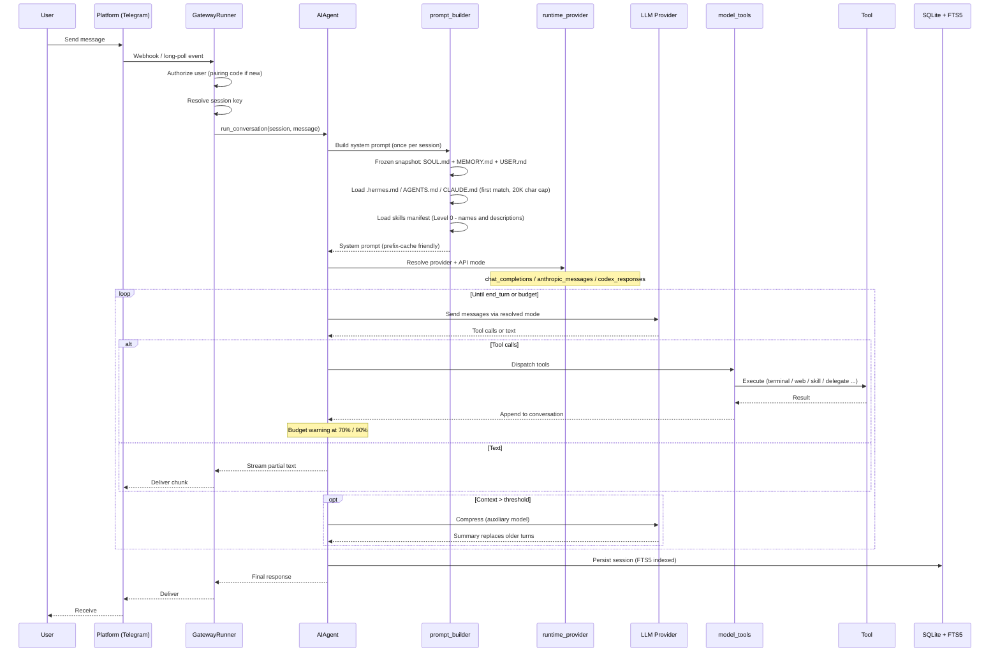
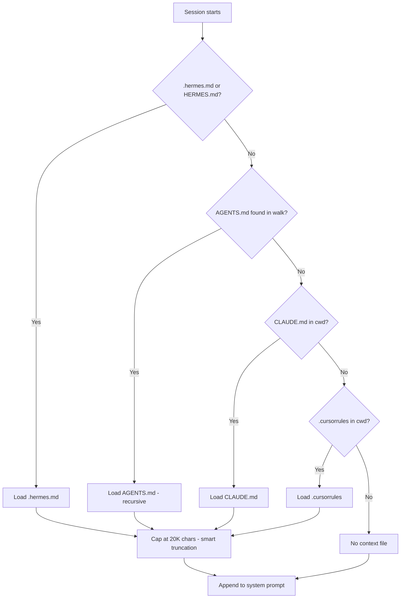
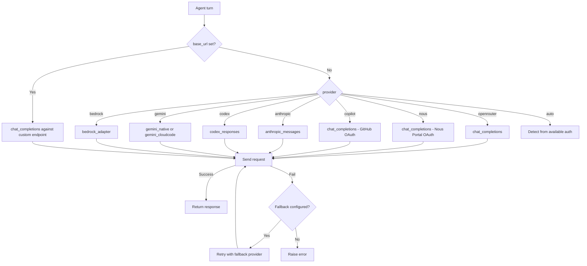
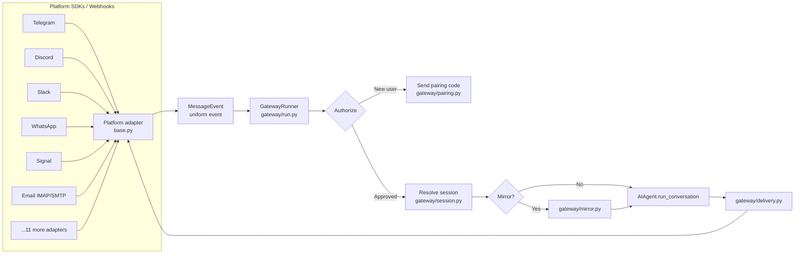

# Hermes Agent: Nous Research's Self-Improving Personal Agent

Repository: https://github.com/NousResearch/hermes-agent

Hermes Agent is an open-source, Python-based AI agent runtime built by Nous Research. Launched in February 2026 as the successor to OpenClaw, it ships as a self-improving personal assistant with a closed learning loop, a platform-agnostic agent core, 47 tools spread across 20 toolsets, a 16-platform messaging gateway, and six terminal backends ranging from a local shell to serverless Modal/Daytona VMs.

This article is a source-code-informed synthesis built on prior research into the repository structure at `NousResearch/hermes-agent` (103K stars, MIT, Python 3.11+).

## What It Is

Hermes is a single agent runtime with many mouths. Every entry point - the TUI, the messaging gateway, ACP editor integration, batch runner, and an API server - funnels into the same conversation loop: `AIAgent.run_conversation()` in `run_agent.py`. Everything else is a front-end or a back-end to that loop.

The product positioning is personal rather than professional. Hermes targets a persistent assistant that lives beyond the laptop, talks to you from Telegram while working on a cloud VM, remembers past conversations, creates its own skills from experience, and builds a durable model of the user across sessions. This is a different category from Claude Code, which is an IDE-embedded coding copilot, and from OpenClaw, which was a single-use Telegram-first persistent assistant.

Three design commitments define the project:

- Model-agnostic runtime. 200+ models via OpenRouter, plus Nous Portal, OpenAI/Codex, Anthropic, Gemini, Bedrock, GitHub Copilot, local endpoints (Ollama/vLLM/SGLang/llama.cpp), and custom base URLs.
- Platform-agnostic front-end. CLI, Telegram, Discord, Slack, WhatsApp, Signal, SMS, Email, Matrix, Mattermost, DingTalk, Feishu/Lark, WeCom, WeChat, BlueBubbles (iMessage), Home Assistant, and a generic webhook.
- Self-improvement. Skills created autonomously after complex tasks (5+ tool calls), skills improved mid-use, periodic memory curation nudges, FTS5 session search with LLM summarization, and optional Honcho dialectic user modeling.

## Repository Topography

The repository is Python-heavy with a small set of very large files doing most of the work:

- `run_agent.py` - 633 KB, the conversation loop and glue code.
- `cli.py` - 472 KB, the user-facing CLI.
- `hermes_cli/main.py` - 310 KB, the hermes command dispatcher.
- `hermes_cli/config.py` - 150 KB, configuration machinery.
- `hermes_cli/gateway.py` - 156 KB, gateway command wiring.
- `gateway/run.py` - 507 KB, the gateway runner.
- `batch_runner.py` - 55 KB, trajectory generation for training.
- `trajectory_compressor.py` - 64 KB, training-time compression.

The `agent/` directory holds domain components: `prompt_builder.py`, `context_compressor.py`, `credential_pool.py`, `auxiliary_client.py` (124 KB - the multi-provider auxiliary model dispatcher), `anthropic_adapter.py`, `bedrock_adapter.py`, `gemini_native_adapter.py`, `gemini_cloudcode_adapter.py`, and `google_oauth.py`. This is where API mode selection, memory loading, prompt caching, redaction, and insights live.

The `tools/` directory has 47 tool files. Notable: `mcp_tool.py` (101 KB), `skills_hub.py` (112 KB), `browser_tool.py` (99 KB), `terminal_tool.py` (85 KB), `send_message_tool.py` (63 KB), `code_execution_tool.py` (61 KB), `rl_training_tool.py` (57 KB), `skills_tool.py` (51 KB), `delegate_tool.py` (50 KB), `tts_tool.py` (50 KB).

The `gateway/platforms/` directory holds per-platform adapters: bluebubbles, dingtalk, discord, email, feishu, homeassistant, matrix, mattermost, qqbot, signal, slack, sms, telegram, webhook, wecom, weixin, whatsapp, and an api_server.

The `plugins/memory/` directory contains 8 external memory providers: byterover, hindsight, holographic, honcho, mem0, openviking, retaindb, supermemory.

The `skills/` directory holds built-in skills organized by category: apple, autonomous-ai-agents, creative, data-science, devops, diagramming, email, feeds, gaming, github, mcp, media, mlops, note-taking, productivity, research, red-teaming, smart-home, social-media, software-development, and more.

## Architecture

Hermes is a hub-and-spoke system with a single agent core, pluggable providers on the model side, pluggable tools on the capability side, and pluggable adapters on the platform side.

```mermaid
graph TB
    subgraph Entry["Entry Points"]
        CLI[hermes chat TUI]
        GW[Gateway: 16 platforms]
        ACP[ACP editor adapter]
        BATCH[Batch runner]
        API[API server]
        CRON[Cron scheduler]
    end

    subgraph Core["Agent Core (run_agent.py)"]
        LOOP[AIAgent.run_conversation]
        PB[prompt_builder.py]
        RP[runtime provider]
        MT[model_tools.py]
        CC[context_compressor.py]
        CRED[credential_pool.py]
    end

    subgraph Identity["Identity and Memory"]
        SOUL[SOUL.md]
        MEM[MEMORY.md]
        USR[USER.md]
        CTX[.hermes.md / AGENTS.md / CLAUDE.md]
        SKILLS[Skills manifest - Level 0]
    end

    subgraph Providers["LLM Providers"]
        NOUS[Nous Portal]
        OR[OpenRouter 200+ models]
        ANTH[Anthropic Messages]
        OAI[OpenAI / Codex Responses]
        GEM[Gemini native / CloudCode]
        BED[Bedrock]
        GH[GitHub Copilot OAuth]
        LOCAL[Local: Ollama/vLLM/SGLang]
        CUSTOM[Custom base_url]
    end

    subgraph Tools["47 Tools / 20 Toolsets"]
        TERM[Terminal: local/docker/ssh/modal/daytona/singularity]
        BROWSE[Browser: Camofox + CDP]
        CODE[Code execution]
        FILE[File ops + patch parser]
        SKILL[skills_tool + skills_hub + skills_guard]
        MEM_T[memory_tool + session_search]
        ORCH[delegate + todo + clarify + mixture_of_agents]
        MSG[send_message + discord + homeassistant + feishu]
        MEDIA[vision + image_gen + tts + neutts + transcription]
        MCP[MCP + OAuth]
        CRON_T[cronjob_tools]
        RL[rl_training_tool]
        SEC[tirith_security + approval + url_safety + osv_check]
    end

    subgraph Aux["Auxiliary Models"]
        VIS[Vision]
        WEB[Web extract]
        COMP[Compression]
        SSRCH[Session search]
    end

    subgraph Store["Persistence"]
        SQL[(SQLite + FTS5)]
        CFG[~/.hermes/config.yaml]
        ENV[~/.hermes/.env]
        AUTH[~/.hermes/auth.json]
        SKDIR[~/.hermes/skills/]
        MDIR[~/.hermes/memories/]
    end

    CLI --> LOOP
    GW --> LOOP
    ACP --> LOOP
    BATCH --> LOOP
    API --> LOOP
    CRON --> LOOP

    LOOP --> PB
    PB --> SOUL
    PB --> MEM
    PB --> USR
    PB --> CTX
    PB --> SKILLS

    LOOP --> RP
    LOOP --> MT
    LOOP --> CC
    LOOP --> CRED

    RP --> NOUS
    RP --> OR
    RP --> ANTH
    RP --> OAI
    RP --> GEM
    RP --> BED
    RP --> GH
    RP --> LOCAL
    RP --> CUSTOM

    MT --> TERM
    MT --> BROWSE
    MT --> CODE
    MT --> FILE
    MT --> SKILL
    MT --> MEM_T
    MT --> ORCH
    MT --> MSG
    MT --> MEDIA
    MT --> MCP
    MT --> CRON_T
    MT --> RL
    MT --> SEC

    LOOP --> VIS
    LOOP --> WEB
    LOOP --> COMP
    LOOP --> SSRCH

    LOOP --> SQL
    LOOP --> CFG
    LOOP --> ENV
    LOOP --> AUTH
    SKILL --> SKDIR
    MEM_T --> MDIR
```



The three stacks (providers, tools, adapters) connect only at the agent core. A user swapping from OpenRouter to a local vLLM endpoint, or from Telegram to Discord, or disabling the browser tool, does not touch any other layer. This separation is what makes the runtime portable from a $5 VPS to a GPU cluster.

## How It Works: Conversation Flow

A conversation turn in Hermes is mostly a prompt-building exercise followed by a provider-agnostic tool loop. The sequence below shows the path from a Telegram message to a delivered response.



The loop is deliberately conservative about prompt mutations. The system prompt is assembled once, frozen for the duration of the session, and reused as-is on every turn. This is what keeps the LLM prefix cache warm across long conversations, which in turn is why Hermes can afford to inject fairly large identity and memory content without paying for it on every turn.

## SOUL, Memory, and Skills

Hermes treats identity and memory as first-class artifacts stored on disk in markdown.

### SOUL.md - Identity

`SOUL.md` occupies slot #1 in the system prompt and replaces the default built-in identity. It carries tone, voice, communication style, and personality-level behaviors. It follows the agent across projects because it lives in `~/.hermes/` rather than in the working directory. The default stub in `hermes_cli/default_soul.py` is only 654 bytes - the expectation is that users (and the agent itself) will grow it over time.

### Memory - Four Layers

Memory in Hermes is split into two in-prompt files and two out-of-prompt stores:

| Layer | Location | Size cap | Purpose |
|-------|----------|---------|---------|
| Agent memory | `~/.hermes/memories/MEMORY.md` | ~2,200 chars (~800 tokens) | Environment facts, conventions, lessons learned |
| User profile | `~/.hermes/memories/USER.md` | ~1,375 chars (~500 tokens) | User preferences, communication style, expectations |
| Session search | SQLite + FTS5 | Unbounded on disk | Full-text searchable history with LLM summarization |
| External memory | `plugins/memory/` (8 providers) | Varies | Knowledge graphs, semantic search, fact extraction |

The 8 memory plugins are first-class: byterover, hindsight, holographic, honcho, mem0, openviking, retaindb, supermemory. Honcho in particular provides dialectic user modeling - a form of continuous inference about the user from conversation content rather than explicit storage.

The in-prompt memory uses a frozen-snapshot pattern. Edits made mid-session go to disk immediately but do not re-enter the system prompt until the next session starts. This is the deliberate trade for keeping the prefix cache intact.

### Skills - Procedural Memory

Skills follow the `agentskills.io` open standard. They are markdown files with structured frontmatter, optionally bundled with reference files. Skills use progressive disclosure across three levels:

```
Level 0: skills_list()          -> names + descriptions   (~3K tokens)
Level 1: skill_view(name)       -> full content + metadata
Level 2: skill_view(name, path) -> specific reference file
```

At session start the agent sees only Level 0. It opens a skill (Level 1) when it decides it needs one, and only reads further reference files (Level 2) if the skill content points to them. This is the same progressive-disclosure pattern Anthropic ships for Claude Code skills, adopted here for token-efficient procedural memory.

Skills are self-improving. After a complex task (5+ tool calls), or when the user corrects the agent's approach, Hermes creates a new skill autonomously. During use, it can also patch existing skills. The result is a compounding effect: the agent becomes more capable for a given user over time with the same base model.

The repository ships a large pre-built skill library under `skills/` covering devops, data science, github, mcp, media, mlops, note-taking, productivity, red-teaming, research, smart-home, social-media, and software-development, plus a dedicated `autonomous-ai-agents/` category with subdirectories for claude-code, codex, hermes-agent, and opencode - skills that coordinate with other coding agents.

## Context Files - First Match Wins

Beyond SOUL and memory, Hermes loads project-level context. Only one file is used, selected by priority:



This is a pragmatic cross-agent compatibility feature. A project with an existing `AGENTS.md` or `CLAUDE.md` works out of the box with Hermes; migrating in requires no file moves. `.hermes.md` is the native format when one is needed.

## Provider Resolution and API Modes

Hermes abstracts over three distinct API shapes used by current LLM vendors: OpenAI-compatible chat completions, Anthropic's Messages API, and OpenAI's Codex Responses API. Each is a first-class adapter in `agent/`.



The `credential_pool.py` module (53 KB) implements key rotation for providers with multiple API keys. Four strategies: `fill_first` (default), `round_robin`, `least_used`, `random`. This matters for heavy OpenRouter or Anthropic users who hit per-key rate limits.

Context length resolution for an arbitrary model is a nine-source chain: explicit config, custom provider settings, persistent local cache, the endpoint's `/models` API, Anthropic's registry, OpenRouter's API, Nous Portal, models.dev (3,800+ models), and a 128K fallback. In practice this means users rarely have to hand-configure context windows even for obscure models.

## Tool System

Hermes exposes 47 tools organized as toolsets. A toolset is a named bundle that can be enabled or disabled as a group. The registry lives in `toolsets.py` and `toolset_distributions.py`.

The terminal tool alone supports six backends, each a separate execution environment:

| Backend | Isolation | Typical use |
|---------|-----------|-------------|
| local | None | Development on trusted machine |
| docker | Full namespaces, cap-drop ALL | Safe sandboxing |
| ssh | Network boundary | Remote dev box |
| modal | Cloud VM, serverless | Ephemeral compute |
| daytona | Cloud container, serverless | Managed dev environments |
| singularity | Namespaces | HPC clusters |

The persistent-shell trick is notable: a long-lived bash process is kept alive across `execute()` calls so state (env vars, cwd, active venv) survives. Enabled by default for ssh, opt-in for local. Docker sandboxes get a fresh shell per invocation.

The browser tool ships Camofox (a stealth-mode Firefox fork) as the default backend, with a CDP-based alternative for Chromium. `browser_tool.py` is the largest non-MCP tool at 99 KB, reflecting how much surface a production browser tool accumulates.

Security runs as a horizontal concern. Three tools participate:

- `approval.py` (41 KB) - interactive approval prompts with auxiliary-LLM risk assessment.
- `tirith_security.py` (26 KB) - policy-as-code command scanning via the Tirith binary.
- `url_safety.py`, `osv_check.py`, `path_security.py` - URL, package vulnerability, and path traversal checks.

The approval system uses a smart-approvals pattern: an auxiliary LLM assesses every dangerous command, auto-approves genuinely safe ones, and escalates risky ones to the user. This keeps the conversation flowing without giving up on safety.

## Messaging Gateway

The gateway is a separate long-running process that multiplexes 16 platforms through the same agent loop. Each platform has an adapter in `gateway/platforms/` that converts platform-native events into a uniform `MessageEvent`. The adapter list is: bluebubbles, dingtalk, discord, email, feishu, feishu_comment, homeassistant, matrix, mattermost, qqbot, signal, slack, sms, telegram, webhook, wecom, weixin, whatsapp, plus an api_server.



The pairing protocol in `gateway/pairing.py` is how new users join without manual config: the bot prints a pairing code on the host, the user sends it from their platform, the gateway binds their platform ID to the host session. This replaces the common pattern of hard-coding Telegram user IDs in config.

The mirror module supports cross-platform continuity - a user can start a conversation on Telegram and continue it on Discord with the agent seeing both sides as one thread. The session key resolution lives in `gateway/session.py` (48 KB).

## Auxiliary Models and Smart Routing

Not every turn should hit the main model. Hermes routes side tasks to separate auxiliary models configured by role:

```yaml
auxiliary:
  vision:         { provider: auto, model: google/gemini-2.5-flash }
  web_extract:    { provider: auto, timeout: 360 }
  compression:    { provider: auto, timeout: 120 }
  session_search: { provider: auto, timeout: 30 }
```

The `agent/auxiliary_client.py` module is 124 KB - by far the largest in `agent/` - because it contains the per-provider quirks for using cheaper models as specialists. Vision analysis of a screenshot, LLM-assisted web page extraction, compression of an overflowing context, and LLM-summarized session search all run on smaller models chosen for the task. This reduces both cost and latency while keeping the main model focused on the primary conversation.

## Context Compression

`agent/context_compressor.py` (56 KB) handles automatic compression. When the conversation exceeds a threshold (default 50% of the model's context window), it calls an auxiliary model to summarize older turns, replacing them with the summary while preserving recent turns verbatim.

Budget pressure is communicated to the agent inline. At 70% of the iteration budget, a caution message is injected into the next tool result. At 90%, a stronger warning. This lets the agent naturally consolidate work rather than being cut off abruptly by a hard stop.

## Cron and Autonomous Runs

`cron/scheduler.py` (46 KB) and `cron/jobs.py` (27 KB) implement scheduled tasks with natural-language specs. A cron job is a one-line instruction the agent has written to itself or that the user asked for. On schedule, a fresh `AIAgent` session runs with the instruction as the user turn, and the result is delivered through any configured platform.

This makes "send me a daily report to Telegram at 8am", "scan my GitHub issues every night and summarize to Slack", or "back up my workspace weekly" all plausible as natural-language commands. The cron surface is deliberately thin - the agent's tool set is what does the work; the scheduler just decides when to run.

## Training Integration

Hermes doubles as a data pipeline for training tool-calling models. Two files matter:

- `batch_runner.py` (55 KB) - runs the agent across many prompts in parallel, saves trajectories.
- `trajectory_compressor.py` (64 KB) - converts conversation histories into training-friendly formats.
- `tinker-atropos/` - submodule for the Atropos RL environment.
- `rl_training_tool.py` (57 KB) - an in-agent tool the agent itself can call to trigger training runs.
- `rl_cli.py` (16 KB) - CLI entry for RL workflows.

The existence of `rl_training_tool.py` as an in-agent tool is unusual: the agent can literally launch a training job against its own trajectories. This is part of the "self-improving" framing - the agent creates experiences, those experiences are stored as trajectories, and the model behind the agent can be fine-tuned on them.

vLLM also ships a native `hermes` tool-call parser (`--tool-call-parser hermes`), which originated with the Hermes-2-Pro models and is now standard infrastructure in the open-source serving stack.

## OpenClaw Migration

The `hermes claw migrate` command transfers state from OpenClaw installations. This is a useful lens on what "state" means for a personal agent. Items migrated include:

- `SOUL.md` persona file.
- `MEMORY.md` and `USER.md` entries.
- User-created skills (to `~/.hermes/skills/openclaw-imports/`).
- Command allowlist / approval patterns.
- Messaging platform configs and allowed users.
- Workspace working directory.
- Allowlisted API keys (Telegram, OpenRouter, OpenAI, Anthropic, ElevenLabs).
- TTS assets.
- Workspace instructions (`AGENTS.md`).

The wizard detects `~/.openclaw` and offers migration automatically during first-time setup, with a `--dry-run` preview and `--preset user-data` (no secrets) mode. There is also an `openclaw-migration` skill that walks the user through an agent-guided migration with risk explanations.

## What Makes This Interesting

A few design decisions stand out after reading the repo structure.

The in-repository `run_agent.py` is 633 KB. Most production agents split that into 30 modules. Hermes keeps the core loop in one very large file on purpose - it is the single point of convergence for every entry point, every provider, every tool. The cost is cognitive load for contributors; the benefit is that a full read of the loop shows everything that happens in a turn, with no hidden indirection.

The frozen-snapshot memory pattern is a conscious trade. Most agent frameworks re-render the system prompt each turn, so memory edits take effect immediately. Hermes freezes at session start so the LLM prefix cache stays hot. For long conversations this is a noticeable cost and latency saver; for users expecting real-time memory updates it is a surprise until explained.

The auxiliary-model architecture is the most practical anti-pattern to "one model does everything". `auxiliary_client.py` at 124 KB is larger than most agent repos in total. Vision, web extraction, compression, and session search all get their own cheap models. Main-model turns stay focused on reasoning.

The gateway's 16-platform surface is larger than what any single developer would build - it exists because this is an agent for personal use, and people live on different platforms. The uniformity of the `MessageEvent` abstraction is what makes 16 adapters tractable. Adding a 17th is mostly writing a connector, not touching the agent.

Smart approvals via auxiliary LLM is a concrete answer to the friction problem with every-command approval. Rather than prompting for every shell command or flipping permissions to allow-all, an auxiliary LLM classifies each command and only escalates non-trivial risks. Combined with Tirith policy-as-code scanning and a six-backend terminal tool, the security surface is layered without being obstructive.

The self-improving skill loop is the feature most different from Claude Code and OpenClaw. Skills get written by the agent after complex tasks, get amended during use, and persist across sessions. Over weeks this produces a personal agent that knows how you work in a way a stateless agent cannot.

The repository's `rl_training_tool.py` and `batch_runner.py` reveal that this is also a data-collection pipeline for Nous Research's model training. Every Hermes user who opts in is contributing trajectories for the next generation of tool-calling models. That is a different business model than Claude Code: Anthropic sells the model via the agent; Nous ships the agent to improve the model.

## Comparison: Hermes vs Claude Code vs OpenClaw

| Aspect | Claude Code | Hermes Agent | OpenClaw |
|--------|------------|--------------|----------|
| Creator | Anthropic | Nous Research | Nader Dabit (tutorial author), community |
| Language | TypeScript (Bun) | Python 3.11+ | Python |
| Model support | Anthropic only | 200+ models, 9 provider types | Anthropic only |
| Primary entry | IDE / CLI | CLI + 16-platform gateway | Telegram bot |
| License | Proprietary | MIT | MIT |
| Memory | 4-layer CLAUDE.md + session | SOUL + MEMORY + USER + FTS5 + 8 plugins | JSONL sessions, SOUL.md, MEMORY.md |
| Skills | Bundled + user skills (agentskills.io) | agentskills.io, auto-created | None |
| Self-improvement | Auto-memories on session end | Autonomous skill creation + amendment | None |
| Messaging | None | 16 platforms | Telegram only (extensible) |
| Terminal backends | Local + subagents | local / docker / ssh / modal / daytona / singularity | Local |
| Security | Permission system | Tirith + smart-approvals + 4 safety tools | Base-command allowlist |
| Compression | Auto-compact + snip + auto-dream | Auxiliary-model compression, 70/90% budget | Manual compaction |
| Scheduled tasks | Via background tasks | Native cron with platform delivery | Manual heartbeats |
| Training integration | None public | Atropos RL + batch trajectories + rl_cli | None |
| Deployment target | Local / IDE | $5 VPS to GPU cluster + serverless | Local / server |
| Setup time | ~2 minutes | ~15 minutes | Variable (tutorial) |

Claude Code is the highest-polish coding agent, tightly coupled to Anthropic's models and optimized for IDE/terminal workflows. Hermes is the most platform-portable personal agent, model-agnostic, with a self-improvement loop built in. OpenClaw was the first-principles Telegram-first predecessor that seeded many of Hermes' patterns (SOUL.md, JSONL sessions, agent loop structure).

For our Telegram writing assistant project, the relevant takeaways are:

- The frozen-snapshot memory pattern is worth copying if we care about prefix-cache reuse.
- The pairing-code authentication pattern in `gateway/pairing.py` is a cleaner way to bind new users than hardcoded IDs.
- The skill progressive-disclosure model (Level 0/1/2) is a concrete way to give an agent a large skill library without blowing up the system prompt.
- The cron + multi-platform delivery architecture is exactly the "schedule a report and deliver to Telegram" pattern we have been building ad-hoc.
- The auxiliary-model pattern for vision, web extraction, and compression keeps costs down without sacrificing quality.

## Technologies

- Python 3.11+
- SQLite + FTS5 for session search
- uv for package management
- Docker for sandboxed execution
- Modal and Daytona for serverless compute
- Singularity for HPC
- Camofox (stealth Firefox) and Chrome DevTools Protocol for browser automation
- Tirith policy-as-code for command security
- Honcho, Mem0, and 6 other memory plugins
- Atropos RL environments via the tinker-atropos submodule
- OpenRouter, Nous Portal, Anthropic, OpenAI/Codex, Gemini, Bedrock, GitHub Copilot, Ollama, vLLM, SGLang, llama.cpp

## Sources

[^1]: User instruction: "research Hermes - analyze source code and architecture"
[^2]: Prior research: [/home/alexey/git/telegram-writing-assistant/research/hermes-research.md](../../research/hermes-research.md)
[^3]: Hermes Agent GitHub repository: https://github.com/NousResearch/hermes-agent
[^4]: Hermes Agent official documentation: https://hermes-agent.nousresearch.com/docs/
[^5]: agentskills.io open standard: https://agentskills.io
[^6]: Honcho dialectic user modeling: https://github.com/plastic-labs/honcho
[^7]: Hermes vs Claude Code vs OpenClaw comparison: https://utilo.io/en/home/blog/hermes-vs-claude-code-vs-openclaw-2026
[^8]: Decrypt coverage - What is Hermes: https://decrypt.co/364211/what-is-hermes-open-source-ai-agent-openclaw-competitor
[^9]: OpenClaw tutorial (predecessor): https://gist.github.com/dabit3/bc60d3bea0b02927995cd9bf53c3db32
