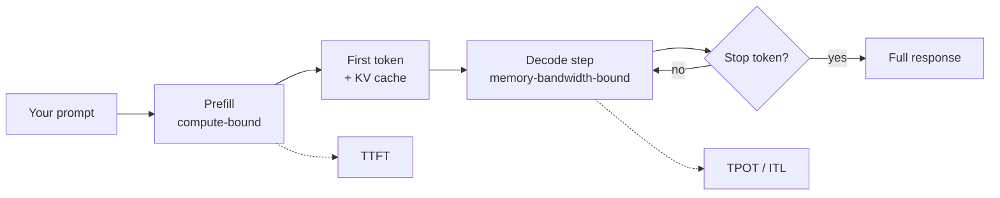
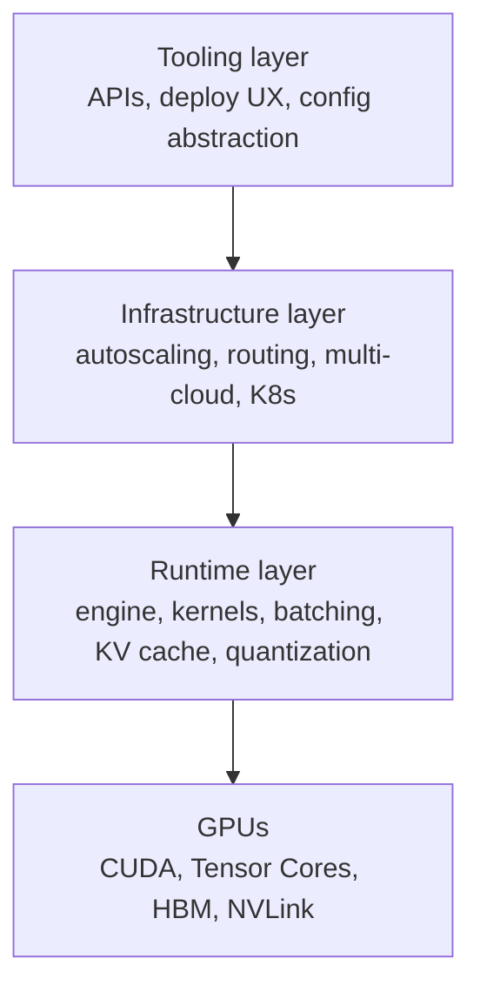
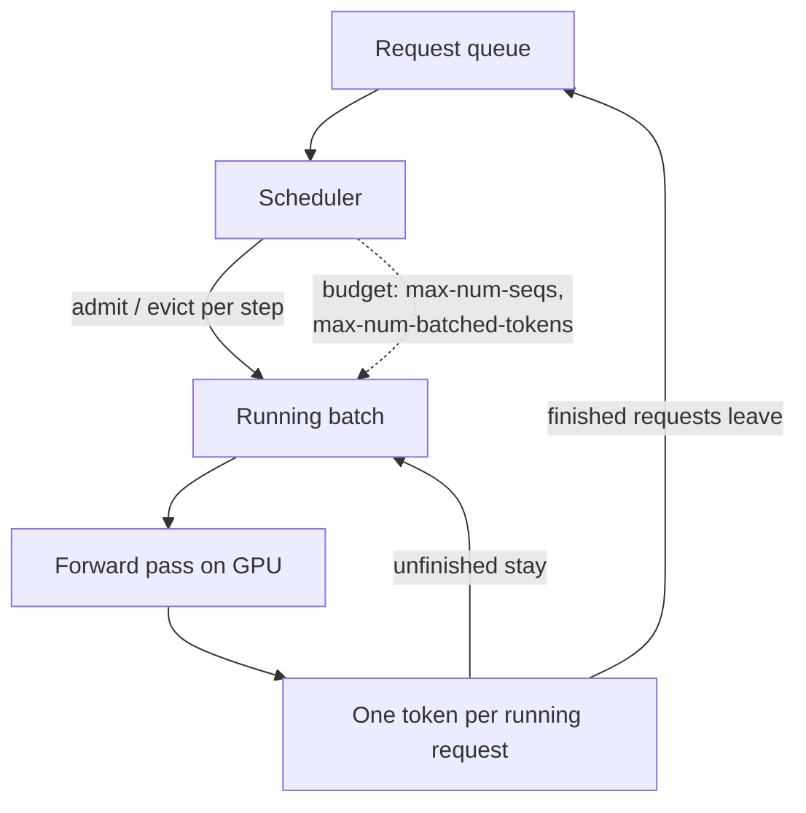
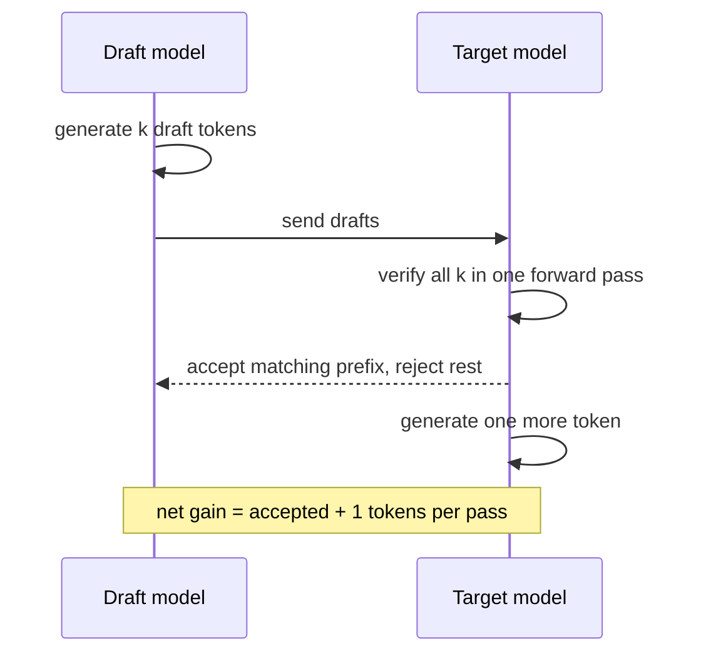
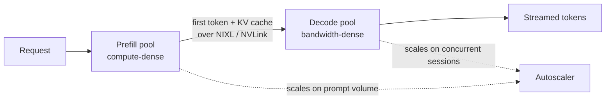
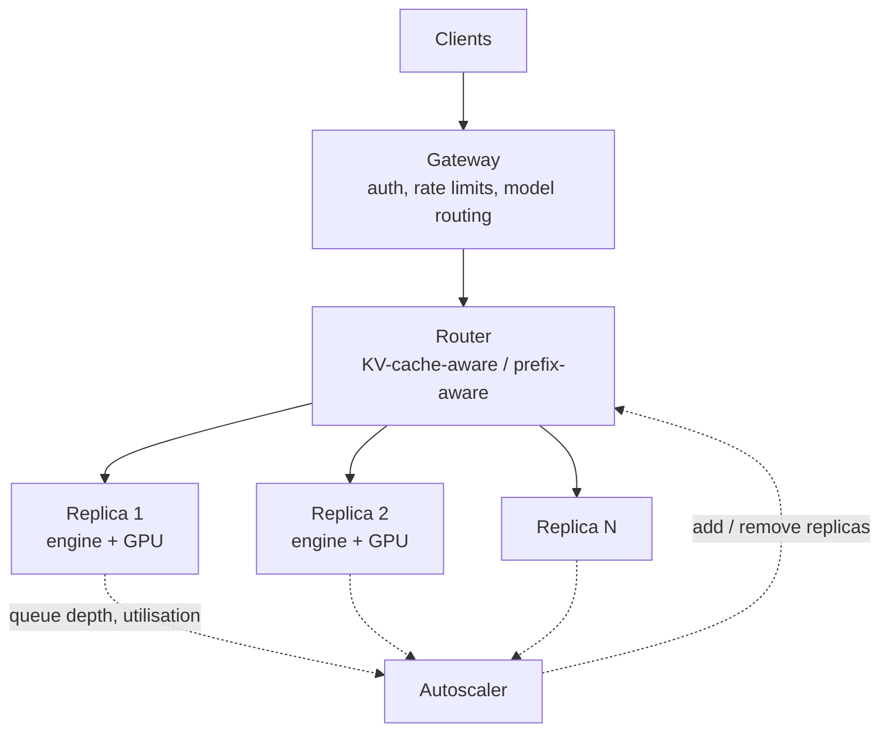

# Inference Engineering

Gokulakannan Sakthivel messaged me on LinkedIn asking whether I was planning a Zoomcamp about inference engineering. I didn't know the term, so I asked what it meant. The answer was "how can we load LLMs in GPU effectively and serve them for a larger audience", plus a link to a ByteByteGo article on the topic.[^1] I recorded a voice note saying that people clearly want material about this, that a course could work for AI Shipping Labs, and that I want four modules that can also run as standalone workshops.[^2] This article is the research behind that.

Inference engineering is the discipline of running trained models in production efficiently. It covers everything from GPU kernels to Kubernetes autoscaling, and it exists because serving a large language model well is a different job from training one.

## Map of This Article

The article walks through the field in the order you'd meet it in practice:

- What the term means, who uses it, and how it differs from ML engineering and MLOps
- The two phases of LLM inference - prefill and decode - which explain almost every technique in the field
- The three layers of an inference stack: runtime, infrastructure, tooling
- Serving engines and runtimes: vLLM, SGLang, TensorRT-LLM, TGI, llama.cpp, Ollama, Dynamo
- Runtime optimisation techniques: KV cache, batching, prefix caching, quantization, speculative decoding, parallelism, disaggregation, LoRA serving
- Serving-level concerns: autoscaling, routing, multi-tenancy, caching, cold starts
- Measurement: TTFT, TPOT, throughput, cost per token, GPU utilisation, benchmarking tools
- A four-module mini course proposal for AI Shipping Labs, plus extra workshop candidates

The optimisation techniques only make sense once you understand the prefill/decode split, so that comes early. The course section at the end maps every technique back to a module.

## The Term and Its Scope

Inference engineering is the practice of serving trained models to users at scale. It's not about building models. It's about making them fast, affordable, and reliable after they're built.[^3]

The clearest definition comes from Philip Kiely at Baseten, who wrote a book called "Inference Engineering" that Gergely Orosz covered in The Pragmatic Engineer.[^4] His framing: inference engineers work across the stack from CUDA to Kubernetes in pursuit of faster, less expensive, and more reliable serving of generative AI models in production.[^4] The book is free to download and there's an interactive companion site with calculators and quizzes.[^5]

When ChatGPT launched in late 2022, there were maybe a few hundred people doing this work, mostly inside frontier labs and at NVIDIA. They didn't call themselves inference engineers.[^4] The term became common in 2025 and 2026, and now you'll find it in job titles, blog posts, and at least one dedicated book.

The scope splits cleanly from neighbouring roles:

| Discipline | Owns | Does not own |
|---|---|---|
| ML engineering | Model training, datasets, evaluation, fine-tuning pipelines | Serving infrastructure, hardware costs, latency SLAs |
| MLOps | CI/CD for ML, experiment tracking, model registry, pipeline orchestration | Serving optimisation, GPU memory management, cost per token |
| Inference engineering | Serving frameworks, GPU selection, KV cache tuning, throughput/latency trade-offs, inference FinOps | Model architecture, training code, data pipelines |

Source: https://www.spheron.network/blog/inference-engineering-guide-2026/

The split happened because serving LLMs at scale needs depth that generalist ML and DevOps roles don't cover. You have to understand GPU memory hierarchies, batching behaviour at the kernel level, quantization accuracy trade-offs, and cost-per-token math at the same time.[^3]

### The Open Model Shift

The reason this became a broad specialty rather than a frontier-lab niche is open models. Hugging Face now hosts well over two million open models, roughly 25 times what existed five years ago.[^6] Once DeepSeek V3 and R1 shipped, the capability gap between open and closed models closed enough that self-hosting became a real choice.[^4]

Self-hosting an open model gives you three things a closed API can't:[^4][^6]

- Latency tuned for your workload, instead of a provider optimising for general throughput across all customers
- Uptime of four nines or better with dedicated deployments, compared to the two nines typical of public APIs
- Cost reductions of around 80 percent at scale, once volume justifies the engineering investment

Cursor is the example everyone cites. The team built Composer 2.0 on top of an open model and applied inference engineering across the stack to get autocomplete latency below what closed APIs offer.[^6]

### Build Versus Buy

Early in an AI product, off-the-shelf APIs are almost always right. Optimisation needs real constraints to work against, and early-stage products have fuzzy assumptions about traffic patterns, latency requirements, and unit economics.[^6]

Three things indicate the equation has shifted:[^6]

1. API costs have grown into a meaningful line item
2. Latency requirements have moved past what closed APIs deliver
3. Reliability needs exceed what vendor SLAs offer

Modal adds a useful sequencing rule: start with a batch "token factory" before you build a streaming token service. Batch workloads like document translation or data extraction from support logs are throughput-bound, much easier to engineer, and easier to beat managed services on price. Interactive streaming is the harder case - build it second, with the experience you gained from the first.[^7]

## Prefill and Decode

Every time a model generates a response, two operations run in sequence on the same GPU. They look like stages of one process, but inside the hardware they have opposite bottlenecks.[^6]

Prefill takes the whole input prompt and runs it through every layer of weights in parallel. It produces two things: the first token of the response, and the KV cache - a store of the key and value tensors from the attention mechanism, so later tokens don't have to recompute them. Prefill is compute-bound. The GPU's math units are the limit, and more raw compute makes it faster. The metric is time to first token, TTFT.[^6]

Decode generates each subsequent token one at a time, running a full forward pass through every layer for every token. Each new token depends on all the tokens before it, so the process is sequential. Decode is memory-bandwidth-bound. Math throughput sits mostly idle while the GPU spends its cycles reading model weights from memory. The metrics are tokens per second, TPS, and inter-token latency, ITL.[^6]

Because the two phases have opposite bottlenecks, a technique that accelerates one often does nothing for the other. That's why benchmarks report TTFT and TPS as separate numbers, and it's the reason the field's techniques sort into three groups: those that speed up prefill, those that speed up decode, and those that rebalance the two against each other.[^6]

Hold on to this split. Everything below refers back to it.

## The Three Layers of an Inference Stack

Kiely's book organises the field into three layers, and that structure doubles as a map of the stack.[^4]

The runtime layer makes one model on one GPU-backed instance run as fast as possible. It depends on CUDA, PyTorch, and an inference engine like vLLM, SGLang, or TensorRT-LLM, plus low-level kernels like FlashAttention.[^4]

The infrastructure layer takes over when a single instance can't absorb the traffic. That's not a CUDA problem or a PyTorch problem - it's a systems problem. Autoscaling comes first, then capacity across regions and clouds past roughly a few hundred GPUs.[^4]

The tooling layer decides how much of this an engineer has to touch. At one extreme you give the platform model weights and get back an API. The other gives you raw compute, network, and disk. Useful tooling sits in the middle: enough control to run production inference confidently, enough abstraction to stay productive.[^4]

The next three sections follow this stack from the bottom up - engines first, then the techniques they implement, then the infrastructure around them.

## Serving Engines and Runtimes

The engine is the piece of software that owns the GPU, schedules requests, manages the KV cache, and exposes an API. Choosing it has more impact on cost and throughput than most hardware upgrades.[^3]

### vLLM

vLLM introduced PagedAttention in 2023 and became the default open-source serving framework. It's a Linux Foundation project that came out of UC Berkeley, built on PyTorch.[^4][^7] The V1 engine refactor shipped around the turn of 2025 and is now the only supported path.

vLLM gives you the widest model coverage, an OpenAI-compatible REST API, and the broadest hardware reach - NVIDIA, AMD ROCm, Intel XPU, TPU. It's the easiest to install and usually the fastest to support a newly released model.[^3][^7][^8] It isn't the absolute fastest on raw NVIDIA throughput.

Source: https://vllm.ai/blog/2025-09-05-anatomy-of-vllm

### SGLang

SGLang comes from LMSYS Org and is also PyTorch-backed.[^4] Its distinguishing feature is RadixAttention, an extension of PagedAttention that stores KV cache blocks in a radix tree so any request sharing a prefix with an earlier one reuses that computation automatically.[^9]

That matters for chatbots, RAG, and agent loops, where a long system prompt or a growing conversation history repeats on every call. Benchmarks put SGLang ahead of vLLM on throughput when requests share context.[^8] SGLang also has strong support for constrained generation of structured outputs.[^3]

Modal ran both engines with default settings across dozens of workloads, from a few billion to nearly a trillion parameters, and found the results strikingly similar - especially on batch throughput. Their conclusion: pick on factors other than raw speed, because untuned performance is comparable.[^7]

### TensorRT-LLM

TensorRT-LLM compiles a model into an optimised CUDA engine ahead of time. The compile step takes 30 to 90 minutes per model per GPU type, and in exchange you get the highest raw throughput available on NVIDIA hardware, including FP4 support on Blackwell.[^3][^8]

The costs are real: NVIDIA-only, slower to update models, Docker-driven setup, and closed governance even though the code is open.[^7][^8] If you might run on AMD MI300, Intel, TPU, or Ascend, TensorRT-LLM is out before you run a single benchmark.[^8]

### Text Generation Inference

Hugging Face's TGI was the default serving engine for a couple of years. It went into maintenance mode in December 2025 and the GitHub repository was archived read-only in March 2026. Hugging Face now recommends vLLM or SGLang for Inference Endpoints.[^10]

If you find a tutorial or a job description that centres on TGI, treat it as historical context rather than a current recommendation.

### llama.cpp and Ollama

llama.cpp is the reference C/C++ implementation that Georgi Gerganov started in March 2023 to run a 13B model on a MacBook. It created the GGUF quantized format that the local-AI ecosystem uses, and it runs on Apple Silicon, CUDA, ROCm, Vulkan, and CPU-only.[^11]

Ollama wraps llama.cpp's ggml engine and removes the compilation, model-file hunting, and shell scripting. Pick it for local prototyping, an agent built on an OpenAI-compatible API, or an internal tool for a handful of users.[^11]

The dividing line is concurrency. For a single user, llama.cpp has less overhead than a production server. Under concurrent load the gap flips hard - one comparison reports vLLM at around 793 tokens/sec against Ollama's 41.[^11] GGUF is also incompatible with vLLM's safetensors-based formats, so the two ecosystems don't share model artifacts cleanly.[^11]

### NVIDIA Dynamo

Dynamo isn't an engine - it sits on top of one. It's a datacenter-scale serving framework that handles disaggregated prefill and decode, KV-cache-aware routing across a GPU fleet, KV cache offload to storage, SLA-based autoscaling, and dynamic GPU scheduling. It supports vLLM, SGLang, and TensorRT-LLM as backends.[^12][^13]

Use Dynamo when you're running large models across multiple nodes. For a single-node deployment it's overhead you don't need.[^3]

### Engine Selection

| Engine | Reach for it when | Main trade-off |
|---|---|---|
| vLLM | Default choice, widest model and hardware support, OpenAI-compatible API | Not the fastest raw throughput |
| SGLang | Prefix sharing dominates: agents, multi-turn chat, RAG, structured output | Smaller ecosystem, fewer edge-case docs |
| TensorRT-LLM | All-in on NVIDIA, latency-critical, can absorb compile time | NVIDIA-only, slow model updates |
| llama.cpp / Ollama | Local, single user, laptop or edge hardware | Collapses under concurrent load |
| NVIDIA Dynamo | Multi-node, disaggregated, large GPU fleets | Operational complexity |

## Runtime Optimisation Techniques

These are the techniques the engines implement. Each one attacks prefill, decode, or the balance between them.

### KV Cache and PagedAttention

Every engine caches keys and values by default within a request. Without it, generating token N would mean recomputing attention over all N-1 previous tokens, which would be unusably slow.[^4]

The problem is size. For a 70B model in FP16, the KV cache for a single 4,096-token request takes roughly 4 GB of VRAM. At 50 concurrent requests that's 200 GB - more than any single GPU holds.[^3]

PagedAttention applies the operating system's virtual memory idea to the KV cache. Each sequence addresses its cache through a logical block table that maps to non-contiguous physical blocks in GPU memory, which removes fragmentation and the wasted pre-allocation you get from reserving a contiguous buffer per request.[^9][^14]

The practical consequence for you: how much KV cache you can hold determines how many requests you can run concurrently, which determines your throughput. Most vLLM tuning comes down to freeing VRAM for more KV cache.

### Continuous Batching and Chunked Prefill

Static batching groups requests into fixed batches and waits for all of them to finish. If one request generates 2,000 tokens and another generates 20, every cycle spent waiting for the long one is wasted capacity.[^3]

Continuous batching works at the iteration level instead. At each decode step, finished requests are immediately replaced with new ones from the queue, so the GPU stays full. Throughput goes up 3 to 5 times against static batching on typical LLM workloads.[^3]

Chunked prefill sits alongside it. Instead of letting a long prefill monopolise a forward pass and stall every decoding request, the scheduler splits the prefill into chunks and interleaves them with decode steps. That smooths inter-token latency for users already streaming while a large prompt arrives.[^14]

Continuous batching, PagedAttention, and chunked prefill compound. Together they're the difference between a naive PyTorch loop and a serving engine.[^14]

The cost of batching is per-user latency. A single user on an unbatched system gets the lowest possible response time. The same user on a heavily batched system waits longer because the GPU is also serving everyone else. This trade-off is the tension every other technique navigates around.[^6]

### Prefix Caching

Prefix caching extends KV cache reuse across requests. When two prompts share an opening segment - a long system prompt identical across thousands of calls - the engine computes that prefix once and reads from cache afterwards. This is why API providers charge less for cached input tokens.[^6]

The catch is that the cache works from the start of the sequence to the first non-matching token. If the first token differs, prefix caching gives you nothing even if everything after it is identical.[^4]

That makes prompt structure a latency and cost decision. Keep shared content early, put variable user input as late as possible. Workloads where this pays off most:[^4]

- Agents, chatbots, and RAG scaffolds with long system prompts on every call
- Code completion, where the same thousands of lines of context repeat
- Document summarisation and retrieval with repeated context blocks
- Multi-turn conversations, where every turn replays the whole history

SGLang's RadixAttention automates the matching across the whole batch rather than requiring an exact prefix key.[^9]

### Quantization

Quantization stores model weights in a lower-precision number format. Models usually train in BF16 or FP16, and quantization compresses to 8-bit or 4-bit.[^4]

It helps both phases, for different reasons. Prefill speeds up because lower-precision math runs faster on Tensor Cores. Decode speeds up because half as much data moves per weight read, effectively doubling memory bandwidth. Cutting precision one level typically yields 30 to 50 percent better performance - not 2x, because working with quantized data adds its own overhead.[^4][^6]

| Precision | Memory vs FP16 | Throughput gain | Accuracy impact |
|---|---|---|---|
| FP16 | 1x | baseline | none |
| FP8 | 0.5x | 1.5-2x | under 1 percent on most models |
| INT4 AWQ | 0.25x | 2-3x | 1-3 percent on sensitive tasks |

Source: https://www.spheron.network/blog/inference-engineering-guide-2026/

Floating-point formats beat integer formats at the same bit width because the exponent bits give a much wider dynamic range, and outlier values matter a lot in inference.[^4] Within 4-bit there are multiple options - FP4, MXFP4, NVFP4 - that differ in granularity, meaning how many values share a single scale factor. More granular means better quality and more overhead for storing scale factors.[^4]

Different parts of a model tolerate quantization differently. From least to most sensitive:[^4][^6]

1. Linear weights - handle it well
2. Activations - somewhat sensitive, rarely quantized because they're a tiny fraction of the model
3. KV cache - moderately sensitive
4. Attention layers - highly sensitive, especially softmax

Attention is the riskiest because each attention calculation builds on the previous ones, so small precision errors compound across thousands of tokens. Most production setups leave attention at full precision.[^4][^6]

Quantizing the KV cache is a special case. It lets the engine hold more cache in memory and read it faster, which makes prefix caching and disaggregation more effective. But KV cache errors compound token to token, so it needs testing against a quality eval, not just a throughput benchmark.[^4]

On tooling, llm-compressor is the vLLM-project library for producing quantized models. It supports FP8, INT8, INT4, NVFP4, MXFP4, AWQ, GPTQ, and mixed precision, and emits the compressed-tensors format that vLLM loads directly. You can mix schemes - NVFP4 on MoE layers, FP8 on attention layers - in one model.[^15][^16]

### Speculative Decoding

Speculative decoding exploits an asymmetry: generating a token is expensive, verifying a candidate token is cheap. Solving a sudoku is hard, checking a solved one is easy.[^4]

A speculator generates one or more draft tokens. The target model - the one you're accelerating - validates all of them in a single forward pass, accepts the prefix that matches its own predictions, rejects the rest, and generates one more token of its own. You get N+1 tokens per forward pass where N is the number of accepted drafts.[^4][^17]

Three factors decide the payoff:[^4]

- Draft token cost - how long it takes to produce a draft
- Draft sequence length - how many drafts per forward pass
- Token acceptance rate - what fraction the target model accepts

Aim for short, high-acceptance sequences. Once one draft token is rejected, everything after it in that sequence is discarded too.[^4] In practice it only helps above roughly 80 percent acceptance. Below that you're spending compute on rejected proposals.[^3]

Acceptance rate depends on things you may not expect. Higher temperature makes the token distribution harder to predict and drops acceptance. Subject matter matters too, if the draft model is better versed in code than in history.[^4]

The important constraint: speculative decoding improves TPS and ITL but leaves TTFT unchanged, because prefill runs normally. And it only works at low to moderate batch sizes where there's spare compute. At high batch sizes the GPU is saturated and engines dynamically disable speculation.[^4][^6] That's a direct conflict with batching - a good example of two optimisations that fight each other.

Models trained with multi-token prediction heads, like DeepSeek V3, can produce 2 to 4 tokens per forward pass without the draft-model overhead.[^3]

### Parallelism

When a model doesn't fit on one GPU, or single-GPU latency is too high, you split it.

Tensor parallelism splits each layer across GPUs. Every GPU holds a fragment of every layer and they share the per-layer work. Results need an all-reduce after each layer, so it needs high-bandwidth interconnects like NVLink. TP is the default for large dense models and improves per-user TPS.[^4][^6]

Expert parallelism applies to mixture-of-experts models, where only a subset of parameters activate per token. Experts get distributed across GPUs and tokens route to whichever experts they need. Communication overhead is lower than TP because experts operate independently, which makes EP suit multi-node deployments with limited interconnect bandwidth. EP improves total system throughput rather than per-user latency.[^4][^6]

Pipeline parallelism chains model stages across nodes. It adds inter-node latency to every forward pass, so use it only when the model doesn't fit on one node with TP.[^3]

Most production deployments mix them - TP within a node, EP across nodes, often TP for attention and EP for the sparse MoE layers.[^4][^6] Concrete starting points on 8-GPU H100 nodes: TP=8 for 70B FP16, TP=4 for 70B FP8, TP=8 for 405B FP8.[^3]

### Disaggregation

Disaggregation takes the prefill/decode split literally: run prefill on one pool of GPUs and decode on another, shipping the KV cache between them over a fast interconnect.[^6][^18]

When prefill and decode share a node under heavy traffic they compete for resources. Separating them lets you tune each engine independently - the compute-bound prefill engine wants a lower TP than the memory-bound decode engine - and scale each pool on its own traffic profile.[^4]

Conditional disaggregation is the version that works on real traffic. The request goes to the decode engine first. If the input is already cached or short enough, decode handles prefill locally and skips the handoff. Otherwise it hands off to the prefill pool.[^4][^6]

For long-context workloads with 8K+ token prompts at high concurrency, disaggregation has been reported to deliver 60 to 75 percent throughput improvement over colocated serving.[^3] The original research is the DistServe paper.[^19] NVIDIA Dynamo is the production implementation most teams use.[^12]

### Multi-LoRA Serving

LoRA adapters are small weight deltas trained on top of a base model. Multi-LoRA serving keeps one copy of the base model on the GPU and swaps adapters per request, so dozens or hundreds of fine-tuned variants share the same hardware.[^20]

The research system is S-LoRA, which serves thousands of concurrent adapters from a single machine using a unified memory pool, adapter batching, and custom CUDA kernels.[^21] vLLM supports LoRA adapters natively, including for MoE models like GPT-OSS and Qwen.[^20][^22]

This is the technique that makes per-customer or per-task fine-tuning economical. Instead of one GPU per customer, you fine-tune once per customer and serve them all from one replica.

### Structured Output

Constrained decoding forces the model's output to match a grammar or JSON schema by masking invalid tokens at each sampling step. XGrammar is the default backend for vLLM, SGLang, and TensorRT-LLM as of 2026, using JIT-compiled grammars with under 40 microseconds per token of overhead. Outlines is the alternative, based on finite state machines, which handles simple schemas well but flattens or rejects deeply recursive structures.[^23]

This belongs in an inference course because it's a serving-side feature with a measurable latency cost, not something you solve with prompt wording.

## Serving-Level Concerns

Runtime optimisation makes one replica fast. Everything in this section handles the fact that one replica is never enough.

### Autoscaling

The goal of autoscaling is to always have enough replicas to serve incoming requests while meeting latency SLAs and not paying for idle GPUs.[^4]

There are two signals to scale on, and they don't always agree. Utilisation - GPU memory or compute usage - is a lagging indicator. Traffic - requests in the system - lets you act proactively. In prefill, a few requests with hundreds of thousands of uncached input tokens can spike utilisation far more than many small requests with high cache hit rates. Use both.[^4]

Five parameters control a traffic-based autoscaler:[^4]

1. Min replicas - how many stay running regardless of traffic
2. Max replicas - the ceiling when traffic is high
3. Autoscaling window - the sliding timeframe used to measure traffic
4. Scale-down delay - how long to wait after a scale-down is suggested, in case another spike arrives
5. Concurrency target - how many requests each replica handles at the same time

On Kubernetes, the common 2026 stack is vLLM for inference, KServe for model serving, Kueue for GPU scheduling, KEDA for metric-driven replica scaling, and Karpenter or Cluster Autoscaler for GPU nodes. KEDA typically scales on vLLM's own queue-depth metric, `vllm:num_requests_waiting`, which reacts before requests get dropped.[^24]

### Cold Starts

Cold start is the problem that makes GPU autoscaling different from web-service autoscaling. A new pod has to pull a container image, load model weights into VRAM, capture CUDA graphs, and warm its KV cache. Reported figures run from 60 to 120 seconds for weight loading alone, and 3 to 10 minutes end-to-end in bad cases - all while the existing pod is already overloaded.[^24]

The practical consequence: scale-to-zero is fine for batch and internal tools, but for latency-sensitive services you keep min replicas above zero and accept the idle cost.[^24]

### Routing

A plain round-robin load balancer throws away prefix cache hits. If a follow-up message in a conversation goes to a different replica than the first one, the whole conversation gets re-prefilled.

KV-cache-aware routing fixes that. Dynamo's LLM-aware router computes an overlap score between an incoming request and the KV cache blocks active across every GPU in the cluster, then routes to the worker with the best combination of cache overlap and current load.[^13] Baseten reported 2x faster inference from adopting it.[^25] In the Kubernetes world, llm-d implements prefix-cache-aware routing through the Gateway API Inference Extension, scoring decode pods by prefix match length.[^26][^27]

### Multi-Tenancy

Multi-tenancy shows up in three forms, and they need different answers:

- Many customers on one base model - handled by batching and fair scheduling
- Many fine-tunes of one base model - handled by multi-LoRA serving
- Many different models - handled by multi-model endpoints, or by routing at the gateway on the `model` field in the request body[^24]

### Caching Layers

Prefix caching is the engine-level cache. Above it sit two more:

- KV cache offload to CPU memory or storage, so evicted blocks can be pulled back instead of recomputed. LMCache and Dynamo both do this.[^12]
- Semantic caching at the application layer, which returns a stored answer when a new question is close enough to an old one. Reported hit rates of 30 to 70 percent on agent and FAQ traffic.[^3]

### Multi-Cloud

Past a few hundred GPUs, the problem becomes capacity. Teams spread across regions and providers, which creates silos where one cluster starves while another sits idle.[^4]

Real multi-cloud inference needs a control plane that makes deployment and global scaling decisions, plus workload planes that serve traffic and report utilisation. The separation means a failure in the control plane or one workload plane doesn't take down the others.[^4] Beyond capacity, it buys redundancy against provider outages, lower latency by running near users, and compliance with data sovereignty rules.[^4]

## Measurement

You can't do any of this without measuring it. The metrics are where the field's trade-offs become visible.

### The Metrics

- TTFT (time to first token) - how long prefill takes. This sets perceived responsiveness.
- TPOT (time per output token) or ITL (inter-token latency) - the streaming pace during decode.
- TPS (tokens per second) - the inverse of TPOT, per user.
- E2EL (end-to-end latency) - total request time, roughly TTFT + TPOT × output length.
- Throughput - total tokens per second across all concurrent requests on a replica.
- Goodput - throughput counted only over requests that met their latency SLO. This is the number that matters when you have SLAs.
- Cost per million tokens (CPM) - GPU hourly rate divided by throughput, converted to per-million-token terms.
- GPU utilisation and MFU (model FLOPs utilisation) - how close you are to the hardware's speed of light.

vLLM's benchmark CLI reports ttft, tpot, itl, and e2el directly.[^28] NVIDIA's benchmarking guide is a good reference for the definitions.[^29]

### The Trade-off Curve

There isn't one number for how fast your deployment is. There's a curve. As you raise the request rate, throughput climbs and per-user latency degrades. Where you sit on that curve is a product decision.

Modal's experiment gives you the numbers: running Llama 3.1 70B in FP8 with 1,024-token inputs and 128-token outputs, both vLLM and SGLang hit around 17 QPS per 8xH100 replica untuned. Sacrificing interactivity from roughly 200 ms end-to-end to roughly 4 s end-to-end gave an 8x throughput increase.[^7]

Their reported economics: about 20k tokens/sec with Llama 3.1 70B FP8 at around 50 cents per million tokens on usage-based pricing.[^7] Another set of figures puts managed APIs for 70B-class models at $0.50 to $0.90 per million tokens, against $0.20 to $0.35 self-hosted at an optimised configuration.[^3]

Modal also makes a point to remember before you start benchmark-shopping: all the engines use the same CUDA, cuBLAS, and CUTLASS foundations and run at a high fraction of the hardware's speed of light. That caps the room for speedups at roughly 2 to 3 times, absent algorithmic differences, which diffuse between projects quickly anyway.[^7]

### Tools

- `vllm bench serve` - built into vLLM, sends a request stream at a target rate and reports the latency metrics[^28]
- GuideLLM - a vLLM-project benchmarking framework with live progress, report generation, and more flexible dataset loading and workload patterns than the built-in CLI[^30]
- genai-perf - NVIDIA's client-side tool, works against any OpenAI-compatible backend
- Modal's stopwatch - finds the upper and lower throughput bounds for a workload on given hardware, then sweeps request rates in between[^7][^31]

### Ranked Cost Levers

| Lever | Typical saving | Effort |
|---|---|---|
| Continuous batching | 2-3x throughput at same GPU cost | Low - default in vLLM and SGLang |
| FP8 quantization | 40-50 percent more tokens per dollar | Low - a single flag |
| Right-sizing the GPU | 30-50 percent vs defaulting to H100 for small models | Low - one-time benchmark |
| Spot instances | 40-60 percent cost reduction | Medium - needs retry logic |
| Prefix caching | 20-40 percent for shared-prompt workloads | Medium - config plus prompt structure |

Source: https://www.spheron.network/blog/inference-engineering-guide-2026/

### Technique to Metric Map

This table connects everything above back to the prefill/decode split. It's also the outline of what a course has to teach.

| Technique | Improves TTFT | Improves TPOT/TPS | Improves throughput | Main cost |
|---|---|---|---|---|
| Continuous batching | no | no | yes, 3-5x | per-user latency |
| Chunked prefill | slightly worse | yes | yes | scheduler complexity |
| Prefix caching | yes | no | yes | memory, prompt discipline |
| Quantization | yes | yes | yes | output quality risk |
| Speculative decoding | no | yes | no | breaks at high batch size |
| Tensor parallelism | yes | yes | modest | interconnect bandwidth |
| Expert parallelism | no | no | yes | MoE models only |
| Disaggregation | yes | yes | yes | operational complexity |
| Multi-LoRA | no | no | yes, per-model | adapter management |

## A Four-Module Mini Course for AI Shipping Labs

Each of the four modules below has a topic list, a hands-on piece, and a note on whether it stands alone as a workshop.

The design principle: every module produces a number that the next module tries to beat. Module 1 establishes a baseline, module 2 tunes one replica against it, module 3 goes multi-GPU, module 4 puts it in production. That gives the mini course a spine and gives each workshop its own deliverable.

### The Existing vLLM Workshop

DataTalks.Club already has vLLM material - the Open-Source LLM Zoomcamp covers "Serving LLMs with vLLM" inside module 1, alongside running DeepSeek R1 on AMD MI300x hardware and building a Streamlit chat app.[^32]

That material is the "get an open model answering HTTP requests" step. In this course it belongs as prerequisite material for module 1, not as a module of its own. Module 1 then spends its time on the part the existing workshop doesn't cover: the mental model of prefill and decode, GPU memory math, and measurement. The other three modules go somewhere the existing workshop never goes - tuning, multi-GPU, and production operations - so there's no repetition.

If you want the existing workshop to keep running standalone, the cleanest framing is "Serving Your First Open Model" as a free entry point, with the four-module course as the paid follow-on.

### Module 1: Serving and Measuring

Covers:

- Prefill and decode, and why they have opposite bottlenecks
- GPU memory math: weights + KV cache + activations, and how that sets your concurrency ceiling
- GPU selection - matching model size and context length to HBM capacity and memory bandwidth
- The metrics: TTFT, TPOT, ITL, E2EL, throughput, goodput
- The latency/throughput curve and where your product should sit on it
- Cost per million tokens, and comparing it to a managed API price

Hands-on: rent a GPU, serve an open model with vLLM, then run `vllm bench serve` or GuideLLM at several concurrency levels. Plot the latency/throughput curve. Compute cost per million tokens. Compare against a provider's published price and write down at what volume self-hosting starts to win.

Standalone workshop: yes, and this is the strongest standalone of the four. "Benchmark your LLM deployment and find out what a token actually costs you" is a talk people show up for, and it needs one GPU and two hours.

Prerequisite: the existing vLLM workshop, or its recording.

### Module 2: Tuning One Replica

Covers:

- Quantization: FP8, INT4 AWQ and GPTQ, NVFP4, what each part of the model tolerates
- Producing quantized models with llm-compressor and the compressed-tensors format
- KV cache quantization and its compounding-error risk
- Prefix caching, and structuring prompts so the cache actually hits
- Chunked prefill and the batching parameters: `max-num-seqs`, `max-num-batched-tokens`, `gpu-memory-utilization`
- Speculative decoding: draft models, acceptance rate, and why it turns off at high batch size
- Which optimisations conflict with each other

Hands-on: a tuning tournament. Everyone starts from the module 1 baseline and tries configurations. Submit your best TTFT, TPOT, and cost-per-million triple to a shared leaderboard. Pair it with a small quality eval so nobody wins by quantizing the model into nonsense.

Standalone workshop: yes. "Make your model 2x cheaper without breaking it" works as a single session, though you'd trim speculative decoding to a demo to fit the time.

### Module 3: Scaling Past One GPU

Covers:

- Tensor parallelism, expert parallelism, pipeline parallelism, and when each applies
- MoE models and why they change the parallelism calculus
- Interconnects: NVLink within a node, network between nodes, and why that decides TP versus EP
- Disaggregated prefill and decode, including conditional disaggregation
- KV-cache-aware routing and KV cache offload
- NVIDIA Dynamo and llm-d as the production implementations

Hands-on: serve a model that doesn't fit on one GPU using tensor parallelism, verify that throughput scales close to linearly, and find the point where it stops. Then stand up a two-pool prefill/decode deployment with Dynamo and measure the difference on a long-context workload against the colocated baseline.

Standalone workshop: partly. This one needs multi-GPU hardware, which makes it harder to run for a room of people. Options: run it on a shared cluster with everyone on one deployment, cut it down to a demo-plus-discussion format, or restrict the hands-on part to the TP scaling test on a 2-GPU instance and keep disaggregation as a walkthrough.

### Module 4: Production Operations

Covers:

- Containerising an engine and deploying it on Kubernetes
- Autoscaling on queue depth with KEDA, and the five parameters that control it
- Cold starts, scale-to-zero, and why min replicas is usually above zero
- Gateways, routing, and rate limiting
- Multi-tenancy: many customers, many LoRA adapters, many models
- Multi-LoRA serving with vLLM
- Semantic caching at the application layer
- Observability: what to log, what to alert on, and defining TTFT and ITL SLOs
- Spot instances, multi-region, and the FinOps view

Hands-on: deploy the tuned model behind a gateway with autoscaling. Run a synthetic traffic spike and watch the SLO violations arrive during the cold start. Tune min replicas and scale-down delay until the spike is absorbed, then compute what the fix cost per month. Then load three LoRA adapters onto one replica and route between them.

Standalone workshop: yes. "Autoscaling LLM inference without blowing your budget" is a self-contained session with a clear before/after.

### Capstone

If the mini course wants a project: take one model, one workload profile, and one latency SLO, and produce a deployment plus a written report showing the baseline, every optimisation you applied, what each one gave you, and the final cost per million tokens against the managed-API alternative. That's the artifact an inference engineer actually delivers at work.

## Other Workshop Candidates

Topics that don't fit the four modules but would work as standalone sessions:

- SGLang and RadixAttention for agent workloads - build an agent loop and measure the prefix cache hit rate
- TensorRT-LLM engine compilation - what you get for the 30 to 90 minutes, and when it's worth it
- Local inference: llama.cpp, GGUF, and Ollama on a laptop, with the concurrency cliff demonstrated live
- Structured output and constrained decoding - XGrammar versus Outlines, and what schema enforcement costs in tokens per second
- Serving embeddings and rerankers - different bottlenecks, much smaller models, a different batching profile
- Speech inference: Whisper for ASR and TTS, where real-time constraints bite differently
- Image and video generation inference - diffusion models have their own optimisation set
- Building your own load generator, so you understand what the benchmarking tools are doing
- The batch token factory - an offline batch pipeline for data extraction, which Modal argues you should build before any streaming service
- Prompt and context engineering for cache hit rate - the application-side counterpart to prefix caching
- Build versus buy cost modelling - a spreadsheet workshop, no GPU required
- Fine-tune then serve - LoRA training through to multi-LoRA serving, end to end
- Writing a Triton kernel and plugging it into vLLM
- GPU hardware selection - reading spec sheets, and what HBM capacity and memory bandwidth mean for your model

The spreadsheet workshop deserves a note. Build versus buy needs no GPU, no CUDA, and no Kubernetes, and it's the question most people in the audience actually face. It could be the free lead magnet for the paid course.

## Sources

[^1]: [20260730_111602_AlexeyDTC_msg4801_photo.md](../../inbox/used/20260730_111602_AlexeyDTC_msg4801_photo.md)

[^2]: [20260730_130806_AlexeyDTC_msg4803_transcript.txt](../../inbox/used/20260730_130806_AlexeyDTC_msg4803_transcript.txt)

[^3]: What Is Inference Engineering? The 2026 GPU Cloud Guide - https://www.spheron.network/blog/inference-engineering-guide-2026/

[^4]: What is inference engineering? Deepdive, The Pragmatic Engineer with Philip Kiely - https://newsletter.pragmaticengineer.com/p/what-is-inference-engineering

[^5]: Inference Engineering, interactive guide based on Philip Kiely's book - https://inferenceengineering.tech/ and the free e-book at https://baseten.com/inference-engineering

[^6]: A Guide to AI Inference Engineering, ByteByteGo - https://blog.bytebytego.com/p/a-guide-to-ai-inference-engineering

[^7]: LLM Engineer's Almanac, Executive Summary, Modal - https://modal.com/llm-almanac/summary

[^8]: vLLM vs TensorRT-LLM vs SGLang: Which Is Fastest? H100 Benchmarks - https://www.spheron.network/blog/vllm-vs-tensorrt-llm-vs-sglang-benchmarks/

[^9]: SGLang documentation - https://docs.sglang.ai/

[^10]: Hugging Face text-generation-inference repository, maintenance mode and archival - https://github.com/huggingface/text-generation-inference

[^11]: Ollama vs llama.cpp vs vLLM comparison - https://insiderllm.com/guides/llamacpp-vs-ollama-vs-vllm/

[^12]: NVIDIA Dynamo - https://github.com/ai-dynamo/dynamo and https://docs.dynamo.nvidia.com/dynamo/design-docs/disaggregated-serving

[^13]: NVIDIA Dynamo Router Guide, KV cache aware routing - https://docs.nvidia.com/dynamo/user-guides/kv-cache-aware-routing

[^14]: Inside vLLM: Anatomy of a High-Throughput LLM Inference System - https://vllm.ai/blog/2025-09-05-anatomy-of-vllm

[^15]: llm-compressor - https://github.com/vllm-project/llm-compressor

[^16]: vLLM quantization documentation - https://docs.vllm.ai/en/latest/features/quantization/

[^17]: Fast Inference from Transformers via Speculative Decoding - https://arxiv.org/abs/2211.17192

[^18]: Efficient Memory Management for Large Language Model Serving with PagedAttention - https://arxiv.org/abs/2309.06180

[^19]: DistServe: Disaggregating Prefill and Decoding for Goodput-optimized Large Language Model Serving - https://arxiv.org/abs/2401.09670

[^20]: Efficiently serve dozens of fine-tuned models with vLLM - https://blog.vllm.ai/2026/02/26/multi-lora.html

[^21]: S-LoRA: Serving Thousands of Concurrent LoRA Adapters - https://arxiv.org/abs/2311.03285

[^22]: vLLM LoRA adapters documentation - https://docs.vllm.ai/en/latest/features/lora/

[^23]: Structured Decoding in vLLM: a gentle introduction - https://blog.vllm.ai/2025/01/14/struct-decode-intro.html

[^24]: GPU Inference Autoscaling with KEDA and Knative on Kubernetes - https://www.spheron.network/blog/keda-knative-gpu-autoscaling-kubernetes-llm-cold-start/

[^25]: How Baseten achieved 2x faster inference with NVIDIA Dynamo - https://www.baseten.co/blog/how-baseten-achieved-2x-faster-inference-with-nvidia-dynamo/

[^26]: llm-d - https://llm-d.ai/

[^27]: Kubernetes Gateway API Inference Extension - https://gateway-api-inference-extension.sigs.k8s.io/

[^28]: vLLM benchmark CLI - https://docs.vllm.ai/en/latest/cli/bench/serve/

[^29]: LLM Inference Benchmarking: Fundamental Concepts, NVIDIA - https://developer.nvidia.com/blog/llm-benchmarking-fundamental-concepts/

[^30]: GuideLLM - https://github.com/vllm-project/guidellm

[^31]: LLM Engineer's Almanac, How to Benchmark LLM Engines, Modal - https://modal.com/llm-almanac/how-to-benchmark

[^32]: DataTalks.Club Open-Source LLM Zoomcamp - https://github.com/DataTalksClub/open-source-llm-zoomcamp
