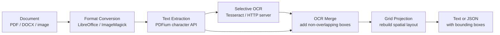
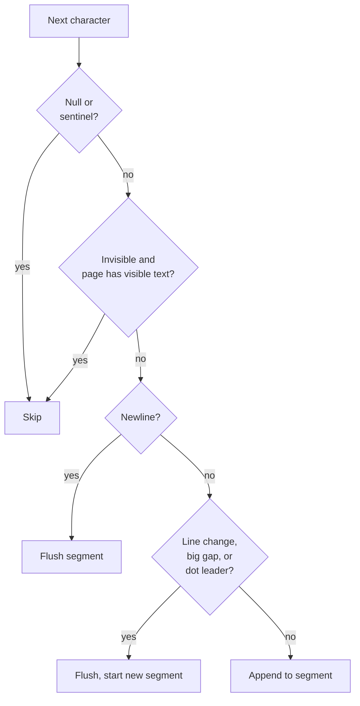
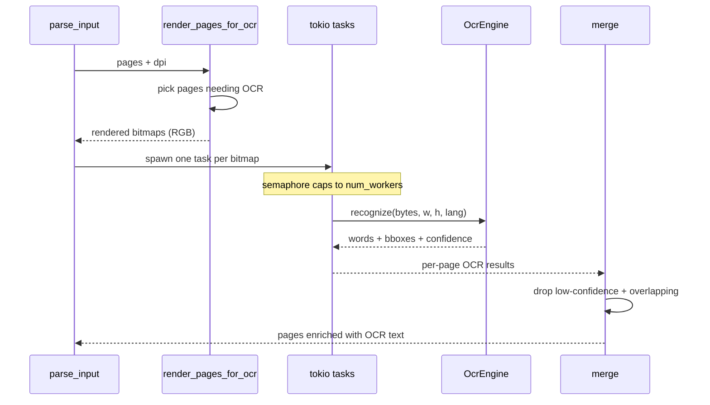
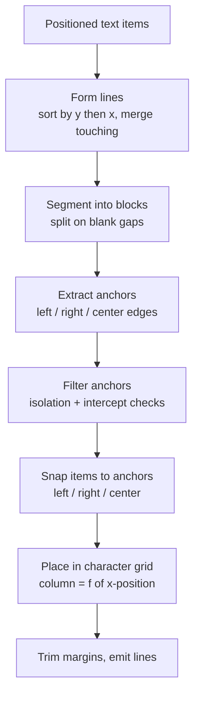

# LiteParse: How LlamaIndex's Local Document Parser Reconstructs Layout

https://github.com/run-llama/liteparse

LiteParse is an open-source document parser from the LlamaIndex team (run-llama). It extracts text from PDFs and other documents, keeps the spatial layout, and runs entirely on your machine with no cloud calls and no LLM. The interesting part is how it works: there is no model doing the parsing. The core is a geometry engine that reads character positions out of a PDF and rebuilds the page as a grid of monospace text.

This article walks through that engine. The order is: what LiteParse is and what it does, then the parsing pipeline end to end, then a deep look at each stage (text extraction, the OCR fallback, and the grid projection that produces layout-aware output), and finally how it compares to LlamaParse and other parsers. If you only care about the core mechanism, the section on grid projection is where the real work happens.

## What LiteParse Is

LiteParse is a Rust library with a CLI (`lit`) and bindings for Node.js, Python, and the browser (WASM). The same Rust core runs everywhere; the bindings are thin wrappers generated with napi-rs, PyO3, and wasm-bindgen.

The team describes it as the open-sourced core of LlamaParse, their cloud parser. LlamaParse keeps the proprietary, LLM-heavy features in the cloud. LiteParse takes the fast local part - spatial text extraction with bounding boxes - and ships it as a standalone tool.

What it gives you:

- Fast text extraction from PDFs using PDFium, the rendering engine from Chromium.
- Bounding boxes for every piece of text, so you know where each word sits on the page.
- Layout-preserving output as plain text or JSON. Tables, columns, and indentation survive.
- An OCR fallback for scanned pages and embedded images, with a pluggable engine.
- Page screenshots as PNG, meant for feeding to a vision model when text alone is not enough.
- Multi-format input: DOCX, PPTX, XLSX, and images, converted to PDF first.

What it is not: it does not call an LLM to parse, it does not run layout-detection neural networks, and it does not depend on any cloud service. Everything is local. For dense tables, multi-column scans, charts, or handwriting, the README points you to the cloud LlamaParse instead. LiteParse handles the fast, common case.

## The Parsing Pipeline

The whole parser is an orchestrator in `crates/liteparse/src/parser.rs` that runs a fixed sequence of stages. Each stage has its own module. A document comes in, gets normalized to a PDF, then flows through extraction, an optional OCR pass, and grid projection before it becomes text or JSON.

The native PDF text path and the OCR path both feed the same merge step. For a normal digital PDF, OCR contributes nothing and the extracted characters flow straight through. For a scanned PDF, the native path is nearly empty and OCR supplies the text. Most documents land somewhere in between.

A few decisions are worth calling out before the detail sections, because they shape everything downstream:

- The PDFium calls are serialized through a process-global lock. PDFium is not thread-safe, so document loading, rendering, and text extraction run sequentially. The OCR pass and grid projection run outside that lock, so they stay concurrent.
- OCR is selective, not blanket. LiteParse renders a page to a bitmap and runs OCR only when the native text looks sparse, garbled, or when the page has images. Clean digital pages skip OCR entirely, which is most of the speed.
- The output text is built by literally placing words into a 2D character grid. Column alignment, indentation, and table structure come out of arithmetic on bounding-box coordinates, not from any structural model.

The next sections follow the pipeline in order: conversion, extraction, OCR, then projection.

## Format Conversion

LiteParse parses PDFs natively. Anything else gets converted to a PDF first, in `crates/liteparse/src/conversion.rs`. The module routes by file extension:

- Office documents (`.doc`, `.docx`, `.odt`, `.rtf`, `.ppt`, `.pptx`, `.xls`, `.xlsx`, `.csv`, and more) go through LibreOffice in headless mode.
- Images (`.jpg`, `.png`, `.tiff`, `.webp`, `.svg`, and others) go through ImageMagick.

Both are external tools you install yourself; LiteParse shells out to them. When the input arrives as raw bytes instead of a file path, the code sniffs the format from the byte signature (`guess_extension_from_data`) before deciding how to convert. Converted PDFs land in a temp directory that a guard object cleans up once parsing finishes.

This is why format support is broad without adding parsing complexity. Every format becomes a PDF, and from there only one parser exists. The trade-off is that conversion depends on LibreOffice or ImageMagick being present, and the conversion fidelity is whatever those tools produce.

With the input now guaranteed to be a PDF, the extraction stage can read it.

## Text Extraction From PDFium

Extraction lives in `crates/liteparse/src/extract.rs`. This stage reads characters out of the PDF and groups them into text items, each with a bounding box, font metadata, and color. It does not produce readable text yet - that is the projection stage's job. Here the goal is a clean list of positioned fragments.

LiteParse does not use PDFium's rect-level text API. That API splits text at every font-attribute change, which breaks words apart. Instead, LiteParse iterates over individual characters and groups them itself by spatial proximity. This keeps a hyphenated token like "A-MEM" together even when its letters use different font sizes, and keeps punctuation attached to its word.

The grouping logic is a state machine called `SegmentBuilder`. It walks the page's characters in order and decides, for each one, whether it continues the current segment or starts a new one. A segment breaks when:

- The vertical position jumps enough to be a new line.
- A horizontal gap exceeds `MAX_INLINE_GAP` (15 units), which signals a column break.
- An explicit newline character appears.
- A dot-leader pattern is detected, so "Total . . . . 330,100" does not merge into one blob.

The detail in the line-change logic is what makes this robust. A new line is detected not just by a downward shift but also by a large leftward jump combined with a small downward shift - the signature of text wrapping to the next line inside the same text object. There is a special case for OCR-style boxes that are tall enough to overlap vertically between lines.

The extractor handles several PDF quirks that wreck naive parsers:

- Invisible text. Scanned PDFs often carry an invisible OCR text layer (render mode 3) over the image. The `should_skip_invisible` heuristic counts visible versus invisible characters. If visible text clearly dominates, the invisible layer is treated as a redundant OCR copy and dropped. If invisible text is the majority, it is kept, because on a scanned page it is the only real content.
- Ligature expansion. Some fonts encode "fi", "fl", "ffi", and similar pairs as control characters. The code maps those codepoints back to their letters so the output reads correctly.
- Buggy fonts. Subset fonts with mangled names (starting with "TT", or Type1 fonts with a six-character prefix and underscore) and codepoints in the private-use range get flagged as `font_is_buggy`. Downstream, garbled text from these fonts can be dropped in favor of OCR.
- Duplicate text. Charts and re-branded documents sometimes paint the same text twice at the same spot, or stack old and new text. A dedup pass removes exact duplicates with any overlap, and near-duplicates with more than 50% bounding-box overlap, keeping the one painted last (on top in PDF paint order).

Each surviving segment becomes a `TextItem` with its text, position (x, y, width, height), rotation angle, font name and size, weight, fill and stroke color, and a marked-content id. That list of items is what the rest of the pipeline operates on.

## Selective OCR

OCR is where scanned pages and embedded images get their text. The logic is split across `ocr_merge.rs` and the `ocr/` module. The important design choice is that OCR is selective: LiteParse only renders and OCRs the pages that need it.

A page is sent to OCR when any of these hold (`render_pages_for_ocr`):

- The non-garbled native text is shorter than 20 characters.
- Text covers less than 15% of the page area.
- The page contains images.
- The page's text looks garbled (a corrupt font cmap that produces unreadable "text").

When a page qualifies, PDFium renders it to a bitmap at the configured DPI (150 by default), converts it to RGB, and hands it to the OCR engine. Pages that already have good native text never get rendered, which is why digital PDFs parse fast.

The OCR engine is a trait, `OcrEngine`, with a single `recognize` method that takes image bytes and returns word-level results with bounding boxes and confidence. Three implementations exist:

- Tesseract, bundled and used by default through `tesseract-rs`. Zero setup.
- An HTTP engine that POSTs the image to any server implementing the LiteParse OCR API. The repo ships ready-made wrappers for EasyOCR and PaddleOCR.
- A caller-supplied override, used in WASM where the JavaScript side provides the engine through a callback.

OCR runs concurrently. The merge function spawns one blocking task per page onto the tokio runtime and uses a semaphore to cap concurrency at `num_workers` (CPU cores minus one by default). Each task waits for a permit, then runs the engine.

Merging OCR back into the page is careful. OCR pixel coordinates are scaled back to PDF points (a factor of 72/DPI). Results below 0.1 confidence are discarded. Each OCR box is checked against the native text items, and a box that overlaps existing native text is skipped, so OCR does not duplicate text the PDF already had. The overlap check runs only against native text, not against other accepted OCR results, because comparing OCR boxes to each other was dropping every second line on dense scans.

There is a garbled-text path here too. If a whole page is flagged as garbled, its native items are cleared so OCR can replace them. If only some items are garbled, those individual items are dropped. The cleanup also strips common OCR artifacts, like table border lines misread as brackets or pipes around numeric cells.

After this stage, every page holds a single flat list of positioned text items, whether they came from the PDF, from OCR, or from both. That list goes into projection.

## Grid Projection: The Core of LiteParse

Projection, in `crates/liteparse/src/projection.rs`, is the heart of the parser and the reason the output keeps its layout. The input is a bag of text items, each with a position. The output is a string where the spatial arrangement of the page is reproduced using spaces and newlines. Think of it as rendering the page onto monospace graph paper: every word lands in a column and a row computed from its bounding box.

The entry point is `project_pages_to_grid`, which calls `project_to_grid` per page. Here is the sequence inside `project_to_grid`:

1. Drop pages dominated by dot leaders, round dimensions, and compute a median character width and height for the page. The median width sets the scale that maps PDF x-coordinates to character columns.
2. Handle rotated reading order, so sidebar text rotated 90 degrees gets read top-to-bottom rather than scrambled.
3. Form lines. Items are sorted by y (snapped to a tolerance grid so the sort stays a total order) then by x. Items that sit on the same visual line and touch horizontally get merged.
4. Segment lines into blocks separated by blank-line gaps.
5. Detect column anchors within each block.
6. Place each item into the character grid at its computed column.
7. Clean the rendered text: trim margins, drop the common left indentation, replace nulls with spaces.

The column logic is the clever part. For each block, the code collects the x-positions where text starts (left edges), ends (right edges), and centers, then groups nearby positions into anchors. An anchor is a column that many items line up on - the signature of a table column or an aligned list. Anchors are computed in a quarter-point coordinate space (`anchor_key`) so positions that are visually the same snap together.

Raw anchors are noisy, so several filters run before anything snaps to them:

- Merge nearby anchor groups within a tolerance, so a column detected as two slightly-offset positions becomes one.
- Isolation filter (`delta_min_filter`): an anchor member must have a neighbor within a fraction of the page height. A single stray item that happens to align with a column does not create a phantom column.
- Intercept filter: if text from other items visually crosses an anchor's x-position between every pair of its members, that anchor is not a real column boundary and gets removed.
- Floating alignment: items not yet on any anchor try to align to a nearby anchor on adjacent lines, so a value that belongs in a column but drifted slightly still snaps in.

Once anchors are settled, each item gets a snap kind - left, right, or center - and a target column. The grid is built line by line as a string of spaces, and each item's text is written starting at its column. Right-aligned and center-aligned items are positioned so their edge or midpoint lands on the anchor. The code carries forward anchors across blocks (the `forward_left`, `forward_right`, `forward_center` maps) so alignment stays consistent down the page rather than resetting at every blank line.

The result is plain text where tables keep their columns, indented lists keep their indentation, and multi-column layouts read in the right order. There is a guard against a "snowball" effect, where two columns with a small offset would otherwise keep merging visual rows into one mega-line. There is also a flowing-text path: a block that looks like a paragraph (few anchors, several wide lines) is rendered as flowing prose instead of being forced onto the column grid, so body text does not get chopped into a fake table.

This is the whole trick. No model decides that something is a table. The geometry of the bounding boxes decides it. A table is just a block where many items share left, right, or center edges, and the grid renderer turns that alignment back into aligned text.

## Output and Bindings

After projection, `project_to_grid` returns both the rendered text and the projected items with their original bounding boxes preserved. The orchestrator joins page texts with blank lines for the full document text. JSON output (`output/json.rs`) emits per-page items with text and coordinates; text output (`output/text.rs`) emits the projected layout string.

The screenshot path is separate from parsing. `render::render_pages_to_png` renders pages straight to PNG at a chosen DPI. The intended pattern, stated in the docs, is agent-driven: parse text fast, and when the text is not enough for a visual question (a chart, a diagram, a signature), fall back to a page screenshot and send that to a vision model. LiteParse provides the fast text and the screenshots; the visual reasoning happens in whatever model you point at the image.

The same Rust core powers every binding. The Node, Python, and WASM packages call into it and re-export the same types. There is no separate parsing implementation per language, so behavior is identical across them.

## How It Compares

LiteParse sits in a specific spot among parsers. The comparison that matters most is against its own cloud sibling, then against the common open-source parsers.

LiteParse versus LlamaParse: LlamaParse is the cloud product. It runs LLM and vision-model passes server-side to handle dense tables, charts, handwriting, and complex scans, and it returns clean markdown. LiteParse is the local, no-LLM core. It does fast spatial extraction and grid projection on your machine, with Tesseract or a pluggable OCR engine for scans. LiteParse is free and private; LlamaParse is paid and handles the hard documents LiteParse explicitly defers to it.

LiteParse versus pure PDF text extractors (pdftotext, PyMuPDF, pypdf): those pull the text stream out of a PDF and are fast, but they usually lose or mangle column and table layout. LiteParse's grid projection is the differentiator - it rebuilds the spatial layout from bounding boxes, so tables and columns survive as aligned text. The repo includes an evaluation harness (`dataset_eval_utils`) that benchmarks LiteParse against pdftotext, PyMuPDF, pymupdf4llm, markitdown, and others, scored by an LLM judge.

LiteParse versus VLM-based and layout-detection parsers: tools that run a vision-language model or a layout-detection network on every page can read images, charts, and handwriting that LiteParse cannot. They pay for it in speed, cost, and a model dependency. LiteParse runs no neural network for parsing at all. Its only optional model is the OCR engine, and even that runs only on the pages that need it. For born-digital PDFs, LiteParse never touches a model, which is where its speed comes from.

The honest summary is that LiteParse is a fast, deterministic geometry engine, not an intelligent one. It wins on speed, cost, and privacy for clean and lightly-scanned documents, and it openly hands the hard cases to a cloud parser or a vision model.

## What Makes This Interesting

A few things stand out after reading the source:

- The parser is pure geometry. There is no LLM and no layout-detection model in the parsing path. Tables and columns are reconstructed entirely from bounding-box arithmetic. That is unusual in 2026, when most new parsers reach for a VLM.
- Character-level grouping instead of PDFium's rect API. Rebuilding word grouping from individual characters is more work, but it is what lets the extractor keep hyphenated tokens, mixed-font words, and punctuation intact.
- Selective OCR is the speed lever. Rendering and OCR happen only on pages that fail cheap text-coverage and garbled-text checks. The common case skips OCR completely.
- The anchor-and-snap projection is a compact answer to a hard problem. Filters for isolation, intercept, and snowballing handle the edge cases that make naive grid-projection produce garbage on real documents.
- Honest scoping. The README and blog tell you to use cloud LlamaParse for dense tables and scans. LiteParse is the fast local layer, and it does not pretend to be more.

## Technologies

- Rust core, with a `lit` CLI.
- PDFium (Chromium's PDF engine) for rendering and text extraction, wrapped in the local `pdfium` and `pdfium-sys` crates.
- Tesseract via `tesseract-rs` for bundled OCR; EasyOCR and PaddleOCR through an HTTP API.
- LibreOffice and ImageMagick for format conversion.
- tokio for concurrent OCR.
- napi-rs (Node.js), PyO3 (Python), and wasm-bindgen (browser) for language bindings.
- Apache 2.0 license.

## Sources

[^1]: [20260611_091221_AlexeyDTC_msg4581.md](../../inbox/used/20260611_091221_AlexeyDTC_msg4581.md)
[^2]: https://github.com/run-llama/liteparse
[^3]: https://github.com/run-llama/liteparse/blob/main/crates/liteparse/src/parser.rs
[^4]: https://github.com/run-llama/liteparse/blob/main/crates/liteparse/src/extract.rs
[^5]: https://github.com/run-llama/liteparse/blob/main/crates/liteparse/src/projection.rs
[^6]: https://github.com/run-llama/liteparse/blob/main/crates/liteparse/src/ocr_merge.rs
[^7]: https://github.com/run-llama/liteparse/blob/main/crates/liteparse/src/conversion.rs
[^8]: https://www.llamaindex.ai/blog/liteparse-local-document-parsing-for-ai-agents
