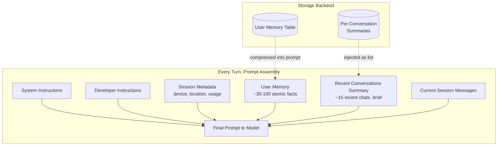
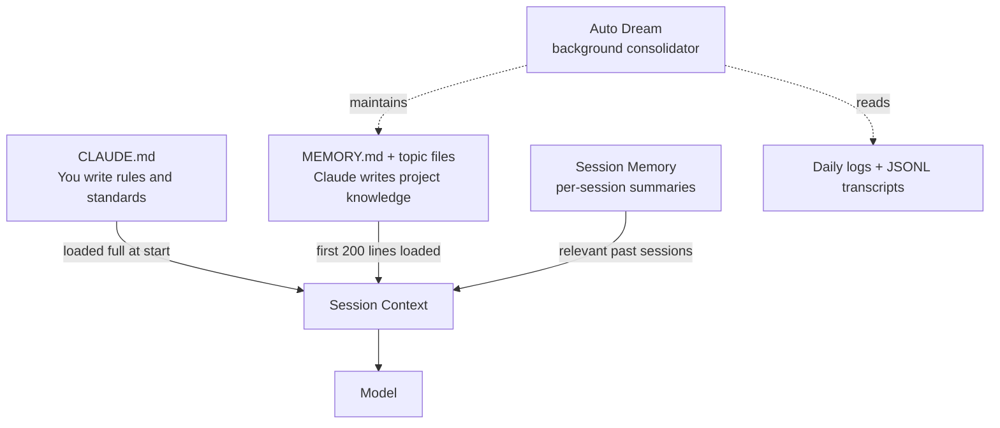
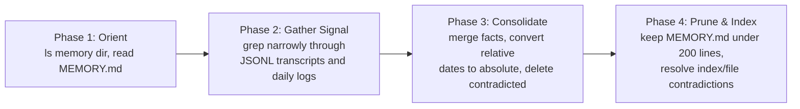
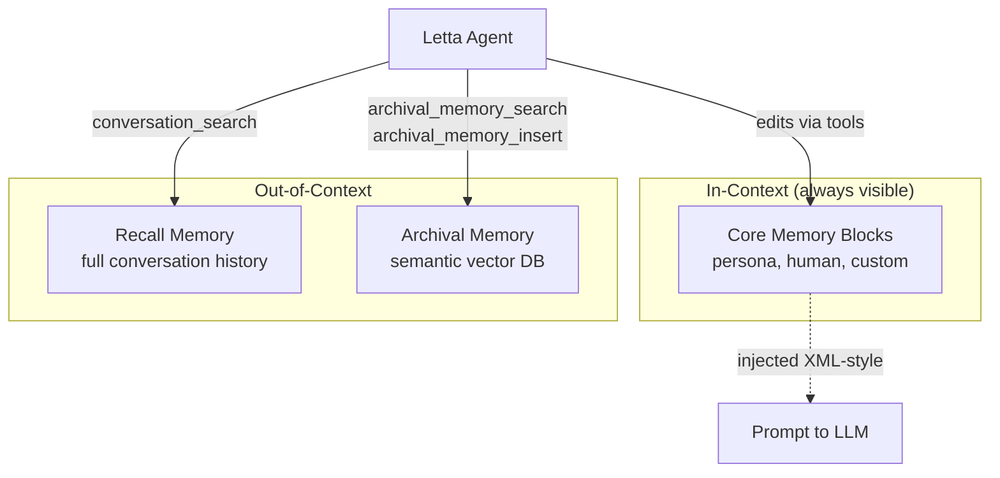
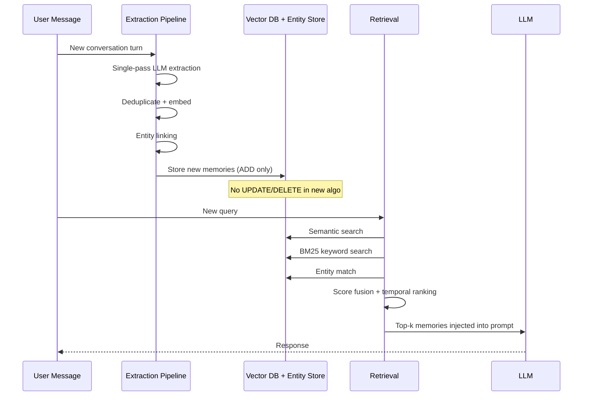
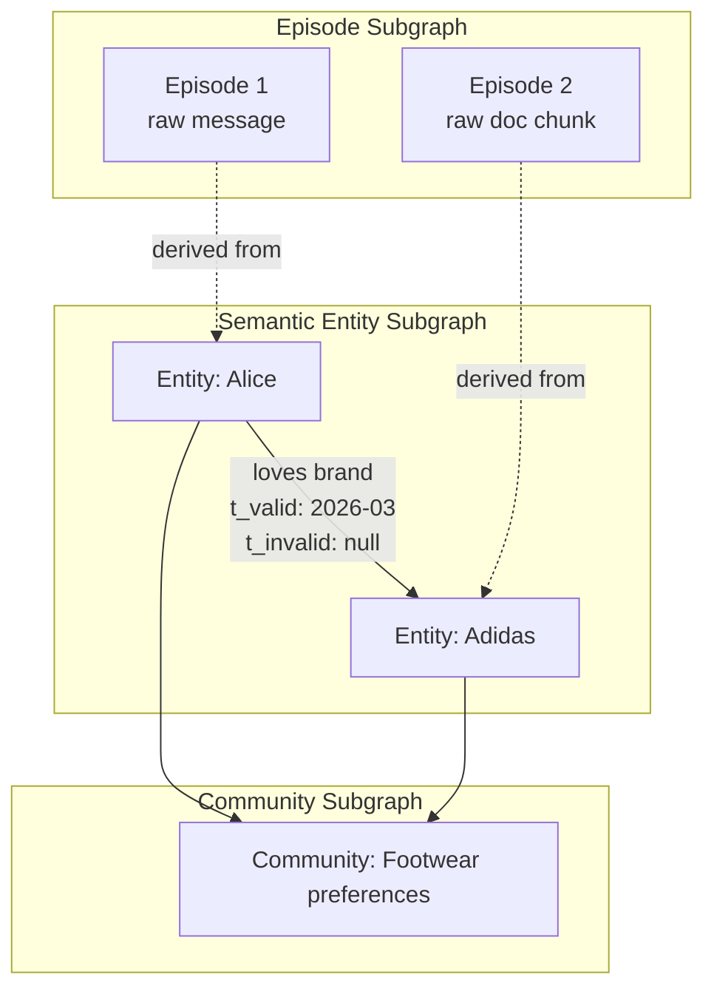
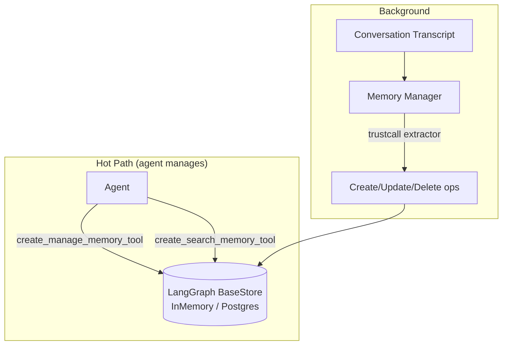
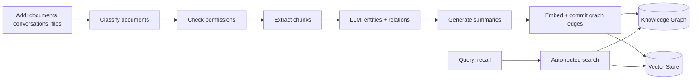
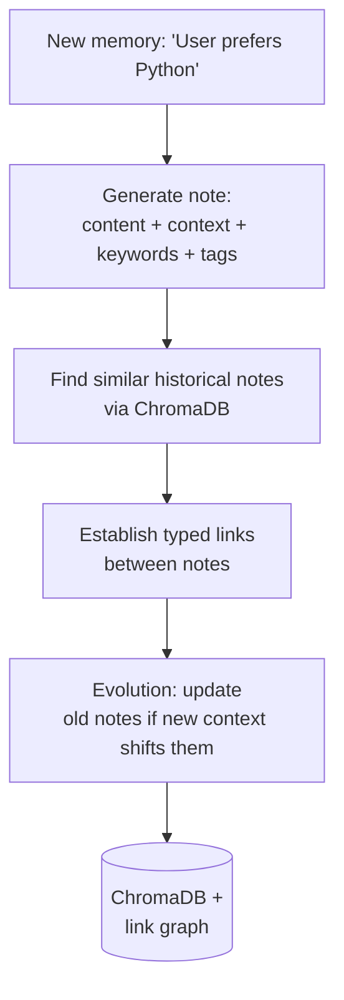

# Memory Layer Implementations in Production AI Systems

This article is a tour of how memory is built inside production AI systems. The trigger is a concrete task: a startup asked me to design the memory layer for an AI agent, and I wanted to see how teams that already shipped this in production solved it[^1][^2].

For broader background on memory patterns (Mem0 ReAct loops, MemPalace, GitHub Copilot citations, the SQL vs vector vs graph debate, the "stop building memory frameworks" Reddit thread), see the existing research article on [Agentic Memory Systems](agentic-memory.md). This piece is narrower: real systems, their schemas, their retrieval strategies, what they got right, what got painful at scale.

## Who This Is For

You are building an agent that needs to remember things across sessions. You have read enough blog posts that talk about "vector databases and RAG" in the abstract. You want to see what production systems do at the schema level, the retrieval level, and the decision-of-what-to-remember level, so you can pick a starting point and avoid the dead ends.

## Article Map

Two production systems anchor the analysis: ChatGPT (closed but well reverse-engineered) and Claude Code (source code leaked in March 2026). They sit at opposite ends of the design spectrum - one stuffs everything into the prompt every turn, the other writes structured markdown files that get loaded selectively.

After those, you get five open-source systems with concrete, readable implementations:

- Letta (formerly MemGPT) - operating-system-style memory hierarchy
- Mem0 - extract-and-update memory pipeline with multi-signal retrieval
- Graphiti / Zep - temporal knowledge graph with bi-temporal facts
- LangMem - LangGraph-native store with hot-path and background managers
- Cognee - ECL (extract, cognify, load) graph + vector pipeline
- A-MEM - Zettelkasten-style linked notes with autonomous evolution

Each section follows the same structure: storage layout, what gets remembered, retrieval strategy, the decision about what is worth keeping, and what scales badly.

The article closes with a synthesis of the patterns and trade-offs you can use when picking a starting design for your own agent.

## ChatGPT: Stuff Everything in the Prompt

ChatGPT is the most-used AI memory system on the planet. The architecture, reverse-engineered by Manthan Gupta, is much simpler than most people assume[^3]. No vector database. No RAG search over conversation history. Just structured prompt assembly with pre-computed summaries.

Every turn, ChatGPT receives a context window with six layered sections, in this order:

1. System instructions
2. Developer instructions
3. Session metadata (device, location, timezone, subscription tier, usage stats)
4. User Memory (permanent facts about you)
5. Recent Conversations Summary
6. Current session messages

The first two are not memory, they are policy. The interesting parts start at layer three.



## User Memory

This is the layer people mean when they say "ChatGPT memory". A list of atomic factual entries like "User is a software engineer at a fintech startup", "User prefers Python over JavaScript", "User is training for a marathon in October". Gupta found 33 entries stored about him. Other users report storage limits in the 100-300 entry range depending on tier.

Two ways a fact lands here:

1. You ask explicitly ("remember that I prefer dark mode")
2. The model detects something it considers important (name, profession, current project) and the system persists it

You can delete entries by asking. The model knows the right tool to call.

## Recent Conversations Summary

This is the surprising layer. Many engineers assume ChatGPT runs RAG over the full conversation history. It does not. Instead it stores a small pre-computed list of summaries (~15 entries) of recent chats, each two-to-four lines describing what you asked about. These get injected directly into the prompt every turn.

The format looks roughly like this:

```
1. Dec 8, 2025: "Building a load balancer in Go"
   - asked about connection pooling
   - discussed health check intervals
2. Dec 7, 2025: "Fitness routine optimization"
   - wanted advice on recovery days
   - asked about protein timing
```

The model only summarizes what you said, not its own responses. Summaries are brief on purpose, since they sit in every prompt.

## Retrieval Strategy: There Isn't One

This is the design observation that matters. ChatGPT has no query-time retrieval system.

The entire memory layer is prompt-injection-based:

- User Memory is the full set of stored facts, every turn
- Recent Conversations Summary is the full set of recent summaries, every turn
- Session metadata is the full snapshot, every turn

When token budget runs short, current-session messages get trimmed first. Permanent facts and recent summaries stay.

## What Looked Smart, What Hurts

The simple-by-design choice trades depth for speed and predictability:

- No latency hit from vector search. The pre-computed summary is already in the prompt
- No "did the system find the right memory" failure mode. Every memory is always present
- The token budget bounds memory size hard. Once you cap at N atomic facts, you cap forever

The pain points show up at scale:

- Cannot do deep recall ("what did we discuss about Postgres indexing in March?"). The summary list is too short to cover months of history
- Cannot reason across distant memories that did not get extracted as facts at the time
- Long-running personalization is shallow. The model knows what you told it, not what it observed

ChatGPT chose explicit-fact storage over implicit profile building. That is a privacy-friendly default but the system is "deliberately shallow" by design.

## Claude Code: File-Based Memory the Agent Edits

Claude Code's source code leaked on March 31, 2026 when version 2.1.88 of `@anthropic-ai/claude-code` shipped a 59.8 MB JavaScript source map. The source map decompressed to roughly 1,900 TypeScript files and 512,000 lines of code[^4]. The memory layer is now well-understood.

Claude Code has four distinct memory mechanisms that work together[^5][^6]:



| Layer | Who writes | Storage | When loaded |
|-------|------------|---------|-------------|
| CLAUDE.md | You | `./CLAUDE.md` or `~/.claude/CLAUDE.md` | Full file, every session start |
| Auto Memory | Claude (in-session) | `~/.claude/projects/<project>/memory/MEMORY.md` and topic files | First 200 lines of MEMORY.md |
| Session Memory | Claude (every ~5K tokens) | `~/.claude/projects/<project>/<session>/session-memory/` | Relevant past sessions |
| Auto Dream | Claude (periodic) | Same dir as Auto Memory | Runs between sessions, no load |

## CLAUDE.md: Human-Authored Rules

CLAUDE.md is the file you write to enforce rules. Coding standards, build commands, architecture decisions, team conventions. The leak confirmed that CLAUDE.md is not just a convention - it is baked into the system prompt, with explicit instructions to look for and respect it at the project root and in subdirectories.

This is the same idea as having a `README.md` your AI assistant reads on every session. Version-controlled, scoped to the directory, zero infrastructure.

## MEMORY.md: Agent-Authored Index Plus Topic Files

The interesting structure is the auto-memory directory:

```
~/.claude/projects/<project>/memory/
├── MEMORY.md          # ~150 char/line index, capped at 200 lines (~25KB)
├── debugging.md       # Topic file: actual debugging notes
├── api-conventions.md # Topic file: API patterns
├── build-commands.md  # Topic file: build/test commands
└── user-preferences.md
```

MEMORY.md is an index. It stores pointers, not data. Each line is a short pointer (~150 chars) to a topic file with the actual content. The index gets loaded into context at session start. Topic files get fetched on demand.

The categories Claude tracks:

- Project patterns - build commands, test conventions, code style
- Debugging insights - solutions to tricky problems
- Architecture notes - key files, module relationships
- Your preferences - communication style, tool choices

## Auto Dream: Background Consolidation

This is the part that is genuinely novel. Auto Dream is a memory-consolidation subagent that runs between sessions.

It triggers when both conditions are true:

1. 24 hours since the last dream cycle
2. More than 5 sessions completed since last consolidation

When triggered, it runs a four-phase process.

The exact system prompt was found in the leak:



The prompt explicitly instructs Claude to:

- Grep narrowly through transcripts (do not read full JSONL files)
- Convert relative dates ("yesterday") to absolute dates so they survive aging
- Delete contradicted facts at the source rather than flagging them
- Treat MEMORY.md as an index, never write content directly into it
- Demote verbose entries: keep the gist in the index, move detail into topic files

Safety constraints are encoded too. During a dream cycle, Claude can only write to memory files, not source code. A lock file prevents concurrent dream processes. The whole thing runs in a separate background process.

In one observed case, Auto Dream consolidated memory from 913 sessions in roughly 8-9 minutes.

## Session Memory: Cross-Session Conversation Continuity

Separate from project knowledge. Session Memory saves conversation-level summaries every ~5K tokens, stored per-session at `~/.claude/projects/<project>/<session>/session-memory/`. When you start a new session, relevant past sessions get pulled in.

## Retrieval Strategy: Lazy File Loading Plus Grep

There is no vector database. There is no embedding model.

Retrieval is:

1. Always-loaded: full CLAUDE.md, first 200 lines of MEMORY.md
2. On-demand: read specific topic file when you ask about it
3. For background consolidation: grep through JSONL transcripts with narrow terms

The index plus topic files structure is the trick. The 200-line cap on MEMORY.md keeps the always-on cost bounded. The index points to topic files which only get loaded when relevant.

## What Looked Smart, What Hurts

Smart choices:

- Files are version-controllable, human-readable, directory-scoped. Zero infrastructure
- Index plus topic files keeps always-loaded cost bounded
- Auto Dream is a clean separation: collection (during session) vs maintenance (between sessions). The REM-sleep analogy is accurate
- Read-only sandbox for the dream process is a safety property other systems lack

Pain points the Reddit community has flagged (covered in [agentic-memory.md](agentic-memory.md)):

- Does not scale to large codebases (500K+ LOC, multi-repo setups). Files cannot replace semantic search across millions of tokens of code context
- Auto-memory triggers unreliably. The agent decides when to save, and forgets to. Requires hook-based reminders
- No semantic search. You cannot ask "did we ever discuss this concept" - you only get exact-name retrieval of topic files

## Letta (formerly MemGPT): OS-Style Memory Hierarchy

Letta builds on the MemGPT paper. The core idea: treat the context window like RAM, with explicit tiers and OS-like memory management primitives. The agent edits its own memory via tool calls[^7][^8].



## Storage Layout

Memory has three tiers:

1. Core Memory Blocks - pinned in context, always visible
2. Recall Memory - full conversation history, searchable
3. Archival Memory - vector-indexed long-term storage

Core Memory Blocks are the most interesting abstraction.

They are structured XML-like sections in the prompt:

```xml
<memory_blocks>
  <persona>
    <description>The persona block: Stores details about your current persona...</description>
    <metadata>chars_current=128 chars_limit=5000</metadata>
    <value>I am a helpful assistant named Sam...</value>
  </persona>
  <human>
    <description>The human block: Stores key details about the person you are conversing with...</description>
    <metadata>chars_current=84 chars_limit=5000</metadata>
    <value>The user's name is Alice. She is a software engineer who prefers concise answers.</value>
  </human>
</memory_blocks>
```

A block has four fields:

- `label` - unique identifier
- `description` - explains what the block is for (the agent uses this to decide how to read/write it)
- `value` - the actual content
- `limit` - size cap in characters

You can also create custom blocks. The description field is load-bearing. It tells the agent how to use the block, and if you make a block called "policies" the agent learns from the description that it should write violations to it, not random facts. Blocks can be read-only (useful for org policies that should not be edited).

Shared blocks let multiple agents attach the same block. Update once, visible everywhere. This is how Letta supports multi-agent coordination - parent agents watch subagent result blocks update in real time.

## What Gets Stored

- Core memory: agent persona, user facts, current task state, working scratchpad
- Recall memory: every message ever exchanged (full conversation history)
- Archival memory: facts and knowledge the agent explicitly inserts via `archival_memory_insert(content, tags)`. Examples reported: 30K+ entries per agent in a personal knowledge manager

Archival memory entries carry tags for filtering during retrieval.

## Retrieval Strategy

Core memory: always in context. No retrieval needed.

Recall memory: agent calls `conversation_search(query)` or `conversation_search_date(query, date_range)` when it needs to recall something specific from history.

Archival memory: agent calls `archival_memory_search(query, tags=[...], page=0)` for semantic search.

The agent decides. There is no automatic injection of relevant memories at prompt time (other than core memory). The agent uses tools when it judges that it needs to recall something.

## Decision: What Is Worth Remembering

The agent runs through memory-editing tools (`memory_replace`, `memory_insert`, `memory_rethink`, `archival_memory_insert`) inside its reasoning loop. Letta calls this self-managed memory. The system prompt instructs the agent to update memory when it learns something important.

This is the same trade-off Claude Code's auto-memory has: it relies on the agent to make the right judgment call. When the agent forgets to save, the information is lost.

## What Scales, What Hurts

Smart:

- Memory blocks as a coordination primitive (shared blocks across agents) is genuinely powerful for multi-agent setups
- Read-only blocks for policy enforcement is a clean separation of concerns
- The OS-analogy gives a clear mental model: RAM (core), disk (archival), swap (recall)

Pain:

- Letta is heavy. It is a stateful agent platform, not a library. You run a server, you manage agent state, you maintain Postgres
- Self-managed memory has the same reliability problem as Claude Code: the agent must remember to remember
- 30K+ archival entries per agent means real vector-DB infrastructure cost and tuning

## Mem0: Extract Facts, Update Memory, Retrieve with Multi-Signal Search

Mem0 ("mem-zero") is the most-cited modern memory library. It is explicitly extraction-and-storage focused: take a conversation, pull out atomic facts, store with embeddings, retrieve at query time. The April 2026 algorithm is a substantial redesign[^9].



## Storage Schema

A memory entry has:

- `memory` - the atomic fact text
- `user_id` / `agent_id` / `session_id` - scoping fields
- `embedding` - vector for semantic search
- `metadata` - tags, timestamps, source
- entity links (after the v3 algorithm)

Mem0 supports three levels:

- User memory - persistent across all sessions for a user
- Session memory - scoped to one session
- Agent memory - facts the agent stated/confirmed, stored first-class

## Old Pipeline (v2): Extract + Update

The original Mem0 architecture had a two-phase loop:

1. Extraction Phase: LLM call to extract facts from the new conversation turn
2. Update Phase: each new fact compared to top-k similar existing facts, then the LLM chooses one of {ADD, UPDATE, DELETE, NO_OP}

This is the ReAct memory loop. The agent reasons about contradictions and decides whether to overwrite.

## New Pipeline (v3, April 2026): ADD Only

The April 2026 release switched to single-pass ADD-only extraction. The memory log accumulates and nothing is overwritten.

Why:

- One LLM call instead of two phases
- No accumulation of "the wrong UPDATE" errors over time
- Temporal ranking at retrieval time picks the right dated instance for current-state vs past-event queries
- Agent-generated facts are first-class. When the agent confirms an action, it gets stored with equal weight to user-stated facts

Benchmark gains on LongMemEval: 67.8 to 94.8 (+27 points). The biggest wins were on temporal queries (+29.6) and multi-hop reasoning (+23.1).

## Multi-Signal Retrieval

Search combines three signals:

- Semantic similarity (embedding cosine)
- BM25 keyword match (exact term hits)
- Entity matching (extracted entities like "Postgres" or "Alice")

Scores get fused. Optional spaCy NLP integration for entity extraction. Temporal reasoning ranks the right dated instance for queries about current state vs past events vs upcoming plans.

## Decision: What Is Worth Remembering

The extraction LLM has a docstring-style prompt that tells it to extract "atomic, self-contained facts about the user". If the conversation does not contain anything worth extracting, return an empty list. This is the same pattern the TowardsDataScience custom-memory article describes (see [agentic-memory.md](agentic-memory.md)).

The shift from "extract + update + delete" to "ADD only" is the most interesting design lesson. The v2 update logic was conceptually elegant but produced cascading errors. By treating memory as an append-only log and pushing all reconciliation into retrieval-time ranking, you get a simpler and more accurate system.

## What Scales, What Hurts

Smart:

- Single-pass extraction beats two-phase reconciliation. Less LLM cost, fewer error cascades
- Multi-signal retrieval avoids semantic-only failure modes (BM25 catches exact terms vectors miss)
- Append-only memory is easier to reason about and version

Pain:

- Vector DB infrastructure is required (Qdrant, pgvector, etc.)
- Memory bloat is real. Append-only means storage grows forever. You need periodic compaction
- Extraction quality is gated on prompt engineering. Bad extraction = bad memory forever

## Graphiti and Zep: Bi-Temporal Knowledge Graph

Graphiti is the open-source temporal knowledge graph engine that powers Zep. The bet: a graph with explicit temporal validity windows on every fact outperforms vector-only memory for agent use cases. The paper claims 94.8% on the DMR benchmark vs MemGPT's 93.4%[^10][^11].



## Three-Subgraph Architecture

- Episode subgraph (Ge) - raw input data (messages, text, JSON), non-lossy
- Semantic Entity subgraph (Gs) - entities derived from episodes, connected by semantic edges
- Community subgraph (Gc) - clusters of strongly connected entities with high-level summaries

The mirror of human memory: episodic (raw experiences) plus semantic (extracted knowledge) plus community-level summaries.

## Bi-Temporal Facts

This is the part that differentiates Graphiti from generic knowledge graphs.

Every edge has two time axes:

- Event time T - when this fact was true in the real world
- Ingestion time T' - when the system learned about it

Every edge also has a validity window `(t_valid, t_invalid)`. When new information contradicts an old fact, Graphiti does not delete the old fact. It invalidates it. You can query "what was true on date X" and get the historically correct answer.

This solves the staleness problem differently than GitHub's citation-based verification (see [agentic-memory.md](agentic-memory.md)). Instead of verifying at read time, Graphiti tracks validity windows at write time and invalidates contradictions automatically.

## Storage Backends

Graphiti requires a real graph database:

- Neo4j 5.26+
- FalkorDB 1.1.2+
- Kuzu 0.11.2+
- Amazon Neptune + OpenSearch Serverless

The hybrid retrieval combines semantic embedding similarity, BM25 keyword search, and graph traversal. Reciprocal Rank Fusion merges results. Zep's production stack reports sub-200ms p95 latency.

## Custom Ontology

You can define entity and edge types upfront using Pydantic models. This is the prescribed ontology mode. You can also let structure emerge from the data (learned mode). The combination is powerful: anchor to known domain concepts, let unexpected patterns appear.

This connects to the Fixed Entity Architecture argument from the existing research (see [agentic-memory.md](agentic-memory.md)) - manually defined domain concepts plus learned connections.

## Decision: What Is Worth Remembering

Graphiti is opinionated: everything ingested becomes an episode. The LLM-driven extractor decides what entities and relationships to create. Contradictions are not discarded. They are timestamped and invalidated.

This is the opposite trade-off from ChatGPT (explicit-fact storage only). Graphiti stores everything and figures out what is current via temporal queries.

## What Scales, What Hurts

Smart:

- Bi-temporal modeling solves the "outdated fact" problem at the data layer, not at the prompt layer
- Hybrid retrieval (semantic + BM25 + graph) catches the failure modes that vector-only systems miss
- Custom Pydantic ontology lets you encode domain knowledge upfront

Pain:

- Requires a graph database. Neo4j or FalkorDB infrastructure to run, monitor, back up
- Ingestion is LLM-heavy. Every new episode triggers entity extraction, relationship extraction, deduplication, validity checks
- The structured-output requirement means it works well with OpenAI and Gemini, less well with smaller models that miss schemas
- The graph can grow large for high-traffic agents. Pruning policies become a real concern

## LangMem: Hot-Path and Background Memory for LangGraph

LangMem is LangChain's memory SDK. It is the most "framework-aware" of the systems here - designed to plug into LangGraph's storage layer, with two integration patterns: agent-managed (hot path) and background[^12].



## Namespaces, Not Just Keys

Memories live inside namespaces. A namespace is a tuple like `("user_123", "preferences")` that scopes access.

Common patterns:

- `(user_id,)` - per-user isolation
- `(user_id, "memories")` - typed buckets
- `(org_id, user_id)` - multi-tenant
- Template variables in namespaces get populated from configurable values at runtime

Namespaces prevent cross-user memory leakage by construction. Two different users cannot see each other's memories unless you explicitly share a namespace.

## Two Integration Patterns

Hot path (agent decides):

```python
agent = create_react_agent(
    "anthropic:claude-3-5-sonnet-latest",
    tools=[
        create_manage_memory_tool(namespace=("memories",)),
        create_search_memory_tool(namespace=("memories",)),
    ],
    store=store,
)
```

The agent calls memory tools mid-conversation. Same trade-off as Letta and Claude Code: relies on the agent to make the right judgment.

Background (separate manager):

A memory manager runs after the conversation completes. It uses `trustcall.create_extractor` for structured extraction via parallel tool calls, analyzing the conversation against existing memories and generating create/update/delete operations.

The advantage of the background pattern: extraction does not eat tokens during the user-facing turn. The disadvantage: the agent in the current session cannot benefit from facts extracted from this session yet.

## Storage Backend

LangMem leans on LangGraph's `BaseStore`:

- `InMemoryStore` for development (lost on restart)
- `AsyncPostgresStore` for production
- Custom stores possible

Embeddings configured in the store (`"openai:text-embedding-3-small"`). The store handles both key-value access and vector search.

## Decision: What Is Worth Remembering

Same as Mem0: an extractor prompt decides. The trustcall library is used to enforce schema, so extraction produces structured Pydantic objects rather than free text.

## What Scales, What Hurts

Smart:

- Namespaces as a first-class concept is the cleanest multi-tenant story among these systems
- Hot-path vs background separation lets you mix patterns. Use hot-path for "remember this preference" interactions, background for passive learning
- Tight LangGraph integration means you do not bolt memory on later

Pain:

- You inherit the LangGraph framework. Not a problem if you are already there, real cost if you are not
- Documentation and patterns assume LangGraph idioms. Lift-and-shift to a non-LangGraph agent is awkward
- The two-pattern design is flexible but requires you to decide upfront which memories go through which path

## Cognee: ECL Pipeline (Extract, Cognify, Load)

Cognee is a memory control plane built around a six-stage pipeline that produces both a knowledge graph and a vector store from any input data[^13].



## Storage Layout

Two layers:

- Session memory - short-term working memory, fast cache, syncs to graph in background
- Permanent memory - long-term knowledge artifacts (user data, interaction traces, external documents, derived relationships)

Both backed by graph plus vector store. Backends are pluggable: Memgraph, Neo4j, Kuzu for graph. Qdrant, LanceDB, pgvector for vectors.

## Four Operations

The API is minimal:

- `cognee.remember(text, session_id=...)` - store
- `cognee.recall(query, session_id=...)` - retrieve
- `cognee.forget(dataset=...)` - delete
- `cognee.improve()` - re-run the cognify step to refine the graph

## What Gets Remembered

Cognee accepts any format - text, documents, conversations. The cognify pipeline classifies, chunks, extracts entities and relationships, generates summaries, and embeds everything. You get both semantic search and graph traversal over the result.

The `node_set` parameter scopes ingestion. `node_set=["research"]` puts the chunks into a specific subgraph for filtered retrieval later.

## Decision: What Is Worth Remembering

Everything you `remember()` goes in. The cognify step is where extraction quality matters - it is the LLM-driven entity and relationship extraction stage.

## Retrieval Strategy

Auto-routed search. The `recall()` call picks the best strategy: semantic similarity, graph traversal, summary lookup, or full-text. Session memory is queried first if a `session_id` is provided, falling through to the graph if no hit.

## What Scales, What Hurts

Smart:

- The four-operation API is the cleanest mental model of the OSS systems here
- Graph plus vectors in one pipeline avoids the multi-system complexity the Reddit thread complained about (see [agentic-memory.md](agentic-memory.md))
- Auto-routed search means you do not have to pick the retrieval strategy per query

Pain:

- The cognify step is LLM-heavy. Every ingest triggers extraction. Costs scale with input volume
- Auto-routing is a black box. When retrieval misses, debugging which strategy was picked is harder than systems where you pick explicitly
- Documentation is uneven. The library is moving fast and some features are under-documented

## A-MEM: Zettelkasten-Style Linked Notes

A-MEM is a NeurIPS 2025 paper that applies the Zettelkasten note-taking method to agent memory. The core idea: every new memory dynamically links to relevant existing memories, and the system can evolve old memories when new ones provide context[^14].



## Note Structure

Each memory is a structured note, not a raw fact:

- `content` - the actual memory text
- `context` - surrounding context (when, where, why)
- `keywords` - extracted keywords
- `tags` - categorical tags
- `category` - high-level grouping
- `timestamp` - YYYYMMDDHHmm format

The note generation is LLM-driven. When you call `memory_system.add_note(content)`, the system uses the LLM to generate the surrounding metadata.

## Three-Stage Lifecycle

1. Note Construction - generate the structured note with all attributes
2. Link Generation - search historical memories via ChromaDB similarity, establish links where meaningful similarities exist
3. Memory Evolution - when new memories arrive, trigger updates to contextual representations and attributes of existing related memories

The evolution step is what makes this distinct. Most systems either overwrite (Mem0 v2), invalidate (Graphiti), or append (Mem0 v3). A-MEM mutates old memories when new context shifts their interpretation.

## Storage Backend

- ChromaDB for vector embeddings (defaults to `all-MiniLM-L6-v2`)
- A separate link graph stored alongside (NetworkX DiGraph in the MCP server variant)

## Retrieval Strategy

`search_agentic(query, k=5)` does semantic search via ChromaDB plus graph traversal over the linked notes. Results include the matched notes plus their typed connections.

## Decision: What Is Worth Remembering

The agent calls `add_note()` explicitly. There is no automatic extraction from raw conversation - the agent (or wrapper code) decides when something is worth storing. This is closer to Letta's archival memory pattern than to Mem0's automated extraction.

## What Scales, What Hurts

Smart:

- The Zettelkasten metaphor gives a clean conceptual model: each note is a self-contained idea with explicit links
- Memory evolution is unusual and useful for cases where new context retroactively reinterprets old facts
- ChromaDB-only is lighter infrastructure than a real graph database

Pain:

- Evolution can drift. If a new memory triggers updates to old memories which trigger updates to others, you can get cascading changes. The paper does not deeply address how to bound this
- Link generation runs an LLM call per new memory to find connections. Cost scales linearly with memory count
- Research project quality. The README is clean but production hardening (rate limits, transaction safety, failure recovery) is not the focus

## Patterns Across the Seven Systems

After surveying the seven systems, the same axes show up repeatedly. Here is a side-by-side at the design level:

| System | Storage layout | Retrieval | What gets stored | Who decides |
|--------|---------------|-----------|------------------|-------------|
| ChatGPT | Atomic facts + per-conversation summaries | Full prompt injection | Explicit user facts | Model (LLM detects, user confirms) |
| Claude Code | Markdown files (index + topic files) | Lazy file load + grep | Project knowledge + session summaries | Agent (during session, in background) |
| Letta | Core blocks (in-context) + recall + archival vector | Mixed: pinned + tool-call | Persona, user facts, knowledge entries | Agent via memory tools |
| Mem0 | Atomic memories in vector DB + entity store | Multi-signal (semantic + BM25 + entity) | Extracted atomic facts (ADD only) | LLM extractor on every turn |
| Graphiti | Bi-temporal knowledge graph (3 subgraphs) | Hybrid (semantic + BM25 + graph) | Episodes + entities + edges with validity | LLM extractor on every episode |
| LangMem | LangGraph BaseStore with namespaces | Vector search via store | Structured memories via trustcall | Agent (hot path) or extractor (background) |
| Cognee | Graph + vector via ECL pipeline | Auto-routed | Anything you call `remember()` on | You explicitly + LLM cognify step |
| A-MEM | Structured notes in ChromaDB + link graph | Semantic + graph traversal | Notes with content, context, keywords, tags, links | Agent or wrapper, explicit add_note |

## Recurring Trade-Offs

A few patterns show up across every system:

Prompt injection vs query-time retrieval. ChatGPT and Claude Code's CLAUDE.md inject the memory into the prompt every turn. Letta core blocks do the same. Everyone else retrieves on demand. The injection approach removes a failure mode (the memory is always present) at the cost of token budget.

Extract-and-store vs raw-and-search. Mem0, LangMem, Cognee extract structured facts. Claude Code stores markdown chunks. Letta has both (core blocks are structured, recall is raw). The structured side wins on retrieval precision. The raw side wins on no extraction errors.

Agent-managed vs background. Letta, LangMem hot path, and Claude Code rely on the agent to invoke memory tools mid-conversation. Mem0, LangMem background, Cognee, and Graphiti do extraction separately. The agent-managed pattern reliably fails when the agent forgets to call the tool.

Append-only vs update-in-place. Mem0 v3 explicitly moved to append-only. Graphiti invalidates rather than deletes. A-MEM mutates. Mem0 v2 (the old design) had update logic that accumulated errors over time. The pattern: append-only is easier to reason about and version, and push reconciliation into retrieval-time ranking.

## Decision Points for Your Own Memory Layer

If you are designing a memory layer from scratch, these are the questions worth answering before picking infrastructure:

1. Is the agent stateful per-user or per-session? Per-user means real long-term storage. Per-session means you might just need conversation summaries.

2. Do you need temporal accuracy ("what was true on date X")? If yes, Graphiti-style bi-temporal modeling. If no, simpler storage works.

3. Are facts atomic and extractable, or are they better stored as documents? Atomic facts → vector store + extraction (Mem0 pattern). Documents → file-based or chunked (Claude Code pattern).

4. Who decides what to remember? Agent-managed has reliability problems. Automatic extraction has quality problems. Pick which failure mode you can tolerate.

5. What is the retrieval pattern? "Always show all memories" (ChatGPT) is bounded by token budget. "Query and inject top-k" (Mem0) is bounded by retrieval quality. Hybrid (Letta core + archival) needs both to work.

6. How will you compact and prune? Every system that runs long enough accumulates noise. Have a story for this before you accumulate it. Claude Code's Auto Dream and Mem0's periodic cleanup are both viable patterns.

## What I'd Build for a New Agent

Based on the patterns above, a reasonable starting design for a new agent looks something like this:

Storage layer:

- Postgres with pgvector for combined structured queries and embeddings (the Reddit consensus, covered in [agentic-memory.md](agentic-memory.md))
- A facts table: `(id, user_id, session_id, content, embedding, entities[], created_at, valid_from, valid_to)`
- A sessions table for conversation summaries

Extraction:

- Background extractor (LangMem pattern, not hot-path)
- Single-pass ADD-only (Mem0 v3 pattern)
- Structured Pydantic output (trustcall pattern)

Retrieval:

- Multi-signal: semantic top-k + BM25 + entity match (Mem0 v3 pattern)
- Always-on header: a small core block with the user's persistent identity (Letta core memory pattern, ChatGPT User Memory pattern)
- Query-time injection of top-k retrieved facts plus the always-on header

Maintenance:

- Periodic compaction job (Claude Code Auto Dream pattern) that runs nightly: resolve contradictions, prune stale, convert relative dates to absolute
- Append-only at the application layer. Compaction happens out of band

Multi-tenancy:

- Namespace by user_id (LangMem pattern)
- Filter all queries by user_id. Never trust ranking alone for isolation

The closing insight: none of these systems solved memory by adding more infrastructure. They solved it by being precise about what they were storing, who decided what was worth storing, and when retrieval happened. The interesting engineering is in those decisions, not in the choice of vector database.

## Sources

[^1]: [20260515_063504_AlexeyDTC_msg4024.md](../../inbox/used/20260515_063504_AlexeyDTC_msg4024.md)
[^2]: [20260515_063830_AlexeyDTC_msg4026.md](../../inbox/used/20260515_063830_AlexeyDTC_msg4026.md)
[^3]: [How ChatGPT Memory Works, Reverse Engineered](https://llmrefs.com/blog/reverse-engineering-chatgpt-memory)
[^4]: [Claude Code Source Leak: Everything Found (2026)](https://claudefa.st/blog/guide/mechanics/claude-code-source-leak)
[^5]: [Claude Code Auto Memory](https://claudefa.st/blog/guide/mechanics/auto-memory)
[^6]: [Claude Code Auto Dream](https://claudefa.st/blog/guide/mechanics/auto-dream)
[^7]: [Letta Memory Blocks](https://docs.letta.com/guides/core-concepts/memory/memory-blocks)
[^8]: [Letta Archival Memory](https://docs.letta.com/guides/core-concepts/memory/archival-memory)
[^9]: [Mem0 GitHub README - April 2026 algorithm](https://github.com/mem0ai/mem0)
[^10]: [Zep: A Temporal Knowledge Graph Architecture for Agent Memory (arXiv 2501.13956)](https://arxiv.org/abs/2501.13956)
[^11]: [Graphiti GitHub README](https://github.com/getzep/graphiti)
[^12]: [LangMem GitHub README](https://github.com/langchain-ai/langmem)
[^13]: [Cognee GitHub README](https://github.com/topoteretes/cognee)
[^14]: [A-MEM: Agentic Memory for LLM Agents (arXiv 2502.12110)](https://arxiv.org/abs/2502.12110)
