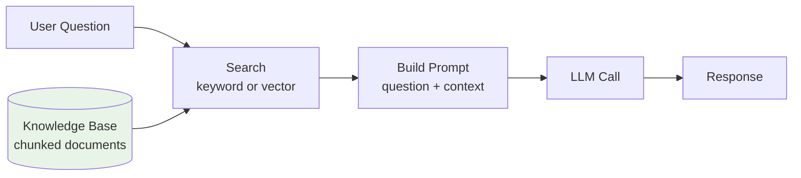
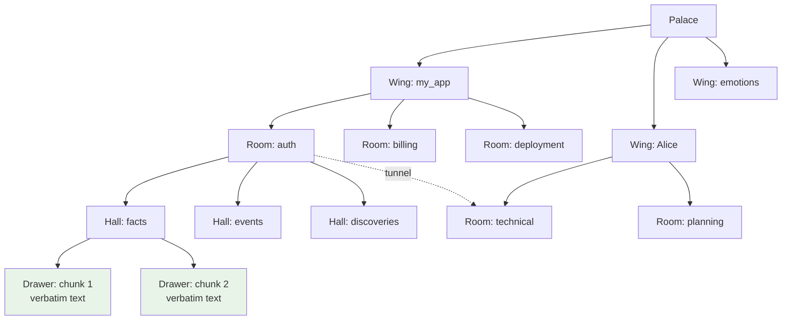
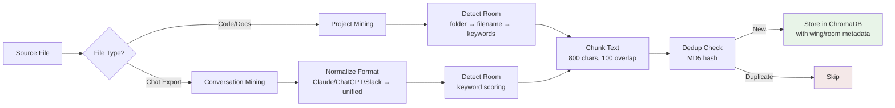
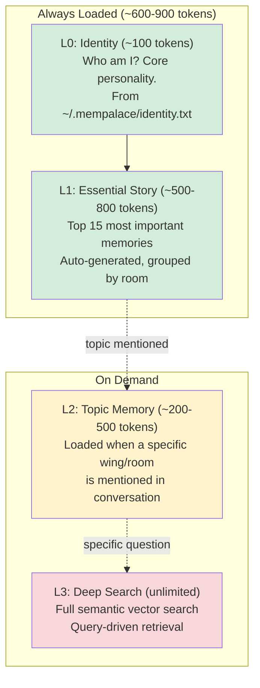

# MemPalace: A Fully Local Memory System Using the Memory Palace Technique

Source: https://github.com/milla-jovovich/mempalace/tree/main
Instagram announcement: https://www.instagram.com/p/DWzNnqwD2Lu/

MemPalace is a fully local, offline memory system for AI assistants built by Milla Jovovich. It organizes conversations and knowledge using the ancient "memory palace" (method of loci) mnemonic technique - you place memories in specific rooms of an imaginary building, then navigate the building to retrieve them.

It runs entirely on your machine with just two dependencies (ChromaDB and PyYAML) and achieves 96.6% recall@5 on the LongMemEval benchmark. The memory layer itself doesn't use any LLM API calls - all classification, chunking, room detection, and compression run on regex heuristics and keyword scoring. The LLM is still there for the actual conversation (answering questions, generating responses), but the memory infrastructure that decides what to store, where to put it, and what to retrieve is completely deterministic and free to run.

See also: [Agentic Memory Systems for AI Agents](agentic-memory.md) for broader context on memory architectures.

## Why Do AI Agents Need Memory?

LLMs are stateless. Every conversation starts from scratch - the model doesn't know who you are, what you discussed yesterday, or what decisions you made last week. The context window (the text the model can "see" at once) is its only memory, and it resets with each new session.

That's fine for one-off questions. But it breaks down for anything that needs continuity:
- A coding assistant that should remember your project's architecture across sessions
- A personal assistant that knows your preferences and ongoing tasks
- A research agent that builds on previous findings over days or weeks

The naive solution - stuff everything into the context window - hits limits fast. Context windows are finite (even large ones degrade past ~150k tokens), and including irrelevant information hurts reasoning. You pay for every token, and the model's attention gets diluted.

## How Traditional RAG Helps (and Where It Falls Short)

Traditionally, this problem is solved with RAG - Retrieval Augmented Generation. Instead of stuffing everything into the context, you keep your documents in a searchable index and only pull in what's relevant to the current question.



The search step can use keyword matching (like Elasticsearch), vector similarity (like Qdrant with embeddings), or both. You chunk your documents into smaller pieces, index them, and retrieve at query time - so the model only sees what's relevant, not the entire knowledge base.

This works well for question-answering over static document collections - FAQs, documentation, books, video transcripts. The pattern is straightforward: a `search()` method to find relevant chunks, a `build_prompt()` to format the context, an `llm()` to get the answer, and a `rag()` that orchestrates the flow.

But traditional RAG has limitations when you try to use it as persistent agent memory:
- All documents are treated equally - there's no concept of "more important" or "less important" memories
- Everything goes into one flat index, and you rely entirely on search quality to find the right thing
- No temporal awareness - a fact stored six months ago looks the same as one stored today, even if the old one is outdated
- No token budget management - every query does a full search, with no progressive loading based on what the conversation actually needs
- No cross-domain discovery - if related information lives in different topics, traditional RAG won't surface those connections

MemPalace is an alternative approach. It still uses ChromaDB for vector search under the hood, so the RAG foundation is there. But it adds layers on top that address these limitations: a hierarchical organizational structure inspired by an ancient memorization technique, a 4-level progressive loading system, a temporal knowledge graph for facts that change over time, and cross-domain tunnels for discovering connections across topics.

## Background: What Is a Memory Palace?

The memory palace (also called "method of loci") is a memorization technique dating back to ancient Greece. The idea: you mentally construct a building you know well - say, your house - and "place" things you want to remember in specific locations. To recall, you mentally walk through the building visiting each room.

For example, to remember a grocery list, you might imagine milk flooding your hallway, eggs sitting on the couch in the living room, and bread on the kitchen counter. The spatial structure makes retrieval intuitive - instead of searching a flat list, you navigate a building.

MemPalace applies this same principle to AI memory. Instead of dumping all past conversations into a single vector database and hoping semantic search finds the right thing, it organizes information into a navigable hierarchy of wings, rooms, halls, and drawers. This structure alone accounts for a 34% improvement in retrieval quality over flat vector search (from 60.9% to 94.8%).

## The Palace Hierarchy

The system maps the memory palace metaphor to a concrete data structure:



Here is what each level means:

- Wing - the top-level domain. A wing is a project, a person, or a broad topic. Examples: "my_app" for a codebase, "Alice" for a person, "emotions" for personal reflections. Default topic wings include emotions, consciousness, memory, technical, identity, family, creative.

- Room - a topic category within a wing. Each wing contains multiple rooms. For a project wing, rooms map to areas like "auth", "billing", "deployment". For conversations, rooms are detected by keyword scoring against 5 categories: technical (13 keywords like "code", "python", "bug"), architecture (10 keywords), planning (10 keywords), decisions (10 keywords), and problems (10 keywords). The highest-scoring topic wins; if nothing matches, the room defaults to "general".

- Hall - a type of memory within a room. Each room has 5 standard halls: facts, events, discoveries, preferences, and advice. Halls classify what kind of information a memory represents.

- Drawer - the actual content, stored verbatim. A drawer is a text chunk (800 characters with 100-character overlap) that is never summarized or paraphrased. The original text is preserved exactly as-is. Each drawer has metadata: wing, room, source file, chunk index, timestamp, who added it.

- Tunnel - a cross-domain connection. When the same room name (e.g., "auth") appears in two or more wings, a tunnel automatically forms between them. This allows the system to discover that authentication patterns in project A relate to authentication work in project B, without anyone explicitly creating that link.

- Closet - a compressed summary. These use the AAAK compression dialect (described below) to create 30x-smaller representations that point back to the original drawers.

## How Room Detection Works

Room detection is entirely heuristic-based - no LLM calls. There are two systems depending on content type.

For project files (`room_detector_local.py`): a map of about 60 keyword-to-room mappings. It checks the folder path first (a file in `/auth/` goes to the "auth" room), then the filename, then falls back to keyword scoring of the content. Users can approve or edit assignments interactively, saved to a `mempalace.yaml` config.

For conversations (`convo_miner.py`): each chunk is scored against 5 keyword sets. The "technical" set has 13 keywords like "code", "python", "api", "bug". The system counts how many keywords from each set appear in the first 2000 characters, and the highest-scoring category becomes the room.

## Ingestion Pipeline

What happens when you feed a document into MemPalace:



Three mining modes exist:

Project mining: Walks the directory tree (skipping .git, node_modules, etc.), reads files with 20 recognized extensions (.py, .js, .md, .json, etc.), detects rooms via the 4-priority cascade, chunks into 800-character pieces with 100-character overlap (breaking at paragraph boundaries when possible), deduplicates via MD5 hash, and stores in ChromaDB.

Conversation mining: First normalizes chat exports from multiple formats (Claude Code JSONL, Claude.ai JSON, ChatGPT conversations.json, Slack exports) into a unified format using `>` markers for user turns. Then uses "exchange" mode chunking - each user question paired with the AI response becomes a single chunk. Falls back to paragraph-based chunking if fewer than 3 quote markers are found.

General extraction: A pure heuristic extractor that classifies content into 5 memory types using extensive regex patterns - decisions (20 patterns like "let's use", "because"), preferences (16 patterns), milestones (33 patterns like "got it working"), problems (18 patterns), and emotional moments (29 patterns). Code lines are filtered out before scoring. Resolved problems get reclassified as milestones if the sentiment is positive.

## The 4-Level Memory System

This is how the system manages token budgets. Not all memories need to be loaded at once - the 4-level system loads progressively:



L0 (Identity, ~100 tokens): A plain text file the user creates manually at `~/.mempalace/identity.txt`. Contains the assistant's personality and core traits. Always loaded, read once and cached. Example: "I am Atlas, a personal AI assistant for Alice. Traits: warm, direct, remembers everything."

L1 (Essential Story, ~500-800 tokens): Auto-generated from ChromaDB. Takes all stored drawers, scores each by importance (checking metadata keys `importance`, `emotional_weight`, `weight` in order, defaulting to 3), sorts by importance descending, takes the top 15, groups them by room for readability, truncates each snippet to 200 characters, and stops when total length exceeds 3200 characters.

L2 (On-Demand, ~200-500 tokens per retrieval): Triggered when a specific topic comes up in conversation. Queries ChromaDB with `where` filters on wing and/or room, returns up to 10 drawers, each truncated to 300 characters.

L3 (Deep Search, unlimited): Full semantic vector search via ChromaDB. Uses the query text to find the 5 most similar drawers by cosine distance. Returns results with similarity scores. This is the fallback when the structured navigation does not surface what is needed.

The "wake-up" cost (L0 + L1) is approximately 600-900 tokens, leaving 95%+ of the context window free.

Here's what that means in practice. Say you have 5 conversations a day with your assistant, and each one loads ~800 tokens of pre-computed memory context from the local database:

| | MemPalace (pre-computed L0+L1) | Naive approach (LLM summarizes all memories each time) |
|---|---|---|
| Tokens per wake-up | ~800 (read from local DB, injected as input) | ~200,000 (send all 1,000 stored chunks to LLM for summarization) |
| Tokens per day (5 conversations) | 4,000 input tokens | 1,000,000 input tokens + output tokens for summary |
| Annual cost (Claude Haiku, $1/M input) | ~$1.50/year | ~$365/year + output costs |
| Annual cost (Claude Sonnet, $3/M input) | ~$4.40/year | ~$1,100/year + output costs |

The difference is 250x. With MemPalace, the memory context is pre-computed locally - the 15 most important memories are already selected and truncated, sitting in ChromaDB ready to be read. You're only paying for those ~800 tokens as input to the LLM. With the naive approach, you'd send all your stored memories to the LLM every single conversation to generate a fresh summary, paying for both the massive input and the output.

## Knowledge Graph

In addition to the vector store, MemPalace maintains a temporal knowledge graph in SQLite for structured facts and relationships.

The schema has two tables: entities (with id, name, type like "person"/"project"/"animal", and a JSON properties blob) and triples (RDF-style subject-predicate-object relationships like "Alice - child_of - Bob").

The key feature is temporal validity. Every fact has `valid_from` and `valid_to` dates. You can query "what was true on June 15, 2025?" and get only facts that were valid at that point in time. When something changes (e.g., someone moves to a new city), you invalidate the old fact by setting `valid_to` to today, then add a new fact with `valid_from` set to today. This solves the stale information problem that plagues many memory systems.

Contradiction detection works through deduplication: before inserting a new triple, the system checks for an existing one with the same subject/predicate/object that has no expiry date. If found, it returns the existing ID without creating a duplicate.

## AAAK Compression Dialect

The most original part of the project. AAAK is a custom text compression format that achieves approximately 30x compression while remaining readable by any LLM without fine-tuning or special decoders.

A compressed "zettel" (note) looks like this:

```
0:ALC+BOB|trust_building|"I never told anyone"|0.95|vul+trust|ORIGIN+CORE
```

This encodes: zettel ID 0, involving entities Alice and Bob, about the topic trust_building, with the key quote "I never told anyone", importance weight 0.95, emotions vulnerable and trust, flags indicating this is both an origin moment and a core identity pillar.

The compression works by:
1. Removing 100+ English stop words
2. Extracting topics via word frequency counting (boosting proper nouns and technical terms)
3. Selecting the most decision-relevant sentence under 80 characters as the key quote
4. Encoding entities as 3-letter uppercase codes (Alice = ALC, Jordan = JOR)
5. Mapping emotions to 29 abbreviated codes (vul, joy, fear, trust, grief, wonder, etc.)
6. Tagging with 7 semantic flags (ORIGIN, CORE, SENSITIVE, PIVOT, GENESIS, DECISION, TECHNICAL)

Cross-references between zettels use tunnel lines: `T:0<->3|shared_theme`. Emotional arcs use arc lines: `ARC:fear->trust`.

## Navigation Graph

The palace graph (`palace_graph.py`) enables cross-domain discovery by building a navigation structure from ChromaDB metadata.

Graph construction: Iterates all documents in batches of 1000, extracts room/wing/hall/date metadata from each, skips rooms named "general", and identifies edges wherever a room spans multiple wings.

BFS traversal: Starting from a room, finds all rooms that share a wing with the current room, then expands outward up to 2 hops. Results are sorted by (distance, -drawer_count) and capped at 50.

Tunnel detection: Any room appearing in 2 or more wings automatically becomes a tunnel. Sorted by drawer count (most-referenced tunnels first).

Fuzzy matching: If the requested room name is not found exactly, the system does substring matching and returns the top 5 suggestions.

## MCP Integration

The system exposes 24 tools via the Model Context Protocol (MCP) using JSON-RPC 2.0 over stdin/stdout, making it compatible with Claude, ChatGPT, and Cursor.

The tools break into categories:
- 11 read tools: status, list wings/rooms, taxonomy, search, duplicate check, graph traversal, tunnel finder, graph stats, knowledge graph query, AAAK spec
- 3 write tools: add drawer (with auto-dedup), delete drawer, add knowledge graph triple
- 3 knowledge graph tools: invalidate facts, timeline, stats
- 2 diary tools: write and read per-agent timestamped entries

The "know before speaking" protocol is a soft enforcement mechanism. Every time `mempalace_status` is called, it injects a protocol string into the response: "BEFORE RESPONDING about any person, project, or past event: call mempalace_kg_query or mempalace_search FIRST." This relies on the LLM following the instruction, ensuring it checks memory before answering from its training data.

## What Makes This Interesting

There's nothing magical here - it's solid engineering with a few clever ideas:

- The memory layer doesn't call any LLM. All classification, room detection, and compression run on regex and keyword scoring. The LLM is only used for the conversation itself. This makes the memory infrastructure completely offline, free, and deterministic.
- Structure beats search. The palace hierarchy alone improves retrieval by 34% (from 60.9% to 94.8%) over flat vector search - not better embeddings or reranking, just better organization.
- Facts have expiry dates. The valid_from/valid_to fields on knowledge graph triples solve a problem most memory systems ignore: facts change, and you need to know not just what's true now, but what was true when.
- Token economy is extreme. Most conversations use under 900 tokens for memory. Only when specific topics come up does the system load more.
- AAAK treats the LLM as a free decompressor. Pipe-delimited abbreviated text is natively readable by any LLM without special decoding - a clever insight.
- 21 Python modules, two dependencies (chromadb, pyyaml). No servers, no graph databases, no API keys.

## Key Source Files

| File | Purpose |
|------|---------|
| `config.py` | Configuration with env var > file > defaults priority |
| `dialect.py` | AAAK compression: 29 emotions, 7 flags, 100+ stop words |
| `layers.py` | 4-layer memory stack (L0-L3) with token budgets |
| `knowledge_graph.py` | SQLite temporal entity-relationship graph |
| `palace_graph.py` | BFS navigation graph built from ChromaDB metadata |
| `mcp_server.py` | 24 MCP tools with protocol injection |
| `miner.py` | Project file ingestion (800-char chunks, 100 overlap) |
| `convo_miner.py` | Conversation ingestion with format normalization |
| `general_extractor.py` | 5-type memory extraction via regex heuristics |
| `searcher.py` | Semantic search with wing/room filtering |

## Sources

[^1]: [20260407_120000_AlexeyDTC_msg3256.md](../../inbox/used/20260407_120000_AlexeyDTC_msg3256.md)
