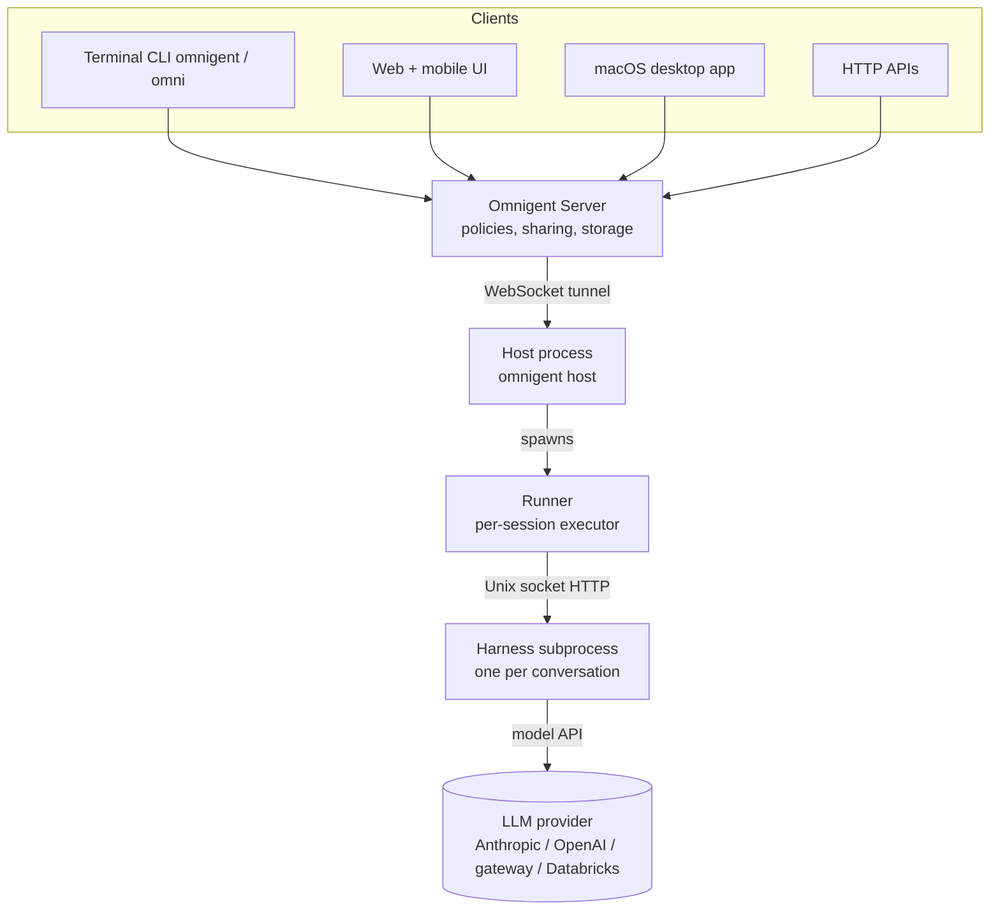
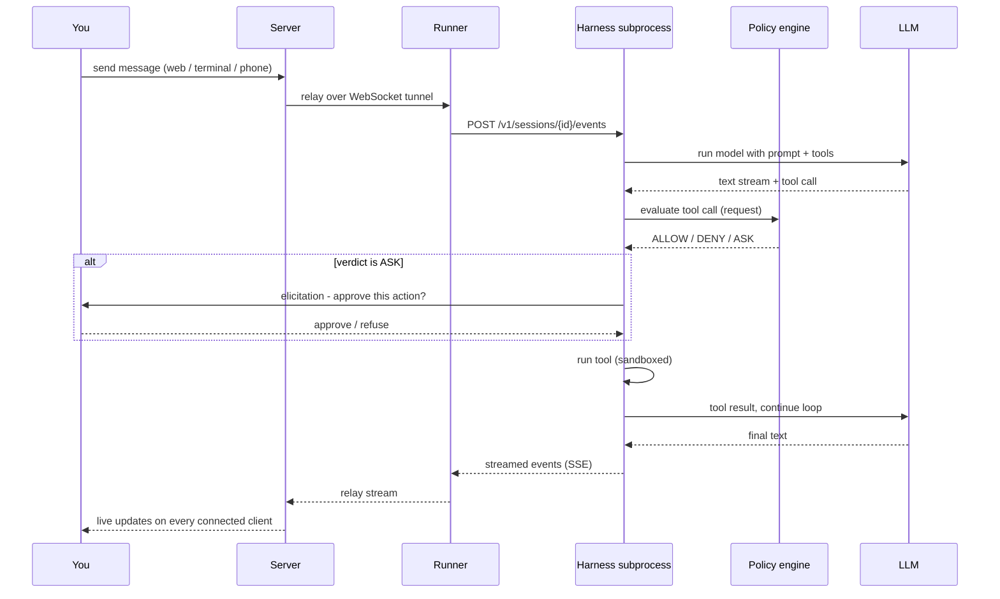
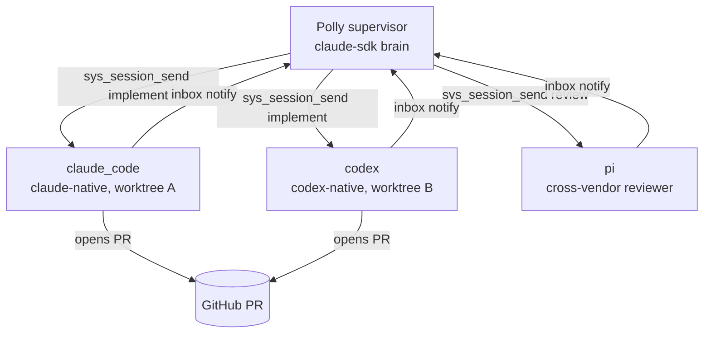
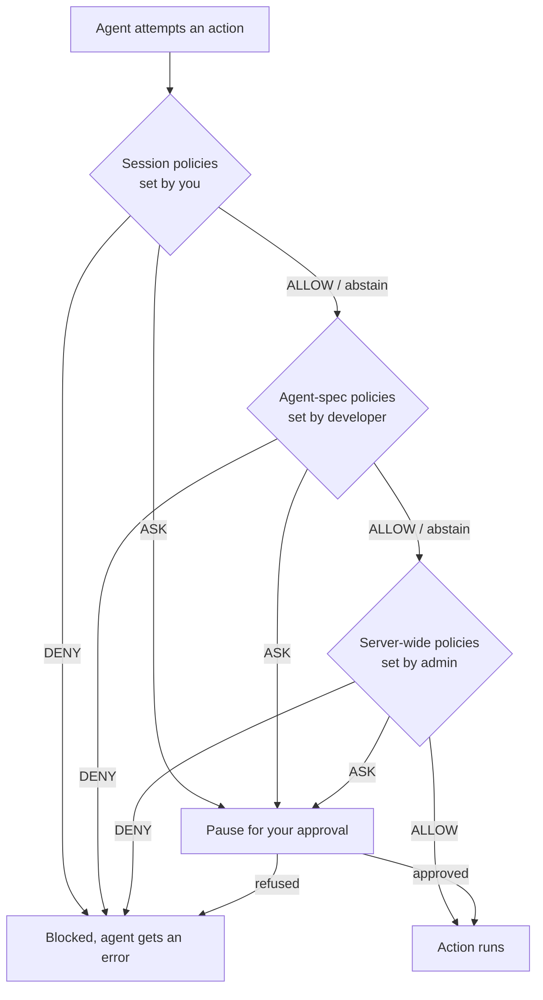

# Omnigent: Databricks' Meta-Harness for Combining, Controlling, and Sharing Agents

https://github.com/omnigent-ai/omnigent

Omnigent is an open-source layer that sits above the coding agents you already use - Claude Code, Codex, Pi, the OpenAI Agents SDK, your own YAML-defined agents - and makes them interoperable parts of one system. Databricks open-sourced it under Apache 2.0 on 2026-06-13. The pitch is a single new layer called a meta-harness, where you compose multiple agents, control them with policies, and share live sessions with teammates from any device.

This article walks through what Omnigent is, the architecture that makes one interface work across many agent backends, how a turn actually runs end to end, and the four systems built on top of that interface: composition, policies, sandboxing, and collaboration. It closes with how Omnigent compares to running a single harness on its own.

## What a Meta-Harness Is

A harness is the program that wraps a language model and turns it into an agent. It owns the prompt, the tool-call loop, the session transcript, and the controls. Claude Code is a harness. Codex is a harness. Each one is its own silo: its context, its permission prompts, and its way of running do not carry over when you switch to another tool.

A meta-harness is a layer above the harness. It does not replace Claude Code or Codex. It wraps each of them behind one common interface, then adds the features that no single harness can provide because those features span harnesses. Three of them matter:

- Composition. You combine multiple models, harnesses, and techniques in one session, and switch between them with a one-line change instead of rewriting code.
- Control. Policies track what an agent does and enforce guardrails - spend caps, permissions, approval gates - at the meta-harness layer, not through prompt instructions the model can ignore.
- Collaboration. You share a live agent session by URL, and teammates watch it work, comment on files, or send it commands in real time.

The reason one layer can do this rests on a single observation. However a harness calls its model internally, the interface to you is always the same: messages and files go in, text streams and tool calls come out. Omnigent builds a common API around that shape and wraps both terminal coding agents (Claude Code, Codex, Pi) and agent SDKs (OpenAI Agents, Claude Agents SDK) behind it.

## Architecture

Omnigent has three moving parts: a runner, a server, and one or more harness subprocesses. The server is the front door and the source of truth. It stores agents and conversations, applies policies, handles sharing, and exposes every session over the terminal, a web app, a macOS desktop app, and HTTP APIs. The runner executes a session on a real machine - your laptop or a cloud sandbox. Each agent in a session runs as its own harness subprocess that speaks Omnigent's HTTP API.

The diagram below shows the top-level components and how a request reaches a running agent.



The clients all talk to the same server, so a session you start in the terminal shows up unchanged in the browser or on your phone. The server reaches a runner on your machine through a host process that you register with `omnigent host`. The runner then spawns harness subprocesses, one per conversation, and each subprocess talks to its model provider. The next two sections explain the harness subprocess contract first, because it is the piece that makes everything else uniform, then trace a full turn through these components.

## The Common Harness Interface

The trick that makes one layer work across many agents is that every harness is the same kind of thing: a small HTTP service. When the runner needs to run an agent, it spawns a subprocess and serves a per-conversation FastAPI app over a Unix socket. That app speaks the same Pydantic request and response models the server exposes to external clients. There is no separate internal protocol - a harness is just an HTTP endpoint that accepts the Omnigent session API.

A registry maps each harness name to a Python module that exports a `create_app() -> FastAPI` factory. The current registry covers the wrapped backends:

```python
_HARNESS_MODULES: dict[str, str] = {
    "claude-sdk": "omnigent.inner.claude_sdk_harness",
    "claude": "omnigent.inner.claude_sdk_harness",
    "claude-native": "omnigent.inner.claude_native_harness",
    "codex-native": "omnigent.inner.codex_native_harness",
    "codex": "omnigent.inner.codex_harness",
    "pi": "omnigent.inner.pi_harness",
    "openai-agents": "omnigent.inner.openai_agents_sdk_harness",
    "databricks_supervisor": "omnigent.inner.databricks_supervisor_harness",
}
```

Two flavors live behind this registry. Native harnesses (`claude-native`, `codex-native`) bridge the real Claude Code or Codex terminal UI - they boot from the vendor's own on-disk transcript, so you get the actual tool. SDK harnesses (`claude-sdk`, `openai-agents`, `codex`, `pi`) wrap an SDK and let Omnigent own the transcript. The distinction matters when you fork a session: a fork into a native harness needs a transcript rebuild, because Claude Code and Codex read their own JSONL rollout rather than Omnigent's.

Each harness wrap stays small. A shared scaffold class owns the boilerplate every harness needs: the FastAPI app, per-turn bookkeeping, a 15-second heartbeat, cancellation, in-band steering (a new message that matches the in-flight turn becomes an injection instead of a new turn), and graceful shutdown. A concrete harness implements two things only - an `async run_turn(request, ctx)` method that runs the model-tool loop, and a `create_app()` factory. Everything an agent has in common lives in the scaffold; everything specific to a backend lives in that one method.

The contract translates each backend into a common executor model. An executor adapts the framework's abstract message and tool model to one concrete model or agent harness, yielding typed events as a turn streams: text chunks, reasoning chunks, tool-call requests, tool results, usage. This is the seam that lets a YAML field switch backends without changing the agent.

## How a Turn Runs

With the harness contract in place, a single turn flows through the components from the architecture diagram. The sequence below traces a message from the web UI down to the model and back, including a policy check on a tool call.



The same stream fans out to every client connected to the session, which is what makes a session follow you from terminal to browser to phone, and what lets a teammate watch it live. The policy check in the middle is the control layer; the sandboxed tool run is the security layer. Both run at the meta-harness level, so they apply no matter which backend produced the tool call.

## Composition: One YAML, Many Harnesses

An agent in Omnigent is a short YAML file. It declares a prompt, an executor (the harness and model), tools, optional sub-agents, OS access, and policies. The executor block is where composition happens - change `harness: claude-sdk` to `harness: codex` and the same agent runs on a different backend. The CLI flags `--harness` and `--model` override the file for a single run, so `omnigent run examples/polly/ --harness pi` runs the orchestrator on Pi while its sub-agents keep their own harnesses.

Tools come in a few kinds, declared by name under `tools`:

- `function` - a local Python callable, with its schema generated from the signature.
- `mcp` - a Model Context Protocol server, either a local command or a remote URL. MCP is a standard way for an agent to call external tools and data sources.
- `agent` - a sub-agent the supervisor can delegate to, with its own prompt and its own executor.

The sub-agent tool is what turns one agent into a team. A supervisor agent delegates work to sub-agents through a `sys_session_send` tool, each sub-agent runs autonomously in its own conversation, and it notifies the supervisor through an inbox when it finishes. The supervisor reads the inbox with `sys_read_inbox` rather than polling, and the framework wakes it when a sub-agent completes. Sub-agents can run on different harnesses than their supervisor, which is the concrete payoff of the common interface.

Two example agents ship with the repo and show two composition patterns.

Polly is a multi-agent coding orchestrator. Its brain runs on the Claude Agent SDK and writes no code itself. It plans, delegates implementation to coding sub-agents (Claude Code, Codex, or Pi) running in parallel git worktrees, then routes each diff to a reviewer from a different vendor than the one that wrote it. Cross-vendor review is the design goal: a Claude Code change gets reviewed by Codex or Pi, and the implementer opens its own pull request that a human merges. A git worktree is a second working copy of the same repository on a separate branch, so parallel sub-agents do not collide on the filesystem.

Debby is a two-headed brainstorming partner. Every question fans out to both a Claude sub-agent (on `claude-sdk`) and a GPT sub-agent (on `openai-agents`), and the answers are laid out side by side. A `debate` skill has the two heads critique each other for a few rounds before converging. Debby shows the same fan-out pattern as Polly, but with plain responders on two vendors instead of coding workers.



Each sub-agent appears in the UI as its own session a teammate can open, watch, or take over. The orchestrator never merges; the human does. This is the composition layer doing what a single harness cannot - running several vendors in one task and using one vendor to check another.

## Control: Stateful Policies

Policies are the control layer. A policy is a declarative gate that inspects an agent action and returns one of three verdicts: ALLOW lets it proceed, DENY blocks it and returns an error to the agent, ASK pauses for your approval (approved becomes ALLOW, refused becomes DENY). Policies compose - several can be active at once, evaluated in declaration order, and any DENY short-circuits the rest.

What separates these from a coding agent's built-in allow-X / deny-Y prompts is that they are stateful and contextual. A policy receives an event dict with the tool name, its arguments, the actor, cumulative token usage and cost, and a per-session state bag it can read and update. So you can express rules that depend on what already happened in the session. For example: after an agent installs a new npm package, require human approval before it can `git push`. Or: it may only write to docs it created, not any doc.

Policies stack across three levels, each owned by a different person, and the stricter session rules are checked first.



Builtin policies ship for the common cases:

- Safety: cap total tool calls per session, ask before any OS read/write/edit/shell, block specific skills, force a sandbox config, scan for PII in prompts.
- Cost: `cost_budget` gates a session on cumulative LLM spend. It asks the first time spend crosses each soft threshold. At the hard limit it acts as a downgrade gate rather than a hard stop - it blocks tool calls only while the session is on an expensive model and tells you to switch to a cheaper one with `/model`, then allows them again once you have. `user_daily_cost_budget` applies the same logic to one user's total spend across all their sessions for the UTC day.
- Connector scoping: GitHub, Google Drive/Docs, Gmail, and Calendar policies restrict reads to allowlists and writes to specific repos, branches, or files - across both MCP tools and parsed `git`/`gh` shell commands.
- Routing: `deny_trivial_to_expensive_model` classifies a message as trivial or complex with a small server model and blocks trivial tasks from using an expensive model.

You add policies three ways: in the web UI session panel, in the agent YAML or server config, or by asking the agent in chat ("add a policy that asks me before running shell commands"), which it does through a built-in `sys_add_policy` tool. Writing your own policy is a Python function that takes an event and returns a verdict, optionally exported in a `POLICY_REGISTRY` so it shows up in the UI.

## Security: The OS Sandbox and Egress Proxy

Policies decide whether an action is allowed; the sandbox decides what an allowed action can actually reach. Omnigent ships an OS sandbox from the Databricks security team, picked per platform by default - `linux_bwrap` on Linux (bubblewrap), `darwin_seatbelt` on macOS. In a YAML you declare `os_env` only for agents that need local file and shell tools, and inside it a `sandbox` block sets writable paths, readable paths, and network access. The guidance is to grant the narrowest filesystem and network access the task needs.

The network side is the more interesting piece. The sandbox runs a Layer 7 egress proxy that sits behind any sandbox carrying egress rules, and it can intercept and transform outbound requests. The practical use is secret injection: an agent never sees your GitHub token, but the proxy injects it only on approved requests at the egress boundary. The implementation goes out of its way to keep the token off the process table - the sandboxed helper receives it over an inherited config file descriptor and sets it in-process after exec, so it never appears in a `ps -E` snapshot. Where that out-of-band channel is not available, the proxy falls back to other defenses: a random ephemeral port, a per-terminal scratch socket, and default-deny on private destinations.

This is the part of the control story a prompt cannot fake. Even an agent that decides to exfiltrate a secret cannot read one that only exists inside the egress proxy.

## Collaboration and Multi-Surface Access

Because every client talks to the same server and the server relays one event stream, a session is not tied to where you started it. The same chat, sub-agents, terminals, and files stay in sync across the terminal, the web and mobile UI, the macOS desktop app, and the HTTP APIs. Start in the terminal, continue in the browser, pick it up on your phone.

That shared stream is also what makes live collaboration work:

- Share a session by URL, and a teammate watches the agent work and chats with it in real time.
- Co-drive with `omnigent attach <session_id>` - a teammate's messages execute on your machine, useful for pairing or handing the keyboard to a domain expert mid-investigation.
- Fork with `omnigent run --fork <session_id>` - clone a conversation onto your own machine and continue independently from the fork point.

Multi-user accounts turn on with one environment variable (`OMNIGENT_AUTH_ENABLED=1`), and the Docker deploy enables it by default. Signup is invite-only through single-use links from the admin panel, with optional OIDC so a team signs in with Google, GitHub, Okta, or Microsoft logins. To make sessions reachable from a phone off your network you deploy the server somewhere always-on - one `docker compose up` on a VPS, one-click on Render, or Fly.io, Railway, Hugging Face Spaces, and Modal. The server can also provision a fresh cloud sandbox per session on Modal or Daytona, so no laptop has to stay online.

## What Makes This Interesting

A few design decisions stand out when you read the code rather than the blog post.

The harness-as-HTTP-service contract is the whole architecture in one idea. By making every harness a FastAPI app that speaks the same schema the server exposes externally, Omnigent collapses "wrap an SDK" and "bridge a terminal agent" into the same shape, and it reuses one set of Pydantic models for both internal and external traffic. Adding a new backend is writing one `run_turn` method and a factory.

Control lives at the mechanism layer, not in prompts. The cost budget is the clearest example. Instead of a hard stop that strands a session, it downgrades - it only blocks tool calls while you are on an expensive model and lets them through again on a cheap one. The policy engine carries per-session state, so guardrails can react to history ("approval required to push after an install") instead of static allow lists.

The egress proxy treats secrets as something the agent should never hold. Token injection happens at the network boundary, with deliberate care to keep the secret off the process table. That is a stronger guarantee than asking the model not to print a key.

Cross-vendor review is built into the example orchestrator on purpose. Polly's hard rule that a reviewer must be a different vendor than the implementer is a concrete use of composition - the value of a meta-harness is not just running many agents, but using one to check another.

## Comparison With Single Harnesses and Other Frameworks

Against a single coding harness (Claude Code, Codex, Cursor's agent), the difference is the layer you work at. Each of those owns its own context, controls, and runtime, and none of it carries over when you switch tools. Omnigent keeps your sessions, policies, and skills with you and lets the harness or model underneath change. You give up nothing on the native side - the native harnesses bridge the real Claude Code and Codex UIs - and you gain composition, stateful policies, an OS sandbox with egress control, and live sharing.

Against multi-agent orchestration frameworks (LangGraph, CrewAI, AutoGen, the OpenAI Agents SDK), the scope is different. Those frameworks are libraries you build an agent in - you write the orchestration in their abstractions. Omnigent sits above them: the OpenAI Agents SDK and the Claude Agents SDK are two of the harnesses it wraps. You can keep building inside an SDK and still run it under Omnigent to get sharing, policies, and sandboxing for free. Omnigent's own orchestration (supervisor plus inbox-notified sub-agents in worktrees) is more opinionated and coding-centric than a general graph framework.

The closest comparison points are tools that also try to sit above coding agents - shared session layers, agent gateways, and policy proxies. What is distinctive in Omnigent is the combination: one HTTP contract that covers both terminal agents and SDKs, a stateful policy engine at three ownership levels, a security-team OS sandbox with an egress-injection proxy, and real-time multi-device collaboration, all in one Apache-2.0 package.

When to reach for it: you run several agents across vendors and want them to interoperate, you need guardrails that survive a model that ignores instructions, or you want to share a live agent session with teammates and access it from any device. When to skip it: you use one harness, you are happy in its silo, and you do not need cross-harness composition, server-side policies, or sharing.

## Technologies

- Language: Python 3.12+ for the core; TypeScript / React (Vite) for the web and embed UI; an Electron-wrapped macOS desktop app.
- Web framework: FastAPI, served over Unix sockets for harness subprocesses and over WebSocket tunnels between server and host.
- Backends wrapped: Claude Code (native), Codex (native), Pi, the Claude Agent SDK, the OpenAI Agents SDK, and a Databricks Supervisor harness.
- Models: first-party API keys (Anthropic, OpenAI), Claude/ChatGPT subscriptions via the official CLIs, any OpenAI- or Anthropic-compatible gateway (OpenRouter, LiteLLM, Ollama, vLLM, Azure), and Databricks workspaces.
- Sandboxing: bubblewrap on Linux, Seatbelt on macOS, plus a Layer 7 egress proxy with MITM CA and per-request rules.
- Tooling: MCP (local and remote), Python function tools, sub-agents, interactive terminals.
- Deploy targets: Docker Compose, Render, Fly.io, Railway, Hugging Face Spaces, Modal, and Daytona; cloud sandbox hosts on Modal and Daytona.
- License: Apache 2.0. Status: alpha.

## Sources

[^1]: User instruction: "Research Databricks' Omnigent and create a research article"
[^2]: https://www.databricks.com/blog/introducing-omnigent-meta-harness-combine-control-and-share-your-agents
[^3]: https://github.com/omnigent-ai/omnigent - README.md
[^4]: https://github.com/omnigent-ai/omnigent/blob/main/docs/AGENT_YAML_SPEC.md
[^5]: https://github.com/omnigent-ai/omnigent/blob/main/docs/POLICIES.md
[^6]: https://github.com/omnigent-ai/omnigent/blob/main/omnigent/runtime/harnesses/__init__.py
[^7]: https://github.com/omnigent-ai/omnigent/blob/main/omnigent/runtime/harnesses/_runner.py
[^8]: https://github.com/omnigent-ai/omnigent/blob/main/omnigent/runtime/harnesses/_scaffold.py
[^9]: https://github.com/omnigent-ai/omnigent/blob/main/omnigent/inner/executor.py
[^10]: https://github.com/omnigent-ai/omnigent/blob/main/omnigent/harness_aliases.py
[^11]: https://github.com/omnigent-ai/omnigent/blob/main/examples/polly/config.yaml
[^12]: https://github.com/omnigent-ai/omnigent/blob/main/examples/debby/config.yaml
[^13]: https://github.com/omnigent-ai/omnigent/blob/main/omnigent/inner/egress/controller.py
[^14]: https://github.com/omnigent-ai/omnigent/blob/main/omnigent/host/connect.py
[^15]: https://github.com/omnigent-ai/omnigent/blob/main/omnigent/server/API.md
