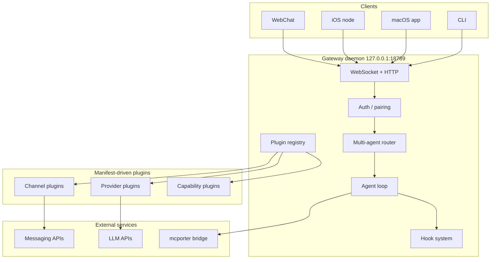

# OpenClaw vs Hermes Agent: Two Approaches to the Personal AI Assistant

This article compares two open-source personal AI assistants that occupy overlapping territory but resolve the same design questions very differently. For deeper background, see the source research on [OpenClaw](openclaw.md) and [Hermes Agent](hermes-agent.md).

## Introduction

Both OpenClaw and Hermes Agent try to solve the same problem: give one person an AI assistant that lives on messaging platforms they already use, runs on their own machine, keeps memory across sessions, and can take real actions through tools. The two projects are also historically linked - Hermes Agent launched in February 2026 as the self-identified successor to OpenClaw, and ships a `hermes claw migrate` command to import state from existing OpenClaw installations.

The problem space they share:

 - Single-user personal assistants (not multi-tenant SaaS).
 - Messaging-first interfaces (Telegram, WhatsApp, Discord, Slack, and more).
 - Local-first or self-hostable deployment.
 - Pluggable LLM providers rather than a single model.
 - Tool-using agents with terminal, browser, and skill access.
 - Persistent memory and identity that survives across sessions.

The problem space they diverge on:

 - OpenClaw treats the Gateway daemon as the architectural center. Hermes treats the conversation loop in `run_agent.py` as the center.
 - OpenClaw is TypeScript, manifest-driven, with strict plugin boundaries. Hermes is Python, monolithic in its core loop, with tools and adapters as Python modules.
 - OpenClaw emphasizes the control plane (sessions, routing, hooks, security sandboxes). Hermes emphasizes the agent's self-improvement loop (auto-created skills, curated memory, RL training hooks).

Both projects are single-operator tools. Neither is built for teams. Both aim to be the assistant that sits between a user and the rest of their digital life.

## OpenClaw Overview

OpenClaw is a TypeScript/Node.js assistant organized around a single long-lived Gateway daemon bound to `127.0.0.1:18789` by default. The Gateway owns all messaging connections, client WebSockets, the plugin registry, and the agent loop. Everything else - CLI, macOS menu bar app, iOS node, WebChat, channel plugins, provider plugins - plugs into the Gateway.

The plugin system is manifest-first. Each plugin ships an `openclaw.plugin.json` that declares what it provides (channels, LLM providers, capabilities, tools, hooks) without loading any runtime code. Core reads the manifest, decides what to activate, and only then calls the plugin's register API. The architecture boundary is enforced in CI: core code cannot import from extension source, and no hardcoded provider/channel lists are allowed in core.

Key design decisions:

 - Gateway as the only singleton. One daemon, one WhatsApp/Baileys session per host, one control plane. This avoids the duplicate-connection problem that kills simpler assistants.
 - Multi-agent routing. Different channels, accounts, or peers can route to different agents with isolated workspaces and sessions. Work Telegram and personal Signal can be two different agents on the same host.
 - Session lanes. Runs are serialized per session key and optionally through a global lane, preventing interleaved tool calls in the same chat.
 - Tool sandboxing by session type. The `main` session runs tools on the host with full access; non-main sessions run inside per-session Docker sandboxes with a restricted tool set.
 - Prompt cache stability as a tested invariant. Core has regression tests ensuring turn-to-turn prompt prefixes stay byte-identical so provider caches keep hitting.
 - Bridge-over-builtin for MCP. Uses the external `mcporter` bridge rather than embedding MCP runtime into core, so MCP spec churn does not destabilize the Gateway.
 - Streaming stays inside. Partial tokens stream to first-party clients (CLI, macOS app, WebChat) but only final replies go to external messaging channels. No partial reasoning leaks to Telegram or WhatsApp.

See [openclaw.md](openclaw.md) for the full component-by-component breakdown.

## Hermes Agent Overview

Hermes Agent is a Python 3.11+ runtime built by Nous Research. It is structured around a single conversation loop (`AIAgent.run_conversation()` in `run_agent.py`) that every entry point funnels into: the TUI, the 16-platform messaging gateway, the ACP editor adapter, a batch trajectory runner, and an API server. The core loop file is 633 KB, deliberately kept as one very large module so a contributor can read the full turn in one place.

Three stacks plug into that central loop: providers (9+ LLM API shapes including OpenRouter, Nous Portal, Anthropic, Codex, Gemini, Bedrock, GitHub Copilot, local endpoints, custom base URLs), tools (47 tools in 20 toolsets including a six-backend terminal, Camofox browser, skills system, delegate/clarify/todo orchestration, security, MCP), and platform adapters (Telegram, Discord, Slack, WhatsApp, Signal, SMS, Email, Matrix, Mattermost, DingTalk, Feishu, WeCom, WeChat, BlueBubbles, Home Assistant, generic webhook).

```mermaid
graph TB
    subgraph EP[Entry points]
        TUI[CLI TUI]
        GWR[Gateway runner]
        ACP[ACP adapter]
        BAT[Batch runner]
        API[API server]
        CR[Cron scheduler]
    end

    subgraph CORE[Agent core - run_agent.py 633 KB]
        LOOP[AIAgent.run_conversation]
        PB[prompt_builder]
        RP[runtime provider]
        MT[model_tools]
        CC[context_compressor]
        AUX[auxiliary_client - 124 KB]
    end

    subgraph ID[Identity - frozen per session]
        SOUL[SOUL.md]
        MEM[MEMORY.md]
        USR[USER.md]
        CTX[.hermes.md / AGENTS.md / CLAUDE.md]
        SK0[Skills manifest Level 0]
    end

    subgraph PROV[9 provider shapes]
        NOUS[Nous Portal]
        OR[OpenRouter 200+]
        ANT[Anthropic Messages]
        OAI[OpenAI/Codex Responses]
        GEM[Gemini native / CloudCode]
        BED[Bedrock]
        GH[Copilot OAuth]
        LOC[Ollama/vLLM/SGLang]
    end

    subgraph TOOLS[47 tools / 20 toolsets]
        TERM[Terminal: local/docker/ssh/modal/daytona/singularity]
        BROW[Browser Camofox]
        SKT[Skills Level 0/1/2]
        MEMT[Memory + FTS5 search]
        SEC[Tirith + smart approvals]
        RL[rl_training_tool]
    end

    subgraph STORE[Persistence]
        SQL[(SQLite + FTS5)]
        DISK[~/.hermes/ - skills, memories, auth]
    end

    TUI --> LOOP
    GWR --> LOOP
    ACP --> LOOP
    BAT --> LOOP
    API --> LOOP
    CR --> LOOP

    LOOP --> PB
    PB --> SOUL
    PB --> MEM
    PB --> USR
    PB --> CTX
    PB --> SK0

    LOOP --> RP
    RP --> NOUS
    RP --> OR
    RP --> ANT
    RP --> OAI
    RP --> GEM
    RP --> BED
    RP --> GH
    RP --> LOC

    LOOP --> MT
    MT --> TERM
    MT --> BROW
    MT --> SKT
    MT --> MEMT
    MT --> SEC
    MT --> RL

    LOOP --> AUX
    LOOP --> CC
    LOOP --> SQL
    MEMT --> DISK
    SKT --> DISK
```

Key design decisions:

 - Single monolithic conversation loop. One very large file is the entire agent turn. Contributors trade cognitive load for transparency - no hidden indirection.
 - Frozen-snapshot memory. SOUL.md, MEMORY.md, and USER.md are loaded at session start and locked for the duration of the session. Edits go to disk but do not re-enter the system prompt until the next session. This keeps the LLM prefix cache hot across long conversations.
 - Model-agnostic to a radical degree. 200+ models through OpenRouter alone, plus eight other provider shapes, plus custom `base_url`. Context length resolution has a nine-source fallback chain so even obscure models work without manual tuning.
 - Auxiliary model architecture. Vision, web extraction, compression, and session search all run on cheaper auxiliary models. `auxiliary_client.py` at 124 KB is larger than many complete agent repos.
 - Self-improving skills. After complex tasks (5+ tool calls), or when the user corrects the agent, Hermes writes a new skill autonomously. Skills can be amended mid-use. The skill library compounds over weeks of use.
 - Six-backend terminal tool. Local, Docker, SSH, Modal serverless VM, Daytona managed container, Singularity HPC. The agent can jump from a laptop to a GPU cluster without changing how it executes shell commands.
 - Smart approvals via auxiliary LLM. An auxiliary model classifies dangerous commands, auto-approves safe ones, escalates risky ones to the user. Combined with Tirith policy-as-code scanning.
 - Training pipeline integration. `batch_runner.py` generates trajectories, `trajectory_compressor.py` prepares them for training, `rl_training_tool.py` is an in-agent tool that can launch training runs. Hermes is simultaneously an agent and a data collection pipeline for Nous Research's next model.

See [hermes-agent.md](hermes-agent.md) for the file-level tour.

## Side-by-Side Comparison

| Aspect | OpenClaw | Hermes Agent |
|---|---|---|
| Creator | OpenClaw project (community) | Nous Research |
| Launched | November 2025 | February 2026 |
| Language | TypeScript (ESM), Node 22.16+ / 24 | Python 3.11+ |
| Package manager | pnpm workspaces (Bun compatible) | uv |
| License | MIT | MIT |
| GitHub stars (source article) | 360,000+ | 103,000+ |
| Architectural center | Gateway daemon (127.0.0.1:18789) | Single conversation loop (run_agent.py) |
| Core size philosophy | Many small modules with strict boundaries | One very large file for transparency |
| Plugin mechanism | Manifest-first (openclaw.plugin.json) with discovery, validation, enablement, registration | Python modules imported directly in tools, providers, platforms |
| Architecture enforcement | CI guardrails prevent core importing extensions | Conventional Python imports |
| LLM provider breadth | 40+ providers, each its own plugin | 9 provider shapes, 200+ models via OpenRouter |
| Messaging platforms | 24+ channels (WhatsApp, Telegram, Slack, Discord, iMessage, Signal, Matrix, Teams, etc.) | 16 platforms (Telegram, Discord, Slack, WhatsApp, Signal, SMS, Email, Matrix, Mattermost, DingTalk, Feishu, WeCom, WeChat, BlueBubbles, Home Assistant, webhook) |
| Companion apps | macOS menu bar, iOS node, Android node, WebChat | CLI TUI only |
| Terminal backends | Host or per-session Docker sandbox | local, docker, ssh, modal, daytona, singularity |
| Browser | Via capability plugins | Camofox stealth Firefox + CDP |
| Memory model | JSONL session transcripts, session compaction, memory plugin (one active: memory-core, memory-lancedb, memory-wiki) | SOUL.md + MEMORY.md + USER.md frozen snapshot + SQLite FTS5 + 8 external memory plugins |
| Skills | Skills marketplace (ClawHub), 50+ bundled | agentskills.io standard, Level 0/1/2 progressive disclosure, auto-created, auto-amended |
| Self-improvement | Memory dreaming (background consolidation) | Autonomous skill creation and amendment after complex tasks, plus curation nudges |
| Multi-agent | Multi-agent routing - different channels route to different agents with isolated workspaces | Single agent, but delegate tool + mixture_of_agents orchestration inside one loop |
| Session isolation | Per-session JSONL files under `~/.openclaw/agents/<id>/sessions/`, session lanes serialize runs | SQLite with FTS5 indexing, session key resolution in gateway/session.py |
| Hooks / extensibility | 15+ named hooks (before_model_resolve, before_prompt_build, before_tool_call, tool_result_persist, message_received, etc.) with priority ordering and terminal-block semantics | Python tool modules and platform adapters; less formal hook system |
| MCP integration | External bridge via `mcporter` (not in core) | Native MCP tool at 101 KB with OAuth |
| Security - network | Binds 127.0.0.1 by default, device pairing, signed connect challenges | Host-level security, gateway pairing codes for platform users |
| Security - tools | Per-session Docker sandbox for non-main sessions, tool allow/deny lists | Tirith policy-as-code, approval.py with auxiliary-LLM risk assessment, url_safety, osv_check, path_security |
| Auth rotation | Auth profile rotation with cooldown + round-robin + last-good tracking | credential_pool.py with fill_first, round_robin, least_used, random strategies |
| Prompt cache | Tested as a correctness invariant, regression tests for prefix stability | Frozen-snapshot pattern ensures stable prefix across a session |
| Auxiliary models | Not a named pattern | First-class pattern: vision, web_extract, compression, session_search each configured separately |
| Context compression | Manual and automatic compaction operations on JSONL transcripts | Automatic threshold-based compression (default 50% of context window), 70%/90% budget warnings injected inline |
| Scheduled tasks | Cron engine integrated into the Gateway | cron/scheduler.py with natural-language job specs, delivered through any configured platform |
| Canvas / dynamic UI | A2UI Canvas served from Gateway HTTP | None equivalent |
| Training integration | None | batch_runner.py, trajectory_compressor.py, tinker-atropos submodule, rl_training_tool in-agent tool |
| Deployment target | macOS, Linux, Windows (WSL2), primarily local-first | $5 VPS to GPU cluster, plus serverless (Modal, Daytona) |
| Setup time (source article) | Variable, tutorial-driven | ~15 minutes |
| Build tooling | tsgo (Go-based TS compiler), Oxlint, Oxfmt, Vitest | Standard Python tooling, uv |
| Streaming to external channels | Blocked by design - only final replies leave | Streams partial text back to platform for delivery |

## Where They Differ Philosophically

The table shows a lot of surface differences. Underneath them, four deeper disagreements drive most of the design.

### Control Plane vs Conversation Loop

OpenClaw asks: what is the permanent structure that owns the assistant? The answer is a daemon with a WebSocket protocol, a plugin registry, a routing engine, and a hook system. The agent loop is one consumer of that infrastructure, not the center. This is why so much OpenClaw documentation is about the Gateway, pairing, sessions, and plugin manifests - the conversation is almost an implementation detail.

Hermes asks: what happens in a single turn? The answer is `AIAgent.run_conversation()` in one very large file. Everything else - the gateway, the cron scheduler, the batch runner, the API server - is a different way to call that function. The infrastructure is thin; the loop is the product.

This shows up in everything. OpenClaw tests prompt cache stability as a core invariant; Hermes uses a frozen-snapshot pattern as a loop implementation detail. OpenClaw has CI gates preventing core from importing extensions; Hermes has a 633 KB run_agent.py where core and adapters sit side by side.

### Manifest-First vs Code-First Extensibility

OpenClaw plugins start as JSON. `openclaw.plugin.json` declares channels, capabilities, config schemas, and env vars. Core reads manifests, validates them, decides enablement, and only then loads code. The operator can see what a plugin will do before running it, and core can plan activation from metadata alone.

Hermes plugins are Python modules. A tool is a file in `tools/`. A platform adapter is a file in `gateway/platforms/`. A memory provider is a file in `plugins/memory/`. The registry is discovery-by-directory, not manifest-driven.

The tradeoff is explicit. OpenClaw gets stricter boundaries, CI-enforceable architecture rules, and a cleaner separation of declaration from execution. Hermes gets faster iteration, less ceremony, and the ability to land a new tool in one file.

### Streaming Inside vs Streaming Outside

OpenClaw draws a hard line: streaming tokens go to first-party clients (CLI, macOS app, WebChat), not to external messaging surfaces. Telegram users see a single final message. The reasons given are both UX (no flickering partial replies) and security (no reasoning leaking to third-party platforms).

Hermes streams partial text back through the gateway to whatever platform the user is on. A Telegram user sees the response build up. This matches how most chat-first agents work and is what most users expect from modern LLM interfaces.

Under this choice sits a different view of what the external messaging platform is for. OpenClaw treats it as a delivery endpoint that only sees committed output. Hermes treats it as a live view into the agent's work.

### Multi-Agent Isolation vs Single Agent with Orchestration

OpenClaw's routing engine maps (channel id, account id, peer) to a specific agent with its own workspace, sessions, and configuration. You can run separate agents for work and personal contexts on the same host, and they do not share state. Isolation is a routing-layer property.

Hermes runs a single agent per installation. For multi-task work, it uses in-loop orchestration: the `delegate_tool` spawns a sub-session, `mixture_of_agents` runs parallel auxiliaries, the `clarify` tool pauses for user input, `todo` tracks task state. Specialization happens within the conversation, not by running separate agents.

The philosophical difference: OpenClaw says "my work self and my personal self should not share a context"; Hermes says "I am one agent, but I can temporarily become specialized".

### Frozen Identity vs Mutable Identity

Both systems carry identity across sessions via SOUL.md and MEMORY.md files. The difference is when edits take effect.

Hermes explicitly freezes the snapshot at session start. Edits made during the session go to disk but do not re-enter the system prompt until the next session. The motivation is prefix-cache reuse - if memory contents shift mid-session, the cached KV prefix is invalidated and every subsequent turn pays to rebuild it.

OpenClaw's hooks can mutate prompts mid-session (`before_prompt_build` runs after session load to inject context). OpenClaw relies on testing prompt-prefix stability as a property rather than structurally forbidding mutation. The Hermes approach trades a surprise ("my memory edit did not take effect") for a cache guarantee. The OpenClaw approach trades test burden for flexibility.

### Training-Pipeline-As-Agent vs Agent-As-Product

Hermes ships `rl_training_tool.py` as an in-agent tool. The agent can launch training jobs against its own trajectories. `batch_runner.py` exists to collect trajectories at scale. The tinker-atropos submodule wires into Nous Research's RL infrastructure. Hermes is simultaneously a product for users and a data pipeline for Nous's next model.

OpenClaw has no training hooks. The agent is the product. Session transcripts are for session memory, not for fine-tuning. The commercial asymmetry is visible: Nous ships the agent to help train its models; OpenClaw ships the agent as an end in itself.

## Summary

### When to Pick OpenClaw

 - You want a hardened control plane with enforceable architecture boundaries.
 - You need real multi-agent isolation (work vs personal with separate workspaces).
 - You care about per-session Docker sandboxes for non-trusted inbound DMs.
 - You want companion apps - a macOS menu bar app, an iOS/Android node that exposes camera and location to the agent.
 - You need 24+ messaging channels, including iMessage, Matrix, Twitch, and WeChat variants.
 - You want strict separation between streaming (internal) and final replies (external).
 - TypeScript/Node.js is a better fit for your stack than Python.
 - You want a Canvas/A2UI live visual workspace the agent can render into.
 - You want MCP support but do not want MCP spec churn to destabilize your gateway.

### When to Pick Hermes Agent

 - You want radical model agnosticism across 200+ models and 9 provider API shapes.
 - You need the terminal tool to run on Modal, Daytona, Singularity, or an SSH box, not just Docker.
 - You want auto-generated skills that compound over time.
 - You value the frozen-snapshot memory pattern for long-conversation prefix cache reuse.
 - You want smart approvals via an auxiliary LLM rather than flat allow/deny lists.
 - You want a single loop file you can read end to end.
 - You want the auxiliary-model pattern (cheap models for vision, web extract, compression, session search).
 - Python is a better fit for your stack.
 - You may contribute trajectories to Nous Research's model training.
 - You want natural-language cron scheduling with multi-platform delivery.

### Key Takeaways

Both projects solve the same surface problem and land in different places because they answer different underlying questions.

OpenClaw asks: what infrastructure does a personal assistant need to be reliable, secure, and extensible for years? Its answer is a Gateway, a plugin registry with CI-enforced boundaries, multi-agent routing, session lanes, and sandbox tiers.

Hermes Agent asks: what should a single agent turn look like when the goal is a self-improving assistant that grows with the user? Its answer is a single conversation loop that every entry point funnels into, with frozen-snapshot identity, auto-created skills, auxiliary models for side tasks, and a built-in training pipeline.

Historically, Hermes inherited patterns from OpenClaw - SOUL.md, JSONL sessions, the agent-loop structure - and pushed further on the self-improvement and model-agnosticism axes. OpenClaw continued to push on the control-plane and multi-agent axes. Neither project is strictly better; they optimize for different things.

For a Telegram writing assistant project, the concrete patterns worth copying from each:

 - From OpenClaw: Gateway daemon as the messaging singleton (avoids duplicate connections), manifest-first plugin declaration, session lanes to serialize runs, prompt-prefix stability as a tested invariant, streaming-stays-inside for cleaner messaging UX.
 - From Hermes: frozen-snapshot memory for prefix cache reuse, pairing-code authentication (no hardcoded user IDs), skills progressive disclosure (Level 0/1/2), auxiliary-model routing for side tasks, natural-language cron with platform delivery, smart approvals via an auxiliary LLM.

## Sources

[^1]: User instruction: "create a comparison article between OpenClaw and Hermes"
[^2]: [OpenClaw source article](openclaw.md) - full architectural analysis
[^3]: [Hermes Agent source article](hermes-agent.md) - full architectural analysis
[^4]: OpenClaw repository: https://github.com/openclaw/openclaw
[^5]: Hermes Agent repository: https://github.com/NousResearch/hermes-agent
