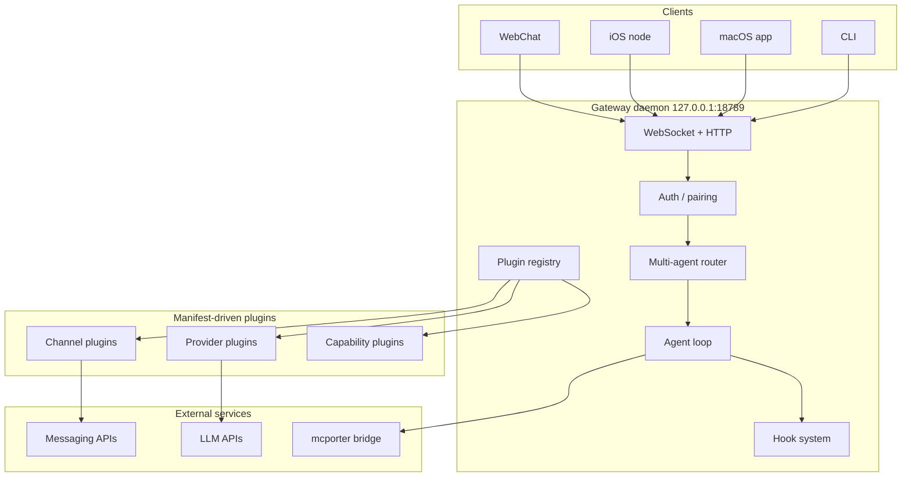

# OpenClaw vs Hermes Agent: Two Approaches to the Personal AI Assistant

This article compares two open-source personal AI assistants that occupy overlapping territory but resolve the same design questions very differently. For deeper background, see the source research on [OpenClaw](openclaw.md) and [Hermes Agent](hermes-agent.md).

## Introduction

Both OpenClaw and Hermes Agent try to solve the same problem: give one person an AI assistant that lives on messaging platforms they already use, runs on their own machine, keeps memory across sessions, and can take real actions through tools. The two projects are also historically linked - Hermes Agent launched in February 2026 as the self-identified successor to OpenClaw, and ships a `hermes claw migrate` command to import state from existing OpenClaw installations.

The problem space they share:

 - Single-user personal assistants (not multi-tenant SaaS).
 - Messaging-first interfaces (Telegram, WhatsApp, Discord, Slack, and more).
 - Local-first or self-hostable deployment.
 - Pluggable LLM providers rather than a single model.
 - Tool-using agents with terminal, browser, and skill access.
 - Persistent memory and identity that survives across sessions.

The problem space they diverge on:

 - OpenClaw treats the Gateway daemon as the architectural center. Hermes treats the conversation loop in `run_agent.py` as the center.
 - OpenClaw is TypeScript, manifest-driven, with strict plugin boundaries. Hermes is Python, monolithic in its core loop, with tools and adapters as Python modules.
 - OpenClaw emphasizes the control plane (sessions, routing, hooks, security sandboxes). Hermes emphasizes the agent's self-improvement loop (auto-created skills, curated memory, RL training hooks).

Both projects are single-operator tools. Neither is built for teams. Both aim to be the assistant that sits between a user and the rest of their digital life.

## OpenClaw Overview

OpenClaw is a TypeScript/Node.js assistant organized around a single long-lived Gateway daemon bound to `127.0.0.1:18789` by default. The Gateway owns all messaging connections, client WebSockets, the plugin registry, and the agent loop. Everything else - CLI, macOS menu bar app, iOS node, WebChat, channel plugins, provider plugins - plugs into the Gateway.

The plugin system is manifest-first. Each plugin ships an `openclaw.plugin.json` that declares what it provides (channels, LLM providers, capabilities, tools, hooks) without loading any runtime code. Core reads the manifest, decides what to activate, and only then calls the plugin's register API. The architecture boundary is enforced in CI: core code cannot import from extension source, and no hardcoded provider/channel lists are allowed in core.

Key design decisions:

 - Gateway as the only singleton. One daemon, one WhatsApp/Baileys session per host, one control plane. This avoids the duplicate-connection problem that kills simpler assistants.
 - Multi-agent routing. Different channels, accounts, or peers can route to different agents with isolated workspaces and sessions. Work Telegram and personal Signal can be two different agents on the same host.
 - Session lanes. Runs are serialized per session key and optionally through a global lane, preventing interleaved tool calls in the same chat.
 - Tool sandboxing by session type. The `main` session runs tools on the host with full access; non-main sessions run inside per-session Docker sandboxes with a restricted tool set.
 - Prompt cache stability as a tested invariant. Core has regression tests ensuring turn-to-turn prompt prefixes stay byte-identical so provider caches keep hitting.
 - Bridge-over-builtin for MCP. Uses the external `mcporter` bridge rather than embedding MCP runtime into core, so MCP spec churn does not destabilize the Gateway.
 - Streaming stays inside. Partial tokens stream to first-party clients (CLI, macOS app, WebChat) but only final replies go to external messaging channels. No partial reasoning leaks to Telegram or WhatsApp.

See [openclaw.md](openclaw.md) for the full component-by-component breakdown.

## Hermes Agent Overview

Hermes Agent is a Python 3.11+ runtime built by Nous Research. It is structured around a single conversation loop (`AIAgent.run_conversation()` in `run_agent.py`) that every entry point funnels into: the TUI, the 16-platform messaging gateway, the ACP editor adapter, a batch trajectory runner, and an API server. The core loop file is 633 KB, deliberately kept as one very large module so a contributor can read the full turn in one place.

Three stacks plug into that central loop: providers (9+ LLM API shapes including OpenRouter, Nous Portal, Anthropic, Codex, Gemini, Bedrock, GitHub Copilot, local endpoints, custom base URLs), tools (47 tools in 20 toolsets including a six-backend terminal, Camofox browser, skills system, delegate/clarify/todo orchestration, security, MCP), and platform adapters (Telegram, Discord, Slack, WhatsApp, Signal, SMS, Email, Matrix, Mattermost, DingTalk, Feishu, WeCom, WeChat, BlueBubbles, Home Assistant, generic webhook).

```mermaid
graph TB
    subgraph EP[Entry points]
        TUI[CLI TUI]
        GWR[Gateway runner]
        ACP[ACP adapter]
        BAT[Batch runner]
        API[API server]
        CR[Cron scheduler]
    end

    subgraph CORE[Agent core - run_agent.py 633 KB]
        LOOP[AIAgent.run_conversation]
        PB[prompt_builder]
        RP[runtime provider]
        MT[model_tools]
        CC[context_compressor]
        AUX[auxiliary_client - 124 KB]
    end

    subgraph ID[Identity - frozen per session]
        SOUL[SOUL.md]
        MEM[MEMORY.md]
        USR[USER.md]
        CTX[.hermes.md / AGENTS.md / CLAUDE.md]
        SK0[Skills manifest Level 0]
    end

    subgraph PROV[9 provider shapes]
        NOUS[Nous Portal]
        OR[OpenRouter 200+]
        ANT[Anthropic Messages]
        OAI[OpenAI/Codex Responses]
        GEM[Gemini native / CloudCode]
        BED[Bedrock]
        GH[Copilot OAuth]
        LOC[Ollama/vLLM/SGLang]
    end

    subgraph TOOLS[47 tools / 20 toolsets]
        TERM[Terminal: local/docker/ssh/modal/daytona/singularity]
        BROW[Browser Camofox]
        SKT[Skills Level 0/1/2]
        MEMT[Memory + FTS5 search]
        SEC[Tirith + smart approvals]
        RL[rl_training_tool]
    end

    subgraph STORE[Persistence]
        SQL[(SQLite + FTS5)]
        DISK[~/.hermes/ - skills, memories, auth]
    end

    TUI --> LOOP
    GWR --> LOOP
    ACP --> LOOP
    BAT --> LOOP
    API --> LOOP
    CR --> LOOP

    LOOP --> PB
    PB --> SOUL
    PB --> MEM
    PB --> USR
    PB --> CTX
    PB --> SK0

    LOOP --> RP
    RP --> NOUS
    RP --> OR
    RP --> ANT
    RP --> OAI
    RP --> GEM
    RP --> BED
    RP --> GH
    RP --> LOC

    LOOP --> MT
    MT --> TERM
    MT --> BROW
    MT --> SKT
    MT --> MEMT
    MT --> SEC
    MT --> RL

    LOOP --> AUX
    LOOP --> CC
    LOOP --> SQL
    MEMT --> DISK
    SKT --> DISK
```

Key design decisions:

 - Single monolithic conversation loop. One very large file is the entire agent turn. Contributors trade cognitive load for transparency - no hidden indirection.
 - Frozen-snapshot memory. SOUL.md, MEMORY.md, and USER.md are loaded at session start and locked for the duration of the session. Edits go to disk but do not re-enter the system prompt until the next session. This keeps the LLM prefix cache hot across long conversations.
 - Model-agnostic to a radical degree. 200+ models through OpenRouter alone, plus eight other provider shapes, plus custom `base_url`. Context length resolution has a nine-source fallback chain so even obscure models work without manual tuning.
 - Auxiliary model architecture. Vision, web extraction, compression, and session search all run on cheaper auxiliary models. `auxiliary_client.py` at 124 KB is larger than many complete agent repos.
 - Self-improving skills. After complex tasks (5+ tool calls), or when you correct the agent, Hermes writes a new skill autonomously. Skills can be amended mid-use. The skill library compounds over weeks of use.
 - Six-backend terminal tool. Local, Docker, SSH, Modal serverless VM, Daytona managed container, Singularity HPC. The agent can jump from a laptop to a GPU cluster without changing how it executes shell commands.
 - Smart approvals via auxiliary LLM. An auxiliary model classifies dangerous commands, auto-approves safe ones, and escalates risky ones to you. Combined with Tirith policy-as-code scanning.
 - Training pipeline integration. `batch_runner.py` generates trajectories, `trajectory_compressor.py` prepares them for training, `rl_training_tool.py` is an in-agent tool that can launch training runs. Hermes is simultaneously an agent and a data collection pipeline for Nous Research's next model.

See [hermes-agent.md](hermes-agent.md) for the file-level tour.

## Side-by-Side Comparison

| Aspect | OpenClaw | Hermes Agent |
|---|---|---|
| Creator | OpenClaw project (community) | Nous Research |
| Launched | November 2025 | February 2026 |
| Language | TypeScript (ESM), Node 22.16+ / 24 | Python 3.11+ |
| Package manager | pnpm workspaces (Bun compatible) | uv |
| License | MIT | MIT |
| GitHub stars (source article) | 360,000+ | 103,000+ |
| Architectural center | Gateway daemon (127.0.0.1:18789) | Single conversation loop (run_agent.py) |
| Core size philosophy | Many small modules with strict boundaries | One very large file for transparency |
| Plugin mechanism | Manifest-first (openclaw.plugin.json) with discovery, validation, enablement, registration | Python modules imported directly in tools, providers, platforms |
| Architecture enforcement | CI guardrails prevent core importing extensions | Conventional Python imports |
| LLM provider breadth | 40+ providers, each its own plugin | 9 provider shapes, 200+ models via OpenRouter |
| Messaging platforms | 24+ channels (WhatsApp, Telegram, Slack, Discord, iMessage, Signal, Matrix, Teams, etc.) | 16 platforms (Telegram, Discord, Slack, WhatsApp, Signal, SMS, Email, Matrix, Mattermost, DingTalk, Feishu, WeCom, WeChat, BlueBubbles, Home Assistant, webhook) |
| Companion apps | macOS menu bar, iOS node, Android node, WebChat | CLI TUI only |
| Terminal backends | Host or per-session Docker sandbox | local, docker, ssh, modal, daytona, singularity |
| Browser | Via capability plugins | Camofox stealth Firefox + CDP |
| Memory model | JSONL session transcripts, session compaction, memory plugin (one active: memory-core, memory-lancedb, memory-wiki) | SOUL.md + MEMORY.md + USER.md frozen snapshot + SQLite FTS5 + 8 external memory plugins |
| Skills | Skills marketplace (ClawHub), 50+ bundled | agentskills.io standard, Level 0/1/2 progressive disclosure, auto-created, auto-amended |
| Self-improvement | Memory dreaming (background consolidation) | Autonomous skill creation and amendment after complex tasks, plus curation nudges |
| Multi-agent | Multi-agent routing - different channels route to different agents with isolated workspaces | Single agent, but delegate tool + mixture_of_agents orchestration inside one loop |
| Session isolation | Per-session JSONL files under `~/.openclaw/agents/<id>/sessions/`, session lanes serialize runs | SQLite with FTS5 indexing, session key resolution in gateway/session.py |
| Hooks / extensibility | 15+ named hooks (before_model_resolve, before_prompt_build, before_tool_call, tool_result_persist, message_received, etc.) with priority ordering and terminal-block semantics | Python tool modules and platform adapters; less formal hook system |
| MCP integration | External bridge via `mcporter` (not in core) | Native MCP tool at 101 KB with OAuth |
| Security - network | Binds 127.0.0.1 by default, device pairing, signed connect challenges | Host-level security, gateway pairing codes for platform users |
| Security - tools | Per-session Docker sandbox for non-main sessions, tool allow/deny lists | Tirith policy-as-code, approval.py with auxiliary-LLM risk assessment, url_safety, osv_check, path_security |
| Auth rotation | Auth profile rotation with cooldown + round-robin + last-good tracking | credential_pool.py with fill_first, round_robin, least_used, random strategies |
| Prompt cache | Tested as a correctness invariant, regression tests for prefix stability | Frozen-snapshot pattern ensures stable prefix across a session |
| Auxiliary models | Not a named pattern | First-class pattern: vision, web_extract, compression, session_search each configured separately |
| Context compression | Manual and automatic compaction operations on JSONL transcripts | Automatic threshold-based compression (default 50% of context window), 70%/90% budget warnings injected inline |
| Scheduled tasks | Cron engine integrated into the Gateway | cron/scheduler.py with natural-language job specs, delivered through any configured platform |
| Canvas / dynamic UI | A2UI Canvas served from Gateway HTTP | None equivalent |
| Training integration | None | batch_runner.py, trajectory_compressor.py, tinker-atropos submodule, rl_training_tool in-agent tool |
| Deployment target | macOS, Linux, Windows (WSL2), primarily local-first | $5 VPS to GPU cluster, plus serverless (Modal, Daytona) |
| Setup time (source article) | Variable, tutorial-driven | ~15 minutes |
| Build tooling | tsgo (Go-based TS compiler), Oxlint, Oxfmt, Vitest | Standard Python tooling, uv |
| Streaming to external channels | Blocked by design - only final replies leave | Streams partial text back to platform for delivery |

## Where They Differ Philosophically

The table shows a lot of surface differences. Underneath them, six deeper design axes drive most of the choices. Each subsection below picks one axis, defines what the two approaches mean in plain terms, compares how each project lands on it, and explains what the difference means for you as an operator or contributor.

### Control Plane vs Conversation Loop

The first axis is what sits at the architectural center: a long-lived control plane, or the agent's own turn logic. A control plane here means the permanent infrastructure that owns connections, routing, plugins, and sessions - the code that stays running between turns. A conversation loop means the per-turn function that builds a prompt, calls the model, and runs tools.

OpenClaw's design centers on the control plane. The Gateway daemon owns the WebSocket protocol, the plugin registry, the routing engine, and the hook system. The agent turn is one consumer of that infrastructure, not the center. This is why so much of the OpenClaw codebase and docs is about the Gateway, pairing, sessions, and plugin manifests.

Hermes Agent's design centers on the conversation loop. `AIAgent.run_conversation()` in one very large file is the product. Everything else - the gateway, the cron scheduler, the batch runner, the API server - is a different way to call that function. The infrastructure is thin; the loop carries the weight.

For you as a contributor or operator, this difference shows up everywhere. With OpenClaw you work through a defined extension surface (manifests, hooks, plugin APIs) and the boundaries are enforced in CI. With Hermes you edit the loop directly or drop a new tool file in, and you own more of the correctness work yourself. OpenClaw tests prompt-cache stability as a core invariant; Hermes relies on a frozen-snapshot pattern inside the loop to keep the prefix stable.

### Manifest-First vs Code-First Extensibility

The second axis is how extensions are declared. "Manifest-first" means plugins ship a JSON file that declares what they provide (channels, providers, tools, config schemas, env vars) before any of their code runs. "Code-first" means a plugin is just source code in a known directory - the system discovers and loads the code, and the code itself is the declaration.

OpenClaw is manifest-first. Every plugin ships an `openclaw.plugin.json`. Core reads the manifest, validates it, decides whether to enable the plugin, and only then calls the plugin's register API. You can inspect what a plugin will do before running any of its code, and core can plan activation from metadata alone.

Hermes is code-first. A tool is a Python file in `tools/`. A platform adapter is a file in `gateway/platforms/`. A memory provider is a file in `plugins/memory/`. The registry is discovery-by-directory, not manifest-driven.

For you, the tradeoff is concrete. With OpenClaw you pay more ceremony up front (write a manifest, match a schema, satisfy CI boundary checks) and you get stricter boundaries and auditability in return. With Hermes you can add a new tool by dropping one file into `tools/` and importing it - faster to write, but you lose the "see before you run" guarantee and the CI rules that stop core from leaking into extensions.

### Streaming Inside vs Streaming Outside

The third axis is how far partial model output is allowed to travel. Both systems stream tokens from the LLM provider. The question is whether those partial tokens are forwarded to an external messaging platform (Telegram, WhatsApp, Slack) or kept inside the system until a full reply is ready.

OpenClaw keeps streaming inside. Partial tokens go to first-party clients - the CLI, the macOS app, the WebChat UI - but external messaging channels only receive the final reply. If you chat with the assistant from Telegram, you see one committed message appear; if you chat from the macOS app, you see tokens stream in live. The stated reasons are UX (no flickering partial replies being edited in-place on Telegram) and security (no in-progress reasoning leaking to third-party platforms).

Hermes streams outside. Partial text flows back through the gateway to whatever platform you are on, and the Telegram message updates as tokens arrive. This matches what most chat-first LLM products do and what most users now expect.

For you as a user, the practical difference is whether chatting with the assistant on Telegram feels like ChatGPT (watch the answer build up) or like sending an email (one reply appears when it is ready). For you as an operator, it also decides whether any partial reasoning ever lands inside a third-party messaging service's storage.

### Multi-Agent Isolation vs Single Agent with Orchestration

The fourth axis is how the system handles different contexts or tasks. "Multi-agent isolation" means running several independently configured agents on the same host, each with its own memory, workspace, and tools, and routing incoming messages to the right one. "Single agent with orchestration" means one agent handles everything, but it can temporarily spawn sub-sessions or call specialized helpers from inside its conversation loop.

OpenClaw takes the multi-agent isolation route. The routing engine maps a tuple of (channel id, account id, peer) to a specific agent with its own workspace, sessions, and configuration. You can run one agent for work Telegram and a different agent for personal Signal on the same host, and they do not share state. Isolation is a routing-layer property.

Hermes takes the single-agent-with-orchestration route. There is one agent per installation. For multi-task work, it uses in-loop orchestration instead: the `delegate_tool` spawns a sub-session to handle a subtask, `mixture_of_agents` runs parallel auxiliaries and merges results, the `clarify` tool pauses to ask you a question, `todo` tracks task state across turns. Specialization happens within one conversation, not by running separate agents.

For you, the difference is whether "my work assistant" and "my personal assistant" are two separately-configured agents that cannot see each other's state, or one agent that handles both. If you want a hard wall between contexts, OpenClaw gives you that at the routing layer. If you want one agent that can temporarily become a coding agent, a research agent, or a writing assistant through in-loop delegation, Hermes is built for that.

### Frozen Identity vs Mutable Identity

The fifth axis is about identity files - SOUL.md, MEMORY.md, USER.md and similar - and when edits to them take effect. These are not established industry terms; in this article "frozen identity" means the contents of the identity files are loaded once at session start and cannot change the system prompt until the next session, while "mutable identity" means those files can be re-read and the system prompt rebuilt mid-session. Both projects carry identity across sessions through these files; they disagree on when edits start to count.

Hermes takes the frozen-identity route explicitly. SOUL.md, MEMORY.md, and USER.md are loaded at session start and locked for the duration of the session. Edits made during the session - by you or by the agent itself - go to disk but do not re-enter the system prompt until the next session. The motivation is prefix-cache reuse: LLM providers charge less and respond faster when the prompt prefix is byte-identical across turns, and shifting memory mid-session invalidates that cache.

OpenClaw takes the mutable-identity route. Hooks like `before_prompt_build` can inject or mutate context mid-session. OpenClaw does not structurally forbid prompt-prefix mutation; it instead treats prefix stability as a property to test for, with regression tests that fail if a turn-to-turn change breaks byte-identical prefixes.

For you, the tradeoff is: with Hermes, if you edit your memory mid-session you will be surprised that the agent does not "notice" until next session, but you are guaranteed consistent cache behaviour. With OpenClaw, memory edits can take effect immediately, but you trust tests rather than structure to keep the cache hot.

### Training-Pipeline-As-Agent vs Agent-As-Product

The sixth axis is what the assistant is for from the perspective of its maintainers. "Agent as product" means the assistant is shipped to end users as the final deliverable. "Training pipeline as agent" means the assistant is also a data collection system that feeds trajectories (full records of agent turns, tool calls, and outcomes) back into training runs for a future model.

Hermes is both at once. It ships `rl_training_tool.py` as an in-agent tool, so the agent can launch training jobs against its own trajectories. `batch_runner.py` collects trajectories at scale. The tinker-atropos submodule wires into Nous Research's RL infrastructure. Your sessions can - if you opt in - contribute to training Nous Research's next model.

OpenClaw is agent-as-product only. There are no training hooks, no trajectory exporter, no RL tool. Session transcripts stay local and exist for memory and debugging, not for fine-tuning.

For you, this matters in two ways. First, if you care about contributing data to open model training, Hermes has a built-in path and OpenClaw does not. Second, the maintainer incentive is different: a project that doubles as a data pipeline has an interest in keeping trajectories rich and structured, which can shape future design decisions in ways that may or may not align with a single-user-assistant use case.

## Summary

### When to Pick OpenClaw

 - You want a hardened control plane with enforceable architecture boundaries.
 - You need real multi-agent isolation (work vs personal with separate workspaces).
 - You care about per-session Docker sandboxes for non-trusted inbound DMs.
 - You want companion apps - a macOS menu bar app, an iOS/Android node that exposes camera and location to the agent.
 - You need 24+ messaging channels, including iMessage, Matrix, Twitch, and WeChat variants.
 - You want strict separation between streaming (internal) and final replies (external).
 - TypeScript/Node.js is a better fit for your stack than Python.
 - You want a Canvas/A2UI live visual workspace the agent can render into.
 - You want MCP support but do not want MCP spec churn to destabilize your gateway.

### When to Pick Hermes Agent

 - You want radical model agnosticism across 200+ models and 9 provider API shapes.
 - You need the terminal tool to run on Modal, Daytona, Singularity, or an SSH box, not just Docker.
 - You want auto-generated skills that compound over time.
 - You value the frozen-snapshot memory pattern for long-conversation prefix cache reuse.
 - You want smart approvals via an auxiliary LLM rather than flat allow/deny lists.
 - You want a single loop file you can read end to end.
 - You want the auxiliary-model pattern (cheap models for vision, web extract, compression, session search).
 - Python is a better fit for your stack.
 - You may contribute trajectories to Nous Research's model training.
 - You want natural-language cron scheduling with multi-platform delivery.

### Key Takeaways

Both projects solve the same surface problem and land in different places because they optimize for different underlying goals.

OpenClaw is built around the infrastructure a personal assistant needs to stay reliable, secure, and extensible over years of use. Its design centers on a Gateway daemon, a plugin registry with CI-enforced boundaries, multi-agent routing, session lanes, and tiered tool sandboxes. If you are thinking about the assistant as a piece of software you will run for a long time and want to extend carefully, OpenClaw's priorities line up with yours.

Hermes Agent is built around the shape of a single agent turn, with the goal of a self-improving assistant that grows with you. Its design centers on one conversation loop that every entry point funnels into, frozen-snapshot identity for cache stability, auto-created skills that accumulate over time, auxiliary models for side tasks, and a training pipeline wired in. If you want an agent that gets better the more you use it and that treats the conversation loop as the thing worth getting right, Hermes lines up with that.

Historically, Hermes inherited patterns from OpenClaw - SOUL.md, JSONL sessions, the agent-loop structure - and pushed further on the self-improvement and model-agnosticism axes. OpenClaw kept pushing on the control-plane and multi-agent axes. Neither project is strictly better; they optimize for different things.

If you are building a Telegram writing assistant of your own, these are the concrete patterns worth borrowing from each:

 - From OpenClaw: a Gateway daemon as the messaging singleton (so you never get duplicate connections from multiple processes), manifest-first plugin declaration, session lanes to serialize runs in the same chat, prompt-prefix stability as a tested invariant, and keeping streaming inside first-party clients for cleaner messaging UX.
 - From Hermes: frozen-snapshot memory for prefix cache reuse, pairing-code authentication so you do not hardcode user IDs, progressive skills disclosure (Level 0 stubs, Level 1 contracts, Level 2 full code), auxiliary-model routing for side tasks like vision and compression, natural-language cron with delivery through any configured platform, and smart approvals routed through an auxiliary LLM instead of flat allow/deny lists.

## Sources

[^1]: User instruction: "create a comparison article between OpenClaw and Hermes"
[^2]: [OpenClaw source article](openclaw.md) - full architectural analysis
[^3]: [Hermes Agent source article](hermes-agent.md) - full architectural analysis
[^4]: OpenClaw repository: https://github.com/openclaw/openclaw
[^5]: Hermes Agent repository: https://github.com/NousResearch/hermes-agent
[^6]: Valeria's review feedback (2026-04-20): [msg3485_photo](../../inbox/used/feedback/20260420_103447_valeriia_kuka_msg3485_photo.md), [msg3487](../../inbox/used/feedback/20260420_103450_valeriia_kuka_msg3487.md), [msg3489](../../inbox/used/feedback/20260420_103457_valeriia_kuka_msg3489.md), [msg3491](../../inbox/used/feedback/20260420_104949_valeriia_kuka_msg3491_transcript.txt), [msg3493](../../inbox/used/feedback/20260420_105225_valeriia_kuka_msg3493_transcript.txt), [msg3495](../../inbox/used/feedback/20260420_105527_valeriia_kuka_msg3495_transcript.txt), [msg3497](../../inbox/used/feedback/20260420_110113_valeriia_kuka_msg3497_transcript.txt). Alexey's relay and additional jargon-definition rule: [msg3499](../../inbox/used/feedback/20260420_111909_AlexeyDTC_msg3499_transcript.txt), [msg3500](../../inbox/used/feedback/20260420_111909_AlexeyDTC_msg3500_transcript.txt), [msg3503](../../inbox/used/feedback/20260420_111955_AlexeyDTC_msg3503_transcript.txt).
