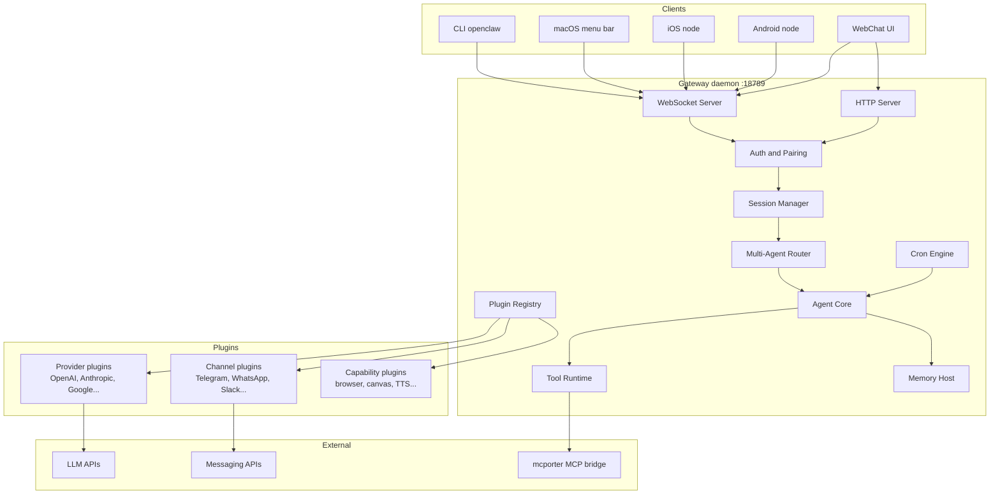
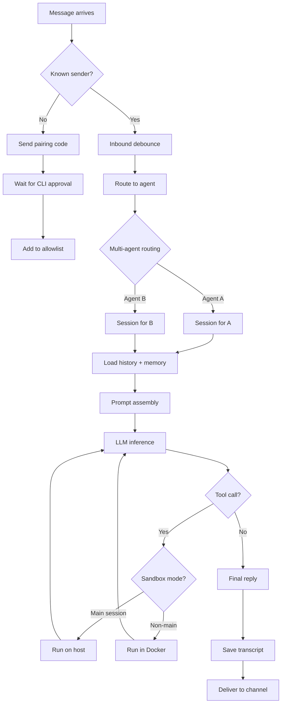
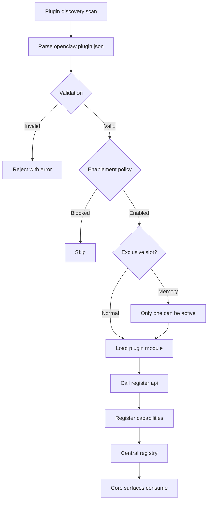
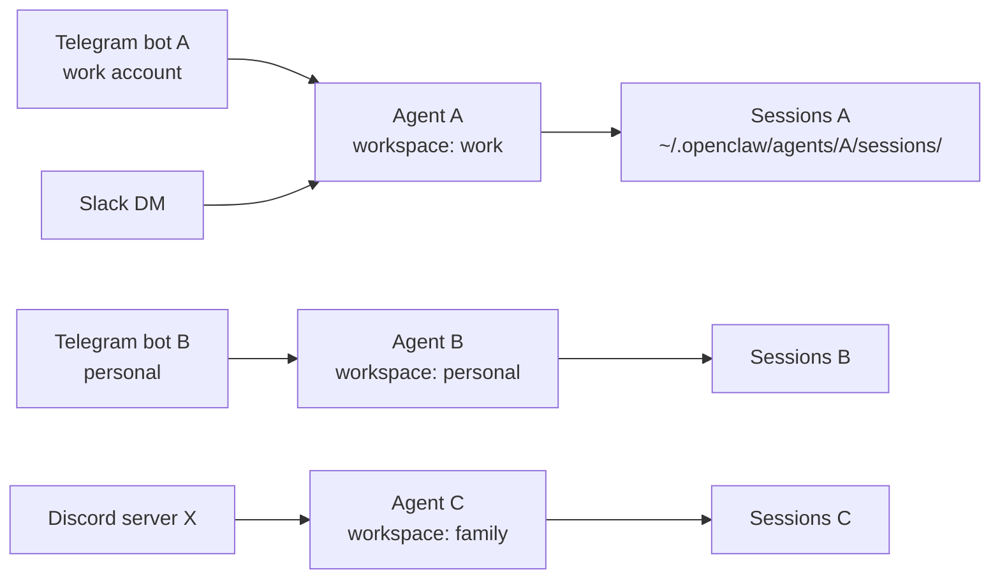
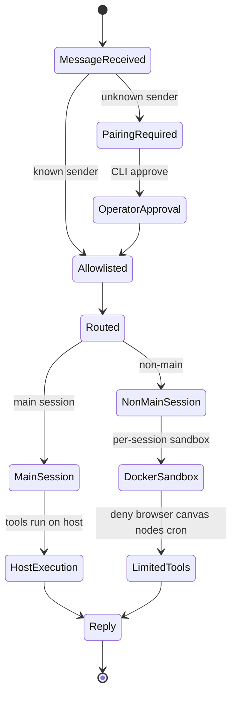

# OpenClaw: Local-First Personal AI Assistant Architecture

Repository: https://github.com/openclaw/openclaw

OpenClaw is an open-source personal AI assistant you run on your own devices. It connects to the messaging channels you already use (WhatsApp, Telegram, Slack, Discord, iMessage, Signal, Matrix, and 20+ more) and routes everything through a single local Gateway that manages sessions, tools, and LLM providers. As of April 2026 it has 360,000+ GitHub stars, 73,500+ forks, and is the most-starred AI assistant project on GitHub[^1].

This article analyzes OpenClaw's source architecture: the Gateway-centric control plane, the manifest-first plugin system, multi-agent routing, session and memory model, and the design decisions that make the project interesting as a reference implementation for a local personal agent.

## What OpenClaw Is

OpenClaw is a single-user, privacy-first assistant. One person runs the Gateway on their own hardware (macOS, Linux, Windows via WSL2) and the assistant answers them on whatever channels they wire up. The Gateway is a local daemon - a Node.js process bound by default to `127.0.0.1:18789` - that keeps persistent connections to messaging providers and routes traffic into an agent loop.

The project originated as Warelay, evolved through Clawdbot and Moltbot, and now ships as OpenClaw. The VISION doc frames it plainly: "OpenClaw is the AI that actually does things. It runs on your devices, in your channels, with your rules"[^2]. Its tagline is "EXFOLIATE! EXFOLIATE!" and the mascot is a lobster.

Core stats from the repo:
 - Created November 24, 2025
 - Language: TypeScript, ESM modules
 - Runtime: Node 24 recommended, Node 22.16+ minimum
 - Package manager: pnpm workspaces, also supports bun
 - Current version: 2026.4.19-beta.2
 - Install: `npm install -g openclaw@latest`
 - License: MIT

Sponsors listed in the README include OpenAI, GitHub, NVIDIA, Vercel, Blacksmith, and Convex.

The supported channel list is long and growing: WhatsApp, Telegram, Slack, Discord, Google Chat, Signal, iMessage, BlueBubbles, IRC, Microsoft Teams, Matrix, Feishu, LINE, Mattermost, Nextcloud Talk, Nostr, Synology Chat, Tlon, Twitch, Zalo, Zalo Personal, WeChat, QQ, and WebChat.

## High-Level Architecture

OpenClaw is organized around a single long-lived Gateway daemon that owns all messaging surfaces and acts as the control plane for everything else. Clients (CLI, macOS menu bar app, iOS/Android nodes, WebChat) and external connections (messaging channels, LLM providers) all plug into the Gateway.



Everything is typed. The WebSocket protocol uses TypeBox schemas that generate JSON Schema, which then generate Swift models for the iOS client. The design invariants from `docs/concepts/architecture.md` state: exactly one Gateway controls a single Baileys (WhatsApp) session per host, the handshake is mandatory (any non-JSON or non-connect first frame is a hard close), and events are not replayed - clients must refresh on gaps[^3].

### Why Gateway-Centric

The Gateway owns the single point of contact with messaging providers. Most of these APIs (WhatsApp via Baileys, Telegram via grammY, iMessage bridges) do not tolerate multiple concurrent connections from the same account. Centralizing them in one daemon avoids duplicate sessions, makes auth state coherent, and gives the agent a single place to do routing decisions.

The Canvas (agent-editable live visual workspace called A2UI) is served from the same HTTP server under `/__openclaw__/canvas/` and `/__openclaw__/a2ui/` on the same port.

## End-to-End Message Flow

Here is what happens when a user sends "What's my calendar today?" to the Telegram bot connected to OpenClaw.


The agent loop document describes five concrete phases: the `agent` RPC validates params, resolves session, persists metadata, and returns `{ runId, acceptedAt }` immediately. Then `agentCommand` runs the agent, `runEmbeddedPiAgent` (the pi-agent-core runtime) serializes runs via per-session and global queues, and `subscribeEmbeddedPiSession` bridges pi-agent-core events to OpenClaw's `agent` stream[^4].

Three event streams flow back to clients during execution:
 - `lifecycle` - start, end, error phases
 - `assistant` - streamed text deltas
 - `tool` - tool start, update, end events

Final replies get shaped before delivery: the silent token `NO_REPLY` is filtered out, messaging tool duplicates are removed, and if no renderable payloads remain but a tool errored, a fallback tool error reply is emitted.

### Inbound Decision Flow

Unknown senders do not reach the agent by default. The pairing flow intercepts them first.



DM pairing is the default on Telegram, WhatsApp, Signal, iMessage, Microsoft Teams, Discord, Google Chat, and Slack. Unknown senders get a short pairing code. The operator runs `openclaw pairing approve <channel> <code>` to add them to the local allowlist. Public inbound requires explicit opt-in via `dmPolicy="open"` and `"*"` in the allowlist.

## Plugin System: Manifest-First Architecture

The plugin system is the most elaborate part of OpenClaw. Channels, LLM providers, speech providers, media generation, web search, memory backends - all of these are plugins, and core code has strict rules against naming them directly.

The plugin architecture has four layers[^5]:

1. Manifest and discovery - scans configured paths, workspace roots, global extension roots, and bundled extensions for `openclaw.plugin.json` files
2. Enablement and validation - core decides enabled, disabled, blocked, or selected for an exclusive slot (like memory)
3. Runtime loading - native plugins load in-process via jiti and register capabilities into a central registry
4. Surface consumption - rest of OpenClaw reads the registry to expose tools, channels, provider setup, hooks, HTTP routes, CLI commands, and services



### Capability Model

Every native plugin registers against one or more capability types. The table from `docs/plugins/architecture.md` lists:

 - Text inference: `api.registerProvider(...)` - openai, anthropic
 - CLI inference backend: `api.registerCliBackend(...)` - openai, anthropic
 - Speech: `api.registerSpeechProvider(...)` - elevenlabs, microsoft
 - Realtime transcription: `api.registerRealtimeTranscriptionProvider(...)` - openai
 - Realtime voice: `api.registerRealtimeVoiceProvider(...)` - openai
 - Media understanding: `api.registerMediaUnderstandingProvider(...)` - openai, google
 - Image generation: `api.registerImageGenerationProvider(...)` - openai, google, fal, minimax
 - Music generation: `api.registerMusicGenerationProvider(...)` - google, minimax
 - Video generation: `api.registerVideoGenerationProvider(...)` - qwen
 - Web fetch: `api.registerWebFetchProvider(...)` - firecrawl
 - Web search: `api.registerWebSearchProvider(...)` - google
 - Channel / messaging: `api.registerChannel(...)` - msteams, matrix

Plugins are classified by shape based on actual registration: `plain-capability` (one type), `hybrid-capability` (multiple - OpenAI registers text, speech, media understanding, and image generation all under one plugin), `hook-only` (only hooks, legacy), or `non-capability` (tools, commands, services, routes but no capability).

### Manifest Example

Here is the Telegram plugin manifest from `extensions/telegram/openclaw.plugin.json`:

```json
{
  "id": "telegram",
  "channels": ["telegram"],
  "channelEnvVars": {
    "telegram": ["TELEGRAM_BOT_TOKEN"]
  },
  "configSchema": {
    "type": "object",
    "additionalProperties": false,
    "properties": {}
  }
}
```

This is deliberately minimal. The manifest tells core what the plugin provides (a channel named `telegram`), what env vars it needs, and what config shape it accepts - all without importing any runtime code. Core can validate configs, show setup hints, and plan activation from metadata alone.

### Core Stays Extension-Agnostic

The AGENTS.md file makes this rule explicit and enforces it in CI[^6]:

 - Extensions cross into core only through `openclaw/plugin-sdk/*`, manifest metadata, and documented runtime helpers
 - Core must not import from `src/**` in extension production code
 - No hardcoded bundled extension/provider/channel/capability id lists in core
 - No ad hoc reads of `plugins.entries.<id>.config` from unrelated core code

A separate CI lane (`check-additional`) runs architecture boundary tests that enforce these invariants. There is a guardrail test (`plugin-activation-boundary.test.ts`) that specifically checks this.

## Agent Loop and Hooks

The agent loop - the "real run" of an agent - turns a message into actions and a final reply. OpenClaw has two hook systems that extensions use to intercept it:

Internal hooks (Gateway hooks) are event-driven scripts:
 - `agent:bootstrap` - runs while building bootstrap files before the system prompt is finalized
 - Command hooks for `/new`, `/reset`, `/stop`, etc.

Plugin hooks run inside the agent loop or gateway pipeline:
 - `before_model_resolve` - runs pre-session to override provider/model before resolution
 - `before_prompt_build` - runs after session load to inject context or system prompt additions
 - `before_agent_start` - legacy compatibility hook (superseded by the two above)
 - `before_agent_reply` - lets a plugin claim the turn and return a synthetic reply or silence it
 - `agent_end` - inspect final message list and run metadata
 - `before_compaction` / `after_compaction` - observe or annotate compaction cycles
 - `before_tool_call` / `after_tool_call` - intercept tool params or results
 - `before_install` - inspect built-in scan findings and optionally block skill or plugin installs
 - `tool_result_persist` - synchronously transform tool results before writing
 - `message_received` / `message_sending` / `message_sent` - inbound and outbound
 - `session_start` / `session_end` - session lifecycle
 - `gateway_start` / `gateway_stop` - gateway lifecycle

Hook decision rules matter. For `before_tool_call`, `{ block: true }` is terminal and stops lower-priority handlers. `{ block: false }` is a no-op and does not clear a prior block. For `message_sending`, `{ cancel: true }` is terminal; `{ cancel: false }` does not clear a prior cancel. This matters for security: a later-loaded "permissive" plugin cannot accidentally undo an earlier plugin's block.

### Prompt Cache Stability

OpenClaw treats prompt-cache stability as correctness and performance critical. When assembling model payloads:

 - Ordering from maps, sets, registries, plugin lists, MCP catalogs, filesystem reads, or network results must be made deterministic before building the request
 - Legacy cleanup, pruning, normalization, and migration logic must preserve recent prompt bytes when possible
 - Truncation or compaction prefers mutating newest or tail content first so the cached prefix stays byte-identical across turns
 - Regression tests are required to prove turn-to-turn prefix stability

This is the kind of detail most assistant frameworks ignore and then pay for in per-turn token cost.

## Multi-Agent Routing

Different channels, accounts, or peers can route to completely isolated agents. Each agent has its own workspace and session store. Per-agent configuration covers model, tools, sandbox settings, and skills.



The routing engine lives in `src/routing/`. Session key derivation combines channel id, account id, and routing context. The core resolves the agent, then loads the appropriate session store. Sub-agent spawning is available via tools: `sessions_list`, `sessions_history`, `sessions_send`, `sessions_spawn`.

This matters because you might not want your personal agent to see your work Slack or your work agent to access your personal calendar. Isolating by agent at the routing layer keeps skills, memory, and tool access separated.

## Session Model

Sessions are conversation contexts. Each session has a unique key derived from channel + account + routing, and its history is stored as JSONL files under `~/.openclaw/agents/<agentId>/sessions/`.

Three session operations matter:
 - Compaction - summarize old context to stay within token limits
 - Reset - start fresh, discarding history
 - Spawn - create a sub-session for a delegated task

Session archive and transcript management lives in `src/gateway/session-archive.*` and `src/gateway/session-transcript-*`. Runs are serialized per session key (session lane) and optionally through a global lane, which prevents tool/session races and keeps history consistent.

## Security Model

Security is a deliberate tradeoff: strong defaults without killing capability. The design assumes the operator is the single user for the `main` session but treats non-main sessions and inbound DMs as potentially untrusted.

Three layers protect the system:

Layer 1 - Network boundary:
 - Gateway binds to `127.0.0.1:18789` by default
 - `ws://` allowed for private LAN; `wss://` required for Tailscale or public endpoints
 - Tailscale Serve or non-loopback trusted-proxy modes satisfy auth from request headers
 - All connects must sign the `connect.challenge` nonce

Layer 2 - Identity and pairing:
 - All WS clients (operators and nodes) include a device identity on connect
 - New device IDs require pairing approval
 - Gateway issues a device token for subsequent connects
 - Signature payload v3 binds platform + device family; metadata changes require repair pairing

Layer 3 - Tool execution:
 - Default: tools run on the host for the `main` session (full access for the single user)
 - Group or channel safety: set `agents.defaults.sandbox.mode: "non-main"` to run non-main sessions inside per-session Docker sandboxes
 - Sandbox defaults: allow `bash`, `process`, `read`, `write`, `edit`, `sessions_list`, `sessions_history`, `sessions_send`, `sessions_spawn`; deny `browser`, `canvas`, `nodes`, `cron`, `discord`, `gateway`



Three Docker images ship in the repo: `Dockerfile.sandbox`, `Dockerfile.sandbox-browser`, `Dockerfile.sandbox-common`. Streaming and partial replies never go to external messaging surfaces - only final replies. This prevents the agent from leaking "thinking" tokens to Telegram or WhatsApp.

## LLM Provider Strategy

OpenClaw supports 40+ LLM providers, visible in the `extensions/` directory:

 - Major: Anthropic, OpenAI, Google, DeepSeek, Mistral, xAI
 - Cloud: Amazon Bedrock, Anthropic Vertex, Microsoft Foundry, Cloudflare AI Gateway
 - Local: Ollama, LM Studio, vLLM, SGLang
 - Specialized: Groq, Fireworks, Together, OpenRouter, Perplexity, Venice, Chutes
 - Regional: Qwen, Qianfan, Moonshot, MiniMax, Kimi Coding, Volcengine, BytePlus, Xiaomi, StepFun
 - Code-specific: GitHub Copilot, Codex (OpenAI), KiloCode, OpenCode

Each provider is its own plugin under `extensions/<name>/` and registers through `api.registerProvider(...)`. Core owns the generic inference loop; provider plugins own provider-specific behavior through typed hooks.

### Auth Profile Rotation

OpenClaw supports multiple auth profiles per provider with automatic rotation:
 - Cooldown tracking with auto-expiry for failed profiles
 - Round-robin ordering with last-good tracking
 - Chutes support for routing to specific model deployments
 - Synthetic auth for providers using plugin-owned authentication
 - SecretRef semantics for credential management

This is what makes failover work without manual intervention when you hit rate limits on one API key.

## MCP Integration via mcporter

Rather than building first-class MCP runtime into core, OpenClaw uses a bridge model via `mcporter` (github.com/steipete/mcporter). The VISION doc states explicitly: "For now, we prefer this bridge model over building first-class MCP runtime into core."

The rationale listed in VISION.md[^2]:
 - Add or change MCP servers without restarting the gateway
 - Keep core tool and context surface lean
 - Reduce MCP churn impact on core stability and security

This is a pattern worth noting. MCP is still evolving, and binding your core to the spec freezes your implementation. A bridge lets MCP evolve independently.

## Memory System

Memory is a special plugin slot - only one memory plugin can be active at a time. Multiple backends ship in extensions:
 - `memory-core` - shared memory infrastructure
 - `memory-lancedb` - vector search using LanceDB
 - `memory-wiki` - structured wiki-style storage
 - `active-memory` - short-term memory
 - `memory-host-sdk` in `src/memory-host-sdk/` - the host-side SDK

The system has a "dreaming" capability - a background process that consolidates and organizes memories. The QMD (Query-Match-Decide) engine handles semantic memory retrieval.

## Companion Apps as Nodes

Mobile and desktop apps connect as "nodes" to the Gateway. They declare `role: node` in the WebSocket connect frame with explicit caps and commands.

Three app tiers exist under `apps/`:

macOS menu bar app:
 - Gateway control and health monitoring
 - Voice Wake + push-to-talk overlay
 - WebChat + debug tools
 - Remote gateway control over SSH

iOS node:
 - Pairs as a node over Gateway WebSocket (device pairing)
 - Voice trigger forwarding
 - Canvas surface

Android node:
 - Continuous voice support

Node commands include `canvas.*`, `camera.*`, `screen.record`, `location.get`. This pattern - treating your phone as a remote tool provider for your local agent - means the agent can ask your phone to take a picture or get your location without the Gateway needing direct phone APIs.

## Canvas and A2UI

The Canvas is an agent-editable live visual workspace served from the same Gateway HTTP server. Two mount points exist:
 - `/__openclaw__/canvas/` - agent-editable HTML/CSS/JS
 - `/__openclaw__/a2ui/` - A2UI host (Agent-to-UI protocol)

This lets the agent render dynamic UI the user can interact with, without needing a separate app. You ask the agent to "show me a calendar for next week" and it generates a Canvas page on the fly.

## Skills Marketplace

Skills are prebuilt capabilities that extend the assistant. 50+ bundled skills ship with the project, including integrations for 1Password, Apple Notes, Bear Notes, Canvas, coding-agent, Discord, GitHub, Notion, Obsidian, Slack, Spotify, Trello, weather, Whisper transcription.

The project publishes skills to ClawHub (clawhub.com) for community sharing. The VISION doc notes: "New skills should be published to ClawHub first, not added to core by default. Core skill additions should be rare and require a strong product or security reason." This is the same "keep core lean" philosophy as MCP via mcporter.

## Build System

The build tooling reflects the scale and the performance concern:

 - TypeScript checks split by architecture boundary: `tsgo:core`, `tsgo:core:test`, `tsgo:extensions`, `tsgo:extensions:test`
 - Uses `tsgo` (the Go-based TypeScript compiler) for fast type checking
 - Oxlint and Oxfmt for linting and formatting (not ESLint/Prettier)
 - Vitest with V8 coverage (70% threshold)
 - pnpm workspaces for monorepo management
 - Pre-commit hooks with `FAST_COMMIT=1` escape hatch
 - Architecture boundary tests enforced in CI (`check-additional` lane)
 - Dynamic import guardrails to prevent circular dependencies

A local-check mode (`OPENCLAW_LOCAL_CHECK=1`) throttles memory use for development machines. The CI gate is split from the local dev gate so architecture policy guards stay out of the fast loop.

## What Makes OpenClaw Interesting

Several design decisions stand out when compared to other assistant frameworks.

### Manifest-First Control Plane

Most plugin systems load plugins to ask them what they can do. OpenClaw reads the manifest first and only loads the plugin when it actually needs to execute something. Discovery, validation, enablement, setup hints, and activation planning are all metadata-driven. The rule "host loads plugins; plugins do not load host internals" keeps the dependency direction clean.

### Gateway as the Only Singleton

One daemon, one WhatsApp session, one control plane. This avoids the "two bots connected to the same account" problem that plagues simpler setups and makes the system's concurrency model explicit.

### Session Lanes and Global Lanes

Runs are serialized per session key and optionally through a global lane. This is a simple but important design: without it, two concurrent messages in the same chat would produce interleaved tool calls and corrupted history.

### Streaming Stays Inside

The agent streams to first-party clients (macOS app, CLI, WebChat) but only sends final replies to external messaging channels. Telegram users do not see tokens stream in. This is both a UX choice (no flickering partial replies in chat) and a security choice (no leaking partial reasoning to third parties).

### Prompt Cache Stability as a Contract

OpenClaw treats prompt prefix stability turn-to-turn as a tested invariant. Most assistant frameworks do not think about this. The cost savings and latency reduction from preserving cache hits are significant at scale, and OpenClaw has regression tests for it.

### Bridge-Over-Builtin for MCP

Using `mcporter` as a bridge instead of building MCP into core is a deliberate bet that the MCP spec will keep churning. It means OpenClaw is not forced to track every spec change, and MCP failures do not take down the Gateway.

### Capability-Typed Plugins

Classifying plugins by what they actually register (plain-capability, hybrid-capability, hook-only, non-capability) lets the project give different compatibility guarantees and surface advisory warnings for older patterns. It also makes `openclaw plugins inspect <id>` useful for debugging.

### Multi-Agent Isolation

Routing different channels to different agents with different workspaces is a clean way to separate concerns. Your work Telegram and personal Signal can be the same assistant or two different ones, and the isolation is at the routing layer, not bolted on to user code.

### Node Protocol for Mobile

Treating mobile apps as "nodes" that expose commands (camera, screen record, location) to the agent is an elegant inversion. The agent does not need phone APIs; it asks the phone to do things through a typed WebSocket protocol.

## Technologies

 - Language: TypeScript (ESM)
 - Runtime: Node 24 (recommended) or Node 22.16+, Bun supported for development
 - Package manager: pnpm workspaces, Bun compatible
 - Type checker: tsgo (Go-based TS compiler)
 - Linter and formatter: Oxlint and Oxfmt
 - Test runner: Vitest with V8 coverage
 - Protocol: WebSocket (TypeBox schemas generating JSON Schema and Swift models)
 - Sandboxing: Docker (three sandbox Dockerfiles)
 - Service management: launchd (macOS), systemd (Linux)
 - Remote access: Tailscale or SSH tunnel
 - Companion apps: Swift (macOS/iOS), native Android
 - MCP: via mcporter bridge
 - Memory backends: LanceDB, wiki-style, custom via SDK

## Related Projects

 - `nanoclaw` (github.com/qwibitai/nanoclaw) - 27,500+ stars - container-based lightweight alternative built on Anthropic's Agents SDK
 - Chinese guide (github.com/KimYx0207/Claude-Code-x-OpenClaw-Guide-Zh) - 3,400+ stars
 - DeepWiki analysis: https://deepwiki.com/openclaw/openclaw
 - ClawHub skills marketplace: https://clawhub.com

## Sources

[^1]: User instruction: "research OpenClaw - analyze source code and architecture"
[^2]: VISION.md - https://raw.githubusercontent.com/openclaw/openclaw/main/VISION.md
[^3]: Gateway architecture docs - https://raw.githubusercontent.com/openclaw/openclaw/main/docs/concepts/architecture.md
[^4]: Agent loop docs - https://raw.githubusercontent.com/openclaw/openclaw/main/docs/concepts/agent-loop.md
[^5]: Plugin architecture - https://raw.githubusercontent.com/openclaw/openclaw/main/docs/plugins/architecture.md
[^6]: AGENTS.md repo guidelines - https://raw.githubusercontent.com/openclaw/openclaw/main/AGENTS.md
[^7]: Prior research notes - /home/alexey/git/telegram-writing-assistant/research/openclaw-research.md
[^8]: Repository - https://github.com/openclaw/openclaw
