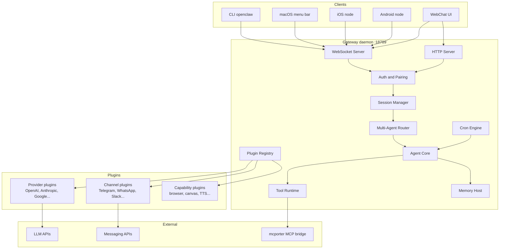
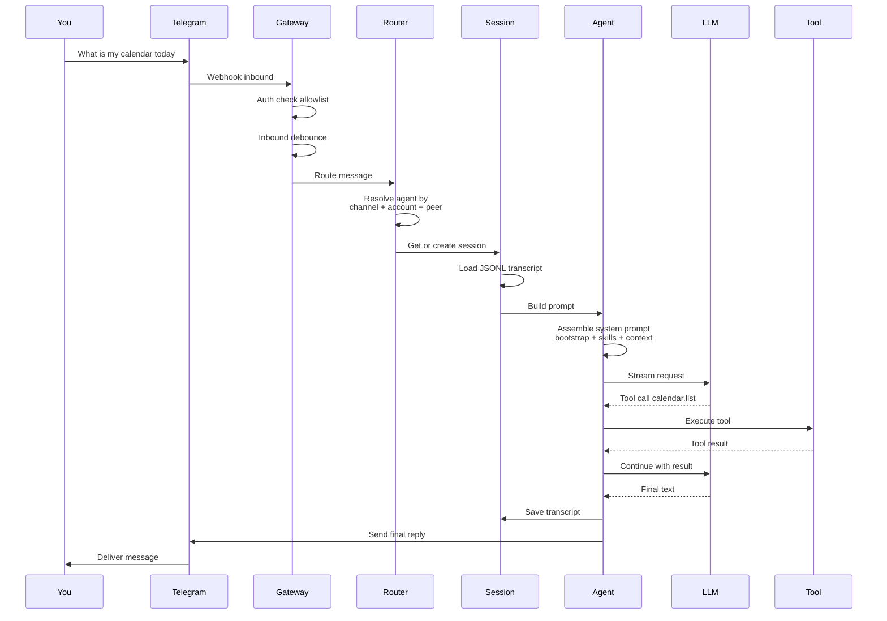
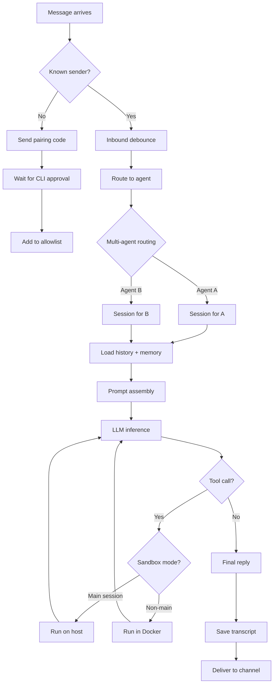
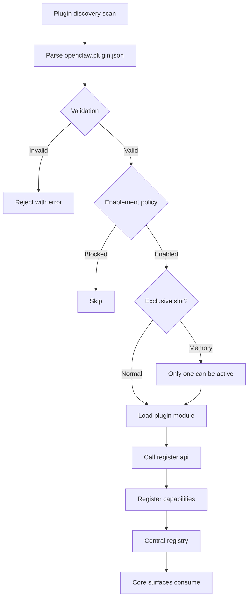
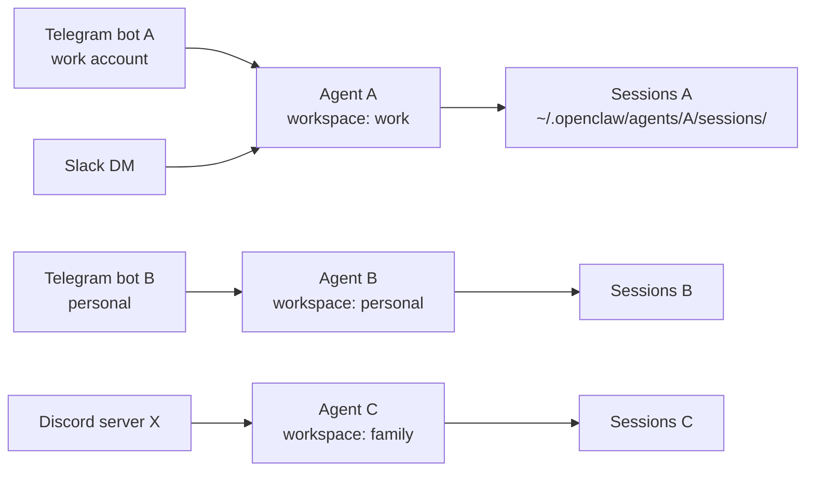
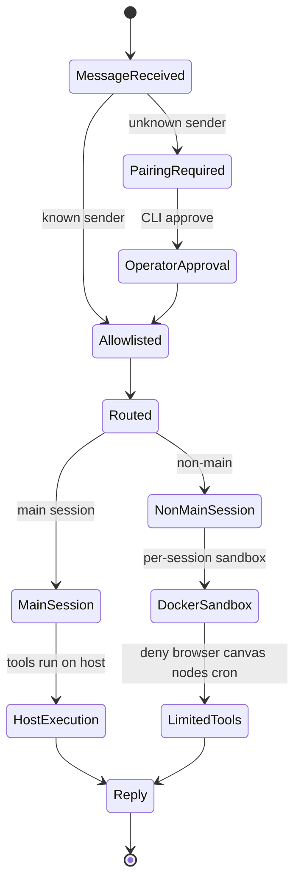

# OpenClaw: Local-First Personal AI Assistant Architecture

[Repository](https://github.com/openclaw/openclaw)

OpenClaw is an open-source personal AI assistant you run on your own devices. It connects to the messaging channels you already use (WhatsApp, Telegram, Slack, Discord, iMessage, Signal, Matrix, and 20+ more) and routes everything through a single local Gateway that manages sessions, tools, and LLM providers. As of April 2026 it has 360,000+ GitHub stars, 73,500+ forks, and is the most-starred AI assistant project on GitHub[^1].

This article walks through OpenClaw's source architecture so you can decide whether the design is worth borrowing from for your own assistant. The focus is on the Gateway-centric control plane, the manifest-first plugin system, multi-agent routing, the session and memory model, and the design choices that distinguish it as a reference implementation of a local personal agent.

## How to read this article

OpenClaw has many moving parts, so here is the map before we walk through them:

- What OpenClaw Is and High-Level Architecture - what the project gives you, and the one daemon that ties it all together.
- End-to-End Message Flow and Inbound Decision Flow - what happens when you send a message, and how unknown senders are kept out by default.
- Plugin System and Agent Loop and Hooks - how every channel, model, and capability plugs into the same core, and the hook points where extensions intercept the loop.
- Multi-Agent Routing, Session Model, and Security Model - how the same install can serve work and personal contexts without crossing wires, and how dangerous tools are sandboxed.
- LLM Provider Strategy, MCP Integration, and Memory System - the parts you swap when you want to change the model, plug in third-party tools, or pick how the agent remembers things.
- Companion Apps, Canvas, Skills Marketplace, and Build System - the surfaces that exist beyond the Gateway, plus how the project itself is built.
- What Makes OpenClaw Interesting - the design decisions worth copying, in one place at the end.

Here is how the parts relate. At the center sits one long-running Gateway daemon. Around it sit four groups of pluggable parts that connect only through that Gateway: messaging channels (how users reach the assistant), LLM providers (which model does the thinking), capabilities (what the agent can do), and companion clients (your CLI, menu bar app, and phone). If you only want to decide whether OpenClaw fits your own project, jump straight to "What Makes OpenClaw Interesting" at the end.

## What OpenClaw Is

OpenClaw is a single-user, privacy-first assistant. You run the Gateway on your own hardware (macOS, Linux, Windows via WSL2) and the assistant answers you on whatever channels you wire up. The Gateway is a local daemon - a Node.js process bound by default to `127.0.0.1:18789` - that keeps persistent connections to messaging providers and routes traffic into an agent loop.

The project originated as Warelay, evolved through Clawdbot and Moltbot, and now ships as OpenClaw. The VISION doc frames it plainly: "OpenClaw is the AI that does things. It runs on your devices, in your channels, with your rules"[^2]. Its tagline is "EXFOLIATE! EXFOLIATE!" and the mascot is a lobster.

Core stats from the repo:
 - Created November 24, 2025
 - Language: TypeScript, ESM modules
 - Runtime: Node 24 recommended, Node 22.16+ minimum
 - Package manager: pnpm workspaces, also supports bun
 - Current version: 2026.4.19-beta.2
 - Install: `npm install -g openclaw@latest`
 - License: MIT

Sponsors listed in the README include OpenAI, GitHub, NVIDIA, Vercel, Blacksmith, and Convex.

The supported channel list is long and growing: WhatsApp, Telegram, Slack, Discord, Google Chat, Signal, iMessage, BlueBubbles, IRC, Microsoft Teams, Matrix, Feishu, LINE, Mattermost, Nextcloud Talk, Nostr, Synology Chat, Tlon, Twitch, Zalo, Zalo Personal, WeChat, QQ, and WebChat.

With the basics in place, the next question is how all those channels, providers, and clients connect to one another. The answer is: they don't, directly. They all go through the Gateway.

## High-Level Architecture

OpenClaw is organized around a single long-lived Gateway daemon that owns all messaging surfaces and acts as the control plane for everything else. Clients (CLI, macOS menu bar app, iOS/Android nodes, WebChat) and external connections (messaging channels, LLM providers) all plug into the Gateway. For you that means there is exactly one process you start to run the assistant, and exactly one place to look when something is wrong.



Everything is typed. The WebSocket protocol uses TypeBox - a TypeScript library that defines a schema once and produces both runtime validators and JSON Schema documents - and those JSON Schema documents then generate the Swift models the iOS client uses. In practice, that means the contract between the Gateway, your iOS app, and any third-party client is described in one place, and a change to the protocol cannot silently break a client. The design invariants from `docs/concepts/architecture.md` state: exactly one Gateway controls a single Baileys (a community-maintained WhatsApp Web client) session per host, the handshake is mandatory (any non-JSON or non-connect first frame is a hard close), and events are not replayed - clients must refresh on gaps[^3].

## Why Gateway-Centric

The Gateway owns the single point of contact with messaging providers. Most of these APIs (WhatsApp via Baileys, Telegram via grammY, iMessage bridges) do not tolerate multiple concurrent connections from the same account. Centralizing them in one daemon avoids duplicate sessions, keeps auth state coherent, and gives the agent a single place to do routing decisions. For you that means you don't have to worry about "did I leave another instance running on my old laptop" - the daemon owns the connection, and only one daemon can.

The Canvas (an agent-editable live visual workspace, also called A2UI - Agent-to-UI - because the agent generates and updates the page itself) is served from the same HTTP server under `/openclaw/canvas/` and `/openclaw/a2ui/` on the same port. You will see the practical use of this in the Canvas section later.

That covers what the daemon is. The next thing to look at is what happens during one turn of conversation, end to end.

## End-to-End Message Flow

Here is what happens when you send "What's my calendar today?" to the Telegram bot connected to OpenClaw.



The agent loop document describes five concrete phases: the `agent` RPC validates params, resolves session, persists metadata, and returns `{ runId, acceptedAt }` immediately. Then `agentCommand` runs the agent, `runEmbeddedPiAgent` (the pi-agent-core runtime, a smaller library that owns the model loop separately from messaging) serializes runs via per-session and global queues, and `subscribeEmbeddedPiSession` bridges pi-agent-core events to OpenClaw's `agent` stream[^4]. The point of the early return is that your client gets a run ID right away and can subscribe to events as the agent works, rather than waiting on a single long HTTP response.

Three event streams flow back to clients during execution:
 - `lifecycle` - start, end, error phases
 - `assistant` - streamed text deltas
 - `tool` - tool start, update, end events

Final replies get shaped before delivery: the silent token `NO_REPLY` is filtered out, messaging tool duplicates are removed, and if no renderable payloads remain but a tool errored, a fallback tool error reply is emitted. For you that means a quiet "I don't have anything to send" never accidentally becomes spam, and you do still see something useful when a tool fails partway through.

The flow above assumes you are already a known sender. The next subsection covers what happens for somebody the Gateway has never seen before.

## Inbound Decision Flow

Unknown senders do not reach the agent by default. The pairing flow intercepts them first.



DM pairing is the default on Telegram, WhatsApp, Signal, iMessage, Microsoft Teams, Discord, Google Chat, and Slack. Unknown senders get a short pairing code. You run `openclaw pairing approve <channel> <code>` from your CLI to add them to the local allowlist. Public inbound requires explicit opt-in via `dmPolicy="open"` and `"*"` in the allowlist - so the assistant does not accidentally answer strangers unless you have decided that is what you want.

The flow shows what happens after a message is admitted. Most of what makes that flow possible - which channels exist, which models are reachable, which tools the agent can call - is provided by plugins. That is the next layer to look at.

## Plugin System: Manifest-First Architecture

The plugin system is the most elaborate part of OpenClaw. Channels, LLM providers, speech providers, media generation, web search, memory backends - all of these are plugins, and core code has strict rules against naming them directly. Manifest-first means each plugin ships a small JSON file (`openclaw.plugin.json`) that declares what the plugin provides. Core code reads those manifests at startup, before loading any plugin code at all. For you, that gives two things: setup hints that work even for plugins you have not yet downloaded, and the ability to disable a plugin without it ever running.

The plugin architecture has four layers[^5]:

1. Manifest and discovery - scans configured paths, workspace roots, global extension roots, and bundled extensions for `openclaw.plugin.json` files
2. Enablement and validation - core decides whether each plugin is enabled, disabled, blocked, or selected for an exclusive slot (like memory)
3. Runtime loading - native plugins load in-process via `jiti` (a runtime TypeScript loader, so plugins ship as TS without a build step) and register capabilities into a central registry
4. Surface consumption - the rest of OpenClaw reads the registry to expose tools, channels, provider setup, hooks, HTTP routes, CLI commands, and services



## Capability Model

A capability is the contract a plugin offers to core: "I can do X, here is how to call me." Every native plugin registers against one or more capability types. The table from `docs/plugins/architecture.md` lists:

 - Text inference: `api.registerProvider(...)` - openai, anthropic
 - CLI inference backend: `api.registerCliBackend(...)` - openai, anthropic
 - Speech: `api.registerSpeechProvider(...)` - elevenlabs, microsoft
 - Realtime transcription: `api.registerRealtimeTranscriptionProvider(...)` - openai
 - Realtime voice: `api.registerRealtimeVoiceProvider(...)` - openai
 - Media understanding: `api.registerMediaUnderstandingProvider(...)` - openai, google
 - Image generation: `api.registerImageGenerationProvider(...)` - openai, google, fal, minimax
 - Music generation: `api.registerMusicGenerationProvider(...)` - google, minimax
 - Video generation: `api.registerVideoGenerationProvider(...)` - qwen
 - Web fetch: `api.registerWebFetchProvider(...)` - firecrawl
 - Web search: `api.registerWebSearchProvider(...)` - google
 - Channel / messaging: `api.registerChannel(...)` - msteams, matrix

Plugins are classified by shape based on what they register: `plain-capability` (one type), `hybrid-capability` (multiple - the OpenAI plugin registers text, speech, media understanding, and image generation all in one), `hook-only` (only hooks, legacy), or `non-capability` (tools, commands, services, routes but no capability). The reason the project bothers tagging shapes at all is that `openclaw plugins inspect <id>` then tells you exactly what each plugin contributes - useful when you are debugging why something isn't showing up in the assistant.

## Manifest Example

Here is the Telegram plugin manifest from `extensions/telegram/openclaw.plugin.json`:

```json
{
  "id": "telegram",
  "channels": ["telegram"],
  "channelEnvVars": {
    "telegram": ["TELEGRAM_BOT_TOKEN"]
  },
  "configSchema": {
    "type": "object",
    "additionalProperties": false,
    "properties": {}
  }
}
```

This is deliberately minimal. The manifest tells core what the plugin provides (a channel named `telegram`), what env vars it needs, and what config shape it accepts - all without importing any runtime code. Core can validate configs, show setup hints, and plan activation from metadata alone. For you that means the assistant can tell you "you need to set `TELEGRAM_BOT_TOKEN` first" before it ever loads the plugin's TypeScript.

## Core Stays Extension-Agnostic

The AGENTS.md file makes this rule explicit and enforces it in CI[^6]:

 - Extensions cross into core only through `openclaw/plugin-sdk/*`, manifest metadata, and documented runtime helpers
 - Core must not import from `src/**` in extension production code
 - No hardcoded bundled extension/provider/channel/capability id lists in core
 - No ad hoc reads of `plugins.entries.<id>.config` from unrelated core code

A separate CI lane (`check-additional`) runs architecture boundary tests that enforce these invariants. There is a guardrail test (`plugin-activation-boundary.test.ts`) that specifically checks this. The practical payoff is that a third-party plugin lives or dies on its own - removing or breaking one cannot accidentally take down the rest of the assistant.

The plugin system is the input side: it determines what is plugged in. The agent loop is the part that uses those plugins, turn by turn, and the hook system is how plugins reach into that loop.

## Agent Loop and Hooks

The agent loop - the "real run" of an agent - turns a message into actions and a final reply. OpenClaw has two hook systems that extensions use to intercept it. Hooks are functions a plugin registers against named events. When the event fires (a tool is about to run, the system prompt is about to be built, a message is about to be sent), every registered hook gets a chance to inspect or change what is happening. For you, hooks are the seam that lets you inject custom behavior - safety policies, audit logging, prompt overrides - without forking the core code.

Internal hooks (Gateway hooks) are event-driven scripts:
 - `agent:bootstrap` - runs while building bootstrap files before the system prompt is finalized
 - Command hooks for `/new`, `/reset`, `/stop`, etc.

Plugin hooks run inside the agent loop or gateway pipeline:
 - `before_model_resolve` - runs pre-session to override provider/model before resolution
 - `before_prompt_build` - runs after session load to inject context or system prompt additions
 - `before_agent_start` - legacy compatibility hook (superseded by the two above)
 - `before_agent_reply` - lets a plugin claim the turn and return a synthetic reply or silence it
 - `agent_end` - inspect final message list and run metadata
 - `before_compaction` / `after_compaction` - observe or annotate compaction cycles
 - `before_tool_call` / `after_tool_call` - intercept tool params or results
 - `before_install` - inspect built-in scan findings and optionally block skill or plugin installs
 - `tool_result_persist` - synchronously transform tool results before writing
 - `message_received` / `message_sending` / `message_sent` - inbound and outbound
 - `session_start` / `session_end` - session lifecycle
 - `gateway_start` / `gateway_stop` - gateway lifecycle

Hook decision rules matter. For `before_tool_call`, `{ block: true }` is terminal and stops lower-priority handlers. `{ block: false }` is a no-op and does not clear a prior block. For `message_sending`, `{ cancel: true }` is terminal; `{ cancel: false }` does not clear a prior cancel. This matters for security: a later-loaded "permissive" plugin cannot accidentally undo an earlier plugin's block. For you that means once you install a safety plugin that blocks something, no other plugin can quietly turn that block off.

## Prompt Cache Stability

The prompt prefix cache is a feature most LLM providers use where identical prompt prefixes reuse previous computation and get billed at a discount. If turn 2 starts with the exact same text as turn 1, the provider charges you less and responds faster. OpenClaw treats prompt-cache stability as correctness and performance critical. When assembling model payloads:

 - Ordering from maps, sets, registries, plugin lists, MCP catalogs, filesystem reads, or network results must be made deterministic before building the request
 - Legacy cleanup, pruning, normalization, and migration logic must preserve recent prompt bytes when possible
 - Truncation or compaction prefers mutating newest or tail content first so the cached prefix stays byte-identical across turns
 - Regression tests are required to prove turn-to-turn prefix stability

This is the kind of detail most assistant frameworks ignore and then pay for in per-turn token cost. For you that translates directly into a smaller bill and faster replies on long sessions.

So far the loop looks like a single agent. The next layer is what lets one OpenClaw install host several distinct agents at once.

## Multi-Agent Routing

Different channels, accounts, or peers can route to completely isolated agents. Each agent has its own workspace and session store. Per-agent configuration covers model, tools, sandbox settings, and skills.



The routing engine lives in `src/routing/`. The session key combines channel id, account id, and routing context, so two messages from the same Telegram account in the same chat go to the same session, while a message from a different chat opens a new one. The core resolves the agent, then loads the appropriate session store. Sub-agent spawning is available via tools: `sessions_list`, `sessions_history`, `sessions_send`, `sessions_spawn` - useful when you want the main agent to hand a scoped subtask off to a child it can supervise.

This matters because you might not want your personal agent to see your work Slack, or your work agent to access your personal calendar. Isolating by agent at the routing layer keeps skills, memory, and tool access separated, so a leak between contexts requires misconfiguring two layers, not just one.

Routing decides which agent answers. The session model is what each agent remembers turn to turn.

## Session Model

Sessions are conversation contexts. Each session has a unique key derived from channel + account + routing, and its history is stored as JSONL files (one JSON object per line, append-only) under `~/.openclaw/agents/<agentId>/sessions/`. The append-only file format means you can `tail` a transcript to watch a conversation in real time, and you can recover from a crash without database tooling.

Three session operations matter:
 - Compaction - summarize old context so the conversation stays within the model's token limit
 - Reset - start fresh, discarding history
 - Spawn - create a sub-session for a delegated task

Session archive and transcript management lives in `src/gateway/session-archive.` and `src/gateway/session-transcript-`. Runs are serialized per session key (session lane) and optionally through a global lane. A lane here is just a queue: if two messages arrive in the same chat at once, they run one after the other instead of in parallel, which prevents interleaved tool calls and corrupted history. For you that means you can fire off two follow-ups quickly without the agent answering them in a tangled order.

Sessions are about what the agent remembers. The security model is about what the agent is allowed to do.

## Security Model

Security is a deliberate tradeoff: strong defaults without killing capability. The design assumes you are the single user for the `main` session but treats non-main sessions and inbound DMs as potentially untrusted.

Three layers protect the system:

Layer 1 - Network boundary:
 - Gateway binds to `127.0.0.1:18789` by default - so out of the box it is unreachable from anywhere except your own machine
 - `ws://` allowed for private LAN; `wss://` (encrypted WebSocket) required for Tailscale (a private VPN that gives your devices stable addresses) or public endpoints
 - Tailscale Serve or non-loopback trusted-proxy modes satisfy auth from request headers
 - All connects must sign the `connect.challenge` nonce, so a passive observer cannot replay an old handshake

Layer 2 - Identity and pairing:
 - All WS clients (operators and nodes) include a device identity on connect
 - New device IDs require pairing approval
 - Gateway issues a device token for subsequent connects
 - Signature payload v3 binds platform + device family. Metadata changes require repair pairing

Layer 3 - Tool execution:
 - Default: tools run on the host for the `main` session (full access for the single user)
 - Group or channel safety: set `agents.defaults.sandbox.mode: "non-main"` to run non-main sessions inside per-session Docker sandboxes
 - Sandbox defaults: allow `bash`, `process`, `read`, `write`, `edit`, `sessions_list`, `sessions_history`, `sessions_send`, `sessions_spawn`. Deny `browser`, `canvas`, `nodes`, `cron`, `discord`, `gateway`



Three Docker images ship in the repo: `Dockerfile.sandbox`, `Dockerfile.sandbox-browser`, `Dockerfile.sandbox-common`. Streaming and partial replies never go to external messaging surfaces - only final replies. This prevents the agent from leaking "thinking" tokens to Telegram or WhatsApp, which keeps the conversation legible (no flickering partial replies in your chat) and keeps mid-reasoning content from being sent to a third party before review.

Network, identity, and tool sandboxing cover the perimeter. The next four sections cover the parts you swap to change the assistant's behavior: the LLM provider, the MCP bridge, and the memory backend.

## LLM Provider Strategy

OpenClaw supports 40+ LLM providers, visible in the `extensions/` directory:

 - Major: Anthropic, OpenAI, Google, DeepSeek, Mistral, xAI
 - Cloud: Amazon Bedrock, Anthropic Vertex, Microsoft Foundry, Cloudflare AI Gateway
 - Local: Ollama, LM Studio, vLLM, SGLang
 - Specialized: Groq, Fireworks, Together, OpenRouter, Perplexity, Venice, Chutes
 - Regional: Qwen, Qianfan, Moonshot, MiniMax, Kimi Coding, Volcengine, BytePlus, Xiaomi, StepFun
 - Code-specific: GitHub Copilot, Codex (OpenAI), KiloCode, OpenCode

Each provider is its own plugin under `extensions/<name>/` and registers through `api.registerProvider(...)`. Core owns the generic inference loop. Provider plugins own provider-specific behavior through typed hooks. For you that means trying a new model is a config change, not a code change.

## Auth Profile Rotation

OpenClaw supports multiple auth profiles per provider with automatic rotation:
 - Cooldown tracking with auto-expiry for failed profiles
 - Round-robin ordering with last-good tracking
 - Chutes support for routing to specific model deployments
 - Synthetic auth for providers using plugin-owned authentication
 - SecretRef semantics for credential management

This is what makes failover work without you having to step in when you hit rate limits on one API key. You list a few keys, pick a strategy, and the Gateway handles which one each request uses.

## MCP Integration via mcporter

MCP, the Model Context Protocol, is an open standard for letting external tool servers expose actions and data to an LLM agent. Rather than building first-class MCP runtime into core, OpenClaw uses a bridge model via `mcporter` (github.com/steipete/mcporter). The VISION doc states explicitly: "For now, we prefer this bridge model over building first-class MCP runtime into core."

The rationale listed in VISION.md[^2]:
 - Add or change MCP servers without restarting the gateway
 - Keep the core tool and context surface lean
 - Reduce MCP churn impact on core stability and security

This is a pattern worth noting. MCP is still evolving, and binding your core to the spec freezes your implementation. A bridge lets MCP evolve independently. For you that means you can wire in a new MCP server today without waiting for an OpenClaw release, and a future MCP spec change will not require a Gateway upgrade.

## Memory System

Memory is a special plugin slot - only one memory plugin can be active at a time, because two competing stores would give the agent inconsistent recall. Multiple backends ship in extensions:
 - `memory-core` - shared memory infrastructure
 - `memory-lancedb` - vector search using LanceDB (a file-backed vector database, so semantic search runs locally without a server)
 - `memory-wiki` - structured wiki-style storage
 - `active-memory` - short-term memory
 - `memory-host-sdk` in `src/memory-host-sdk/` - the host-side SDK

The system has a "dreaming" capability - a background process that consolidates and organizes memories - and a QMD (Query-Match-Decide) engine that handles semantic memory retrieval. In practice, that means the assistant can clean up its own notes overnight and recall things by meaning, not just by keyword, when you ask it something later.

The Gateway, plugins, and memory cover the server side. The next group of pieces is the client side - the apps you look at.

## Companion Apps as Nodes

Mobile and desktop apps connect as "nodes" to the Gateway. They declare `role: node` in the WebSocket connect frame with explicit caps and commands. A node is, in this project's terms, a client that not only displays the assistant but also offers tools the assistant can use - your camera, your screen, your location.

Three app tiers exist under `apps/`:

macOS menu bar app:
 - Gateway control and health monitoring
 - Voice Wake + push-to-talk overlay
 - WebChat + debug tools
 - Remote gateway control over SSH

iOS node:
 - Pairs as a node over Gateway WebSocket (device pairing)
 - Voice trigger forwarding
 - Canvas surface

Android node:
 - Continuous voice support

Node commands include `canvas.`, `camera.`, `screen.record`, `location.get`. Treating your phone as a remote tool provider for your local agent means the Gateway never needs direct phone APIs - it sends a typed command over the WebSocket, and the phone runs it locally. For you, that is what makes "take a photo" or "get my current location" possible from any chat surface, without a separate mobile integration per channel.

## Canvas and A2UI

The Canvas is an agent-editable live visual workspace served from the same Gateway HTTP server. Two mount points exist:
 - `/openclaw/canvas/` - agent-editable HTML/CSS/JS
 - `/openclaw/a2ui/` - A2UI host (Agent-to-UI protocol)

This lets the agent render a dynamic UI you can interact with, without needing a separate app. You ask the agent to "show me a calendar for next week" and it generates a Canvas page on the fly. The page lives at a local URL the assistant tells you about, so you open it in any browser on the same network.

## Skills Marketplace

Skills are prebuilt capabilities that extend the assistant. 50+ bundled skills ship with the project, including integrations for 1Password, Apple Notes, Bear Notes, Canvas, coding-agent, Discord, GitHub, Notion, Obsidian, Slack, Spotify, Trello, weather, and Whisper transcription. You inherit these on install, so the assistant already knows how to act on your existing accounts on day one.

The project publishes skills to ClawHub (clawhub.com) for community sharing. The VISION doc notes: "New skills should be published to ClawHub first, not added to core by default. Core skill additions should be rare and require a strong product or security reason." This is the same "keep core lean" philosophy as MCP via mcporter - and for you it means trying a new skill is a download, not a Gateway upgrade.

## Build System

The build tooling reflects the scale of the project and the performance concern that comes with it:

 - TypeScript checks split by architecture boundary: `tsgo:core`, `tsgo:core:test`, `tsgo:extensions`, `tsgo:extensions:test`
 - Uses `tsgo` (the Go-based TypeScript compiler) for fast type checking
 - Oxlint and Oxfmt for linting and formatting (Rust-based replacements for ESLint and Prettier, picked for speed)
 - Vitest with V8 coverage (70% threshold)
 - pnpm workspaces for monorepo management
 - Pre-commit hooks with a `FAST_COMMIT=1` escape hatch
 - Architecture boundary tests enforced in CI (`check-additional` lane)
 - Dynamic import guardrails to prevent circular dependencies

A local-check mode (`OPENCLAW_LOCAL_CHECK=1`) throttles memory use for development machines. The CI gate is split from the local dev gate so architecture policy guards stay out of the fast loop. If you ever contribute, that is what keeps your inner-loop edits fast while CI still enforces the deeper invariants.

That covers the system end to end. The closing section gathers the design choices worth taking away.

## What Makes OpenClaw Interesting

Several design decisions stand out when compared to other assistant frameworks.

## Manifest-First Control Plane

Most plugin systems load plugins to ask them what they can do. OpenClaw reads the manifest first and only loads the plugin when it needs to execute something. Discovery, validation, enablement, setup hints, and activation planning are all metadata-driven. The rule "host loads plugins. Plugins do not load host internals" keeps the dependency direction clean.

## Gateway as the Only Singleton

One daemon, one WhatsApp session, one control plane. This avoids the "two bots connected to the same account" problem that plagues simpler setups and makes the system's concurrency model explicit.

## Session Lanes and Global Lanes

Runs are serialized per session key and optionally through a global lane. This is a simple but important design: without it, two concurrent messages in the same chat would produce interleaved tool calls and corrupted history.

## Streaming Stays Inside

The agent streams to first-party clients (macOS app, CLI, WebChat) but only sends final replies to external messaging channels. Telegram users do not see tokens stream in. This is both a UX choice (no flickering partial replies in chat) and a security choice (no leaking partial reasoning to third parties).

## Prompt Cache Stability as a Contract

OpenClaw treats prompt prefix stability turn-to-turn as a tested invariant. Most assistant frameworks do not think about this. The cost savings and latency reduction from preserving cache hits are significant at scale, and OpenClaw has regression tests for it.

## Bridge-Over-Builtin for MCP

Using `mcporter` as a bridge instead of building MCP into core is a deliberate bet that the MCP spec will keep churning. It means OpenClaw is not forced to track every spec change, and MCP failures do not take down the Gateway.

## Capability-Typed Plugins

Classifying plugins by what they register (plain-capability, hybrid-capability, hook-only, non-capability) lets the project give different compatibility guarantees and surface advisory warnings for older patterns. It also makes `openclaw plugins inspect <id>` useful for debugging.

## Multi-Agent Isolation

Routing different channels to different agents with different workspaces is a clean way to separate concerns. Your work Telegram and personal Signal can be the same assistant or two different ones, and the isolation is at the routing layer, not bolted on to user code.

## Node Protocol for Mobile

Treating mobile apps as "nodes" that expose commands (camera, screen record, location) to the agent is an elegant inversion. The Gateway never calls phone APIs directly. Instead it sends a typed WebSocket command and the phone executes it on-device. For you that means new mobile capabilities arrive as app updates, not as Gateway changes.

## Technologies

 - Language: TypeScript (ESM)
 - Runtime: Node 24 (recommended) or Node 22.16+, Bun supported for development
 - Package manager: pnpm workspaces, Bun compatible
 - Type checker: tsgo (Go-based TS compiler)
 - Linter and formatter: Oxlint and Oxfmt
 - Test runner: Vitest with V8 coverage
 - Protocol: WebSocket (TypeBox schemas generating JSON Schema and Swift models)
 - Sandboxing: Docker (three sandbox Dockerfiles)
 - Service management: launchd (macOS), systemd (Linux)
 - Remote access: Tailscale or SSH tunnel
 - Companion apps: Swift (macOS/iOS), native Android
 - MCP: via mcporter bridge
 - Memory backends: LanceDB, wiki-style, custom via SDK

## Related Projects

 - `nanoclaw` (github.com/qwibitai/nanoclaw) - 27,500+ stars - container-based lightweight alternative built on Anthropic's Agents SDK
 - Chinese guide (github.com/KimYx0207/Claude-Code-x-OpenClaw-Guide-Zh) - 3,400+ stars
 - [DeepWiki analysis](https://deepwiki.com/openclaw/openclaw)
 - [ClawHub skills marketplace](https://clawhub.com)

## Sources

[^1]: User instruction: "research OpenClaw - analyze source code and architecture"
[^2]: VISION.md - https://raw.githubusercontent.com/openclaw/openclaw/main/VISION.md
[^3]: Gateway architecture docs - https://raw.githubusercontent.com/openclaw/openclaw/main/docs/concepts/architecture.md
[^4]: Agent loop docs - https://raw.githubusercontent.com/openclaw/openclaw/main/docs/concepts/agent-loop.md
[^5]: Plugin architecture - https://raw.githubusercontent.com/openclaw/openclaw/main/docs/plugins/architecture.md
[^6]: AGENTS.md repo guidelines - https://raw.githubusercontent.com/openclaw/openclaw/main/AGENTS.md
[^7]: Prior research notes - /home/alexey/git/telegram-writing-assistant/research/openclaw-research.md
[^8]: Repository - https://github.com/openclaw/openclaw
[^9]: Valeria Kuka feedback on draft (2026-04-20): [msg3491](../../inbox/used/feedback/20260420_104949_valeriia_kuka_msg3491_transcript.txt), [msg3493](../../inbox/used/feedback/20260420_105225_valeriia_kuka_msg3493_transcript.txt), [msg3495](../../inbox/used/feedback/20260420_105527_valeriia_kuka_msg3495_transcript.txt), [msg3497](../../inbox/used/feedback/20260420_110113_valeriia_kuka_msg3497_transcript.txt)
[^10]: Alexey's relay of Valeria feedback (2026-04-20): [msg3499](../../inbox/used/feedback/20260420_111909_AlexeyDTC_msg3499_transcript.txt), [msg3500](../../inbox/used/feedback/20260420_111909_AlexeyDTC_msg3500_transcript.txt), [msg3503](../../inbox/used/feedback/20260420_111955_AlexeyDTC_msg3503_transcript.txt)
