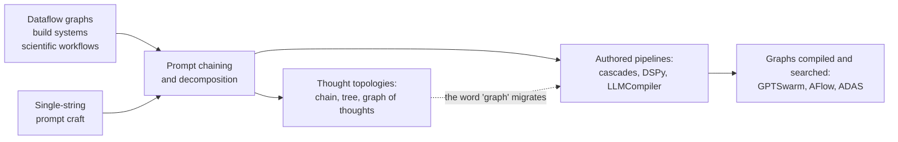
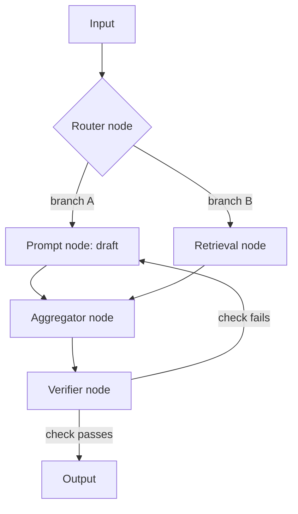
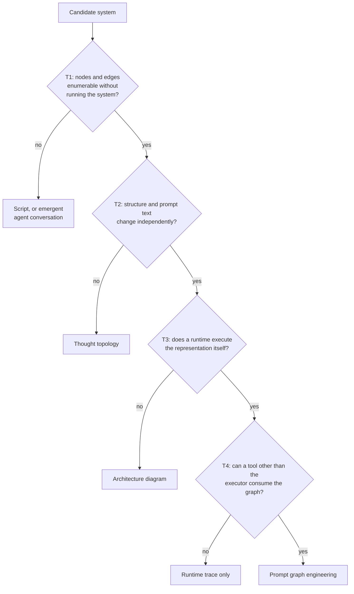
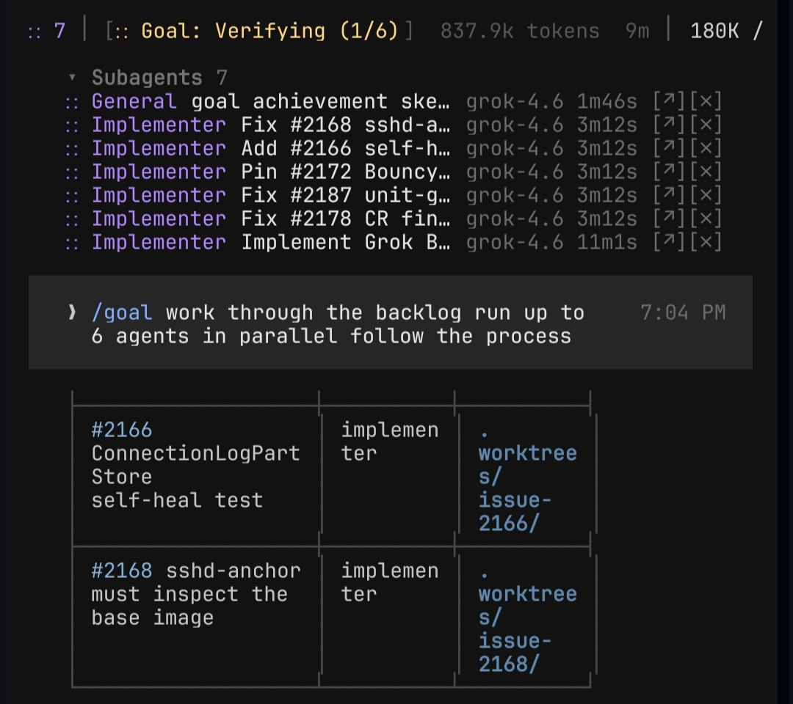

# Prompt Graph Engineering: A Membership Test for Agent Workflows

https://arxiv.org/abs/2607.27578

This is a definitional paper. It does not ship a framework, a benchmark, or a prompt you can paste into your setup. It proposes a name for something you already do - composing many prompt-bearing calls into a routed, parallel, sometimes cyclic structure - and it gives four conditions that decide whether a given system counts as doing it. The payoff for you is a vocabulary and a checklist you can point at your own stack.

## What This Paper Actually Is

The title is "What makes prompts a graph: necessary and sufficient conditions for prompt graph engineering", arXiv:2607.27578, posted 30 July 2026 under cs.AI.

Some facts worth establishing before anything else, because the message that brought this paper into the repo got them wrong:

- The paper has one author: Sandeco Macedo (listed on the PDF as Sandeco Macedo, Federal Institute of Goiás, sanderson.macedo@ifg.edu.br). Not two Anthropic seniors. There is no Anthropic affiliation anywhere in the paper.
- The term the paper coins is "prompt graph engineering", not "Graph Engineering". The distinction matters, because the paper spends a whole section separating its concept from agent orchestration, which is closer to what "connect multiple agents like a flowchart" describes.
- The paper is explicitly not a technique you plug in. Section 1 states the positioning directly: it proposes no new framework, benchmarks nothing, and surveys nothing. Its output is a definition and a test.
- Andrej Karpathy did join Anthropic (announced 19 May 2026, working on pre-training). That is true but unrelated - he has nothing to do with this paper.

There is also an irony worth flagging up front. The paper uses Claude Code subagents as its deliberate counterexample, the system the test exists to exclude. If your setup is a coding harness delegating to subagents, this paper says that is not prompt graph engineering. It does not say that is bad, only that it is a different thing.

The rest of this article walks through the paper in the order it argues: where the idea came from, the four conditions, the test built on top of them, the boundary against neighbouring concepts, how six real systems score, and the open research axes. I close with what I think is actually usable here.

## Genealogy: Where the Graph Came From

The paper reconstructs two separate histories that later collided over one word.

The engineering history starts long before prompts. Dataflow models fired nodes when their inputs arrived. Make expressed a build as a dependency graph. Scientific workflow systems scaled that to whole experiments. Three properties carried over: the graph separates orchestration from computation, it makes dependencies explicit so independent work runs in parallel, and it exists as an artifact you can check before running and inspect after failing.

The prompt history starts with one string. Few-shot examples, then instruction following, then pattern catalogs. That unit broke when tasks needed decomposition, which produced chains of calls (AI Chains, PromptChainer, language model cascades), then declarative pipelines that compile (DSP, DSPy), then runtimes and schedulers (SGLang, LLMCompiler).

The paper is careful about the chronology, and this is one of its sharper points. The practice came first, through chaining, in 2021 and 2022. The word came later and from the other lineage: "graph" entered the shared vocabulary through graph-of-thoughts in 2023, then got claimed by the engineering side within months. So what migrated is the dominant sense of the word, not the practice. The object changed owners - from the search strategy that generates thoughts to the engineer who authors nodes.

That ownership question turns out to be the whole definition.

## The Four Conditions

The paper's reference definition says prompt graph engineering represents, composes, and executes prompt-mediated model computation as an explicit graph, with four conditions attached. In the paper they are G1 through G4:

- G1, explicit structure. Nodes are authored units of computation (prompt-parameterized model invocations or deterministic transforms), edges are data or control dependencies.
- G2, separation of structure and content. You can change the graph shape without rewriting prompt text, and rewrite prompt text without touching the shape.
- G3, executable semantics. A runtime schedules nodes, routes outputs, and manages shared state, including branching, parallelism, and cycles.
- G4, first-class artifact. The graph exists as an object outside any single run - inspectable, versionable, validatable, optimizable.

Here is the shape those conditions describe, using the node vocabulary the paper lists (model call, retrieval, code execution, aggregation, verification):

Each condition earns its place by lineage, and the paper argues necessity by removing them one at a time. Drop G1 and the flow retreats into code paths or conversation turns, so nothing enumerates the steps. Drop G2 and every structural change forces prompt rewrites, so no optimizer can hold structure fixed while tuning text. Drop G3 and the graph is a picture - the paper notes that agent architecture diagrams in surveys are plentiful and none of them run. Drop G4 and the graph exists only as a runtime trace, which forfeits versioning, static checking, and search.

What the definition deliberately does not require is as informative as what it does. No visual editor is needed - a graph in code is as explicit as one on a canvas. No acyclicity - retry and reflection loops are constitutive, so the definition demands semantics for cycles rather than their absence. No multiple models, no specific framework, and no agents. Agenthood is a property some nodes may have, not a condition on the graph. And no automatic optimization - G4 asks that the graph be optimizable in principle, so hand-tuning a versioned graph satisfies it.

## The Inclusion and Exclusion Test

The four conditions become useful when turned into a decision procedure, T1 through T4. You answer them in order for a candidate system.

Two thresholds keep the test from being trivially passable. T1 asks for more than plurality - two calls glued together by string concatenation inside a function body is a chain in spirit but not an explicit representation, because you cannot enumerate it by inspection, API, or serialization without executing it. T3 asks for more than sequencing - the graph, not hand-written control flow wrapped around it, has to determine what runs next. Dynamic graphs still pass as long as the construction rules are themselves explicit.

T4 has the most operational criterion in the paper, and it is the one I would actually use on my own code. Some tool or process other than the executor must be able to consume the graph: a type checker, a visualizer, a diff, an optimizer. If the only consumer of the structure is the run itself, T4 fails.

The paper also separates two questions that usually get conflated. Membership is binary, quality is gradual. A three-node retrieve-generate-verify graph serialized in YAML passes all four and is a legitimate instance. What separates it from a compiled DSPy program with an optimizer in the loop is maturity, mostly in G4, not membership.

## Boundary Against Six Neighbouring Concepts

The test earns its keep at the edges. For each neighbour, the paper names the condition it fails.

| Neighbour | Fails | Reason |
|-----------|-------|--------|
| Classic prompt engineering | T1 | One prompt, so there is no structure to represent. The craft is intra-node |
| Thought topologies (CoT, ToT, GoT) | T2 | Nodes are thoughts the model generated, not units an engineer authored |
| Agent orchestration (free conversation) | T1 | Interaction shape emerges turn by turn, nothing enumerates it beforehand |
| Prompt programming (DSPy, LMQL, PDL) | none | This is the code-shaped form of the concept, not an exclusion |
| RAG pipelines | T4, often T2 | Hardwired in app code they also fail T1. Declared as framework objects they pass T1 degenerately |
| Classic workflow engines | object clause | They have the graph and lack the prompt-parameterized node |

The thought-topology row is the one the paper treats as diagnostic, because that family shares the word "graph". Tree-of-thoughts and graph-of-thoughts do orchestrate many invocations over an explicit topology, so T1 and T3 arguably pass. T2 is where they fail, and the failure is structural rather than incidental: the content is the model's output and the structure is the search schedule that produced it, so the two cannot vary independently. The paper phrases the boundary as authorship - in prompt graph engineering the engineer owns the nodes, in thought topologies the model does.

The workflow-engine row cuts the other way. Make and scientific workflow managers pass T1 through T4 for their own node kinds. What they lack is the node type: stochastic outputs, natural-language parameterization, per-call cost and latency, and correctness that no exit code decides. The paper argues that difference changes the engineering itself - caching has to reason about semantic equivalence, validation has to judge text, and optimization rewrites prompts rather than flags.

The agent-orchestration row is the one most relevant to how people actually build today. Multi-agent systems in free conversation fail T1. Orchestration crosses the boundary exactly when the flow gets reified as an object, which is what MetaGPT's standardized procedures and StateFlow's state machines do. Granularity also differs: agent orchestration composes agents (goals, memory, tools), while prompt graph engineering composes at the finer grain of prompt-parameterized invocations. An agent can be a node, but the concept does not require nodes that thick.

## Six Real Systems Scored

The paper applies T1 through T4 to six systems chosen to span the practice, based on documentation accessed in July 2026. The classification is the author's own, done by a single analyst, and the paper says so.

| System | T1 | T2 | T3 | T4 | Verdict |
|--------|----|----|----|----|---------|
| LangGraph | yes | yes | yes | yes | Included. Strongest on executable semantics |
| DSPy | yes | yes | yes | yes | Included. Strongest on artifact status and optimization |
| Prompt Flow | yes | yes | yes | yes | Included. Most literal DAG, weak on cycles |
| AutoGen | partial | yes | partial | partial | Included in GraphFlow mode, excluded in emergent conversation |
| CrewAI | partial | yes | partial | partial | Included via Flows, crew-level delegation stays emergent |
| Claude Code subagents | no | partial | no | no | Excluded. Authored nodes, but the flow is emergent at runtime |

The reasoning per system is more useful than the grid. LangGraph's StateGraph is an explicit object of named nodes and conditional edges, executed over a shared typed state with cycles, interrupts, and checkpointing, and the compiled graph serializes and visualizes. DSPy's centre of gravity sits elsewhere: signatures declare what each node consumes and produces while the compiler generates the prompt text, which the paper calls the most radical separation of structure and content in the sample. Prompt Flow is the most literal case - a YAML-declared DAG with prompt templates in separate files - and its literalness is also its limit, since without native cycles you have to push feedback loops inside nodes.

AutoGen and CrewAI both split across their own operating modes, which the paper treats as a feature of the test rather than a problem. AutoGen's conversational mode fails T1 and leaves a transcript instead of an artifact; its GraphFlow mode reifies the flow as a directed graph over agents. CrewAI's crews are partly emergent, its Flows are explicit event-driven compositions.

The Claude Code row is the counterexample the test was built to produce, and the reasoning is specific. Subagent definitions are files authored independently of any flow, so the nodes exist and the spirit of T2 holds. But which subagent runs, when, and feeding what into what gets decided by the orchestrator model at runtime, so nothing enumerates the flow beforehand (T1 fails), the runtime executes tool calls rather than a graph (T3 fails in the graph sense), and what persists is a transcript (T4 fails). The paper adds a scope caveat: it targets subagent delegation specifically, and notes that commands and hooks automate points of the working loop without reifying delegation into a graph.

The paper frames this exclusion as validation rather than criticism. A harness solves a different problem, and a definition that included it would have dissolved the concept.

<figure>
  
  <figcaption>7 parallel subagents implementing GitHub issues, each in its own git worktree[^7]</figcaption>
  <!-- Same shape as the Claude Code counterexample above: the orchestrator model decides which issue goes to which subagent at runtime, so nothing enumerates the flow beforehand. Authored nodes (issue implementers), emergent routing - the paper's test would fail this on T1 and T3 for the same reason it excludes Claude Code subagents. -->
</figure>

## Where Planner-Executor and MCP Land

The paper does not discuss the planner-executor pattern or MCP by name, so this section is my reading applied with the paper's test, not the paper's own claim.

Planner-executor, as covered in [Planner-Executor Pattern for AI Agents](planner-executor-pattern.md), is a borderline case that depends entirely on the plan artifact. A planner that writes a structured plan file, which an outer loop then walks step by step launching fresh sessions, passes T1 as long as the plan enumerates the steps before execution, passes T2 because step prompts live separately from the plan, and passes T4 because the plan file is a versionable object other tools can read. What it usually lacks is T3 in the strict sense: the plan is a sequence, and hand-written orchestration around it decides what runs next, rather than the graph itself routing outputs. Under the paper's threshold that is closer to a degenerate chain than to a prompt graph. Ralphex-style loops would score similarly.

MCP-based tool orchestration is the clearer case. MCP standardizes how a model discovers and calls tools. It defines the node vocabulary, not the structure connecting nodes. A model deciding which MCP tool to call next, turn by turn, fails T1 for the same reason Claude Code subagent delegation does. MCP is orthogonal to the paper's concept: you can build a prompt graph whose nodes call MCP tools, and that graph passes or fails on its own structure.

## The Four Design Tension Axes

The paper closes with a research agenda organized as four axes, and these are the parts most likely to be useful as article material or workshop framing.

Explicit versus emergent structure. Emergence buys adaptivity - a runtime orchestrator handles tasks its author never anticipated. Explicitness buys inspection, verification, and optimization. The open question the paper poses is whether that trade is fundamental or just technological: can a system record an emergent flow, lift it into an explicit graph, and then replay or refine it, so emergence becomes a discovery mode for structures that later become artifacts? The paper says no system today closes the loop from trace to versioned, optimized graph. That gap is the most concrete build idea in the whole paper.

Static versus dynamic structure. Prompt Flow fixes the DAG before execution, LangGraph routes conditionally over a fixed node set, LLMCompiler builds the graph per task instance, and thought topologies rebuild it per problem. The paper points at an unexplored middle: static skeletons with dynamically instantiated regions, plus type systems that can say something useful about a shape partly decided at runtime.

Node granularity. Fine grain (prompt-parameterized invocations) gives analyzable dataflow. Coarse grain (full agents with goals, memory, tools) gives encapsulation and role clarity. The paper's observation is that today the framework forces this choice rather than the engineer making it, and the open problem is composition across grains - graphs whose nodes are themselves graphs, with state, cost, and failure semantics that survive nesting.

Manual versus automatic improvement. Automation presupposes G4 and rewards it, which the paper calls the deepest argument for the discipline. But searching over graphs whose nodes are stochastic and expensive raises problems classic AutoML never faced: evaluation noise on every fitness call, cost ceilings that bound the search budget, and optimizers that exploit benchmark quirks instead of improving structure.

Three problems cut across all four axes. Verification asks which properties can be checked statically (type compatibility along edges, termination of cycles, cost and latency bounds) and which need semantic judgment of text. Context discipline notes that decomposing into nodes is also a context management strategy, since each node sees a curated window instead of accumulated history - and the interaction between graph shape and per-node context quality is unmeasured. Equivalence asks when two prompt graphs are the same program, and which refactorings preserve behaviour in distribution.

## What Makes This Interesting

The strongest thing in the paper is the T4 criterion, because it is falsifiable on your own codebase in about a minute. Ask whether anything other than the executor can consume your flow. If the answer is no, you have a script that produces transcripts, whatever the diagram in your README shows.

The second useful thing is the separation of membership from maturity. Most arguments about whether something is "really" multi-agent or "really" a workflow collapse two questions: does it qualify, and is it any good. Splitting them removes a lot of the noise.

The third is the honesty about the paper's own limits, which is unusual enough to note. The classification was done by one analyst with no second rater, the evidence base for the product systems is grey literature that moves faster than any article, and six systems is a sample. The paper states each of these in Section 6.

What the paper does not give you is any performance claim. There is no evidence in it that adopting a graph makes responses better, and the conclusion says so directly - how much of a system's quality lives in the structure rather than in the prompts is posed as an open empirical question the definition cannot answer alone. Any claim that plugging this paper into a setup made the first response noticeably better is not supported by anything in the paper, because the paper measures nothing.

## Companion Papers

The same author has two earlier definitional papers on adjacent layers of the same stack, built with the same method:

- "What makes a harness a harness: necessary and sufficient conditions for an agent harness", arXiv:2606.10106 - conditions for the runtime that turns a model into an agent.
- "Stop Hand-Holding Your Coding Agent: Engineering the Loops that Replace Step-by-Step Prompting", arXiv:2607.00038 - defines loop engineering, the design of the external loop that drives a harness.

The stated relation between them: the loop drives the agent from the outside, the graph structures the composition of calls on the inside. Both are worth pulling if this line of definitional work turns into a series of articles here.

One process detail from the paper worth knowing, since it affects how you cite it: the AI-use declaration states the author wrote the manuscript and used Grammarly plus Claude Opus 4.8 for structuring and translation into English.

## Sources

[^1]: [20260822_105610_AlexeyDTC_msg4876.md](../../inbox/used/20260822_105610_AlexeyDTC_msg4876.md)
[^2]: Sandeco Macedo, "What makes prompts a graph: necessary and sufficient conditions for prompt graph engineering", arXiv:2607.27578 - https://arxiv.org/abs/2607.27578
[^3]: arXiv metadata and PDF first page for authorship and affiliation - https://arxiv.org/pdf/2607.27578
[^4]: Karpathy joining Anthropic, announced 19 May 2026 - https://techcrunch.com/2026/05/19/openai-co-founder-andrej-karpathy-joins-anthropics-pre-training-team/
[^5]: Companion paper on agent harnesses - https://doi.org/10.48550/arXiv.2606.10106
[^6]: Companion paper on loop engineering - https://doi.org/10.48550/arXiv.2607.00038
[^7]: [20260818_171351_AlexeyDTC_msg4874_photo.md](../../inbox/used/20260818_171351_AlexeyDTC_msg4874_photo.md)
