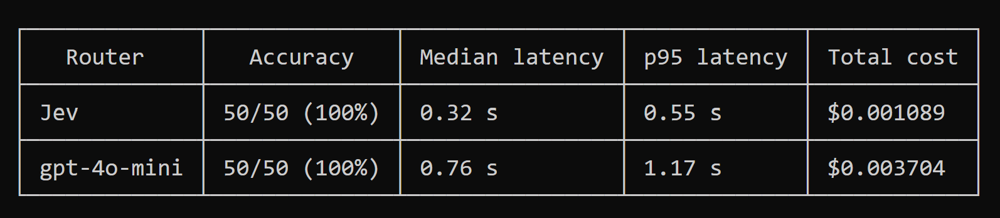
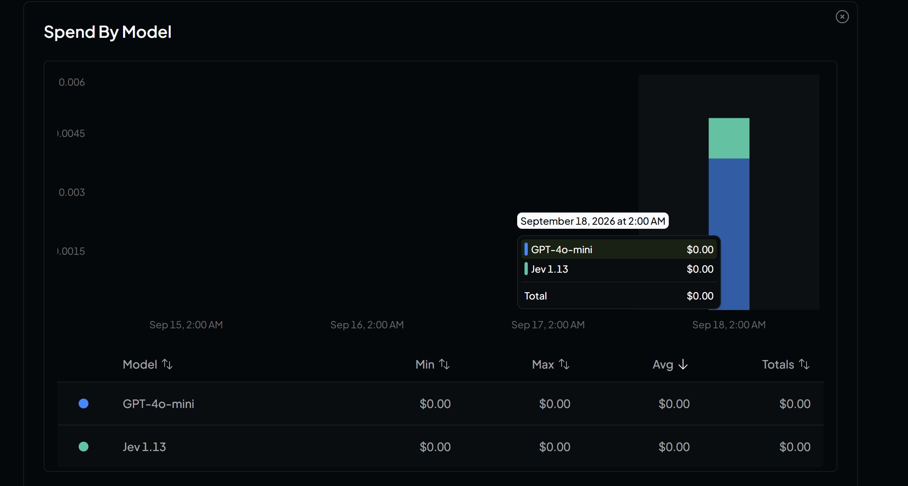
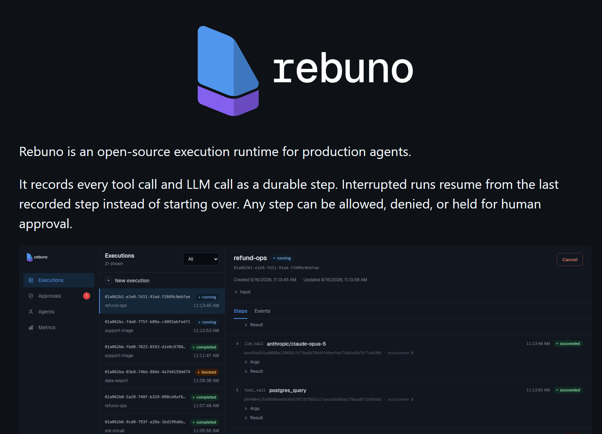

# Jev: A Decision Model That Does Not Generate Text

If you've been on X in the last few days, chances are that you've seen posts about Jev. Every time I open my timeline, I see people posting about it.

https://x.com/CompleteSkeptic/status/2099925682726002904

The model was recently released on OpenRouter, so I decided to [give it a try](https://openrouter.ai/typesafe/jev-1.13).

I tried using it to route tasks to the right agent.


## Jev and TypeSafe AI

I saw the announcement of Jev 1.13 on X on September 15, 2026. Jev is interesting because it doesn't generate text.

When I first read about it, I thought, "Huh? No text?" After reading a few more posts, I realized that it could be useful for quick decision-making.

Jev classifies text quickly: you give it text, and it makes a decision. That makes it useful as a router:

- Should I send this request to a heavy model or a light one?
- Which agent should I select?
- Should I handle this request automatically or send it to a human?

[TypeSafe calls Jev a "System One Model"](https://typesafe.ai/blog/introducing-system-one-models-and-jev). The name comes from "Thinking, Fast and Slow". Yes, that's this thick, long and boring book that I tried to read but gave up (I managed to finish the audio version though).

System 1 is the fast, intuitive judgment your brain makes without effort. System 2 is slow, deliberate reasoning. So, Jev is System 1, and LLMs are System 2. Or, in other words, it's an intelligent `if` statement.

Jev isn't a replacement for LLMs. It's a layer that sits in front of them.

You can also use it anywhere you previously relied on a cheap, fast LLM with structured output to make a decision.

For example, it can act as a guardrail. In [my AI Shipping Labs workshop about guardrails](https://aishippinglabs.com/workshops/agent-with-guardrails), I used `gpt-4o-mini` as a quick classifier to decide whether to continue generation. Jev can replace that binary LLM classifier.


## The API

You send Jev one request containing two things:

- a state (unstructured text or a JSON object describing the situation)
- a set of typed questions

Jev answers all questions in parallel and returns structured JSON with probability distributions.

There are three question types ([TypeSafe calls them "primitives"](https://docs.typesafe.ai/primitives)):

- Noul: a yes/no question. Returns a single probability from 0 to 1. "Does this message request a refund?" might return `0.93`. Think binary classifier.
- Choice: pick one option from a set of options. Returns the selected option, a probability distribution across all options, and a confidence score. Up to 255 options per question. Think multiclass classification.
- Score: rate the state on an ordered scale. Returns a weighted score, the distribution across levels, and confidence. Between 2 and 10 levels. Think ordinal classification.

Send the state, model, and questions in one JSON body to [the evaluation endpoint](https://docs.typesafe.ai/api). Here's a request that includes all three question types for one state:

```json
{
  "state": "Help! My payouts have been failing for 3 days.",
  "model": "jev-latest",
  "questions": {
    "is_urgent": {
      "type": "noul",
      "instructions": "Does this convey urgency?"
    },
    "department": {
      "type": "choice",
      "instructions": "Which team should handle this?",
      "criteria": {
        "billing": "Payments, invoicing, refunds",
        "technical": "Bugs, outages, integrations",
        "sales": "Pricing, upgrades, new accounts"
      }
    },
    "frustration": {
      "type": "score",
      "instructions": "How frustrated is the customer?",
      "criteria": ["Calm", "Frustrated", "Very angry"]
    }
  }
}
```

The `state` is the thing being judged - a plain string, or a JSON object when the situation has several parts. Each entry in `questions` is one question under a key you pick yourself: `instructions` is the question, and `criteria` describes the possible answers - a map of options for Choice, an ordered list of levels for Score, and an optional explanation of yes and no for Noul.

Here's what a response looks like:

```json
{
  "model": "jev-1.13.0",
  "answers": {
    "is_urgent": { "type": "noul", "noul": 0.93 },
    "department": {
      "type": "choice",
      "choice": "billing",
      "probabilities": { "billing": 0.84, "technical": 0.15, "sales": 0.0, "other": 0.01 },
      "confidence": 0.6
    },
    "frustration": {
      "type": "score",
      "score": 1.3,
      "probabilities": { "0": 0.0, "1": 0.7, "2": 0.3 },
      "confidence": 0.54
    }
  }
}
```

The response contains one typed answer for each question. The `noul` value is the probability that the message is urgent, `choice` is the selected department, and `score` is the weighted frustration level. For Choice and Score, the response also includes the full probability distribution and a confidence score.

We can now use these answers in our code:

```python
urgency = answers["is_urgent"]["noul"]
department = answers["department"]["choice"]
department_confidence = answers["department"]["confidence"]

if urgency > 0.8 and department == "billing":
    escalate_to_billing()
elif department_confidence < 0.5:
    route_to_human()
```

## Benchmarks

[TypeSafe built a benchmark suite](https://evals.typesafe.ai/) of four business workflows to show how it works:

- security incident triage
- agent trace observability
- invoice processing
- customer service

Each model ran through the same workflow harness, and the results were compared against a reference policy derived from the average judgments of GPT-6 Astra and Claude Fable 5.1.

| Workflow | Cases | Jev accuracy | Jev cost | Jev latency | Nearest comparator |
|----------|-------|-------------|----------|-------------|-------------------|
| Security incidents | 240 | 61.7% | $0.0001 | 0.3s | Opus 66.2% at $0.0574, 15.1s |
| Agent trace observability | 117 | 71.6% | $0.0003 | 0.5s | Sol 76.6% at $0.0575, 40.3s |
| Invoice processing | 150 | 61.8% | $0.0011 | 0.5s | Sol 79.1% at $0.2152, 34.3s |
| Customer service | 204 | 76.0% | $0.0001 | 0.4s | Sol 78.3% at $0.0323, 10.1s |
| Aggregate | 711 | 67.8% | $0.0004 | 0.4s | Sol 74.1% at $0.0836, 23.3s |

A separate [code-review benchmark by an independent developer](https://github.com/gemanor/jev-code-review-benchmark) compared Jev against Gemini Flash and Claude Fable on Python linting rules.

- Jev cost 45 times less than Gemini Flash and 274 times less than Claude Fable.
- Its median response time was 0.75 seconds (versus 3.59 seconds for Flash and 4.31 seconds for Fable).
- Jev scored 98% correctness versus 100% for both comparators.


## Applications People Built

I've seen a lot of posts on X about what people have built with Jev over the last few days.

### Self-Driving Simulations

- A 2D top-down browser simulation where Jev acts as the driving classifier, receiving road state and making steering decisions. [Source](https://github.com/vinilana/live-jev)
- A 3D Three.js driving simulator with autopilot. Jev receives a compact JSON snapshot of current speed, speed limit, next turn distance, nearby vehicles and pedestrians with relative positions and speeds, traffic signals, and predicted hazards. It returns a typed driving decision. [Source](https://github.com/standardagents/jevdrive)
- An interactive playground with 3D driving simulations showing real AI decisions with visible sensor inputs. [Source](https://github.com/kavehmz/typesafe-playground)

### Games

[TypeSafe's launch post](https://typesafe.ai/blog/introducing-system-one-models-and-jev) shows Jev playing Doom at about 10 queries per second, at a cost of roughly $7 per hour.

People also made it play chess:

- Jev versus an OpenAI model. [Source](https://github.com/wondertwins/jev-benchmark)
- Two Jev instances playing against each other. [Source](https://github.com/TholeG/typesafe-chess)


Other games:

- An NPC demo tested whether Jev could decide which characters should respond when a player speaks. The game engine sends the transcript and NPC descriptions, and Jev decides which NPC the player is addressing. [Source](https://github.com/wondertwins/jev-benchmark)
- Wikiracing, where Jev navigates from one Wikipedia page to another using only links on each page. Jev had to choose among hundreds or thousands of links per page. [Source](https://typesafe.ai/blog/introducing-system-one-models-and-jev)


## Using Jev as an Agent Router for My Work

I wanted to give it a try too. Since Jev became available via OpenRouter today, I could skip the waiting list.

Currently, I'm automating operations at [DataTalks.Club](https://datatalks.club/), [AI Shipping Labs](https://aishippinglabs.com/), and elsewhere. I also have a lot of other operational work.

Because each piece of work is different and requires different tools, I need a different agent for each task:

- If a task is about DataTalks.Club course operations - cohorts, homeworks, projects, leaderboards, certificates - it should go to the DTC agent.
- If a task is about AI Shipping Labs - workshops and the tiers that gate them, events, membership and payments, sprints, marketing pages - it should go to the AISL agent.
- Otherwise, it should go to the admin agent, which keeps a local task list.

<figure>
  
  <figcaption>One request goes to Jev through OpenRouter, comes back as one typed destination, and the code dispatches it to the matching specialist agent.</figcaption>
</figure>

### Routing with structured output

Previously, I used a simple model like `gpt-4o-mini` for routing. I gave it a structured output schema:

```python
from enum import Enum
from pydantic import BaseModel, Field

class Destination(str, Enum):
    DATATALKS_CLUB = "datatalks_club"
    AI_SHIPPING_LABS = "ai_shipping_labs"
    ADMIN = "admin"

class RouteDecision(BaseModel):
    destination: Destination = Field(
        description=(
            "Which specialist should handle this request? Choose datatalks_club for "
            "DataTalks.Club course operations: cohorts, homeworks, learner projects "
            "and peer review, leaderboards, certificates, registrations, and meetups. "
            "Choose ai_shipping_labs for AI Shipping Labs operations: workshops and "
            "the membership tiers that gate them (main+ and above), events, plans and "
            "payments, shipping sprints, the book club, marketing pages, campaigns, "
            "and member CRM notes. Choose admin for personal task tracking in a local "
            "task list: capturing a task or reminder, listing tasks, marking one done."
        )
    )
```

The enum describes the directions to route the agent, so I first run a classifier to decide which agent to invoke, and then invoke that agent.

In code it can look like this:

```python
from pydantic_ai import Agent
from site_agents.llm import openrouter_model

router = Agent(
    openrouter_model("openai/gpt-4o-mini"),
    instructions=GPT_ROUTER_INSTRUCTIONS,
    output_type=RouteDecision,
)

result = await router.run(request)
routing_decision = result.output

agents[routing_decision].run(request)
```

### Routing with Jev

With Jev, the same routing decision is one `Choice` question:

```python
ROUTER_INSTRUCTIONS = """
You are the dispatch layer for a small operations assistant.
Classify the user's request into the single specialist that can do the work.
Do not answer the request and do not invent a fourth category.
""".strip()

ROUTING_CRITERIA = {
    "datatalks_club": (
        "DataTalks.Club course operations: cohorts and courses, homeworks and their "
        "questions, learner projects and peer review, leaderboards, certificates, "
        "graduates, course registrations, and community meetups."
    ),
    "ai_shipping_labs": (
        "AI Shipping Labs operations: workshops and the membership tiers that gate "
        "them (main+ and above), events, plans, payments and tier overrides, shipping "
        "sprints and their weekly checkpoints, the book club, marketing pages and "
        "site navigation, email campaigns, and member CRM notes."
    ),
    "admin": (
        "Personal task tracking in a local task list: capturing a task or reminder, "
        "listing open or completed tasks, and marking a task done. No website, course, "
        "workshop, or membership system is involved."
    ),
}
```

Now we prepare the payload and send a request:

```python
payload = {
    "model": "~typesafe/jev-latest",
    "state": request,
    "questions": {
        "destination": {
            "type": "choice",
            "instructions": (
                f"{ROUTER_INSTRUCTIONS}\n\n"
                "Which specialist should handle this request? "
                "Choose exactly one option."
            ),
            "criteria": ROUTING_CRITERIA,
        }
    },
}

response = await client.post(
    "/api/alpha/decisions",
    headers={"Authorization": f"Bearer {api_key}"},
    json=payload,
)
```

The answer comes back under the `destination` key. Since the model can only return one of my three options, I can map it to `Literal`:

```python
from typing import Literal

class JevChoiceAnswer(BaseModel):
    type: Literal["choice"]
    choice: Destination
    probabilities: dict[str, float]
    confidence: float
```

From there, dispatching is the same code for both routers:

```python
route = await route_request(request)
routing_decision = result.destination
agents[routing_decision].run(request)
```

### Comparing the Two Routers

To compare Jev with `gpt-4o-mini`, I wrote 50 short, hand-labeled action-style requests and marked the destination for each one. They cover the work each site actually has: cohorts, homeworks, projects and leaderboards for DataTalks.Club, workshops, membership tiers, sprints and marketing pages for AI Shipping Labs, and plain task capture for the admin list.

```json
[
  {
    "id": "aisl-01",
    "request": "Create a workshop Tuesday 16:30 about JEV, main+ only.",
    "expected": "ai_shipping_labs"
  },
  {
    "id": "admin-02",
    "request": "Remind me tomorrow to submit the VAT receipts.",
    "expected": "admin"
  }
]
```

These are the results:

<figure>
  
</figure>

Both routers get every case right, the terse workshop one included. For a three-way split between domains that barely share vocabulary, that is what I expected - this is an easy classification task, and it should be.

So the difference is speed and price: Jev was 2.4 times faster by median latency and 3.4 times cheaper. I ran the benchmark several times and the numbers barely moved - Jev's median stayed between 0.32 and 0.34 seconds, gpt-4o-mini's between 0.73 and 0.76 seconds, and the cost was the same on every run.


Jev is so cheap that OpenRouter shows $0.00 on the dashboard:

<figure>
  
</figure>

I think it's a very promising technology and I'll most likely integrate it in my workflows.

### Workshop on Tuesday

I want to do a more detailed workshop about Jev next Tuesday at 16:30 Berlin time on AI Shipping Labs. If you're member, come join me!

[Sign up for the workshop](https://aishippinglabs.com/events/56/building-with-jev)

If you have a use case, bring it along too. See you there!

## Tools

This week I bookmarked a few interesting tools that I want to try.

<figure>
  
  <figcaption>Rebuno's execution dashboard shows durable agent steps, approvals, and execution status.</figcaption>
</figure>

* [rebuno](https://github.com/rebuno/rebuno): a library for adding durable step-level execution to agents: every tool and LLM call is recorded to a Postgres-backed event log, interrupted runs resume from the last recorded step, and YAML guardrails allow, deny, or hold any step for human approval. It works with LangChain, CrewAI, Pydantic AI, Mastra, and Vercel AI SDK.
* [pizza-bot](https://github.com/pizza-bot-app/pizza-bot): an inbox for long-running AI agents. It puts work items that wait on your decision in Unread, but can continue to run. It's something I wanted to build in [CodeHive](https://github.com/alexeygrigorev/codehive), but never managed.
* [ordewell](https://github.com/ordewell/ordewell): a multi-agent task orchestrator that turns one goal into an ordered plan of coding-agent tasks, each with its own runner, model, thinking effort, and mode.
* [panel](https://github.com/greentfrapp/panel): a research workspace where the agent works together with you. It shows all the files, PDFs, and notebooks in one dock. You interact with the agent in the same environment and don't need back-and-forth switching.
