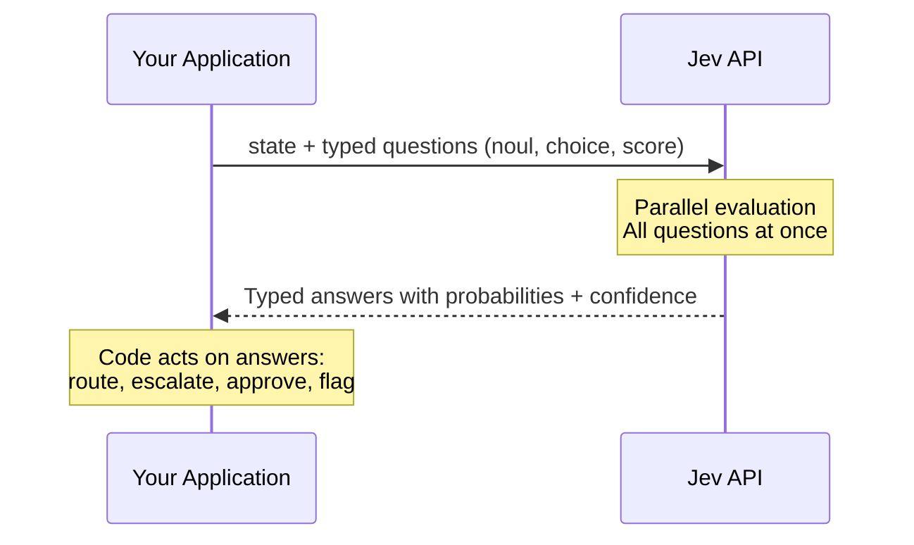
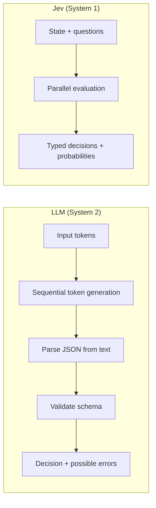
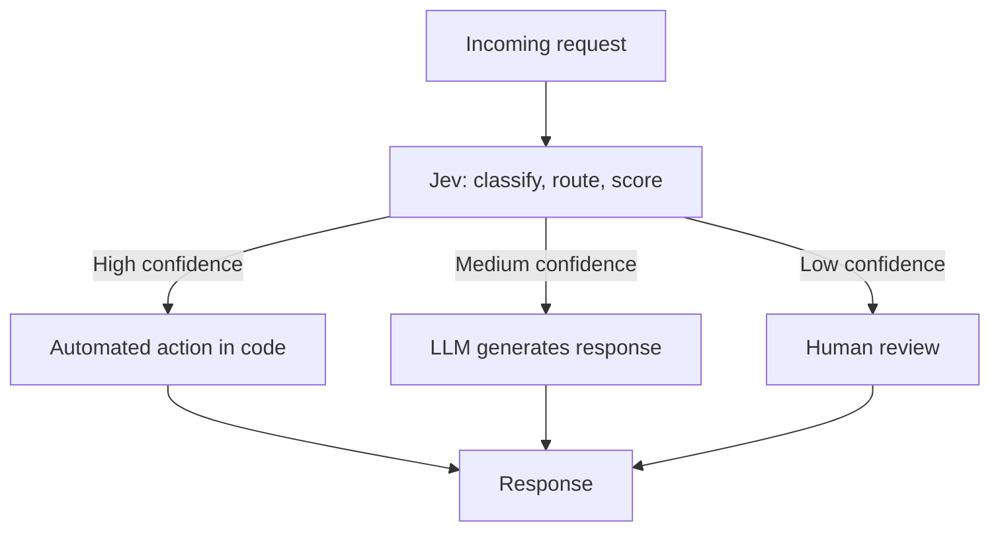

# TypeSafe AI and Jev: A Decision Model That Does Not Generate Text

https://typesafe.ai/

TypeSafe AI is a San Francisco lab that emerged from stealth on September 15, 2026 with $40M in seed funding led by DCVC. Its first public model, Jev (version 1.13), does not generate text. Instead, it takes unstructured program state as input and returns typed, probabilistic decisions in a single parallel pass. The company was founded by Diogo Almeida, who co-invented RLHF and InstructGPT at OpenAI (the research behind ChatGPT), along with Erik Gafni and Sasha Sheng.[^1]

This article covers what Jev is and how it works, then walks through the community projects people have built with it (self-driving simulations, games, developer tools), and finishes with what people are saying about it online.

## The System One Model Concept

TypeSafe calls Jev a "System One Model" - a name drawn from Daniel Kahneman's Thinking, Fast and Slow. System 1 is the fast, intuitive judgment your brain makes without effort. System 2 is slow, deliberate reasoning. In TypeSafe's framing, LLMs are System 2 models (they generate text token by token, do chain-of-thought reasoning, produce prose). Jev handles System 1 tasks: classify, route, score, detect. It is, as Flavio Copes put it, "a smart if statement".

The simplest way to understand the difference: you don't ask Jev "write me a customer support reply". You ask Jev "which department should handle this ticket?" and it returns `billing` with a probability distribution across all options you defined.

Jev is named after William Stanley Jevons, the economist behind the Jevons paradox. When steam engines got more efficient, coal consumption went up because cheaper power created new uses. TypeSafe's bet is that a 100x drop in the cost of AI decisions will create 100x more decision points in software.

Source: https://typesafe.ai/blog/introducing-system-one-models-and-jev

## The API

You send Jev one request containing two things: a state (unstructured text or a JSON object describing the situation) and a set of typed questions. Jev answers all questions in parallel against that shared state and returns structured JSON with probability distributions.



There are three question types (TypeSafe calls them "primitives"):

- Noul: a yes/no question. Returns a single probability from 0 to 1. "Does this message request a refund?" might return `0.93`. There is no separate confidence field - the probability is the signal
- Choice: pick one option from a set you define. Returns the selected option, a probability distribution across all options, and a confidence score. Up to 255 options per question
- Score: position on an ordered scale you describe. Returns a weighted score, the distribution across levels, and confidence. Between 2 and 10 levels

Here is a real API response shape from the documentation:

```json
{
  "model": "jev-1.13.0",
  "answers": {
    "is_urgent": { "type": "noul", "noul": 0.93 },
    "department": {
      "type": "choice",
      "choice": "billing",
      "probabilities": { "billing": 0.84, "technical": 0.15, "sales": 0.0, "other": 0.01 },
      "confidence": 0.6
    },
    "frustration": {
      "type": "score",
      "score": 1.3,
      "probabilities": { "0": 0.0, "1": 0.7, "2": 0.3 },
      "confidence": 0.54
    }
  }
}
```

Your code then uses those answers like any other data:

```python
if answers["is_urgent"]["noul"] > 0.8 and answers["department"]["choice"] == "billing":
    escalate_to_billing()
elif answers["department"]["confidence"] < 0.5:
    route_to_human()
```

The confidence value collapses the probability distribution into a single number. High confidence means one option dominates. Low confidence means probability is spread out. You set the thresholds in your code - TypeSafe does not decide for you when to act or escalate.

Source: https://docs.typesafe.ai/primitives

## Technical Architecture

TypeSafe has not published the full model architecture, but the public details paint a clear picture of what makes it different from an LLM.

Three design choices define Jev:

- Parallel sampling instead of autoregressive generation. LLMs produce one token at a time, each conditioned on the last. Jev evaluates all questions independently against the same state in a single pass. Adding a fourth question to a request barely changes latency
- RLCD training instead of RLHF. Where RLHF optimizes for human preference on chat responses and RLVR (Reinforcement Learning with Verifiable Rewards) optimizes for programmatically checkable outputs, RLCD (Reinforcement Learning for Calibrated Decisions) optimizes for probabilities that match outcomes. A model trained with RLCD that says it is 70% confident should be right about 70% of the time across many predictions
- Constrained output space. The model can only return values within the schema you defined. A Choice with options `billing`, `technical`, and `sales` cannot produce a fourth option. TypeSafe calls this a 0% structured output error rate and says it is structural, not empirical



The result of these choices is dramatically different performance on decision tasks. TypeSafe reports:

- End-to-end response time: 70-500ms (vs 3-329 seconds for frontier LLMs)
- Input cost: $0.042 per million tokens ($42 per billion tokens)
- Output cost: free (too small to meter)
- Context budget: ~32,000 tokens per question, ~64,000 total per request

To put the cost in perspective: Claude Fable 5.1 costs $10 per million input tokens. Jev costs 238x less. GPT-5.6 Terra sits around $2-3 per million input tokens, making Jev roughly 50-70x cheaper.

Source: https://typesafe.ai/blog/introducing-system-one-models-and-jev

## Workflow Benchmarks

TypeSafe built a benchmark suite of four business workflows (security incident triage, agent trace observability, invoice processing, and customer service) covering 711 cases total. Each model ran through the same workflow harness, and results were compared against a reference policy derived from the average judgments of GPT-6 Astra and Claude Fable 5.1.

| Workflow | Cases | Jev accuracy | Jev cost | Jev latency | Nearest comparator |
|----------|-------|-------------|----------|-------------|-------------------|
| Security incidents | 240 | 61.7% | $0.0001 | 0.3s | Opus 66.2% at $0.0574, 15.1s |
| Agent trace observability | 117 | 71.6% | $0.0003 | 0.5s | Sol 76.6% at $0.0575, 40.3s |
| Invoice processing | 150 | 61.8% | $0.0011 | 0.5s | Sol 79.1% at $0.2152, 34.3s |
| Customer service | 204 | 76.0% | $0.0001 | 0.4s | Sol 78.3% at $0.0323, 10.1s |
| Aggregate | 711 | 67.8% | $0.0004 | 0.4s | Sol 74.1% at $0.0836, 23.3s |

A separate code-review benchmark by an independent developer compared Jev against Gemini Flash and Claude Fable on Python linting rules. Jev cost 45x less than Gemini Flash and 274x less than Claude Fable. Its median response time was 0.75 seconds (vs 3.59s for Flash and 4.31s for Fable). Jev scored 98% correctness versus 100% for both comparators.

The pattern is consistent: Jev trades a modest accuracy gap for a massive cost and speed advantage. On customer service, it nearly matches the top comparator. On invoice processing, the gap is large. The right question is not "is Jev as accurate?" but "is this accuracy good enough at this cost for this use case?"

Source: https://evals.typesafe.ai/

Source: https://github.com/gemanor/jev-code-review-benchmark

## Applications People Have Built

The model launched three days ago (September 15, 2026), and the community has already produced a surprising number of projects. These fall into several categories.

### Self-Driving Simulations

Multiple developers built autonomous driving demos powered by Jev:

- A 2D top-down browser simulation where Jev acts as the driving classifier, receiving road state and making steering decisions. Source: https://github.com/vinilana/live-jev
- A 3D Three.js driving simulator with Tesla Autopilot-like behavior. Jev receives a compact JSON snapshot of current speed, speed limit, next turn distance, nearby vehicles and pedestrians with relative positions and speeds, traffic signals, and predicted hazards. It returns a typed driving decision. Source: https://github.com/standardagents/jevdrive
- An interactive playground with 3D driving simulations showing real AI decisions with visible sensor inputs. Source: https://github.com/kavehmz/typesafe-playground

These are experiments, not production autonomous driving systems. They demonstrate that Jev's 70-500ms latency is fast enough for real-time control loops.

### Games

TypeSafe's own launch included a Doom demo where Jev controlled the game in real time. The game state was passed to Jev as structured data (not screen images), and it chose actions from a predefined set at roughly 10 queries per second. Operating cost was about $7 per hour. TypeSafe said they plan to release a full walkthrough and host hack events around it.

Chess is another popular demo:

- One project has Jev playing against an OpenAI model, with every move a live API call streamed to the browser. Jev picks its move with a single Choice over all legal moves (up to 218 options per turn). Over 425 game moves, median API latency was 166ms, p90 was 256ms, p99 was 403ms. Source: https://github.com/wondertwins/jev-benchmark
- Another has two Jev instances playing against each other, where every move returns a full probability distribution. Source: https://github.com/TholeG/typesafe-chess

A video game NPC demo tested whether Jev could decide which characters should respond when a player speaks aloud through speech-to-text. The game engine sends the transcript and NPC descriptions, and Jev decides which NPC the player is addressing.

TypeSafe also demonstrated Wikiracing - a game where you navigate from one Wikipedia page to another using only links on each page. Jev had to choose among hundreds or thousands of links per page without selecting a link that does not exist. This tests both speed and the "no hallucination" property: the model literally cannot pick a link not in its option set.

### Developer Tools and Integrations

Community SDKs appeared in multiple languages within days:

- Ruby (typesafe-sdk) with typed Noul, Choice, and Score questions, retries, and thread-safe pooled HTTP connections
- Rust (typesafe-rs) focused on low-latency transport
- Elixir (typesafe_sdk) with configurable retries and upstream API parity
- Rails integration (typesafe-ai-rails) with persisted usage telemetry and confidence policies
- RubyLLM integration for using Jev alongside other models

Other developer-facing projects:

- A scam text message filter powered by Jev (scam-shield)
- A tool to rewrite AI drafts in your own voice using a bounded TypeSafe feedback loop (mimicry)
- A .NET and React ticket triage application (JevTicktRouter)
- Home Assistant integration (HA-Jev) that turns typed questions about smart home entity state into sensors and automation actions, with daily cost tracking and a token budget that halts evaluation

Source: https://github.com/hellogumbo/awesome-jev

### The 110-Use-Case Playground

A community-built playground catalogs over 110 use cases, including practical applications, games, ethical dilemmas, and model challenges. It features editable prompts, A/B comparisons, and a mobile-friendly UI.

Source: https://github.com/CompleteDotTech/typesafe-ai-playground

## Where Jev Sits in a Production Stack

Jev is not a replacement for LLMs. It is a layer that sits alongside them. The intended production architecture uses Jev for fast semantic decisions and an LLM for the parts that need text generation.



TypeSafe's documentation describes several architectural patterns:

- Confidence-gated routing: set thresholds for automatic action, LLM escalation, and human review based on Jev's confidence scores
- Speculative fan-out: run multiple Jev questions in parallel speculatively, then pick the path that applies
- Composite scoring: split complex judgments into independent Score questions and combine them in code
- Intent routing: use Jev to classify user intent, then dispatch to different handlers

The documentation also identifies Jev as a guardrail layer for other AI systems. You can run Jev on every LLM input, output, and tool call to detect jailbreaks, policy violations, tool-call errors, and response-quality failures at a fraction of the cost of the LLM call itself.

Source: https://docs.typesafe.ai/patterns

## Community Reception

### Hacker News

The launch post sat at the top of Hacker News for a full day, collecting 1,865 points and 491 comments. The reaction split into three camps.

Enthusiasts saw it as the right abstraction for a common problem. One commenter noted that many production LLM calls exist purely to classify or route, and paying for full autoregressive generation on those calls is wasteful. The comparison to DSPy-style typed prediction signatures came up multiple times - the idea that expensive LLM calls could eventually be compiled down into many smaller, cheaper, task-specific decision calls.

Skeptics pushed on two claims. First, "can't hallucinate" is a type-safety claim, not a correctness claim. Jev cannot produce an option outside your schema, but it can confidently pick the wrong valid option. Diogo Almeida (posting as CompleteSkeptic) acknowledged this directly: "it's also possible to be confidently wrong (and all future models will be smarter still and still have that possibility)." Second, the speed comparison of 70ms vs 329 seconds is not apples-to-apples when the LLM baseline does full chain-of-thought generation for tasks that do not need it.

The technical crowd debated what the architecture might be. Some suggested it is constrained decoding on a smaller model. Others proposed a diffusion-like or non-autoregressive model. One commenter who received early access described RLCD as essentially calibrated RL: "you massively negatively reward a distribution that is {yes: 0.9, no: 0.1} if the answer was no, and less negatively reward a {yes: 0.6, no: 0.4}."

Source: https://news.ycombinator.com/item?id=49717558

### Latent Space / AI News

Latent Space covered Jev as one of the top three stories of the day (alongside Gemini 3.8 Live and Periodic Labs' Neon). The analysis framed Jev not as a GPT replacement but as a "cheap, calibrated inference engine for structured choices." It noted the connection to DSPy-style signatures, suggesting a future stack where expensive LLM calls are compiled into many smaller task-specific AI functions.

Source: https://www.latent.space/p/ainews-jev-a-system-one-model-that

### Independent Reviews

Kingy AI published the most thorough independent review, rating Jev as "promising decision primitive, not proven frontier replacement." The review noted that Jev trails the top visible comparators on aggregate workflow accuracy (67.8% vs 74.1%), that the reference labels are model-generated rather than ground-truth verified, and that confidence calibration has not been independently demonstrated. The verdict: "Use Jev for high-volume decisions, not for prose or AGI. Expect to do the evaluation work yourself."

Every.to's Mike Taylor tested Jev on 37 documents (27 real articles plus 10 deliberately AI-styled counterparts) with 21 concurrent questions per document. Jev processed 777 judgments in under 0.7 seconds for roughly a quarter of a cent. On a smaller 12-passage comparison, Jev caught 6 of 7 intended writing defects while Claude Fable 5.1 caught all 7. Jev was roughly 25x faster and 580x cheaper.

Source: https://kingy.ai/blog/typesafe-jev-review-the-ai-model-that-doesnt-generate-text/

Source: https://every.to/also-true-for-humans/mini-vibe-check-typesafe-s-jev-judged-everything-i-ve-written-in-0-7-seconds

### Twitter/X

Diogo Almeida's launch tweet received 4.21 million views, 1,120 replies, 1,800 reposts, and 19,900 likes. The conversation on X centered on practical integration questions rather than architecture debates. Developer reactions ranged from "Jarvis is finally here" to more measured takes like "if you want to try out typesafe jev with RubyLLM, check out [the integration] - it's a very interesting model." The model was also trending in Japan with coverage in Japanese tech media.

Source: https://x.com/CompleteSkeptic/status/2099925682726002904

### Community Skepticism Worth Noting

A Hacker News commenter claimed to have reproduced something similar in two hours using open-weight models. Whether or not the quality matches, this suggests the concept is reproducible, and the value of TypeSafe's offering lies in the training quality (RLCD calibration), the managed API, and the tooling around it rather than in the idea of constrained decision outputs alone.

Several reviewers noted that TypeSafe has not yet disclosed model parameters, architecture details, training data sources, rate limits, or SLA terms. This is common for a launch-stage product, but it means independent evaluation of the strongest claims (calibration quality, out-of-distribution behavior) is not yet possible.

## Notable Design Choices

The core insight is a bet against generality. Every other AI lab is racing toward more general, more capable LLMs. TypeSafe went the opposite direction: strip away everything a model can do except answer typed questions, then optimize that narrow task for speed, cost, and calibration.

Three things stand out:

- The Jevons paradox bet. At $42 per billion input tokens and sub-second latency, you can put Jev calls in places where you would never call an LLM. Inside a game loop at 10 queries per second. On every line of a million-row dataset. On every tool call an LLM agent makes. The bet is that sufficiently cheap decisions create new categories of use
- Confidence as a first-class output. LLMs can estimate confidence if prompted, but those estimates are not calibrated - they tend to be overconfident. Jev's RLCD training explicitly optimizes for calibrated probabilities, meaning the confidence scores are designed to be actionable. If true, this lets you build reliable confidence-gated workflows where your code decides when to trust the model, when to escalate, and when to refuse
- The code boundary. Jev stops at the decision. Your code owns the thresholds, branching, permissions, and side effects. This is a more disciplined architecture than asking an LLM to emit both the decision and the action in one stream

The risk is also clear: at 67.8% aggregate accuracy on the workflow benchmark (vs 74.1% for the top LLM comparator), a 6-point gap can matter a lot depending on the cost of wrong decisions. TypeSafe's argument is that confidence routing handles this - flag low-confidence cases for review and you can reach acceptable error rates on the automated subset. Whether that argument holds depends on how well RLCD calibration actually works in production, and that data is not yet public.

## Technologies

- Model: Jev 1.13 (current version jev-1.13.0, aliases jev-latest and jev-preview)
- Training method: RLCD (Reinforcement Learning for Calibrated Decisions)
- Sampling: parallel (not autoregressive)
- API endpoint: `POST /v1/systemone` (TypeSafe native) or via OpenRouter at `typesafe/jev-1.13`
- SDKs: Python, JavaScript (official); Ruby, Rust, Elixir (community)
- Available on: TypeSafe API, OpenRouter, Vercel AI Gateway, Cloudflare AI
- Pricing: $0.042/M input tokens, $0 output tokens
- Context: ~32K tokens per question, ~64K total per request
- Choice cardinality: up to 255 options

## Sources

[^1]: [20260918_053503_AlexeyDTC_msg4958.md](../../inbox/used/20260918_053503_AlexeyDTC_msg4958.md)

Source: https://typesafe.ai/

Source: https://openrouter.ai/typesafe/jev-1.13

Source: https://typesafe.ai/blog/introducing-system-one-models-and-jev

Source: https://docs.typesafe.ai/concepts/use-case-map

Source: https://flaviocopes.com/jev/

Source: https://news.ycombinator.com/item?id=49717558

Source: https://kingy.ai/blog/typesafe-jev-review-the-ai-model-that-doesnt-generate-text/

Source: https://every.to/also-true-for-humans/mini-vibe-check-typesafe-s-jev-judged-everything-i-ve-written-in-0-7-seconds

Source: https://www.latent.space/p/ainews-jev-a-system-one-model-that

Source: https://github.com/hellogumbo/awesome-jev

Source: https://evals.typesafe.ai/
