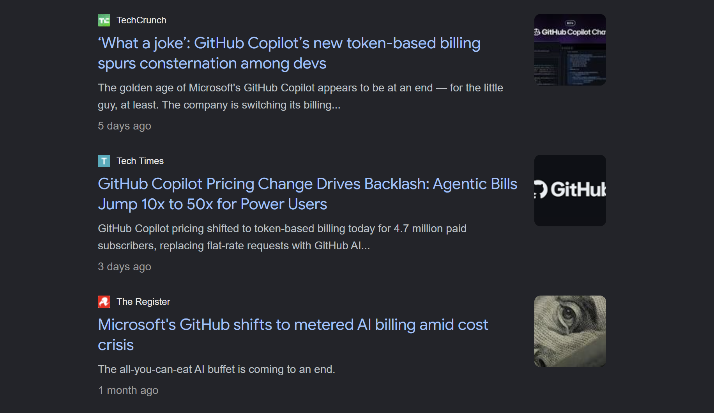
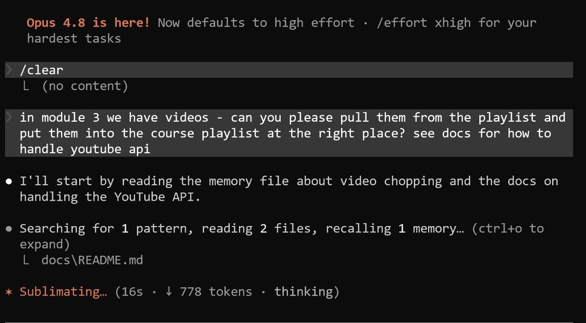

# Setting Up Your Coding Agents

There is no shortage of getting-started material for coding agents.

Anthropic ships a free [Claude Code 101](https://anthropic.skilljar.com/claude-code-101) course and full [docs](https://code.claude.com/docs/en/overview). OpenAI has a [Codex Quickstart](https://developers.openai.com/codex/quickstart).

However, people continue asking me over and over again how to get started with coding assistants. I'm usually puzzled when I hear it. To me it's obvious: you just install it and start using it.

But when I think about it, I realize that it's not the real question that people ask. What they ask is probably closer to "How do I configure Claude Code properly with the right model and the right permissions, and use all the slash commands, skills, subagents, plugins and the MCP servers? Should I run it locally or in Docker or remotely? How do I configure it to run on my phone? And what about all these tricks that people post on X every day, like the Ralph loop, or running a team of agents? Show me exactly which buttons to press and in which order."

And that's a very different question. 

I understand where this is coming from. Open X and you see an endless stream of people sharing what they built and the tricks they used. I also realize that I contribute to that stream with this newsletter.

Of course, this creates FOMO and the desire to know everything before you even start.

## Choosing where to start

In this article I want to show a simple "from zero to hero" path. The main idea is that you don't need to know everything at once - or you risk getting even more confused.

Instead, start simple, and use AI to solve the actual problems you have. Over time you will discover the workflow that fits you.

So this article is not a catalog of everything that exists, but a path you can actually follow.

This path is:

1. pick an assistant
2. start using it directly, without any extra setup
3. document your processes
4. turn repetitive tasks into skills
5. use subagents for context-heavy tasks

Work through them in order, and don't move on until the current step feels natural. That gives you all the foundation you need to be productive with AI assistants[^7].

## Step 1: Choose an assistant

There are many AI coding assistants:

- Claude Code
- Codex
- OpenCode
- GitHub Copilot
- Antigravity
- Cline

The first step is picking one of these tools and starting to use it.

I used to recommend GitHub Copilot: for $10/month you could get quite far. That is no longer the case. With Antigravity's free plan you could also do a lot, but not anymore[^7].

<figure>
  
  <figcaption>GitHub Copilot's shift from a flat ten-dollar plan to token-based billing - bills jumping 50x</figcaption>
</figure>

Right now the best value is the $20/month ChatGPT Plus subscription, which includes Codex. OpenCode is another decent place to start.

With Anthropic, the $20 plan won't get you far - you hit the limits quickly. For Claude you'd need to start from the $100 one.

The tools are different, and I cannot say one is clearly better than another. At first, just pick the one that fits your budget[^7].

## Step 2: Solve a task with the assistant

After picking a coding agent, start using it. Give it a task you can do end-to-end and then check:

- write a Python or bash script
- solve homework from a course
- build a mini-project like the snake game we did in [AI Dev Tools Zoomcamp](https://github.com/DataTalksClub/ai-dev-tools-zoomcamp)
- fix a small problem you have

You don't need MCPs, skills, or subagents yet. The goal at this stage is to see that the agent can actually solve real problems for you, and to learn how you want to use it.


## Permissions

When you start, the agent asks for permission on every action, and it gets annoying fast.

You have two options:

- Build an allow-list of approved actions: every time the agent prompts you, say "yes and don't ask me again for this action".
- Run the agent in skip-permissions mode (YOLO mode).

In YOLO mode the agent can run any command executable from your terminal. You have to understand the risks, but sometimes speed matters more than control - you want to hand the agent a task for the night and walk away without approving every single step[^10].

I run most of my projects in YOLO mode. For serious tasks I use the allow-list approach instead - for example, when I'm setting up infrastructure for production. If I need to do something like Terraform, I never use YOLO[^11].

There is no universal rule. It depends on how much you want to be in control and how much the result matters to you. YOLO mode is faster, but if the agent decides to delete something, it will[^12].

## Use agents for automation, not only coding

I had been using agents for coding for long time and they were incredibly useful. But I only understood how valuable they actually are when I started using them to automate tasks[^14].

For example, right now I'm preparing the videos for [LLM Zoomcamp](https://github.com/DataTalksClub/llm-zoomcamp).

I need to download the videos from YouTube, cut them into separate chunks, and upload them back as individual videos. On top of that, I want each video to have timecodes, so I download the subtitles and turn them into chapters.

I delegate most of this to Claude. I only need to:

- check that the cuts are clean
- bulk-upload the videos (the YouTube API is awkward for that)
- hit Save so each video goes from draft to published (no API for that either)

The rest is on Claude: it sees the uploaded videos, pulls their IDs, updates the title and description, adds the timecodes, and puts them into the playlist in the right order[^14][^42].

The setup was simple: I described what I needed. It found the video links, downloaded them, fetched the transcripts, cut the videos with ffmpeg, and walked me through setting up YouTube API access. After that I checked the cuts and uploaded the videos.

Over the last year I have automated many things in my workflow this way:

- creating homework submission forms for [courses.datatalks.club](https://courses.datatalks.club/)
- creating GitHub repositories
- publishing new versions of the libraries I maintain

If there's an API for a service or a command-line tool, an AI agent can figure out how to use it and automate the work from the terminal[^16].


## Step 3: Document your processes

Once you figure out how to automate something, the next step is to document it - especially when you know you'll need it again.

Usually I work with the agent until the task is done, and then I ask it to document everything to a markdown file. The LLM Zoomcamp docs for cutting YouTube videos live [here](https://github.com/DataTalksClub/llm-zoomcamp/tree/8c1834d114754cc0e0d65544b8589ef7d94b81cf/docs).

Next time I can just point the agent at the doc. When I needed to add more videos to the LLM Zoomcamp playlist, that's exactly what I did.

<figure>
  
  <figcaption>Automating YouTube playlist management - the agent is told to pull the module videos and place them in the course playlist at the right spot, pointed at the docs for the API</figcaption>
</figure>

Without a doc, the agent has to start from scratch and burn time (and tokens) figuring out how to solve the problem again.

For YouTube that may not matter much - there is plenty of information online and the agent already knows a lot. But for less common workflows it doesn't have the context.

For example, I use agents to publish homework to [courses.datatalks.club](https://courses.datatalks.club/). To do that, the agent needs to know:

- the production URL
- where the API key lives
- what's available in the API
- the exact payload shape
- what to do when things go wrong

Without a doc, you have to explain all of this every single time.

## Step 4: Turn repetitive tasks into skills

Once you have a document, you can turn it into a skill.

A skill is a markdown file saved in a specific folder with a specific name.

For Claude Code that location is `.claude/skills/<skill-name>/SKILL.md`, for Codex it's `.codex/skills/<skill-name>/SKILL.md`.

The file needs YAML frontmatter with a `name` and a `description` - that's the only required part. Here's an example from my [course-management-agent](https://github.com/alexeygrigorev/course-management-agent) repo:

```markdown
---
name: course-content
description: Manage courses, homeworks, and projects via REST API
---

# Course Content API

## Overview

This skill provides commands to manage courses, homeworks, and projects via the REST API. Supports list, create, update state/dates/description, and guarded delete.
```

Once the file is in the right place, the agent picks it up automatically. With a skill in place I can throw a request at Claude as is - "here is the homework, upload it" - and the agent recognizes which skill fits, loads it, and does the rest. Without one, I'd have to point at the docs every single time.

You don't have to write skills by hand and figure out the folder layout yourself. Just ask the agent to document the process and turn it into a skill.

Both Claude Code and Codex ship a built-in skill for making skills, so they put the file in the right place and in the right format[^18].

If you're wondering whether something should become a skill, don't overthink it. Document what you do at the end of each coding session, and if you come back to that doc repeatedly, turn it into a skill.

For a more structured take, Anthropic recently published [Lessons from building Claude Code: How we use skills](https://claude.com/blog/lessons-from-building-claude-code-how-we-use-skills).


## Step 5: Use subagents

As you work with an agent, every question and answer accumulates in its context. Eventually the context fills up and quality drops[^21][^22].

I first realized how useful subagents are while setting up this Telegram writing assistant. It works like this:

- I send it a lot of content - voice notes, text messages, links, videos
- I run `/process` from Telegram when I want Claude to turn the pile into articles

The `/process` command is a [skill](https://github.com/alexeygrigorev/telegram-writing-assistant/blob/master/process/process.md) that describes how to turn the input into articles. 

Imagine I send this:

- ten voice notes that should turn into two or three articles
- a tweet I liked and want to save
- a three-hour YouTube video I want to summarize

I run `/process` and the agent has to handle all of it in the same context.

The three-hour transcript pollutes everything the model has been working on - the article it was drafting gets worse, the summary comes out poorly, and there's no clean way to continue afterward[^23][^24][^25].

One way out is to process the simple items first and launch a separate session for the YouTube video later.

The better way is for the main agent to spin up a subagent for the heavy task. The subagent gets one specific instruction to "summarize this transcript". Then runs in its own context, saves the result, and reports back. The main agent only sees "started" and "finished", so its context stays clean[^25].

TODO: finish

## The path from zero to hero

That covers the essentials: start using the agent, turn repeated tasks into skills, and reach for subagents when context becomes a problem. If you go through these steps in order, you can already do almost anything with it. The order matters - if you start with subagents, you may never figure out the simpler pieces[^27].

There are a couple more tricks worth mentioning before the end.

## Project context files (CLAUDE.md and AGENTS.md)

In your own projects you should always create a CLAUDE.md (read by Claude Code) and an AGENTS.md (read by Codex and OpenCode). The agent reads these every time it starts - that is where the description of the project lives and the things the agent needs to know. It saves you from explaining the project from scratch each session, and it saves the agent from crawling through the whole repository to figure things out[^28].

## Reset (or new) to keep the context clean

The subcommand I use most often is the one that resets the session - called `reset` or `new` depending on the agent. Every new task starts with a clean context, so only what is important lands in it. This is exactly where a good CLAUDE.md or AGENTS.md matters: it makes starting from a clean slate painless[^28].

## Goal: keep the agent working until it is done

The other command I use actively right now is `goal`. You give the agent a completion condition in plain language - "all tests pass and the lint step is clean" - and it keeps starting new turns on its own until the condition is met. It is the productized version of the Ralph Loop: a loop that feeds the same prompt to a fresh agent over and over, with progress accumulating in files and git history rather than in the model's context[^28][^29].

Codex shipped it first. Claude Code added a near-identical version shortly after, with a separate small evaluator model that checks after each turn whether the condition is satisfied and, if not, sends back guidance and starts another turn. It pairs well with skip-permissions mode so each turn runs without approval prompts. Official references: [Claude Code goal docs](https://code.claude.com/docs/en/goal) and [Codex follow-goals docs](https://developers.openai.com/codex/use-cases/follow-goals). This used to require a plugin in Claude Code, but now it is built in[^29][^35].

The one real caveat is cost and runaway risk. Each turn costs two model calls (the main turn plus the validator), and there is no hard spending cap by default. Phrase the end state as something binary and machine-checkable, name the verification command explicitly, and bake a turn limit into the condition[^29].

Beyond `reset` and `goal`, I do not use any other subcommands[^30].

## My setup: the .claude dotfiles repo

To make this concrete, my own setup lives in a public repository: [github.com/alexeygrigorev/.claude](https://github.com/alexeygrigorev/.claude). Despite the name, it bootstraps and configures all three agents from one shared clone, so every machine and every assistant ends up with the same setup[^31][^32].

The structure:

- An installer script clones the repo and a configure script wires everything into the right home-directory locations. The configure step takes a target (claude, codex, opencode, or all).
- A `config/` folder holds per-assistant settings: `settings.json` for Claude and OpenCode, `config.toml` for Codex.
- A `skills/` folder holds the shared skills, symlinked into each assistant so all three share them. Examples: create-github-repo, fetch-youtube, fetch-loom, fetch-google-recorder, init-library, jina-reader, openai-transcribe, regular-ping, release, setup-pypi-ci, stylint.
- A shared `.bashrc` is sourced from the repo, so a git pull propagates new aliases and functions. It defines the short aliases I use daily - `c` for claude, `cc` for continue-session, `csp` for claude with skip-permissions, `cy` for codex in bypass mode, and an `oc` function for OpenCode.

The repo also encodes the safety guardrails I mentioned in the permissions section. The Claude settings register a PreToolUse hook that blocks dangerous commands (`rm -rf /`, force pushes, dropping a database, `terraform apply`) unless confirmed. The `oc` function strips a denylist of provider API-key environment variables before launching, so leaked credentials never reach the agent[^31].

## Sources

[^1]: [20260604_145544_AlexeyDTC_msg4359_transcript.txt](../inbox/used/20260604_145544_AlexeyDTC_msg4359_transcript.txt)
[^2]: [20260604_145558_AlexeyDTC_msg4361_transcript.txt](../inbox/used/20260604_145558_AlexeyDTC_msg4361_transcript.txt)
[^3]: [20260604_145702_AlexeyDTC_msg4363_transcript.txt](../inbox/used/20260604_145702_AlexeyDTC_msg4363_transcript.txt)
[^4]: [20260604_154535_AlexeyDTC_msg4369_photo.md](../inbox/used/20260604_154535_AlexeyDTC_msg4369_photo.md)
[^5]: [20260604_154535_AlexeyDTC_msg4370_photo.md](../inbox/used/20260604_154535_AlexeyDTC_msg4370_photo.md)
[^6]: [20260604_154536_AlexeyDTC_msg4371_transcript.txt](../inbox/used/20260604_154536_AlexeyDTC_msg4371_transcript.txt)
[^7]: [20260604_155257_AlexeyDTC_msg4375_transcript.txt](../inbox/used/20260604_155257_AlexeyDTC_msg4375_transcript.txt)
[^8]: [20260604_155424_AlexeyDTC_msg4377_transcript.txt](../inbox/used/20260604_155424_AlexeyDTC_msg4377_transcript.txt)
[^9]: [20260604_155513_AlexeyDTC_msg4379_transcript.txt](../inbox/used/20260604_155513_AlexeyDTC_msg4379_transcript.txt)
[^10]: [20260604_160026_AlexeyDTC_msg4381_transcript.txt](../inbox/used/20260604_160026_AlexeyDTC_msg4381_transcript.txt)
[^11]: [20260604_160117_AlexeyDTC_msg4383_transcript.txt](../inbox/used/20260604_160117_AlexeyDTC_msg4383_transcript.txt)
[^12]: [20260604_160204_AlexeyDTC_msg4385_transcript.txt](../inbox/used/20260604_160204_AlexeyDTC_msg4385_transcript.txt)
[^13]: [20260604_160325_AlexeyDTC_msg4387_transcript.txt](../inbox/used/20260604_160325_AlexeyDTC_msg4387_transcript.txt)
[^14]: [20260604_160723_AlexeyDTC_msg4389_transcript.txt](../inbox/used/20260604_160723_AlexeyDTC_msg4389_transcript.txt)
[^15]: [20260604_160940_AlexeyDTC_msg4391_transcript.txt](../inbox/used/20260604_160940_AlexeyDTC_msg4391_transcript.txt)
[^16]: [20260604_161327_AlexeyDTC_msg4393_transcript.txt](../inbox/used/20260604_161327_AlexeyDTC_msg4393_transcript.txt)
[^17]: [20260604_161537_AlexeyDTC_msg4395_transcript.txt](../inbox/used/20260604_161537_AlexeyDTC_msg4395_transcript.txt)
[^18]: [20260604_161907_AlexeyDTC_msg4397_transcript.txt](../inbox/used/20260604_161907_AlexeyDTC_msg4397_transcript.txt)
[^19]: [20260604_162008_AlexeyDTC_msg4399_transcript.txt](../inbox/used/20260604_162008_AlexeyDTC_msg4399_transcript.txt)
[^20]: [20260604_162037_AlexeyDTC_msg4401_transcript.txt](../inbox/used/20260604_162037_AlexeyDTC_msg4401_transcript.txt)
[^21]: [20260604_162151_AlexeyDTC_msg4403_transcript.txt](../inbox/used/20260604_162151_AlexeyDTC_msg4403_transcript.txt)
[^22]: [20260604_162254_AlexeyDTC_msg4405_transcript.txt](../inbox/used/20260604_162254_AlexeyDTC_msg4405_transcript.txt)
[^23]: [20260604_163158_AlexeyDTC_msg4407_transcript.txt](../inbox/used/20260604_163158_AlexeyDTC_msg4407_transcript.txt)
[^24]: [20260604_163639_AlexeyDTC_msg4409_transcript.txt](../inbox/used/20260604_163639_AlexeyDTC_msg4409_transcript.txt)
[^25]: [20260604_163843_AlexeyDTC_msg4411_transcript.txt](../inbox/used/20260604_163843_AlexeyDTC_msg4411_transcript.txt)
[^26]: [20260604_164159_AlexeyDTC_msg4413_transcript.txt](../inbox/used/20260604_164159_AlexeyDTC_msg4413_transcript.txt)
[^27]: [20260604_164402_AlexeyDTC_msg4415_transcript.txt](../inbox/used/20260604_164402_AlexeyDTC_msg4415_transcript.txt)
[^28]: [20260604_212206_AlexeyDTC_msg4421_transcript.txt](../inbox/used/20260604_212206_AlexeyDTC_msg4421_transcript.txt)
[^29]: [20260604_212216_AlexeyDTC_msg4423_transcript.txt](../inbox/used/20260604_212216_AlexeyDTC_msg4423_transcript.txt)
[^30]: [20260604_212249_AlexeyDTC_msg4425_transcript.txt](../inbox/used/20260604_212249_AlexeyDTC_msg4425_transcript.txt)
[^31]: [20260604_212310_AlexeyDTC_msg4427_transcript.txt](../inbox/used/20260604_212310_AlexeyDTC_msg4427_transcript.txt)
[^32]: [20260604_212340_AlexeyDTC_msg4429.md](../inbox/used/20260604_212340_AlexeyDTC_msg4429.md)
[^33]: [20260604_212423_AlexeyDTC_msg4431_transcript.txt](../inbox/used/20260604_212423_AlexeyDTC_msg4431_transcript.txt)
[^34]: [20260604_213015_AlexeyDTC_msg4436_transcript.txt](../inbox/used/20260604_213015_AlexeyDTC_msg4436_transcript.txt)
[^35]: [20260604_213120_AlexeyDTC_msg4437_transcript.txt](../inbox/used/20260604_213120_AlexeyDTC_msg4437_transcript.txt)
[^36]: [20260605_040543_AlexeyDTC_msg4441.md](../inbox/used/20260605_040543_AlexeyDTC_msg4441.md)
[^37]: [20260605_040700_AlexeyDTC_msg4443_transcript.txt](../inbox/used/20260605_040700_AlexeyDTC_msg4443_transcript.txt)
[^38]: [20260605_040737_AlexeyDTC_msg4445_transcript.txt](../inbox/used/20260605_040737_AlexeyDTC_msg4445_transcript.txt)
[^39]: [20260605_052456_AlexeyDTC_msg4451.md](../inbox/used/20260605_052456_AlexeyDTC_msg4451.md)
[^40]: [20260605_052621_AlexeyDTC_msg4452.md](../inbox/used/20260605_052621_AlexeyDTC_msg4452.md)
[^41]: [20260605_052657_AlexeyDTC_msg4453.md](../inbox/used/20260605_052657_AlexeyDTC_msg4453.md)
[^42]: [20260605_052249_AlexeyDTC_msg4450_photo.md](../inbox/used/20260605_052249_AlexeyDTC_msg4450_photo.md)
