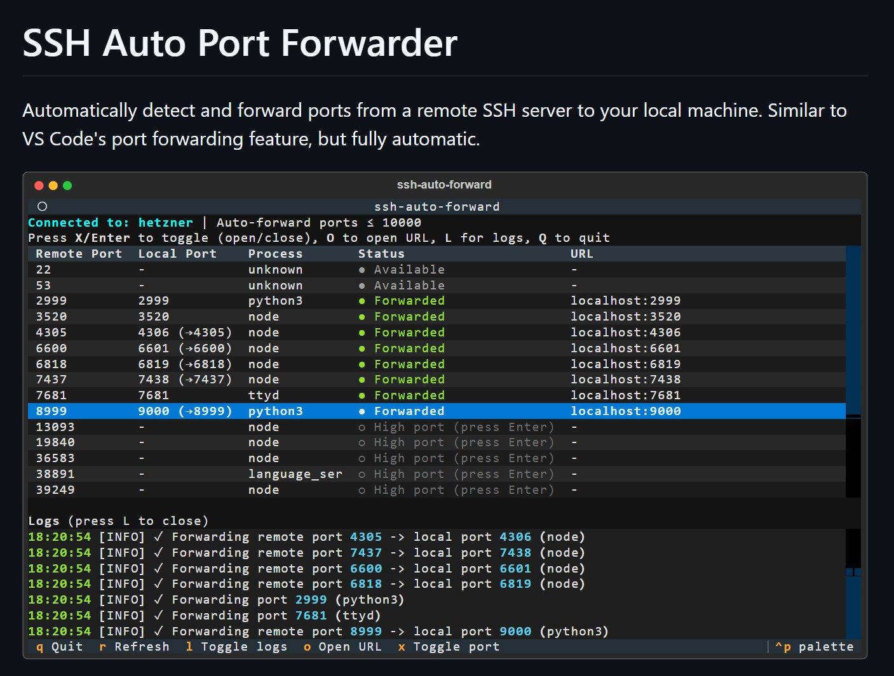

# SSH Auto Forward: Automatic Port Forwarding Tool

GitHub: [alexeygrigorev/ssh-auto-forward](https://github.com/alexeygrigorev/ssh-auto-forward)

I built an automatic SSH port forwarding tool with Claude Code. The tool connects to a remote machine via SSH, detects open ports, and automatically forwards them to localhost. This article describes why I needed it and how I built it[^3].

## The Remote Development Setup

I set up a fully remote development environment on Hetzner. I connect through VS Code Remote SSH and do everything I need there. This is great - my environment is always ready, I can access it from any computer[^1].

But some things in my course workflow used to require local access. For example, I had a flow where I would give Claude Code three things: a commit ID, a Loom video link, and a path to the downloaded transcript. Based on this, Claude would either create a new documentation file for a lesson or update an existing one. Sometimes these are files where I keep notes for myself. The task was to take all of this, analyze the transcript, analyze the code I implemented, and either write everything from scratch or update existing code[^1].

## Adapting the Course Workflow to Remote

Since I cannot download Loom transcripts locally on the remote server (the browser runs locally, the Downloads folder is local), I told Claude: "Here is a Loom link, figure out how to download subtitles from there." Claude thought about it and figured it out. Then I said: "Now write a Python script that outputs the video title first, then the full transcript." I also asked it to clean up the transcript - the original format was very verbose and burned a lot of tokens. I asked for a more compact format and to remove fillers like "um," "ah" using a simple regex[^1].

This actually simplified my process. One step got removed entirely. Now I just give a commit link and a Loom link, and Claude Code handles everything. The new constraint (working remotely) actually led to a simpler process. I would not have even thought to do this before. But now, because I want to do this kind of work on the remote server so I can access it from any computer with a ready environment, this setup helps[^1].

## The Need for Port Forwarding

I use codegen templates - I have already talked about them before. These are templates where I do not write code directly in markdown. Instead, I reference either a Jupyter notebook or a Python file, and the template system pulls code from there. Then it renders the markdown document. I do this for two reasons: first, I want the code to be exactly the same as what I write during the video. The best way to achieve this is to use the actual code I wrote. Second, I want the code to execute. I add verification - I check that the notebook runs, or that the scripts run without syntax errors. This is not full testing, but at least the code executes. It is an extra layer of protection. I used to have a problem where the code in the documentation was different from the code in the video. With codegen templates, this does not happen[^2].

The tool is called codegen-template. It is currently internal, purely for the course. I could not find anything like what I needed, so I built my own. I plan to polish it and release it separately someday[^2].

After the template generates a markdown document, I need HTML so I can copy it into Maven (the course platform). This last step - copying to Maven - I still do not know how to automate. Maybe browser automation would work, but for now I copy manually. Markdown to HTML, then Ctrl+A, Ctrl+C, paste into Maven, embed the video - there are still many manual steps[^2].

The key problem: I need this content accessible in my local browser. I need to open the HTML document and copy its contents. On the remote server, I built a small program that automatically starts a web server serving all these HTML documents, so I can open a browser and access them. But the firewall blocks all ports (this is intentional for security). Only port 22 (SSH) is accessible from outside[^2].

VS Code Remote SSH handles this - it detects open ports and lets you forward them, sometimes automatically (like in GitHub Codespaces). But I wanted the same thing without VS Code - just in the terminal. So I asked Claude Code to write a program that does exactly this: connects via SSH to my machine, detects open ports, and automatically forwards them to localhost[^2].

Very convenient. I type `ssh-tunnel hetzner` in the terminal and everything that is open on the remote machine becomes available in my local browser. All of this - and it is a long story - is just so I can copy my article with Ctrl+C, Ctrl+V. And the best part is that I am not very actively involved - I just say what to do, then later check the results[^2].

## Building It with Claude Code

I was busy with other things. While I could manually forward the port, I did not need the application right away. It was more of a future wish for automation. But while I was working on the course and copying content, I just went ahead and built it in parallel[^3].

I dictated the requirements. Claude Code started working, said "all done, check it." I said "No - you check it. Run it yourself, iterate until it works." Naturally it did not work on the first try. Claude iterated, got it somewhat working, said it was ready. I looked and said it needed changes[^3].

I specified additional requirements. For example, I wanted the tool to forward to the same local port number if that port is free. If the local port is busy, increment by one until finding a free one - the same logic VS Code uses. After the initial implementation I had to tell Claude this explicitly. It connects via SSH, auto-forwards ports, and I could verify with curl on the forwarded port[^3].

A few more feature requests came up as I used it:

- I wanted to see what process is running on each port. Instead of just "forwarding port 3000," the tool should show what is actually running there
- I wanted the terminal tab to display the process name. Instead of just showing something generic like "mingw-64," the tab should say what process is behind the connection. I honestly do not know how this works technically, but Claude just did it[^3].

First the implementation was on Hetzner directly. Then I said: "We do not need Hetzner for this, let us build it all in Docker." Claude is now building the Docker version, but the tool already works and I can use it[^3].

I worked on it in parallel with other tasks. About every 30 minutes I would check in, give some commands, then continue with my other work. In the end I have a working application[^3].

## Released on PyPI

The tool is now published on GitHub and PyPI. It can be run directly via `uvx ssh-auto-forward hetzner` where `hetzner` is the server name from SSH config[^4][^5].

<figure>
  
  <figcaption>The SSH Auto Forward dashboard - connected to Hetzner, showing forwarded ports with process names and local URLs</figcaption>
  <!-- Screenshot of the tool running, showing the TUI with port list, process info, and log panel -->
</figure>

Features of the released version:

- Interactive TUI dashboard with port list, process names, and log panel
- Auto-discovers listening ports on remote servers via `ss -tlnp`
- Forwards ports via SSH tunneling, handles port conflicts by incrementing
- Skips well-known ports (< 1000), configurable max auto-forward port (default: 10000)
- Dashboard controls: X/Enter to toggle ports, O to open URL in browser, L for logs, Q to quit
- Also supports CLI mode (`--cli`) for non-interactive use[^4]

## Why Build Instead of Search

I did not even check if such a tool already exists. A few reasons:

- I wanted something maximally customized for my needs. I probably would not find exactly what I want
- I wanted to practice AI-assisted development skills. I have tokens, might as well use them
- The code is interesting - I have never done this kind of system/networking programming before. I have no idea what Python libraries are involved
- Since it is written in Python, it is cross-platform. I can run it on my Windows laptops and on my ARM64 Windows tablet. Many compiled binaries do not run on ARM64 Windows because they are built for AMD64. Python scripts work everywhere[^3]

The flow is great. I start a session, dictate what I want, and it gets built. Ideas often come on the go when I am not at a computer. Now I have a way to act on them. I am leveling up my AI-assisted development skills in the process[^3].

## Sources

[^1]: [20260220_140034_AlexeyDTC_msg2150_transcript.txt](../inbox/used/20260220_140034_AlexeyDTC_msg2150_transcript.txt)
[^2]: [20260220_140646_AlexeyDTC_msg2152_transcript.txt](../inbox/used/20260220_140646_AlexeyDTC_msg2152_transcript.txt)
[^3]: [20260220_141400_AlexeyDTC_msg2154_transcript.txt](../inbox/used/20260220_141400_AlexeyDTC_msg2154_transcript.txt)
[^4]: [20260220_172712_AlexeyDTC_msg2172_photo.md](../inbox/used/20260220_172712_AlexeyDTC_msg2172_photo.md)
[^5]: [20260220_173002_AlexeyDTC_msg2174_transcript.txt](../inbox/used/20260220_173002_AlexeyDTC_msg2174_transcript.txt)
