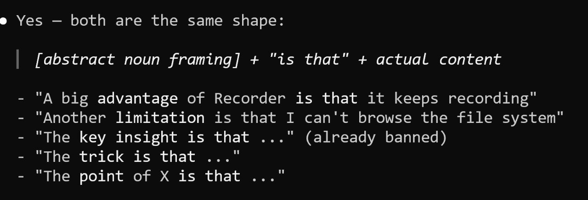

# Stylint: Enforcing My Writing Style on AI Assistants

I started a new project for fixing styling problems in LLM-generated text. It lives at [github.com/alexeygrigorev/stylint](https://github.com/alexeygrigorev/stylint) [^1] [^6].

## Why Style Files Stopped Working

I write a lot. Take AI Engineering Buildcamp as an example. My process there is to prepare the material first. Then I record videos based on the material. Then I update the material based on the videos. There is a lot of text on top of that.

I follow the same process for workshops. Prepare text, record a video, update the workshop content from the recording.

For the course, I ended up with a style file in the repo. Originally it was a Telegram-style guide. The file kept growing over time. It had repetitions. Formatting rules accumulated alongside style rules.

Agents started skipping some rules. They probably ran out of context, or something similar. Some rules say "you need to do X here" and there are many other rules. They would forget some of them [^2].

There was another problem. I have many projects, and each one had its own style document. When I merged projects, I ended up with a huge pile of style documents. They were hard to keep in sync.

One more piece. Claude Code writes text in one style. OpenAI Codex writes in a different style. OpenCode is different again. Each agent needs different editing. I did not want a separate style guide for each tool. I wanted all of them to follow the same process.

All these style rules accumulated in one place and ate up a lot of context.

## Encoding Rules in a Script

While preparing a workshop for AI Shipping Labs, I tried something different. Instead of feeding markdown documents to the agent, what if I encoded the patterns in a Python script?

The agent would not read the file and edit based on what it read. It would run a script. The script would point out places that need fixing. It finds the words I do not like. It finds the constructions I do not like. It reports them as places to fix [^3].

I tried it and liked it. I did more and more of it. The project grew large enough that it was time to extract it. I moved it out of the workshop repo and into its own library. The name came as Style Linter, and the library is Stylint.

## Two Components

Stylint has two components.

The first is deterministic. Anywhere a rule can be expressed with regex or other patterns, the linter pulls it out of the text. It reports it for a fix.

The second is less deterministic. It is a set of markdown documents that capture the rules a script cannot enforce.

I want the markdown side to be minimal - just data. All the logic stays in the code. The LLM does not need to read the code and burn tokens on it. It runs the script and follows the recommendations. The script tells it that a paragraph is too long and should be replaced with a list, for example [^4].

The deterministic side lives in `stylint/patterns.py` and `stylint/rules/`. It catches things like:

- Banned words such as `delve`, `crucial`, `pivotal`, `leverage`, `vibrant`
- Banned phrases like `in order to`, `the goal is`, `the key insight`, `low-hanging fruit`
- Long sentences over 20 words without commas
- Paragraphs over 5 sentences
- Code blocks over 40 lines
- Headings that lead with `Why`, `How`, or `What`
- Bold and italic markers
- Em dashes used for dramatic effect
- Abstract noun framing patterns like `The key insight is that...` and `Another limitation is that...`

The markdown side lives in `style-guide/`:

- `voice.md` - tone, first person, plain reader-facing verbs
- `formatting.md` - markdown mechanics
- `code-style.md` - educational example-code style
- `polish.md` - the judgment-level prose pass

These hold rules that a script cannot mechanically check.

## Abstract Noun Framing

One of the patterns the linter catches is what I call abstract noun framing. The shape is `[abstract noun framing]` + `"is that"` + actual content. Examples:

- `A big advantage of Recorder is that it keeps recording`
- `Another limitation is that I can't browse the file system`
- `The key insight is that ...` (already banned)
- `The trick is that ...`
- `The point of X is that ...`

These are all the same shape. They puff up the surrounding sentence. They add an abstract noun where the actual content should lead. The linter flags them as `meta-framing` so they get rewritten into direct statements [^5].

<figure>
  
  <figcaption>Teaching my agents to write in the style I like - abstract noun framing patterns the linter now catches</figcaption>
</figure>

## Outcomes in Practice

I applied Stylint to the corporate jargon section of my workshop. It is not a perfect solution. In most cases when a pattern fires - call it 90% - the text gets better. In some cases it does not change. Rarely does it get worse. The text wins on average.

I could write many of these passages better myself. I do not have enough time for that. Good enough text that needs less polishing wins. A perfect text takes me a lot of time [^4].

## Using the CLI

The CLI is small:

- `stylint` runs the linter on the current directory
- `stylint path/to/post.md` runs it on a single file
- `stylint --list-tags` lists all the rule categories
- `stylint --ignore tables,long-clause-likely docs/` skips specific tags for a directory

A non-zero exit code marks any finding. That makes it work as a pre-commit hook or CI step.

## Code Over Markdown

The motivation for moving rules into code:

1. Context size. A long markdown style guide eats tokens and an agent will start skipping rules.
2. Repetition. Different projects had similar style documents drifting out of sync.
3. Cross-agent consistency. Claude Code, OpenAI Codex, and OpenCode each have their own style and need a shared enforcement layer.
4. Deterministic vs judgment. Most style errors are mechanical. They include things like a banned word, a long paragraph, or a wrong heading shape. Pattern-matching catches them faster than asking an LLM to reread the rules each time.

The markdown side stays for the rules that need judgment. The code side handles everything that can be enforced mechanically.

## Sources

[^1]: [20260517_092031_AlexeyDTC_msg4152.md](../inbox/used/20260517_092031_AlexeyDTC_msg4152.md) - link to the stylint repo
[^2]: [20260517_095514_AlexeyDTC_msg4154_transcript.txt](../inbox/used/20260517_095514_AlexeyDTC_msg4154_transcript.txt) - voice note on style file growth and agent skipping rules
[^3]: [20260517_095638_AlexeyDTC_msg4156_transcript.txt](../inbox/used/20260517_095638_AlexeyDTC_msg4156_transcript.txt) - voice note on the workshop experiment that grew into Stylint
[^4]: [20260517_095902_AlexeyDTC_msg4158_transcript.txt](../inbox/used/20260517_095902_AlexeyDTC_msg4158_transcript.txt) - voice note on the two components and outcomes
[^5]: [20260517_091955_AlexeyDTC_msg4150_photo.md](../inbox/used/20260517_091955_AlexeyDTC_msg4150_photo.md) - abstract noun framing notes
[^6]: [20260517_095939_AlexeyDTC_msg4160_transcript.txt](../inbox/used/20260517_095939_AlexeyDTC_msg4160_transcript.txt) - voice note requesting this article be created
