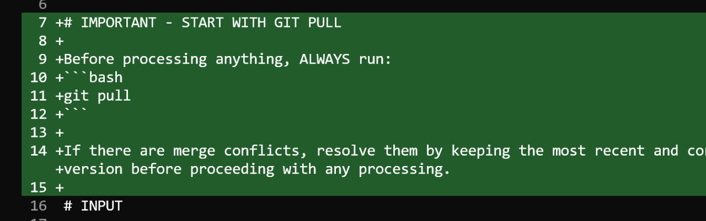

# Telegram Writing Assistant

A personal knowledge management system where you send thoughts to Telegram (text, voice, images, files) and a bot saves everything locally, processes it, and organizes it into articles.

## Core Idea

<figure>
  
  <figcaption>A visual summary of the system workflow from sending thoughts to organizing into articles</figcaption>
  <!-- This illustrates the high-level concept of the system -->
</figure>

I usually do brain dumps in the form of voice messages in Telegram. This needs to be organized. The idea is to transcribe these voice messages and add the transcription to some file. As voice messages accumulate, there may be several articles, and from each of these files there will be some article. It will gradually be filled and filled. Then, when the article is finished, we simply remove that article.

## Origin Story

The idea for this system came after realizing that writing articles took a long time because there were many messages that needed to be read and organized. It was essentially a brain dump that needed to be organized into articles. The challenge was that there was a lot of information.

I thought about how I would want to process an incoming stream of information. The approach would be to analyze the information and update existing articles or notes based on that information. One by one, everything would be processed.

The initial workflow concept was:
- An input pool of tasks
- Telegram messages transcribed
- Images and messages organized into the input pool
- An agent processes everything and lays it out into articles

Instead of doing this manually, I wanted an agent to handle the organization. I iterated on this idea with ChatGPT, recording voice messages and reviewing responses. At the end, I would ask to save our conversation to a file called summary.md. That file, which is in the repository, concisely described what was needed. I used that file as the basis for implementing everything in code and asked the code to analyze what was inside.

## Workflow

1. Send materials to Telegram bot (text, voice, images, files)
2. Bot saves everything locally to inbox/raw/
3. Run /process command to organize materials
4. Claude analyzes accumulated materials
5. Updates existing articles or creates new ones
6. Commits to GitHub
7. Sends commit link back to Telegram

## File Processing

The bot can now process files in addition to text, voice, and images. When a file is sent to the bot, it saves the file and creates an accompanying markdown file with metadata including the original filename, caption, and content. This allows the processor to incorporate file contents into articles[^1].

## Language Handling

The agent can understand any messages regardless of language. When I record a voice message, I want the agent to understand where to add the material from this voice message, into which existing article it relates.

I usually write texts in English, I have a Substack where I write in English. For voice notes, it's sometimes easier for me to speak in Russian. Since we usually communicate in Russian with Valeria, voice messages are also in Russian.

Target language for articles is English. Voice messages can be in any language, but articles should only be in English. When processing, Claude should translate everything to English.

## Git as Process Orchestrator

The entire workflow is built around Git as the central orchestrator. Git serves as the storage layer and provides centralized management for all content[^2].

<figure>
  
  <figcaption>The processing command always starts with git pull to ensure the latest changes are incorporated before any work begins</figcaption>
  <!-- This illustrates how the agent self-manages its workflow through git -->
</figure>

Using Git for everything offers several advantages:

- All changes are visible through version control
- When the `/process` command fills in content, a diff is generated showing exactly what changed
- Everything is transparent and trackable

The workflow is designed to be process-driven rather than code-heavy. Instead of hardcoding steps, you can simply describe the process in natural language and Claude executes it. For example, you can say "please do a pull" and it will execute `git pull`, then commit everything in the proper format automatically[^2].

## Sources
- [20260116_210119_AlexeyDTC_transcript.txt](../inbox/raw/20260116_210119_AlexeyDTC_transcript.txt)
- [20260116_210336_AlexeyDTC_transcript.txt](../inbox/raw/20260116_210336_AlexeyDTC_transcript.txt)
- [20260116_205911_AlexeyDTC_photo.md](../inbox/used/20260116_205911_AlexeyDTC_photo.md)
- [20260117_064726_AlexeyDTC_transcript.txt](../inbox/raw/20260117_064726_AlexeyDTC_transcript.txt)
- [20260117_071038_AlexeyDTC_transcript.txt](../inbox/raw/20260117_071038_AlexeyDTC_transcript.txt)
- [20260122_155237_AlexeyDTC_msg397.md](../inbox/raw/20260122_155237_AlexeyDTC_msg397.md)
- [20260123_144250_AlexeyDTC_msg558_transcript.txt](../inbox/raw/20260123_144250_AlexeyDTC_msg558_transcript.txt)

[^1]: [20260122_155237_AlexeyDTC_msg397.md](../inbox/raw/20260122_155237_AlexeyDTC_msg397.md)
[^2]: [20260123_144250_AlexeyDTC_msg558_transcript.txt](../inbox/raw/20260123_144250_AlexeyDTC_msg558_transcript.txt)
