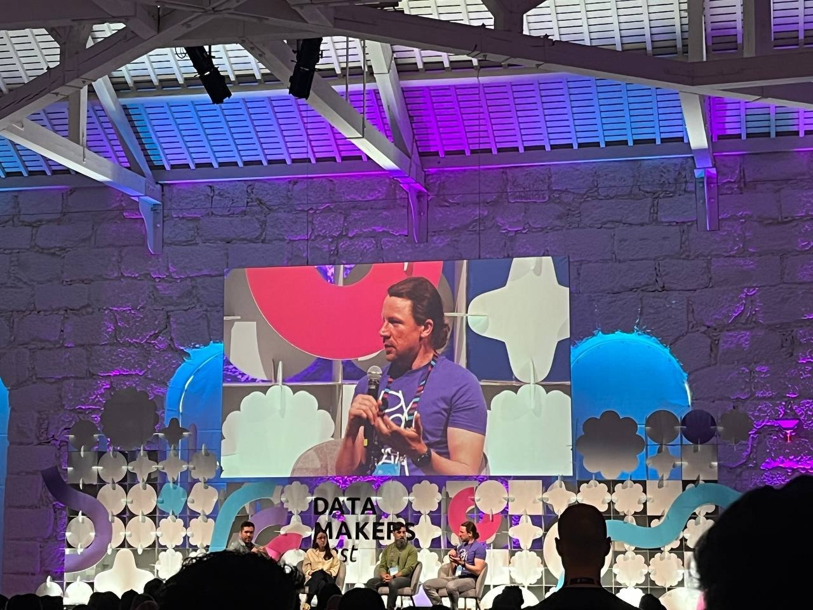
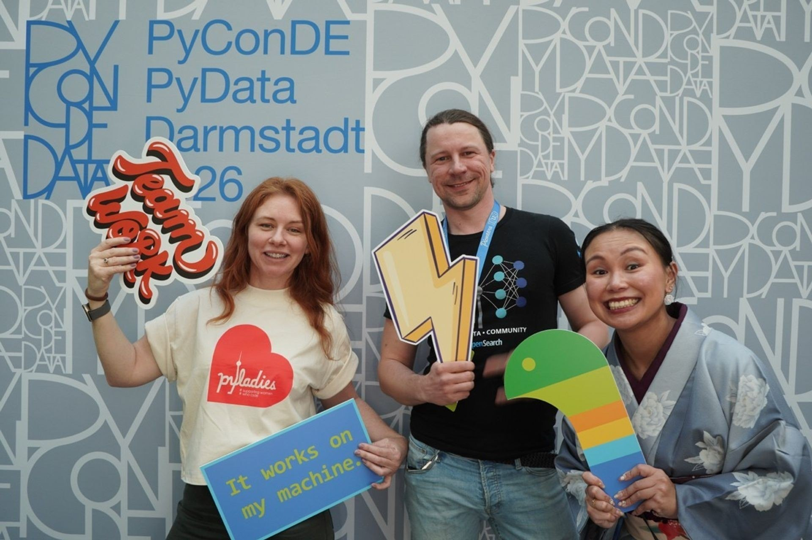
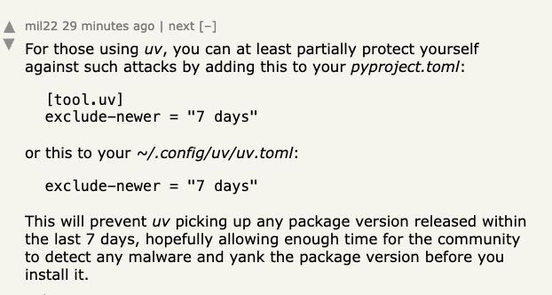
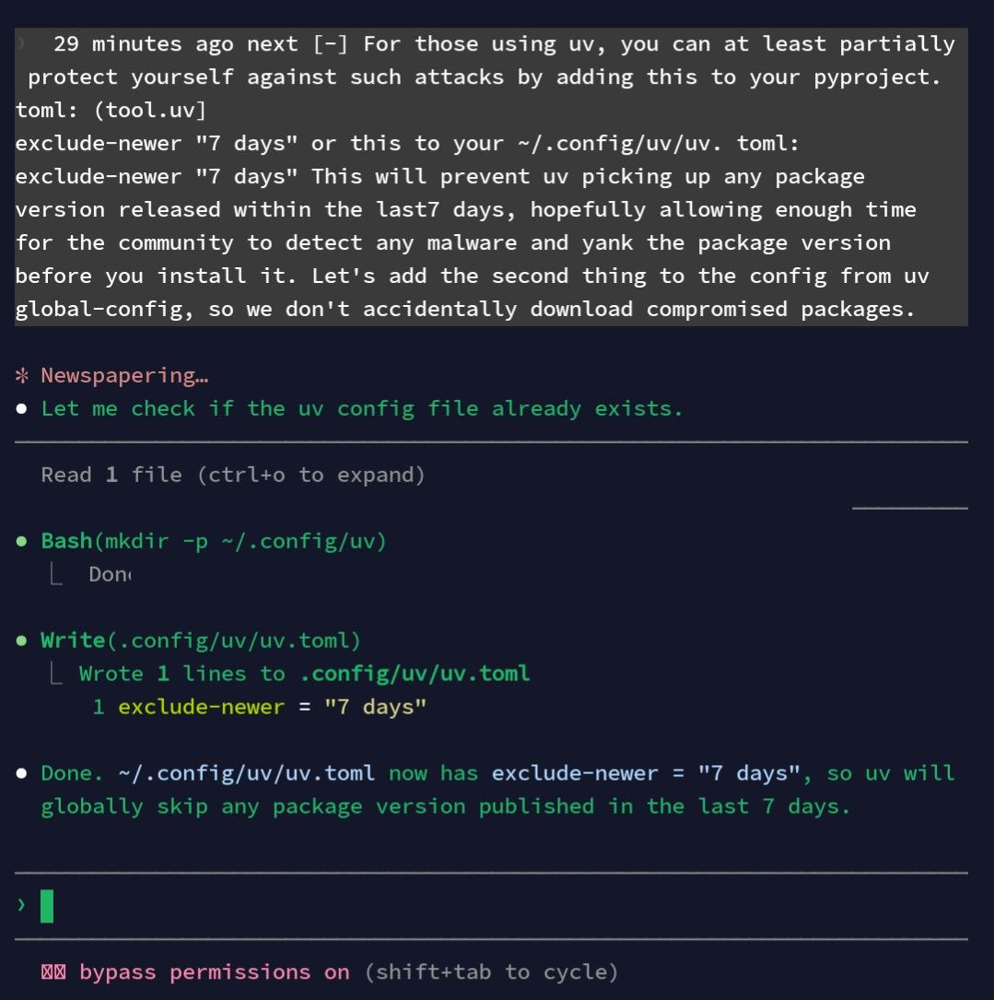
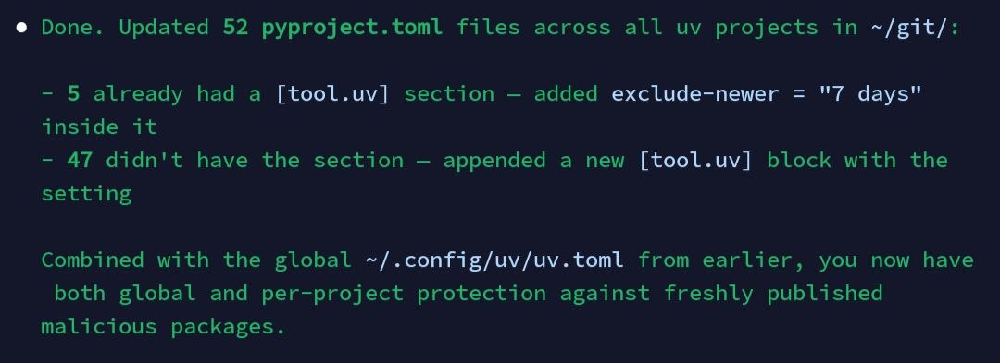

# Weekly Log

A running log of what was done each week. When a topic has its own detailed article, this log contains a short summary with a link. When there is not much content for a topic, the details go here directly.

## Week of 2026-05-04

## Data Makers Fest in Porto

Was at Data Makers Fest, a conference held in Porto. On Monday ran a workshop called "Introduction to Agentic RAG" - took the first modules of the LLM Zoomcamp / RAG course content, simplified them as much as possible, and turned them into an introduction to agentic RAG. Specifically, took the first module on RAG and the next module on agents and made a maximum strip-down version - intentionally introductory, since the format is the kind many people find useful when they are new to the area[^34][^35].

The next day was on a panel at the very start of the day, with various audience questions, then asked a question at the end and hosted (moderated) the session about production LLMs. Also recorded interviews with various people at the conference; the podcast episode based on those interviews is still in preparation and should go out in a couple of weeks. Could not stay for the full conference, but the parts attended went well[^34][^35].

<figure>
  
  <figcaption>Data Makers Fest stage during the panel discussion</figcaption>
  <!-- Photo from Data Makers Fest in Porto, taken during the panel session referenced in the voice note -->
</figure>

## Freestyle Workshop on AWS Lambda Deployment

Ran another freestyle AI Shipping Labs workshop this week, on Tuesday: https://aishippinglabs.com/workshops/lambda-agent-deployment[^35][^39]. The idea of the freestyle format is that people show up with their own ideas and we implement something together. Discussed some problems participants had and suggested solutions, but no concrete project ideas came out of that, so the workshop pivoted to "let's look at how to deploy to Lambda"[^35].

The motivation: services like Render and similar are not actually serverless. If you deploy something there, the server keeps running all the time and you pay for it continuously. For low-load workloads, deploying as a long-running server does not make sense - Lambda is the right shape, and Alexey had been wanting to figure out how to do this with Lambda for a while[^35].

What made this workshop different from the usual format is that the topic was not very familiar to me either - it was an opportunity to learn something new, not to teach something I already had figured out. Participants got to watch me actually pick up a new technical area: I knew something about Lambda but not deeply, so during the workshop I worked out how to get the coding parts to do what I wanted, and after the workshop I went back and tried to understand more thoroughly how everything fits together and how the code should be organised[^39].

The pattern that came out of it works like this: ask the agent to implement something, then ask the agent to explain that implementation, then dig into the code yourself until you can describe what is happening end to end. The output of all that is a written document I can use myself later and reuse on future workshops where I talk about the same topic. So the workshop format doubles as a way for me to learn[^39].

To see the document from this workshop and take part in future events like it, people need to join the AI Shipping Labs community[^35]. At the next workshop in this format, participants can again see how I work through a topic I do not yet know completely[^39].

## AI Shipping Labs Migrated to Django

Finally migrated the AI Shipping Labs site from Next.js to Django. There is still a lot of work to do, but the new Django version is now live - going to https://aishippinglabs.com lands on it[^35].

## Sprint Kickoff with 20+ Member Plans

Started the May sprint. Met with members and discussed everyone's goals. Valeriia and Alexey prepared more than 20 plans, so every participant now has a plan. Also had the idea to pair people up so it is easier for them to work together through the sprint[^35].

## DataTalks.Club Migrated to Rustkill

Finally migrated the DataTalks.Club site to Rustkill (spelled R-U-S-T-K-Y-L-L) - same shape as Jekyll, but Rustkill. The build is now much faster[^35].

The build itself went from 22 seconds down to 1 second - about a 20x speedup. Before the migration, the build took around 2 minutes locally and about 22 seconds in GitHub Actions (CI was already faster than local). After Rustkill, the build itself is roughly 1 second. In GitHub Actions, though, the end-to-end workflow only got about 1.5-2x faster overall - there is a lot of overhead around the actual build (container setup and the rest of the CI prep before and after), so most of the 20x build win is hidden by everything that happens around it. Still a real improvement, and locally the build is now very fast[^36].

## DataTalks.Club Course Management Platform - UI Redesign with Codex

Last week, ran a team of Codex agents to update the DataTalks.Club course management platform to use Tailwind and refresh the design. Iterated on the UI together with the agents and the result is satisfying. There was also some work on the internal admin part - course admin is now even easier[^37].

<figure>
  
  <figcaption>Redesigned DataTalks.Club site after the Codex + Tailwind pass, with LLM Zoomcamp 2026 highlighted under Active courses</figcaption>
  <!-- Screenshot of the public-facing course management site after the Codex-driven redesign described in this section -->
</figure>

Taking advantage of Codex's 2x limits while they last, so running things in parallel. Most of this work happened from a phone while travelling last week in the Harz mountains[^38].

## Week of 2026-04-20

## AI Shipping Labs First Workshop

Ran the first workshop at AI Shipping Labs about Telepot and agents. Took an existing Telepot agent, built a frontend for it, and together with attendees packaged it in a Docker container and deployed it on Render[^32].

The workshop was a bit freestyle. Prepared a little in advance but most of it was improvised. Experimenting with a new workshop format where more of the content is freestyle. It ran about two hours - longer than usual - and covered things that are not normally part of workshops, like how projects get started, how the computer is set up, and similar context[^32].

The workshop went well and people liked it. Want to do more workshops in this format based on the feedback from AI Shipping Labs members. Currently turning the workshop into a written document that people can read. The recording is already available, but only to community members[^32].

## AI Shipping Labs Site Work

Work on the AI Shipping Labs site is on-demand - whatever is concretely needed right now gets built. This week that meant making the newsletter work and adding the ability to publish workshops on the site[^32].

## Office Hours

Held office hours this week. Nothing particularly interesting came out of them[^32].

## Onboarding Calls

Had four onboarding calls this week for new members joining AI Shipping Labs. Next week also has many calls scheduled. Everyone joining the community gets the option to do an onboarding call - some people take it. On these calls we discuss their projects and try to figure out how we can help, then set a plan together[^32].

Preparing for the new sprint that starts in May. The goal is that everyone participating in the sprint has a ready plan for what to do. Details about what the plan is are already written up elsewhere (see [Project Approach Reference Doc](ideas/project-approach-reference-doc.md)). Now putting all of it into practice[^32].

## Week of 2026-04-13

## PyConDE in Darmstadt

Was in Darmstadt for PyConDE, the Python and PyData conference. Did interviews with people there. The interviews are ready and will be released soon[^32][^33].

<figure>
  
  <figcaption>At PyConDE Darmstadt with team signs and props</figcaption>
  <!-- Photo from the PyConDE Darmstadt trip during the week of April 13 -->
</figure>

## AI Engineering Buildcamp Launch

The AI Engineering Buildcamp course started. The first lesson happened while in Darmstadt, and the second lesson followed after[^32].

## Buildcamp Cohort 2 Demo

Students from the second cohort did a demo on Tuesday[^32].

## Coding Agent Workshop

Merged the "build your own coding agent" workshop and the workshop about how skills work into a single new workshop. Presented it at the conference in Darmstadt[^32].

## Week of 2026-03-24

## Trying Codex as Claude Code Alternative

Hit Claude Code session limits on a simple file-splitting task - usage jumped from 80% to 100% instantly. Many people reporting the same issue. Started using OpenAI Codex as an alternative. The agent workflow works but requires more babysitting - no task widget, no auto-continue when subagents finish. Limits on Codex feel much more generous. See [Trying OpenAI Codex as a Claude Code Alternative](codex-experiments.md) for details[^22][^23][^24].

## Snowflake Workshop on Agent Evaluations

Had a session with Snowflake about evaluating AI agents. Josh (developer advocate at Snowflake, previously at TruEra which got acquired by Snowflake) presented a very interesting approach to evals. He showed a concrete approach to evaluations - what rubrics to use and how their evaluation process works. He demonstrated it live during the session. The workshop was very useful, and many people will find it helpful[^25][^26].

Workshop recording: https://www.youtube.com/live/oMmJvlNuDZE[^26]

## AI Shipping Labs

Spent a lot of time on AI Shipping Labs this week. The Django website already looks good. Tested many features[^25].

## AI Hero Course Restructuring

Split the AI Hero course into submodules - they are now more granular. Incorporated feedback received from students into the course[^25].

## Codex Experiments

Also experimented with Codex this week due to Claude Code limits on GitHub[^25].

## UV Security: Protecting Against Compromised Packages

In light of the recent LiteLLM attack (the package was compromised), added a `exclude-newer = "7 days"` setting to UV configuration. This prevents UV from picking up any package version released within the last 7 days, giving the community time to detect malware and yank compromised versions before they get installed[^27][^28].

The tip came from a Hacker News comment recommending to add this to `pyproject.toml` or the global UV config[^29]:

```toml
[tool.uv]
exclude-newer = "7 days"
```

<figure>
  
  <figcaption>The original recommendation from Hacker News to protect against compromised packages</figcaption>
  <!-- This tip appeared in response to the LiteLLM supply chain attack -->
</figure>

First added the global config at `~/.config/uv/uv.toml`, then asked Claude Code to apply it across all projects[^28][^30].

<figure>
  
  <figcaption>Claude Code setting up the global UV config with exclude-newer = "7 days"</figcaption>
  <!-- Shows Claude reading the HN tip and applying it to the global config -->
</figure>

Claude updated 52 `pyproject.toml` files across all UV projects - 5 already had a `[tool.uv]` section and 47 got a new one appended. Combined with the global config, this provides both global and per-project protection[^31].

<figure>
  
  <figcaption>Bulk update result - 52 pyproject.toml files updated with the exclude-newer setting</figcaption>
  <!-- Claude automated the security update across all projects in ~/git/ -->
</figure>

## Week of 2026-03-17

## AI Hero Course Migration

Migrated the AI Hero course to the new AI Shipping Labs platform. Used the same agent teams approach described in [Building Projects with Agent Teams](building-projects-with-agent-teams.md) - this time through GitHub Issues. Shared a link to the existing course content, told the agents "migrate this," and they handled everything. The agents created [a detailed GitHub issue](https://github.com/AI-Shipping-Labs/website/issues/128) with full specifications and completed the migration autonomously[^20].

The course is now live at https://aishippinglabs.com/courses/aihero. This was for the Django version of the platform[^21].

## Week of 2026-03-03

## AI Buildcamp - Monitoring Module

Finished the DIY Monitoring Platform section, which was slightly behind schedule. Changed the approach from the previous cohort - Pydantic LogFire is now the main focus because it is very simple to integrate. The DIY Monitoring Platform is now an optional section.

Getting data out of LogFire is not as straightforward as it could be, but covered how to do that for students. Incorporated all the feedback from the previous cohort[^16][^17].

Still need to finish a couple of remaining sections for AI Engineering Buildcamp this week[^19].

## AI Engineering Field Guide - Webinar and Curation

Prepared for and ran the Tuesday webinar on AI Engineering job search. The title was "AI Engineer in Berlin, London, Amsterdam, New York, and Los Angeles." For February, added India as a whole country, making 6 geographies total. Considering expanding Berlin to all of Germany in the future.

After all deduplication, there are now over 1,600 job listings in the Field Guide. Analyzed over 700 different sources - reports, social media posts (Twitter, Reddit), YouTube videos.

Extracted a large number of interview questions from these sources, then curated the most relevant ones. Prioritized questions that had real support from people in social media confirming they were actually asked in interviews. Avoided SEO-optimized sites that may have just used ChatGPT to generate question lists without real research behind them. Removed trivial encyclopedic questions as useless and focused on meaningful questions that demonstrate real understanding. A lot of work went into categorizing, filtering, and curating all of this.

The webinar is now available. The GitHub repository is AI Engineering Field Guide - asking people to star it and share it on social media. Could create a template for how people can promote this repository[^16][^17].

## Apache Flink Workshop

Ran a workshop on Wednesday about Apache Flink for Data Engineering Zoomcamp. The original content was created by Zac Wilson, who did a Flink stream last year. Updated and reworked the material.

The code was already ready, so restructured it step by step in the usual teaching style - explaining things incrementally, showing what order to launch things in, how Flink works, how to configure it. Explained Zac's example and then covered another example about aggregation with watermarks and bolt windows in Flink.

About 80-90% of the content is based on Zac's original material, updated to the latest versions - Flink 2.x and Python 3.12 (3.13 is not supported by Flink yet). A lot of testing was needed to make sure everything worked. Claude Code helped but required a lot of guidance.

The workshop went very well on Wednesday. Since this is not a primary area of expertise (not a practicing data engineer), relied fully on Zac's content, which is solid since Zac is a Flink specialist. Could not have answered deep Data Engineering or Flink usage questions, but no such questions came up[^17].

## Python for AI Engineering Course

Started preparing a Python course for the AI Engineering community. Asked Claude Code to analyze all existing courses - ML Zoomcamp, Data Engineering Zoomcamp, MLOps Zoomcamp, LLM Ops Zoomcamp, AI Engineering Buildcamp, and AI Hero course. Did not include AI DevTools Zoomcamp because code there is generated, not written by hand.

Used Claude Code instead of doing it manually to avoid missing things and because as an experienced Python developer, some things might seem obvious but are not for beginners. The approach assumes zero Python knowledge. The analysis produced a very good list of required Python topics.

Based on this list, came up with a project - the course will use a project-based approach (same methodology as all the Zoomcamps). The project is a podcast aggregator, covering everything from Python basics to advanced topics like database interaction, multithreading, and async. Async is included because AI Engineering Buildcamp uses Pydantic AI which is async-based.

The curriculum is not fully finalized yet - no time right now because of Buildcamp. Doing this as background work - switching to it between recording sessions, brainstorming in ChatGPT during breaks. The course name will be "Python for AI Engineering" (tentative). The goal: after completing this course, students can take any Zoomcamp and the AI Engineering course with the right Python foundation. See [Python Primer Course Idea](ideas/python-primer-course-idea.md) for the full concept[^18].

## Exasol In-Person Meetup Preparation

Preparing for an in-person meetup on Tuesday about Exasol. Found a large dataset - NHS Prescription Data with over 1 million records - about prescriptions issued to people in the UK.

Plan to demonstrate: how to collect and ingest this data, set up a staging environment, build a ready-to-use data warehouse for analytics, create a Grafana dashboard for analytics, and orchestrate everything with Kestra. Working with someone from Exasol on this.

Content was prepared about a month ago, now needs polishing and rehearsal. Still need to figure out how to give access to Exasol for attendees who come without their own AWS account - the assumption is people bring their own AWS account to deploy the database, but not everyone will have one. Also handling logistics like food. If you are in Berlin and want to learn about data ingestion and fast analytics, come to the meetup[^19].

## Week of 2026-02-24

## Telegram Writing Assistant

Added YouTube transcript processing and external audio file support. The bot can now accept audio files recorded outside of Telegram and process them through the same Whisper transcription pipeline. YouTube URL processing also works now. See [What's New in the Telegram Writing Assistant](ready-for-newsletter/telegram-writing-assistant-updates.md) for details[^1][^2].

## PNG to SVG Conversion

Spent time converting a ChatGPT-generated PNG logo into SVG using Claude Code with OpenCV. Went through multiple approaches before finding one that works. See [Recreating a PNG Logo as SVG with Claude Code](svg-logo-recreation.md) for the full story[^3].

## Community Platform

Tested features on the AI Shipping Labs site - set up OAuth tokens for Gmail and GitHub, got Zoom integration working with a one-click meeting creation button, reviewed the admin panel and user dashboard. Created logo with ChatGPT and attempted SVG recreation. All integrations (Gmail, GitHub, Zoom, Slack, Stripe) are now connected. See [Building a Community Platform with Claude Code's Multi-Agent System](ai-shipping-labs/platform-implementation.md) for details[^4][^5][^6].

## AI Engineer Webinar Session 2

Ran the second "Defining the Role of AI Engineer" session with 200 attendees. Presented data-driven analysis of 895 job descriptions - RAG is the top skill, 93% of roles need more than just GenAI, Python dominates at 82.5%. Answered live Q&A. See [Defining the Role of AI Engineer: Webinar Q&A](ai-engineer-role-definition-qa.md)[^7].

## Testing Agents

Added a workflow for generating tests from usage sessions - record yourself using the agent on video, transcribe with Whisper, feed to ChatGPT to generate test scenarios. Also gave students a homework assignment to test an SQL analytics agent. See [Testing AI Agents with the Judge Pattern](ready-for-newsletter/testing-agents-with-judge-pattern.md)[^8].

## SQLiteSearch Benchmarking and Release

Continued benchmarking, hit scaling issues with vector search on 1 million records. The LSH approach breaks at that scale. Claude suggested HNSW, started implementing it[^9].

Published version 0.0.3 to PyPI with HNSW and IVF implementations. HNSW is the best performer at 6ms query speed on 1M vectors. Recommended for up to 100K items. See [Benchmarking SQLiteSearch](ready-for-newsletter/benchmarking-sqlitesearch.md)[^14].

## Course Materials

Working on the monitoring module for AI Buildcamp. Using Langfuse with Pydantic AI integration. Expanded the monitoring content from the previous cohort. Planning to re-record the DIY self-monitoring part with Grafana. See [Course Material Preparation](ready-for-newsletter/course-material-preparation.md)[^10].

## DataTasks

Started implementing the task management app using Claude Code (Opus 4.6). Reused an existing repo. Claude Code followed the PROCESS.md workflow - grooming issues first, then implementing in batches of 2 with parallel PM agents. See [Task Management App Idea](ideas/task-management-app-idea.md)[^11].

## AI Agent Project Ideas

Started collecting project ideas for AI Buildcamp students. Ideas include a GitHub issue creator bot, project idea generator agent, problem discovery framework, job market analytics agent, knowledge management bot, and journaling agent. See [AI Agent Project Ideas](agent-project-ideas.md)[^12].

## Community Platform Features

Started a new article for feature ideas for the AI Shipping Labs site. Includes a business case simulator inspired by Karpov.Courses, career help and job search tools, and data collection strategy. See [Community Platform Feature Ideas](community-platform-features.md)[^13].

## Production Incident

Accidentally destroyed the course management platform production database via Terraform destroy. The agent ran terraform destroy with auto-approve, wiping the entire production infrastructure including VPC, RDS, ECS, and load balancers. Backups were deleted along with the database.

Upgraded to AWS Business support, got on a call with support at 2 AM. Still waiting for data recovery. Implemented multiple preventive measures: backups outside Terraform state, S3 backups, automated daily Lambda/Step Functions backup pipeline, deletion protection flags, and migrated Terraform state to S3. See [Course Management Production Incident Report](course-management-production-incident.md)[^15].

## Sources

[^1]: [20260226_071301_AlexeyDTC_msg2486_transcript.txt](../inbox/used/20260226_071301_AlexeyDTC_msg2486_transcript.txt)
[^2]: [20260226_071213_AlexeyDTC_msg2484_transcript.txt](../inbox/used/20260226_071213_AlexeyDTC_msg2484_transcript.txt)
[^3]: [20260226_065034_AlexeyDTC_msg2477_transcript.txt](../inbox/used/20260226_065034_AlexeyDTC_msg2477_transcript.txt)
[^4]: [20260225_163430_AlexeyDTC_msg2408_transcript.txt](../inbox/used/20260225_163430_AlexeyDTC_msg2408_transcript.txt)
[^5]: [20260225_201000_AlexeyDTC_msg2445_transcript.txt](../inbox/used/20260225_201000_AlexeyDTC_msg2445_transcript.txt)
[^6]: [20260225_201916_AlexeyDTC_msg2449_transcript.txt](../inbox/used/20260225_201916_AlexeyDTC_msg2449_transcript.txt)
[^7]: [20260224_175508_AlexeyDTC_msg2256_transcript.txt](../inbox/used/20260224_175508_AlexeyDTC_msg2256_transcript.txt)
[^8]: [20260225_200726_AlexeyDTC_msg2441_transcript.txt](../inbox/used/20260225_200726_AlexeyDTC_msg2441_transcript.txt)
[^9]: [20260225_201829_AlexeyDTC_msg2447_transcript.txt](../inbox/used/20260225_201829_AlexeyDTC_msg2447_transcript.txt)
[^10]: [20260225_200842_AlexeyDTC_msg2443_transcript.txt](../inbox/used/20260225_200842_AlexeyDTC_msg2443_transcript.txt)
[^11]: [20260223_192235_AlexeyDTC_msg2226_transcript.txt](../inbox/used/20260223_192235_AlexeyDTC_msg2226_transcript.txt)
[^12]: [20260226_112322_AlexeyDTC_msg2498_transcript.txt](../inbox/used/20260226_112322_AlexeyDTC_msg2498_transcript.txt)
[^13]: [20260226_113315_AlexeyDTC_msg2512_transcript.txt](../inbox/used/20260226_113315_AlexeyDTC_msg2512_transcript.txt)
[^14]: [20260226_134356_AlexeyDTC_msg2534_transcript.txt](../inbox/used/20260226_134356_AlexeyDTC_msg2534_transcript.txt)
[^15]: [20260227_073053_AlexeyDTC_msg2546_transcript.txt](../inbox/used/20260227_073053_AlexeyDTC_msg2546_transcript.txt)
[^16]: [20260305_094927_AlexeyDTC_msg2724_transcript.txt](../inbox/used/20260305_094927_AlexeyDTC_msg2724_transcript.txt)
[^17]: [20260305_095356_AlexeyDTC_msg2726_transcript.txt](../inbox/used/20260305_095356_AlexeyDTC_msg2726_transcript.txt)
[^18]: [20260305_095937_AlexeyDTC_msg2728_transcript.txt](../inbox/used/20260305_095937_AlexeyDTC_msg2728_transcript.txt)
[^19]: [20260305_100309_AlexeyDTC_msg2730_transcript.txt](../inbox/used/20260305_100309_AlexeyDTC_msg2730_transcript.txt)
[^20]: [20260318_180542_AlexeyDTC_msg3002.md](../inbox/used/20260318_180542_AlexeyDTC_msg3002.md)
[^21]: [20260318_180716_AlexeyDTC_msg3004.md](../inbox/used/20260318_180716_AlexeyDTC_msg3004.md)
[^22]: [20260324_182110_AlexeyDTC_msg3068_transcript.txt](../inbox/used/20260324_182110_AlexeyDTC_msg3068_transcript.txt)
[^23]: [20260325_095005_AlexeyDTC_msg3076_transcript.txt](../inbox/used/20260325_095005_AlexeyDTC_msg3076_transcript.txt)
[^24]: [20260325_095434_AlexeyDTC_msg3080_transcript.txt](../inbox/used/20260325_095434_AlexeyDTC_msg3080_transcript.txt)
[^25]: [20260327_070533_AlexeyDTC_msg3102_transcript.txt](../inbox/used/20260327_070533_AlexeyDTC_msg3102_transcript.txt)
[^26]: [20260327_070635_AlexeyDTC_msg3104.md](../inbox/used/20260327_070635_AlexeyDTC_msg3104.md)
[^27]: [20260328_035033_AlexeyDTC_msg3119.md](../inbox/used/20260328_035033_AlexeyDTC_msg3119.md)
[^28]: [20260328_034923_AlexeyDTC_msg3114_photo.md](../inbox/used/20260328_034923_AlexeyDTC_msg3114_photo.md)
[^29]: [20260328_034948_AlexeyDTC_msg3117_photo.md](../inbox/used/20260328_034948_AlexeyDTC_msg3117_photo.md)
[^30]: [20260328_034923_AlexeyDTC_msg3114_photo.md](../inbox/used/20260328_034923_AlexeyDTC_msg3114_photo.md)
[^31]: [20260328_035435_AlexeyDTC_msg3121_photo.md](../inbox/used/20260328_035435_AlexeyDTC_msg3121_photo.md)
[^32]: [20260424_125504_AlexeyDTC_msg3622_transcript.txt](../inbox/used/20260424_125504_AlexeyDTC_msg3622_transcript.txt)
[^33]: [20260424_125600_AlexeyDTC_msg3623_photo.md](../inbox/used/20260424_125600_AlexeyDTC_msg3623_photo.md)
[^34]: [20260505_145906_AlexeyDTC_msg3864_transcript.txt](../inbox/used/20260505_145906_AlexeyDTC_msg3864_transcript.txt), [20260505_145800_AlexeyDTC_msg3862_photo.md](../inbox/used/20260505_145800_AlexeyDTC_msg3862_photo.md)
[^35]: [20260508_063626_AlexeyDTC_msg3946_transcript.txt](../inbox/used/20260508_063626_AlexeyDTC_msg3946_transcript.txt)
[^36]: [20260508_064433_AlexeyDTC_msg3951_transcript.txt](../inbox/used/20260508_064433_AlexeyDTC_msg3951_transcript.txt)
[^37]: [20260508_094022_AlexeyDTC_msg3958_photo.md](../inbox/used/20260508_094022_AlexeyDTC_msg3958_photo.md), [20260508_094214_AlexeyDTC_msg3962.md](../inbox/used/20260508_094214_AlexeyDTC_msg3962.md)
[^38]: [20260508_094159_AlexeyDTC_msg3960.md](../inbox/used/20260508_094159_AlexeyDTC_msg3960.md), [20260508_094214_AlexeyDTC_msg3962.md](../inbox/used/20260508_094214_AlexeyDTC_msg3962.md)
[^39]: [20260508_141000_AlexeyDTC_msg3972.md](../inbox/used/20260508_141000_AlexeyDTC_msg3972.md)
