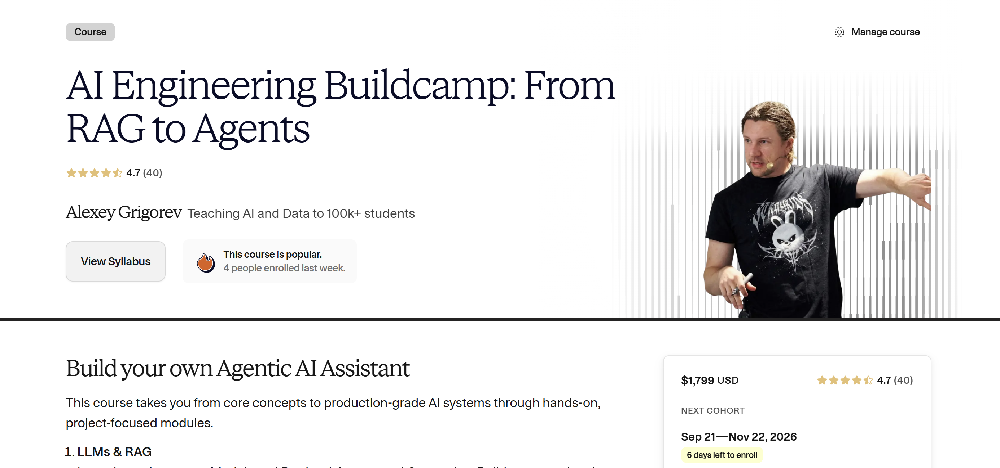
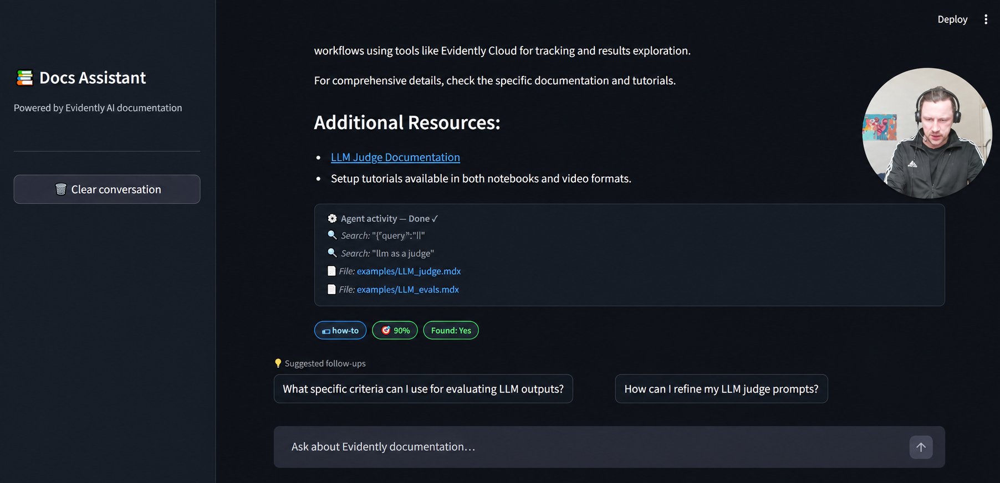
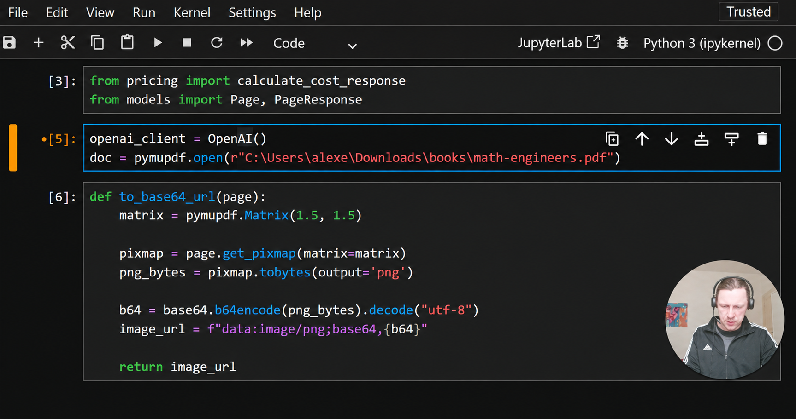
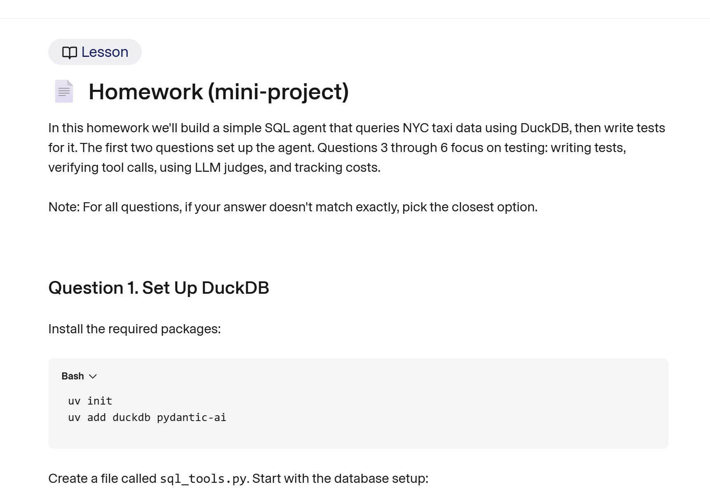
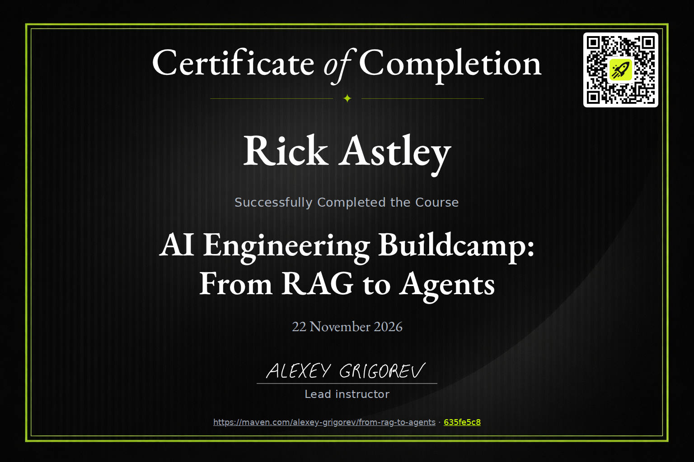
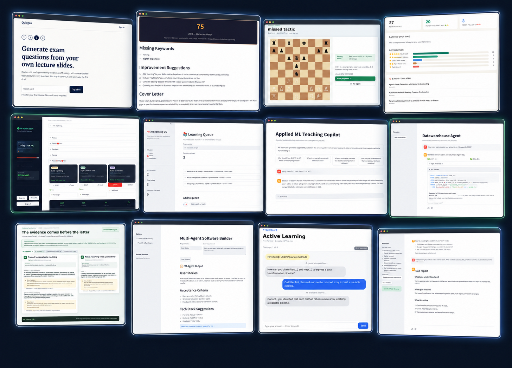
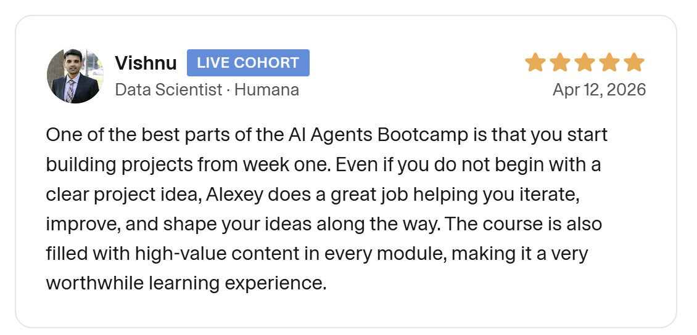
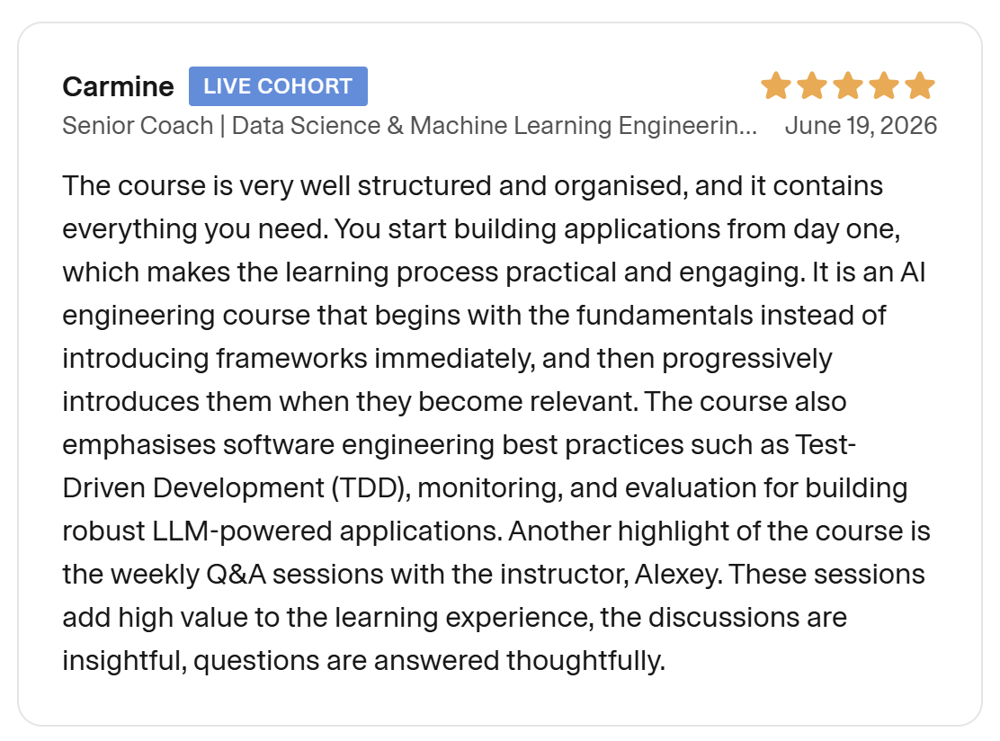
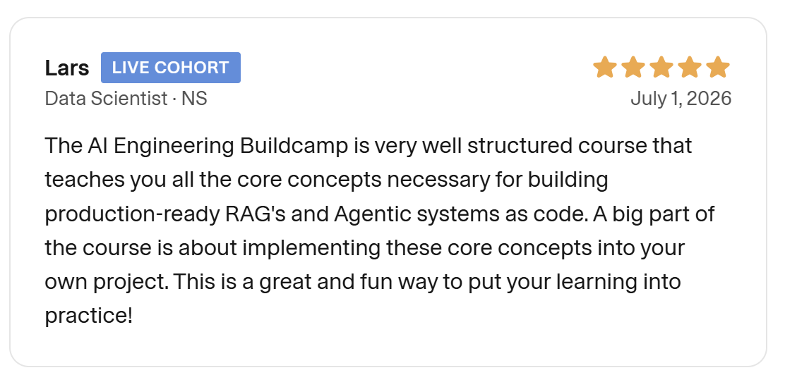
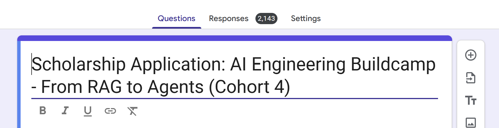

Next Monday (September 21), I start the next cohort [AI Engineering Buildcamp](https://maven.com/alexey-grigorev/from-rag-to-agents). It's goind to be the forth cohort of the course.

The course is a practical and hands-on introduction to AI Engineering. After finishing the course, you'll be able to create a project independently with tests, monitoring and a proper evaluation set. There are no slides in the course. Intead, we focus on coding a lot - also with help of AI assistants. 

I selected the topics for the course in such a way to give you a solid foundation to work as an AI Engineer and be able to ingerate AI into your product. 

<figure>
  
  <figcaption>AI Engineering Buildcamp cohort 4 runs Sep 21 to Nov 22, 2026</figcaption>
</figure>

In this post, I'll talk more about the course content, the projects from past cohorts, what participants say, and how to join.

In particular, I'll cover:

- what is AI Engineering Buildcamp 
- the running example, optional projects, and homework
- how the capstone works
- what people in the past cohorts built
- what participants say
- how to join Cohort 4

## AI Engineering Buildcamp

In AI Engineering Buildcamp you learn AI engineering by building. We take one step at at a time, and at the end arrive at a fully-working systme.

You'll work on many projects during the course:

- The key running example project that evolves through the course - the documentation agent.
- Each week, there will be a new homework project. You will have to complete it independently to solidify the learning from the lessons. 
- Optional example projects that show how the same ideas apply to other RAG and agent use cases
- Your capstone project, where you apply everything to a use case you choose

## 1. A Running Example Project

The running example through the course is the Documentation Agent. We index the Evidently documentation and build an AI agent on top of it.

This is a real support task many teams face. Users ask vague and incomplete questions about a product that keeps changing. Docs mix prose and code and config samples. Good answers need retrieval with filters and citations. They also need guardrails for off-topic questions. The same pattern transfers to internal knowledge bases and customer support and onboarding assistants.

<figure>
  
  <figcaption>Docs Assistant answers from Evidently docs with search activity and cited files</figcaption>
</figure>

Each week we add more to this agent:

- Week 1 lays the foundation. It covers LLMs, the OpenAI API, RAG, and search. We index the docs and build a first RAG app to answer questions about them. From week 1, you already have a usable AI system.
- Week 2 helps you catch up on week 1 materials. It adds more examples to strengthen your understanding of RAG.
- Week 3 adds agentic capabilities. We turn the RAG app into an agent that can explore the docs database.
- Week 4 focuses on reliability. We add tests to verify that the agent works as intended. This includes classical unit tests and LLM-based judges.
- Week 5 focuses on monitoring. You see how the agent behaves in production. You collect the info you need to observe and debug it.
- Week 6 adds systematic evaluation. You learn to evaluate agents with a human in the loop. You create judges that mimic human evaluators and use synthetic data.

After six week, we'll go through the same progression as any serious AI application: from simple RAG to a tool-using agent that we test, monitor and evaluate.

## 2. Optional Projects

If the main example is not enough, there are more optional projects that you can learn from.

For RAG, we'll cover:

- FAQ Assistant: a chatbot for course FAQ data that uses RAG with boosting and filtering
- YouTube Transcript Summarizer: a system that extracts summaries and chapter structure from YouTube videos with structured output
- PDF Book Processor: a workflow for parsing a complex PDF, such as a book with math formulas and non-trivial layout. This kind of task often appears in take-home assignments and interviews.

<figure>
  
  <figcaption>PDF Book Processor parses a math book page by page for RAG</figcaption>
</figure>

We'll have a few agent applications too:

- Web Search Agent: an agent that uses web search tools to find and filter and synthesize info from the internet
- YouTube Researcher: an agent that searches YouTube and fetches transcripts and produces structured research summaries
- Coding Agent: a functional coding agent that scaffolds Django applications
- Code Analysis Agent: an agent for analyzing and understanding codebases
- Deep Research Agent: a multi-stage research system that starts with broad search and expands into follow-up queries. It goes deeper into promising directions and fact-checks findings and generates a final article.

## 3. Homework Projects

The core weeks (weeks 1-6) end with a separate homework mini-project.

To solidify what you learned in the lessons, you'll need to build another system yourself:

- Weeks 1 to 2: document processing with AI. You download books and extract PDF text and chunk docs and build a full RAG pipeline.
- Week 3: Wikipedia Agent. You implement search and page-fetching tools and build an agent with a framework of your choice.
- Week 4: testing through the DuckDB SQL Agent. You build an agent that translates natural language into SQL. You write pytest tests and add LLM judges and track costs.
- Week 5: Trivia Quizmaster Agent. You build an interactive trivia system and add monitoring it.
- Week 6: systematic evaluation through the Recipe Assistant Evaluation. You design 20 plus evaluation scenarios and run batch tests and detect hallucinations.

<figure>
  
  <figcaption>Homework mini-project with a SQL agent over NYC taxi data</figcaption>
</figure>

## 4. Capstone Project

On top of that, you work on your capstone during the course.

I want to help you to start with your capstone from day one and start building your project layer by layer.:

- Weeks 1 to 2: define the use case and build the first working version with RAG
- Week 3: make it agentic by adding tools. At this stage, your project moves beyond answering questions. It becomes a system that can make decisions.
- Week 4: make it reliable by adding testing
- Week 5: monitor it and start collecting logs from user interactions
- Week 6: evaluate the project based on collected interactions and user scenarios you generated
- Weeks 7 and 8: polish and extend and deploy the project
- Week 9: present the result and get peer feedback and continue developing it

My main focus for this cohort will be to make sure more people finish with a project. In the previous cohorts, some participants waited too long to decide what to build, and in the end they run out of time without submitting a project.

I want to address that directly. I will encourage to work on your projects from day 1.

If you already have an idea, I'll share a framework and a set of instructions for your coding agent to implement it as quickly as possible.

If you don't have an idea yet, I'll share my design thinking approach to help you find something meaningful to solve.

I already used this approach in the last cohort, and one of the course graduates, Amar Agrawal, created a special app based on this approach: [Project Ideation Tool](https://project-ideation-tool.streamlit.app/).

## Certificate

If you finish the project and do 3 peer reviews, you will get a certificate signed by me.

<figure>
  
  <figcaption>Sample certificate of completion for AI Engineering Buildcamp</figcaption>
</figure>

The certificate confirms that you shipped a capstone.

## Past projects

<figure>
  
  <figcaption>Cohort 3 capstones, from exam generation and job tools to chess coaching and learning apps</figcaption>
</figure>

I have already descibed what people from the past cohorts build.

Here are the articles:

- Cohort 1: [5 ideas for AI agents](https://aishippingblog.com/p/5-ideas-for-ai-agents-and-openais).
- Cohort 2: [9 Real-Life AI Projects from AI Engineering Buildcamp Graduates](https://aishippingblog.com/p/9-real-life-ai-projects-from-ai-engineering).
- Cohort 3: [13 AI Projects from AI Engineering Buildcamp](https://aishippingblog.com/p/13-ai-projects-from-ai-engineering).

I'm looking forward to seeing what you will build in Cohort 4! 

## What participants say

Here is what past participants say about the course.

Vishnu, Data Scientist at Humana, joined cohort 2.

<figure>
  
  <figcaption>Vishnu on starting in week one and shaping the project idea</figcaption>
</figure>

Carmine, Senior Coach, Data Science and ML Engineer, joined cohort 3.

<figure>
  
  <figcaption>Carmine on structure and building from day one</figcaption>
</figure>

Lars, Data Scientist at NS, joined cohort 3.

<figure>
  
  <figcaption>Lars on learning RAG and agents through his own project</figcaption>
</figure>

You can find more reviews in the testimonial section of [the course page](https://maven.com/alexey-grigorev/from-rag-to-agents).

## Weekly Workload

The course lasts about nine weeks. It runs September 21 to November 22, 2026. It is designed for working professionals, but it still requires a meaningful commitment.

Most of the work is asynchronous. Each week features pre-recorded lessons and practical exercises and homework. Depending on your background and pace, this usually takes 3 to 10 hours per week. Project work takes 10 to 20 hours per week, distributed through the course.

There is one live session each week, mainly for office hours. This is when you can ask technical questions and discuss architecture decisions and receive feedback on your projects from me. I record these sessions and share them with everyone, along with a written summary.

This is not a passive course. It is intended for people who want to spend real time building and debugging, rather than just watching explanations and taking notes.

## Scholarship

The scholarship form closed today. I received over 2,100 submissions. Selecting recipients was extremely difficult.

<figure>
  
  <figcaption>Scholarship applications for cohort 4 closed with 2,143 responses</figcaption>
</figure>

Today I contacted the people who were selected. If you do not see an email from me, you were not selected this time. I can not write to everyone individually.

If you applied and opted in for updates, I added you to this newsletter. That is why you see this email now. Thanks for all your applications.

When deciding, I focused on existing impact. I looked for people already doing something and helping their local community. I prioritized regions where the course price is hard to afford.

## Ways to Join

The standard price of the course is 1,799 USD.

1. You can use your company learning budget to cover the cost. I wrote a [short guide](https://aishippinglabs.com/blog/how-to-join-ai-engineering-buildcamp) with an email template you can use to reach out to your manager. Maven also has [their own guide](https://maven.com/expense).
2. You can get a team discount. Teams of 2 to 9 get 20 percent off. Teams of 10 plus get 25 percent off.
3. I also provide full and partial scholarships for each cohort. For cohort 4, the form is already closed. See the Scholarship section above for details.
4. If none of the options above work for you, you can use the SUBSTACK code to get a 20% discount.

[Enroll now](https://maven.com/alexey-grigorev/from-rag-to-agents)

If you need a student discount or PPP pricing or have any questions about the joining options, contact me at alexey@datatalks.club, and I'll help you.

## Join the Course

AI Engineering Buildcamp is designed for hands-on learning. You will develop your own capstone project and complete mini-projects for homework and engage in optional practical projects. You will gain experience with RAG and agents and testing and observability and evaluation and deployment.

If you have been thinking about joining, registration is open until September 21.

[Join the course now](https://maven.com/alexey-grigorev/from-rag-to-agents)
